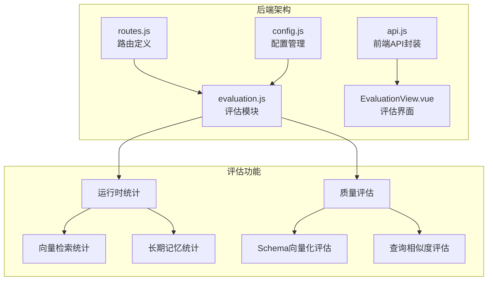
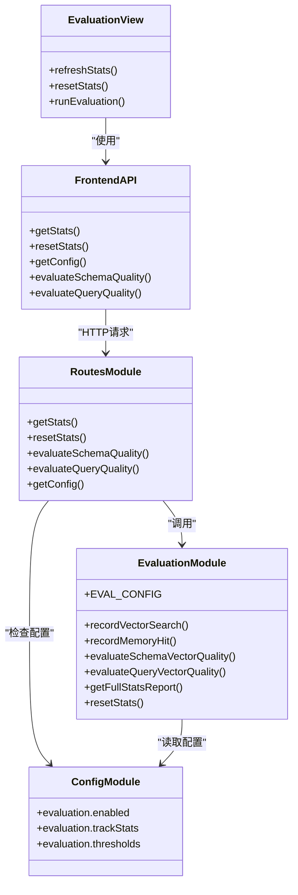

# 评估统计接口

<cite>
**本文档引用的文件**
- [evaluation.js](file://backend/src/utils/evaluation.js)
- [routes.js](file://backend/src/core/routes.js)
- [config.js](file://backend/src/core/config.js)
- [EvaluationView.vue](file://frontend/src/views/EvaluationView.vue)
- [api.js](file://frontend/src/utils/api.js)
</cite>

## 目录
1. [简介](#简介)
2. [项目结构](#项目结构)
3. [核心组件](#核心组件)
4. [架构概览](#架构概览)
5. [详细组件分析](#详细组件分析)
6. [依赖关系分析](#依赖关系分析)
7. [性能考虑](#性能考虑)
8. [故障排除指南](#故障排除指南)
9. [结论](#结论)

## 简介

NL2SQL评估统计接口是一个专门用于监控和评估系统性能的模块化组件。该接口提供了三个核心端点，用于获取运行时统计信息、重置统计数据以及执行向量化质量评估。系统设计遵循非侵入性原则，确保评估功能不会影响主业务流程的正常运行。

评估系统主要包含两大功能模块：
- **运行时统计**：实时监控向量检索命中率、查询历史命中率和长期记忆命中率
- **Schema向量化质量评估**：通过机器学习模型评估Schema向量的质量和相似度

## 项目结构

评估统计接口位于后端服务的特定模块中，采用模块化设计，便于维护和扩展。



**图表来源**
- [routes.js:718-856](file://backend/src/core/routes.js#L718-L856)
- [evaluation.js:1-488](file://backend/src/utils/evaluation.js#L1-L488)

**章节来源**
- [routes.js:1-1037](file://backend/src/core/routes.js#L1-L1037)
- [evaluation.js:1-488](file://backend/src/utils/evaluation.js#L1-L488)

## 核心组件

评估统计接口包含以下核心组件：

### 1. 运行时统计组件
- **向量检索统计**：跟踪Schema和查询向量的检索命中情况
- **距离分布统计**：记录向量距离的分布情况
- **长期记忆统计**：监控不同类型记忆的命中率

### 2. 质量评估组件
- **Schema向量化评估**：评估表级向量的检索准确性
- **查询相似度评估**：测量查询历史的语义相似度
- **阈值管理系统**：基于配置的评估阈值

### 3. 配置管理组件
- **环境变量配置**：支持动态启用/禁用评估功能
- **阈值配置**：可配置的评估标准
- **统计跟踪配置**：控制运行时统计的记录

**章节来源**
- [evaluation.js:19-60](file://backend/src/utils/evaluation.js#L19-L60)
- [config.js:342-354](file://backend/src/core/config.js#L342-L354)

## 架构概览

评估统计接口采用分层架构设计，确保功能分离和代码复用。

```mermaid
sequenceDiagram
participant Client as 客户端
participant Routes as 路由层
participant Eval as 评估模块
participant Config as 配置模块
participant VectorDB as 向量数据库
Client->>Routes : GET /api/evaluation/stats
Routes->>Eval : getFullStatsReport()
Eval->>Eval : getVectorSearchStats()
Eval->>Eval : getLongTermMemoryStats()
Eval-->>Routes : 统计报告
Routes-->>Client : JSON响应
Client->>Routes : POST /api/evaluation/schema-quality
Routes->>Config : 检查评估配置
Config-->>Routes : 配置状态
Routes->>Eval : evaluateSchemaVectorQuality()
Eval->>VectorDB : 搜索Schema向量
VectorDB-->>Eval : 搜索结果
Eval-->>Routes : 评估结果
Routes-->>Client : JSON响应
```



**图表来源**
- [routes.js:726-803](file://backend/src/core/routes.js#L726-L803)
- [evaluation.js:158-266](file://backend/src/utils/evaluation.js#L158-L266)

## 详细组件分析

### 1. 运行时统计接口

#### GET /api/evaluation/stats

**功能描述**：获取完整的运行时统计报告，包括向量检索命中率、记忆命中率和系统配置信息。

**请求参数**：无

**响应格式**：
```json
{
  "success": true,
  "data": {
    "vectorSearch": {
      "schema": {
        "searches": 0,
        "hits": 0,
        "hitRate": 0.0
      },
      "query": {
        "searches": 0,
        "hits": 0,
        "hitRate": 0.0
      },
      "distanceDistribution": {
        "veryClose": 0,
        "close": 0,
        "moderate": 0,
        "far": 0
      }
    },
    "longTermMemory": {
      "overall": {
        "hitRate": 0,
        "totalQueries": 0,
        "totalHits": 0,
        "totalMisses": 0
      },
      "byType": [
        {
          "type": "field_alias",
          "hitRate": 0,
          "hits": 0,
          "misses": 0
        }
      ]
    },
    "generatedAt": "2024-01-01T00:00:00.000Z",
    "config": {
      "enabled": false,
      "trackStats": false
    }
  }
}
```

**错误码**：
- 500：服务器内部错误

**章节来源**
- [routes.js:726-740](file://backend/src/core/routes.js#L726-L740)
- [evaluation.js:397-407](file://backend/src/utils/evaluation.js#L397-L407)

### 2. 数据重置接口

#### POST /api/evaluation/stats/reset

**功能描述**：重置所有运行时统计数据，包括向量检索统计和长期记忆统计。

**请求参数**：无

**响应格式**：
```json
{
  "success": true,
  "message": "统计数据已重置"
}
```

**错误码**：
- 500：服务器内部错误

**章节来源**
- [routes.js:746-760](file://backend/src/core/routes.js#L746-L760)
- [evaluation.js:412-429](file://backend/src/utils/evaluation.js#L412-L429)

### 3. Schema向量化质量评估接口

#### POST /api/evaluation/schema-quality

**功能描述**：执行Schema向量化质量评估，评估表级向量的检索准确性。

**请求参数**：
```json
{
  "testQueries": [
    {
      "query": "查询语句",
      "expectedTables": ["表名1", "表名2"]
    }
  ]
}
```

**响应格式**：
```json
{
  "success": true,
  "data": {
    "total": 8,
    "correct": 0,
    "partial": 0,
    "incorrect": 8,
    "details": [
      {
        "query": "昨天渠道520的新注册用户有多少",
        "expected": ["tzpingtai_tz_sdk_log_pf_reg"],
        "retrieved": ["tzpingtai_tz_sdk_log_pf_reg"],
        "precision": 1,
        "recall": 1,
        "f1Score": 1,
        "top1Correct": true
      }
    ],
    "accuracy": 0,
    "avgPrecision": 0,
    "avgRecall": 0,
    "avgF1": 0
  }
}
```

**错误码**：
- 403：评估功能未启用
- 500：服务器内部错误

**章节来源**
- [routes.js:771-803](file://backend/src/core/routes.js#L771-L803)
- [evaluation.js:158-266](file://backend/src/utils/evaluation.js#L158-L266)

### 4. 查询相似度评估接口

#### POST /api/evaluation/query-quality

**功能描述**：评估查询历史的向量化质量，测量相似查询的语义相似度。

**请求参数**：
```json
{
  "testPairs": [
    {
      "query1": "查询语句1",
      "query2": "查询语句2",
      "expectedSimilarity": 0.9
    }
  ]
}
```

**响应格式**：
```json
{
  "success": true,
  "data": {
    "total": 5,
    "highSimilarity": 0,
    "mediumSimilarity": 0,
    "lowSimilarity": 5,
    "details": [
      {
        "query1": "昨天收入多少",
        "query2": "昨日的营收数据",
        "expectedSimilarity": 0.9,
        "actualSimilarity": 0.95,
        "error": 0.05
      }
    ],
    "avgError": 0.05
  }
}
```

**错误码**：
- 403：评估功能未启用
- 500：服务器内部错误

**章节来源**
- [routes.js:814-841](file://backend/src/core/routes.js#L814-L841)
- [evaluation.js:276-334](file://backend/src/utils/evaluation.js#L276-L334)

### 5. 配置查询接口

#### GET /api/evaluation/config

**功能描述**：获取评估系统的配置信息。

**请求参数**：无

**响应格式**：
```json
{
  "success": true,
  "data": {
    "enabled": false,
    "trackStats": false,
    "thresholds": {
      "highSimilarity": 0.8,
      "mediumSimilarity": 0.5,
      "highQuality": 0.8,
      "mediumQuality": 0.5
    }
  }
}
```

**错误码**：
- 500：服务器内部错误

**章节来源**
- [routes.js:847-856](file://backend/src/core/routes.js#L847-L856)
- [config.js:342-354](file://backend/src/core/config.js#L342-L354)

## 依赖关系分析

评估统计接口涉及多个模块之间的复杂依赖关系。



**图表来源**
- [evaluation.js:465-487](file://backend/src/utils/evaluation.js#L465-L487)
- [routes.js:726-856](file://backend/src/core/routes.js#L726-L856)
- [config.js:342-354](file://backend/src/core/config.js#L342-L354)

### 关键依赖关系

1. **配置依赖**：评估模块依赖配置模块来控制功能启用状态
2. **路由依赖**：路由层负责HTTP请求处理和参数验证
3. **前端依赖**：前端组件通过API封装层与后端交互
4. **统计依赖**：运行时统计依赖LLM服务和向量存储

**章节来源**
- [routes.js:28-29](file://backend/src/core/routes.js#L28-L29)
- [evaluation.js:12-13](file://backend/src/utils/evaluation.js#L12-L13)

## 性能考虑

评估统计接口在设计时充分考虑了性能优化：

### 1. 非侵入式设计
- 评估功能默认禁用，避免影响生产环境性能
- 统计记录采用轻量级实现，失败不影响主流程
- 异步评估操作，不阻塞主线程

### 2. 内存管理
- 运行时统计数据存储在内存中，避免磁盘I/O开销
- 支持手动重置统计数据，防止内存泄漏
- 合理的阈值配置，平衡精度和性能

### 3. 缓存策略
- 配置信息支持缓存，减少重复读取
- 向量搜索结果支持智能缓存
- 评估结果可选择性缓存

## 故障排除指南

### 常见问题及解决方案

#### 1. 评估功能未启用
**症状**：调用评估接口返回403错误
**原因**：EVALUATION_ENABLED环境变量未设置为true
**解决方案**：
```bash
# 设置环境变量
export EVALUATION_ENABLED=true
export EVALUATION_TRACK_STATS=true
```

#### 2. 向量评估失败
**症状**：Schema质量评估返回错误
**原因**：LLM服务不可用或向量存储异常
**解决方案**：
- 检查LLM API配置
- 验证向量数据库连接
- 确认Schema向量化已完成

#### 3. 统计数据异常
**症状**：统计结果显示异常值
**原因**：统计记录出现异常或数据竞争
**解决方案**：
- 重置统计数据：POST /api/evaluation/stats/reset
- 检查并发访问控制
- 验证统计记录逻辑

#### 4. 前端显示问题
**症状**：评估页面无法显示统计数据
**原因**：API调用失败或网络问题
**解决方案**：
- 检查后端服务状态
- 验证CORS配置
- 查看浏览器开发者工具

**章节来源**
- [routes.js:773-778](file://backend/src/core/routes.js#L773-L778)
- [evaluation.js:412-429](file://backend/src/utils/evaluation.js#L412-L429)

## 结论

NL2SQL评估统计接口提供了一个完整、可靠的系统监控和质量评估解决方案。通过模块化设计和非侵入式实现，该接口能够在不影响主业务流程的情况下提供详细的性能洞察。

### 主要优势

1. **模块化设计**：清晰的功能分离，便于维护和扩展
2. **非侵入性**：评估功能可随时启用/禁用，不影响生产环境
3. **全面监控**：涵盖向量检索、记忆命中和质量评估等多个维度
4. **灵活配置**：支持动态阈值配置和统计跟踪控制

### 应用场景

- **开发调试**：监控向量化效果和系统性能
- **生产监控**：持续跟踪系统健康状况
- **质量保证**：定期评估向量化质量
- **性能优化**：识别系统瓶颈和改进机会

该接口为NL2SQL系统提供了强大的监控和评估能力，是确保系统稳定性和性能的重要组成部分。