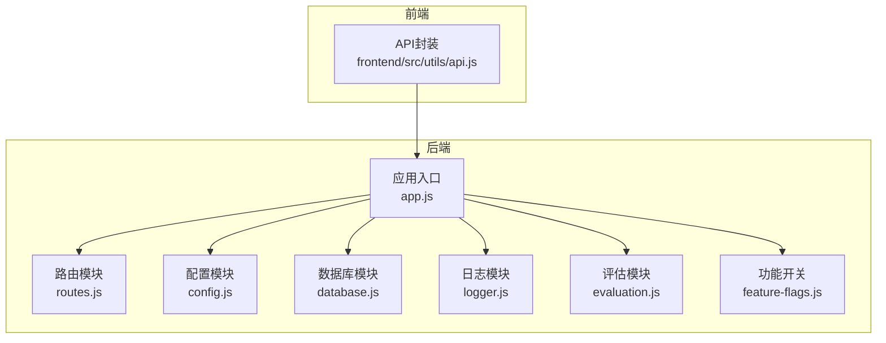
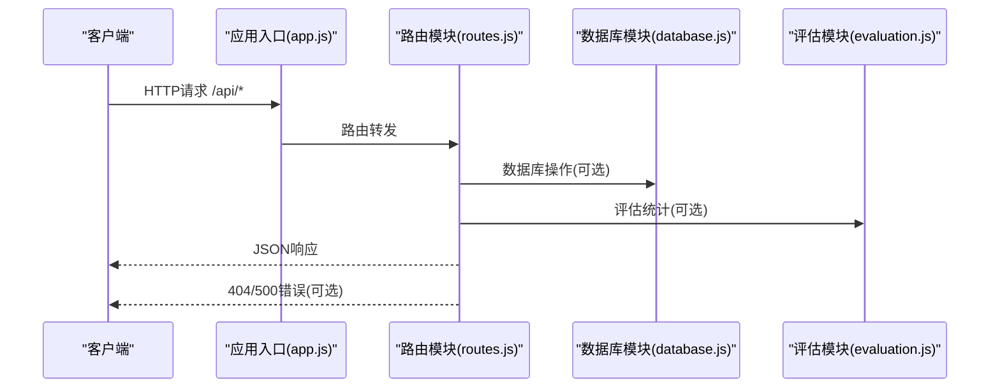
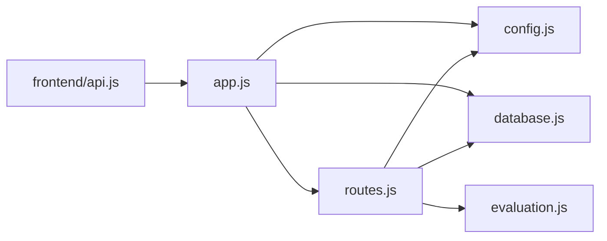

# 路由设计与API组织

<cite>
**本文引用的文件**
- [routes.js](file://backend/src/core/routes.js)
- [app.js](file://backend/src/app.js)
- [config.js](file://backend/src/core/config.js)
- [database.js](file://backend/src/core/database.js)
- [logger.js](file://backend/src/utils/logger.js)
- [evaluation.js](file://backend/src/utils/evaluation.js)
- [feature-flags.js](file://backend/config/feature-flags.js)
- [schema-metadata.json](file://backend/config/schema-metadata.json)
- [business-semantic-layer.json](file://backend/config/business-semantic-layer.json)
- [api.js](file://frontend/src/utils/api.js)
- [package.json](file://backend/package.json)
</cite>

## 目录
1. [简介](#简介)
2. [项目结构](#项目结构)
3. [核心组件](#核心组件)
4. [架构概览](#架构概览)
5. [详细组件分析](#详细组件分析)
6. [依赖分析](#依赖分析)
7. [性能考量](#性能考量)
8. [故障排查指南](#故障排查指南)
9. [结论](#结论)
10. [附录](#附录)

## 简介
本文件面向NL2SQL项目的后端路由与API组织，系统化阐述RESTful API设计原则、路由模块划分、端点规范、错误处理与版本控制策略，并提供使用示例与最佳实践。目标读者既包括开发者也包括需要理解API交互的非技术用户。

## 项目结构
后端采用Express框架，通过单一路由模块集中定义所有API端点，并在应用入口统一挂载到/api前缀下。核心模块包括：
- 路由模块：集中定义所有REST端点
- 应用入口：初始化数据库、向量库、配置与中间件，并挂载路由
- 配置模块：统一管理运行参数与安全策略
- 数据库模块：SQLite会话与历史表结构定义
- 日志模块：统一日志输出与追踪
- 评估模块：向量化质量与记忆命中率统计
- 功能开关：渐进式功能启用与回滚

图表来源
- [app.js:78-80](file://backend/src/app.js#L78-L80)
- [routes.js:1-1037](file://backend/src/core/routes.js#L1-L1037)

章节来源
- [app.js:78-80](file://backend/src/app.js#L78-L80)
- [routes.js:1-1037](file://backend/src/core/routes.js#L1-L1037)

## 核心组件
- 路由模块(routes.js)：定义全部REST端点，包含健康检查、Schema管理、会话管理、查询历史、偏好与记忆、评估、统计、配置以及SSE流式接口。
- 应用入口(app.js)：初始化数据库与向量库、加载Schema与业务语义层、挂载路由、启动HTTP服务器。
- 配置模块(config.js)：集中管理LLM、数据库、安全、会话、日志、自修复、Schema、长期记忆、上下文管理与评估等配置。
- 数据库模块(database.js)：定义SQLite表结构（会话、消息、查询历史、用户偏好、系统日志）及索引。
- 日志模块(logger.js)：统一日志级别、文件轮转、结构化输出与执行追踪。
- 评估模块(evaluation.js)：向量化质量评估与运行时统计。
- 功能开关(feature-flags.js)：渐进式启用新功能，支持快速回滚。

章节来源
- [routes.js:1-1037](file://backend/src/core/routes.js#L1-L1037)
- [app.js:97-188](file://backend/src/app.js#L97-L188)
- [config.js:16-355](file://backend/src/core/config.js#L16-L355)
- [database.js:39-195](file://backend/src/core/database.js#L39-L195)
- [logger.js:54-442](file://backend/src/utils/logger.js#L54-L442)
- [evaluation.js:19-122](file://backend/src/utils/evaluation.js#L19-L122)
- [feature-flags.js:16-249](file://backend/config/feature-flags.js#L16-L249)

## 架构概览
后端通过Express创建HTTP服务器，所有API统一挂载在/api前缀下。路由模块按功能域划分，包含Schema、会话、查询历史、偏好与记忆、评估、统计、配置与SSE流式接口。全局中间件负责请求日志与错误处理。

图表来源
- [app.js:78-80](file://backend/src/app.js#L78-L80)
- [routes.js:1012-1030](file://backend/src/core/routes.js#L1012-L1030)

章节来源
- [app.js:78-80](file://backend/src/app.js#L78-L80)
- [routes.js:1012-1030](file://backend/src/core/routes.js#L1012-L1030)

## 详细组件分析

### 健康检查接口
- 端点：GET /api/health
- 功能：返回服务基本健康状态、版本、运行时间与内存使用。
- 响应：包含状态、时间戳、版本、运行时长与内存使用信息。
- 适用场景：服务监控与容器编排健康探针。

章节来源
- [routes.js:72-94](file://backend/src/core/routes.js#L72-L94)

### 详细健康检查接口
- 端点：GET /api/health/detail
- 功能：返回数据库、LLM、Schema、SSE连接等组件状态。
- 响应：包含组件状态与连接数等。
- 适用场景：运维诊断与故障定位。

章节来源
- [routes.js:100-137](file://backend/src/core/routes.js#L100-L137)

### Schema管理接口
- 端点：GET /api/schema
  - 查询参数：type（tables|metrics|dimensions）
  - 功能：返回完整Schema或按类型筛选。
- 端点：GET /api/schema/tables/:tableName
  - 功能：返回指定表详情与关联表。
- 端点：GET /api/schema/search
  - 查询参数：q（关键词）、limit（默认5）
  - 功能：基于向量检索搜索相关表。

章节来源
- [routes.js:150-250](file://backend/src/core/routes.js#L150-L250)

### 会话管理接口
- 端点：POST /api/sessions
  - 请求体：user_id、title
  - 功能：创建新会话并返回会话信息。
- 端点：GET /api/sessions/:sessionId
  - 功能：获取会话信息。
- 端点：DELETE /api/sessions/:sessionId
  - 功能：删除会话。
- 端点：GET /api/sessions/:sessionId/messages
  - 查询参数：limit（默认50）
  - 功能：获取会话消息历史。
- 端点：GET /api/users/:userId/sessions
  - 查询参数：limit（默认20）
  - 功能：获取用户所有会话。

章节来源
- [routes.js:266-398](file://backend/src/core/routes.js#L266-L398)

### 查询历史接口
- 端点：GET /api/queries/history
  - 查询参数：user_id、session_id、limit（默认20）
  - 功能：按条件筛选查询历史并返回列表。

章节来源
- [routes.js:413-450](file://backend/src/core/routes.js#L413-L450)

### 用户偏好与长期记忆接口
- 端点：GET /api/preferences/:userId/raw
  - 查询参数：type
  - 功能：获取用户长期记忆原始数据（调试用途）。
- 端点：GET /api/preferences/:userId/stats
  - 功能：获取用户记忆统计。
- 端点：GET /api/preferences/:userId
  - 查询参数：type（query_pattern|field_alias|metric_preference|dimension_preference）、limit（默认50）
  - 功能：获取用户偏好列表。
- 端点：POST /api/preferences/:userId/templates
  - 请求体：name、dimensions、metrics、default_time_range
  - 功能：手动添加查询模板。
- 端点：DELETE /api/preferences/:preferenceId
  - 功能：删除用户偏好。
- 端点：POST /api/preferences/:userId/learn-alias
  - 请求体：user_term、schema_field、field_type（默认metric）
  - 功能：手动学习字段别名。

章节来源
- [routes.js:461-716](file://backend/src/core/routes.js#L461-L716)

### 评估接口
- 端点：GET /api/evaluation/stats
  - 功能：获取运行时统计报告（向量检索命中率、记忆命中率）。
- 端点：POST /api/evaluation/stats/reset
  - 功能：重置统计数据。
- 端点：GET /api/evaluation/config
  - 功能：获取评估配置。
- 端点：POST /api/evaluation/schema-quality
  - 请求体：testQueries（可选）
  - 功能：执行Schema向量化质量评估。
- 端点：POST /api/evaluation/query-quality
  - 请求体：testPairs（可选）
  - 功能：执行查询历史向量化质量评估。

章节来源
- [routes.js:726-856](file://backend/src/core/routes.js#L726-L856)

### 统计信息接口
- 端点：GET /api/stats
  - 功能：获取服务统计信息（今日查询统计、连接数、Schema统计、系统信息）。

章节来源
- [routes.js:866-913](file://backend/src/core/routes.js#L866-L913)

### 配置接口
- 端点：GET /api/config
  - 功能：获取公开配置信息（不含敏感信息）。

章节来源
- [routes.js:924-942](file://backend/src/core/routes.js#L924-L942)

### SSE流式接口
- 端点：GET /api/sse/stream
  - 查询参数：session_id（必填）、user_id（可选）
  - 功能：建立Server-Sent Events连接，用于接收流式消息。
- 端点：POST /api/sse/query
  - 请求体：session_id、query
  - 功能：通过HTTP POST提交查询，结果通过SSE推送。

章节来源
- [routes.js:957-1002](file://backend/src/core/routes.js#L957-L1002)

### 错误处理
- 404未找到：统一返回接口不存在信息与请求路径。
- 全局错误：捕获未处理异常，返回服务器内部错误，开发环境显示详细错误信息，生产环境简化提示。

章节来源
- [routes.js:1012-1030](file://backend/src/core/routes.js#L1012-L1030)

## 依赖分析
- Express中间件链：CORS、body-parser、路由挂载。
- 路由模块依赖：配置、日志、数据库、向量存储、评估、SSE处理器。
- 应用入口依赖：配置、数据库、向量存储、路由、自修复调度器。
- 前端API封装：基于axios，统一baseURL为/api，拦截请求与响应。

图表来源
- [app.js:48-49](file://backend/src/app.js#L48-L49)
- [routes.js:17-29](file://backend/src/core/routes.js#L17-L29)
- [api.js:25-34](file://frontend/src/utils/api.js#L25-L34)

章节来源
- [app.js:48-49](file://backend/src/app.js#L48-L49)
- [routes.js:17-29](file://backend/src/core/routes.js#L17-L29)
- [api.js:25-34](file://frontend/src/utils/api.js#L25-L34)

## 性能考量
- 请求体大小限制：body-parser配置最大10MB，避免过大请求导致内存压力。
- 查询限制：安全配置包含最大返回行数、禁止的关键字列表与查询超时，防止慢查询与恶意SQL。
- 日志级别：生产环境建议降低日志级别，减少磁盘IO与CPU消耗。
- 向量检索：评估模块记录距离分布与命中率，指导向量化质量优化。
- SSE连接：连接数统计用于监控与限流，避免过多并发造成资源紧张。

章节来源
- [app.js:69](file://backend/src/app.js#L69)
- [config.js:150-170](file://backend/src/core/config.js#L150-L170)
- [evaluation.js:37-60](file://backend/src/utils/evaluation.js#L37-L60)
- [routes.js:883-884](file://backend/src/core/routes.js#L883-L884)

## 故障排查指南
- 健康检查失败：检查数据库连接、LLM API配置、Schema加载与SSE连接状态。
- 404接口不存在：确认请求路径是否以/api开头，端点是否在路由模块中定义。
- 500服务器内部错误：查看日志模块输出，定位具体错误堆栈；开发环境可显示详细信息。
- 查询超时或失败：检查安全配置中的查询超时与禁止关键字；确认SR数据库连接URL与白名单。
- 评估功能不可用：确认EVALUATION_ENABLED开关已启用。

章节来源
- [routes.js:1012-1030](file://backend/src/core/routes.js#L1012-L1030)
- [logger.js:299-309](file://backend/src/utils/logger.js#L299-L309)
- [config.js:366-388](file://backend/src/core/config.js#L366-L388)
- [routes.js:773-778](file://backend/src/core/routes.js#L773-L778)

## 结论
NL2SQL后端采用清晰的路由模块化设计，围绕/api前缀组织REST端点，覆盖Schema管理、会话与历史、偏好与记忆、评估、统计与配置等核心领域。通过统一的中间件与错误处理机制，保证了API的一致性与稳定性。结合配置模块与功能开关，实现了灵活的运行时控制与渐进式功能演进。建议在生产环境中严格配置安全参数与日志级别，并定期评估向量化质量以提升检索效果。

## 附录

### API版本控制策略与向后兼容
- 版本前缀：当前API均位于/api前缀下，未显式使用/v1等版本号。
- 向后兼容：路由模块中未发现破坏性变更的迹象；若未来引入新版本，建议在现有前缀下新增子路径（如/api/v2）并保持旧端点一段时间以保障兼容。
- 配置迁移：通过配置模块集中管理参数，避免硬编码；新增配置项时建议提供默认值并标注废弃项。

章节来源
- [routes.js:78-80](file://backend/src/app.js#L78-L80)
- [config.js:16-355](file://backend/src/core/config.js#L16-L355)

### API使用示例与最佳实践
- 健康检查：GET /api/health 或 /api/health/detail
- Schema查询：GET /api/schema?type=tables
- 会话管理：POST /api/sessions 创建会话；GET /api/sessions/:sessionId 获取会话；DELETE /api/sessions/:sessionId 删除会话
- 查询历史：GET /api/queries/history?user_id=xxx&limit=20
- 偏好管理：GET /api/preferences/:userId；POST /api/preferences/:userId/templates；DELETE /api/preferences/:preferenceId
- 评估：GET /api/evaluation/stats；POST /api/evaluation/stats/reset；POST /api/evaluation/schema-quality
- 统计：GET /api/stats
- 配置：GET /api/config
- SSE：GET /api/sse/stream?session_id=xxx；POST /api/sse/query 提交查询

最佳实践
- 前端统一使用/api前缀，避免硬编码绝对路径。
- 对于大查询，合理设置limit与过滤条件，避免超时。
- 在生产环境启用白名单与查询超时，防止滥用。
- 使用SSE进行实时结果推送，提高用户体验。

章节来源
- [api.js:98-302](file://frontend/src/utils/api.js#L98-L302)
- [routes.js:72-137](file://backend/src/core/routes.js#L72-L137)
- [routes.js:150-250](file://backend/src/core/routes.js#L150-L250)
- [routes.js:266-398](file://backend/src/core/routes.js#L266-L398)
- [routes.js:413-450](file://backend/src/core/routes.js#L413-L450)
- [routes.js:461-716](file://backend/src/core/routes.js#L461-L716)
- [routes.js:726-856](file://backend/src/core/routes.js#L726-L856)
- [routes.js:866-913](file://backend/src/core/routes.js#L866-L913)
- [routes.js:924-942](file://backend/src/core/routes.js#L924-L942)
- [routes.js:957-1002](file://backend/src/core/routes.js#L957-L1002)