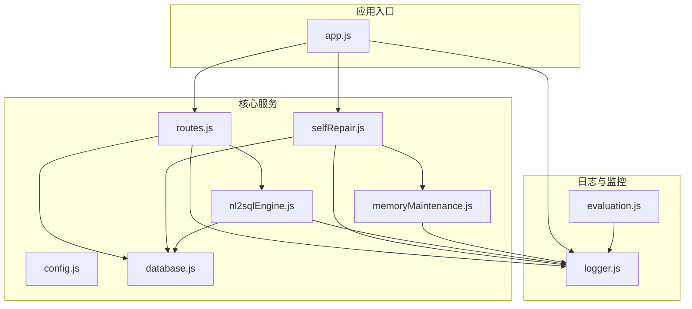
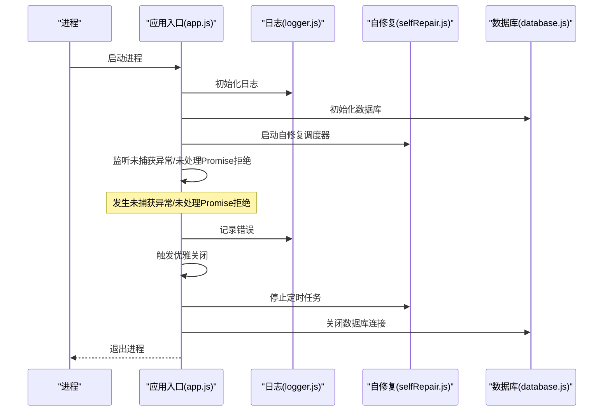
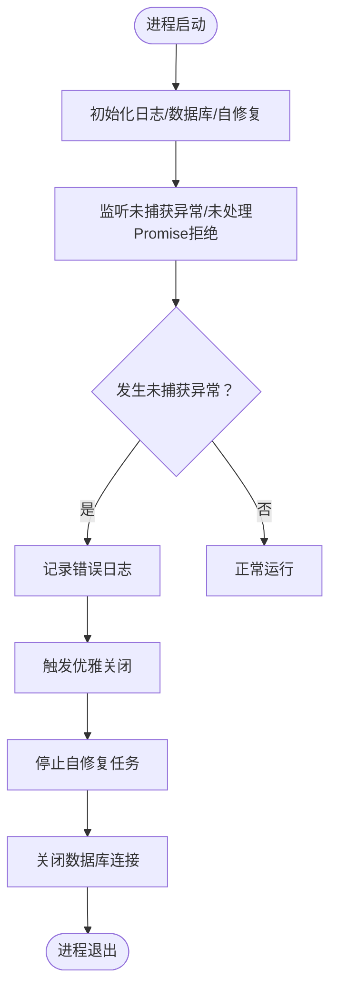
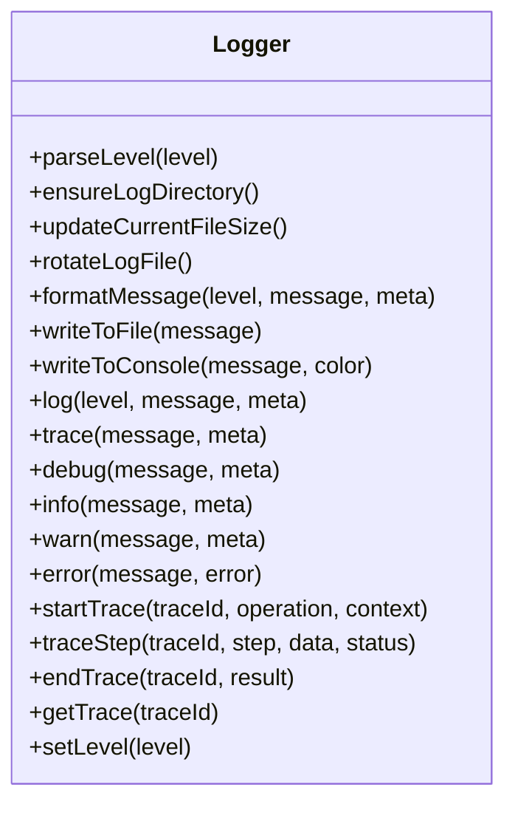
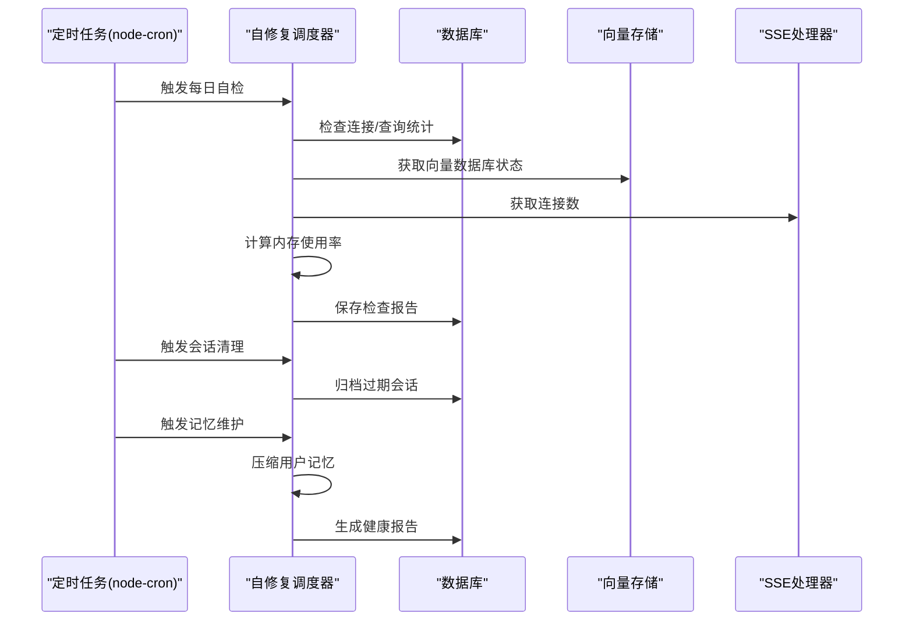
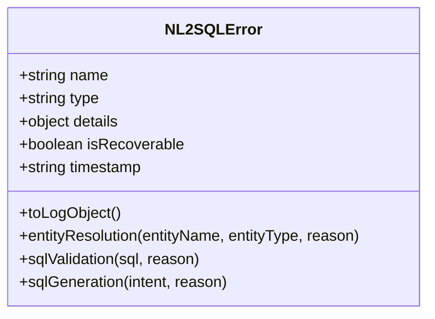
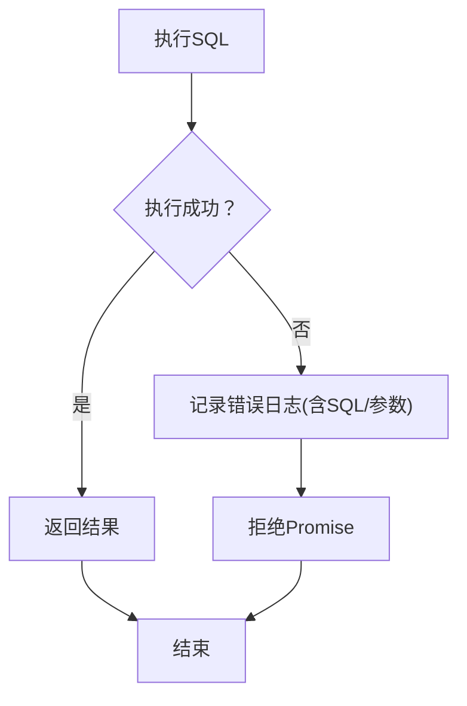
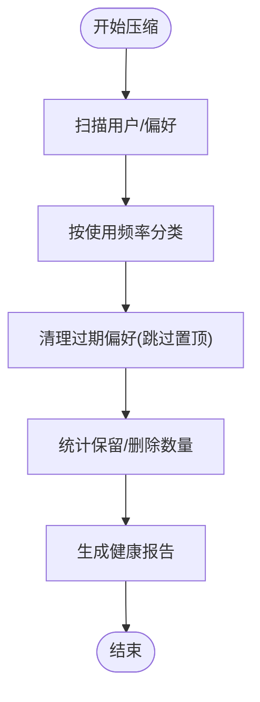
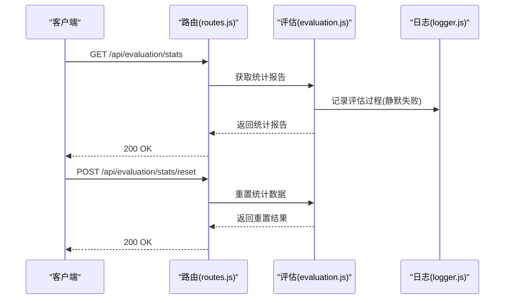
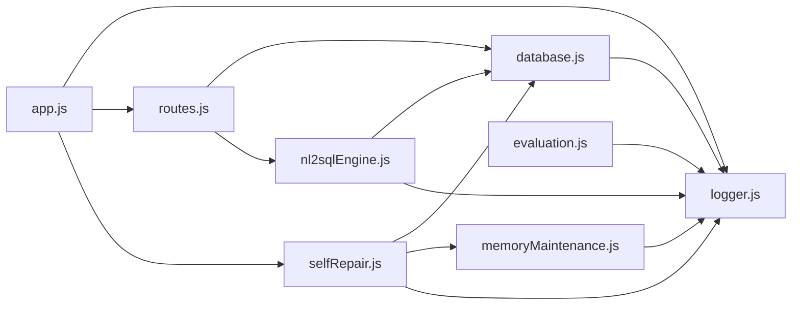

# 错误处理与异常管理

<cite>
**本文档引用的文件**
- [app.js](file://backend/src/app.js)
- [logger.js](file://backend/src/utils/logger.js)
- [selfRepair.js](file://backend/src/core/selfRepair.js)
- [config.js](file://backend/src/core/config.js)
- [routes.js](file://backend/src/core/routes.js)
- [database.js](file://backend/src/core/database.js)
- [nl2sqlEngine.js](file://backend/src/core/nl2sqlEngine.js)
- [memoryMaintenance.js](file://backend/src/memory/memoryMaintenance.js)
- [evaluation.js](file://backend/src/utils/evaluation.js)
</cite>

## 目录
1. [简介](#简介)
2. [项目结构](#项目结构)
3. [核心组件](#核心组件)
4. [架构概览](#架构概览)
5. [详细组件分析](#详细组件分析)
6. [依赖分析](#依赖分析)
7. [性能考虑](#性能考虑)
8. [故障排查指南](#故障排查指南)
9. [结论](#结论)

## 简介
本文件面向NL2SQL项目的错误处理与异常管理，系统性阐述全局错误处理机制、错误日志记录规范、错误分类与处理策略、自修复机制（健康检查、自动恢复、故障转移）、以及错误监控与告警配置指南。目标是帮助开发者与运维人员快速定位问题、理解系统韧性设计，并建立完善的错误治理流程。

## 项目结构
NL2SQL后端采用模块化组织，错误处理涉及以下关键模块：
- 应用入口与全局异常捕获：app.js
- 日志系统：utils/logger.js
- 自修复与定时任务：core/selfRepair.js
- 配置中心：core/config.js
- API路由与错误响应：core/routes.js
- 数据库层错误处理：core/database.js
- NL2SQL引擎统一错误类：core/nl2sqlEngine.js
- 记忆系统维护：memory/memoryMaintenance.js
- 评估与统计：utils/evaluation.js

图表来源
- [app.js:1-260](file://backend/src/app.js#L1-L260)
- [logger.js:1-442](file://backend/src/utils/logger.js#L1-L442)
- [selfRepair.js:1-489](file://backend/src/core/selfRepair.js#L1-L489)
- [routes.js:1-800](file://backend/src/core/routes.js#L1-L800)
- [database.js:1-859](file://backend/src/core/database.js#L1-L859)
- [nl2sqlEngine.js:1-800](file://backend/src/core/nl2sqlEngine.js#L1-L800)
- [memoryMaintenance.js:1-418](file://backend/src/memory/memoryMaintenance.js#L1-L418)
- [evaluation.js:1-488](file://backend/src/utils/evaluation.js#L1-L488)

章节来源
- [app.js:1-260](file://backend/src/app.js#L1-L260)
- [logger.js:1-442](file://backend/src/utils/logger.js#L1-L442)
- [selfRepair.js:1-489](file://backend/src/core/selfRepair.js#L1-L489)
- [routes.js:1-800](file://backend/src/core/routes.js#L1-L800)
- [database.js:1-859](file://backend/src/core/database.js#L1-L859)
- [nl2sqlEngine.js:1-800](file://backend/src/core/nl2sqlEngine.js#L1-L800)
- [memoryMaintenance.js:1-418](file://backend/src/memory/memoryMaintenance.js#L1-L418)
- [evaluation.js:1-488](file://backend/src/utils/evaluation.js#L1-L488)

## 核心组件
- 全局异常与未处理Promise拒绝捕获：在应用入口集中处理，避免进程崩溃并触发优雅关闭。
- 统一日志系统：支持多级别日志、结构化元数据、文件轮转与追踪上下文。
- 自修复调度器：定时健康检查、会话清理、统计收集、记忆维护。
- NL2SQL统一错误类：结构化错误类型、可恢复性标记、日志友好对象。
- 数据库层错误处理：统一的查询/执行错误记录与事务回滚。
- 评估与统计：非侵入式运行时统计，支持错误趋势分析。

章节来源
- [app.js:242-252](file://backend/src/app.js#L242-L252)
- [logger.js:29-442](file://backend/src/utils/logger.js#L29-L442)
- [selfRepair.js:60-125](file://backend/src/core/selfRepair.js#L60-L125)
- [nl2sqlEngine.js:170-240](file://backend/src/core/nl2sqlEngine.js#L170-L240)
- [database.js:370-433](file://backend/src/core/database.js#L370-L433)
- [evaluation.js:37-122](file://backend/src/utils/evaluation.js#L37-L122)

## 架构概览
下面的序列图展示了从应用启动到错误捕获与自修复的整体流程：

图表来源
- [app.js:97-187](file://backend/src/app.js#L97-L187)
- [app.js:242-252](file://backend/src/app.js#L242-L252)
- [logger.js:233-309](file://backend/src/utils/logger.js#L233-L309)
- [selfRepair.js:131-159](file://backend/src/core/selfRepair.js#L131-L159)
- [database.js:800-821](file://backend/src/core/database.js#L800-L821)

## 详细组件分析

### 全局错误处理与未捕获异常
- 未捕获异常：记录错误并触发优雅关闭，确保资源有序释放。
- 未处理Promise拒绝：记录拒绝原因，避免进程崩溃。
- 优雅关闭：关闭HTTP服务器、SSE连接、自修复任务、数据库连接后退出。

图表来源
- [app.js:198-234](file://backend/src/app.js#L198-L234)
- [app.js:242-252](file://backend/src/app.js#L242-L252)
- [logger.js:299-309](file://backend/src/utils/logger.js#L299-L309)

章节来源
- [app.js:198-252](file://backend/src/app.js#L198-L252)

### 日志系统与标准格式
- 日志级别：TRACE、DEBUG、INFO、WARN、ERROR。
- 标准格式：时间戳、级别、消息、结构化元数据（JSON）。
- 文件轮转：按大小轮转，保留历史文件数量可配置。
- 追踪上下文：支持traceId关联多条日志，记录步骤与耗时。
- 事件通知：日志事件可用于外部监控系统订阅。

图表来源
- [logger.js:54-427](file://backend/src/utils/logger.js#L54-L427)

章节来源
- [logger.js:29-442](file://backend/src/utils/logger.js#L29-L442)

### 自修复机制（健康检查、自动恢复、故障转移）
- 定时任务：
  - 每日自检：数据库、向量数据库、查询统计、连接数、系统资源。
  - 会话清理：过期会话归档。
  - 统计收集：连接数与内存使用。
  - 记忆维护：长期记忆压缩与健康报告。
- 健康检查报告：保存至系统日志表，便于审计与趋势分析。
- 故障转移与恢复：通过清理与维护降低系统风险，提升可用性。

图表来源
- [selfRepair.js:60-125](file://backend/src/core/selfRepair.js#L60-L125)
- [selfRepair.js:169-310](file://backend/src/core/selfRepair.js#L169-L310)
- [selfRepair.js:341-373](file://backend/src/core/selfRepair.js#L341-L373)
- [selfRepair.js:383-415](file://backend/src/core/selfRepair.js#L383-L415)
- [selfRepair.js:425-445](file://backend/src/core/selfRepair.js#L425-L445)

章节来源
- [selfRepair.js:60-489](file://backend/src/core/selfRepair.js#L60-L489)

### NL2SQL统一错误类与错误分类
- 错误类型：
  - 实体解析错误：可恢复，引导澄清。
  - SQL验证错误：不可恢复，需修正输入或规则。
  - SQL生成错误：可恢复，引导澄清或调整意图。
  - 校验/执行错误：业务/系统错误，记录并反馈。
- 错误对象：包含类型、消息、详情、可恢复性、时间戳、堆栈。
- API层错误响应：统一包装错误消息，避免泄露内部细节。

图表来源
- [nl2sqlEngine.js:170-240](file://backend/src/core/nl2sqlEngine.js#L170-L240)

章节来源
- [nl2sqlEngine.js:166-240](file://backend/src/core/nl2sqlEngine.js#L166-L240)
- [routes.js:244-249](file://backend/src/core/routes.js#L244-L249)
- [routes.js:284-289](file://backend/src/core/routes.js#L284-L289)
- [routes.js:308-313](file://backend/src/core/routes.js#L308-L313)
- [routes.js:339-344](file://backend/src/core/routes.js#L339-L344)
- [routes.js:444-449](file://backend/src/core/routes.js#L444-L449)

### 数据库层错误处理
- 统一Promise封装：query、queryOne、run、transaction。
- 错误记录：捕获SQL执行失败，记录SQL与参数，拒绝Promise。
- 事务回滚：异常时自动回滚，保证一致性。
- 连接关闭：优雅关闭数据库连接，避免资源泄漏。

图表来源
- [database.js:370-433](file://backend/src/core/database.js#L370-L433)
- [database.js:440-454](file://backend/src/core/database.js#L440-L454)
- [database.js:800-821](file://backend/src/core/database.js#L800-L821)

章节来源
- [database.js:370-454](file://backend/src/core/database.js#L370-L454)
- [database.js:800-821](file://backend/src/core/database.js#L800-L821)

### 记忆系统维护与健康报告
- 压缩策略：按使用频率分级保留，定期清理过期记忆。
- 合并相似模式：减少冗余，提升检索效率。
- 健康报告：统计总数、按类型分布、预估清理量。

图表来源
- [memoryMaintenance.js:69-120](file://backend/src/memory/memoryMaintenance.js#L69-L120)
- [memoryMaintenance.js:127-192](file://backend/src/memory/memoryMaintenance.js#L127-L192)
- [memoryMaintenance.js:358-398](file://backend/src/memory/memoryMaintenance.js#L358-L398)

章节来源
- [memoryMaintenance.js:69-398](file://backend/src/memory/memoryMaintenance.js#L69-L398)

### 错误监控与告警配置指南
- 运行时统计：
  - 向量检索命中率、距离分布、查询相似度评估。
  - 长期记忆命中率、按类型统计。
- 统计接口：
  - 获取运行时统计报告、重置统计数据。
- 告警建议：
  - 失败率阈值：每日查询失败率超过阈值触发告警。
  - 慢查询阈值：平均执行时间超过阈值触发告警。
  - 内存使用率：超过阈值触发告警。
  - 连接数异常：SSE连接数异常波动触发告警。

图表来源
- [routes.js:726-760](file://backend/src/core/routes.js#L726-L760)
- [evaluation.js:397-429](file://backend/src/utils/evaluation.js#L397-L429)

章节来源
- [routes.js:726-760](file://backend/src/core/routes.js#L726-L760)
- [evaluation.js:37-122](file://backend/src/utils/evaluation.js#L37-L122)
- [evaluation.js:397-429](file://backend/src/utils/evaluation.js#L397-L429)

## 依赖分析
- 模块耦合：
  - app.js依赖日志、数据库、自修复、路由模块，形成核心控制流。
  - routes.js依赖日志、数据库、NL2SQL引擎、评估模块，承担对外错误响应。
  - selfRepair.js依赖配置、日志、数据库、向量存储、SSE处理器，承担系统健康与维护。
  - database.js依赖配置、日志，提供统一数据库访问与错误处理。
  - nl2sqlEngine.js依赖配置、日志、LLM服务、Schema加载、向量存储、长期记忆等，提供统一错误类。
  - memoryMaintenance.js依赖数据库、日志、配置，提供记忆维护与报告。
  - evaluation.js依赖日志、配置，提供评估统计与报告。
- 外部依赖：
  - node-cron：定时任务调度。
  - sqlite3：本地数据库访问。
  - dotenv：环境变量加载。

图表来源
- [app.js:39-50](file://backend/src/app.js#L39-L50)
- [routes.js:16-30](file://backend/src/core/routes.js#L16-L30)
- [selfRepair.js:15-26](file://backend/src/core/selfRepair.js#L15-L26)
- [database.js:12-20](file://backend/src/core/database.js#L12-L20)
- [nl2sqlEngine.js:16-33](file://backend/src/core/nl2sqlEngine.js#L16-L33)
- [memoryMaintenance.js:16-18](file://backend/src/memory/memoryMaintenance.js#L16-L18)
- [evaluation.js:12-13](file://backend/src/utils/evaluation.js#L12-L13)

章节来源
- [app.js:39-50](file://backend/src/app.js#L39-L50)
- [routes.js:16-30](file://backend/src/core/routes.js#L16-L30)
- [selfRepair.js:15-26](file://backend/src/core/selfRepair.js#L15-L26)
- [database.js:12-20](file://backend/src/core/database.js#L12-L20)
- [nl2sqlEngine.js:16-33](file://backend/src/core/nl2sqlEngine.js#L16-L33)
- [memoryMaintenance.js:16-18](file://backend/src/memory/memoryMaintenance.js#L16-L18)
- [evaluation.js:12-13](file://backend/src/utils/evaluation.js#L12-L13)

## 性能考虑
- 日志级别与输出：生产环境建议提高日志级别，减少文件I/O压力。
- 文件轮转：合理设置最大文件大小与历史文件数量，平衡磁盘占用与可追溯性。
- 定时任务频率：根据系统负载调整检查频率，避免高峰期压力过大。
- 数据库事务：批量操作使用事务，失败自动回滚，减少不一致风险。
- 评估统计：非侵入式记录，避免影响主业务吞吐。

## 故障排查指南
- 启动失败：
  - 检查必要配置（LLM API密钥、SR数据库URL）。
  - 查看初始化日志，定位数据库/向量存储/Schema加载问题。
- 运行时错误：
  - 使用日志追踪（traceId）定位具体步骤与耗时。
  - 检查API错误响应，确认错误类型与可恢复性。
  - 查看系统日志表（system_logs）获取自检报告。
- 数据库异常：
  - 检查SQL执行错误日志，核对参数与表结构。
  - 确认事务是否正确提交/回滚。
- 记忆系统异常：
  - 查看记忆压缩统计与健康报告，确认清理策略是否生效。
- 评估统计异常：
  - 确认评估功能开关与统计开关状态。
  - 重置统计数据后再次验证。

章节来源
- [config.js:366-388](file://backend/src/core/config.js#L366-L388)
- [app.js:97-187](file://backend/src/app.js#L97-L187)
- [logger.js:317-408](file://backend/src/utils/logger.js#L317-L408)
- [routes.js:726-760](file://backend/src/core/routes.js#L726-L760)
- [database.js:370-433](file://backend/src/core/database.js#L370-L433)
- [memoryMaintenance.js:358-398](file://backend/src/memory/memoryMaintenance.js#L358-L398)

## 结论
NL2SQL项目的错误处理与异常管理通过“全局捕获+统一日志+自修复调度+结构化错误类+非侵入式评估”的组合，实现了高可用与可观测性。建议在生产环境中：
- 明确错误分类与处理策略，区分业务错误与系统错误。
- 建立基于日志与评估的监控告警体系，覆盖失败率、慢查询、内存与连接数。
- 定期执行自修复任务，保持系统健康与数据整洁。
- 通过traceId与系统日志表实现端到端问题定位与审计。