# 后端架构设计

<cite>
**本文档引用的文件**
- [app.js](file://backend/src/app.js)
- [routes.js](file://backend/src/core/routes.js)
- [database.js](file://backend/src/core/database.js)
- [srDatabase.js](file://backend/src/core/srDatabase.js)
- [logger.js](file://backend/src/utils/logger.js)
- [config.js](file://backend/src/core/config.js)
- [feature-flags.js](file://backend/config/feature-flags.js)
- [schemaLoader.js](file://backend/src/core/schemaLoader.js)
- [sseHandler.js](file://backend/src/core/sseHandler.js)
- [selfRepair.js](file://backend/src/core/selfRepair.js)
- [vectorStore.js](file://backend/src/memory/vectorStore.js)
- [package.json](file://backend/package.json)
</cite>

## 目录
1. [简介](#简介)
2. [项目结构](#项目结构)
3. [核心组件](#核心组件)
4. [架构总览](#架构总览)
5. [详细组件分析](#详细组件分析)
6. [依赖关系分析](#依赖关系分析)
7. [性能考虑](#性能考虑)
8. [故障排除指南](#故障排除指南)
9. [结论](#结论)

## 简介
本文件为 NL2SQL 后端架构的详细技术文档，面向希望理解系统分层设计、模块依赖与启动流程的工程师与运维人员。文档重点涵盖：
- Express.js 应用的分层架构与中间件配置
- 路由组织与 API 设计
- 数据库连接管理（SQLite 会话数据库与 SR 业务数据库）
- 配置管理系统（环境变量验证与功能开关）
- 日志系统架构与使用模式
- 错误处理策略与优雅关闭机制
- 性能优化与扩展性设计原则

## 项目结构
后端采用模块化分层设计，主要目录与职责如下：
- backend/src：核心业务代码
  - core：核心引擎与服务（路由、数据库、配置、SSE、自修复等）
  - memory：长期记忆与向量存储
  - utils：工具模块（日志、评估、SQL 限制、LLM 响应解析等）
- backend/config：配置文件与功能开关
- backend/data：数据存储目录（会话数据库、向量数据库）
- backend/logs：日志文件目录
- backend/test：测试套件

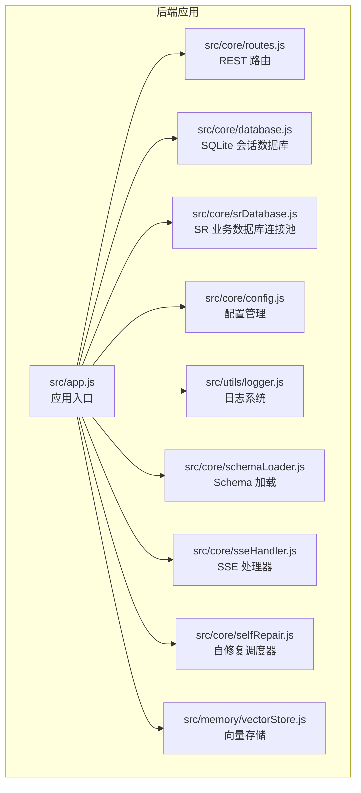

**图表来源**
- [app.js:1-279](file://backend/src/app.js#L1-L279)
- [routes.js:1-1099](file://backend/src/core/routes.js#L1-L1099)
- [database.js:1-1400](file://backend/src/core/database.js#L1-L1400)
- [srDatabase.js:1-156](file://backend/src/core/srDatabase.js#L1-L156)
- [config.js:1-439](file://backend/src/core/config.js#L1-L439)
- [logger.js:1-482](file://backend/src/utils/logger.js#L1-L482)
- [schemaLoader.js:1-1261](file://backend/src/core/schemaLoader.js#L1-L1261)
- [sseHandler.js:1-688](file://backend/src/core/sseHandler.js#L1-L688)
- [selfRepair.js:1-641](file://backend/src/core/selfRepair.js#L1-L641)
- [vectorStore.js:1-928](file://backend/src/memory/vectorStore.js#L1-L928)

**章节来源**
- [app.js:1-279](file://backend/src/app.js#L1-L279)
- [package.json:1-36](file://backend/package.json#L1-L36)

## 核心组件
- 应用入口与启动流程：负责加载环境变量、初始化模块、挂载路由、启动 HTTP 服务器与 SSE、注册优雅关闭与未处理异常处理。
- 配置管理：集中读取环境变量，提供默认值与验证，支持运行时切换（开发/生产）。
- 日志系统：统一日志格式、级别控制、文件轮转与结构化输出，并提供追踪能力。
- 数据库层：SQLite 会话数据库（会话、消息、查询历史、偏好、系统日志、死信队列）与 SR 业务数据库连接池。
- Schema 管理：加载与缓存 Schema 元数据，支持向量化与语义检索。
- SSE 处理：管理实时连接、进度回调、查询处理与错误推送。
- 自修复调度器：定时任务（每日自检、会话清理、统计收集、记忆维护、死信重放）。

**章节来源**
- [app.js:95-204](file://backend/src/app.js#L95-L204)
- [config.js:20-439](file://backend/src/core/config.js#L20-L439)
- [logger.js:54-482](file://backend/src/utils/logger.js#L54-L482)
- [database.js:247-308](file://backend/src/core/database.js#L247-L308)
- [srDatabase.js:42-86](file://backend/src/core/srDatabase.js#L42-L86)
- [schemaLoader.js:75-131](file://backend/src/core/schemaLoader.js#L75-L131)
- [sseHandler.js:49-120](file://backend/src/core/sseHandler.js#L49-L120)
- [selfRepair.js:65-143](file://backend/src/core/selfRepair.js#L65-L143)

## 架构总览
NL2SQL 后端采用“入口引导 + 分层模块 + 统一配置”的架构。启动流程从 dotenv 加载环境变量开始，依次验证配置、创建数据目录、初始化 SQLite、向量数据库、加载 Schema、可选加载业务语义层、打印功能开关、初始化 SR 数据库连接池、启动自修复调度器，最终启动 HTTP 服务器并监听端口。

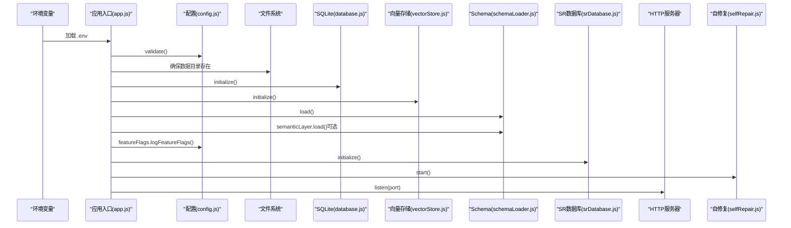

**图表来源**
- [app.js:99-196](file://backend/src/app.js#L99-L196)
- [config.js:407-429](file://backend/src/core/config.js#L407-L429)
- [database.js:247-308](file://backend/src/core/database.js#L247-L308)
- [vectorStore.js:1-200](file://backend/src/memory/vectorStore.js#L1-L200)
- [schemaLoader.js:75-131](file://backend/src/core/schemaLoader.js#L75-L131)
- [srDatabase.js:42-86](file://backend/src/core/srDatabase.js#L42-L86)
- [selfRepair.js:65-143](file://backend/src/core/selfRepair.js#L65-L143)

## 详细组件分析

### Express 应用与中间件配置
- 中间件：
  - CORS：允许跨域访问（开发环境默认允许所有来源）
  - body-parser：解析 JSON 与 URL 编码请求体（限制 10MB）
- 路由挂载：所有 API 路由挂载至 /api 前缀
- 启动流程：在 initialize 函数中按顺序执行上述初始化步骤

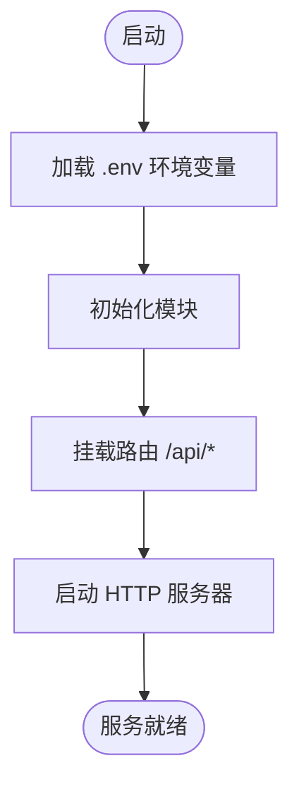

**图表来源**
- [app.js:65-82](file://backend/src/app.js#L65-L82)
- [app.js:99-196](file://backend/src/app.js#L99-L196)

**章节来源**
- [app.js:65-82](file://backend/src/app.js#L65-L82)
- [app.js:99-196](file://backend/src/app.js#L99-L196)

### 配置管理系统
- 集中式配置对象，从环境变量读取并提供默认值
- 关键配置类别：
  - 服务器基础：端口、运行环境
  - LLM/Embedding：API 基础地址、模型、超时、维度
  - 数据库：SQLite 路径、LanceDB 路径、SR 数据库 URL/连接池/超时/行数限制
  - 安全：白名单、Dry Run、最大行数、超时、禁止关键字、结果脱敏规则、RLS
  - 会话：历史条数、过期时间、清理间隔
  - 日志：级别、文件路径、控制台/文件输出、轮转大小与数量
  - 自修复：启用、Cron 表达式、会话检查间隔、慢查询阈值
  - Schema：配置路径、缓存、强制重新向量化
  - 长期记忆：启用、LLM 提取、阈值、保留策略
  - 上下文管理：Token 预算、摘要、阈值与间隔
  - 评估：启用、统计跟踪、阈值
- 配置验证：启动时检查必要项（LLM API Key、SR 数据库 URL）

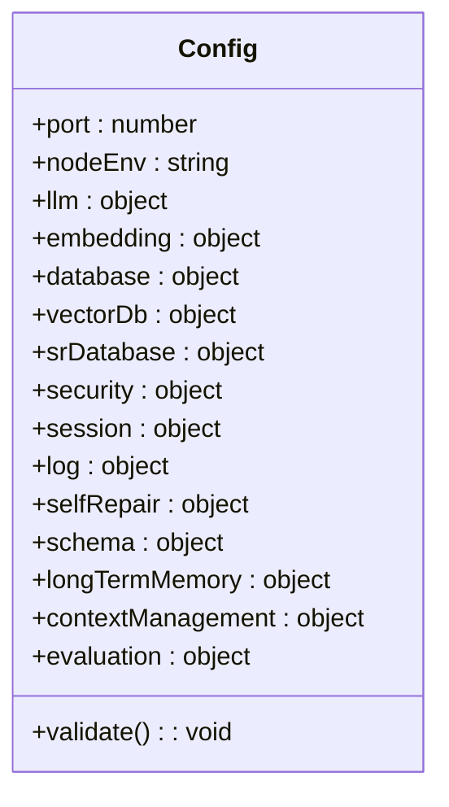

**图表来源**
- [config.js:20-439](file://backend/src/core/config.js#L20-L439)

**章节来源**
- [config.js:20-439](file://backend/src/core/config.js#L20-L439)

### 功能开关机制
- 功能开关集中定义于 feature-flags.js，支持按 Phase 维度启用/禁用
- 支持全局启用/禁用开关，以及工作流选择（Agentic、工具循环、分层 Schema）
- 启动时打印开关状态与启用的 Phase 列表

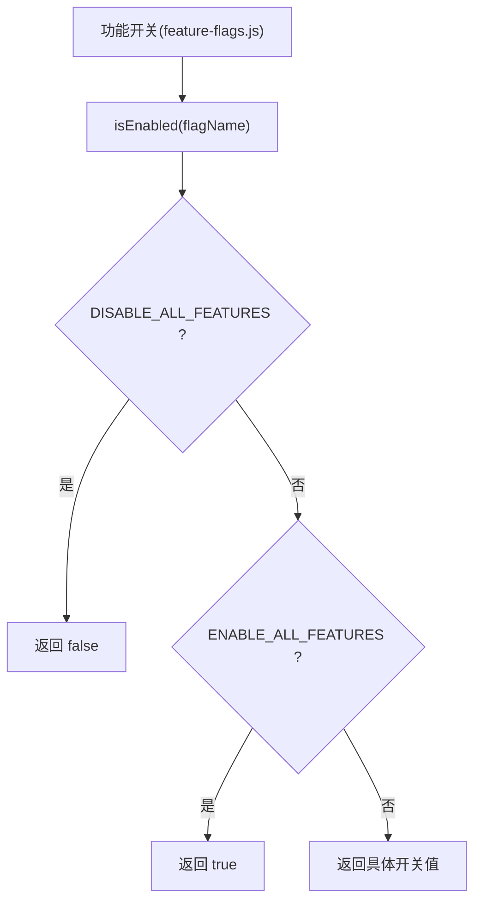

**图表来源**
- [feature-flags.js:16-141](file://backend/config/feature-flags.js#L16-L141)

**章节来源**
- [feature-flags.js:16-141](file://backend/config/feature-flags.js#L16-L141)
- [feature-flags.js:254-274](file://backend/config/feature-flags.js#L254-L274)

### 日志系统架构
- 统一日志级别（TRACE/DEBUG/INFO/WARN/ERROR）
- 控制台彩色输出与文件轮转（大小阈值与文件数量）
- 结构化日志格式，支持附加元数据
- 追踪能力：startTrace/traceStep/endTrace，支持僵尸追踪条目清理
- 事件发射：emit('log') 供外部监听

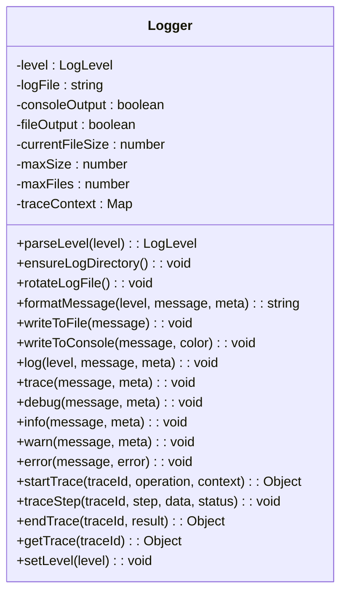

**图表来源**
- [logger.js:54-482](file://backend/src/utils/logger.js#L54-L482)

**章节来源**
- [logger.js:54-482](file://backend/src/utils/logger.js#L54-L482)

### 数据库连接管理
- SQLite 会话数据库：
  - 初始化：创建数据库文件、启用外键、执行建表与迁移
  - 迁移：幂等处理（用户偏好去重、审计字段补齐、死信队列表补齐）
  - 操作：query/queryOne/run/transaction，支持参数化与事务
  - 表结构：sessions/messages/query_history/user_preferences/system_logs/memory_failed_queue
- SR 业务数据库（MySQL）连接池：
  - 懒加载：未安装 mysql2 或 URL 为空时仅告警，不阻塞启动
  - 只读保护：每次取连接后 SET SESSION TRANSACTION READ ONLY
  - 超时控制：MAX_EXECUTION_TIME + query timeout 双重兜底
  - 返回标准化：rows/columns/rowCount

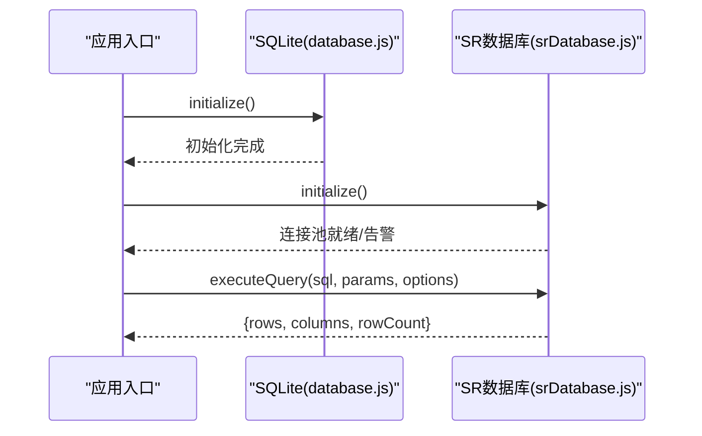

**图表来源**
- [database.js:247-308](file://backend/src/core/database.js#L247-L308)
- [srDatabase.js:42-127](file://backend/src/core/srDatabase.js#L42-L127)

**章节来源**
- [database.js:247-516](file://backend/src/core/database.js#L247-L516)
- [srDatabase.js:42-127](file://backend/src/core/srDatabase.js#L42-L127)

### Schema 管理与向量检索
- Schema 加载：从 JSON 配置文件读取，构建表/字段映射，缓存时间戳
- 向量化：表级表征（包含域标签、数据源类型、核心特征词），增量更新
- 智能搜索：语义检索（向量相似度）+ 关键词匹配 + 上下文增强（datasource/gameId）
- SQL 验证：禁止关键字检查、可选白名单表检查

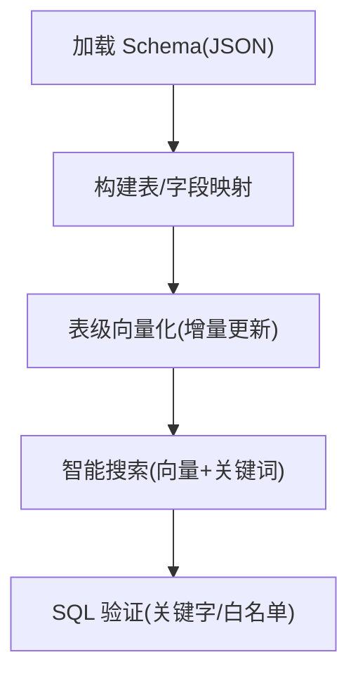

**图表来源**
- [schemaLoader.js:75-131](file://backend/src/core/schemaLoader.js#L75-L131)
- [schemaLoader.js:210-285](file://backend/src/core/schemaLoader.js#L210-L285)
- [schemaLoader.js:571-736](file://backend/src/core/schemaLoader.js#L571-L736)
- [schemaLoader.js:749-785](file://backend/src/core/schemaLoader.js#L749-L785)

**章节来源**
- [schemaLoader.js:75-131](file://backend/src/core/schemaLoader.js#L75-L131)
- [schemaLoader.js:210-285](file://backend/src/core/schemaLoader.js#L210-L285)
- [schemaLoader.js:571-736](file://backend/src/core/schemaLoader.js#L571-L736)
- [schemaLoader.js:749-785](file://backend/src/core/schemaLoader.js#L749-L785)

### SSE 实时处理与查询编排
- 连接管理：建立 SSE 连接、存储连接信息、清理断开连接
- 查询处理：根据功能开关选择 Agentic 或 Legacy 引擎；支持澄清回答自动路由
- 消息持久化：Agentic 路径的消息落库；Legacy 路径在引擎内部落库
- 统计：连接数、会话连接数、连接列表

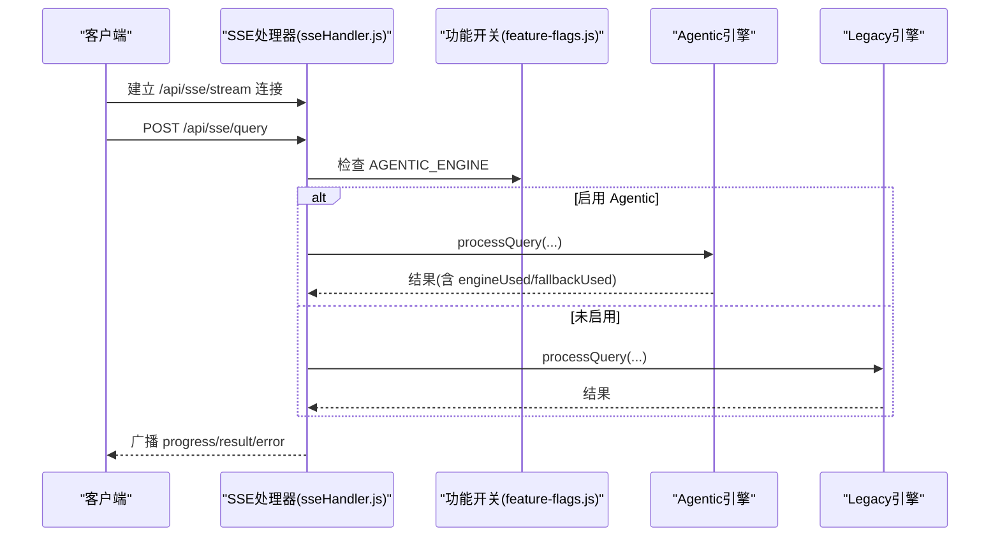

**图表来源**
- [sseHandler.js:49-120](file://backend/src/core/sseHandler.js#L49-L120)
- [sseHandler.js:258-410](file://backend/src/core/sseHandler.js#L258-L410)
- [feature-flags.js:194-206](file://backend/config/feature-flags.js#L194-L206)

**章节来源**
- [sseHandler.js:49-120](file://backend/src/core/sseHandler.js#L49-L120)
- [sseHandler.js:258-410](file://backend/src/core/sseHandler.js#L258-L410)
- [feature-flags.js:194-206](file://backend/config/feature-flags.js#L194-L206)

### 自修复调度器
- 定时任务：
  - 每日自检：数据库、向量库、查询统计、连接数、系统资源、死信队列
  - 会话清理：过期会话归档
  - 统计收集：连接数、内存使用
  - 记忆维护：压缩与清理长期记忆
  - 死信重放：扫描 pending 记录并告警
- 可手动触发与停止

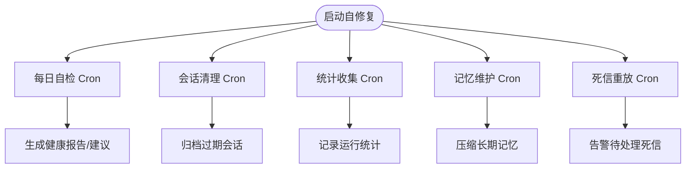

**图表来源**
- [selfRepair.js:65-143](file://backend/src/core/selfRepair.js#L65-L143)
- [selfRepair.js:215-427](file://backend/src/core/selfRepair.js#L215-L427)
- [selfRepair.js:458-490](file://backend/src/core/selfRepair.js#L458-L490)
- [selfRepair.js:500-532](file://backend/src/core/selfRepair.js#L500-L532)
- [selfRepair.js:602-618](file://backend/src/core/selfRepair.js#L602-L618)

**章节来源**
- [selfRepair.js:65-143](file://backend/src/core/selfRepair.js#L65-L143)
- [selfRepair.js:215-427](file://backend/src/core/selfRepair.js#L215-L427)
- [selfRepair.js:458-490](file://backend/src/core/selfRepair.js#L458-L490)
- [selfRepair.js:500-532](file://backend/src/core/selfRepair.js#L500-L532)
- [selfRepair.js:602-618](file://backend/src/core/selfRepair.js#L602-L618)

### 错误处理与优雅关闭
- 未处理 Promise 拒绝与未捕获异常：记录错误并触发优雅关闭
- 优雅关闭：停止接受新连接、关闭 SSE、停止定时任务、关闭数据库连接、关闭 SR 连接池、退出进程

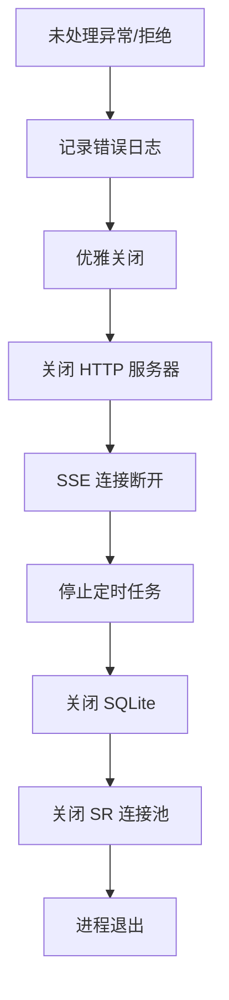

**图表来源**
- [app.js:214-253](file://backend/src/app.js#L214-L253)
- [app.js:262-271](file://backend/src/app.js#L262-L271)

**章节来源**
- [app.js:214-253](file://backend/src/app.js#L214-L253)
- [app.js:262-271](file://backend/src/app.js#L262-L271)

## 依赖关系分析
- 应用入口依赖配置、日志、数据库、SR 数据库、向量存储、路由、自修复
- 路由依赖配置、日志、Schema、数据库、SSE、评估、请求上下文
- 数据库依赖配置、日志、路径与迁移
- SR 数据库依赖配置、日志、SQL 限制
- 日志系统独立，被广泛模块依赖
- Schema 依赖配置、日志、LLM 服务、向量存储
- SSE 依赖数据库、引擎、功能开关、请求上下文
- 自修复依赖配置、日志、数据库、向量存储、SSE

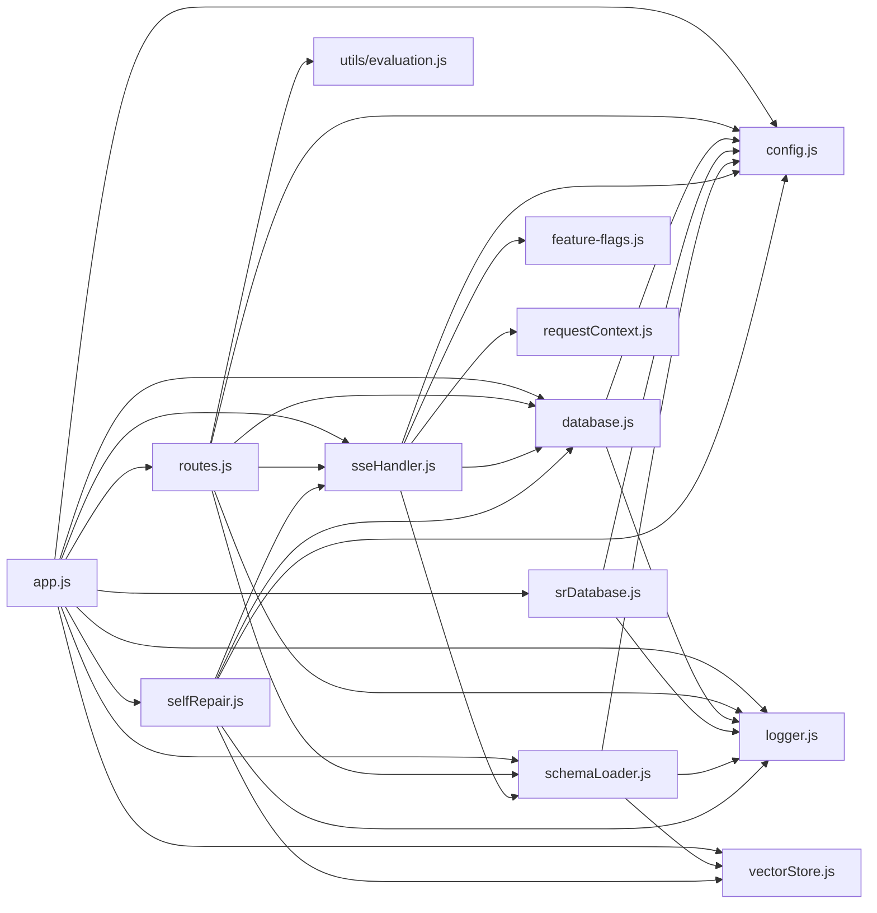

**图表来源**
- [app.js:38-52](file://backend/src/app.js#L38-L52)
- [routes.js:16-31](file://backend/src/core/routes.js#L16-L31)
- [database.js:12-19](file://backend/src/core/database.js#L12-L19)
- [srDatabase.js:15-17](file://backend/src/core/srDatabase.js#L15-L17)
- [logger.js:16-23](file://backend/src/utils/logger.js#L16-L23)
- [schemaLoader.js:15-26](file://backend/src/core/schemaLoader.js#L15-L26)
- [sseHandler.js:15-26](file://backend/src/core/sseHandler.js#L15-L26)
- [selfRepair.js:15-26](file://backend/src/core/selfRepair.js#L15-L26)

**章节来源**
- [app.js:38-52](file://backend/src/app.js#L38-L52)
- [routes.js:16-31](file://backend/src/core/routes.js#L16-L31)
- [database.js:12-19](file://backend/src/core/database.js#L12-L19)
- [srDatabase.js:15-17](file://backend/src/core/srDatabase.js#L15-L17)
- [logger.js:16-23](file://backend/src/utils/logger.js#L16-L23)
- [schemaLoader.js:15-26](file://backend/src/core/schemaLoader.js#L15-L26)
- [sseHandler.js:15-26](file://backend/src/core/sseHandler.js#L15-L26)
- [selfRepair.js:15-26](file://backend/src/core/selfRepair.js#L15-L26)

## 性能考虑
- 连接池与只读保护：SR 数据库连接池支持最大连接数、获取超时、空闲超时；每次执行设置只读，降低写入风险与锁竞争
- 查询超时与 LIMIT 兜底：MAX_EXECUTION_TIME + query timeout 双重保护；未注入外层 LIMIT 时按 maxRows 补全，避免大结果集回传
- SQLite 外键与索引：启用外键约束，为高频查询字段建立索引，减少查询成本
- 向量检索优化：表级向量表示 + 智能搜索（关键词 + 语义），支持增量更新与缓存
- 日志轮转与级别：控制台输出与文件输出分离，避免日志成为性能瓶颈
- 自修复定时任务：定期清理过期会话、压缩长期记忆、扫描死信队列，维持系统健康

[本节为通用指导，无需特定文件引用]

## 故障排除指南
- 启动失败：检查配置验证（LLM API Key、SR 数据库 URL），查看日志输出
- SR 数据库不可用：确认 SR_DATABASE_URL、mysql2 是否安装、网络连通性；查看连接池初始化告警
- 查询失败：查看失败率与错误码分布，结合 RLS 改写与 SQL 验证规则定位问题
- SSE 连接异常：检查连接建立与关闭日志，确认会话存在与连接未断开
- 内存使用过高：关注自修复报告中的内存使用率，必要时重启服务或优化内存使用

**章节来源**
- [config.js:407-429](file://backend/src/core/config.js#L407-L429)
- [srDatabase.js:73-85](file://backend/src/core/srDatabase.js#L73-L85)
- [selfRepair.js:215-427](file://backend/src/core/selfRepair.js#L215-L427)
- [sseHandler.js:127-162](file://backend/src/core/sseHandler.js#L127-L162)

## 结论
NL2SQL 后端通过清晰的分层架构与模块化设计，实现了从配置管理、日志系统、数据库连接、Schema 管理到实时 SSE 处理与自修复调度的完整闭环。其功能开关机制支持渐进式发布与快速回滚，优雅关闭与错误处理保障了服务稳定性。建议在生产环境中：
- 明确配置项与白名单，启用只读与超时保护
- 启用审计字段与错误分析，持续优化失败率
- 合理设置连接池与索引，监控内存与慢查询
- 使用功能开关进行灰度发布，结合自修复机制保持系统健康