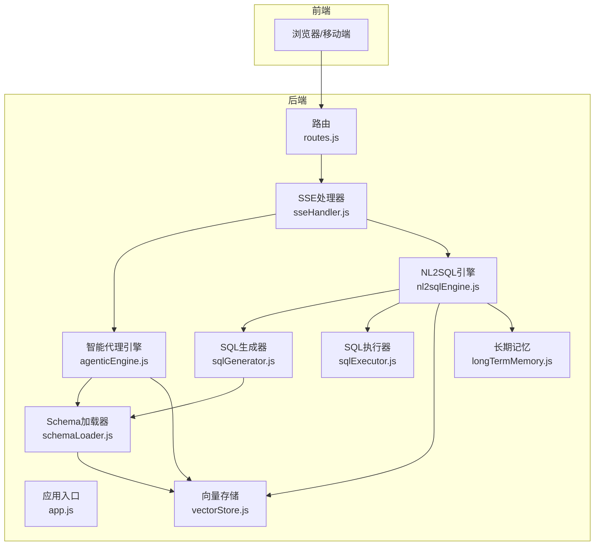
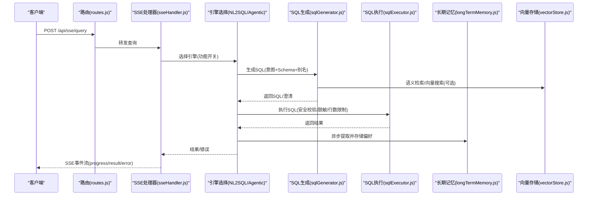
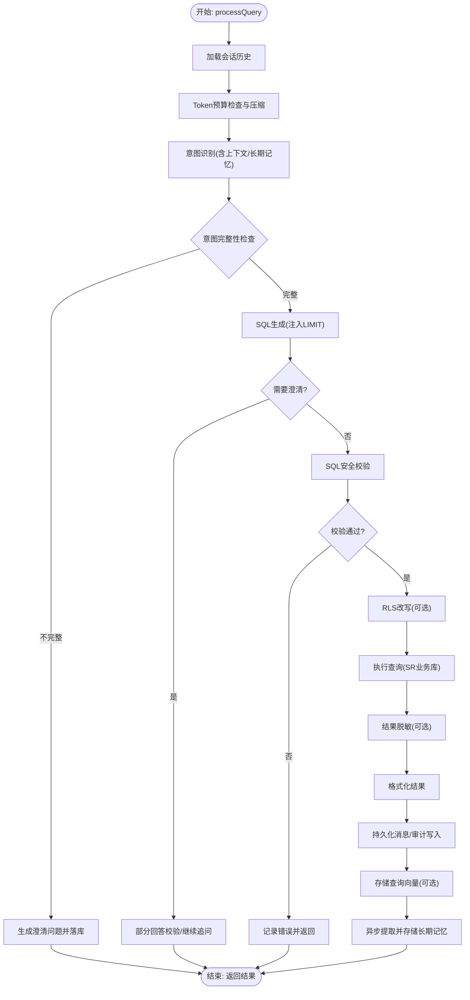
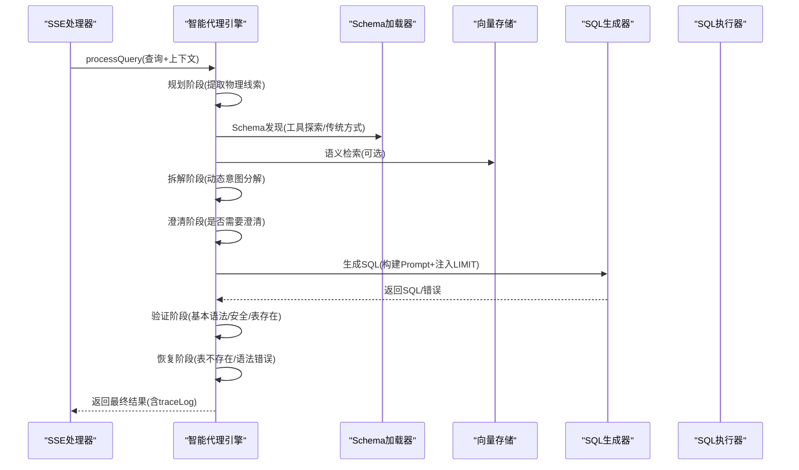
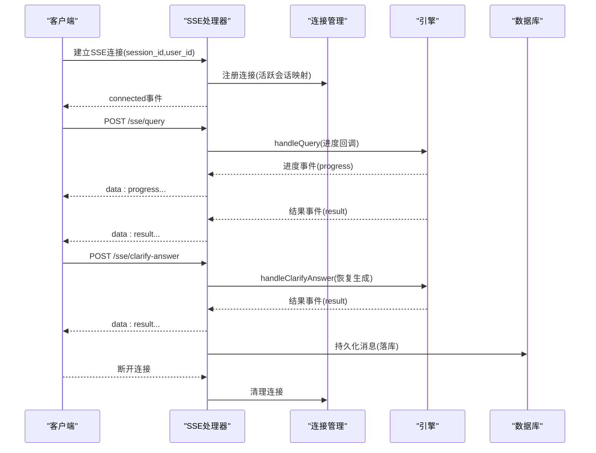
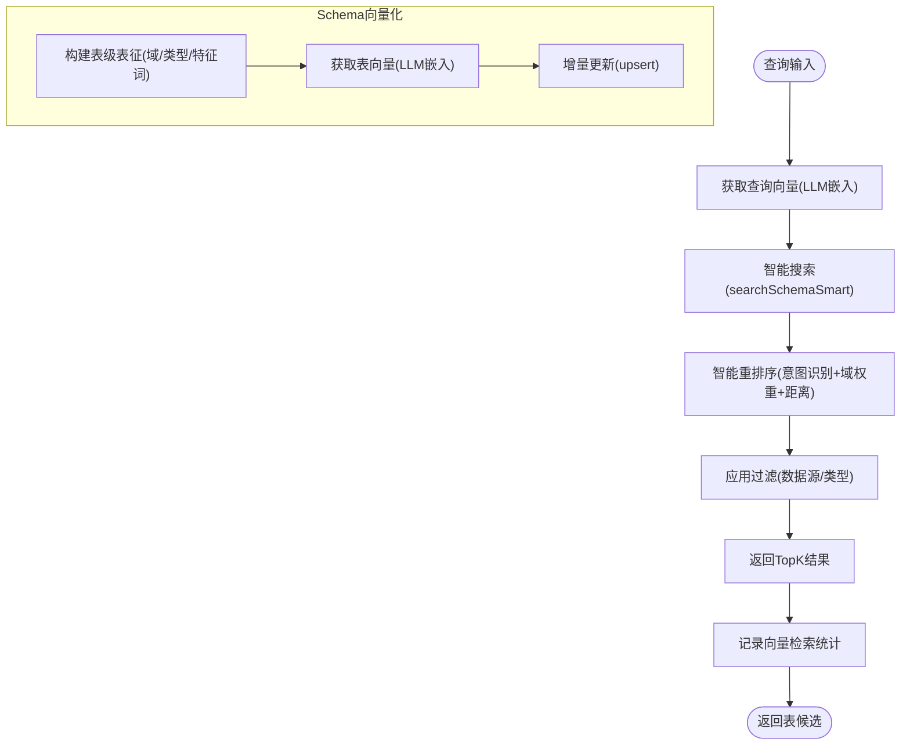
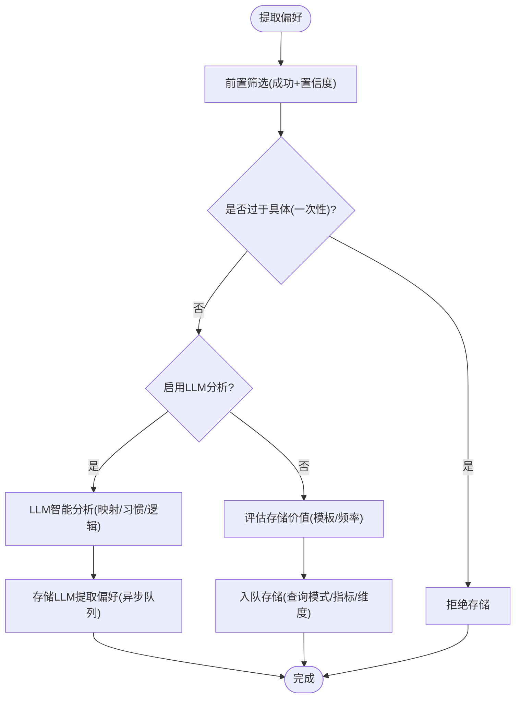
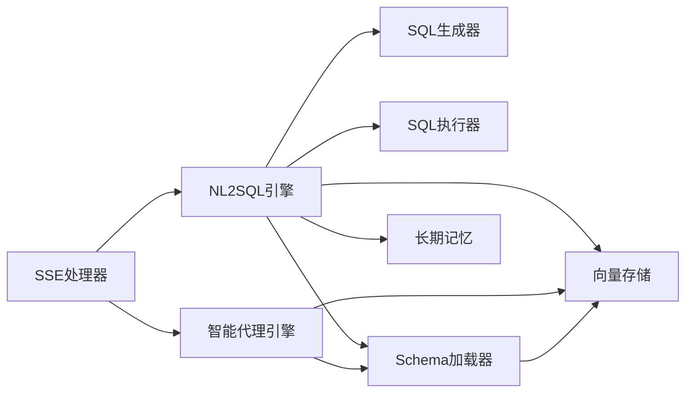

# 数据流设计

<cite>
**本文档引用的文件**
- [app.js](file://backend/src/app.js)
- [routes.js](file://backend/src/core/routes.js)
- [nl2sqlEngine.js](file://backend/src/core/nl2sqlEngine.js)
- [agenticEngine.js](file://backend/src/core/agenticEngine.js)
- [sseHandler.js](file://backend/src/core/sseHandler.js)
- [sqlExecutor.js](file://backend/src/core/sqlExecutor.js)
- [sqlGenerator.js](file://backend/src/core/sqlGenerator.js)
- [schemaLoader.js](file://backend/src/core/schemaLoader.js)
- [vectorStore.js](file://backend/src/memory/vectorStore.js)
- [longTermMemory.js](file://backend/src/memory/longTermMemory.js)
</cite>

## 目录
1. [简介](#简介)
2. [项目结构](#项目结构)
3. [核心组件](#核心组件)
4. [架构总览](#架构总览)
5. [详细组件分析](#详细组件分析)
6. [依赖关系分析](#依赖关系分析)
7. [性能考量](#性能考量)
8. [故障排查指南](#故障排查指南)
9. [结论](#结论)

## 简介
本技术文档围绕 NL2SQL 系统的完整数据流设计展开，聚焦从用户输入到最终结果输出的全流程数据处理机制。文档深入分析自然语言理解、Schema 检索、SQL 生成、查询执行等环节的数据流转，阐明 NL2SQL 引擎、智能代理引擎、记忆系统等模块之间的数据交互关系；同时阐述向量数据库在语义检索中的作用与处理流程，分析 SSE 流式通信中的数据传输模式与实时更新机制，总结数据缓存策略、性能优化措施、数据一致性保障与错误恢复机制。

## 项目结构
后端采用 Express 服务承载 REST API 与 SSE 流式通信，核心处理逻辑分布在 core 与 memory 两大模块：
- core：编排与处理引擎（NL2SQL 引擎、智能代理引擎、SQL 生成、SQL 执行、Schema 加载、路由等）
- memory：长期记忆与向量存储（长期记忆、向量存储、记忆队列等）

**图表来源**
- [app.js:1-279](file://backend/src/app.js#L1-L279)
- [routes.js:1-800](file://backend/src/core/routes.js#L1-L800)
- [sseHandler.js:1-688](file://backend/src/core/sseHandler.js#L1-L688)
- [nl2sqlEngine.js:1-756](file://backend/src/core/nl2sqlEngine.js#L1-L756)
- [agenticEngine.js:1-800](file://backend/src/core/agenticEngine.js#L1-L800)
- [sqlGenerator.js:1-485](file://backend/src/core/sqlGenerator.js#L1-L485)
- [sqlExecutor.js:1-175](file://backend/src/core/sqlExecutor.js#L1-L175)
- [schemaLoader.js:1-800](file://backend/src/core/schemaLoader.js#L1-L800)
- [vectorStore.js:1-800](file://backend/src/memory/vectorStore.js#L1-L800)
- [longTermMemory.js:1-800](file://backend/src/memory/longTermMemory.js#L1-L800)

**章节来源**
- [app.js:1-279](file://backend/src/app.js#L1-L279)
- [routes.js:1-800](file://backend/src/core/routes.js#L1-L800)

## 核心组件
- 应用入口与初始化：负责加载环境变量、初始化数据库与向量库、加载 Schema、启动 HTTP 与 SSE 服务、优雅关闭。
- 路由与 API：提供健康检查、Schema 查询、会话与偏好管理、评估统计等 REST 接口。
- SSE 处理器：管理 SSE 连接、进度回调、查询处理与澄清回答、错误推送与连接统计。
- NL2SQL 引擎：主流程编排（意图识别、澄清、SQL 生成、验证、RLS 改写、执行、脱敏、格式化、审计与持久化）。
- 智能代理引擎：多阶段推理与恢复（规划、Schema 发现、意图拆解、澄清、生成、验证、恢复）。
- SQL 生成器：基于意图构建 Prompt，融合语义层与候选表信号，注入 LIMIT，生成 SQL。
- SQL 执行器：安全校验、连接 SR 业务库执行、行数限制与结果脱敏。
- Schema 加载器：加载与缓存 Schema，向量化表级表征，语义检索与关键词回退。
- 向量存储：LanceDB 向量数据库，Schema 与查询向量存储、智能搜索与统计记录。
- 长期记忆：偏好提取与存储（查询模式、字段别名、指标/维度偏好），异步队列与阈值筛选。

**章节来源**
- [nl2sqlEngine.js:1-756](file://backend/src/core/nl2sqlEngine.js#L1-L756)
- [agenticEngine.js:1-800](file://backend/src/core/agenticEngine.js#L1-L800)
- [sqlGenerator.js:1-485](file://backend/src/core/sqlGenerator.js#L1-L485)
- [sqlExecutor.js:1-175](file://backend/src/core/sqlExecutor.js#L1-L175)
- [schemaLoader.js:1-800](file://backend/src/core/schemaLoader.js#L1-L800)
- [vectorStore.js:1-800](file://backend/src/memory/vectorStore.js#L1-L800)
- [longTermMemory.js:1-800](file://backend/src/memory/longTermMemory.js#L1-L800)

## 架构总览
系统采用“请求驱动 + 流式反馈”的架构模式：
- 请求入口：REST API 与 SSE 连接
- 编排引擎：SSE 处理器根据功能开关选择智能代理引擎或传统 NL2SQL 引擎
- 数据处理：引擎内部按阶段流转，跨模块共享 Schema、向量与记忆
- 结果输出：SSE 实时推送进度与结果，最终持久化消息与审计

**图表来源**
- [routes.js:1-800](file://backend/src/core/routes.js#L1-L800)
- [sseHandler.js:1-688](file://backend/src/core/sseHandler.js#L1-L688)
- [nl2sqlEngine.js:1-756](file://backend/src/core/nl2sqlEngine.js#L1-L756)
- [agenticEngine.js:1-800](file://backend/src/core/agenticEngine.js#L1-L800)
- [sqlGenerator.js:1-485](file://backend/src/core/sqlGenerator.js#L1-L485)
- [sqlExecutor.js:1-175](file://backend/src/core/sqlExecutor.js#L1-L175)
- [vectorStore.js:1-800](file://backend/src/memory/vectorStore.js#L1-L800)
- [longTermMemory.js:1-800](file://backend/src/memory/longTermMemory.js#L1-L800)

## 详细组件分析

### NL2SQL 引擎数据流
NL2SQL 引擎是主流程编排者，负责从加载历史、Token 预算检查、意图识别、澄清、SQL 生成、验证、RLS 改写、执行、脱敏、格式化到审计与持久化的完整闭环。

**图表来源**
- [nl2sqlEngine.js:121-734](file://backend/src/core/nl2sqlEngine.js#L121-L734)
- [sqlExecutor.js:72-169](file://backend/src/core/sqlExecutor.js#L72-L169)
- [sqlGenerator.js:84-479](file://backend/src/core/sqlGenerator.js#L84-L479)

**章节来源**
- [nl2sqlEngine.js:1-756](file://backend/src/core/nl2sqlEngine.js#L1-L756)
- [sqlExecutor.js:1-175](file://backend/src/core/sqlExecutor.js#L1-L175)
- [sqlGenerator.js:1-485](file://backend/src/core/sqlGenerator.js#L1-L485)

### 智能代理引擎数据流
智能代理引擎引入多阶段推理与恢复，包含规划、Schema 发现、意图拆解、澄清、生成、验证与恢复，支持自动回退与审计写入。

**图表来源**
- [agenticEngine.js:70-215](file://backend/src/core/agenticEngine.js#L70-L215)
- [agenticEngine.js:287-472](file://backend/src/core/agenticEngine.js#L287-L472)
- [agenticEngine.js:600-773](file://backend/src/core/agenticEngine.js#L600-L773)

**章节来源**
- [agenticEngine.js:1-800](file://backend/src/core/agenticEngine.js#L1-L800)

### SSE 流式通信与实时更新
SSE 处理器负责连接生命周期管理、进度回调广播、澄清回答处理与错误推送，确保前端实时接收处理状态与结果。

**图表来源**
- [sseHandler.js:49-120](file://backend/src/core/sseHandler.js#L49-L120)
- [sseHandler.js:258-410](file://backend/src/core/sseHandler.js#L258-L410)
- [sseHandler.js:511-615](file://backend/src/core/sseHandler.js#L511-L615)

**章节来源**
- [sseHandler.js:1-688](file://backend/src/core/sseHandler.js#L1-L688)

### 向量数据库与语义检索
向量存储模块基于 LanceDB 提供 Schema 与查询向量的存储与检索，支持智能搜索与统计记录，提升表检索的准确性与效率。

**图表来源**
- [schemaLoader.js:210-285](file://backend/src/core/schemaLoader.js#L210-L285)
- [schemaLoader.js:571-679](file://backend/src/core/schemaLoader.js#L571-L679)
- [vectorStore.js:454-578](file://backend/src/memory/vectorStore.js#L454-L578)
- [vectorStore.js:235-326](file://backend/src/memory/vectorStore.js#L235-L326)

**章节来源**
- [schemaLoader.js:1-800](file://backend/src/core/schemaLoader.js#L1-L800)
- [vectorStore.js:1-800](file://backend/src/memory/vectorStore.js#L1-L800)

### 长期记忆与偏好存储
长期记忆模块对成功的高置信度查询进行智能分析与筛选，提取查询模式、字段别名、指标/维度偏好，并通过异步队列持久化，避免阻塞主流程。

**图表来源**
- [longTermMemory.js:299-486](file://backend/src/memory/longTermMemory.js#L299-L486)
- [longTermMemory.js:58-190](file://backend/src/memory/longTermMemory.js#L58-L190)

**章节来源**
- [longTermMemory.js:1-800](file://backend/src/memory/longTermMemory.js#L1-L800)

## 依赖关系分析
- 引擎依赖：NL2SQL 引擎与智能代理引擎均依赖 Schema 加载器、SQL 生成器、SQL 执行器、向量存储与长期记忆模块。
- SSE 依赖：SSE 处理器依赖数据库、NL2SQL 引擎与智能代理引擎，负责进度回调与澄清回答。
- 向量存储：Schema 加载器与向量存储双向协作，前者负责表级表征与增量更新，后者负责检索与统计。
- 配置与功能开关：全局配置与功能开关贯穿各模块，影响引擎选择、RLS、脱敏、语义层等行为。

**图表来源**
- [sseHandler.js:1-688](file://backend/src/core/sseHandler.js#L1-L688)
- [nl2sqlEngine.js:1-756](file://backend/src/core/nl2sqlEngine.js#L1-L756)
- [agenticEngine.js:1-800](file://backend/src/core/agenticEngine.js#L1-L800)
- [schemaLoader.js:1-800](file://backend/src/core/schemaLoader.js#L1-L800)
- [vectorStore.js:1-800](file://backend/src/memory/vectorStore.js#L1-L800)
- [longTermMemory.js:1-800](file://backend/src/memory/longTermMemory.js#L1-L800)

**章节来源**
- [routes.js:1-800](file://backend/src/core/routes.js#L1-L800)

## 性能考量
- 向量检索优化：表级表征与智能重排序减少无关表干扰，提升检索准确度；增量更新避免全量重建。
- Token 预算与历史压缩：对话历史压缩与紧急压缩策略控制上下文成本，避免超预算导致的性能下降。
- 执行限制：SQL 执行器设置最大返回行数与超时，避免大查询拖垮系统；脱敏在可控范围内进行。
- 异步持久化：长期记忆与查询向量存储采用异步队列，避免阻塞主流程。
- 连接管理：SSE 连接映射与互斥处理，防止并发冲突与资源竞争。

[本节为通用性能讨论，无需特定文件引用]

## 故障排查指南
- 引擎选择与回退：智能代理引擎失败时可自动回退到传统 NL2SQL 引擎，SSE 处理器记录回退标记并写入审计。
- 错误传播：SSE 处理器在查询处理异常时推送 error 事件，避免前端无响应。
- SQL 执行错误：SQL 执行器返回标准化错误码（未配置/未就绪/执行错误），便于前端与监控系统识别。
- 向量库不可用：向量存储初始化失败不阻断启动，语义搜索回退到关键词匹配。
- 优雅关闭：应用在收到终止信号时关闭 HTTP 服务器、SSE 连接、定时任务与数据库连接，确保资源正确释放。

**章节来源**
- [sseHandler.js:328-410](file://backend/src/core/sseHandler.js#L328-L410)
- [sqlExecutor.js:95-169](file://backend/src/core/sqlExecutor.js#L95-L169)
- [vectorStore.js:260-265](file://backend/src/memory/vectorStore.js#L260-L265)
- [app.js:214-271](file://backend/src/app.js#L214-L271)

## 结论
NL2SQL 系统通过清晰的模块边界与数据流设计，实现了从自然语言到结构化查询的高效转换。SSE 流式通信确保前端实时感知处理进度，向量数据库与长期记忆显著提升了语义检索与个性化体验。通过严格的错误处理与回退机制、性能优化策略与一致性保障，系统在复杂场景下仍能保持稳定与可维护性。