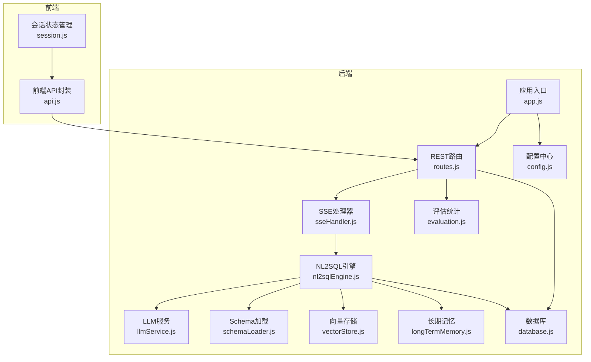
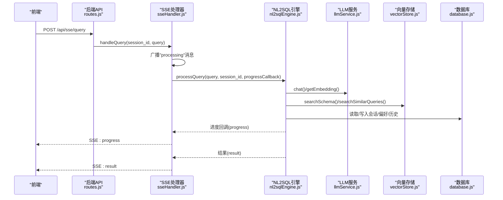
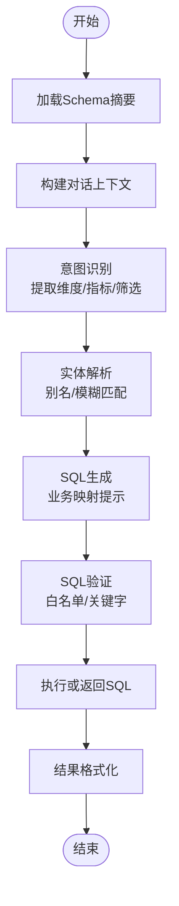
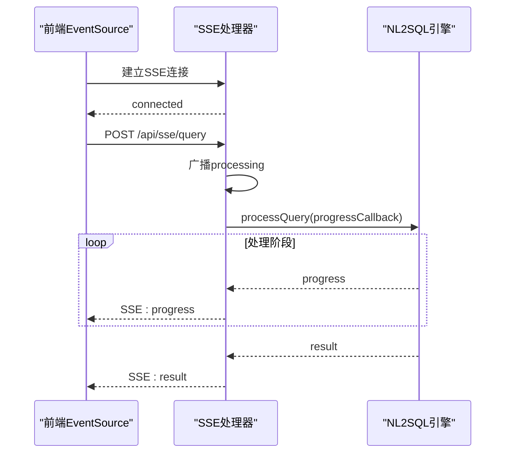
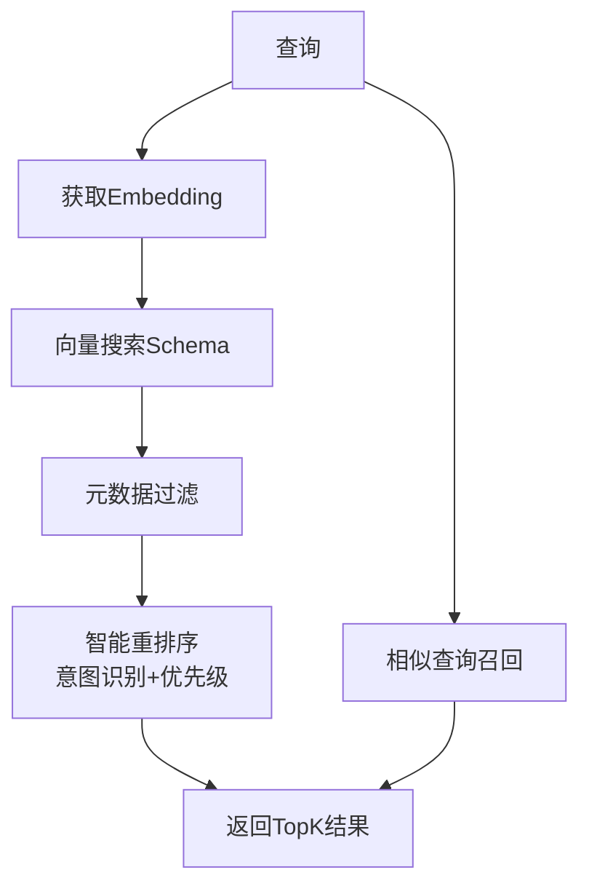
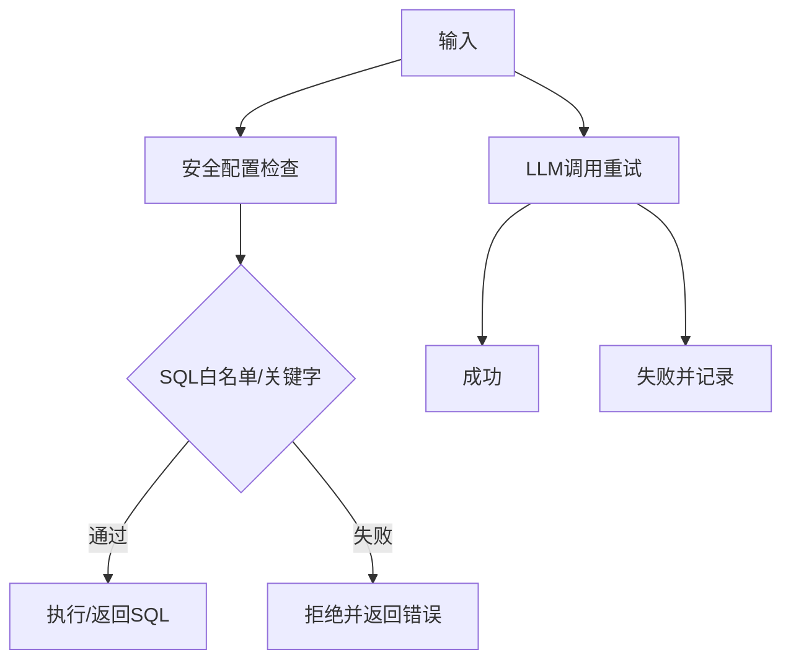
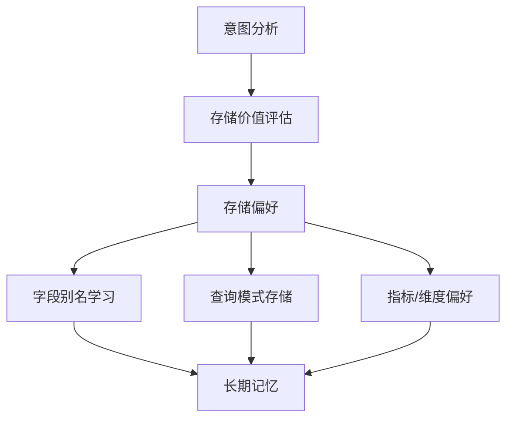
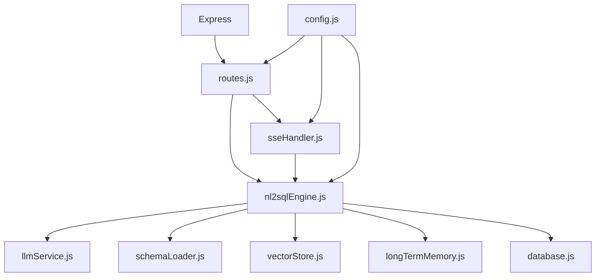

# 数据流设计

<cite>
**本文引用的文件**
- [app.js](file://backend/src/app.js)
- [routes.js](file://backend/src/core/routes.js)
- [nl2sqlEngine.js](file://backend/src/core/nl2sqlEngine.js)
- [sseHandler.js](file://backend/src/core/sseHandler.js)
- [llmService.js](file://backend/src/core/llmService.js)
- [schemaLoader.js](file://backend/src/core/schemaLoader.js)
- [vectorStore.js](file://backend/src/memory/vectorStore.js)
- [longTermMemory.js](file://backend/src/memory/longTermMemory.js)
- [evaluation.js](file://backend/src/utils/evaluation.js)
- [config.js](file://backend/src/core/config.js)
- [database.js](file://backend/src/core/database.js)
- [api.js](file://frontend/src/utils/api.js)
- [session.js](file://frontend/src/stores/session.js)
- [package.json](file://backend/package.json)
</cite>

## 目录
1. [简介](#简介)
2. [项目结构](#项目结构)
3. [核心组件](#核心组件)
4. [架构总览](#架构总览)
5. [详细组件分析](#详细组件分析)
6. [依赖关系分析](#依赖关系分析)
7. [性能考量](#性能考量)
8. [故障排查指南](#故障排查指南)
9. [结论](#结论)
10. [附录](#附录)

## 简介
本技术文档围绕 NL2SQL 系统的数据流设计展开，系统目标是将自然语言查询转化为可执行的 SQL，并通过实时流式反馈（SSE）向用户呈现处理进度与结果。数据流贯穿前端 API 调用、后端处理流程、LLM 与向量检索、Schema 管理、长期记忆与评估统计，以及数据库交互。本文将详细描述从用户输入到 SQL 执行的完整链路，包括数据在各组件间的传递方式、实时数据流机制、缓存与向量检索策略、数据验证与错误处理、性能优化与故障排查。

## 项目结构
后端采用 Node.js + Express 架构，核心模块包括：
- 应用入口与初始化：app.js
- REST API 路由：routes.js
- NL2SQL 核心引擎：nl2sqlEngine.js
- SSE 处理器：sseHandler.js
- LLM 服务：llmService.js
- Schema 管理：schemaLoader.js
- 向量存储：vectorStore.js
- 长期记忆：longTermMemory.js
- 评估统计：evaluation.js
- 配置中心：config.js
- 数据库：database.js

前端采用 Vue + Pinia，通过 axios 封装 API，使用 EventSource 实现 SSE 实时通信。

**图表来源**
- [app.js](file://backend/src/app.js)
- [routes.js](file://backend/src/core/routes.js)
- [sseHandler.js](file://backend/src/core/sseHandler.js)
- [nl2sqlEngine.js](file://backend/src/core/nl2sqlEngine.js)
- [llmService.js](file://backend/src/core/llmService.js)
- [schemaLoader.js](file://backend/src/core/schemaLoader.js)
- [vectorStore.js](file://backend/src/memory/vectorStore.js)
- [longTermMemory.js](file://backend/src/memory/longTermMemory.js)
- [evaluation.js](file://backend/src/utils/evaluation.js)
- [config.js](file://backend/src/core/config.js)
- [database.js](file://backend/src/core/database.js)
- [api.js](file://frontend/src/utils/api.js)
- [session.js](file://frontend/src/stores/session.js)

**章节来源**
- [app.js](file://backend/src/app.js)
- [routes.js](file://backend/src/core/routes.js)
- [package.json](file://backend/package.json)

## 核心组件
- 应用入口与初始化：负责加载环境变量、初始化数据库与向量库、挂载路由、启动 HTTP 与 SSE 服务。
- REST 路由：提供健康检查、Schema 查询、会话管理、查询历史、用户偏好、评估统计等接口。
- NL2SQL 引擎：实现意图识别、实体解析、SQL 生成、验证与结果格式化。
- SSE 处理器：管理 SSE 连接、进度回调、消息广播与连接清理。
- LLM 服务：封装 LLM API 调用、Embedding 获取、重试与超时控制。
- Schema 管理：加载与缓存 Schema、向量化、语义搜索与关键词匹配。
- 向量存储：基于 LanceDB 的 Schema 与查询历史向量存储、智能搜索与统计记录。
- 长期记忆：用户偏好抽取、存储、检索与分级清理。
- 评估统计：向量化质量评估、运行时统计与命中率统计。
- 配置中心：集中管理 LLM、数据库、安全、会话、日志、自修复、Schema、长期记忆、上下文管理与评估等配置。
- 数据库：SQLite 会话、消息、查询历史、用户偏好与系统日志持久化。

**章节来源**
- [app.js](file://backend/src/app.js)
- [routes.js](file://backend/src/core/routes.js)
- [nl2sqlEngine.js](file://backend/src/core/nl2sqlEngine.js)
- [sseHandler.js](file://backend/src/core/sseHandler.js)
- [llmService.js](file://backend/src/core/llmService.js)
- [schemaLoader.js](file://backend/src/core/schemaLoader.js)
- [vectorStore.js](file://backend/src/memory/vectorStore.js)
- [longTermMemory.js](file://backend/src/memory/longTermMemory.js)
- [evaluation.js](file://backend/src/utils/evaluation.js)
- [config.js](file://backend/src/core/config.js)
- [database.js](file://backend/src/core/database.js)

## 架构总览
系统采用“前端事件驱动 + 后端流式处理”的架构。前端通过 HTTP API 发起查询，后端通过 SSE 将处理进度与结果实时推送给前端。核心处理链路如下：
- 前端发起查询请求（HTTP POST /api/sse/query）
- 后端 SSE 处理器校验会话并广播“开始处理”消息
- NL2SQL 引擎调用 LLM 与向量存储，执行意图识别、实体解析、SQL 生成与验证
- 处理完成后，通过 SSE 推送“结果”消息，前端渲染 SQL 与数据

**图表来源**
- [routes.js](file://backend/src/core/routes.js)
- [sseHandler.js](file://backend/src/core/sseHandler.js)
- [nl2sqlEngine.js](file://backend/src/core/nl2sqlEngine.js)
- [llmService.js](file://backend/src/core/llmService.js)
- [vectorStore.js](file://backend/src/memory/vectorStore.js)
- [database.js](file://backend/src/core/database.js)
- [api.js](file://frontend/src/utils/api.js)
- [session.js](file://frontend/src/stores/session.js)

## 详细组件分析

### NL2SQL 引擎（意图识别、实体解析、SQL 生成与验证）
- 意图识别：结合上下文与用户偏好，提取时间范围、维度、指标、筛选条件等。
- 实体解析：优先使用长期记忆别名，其次数据库模糊匹配，最后回退到 LLM 识别。
- SQL 生成：基于 Schema 与意图生成 SQL，支持业务映射提示与表推断。
- SQL 验证：白名单与关键字过滤，防止危险操作。
- 结果格式化：将查询结果转为自然语言摘要。

**图表来源**
- [nl2sqlEngine.js](file://backend/src/core/nl2sqlEngine.js)
- [schemaLoader.js](file://backend/src/core/schemaLoader.js)
- [longTermMemory.js](file://backend/src/memory/longTermMemory.js)
- [database.js](file://backend/src/core/database.js)

**章节来源**
- [nl2sqlEngine.js](file://backend/src/core/nl2sqlEngine.js)
- [schemaLoader.js](file://backend/src/core/schemaLoader.js)
- [longTermMemory.js](file://backend/src/memory/longTermMemory.js)

### SSE 实时数据流与消息推送
- 连接管理：按会话维护连接列表，支持多标签页。
- 进度回调：引擎通过回调函数将处理阶段与进度广播给所有连接。
- 消息类型：connected/processing/progress/result/error。
- 广播策略：同一会话内所有连接共享消息。

**图表来源**
- [sseHandler.js](file://backend/src/core/sseHandler.js)
- [api.js](file://frontend/src/utils/api.js)
- [session.js](file://frontend/src/stores/session.js)

**章节来源**
- [sseHandler.js](file://backend/src/core/sseHandler.js)
- [api.js](file://frontend/src/utils/api.js)
- [session.js](file://frontend/src/stores/session.js)

### 向量检索与缓存策略
- Schema 向量化：表级表征，包含域标签、数据类型、核心特征词，元数据用于过滤与重排序。
- 查询历史向量化：记录用户查询向量，支持相似查询召回。
- 智能搜索：根据查询意图识别（如游戏名、平台类型）进行重排序与过滤。
- 缓存策略：Schema 向量按配置决定是否强制重新向量化；查询历史向量按相似度阈值与距离分布统计。

**图表来源**
- [vectorStore.js](file://backend/src/memory/vectorStore.js)
- [schemaLoader.js](file://backend/src/core/schemaLoader.js)
- [evaluation.js](file://backend/src/utils/evaluation.js)

**章节来源**
- [vectorStore.js](file://backend/src/memory/vectorStore.js)
- [schemaLoader.js](file://backend/src/core/schemaLoader.js)
- [evaluation.js](file://backend/src/utils/evaluation.js)

### 数据验证规则与错误处理
- 安全配置：禁止关键字白名单、最大返回行数、查询超时、敏感字段脱敏。
- SQL 验证：关键字过滤与表白名单校验。
- LLM 重试：指数退避重试，超时与解析失败处理。
- 评估统计：向量检索命中率与长期记忆命中率统计，支持重置。

**图表来源**
- [config.js](file://backend/src/core/config.js)
- [schemaLoader.js](file://backend/src/core/schemaLoader.js)
- [llmService.js](file://backend/src/core/llmService.js)
- [evaluation.js](file://backend/src/utils/evaluation.js)

**章节来源**
- [config.js](file://backend/src/core/config.js)
- [schemaLoader.js](file://backend/src/core/schemaLoader.js)
- [llmService.js](file://backend/src/core/llmService.js)
- [evaluation.js](file://backend/src/utils/evaluation.js)

### 查询结果处理与长期记忆
- 长期记忆：基于置信度、使用频率与模板价值进行筛选，支持字段别名、查询模式、指标/维度偏好。
- 记忆维护：分级保留策略（高频永久、中频90天、低频30天、字段别名365天）。
- LLM 智能提炼：区分个人偏好与通用知识，提取字段映射、分析习惯与过滤逻辑。

**图表来源**
- [longTermMemory.js](file://backend/src/memory/longTermMemory.js)
- [memoryMaintenance.js](file://backend/src/memory/memoryMaintenance.js)

**章节来源**
- [longTermMemory.js](file://backend/src/memory/longTermMemory.js)
- [memoryMaintenance.js](file://backend/src/memory/memoryMaintenance.js)

## 依赖关系分析
- 后端依赖：Express、LanceDB、SQLite3、dotenv、uuid、dayjs、node-cron。
- 模块耦合：NL2SQL 引擎依赖 LLM、Schema、向量存储、长期记忆与数据库；SSE 处理器依赖 NL2SQL 引擎与数据库；路由依赖各核心模块。
- 外部集成：LLM API（兼容 OpenAI 格式）、LanceDB 向量数据库。

**图表来源**
- [routes.js](file://backend/src/core/routes.js)
- [sseHandler.js](file://backend/src/core/sseHandler.js)
- [nl2sqlEngine.js](file://backend/src/core/nl2sqlEngine.js)
- [llmService.js](file://backend/src/core/llmService.js)
- [schemaLoader.js](file://backend/src/core/schemaLoader.js)
- [vectorStore.js](file://backend/src/memory/vectorStore.js)
- [longTermMemory.js](file://backend/src/memory/longTermMemory.js)
- [database.js](file://backend/src/core/database.js)
- [config.js](file://backend/src/core/config.js)

**章节来源**
- [package.json](file://backend/package.json)
- [routes.js](file://backend/src/core/routes.js)
- [sseHandler.js](file://backend/src/core/sseHandler.js)
- [nl2sqlEngine.js](file://backend/src/core/nl2sqlEngine.js)
- [llmService.js](file://backend/src/core/llmService.js)
- [schemaLoader.js](file://backend/src/core/schemaLoader.js)
- [vectorStore.js](file://backend/src/memory/vectorStore.js)
- [longTermMemory.js](file://backend/src/memory/longTermMemory.js)
- [database.js](file://backend/src/core/database.js)
- [config.js](file://backend/src/core/config.js)

## 性能考量
- 向量检索：表级向量减少存储与计算开销；智能搜索结合意图识别与元数据过滤，提升召回质量。
- Token 预算与摘要：上下文管理模块控制最大上下文与输出 Token，避免模型输出不足。
- 数据库索引：为会话、消息、查询历史与偏好建立索引，加速查询。
- SSE 广播：同一会话内多连接共享消息，减少重复计算。
- LLM 超时与重试：合理设置超时与重试，避免阻塞与资源浪费。
- 评估统计：运行时统计不影响主流程，仅在启用时记录。

[本节为通用指导，不直接分析具体文件]

## 故障排查指南
- 健康检查：通过 /api/health 与 /api/health/detail 检查数据库、LLM、Schema、SSE 连接状态。
- 日志定位：关注启动日志、SSE 连接日志、LLM 请求日志与向量存储初始化日志。
- 常见问题：
  - LLM API 未配置或密钥错误：检查 LLM_API_KEY 与 LLM_API_BASE。
  - 向量数据库未初始化：确认 LanceDB 路径与权限。
  - 查询超时：调整 LLM/Embedding 超时与查询超时配置。
  - SQL 被拒绝：检查 forbiddenKeywords 与 allowedTables 白名单。
- 评估统计：通过 /api/evaluation/stats 获取命中率与距离分布，必要时重置统计。

**章节来源**
- [routes.js](file://backend/src/core/routes.js)
- [config.js](file://backend/src/core/config.js)
- [evaluation.js](file://backend/src/utils/evaluation.js)

## 结论
NL2SQL 系统通过清晰的模块划分与稳健的实时数据流设计，实现了从自然语言到 SQL 的高效转换。前端通过 SSE 实时感知处理进度，后端通过意图识别、实体解析与向量检索提升准确性，配合长期记忆与评估统计持续优化体验。安全配置与错误处理保障了系统的稳定性与可靠性。

[本节为总结性内容，不直接分析具体文件]

## 附录
- 前端 API 封装：统一请求/响应拦截、SSE 连接与消息处理。
- 配置项：LLM、Embedding、数据库、安全、会话、日志、自修复、Schema、长期记忆、上下文管理与评估等。

**章节来源**
- [api.js](file://frontend/src/utils/api.js)
- [session.js](file://frontend/src/stores/session.js)
- [config.js](file://backend/src/core/config.js)