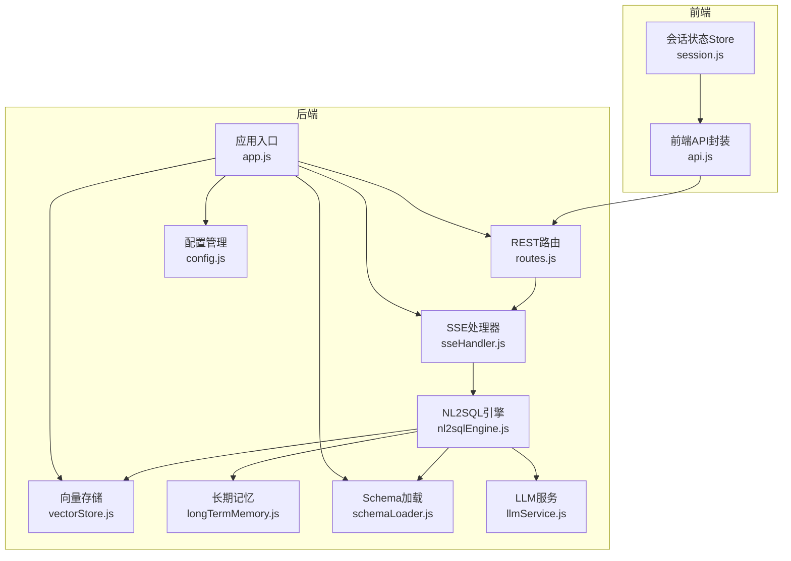
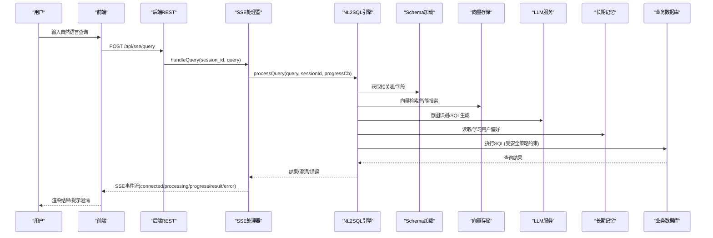
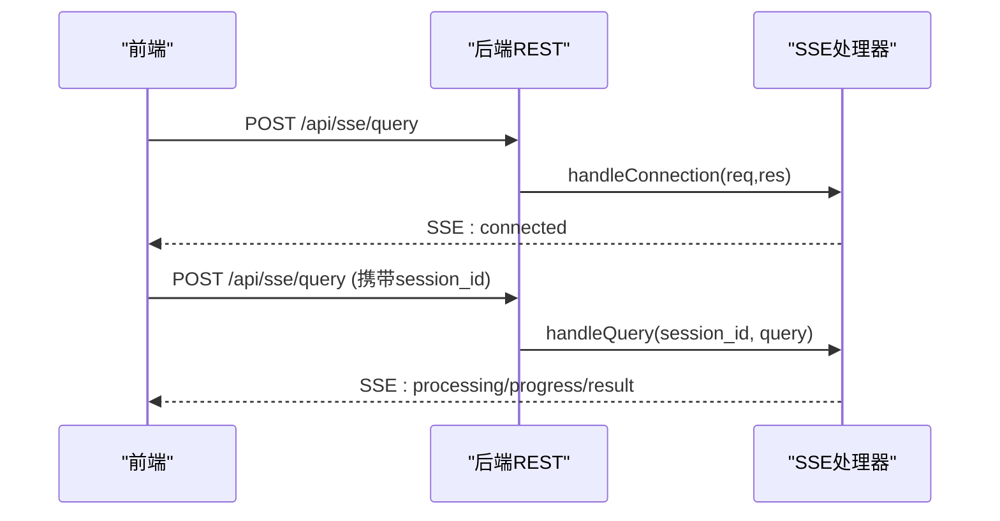
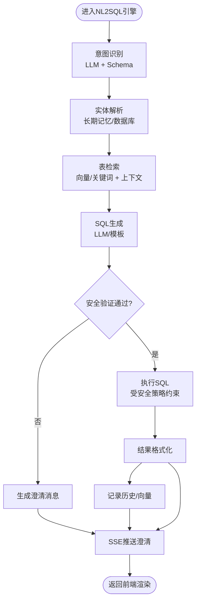
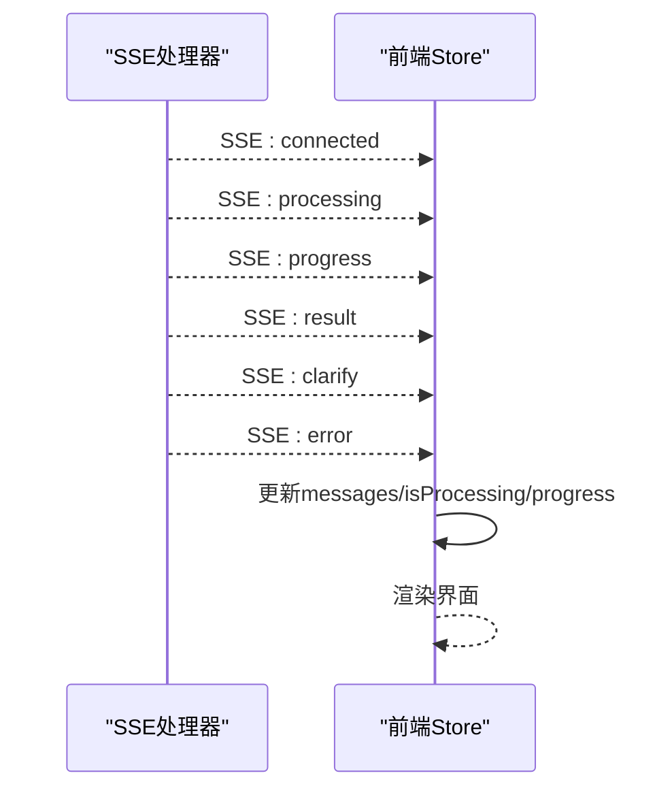
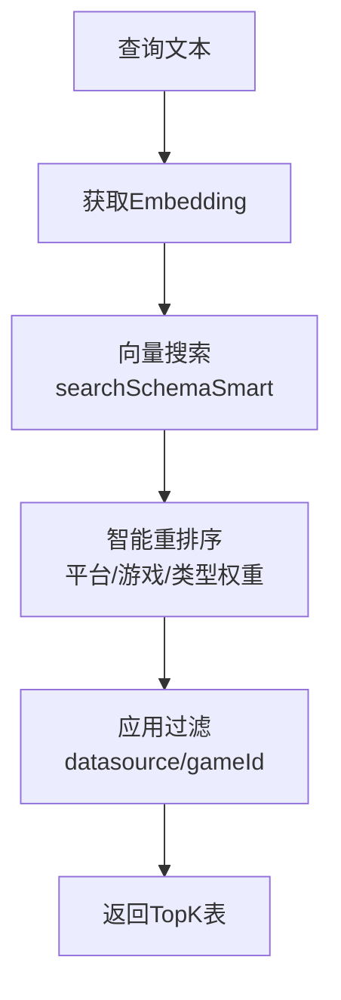
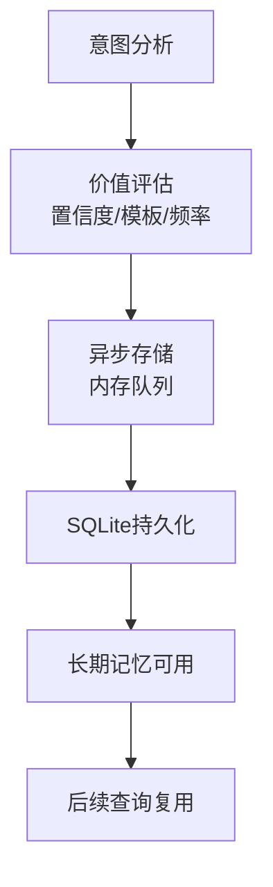
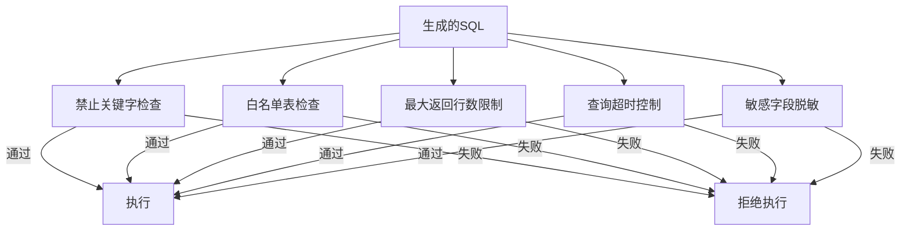
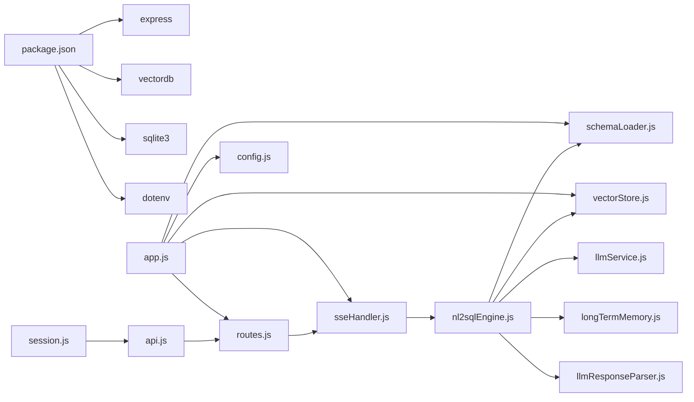

# 数据流设计

<cite>
**本文引用的文件**
- [app.js](file://backend/src/app.js)
- [routes.js](file://backend/src/core/routes.js)
- [nl2sqlEngine.js](file://backend/src/core/nl2sqlEngine.js)
- [sseHandler.js](file://backend/src/core/sseHandler.js)
- [vectorStore.js](file://backend/src/memory/vectorStore.js)
- [longTermMemory.js](file://backend/src/memory/longTermMemory.js)
- [schemaLoader.js](file://backend/src/core/schemaLoader.js)
- [llmService.js](file://backend/src/core/llmService.js)
- [llmResponseParser.js](file://backend/src/utils/llmResponseParser.js)
- [config.js](file://backend/src/core/config.js)
- [api.js](file://frontend/src/utils/api.js)
- [session.js](file://frontend/src/stores/session.js)
- [package.json](file://backend/package.json)
</cite>

## 目录
1. [简介](#简介)
2. [项目结构](#项目结构)
3. [核心组件](#核心组件)
4. [架构总览](#架构总览)
5. [详细组件分析](#详细组件分析)
6. [依赖关系分析](#依赖关系分析)
7. [性能考量](#性能考量)
8. [故障排查指南](#故障排查指南)
9. [结论](#结论)
10. [附录](#附录)

## 简介
本文件面向NL2SQL系统，聚焦“从用户输入到最终结果输出”的完整数据流设计。文档详细说明：
- 自然语言处理、SQL生成、数据库查询与结果返回的数据变换过程
- SSE实时流式传输机制、客户端渲染与状态更新流程
- 数据缓存策略、向量检索的数据路径与记忆系统的数据持久化
- 关键节点的数据格式、异常处理机制
- 数据安全与隐私保护策略

## 项目结构
后端采用Express + Node.js，前端采用Vue + Pinia，通过REST API与SSE进行交互。核心模块包括：
- 应用入口与初始化：app.js
- REST路由：routes.js
- NL2SQL引擎：nl2sqlEngine.js
- SSE处理器：sseHandler.js
- 向量存储：vectorStore.js
- 长期记忆：longTermMemory.js
- Schema加载：schemaLoader.js
- LLM服务：llmService.js
- 配置管理：config.js
- 前端API封装：api.js
- 前端会话状态：session.js

图表来源
- [app.js:1-266](file://backend/src/app.js#L1-L266)
- [routes.js:1-800](file://backend/src/core/routes.js#L1-L800)
- [nl2sqlEngine.js:1-800](file://backend/src/core/nl2sqlEngine.js#L1-L800)
- [sseHandler.js:1-349](file://backend/src/core/sseHandler.js#L1-L349)
- [vectorStore.js:1-800](file://backend/src/memory/vectorStore.js#L1-L800)
- [longTermMemory.js:1-800](file://backend/src/memory/longTermMemory.js#L1-L800)
- [schemaLoader.js:1-800](file://backend/src/core/schemaLoader.js#L1-L800)
- [llmService.js:1-477](file://backend/src/core/llmService.js#L1-L477)
- [config.js:1-398](file://backend/src/core/config.js#L1-L398)
- [api.js:1-303](file://frontend/src/utils/api.js#L1-L303)
- [session.js:1-400](file://frontend/src/stores/session.js#L1-L400)

章节来源
- [app.js:1-266](file://backend/src/app.js#L1-L266)
- [routes.js:1-800](file://backend/src/core/routes.js#L1-L800)

## 核心组件
- 应用入口与初始化：负责加载配置、初始化数据库与向量库、挂载路由、启动HTTP与SSE服务。
- REST路由：提供Schema查询、会话管理、查询历史、用户偏好、评估等接口。
- NL2SQL引擎：意图识别、实体解析、SQL生成、验证与结果格式化。
- SSE处理器：连接管理、进度回调、结果广播。
- 向量存储：Schema与查询历史的向量化、语义检索、智能重排序。
- 长期记忆：用户偏好抽取与存储、字段别名学习、模板与习惯记忆。
- Schema加载：Schema元数据加载、向量化、表级检索与过滤。
- LLM服务：聊天、Embedding、重试与错误处理。
- 配置管理：集中配置、校验与环境变量读取。
- 前端API封装：REST与SSE调用封装。
- 前端会话状态：会话管理、消息渲染、SSE事件处理。

章节来源
- [nl2sqlEngine.js:1-800](file://backend/src/core/nl2sqlEngine.js#L1-L800)
- [sseHandler.js:1-349](file://backend/src/core/sseHandler.js#L1-L349)
- [vectorStore.js:1-800](file://backend/src/memory/vectorStore.js#L1-L800)
- [longTermMemory.js:1-800](file://backend/src/memory/longTermMemory.js#L1-L800)
- [schemaLoader.js:1-800](file://backend/src/core/schemaLoader.js#L1-L800)
- [llmService.js:1-477](file://backend/src/core/llmService.js#L1-L477)
- [config.js:1-398](file://backend/src/core/config.js#L1-L398)
- [api.js:1-303](file://frontend/src/utils/api.js#L1-L303)
- [session.js:1-400](file://frontend/src/stores/session.js#L1-L400)

## 架构总览
用户通过前端发起查询，后端通过REST提交查询，SSE建立长连接推送实时进度与结果。NL2SQL引擎结合Schema与向量检索、LLM与长期记忆，生成SQL并执行，最终通过SSE返回给前端渲染。

图表来源
- [routes.js:246-251](file://backend/src/core/routes.js#L246-L251)
- [sseHandler.js:218-280](file://backend/src/core/sseHandler.js#L218-L280)
- [nl2sqlEngine.js:1-800](file://backend/src/core/nl2sqlEngine.js#L1-L800)
- [schemaLoader.js:571-653](file://backend/src/core/schemaLoader.js#L571-L653)
- [vectorStore.js:452-576](file://backend/src/memory/vectorStore.js#L452-L576)
- [llmService.js:222-308](file://backend/src/core/llmService.js#L222-L308)
- [longTermMemory.js:299-461](file://backend/src/memory/longTermMemory.js#L299-L461)
- [api.js:246-251](file://frontend/src/utils/api.js#L246-L251)
- [session.js:185-221](file://frontend/src/stores/session.js#L185-L221)

## 详细组件分析

### 1) 用户输入到SSE连接建立
- 前端通过REST提交查询，后端SSE处理器建立连接并广播“connected”事件。
- 前端Store维护SSE连接实例，解析事件并更新UI状态。

图表来源
- [routes.js:246-251](file://backend/src/core/routes.js#L246-L251)
- [sseHandler.js:43-112](file://backend/src/core/sseHandler.js#L43-L112)
- [session.js:185-221](file://frontend/src/stores/session.js#L185-L221)

章节来源
- [routes.js:246-251](file://backend/src/core/routes.js#L246-L251)
- [sseHandler.js:43-112](file://backend/src/core/sseHandler.js#L43-L112)
- [session.js:185-221](file://frontend/src/stores/session.js#L185-L221)

### 2) NL2SQL引擎处理流程
- 意图识别与实体解析：从LLM获取意图，结合长期记忆与数据库进行实体映射。
- 表与字段检索：优先向量检索，回退关键词匹配；支持上下文增强（平台、游戏ID）。
- SQL生成与验证：生成SQL并通过安全策略校验，必要时进行澄清。
- 结果格式化与持久化：将结果转为自然语言，记录查询历史与向量。

图表来源
- [nl2sqlEngine.js:1-800](file://backend/src/core/nl2sqlEngine.js#L1-L800)
- [schemaLoader.js:571-653](file://backend/src/core/schemaLoader.js#L571-L653)
- [vectorStore.js:452-576](file://backend/src/memory/vectorStore.js#L452-L576)
- [longTermMemory.js:299-461](file://backend/src/memory/longTermMemory.js#L299-L461)

章节来源
- [nl2sqlEngine.js:1-800](file://backend/src/core/nl2sqlEngine.js#L1-L800)
- [schemaLoader.js:571-653](file://backend/src/core/schemaLoader.js#L571-L653)
- [vectorStore.js:452-576](file://backend/src/memory/vectorStore.js#L452-L576)
- [longTermMemory.js:299-461](file://backend/src/memory/longTermMemory.js#L299-L461)

### 3) SSE实时流式传输与客户端渲染
- 后端SSE处理器维护会话级连接映射，广播事件类型：connected、processing、progress、result、clarify、error。
- 前端Store订阅EventSource，按事件类型更新状态与消息列表，驱动UI渲染。

图表来源
- [sseHandler.js:218-280](file://backend/src/core/sseHandler.js#L218-L280)
- [session.js:227-295](file://frontend/src/stores/session.js#L227-L295)

章节来源
- [sseHandler.js:218-280](file://backend/src/core/sseHandler.js#L218-L280)
- [session.js:227-295](file://frontend/src/stores/session.js#L227-L295)

### 4) 向量检索与智能重排序
- Schema向量：表级向量，包含域标签、类型、核心特征，用于语义检索。
- 查询历史向量：记录用户查询，支持相似查询检索。
- 智能搜索：根据查询意图识别平台/游戏，进行优先级重排与过滤。

图表来源
- [vectorStore.js:452-576](file://backend/src/memory/vectorStore.js#L452-L576)
- [schemaLoader.js:571-653](file://backend/src/core/schemaLoader.js#L571-L653)

章节来源
- [vectorStore.js:452-576](file://backend/src/memory/vectorStore.js#L452-L576)
- [schemaLoader.js:571-653](file://backend/src/core/schemaLoader.js#L571-L653)

### 5) 长期记忆与偏好持久化
- 偏好类型：查询模式、字段别名、指标/维度偏好。
- 存储策略：置信度阈值、模板价值、使用频率、个人偏好判定。
- 学习机制：字段别名学习、过滤逻辑、维度习惯等。

图表来源
- [longTermMemory.js:299-461](file://backend/src/memory/longTermMemory.js#L299-L461)
- [longTermMemory.js:748-800](file://backend/src/memory/longTermMemory.js#L748-L800)

章节来源
- [longTermMemory.js:299-461](file://backend/src/memory/longTermMemory.js#L299-L461)
- [longTermMemory.js:748-800](file://backend/src/memory/longTermMemory.js#L748-L800)

### 6) 数据安全与隐私保护
- 安全策略：禁止关键字、白名单表、最大返回行数、查询超时、敏感字段脱敏。
- Dry-run模式：仅生成SQL不执行，便于调试。
- 配置校验：启动时校验必要配置，避免错误暴露。

图表来源
- [config.js:140-170](file://backend/src/core/config.js#L140-L170)
- [schemaLoader.js:723-759](file://backend/src/core/schemaLoader.js#L723-L759)

章节来源
- [config.js:140-170](file://backend/src/core/config.js#L140-L170)
- [schemaLoader.js:723-759](file://backend/src/core/schemaLoader.js#L723-L759)

## 依赖关系分析
- 后端依赖：Express、vectordb(LanceDB)、sqlite3、uuid、dayjs、node-cron、dotenv。
- 模块耦合：NL2SQL引擎依赖Schema、向量存储、LLM服务、长期记忆；SSE处理器依赖NL2SQL引擎；前端Store依赖API封装。

图表来源
- [package.json:10-20](file://backend/package.json#L10-L20)
- [app.js:22-48](file://backend/src/app.js#L22-L48)
- [routes.js:16-36](file://backend/src/core/routes.js#L16-L36)
- [nl2sqlEngine.js:16-33](file://backend/src/core/nl2sqlEngine.js#L16-L33)
- [llmResponseParser.js:1-146](file://backend/src/utils/llmResponseParser.js#L1-L146)
- [api.js:14-34](file://frontend/src/utils/api.js#L14-L34)
- [session.js:15-22](file://frontend/src/stores/session.js#L15-L22)

章节来源
- [package.json:10-20](file://backend/package.json#L10-L20)
- [app.js:22-48](file://backend/src/app.js#L22-L48)
- [routes.js:16-36](file://backend/src/core/routes.js#L16-L36)
- [nl2sqlEngine.js:16-33](file://backend/src/core/nl2sqlEngine.js#L16-L33)
- [llmResponseParser.js:1-146](file://backend/src/utils/llmResponseParser.js#L1-L146)
- [api.js:14-34](file://frontend/src/utils/api.js#L14-L34)
- [session.js:15-22](file://frontend/src/stores/session.js#L15-L22)

## 性能考量
- 向量检索：表级向量减少字段级向量开销，智能重排序降低无关表影响。
- 缓存策略：Schema元数据缓存、向量库初始化状态、连接映射。
- Token预算与摘要：控制上下文长度，避免LLM调用超限。
- 数据库连接池：合理配置最小/最大连接数与超时。
- SSE：多标签页连接复用，连接清理与错误处理。

## 故障排查指南
- 启动失败：检查配置校验与必要环境变量，查看日志。
- SSE连接失败：确认会话存在、URL参数正确、连接未被Nginx缓冲。
- 查询无结果：检查白名单表、禁止关键字、最大行数限制。
- 向量检索失败：确认LanceDB初始化、Embedding模型可用、向量表存在。
- 长期记忆不生效：检查阈值配置、LLM提取开关、异步存储队列。

章节来源
- [app.js:103-194](file://backend/src/app.js#L103-L194)
- [sseHandler.js:43-112](file://backend/src/core/sseHandler.js#L43-L112)
- [config.js:366-388](file://backend/src/core/config.js#L366-L388)
- [vectorStore.js:233-263](file://backend/src/memory/vectorStore.js#L233-L263)
- [longTermMemory.js:299-461](file://backend/src/memory/longTermMemory.js#L299-L461)

## 结论
NL2SQL系统通过清晰的数据流设计实现了从自然语言到SQL再到结果展示的闭环。SSE实现实时反馈，向量检索与长期记忆提升准确性与个性化，安全策略保障数据合规。整体架构模块化、可扩展性强，适合在生产环境中持续演进。

## 附录
- 关键数据格式
  - SSE事件类型：connected、processing、progress、result、clarify、error
  - NL2SQL引擎输入：query、sessionId、progress回调
  - 向量存储元数据：scope、data_type、key_features、importanceScore、queryType
  - 长期记忆偏好：query_pattern、field_alias、metric_preference、dimension_preference
- 异常处理
  - 未处理Promise拒绝与未捕获异常的优雅关闭
  - LLM与Embedding的重试机制
  - SSE连接错误与关闭清理