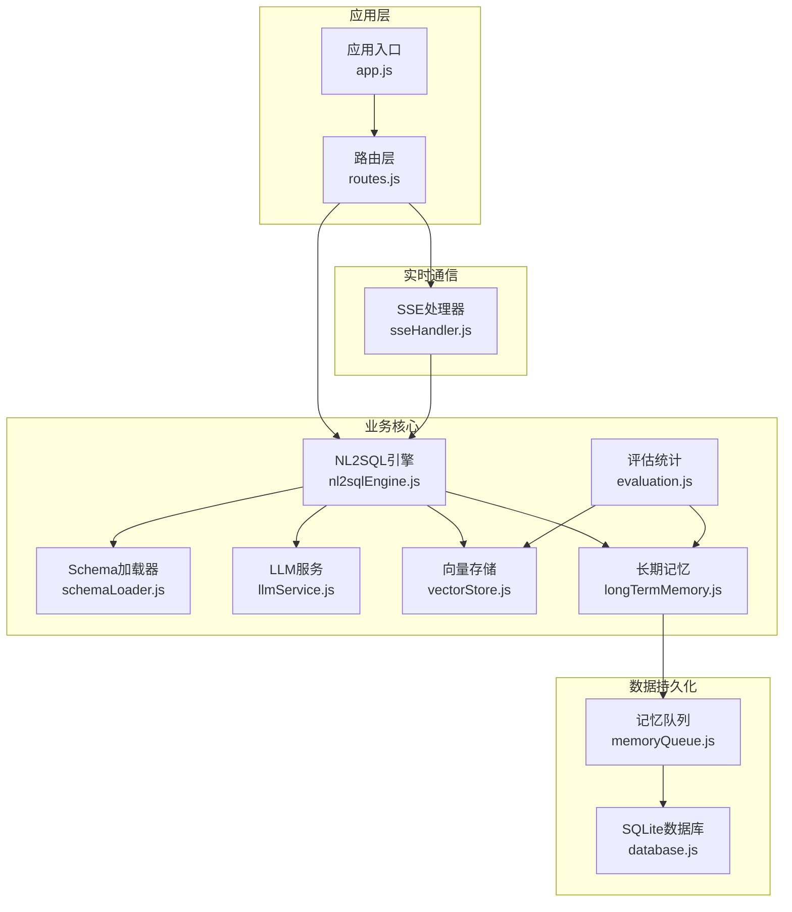
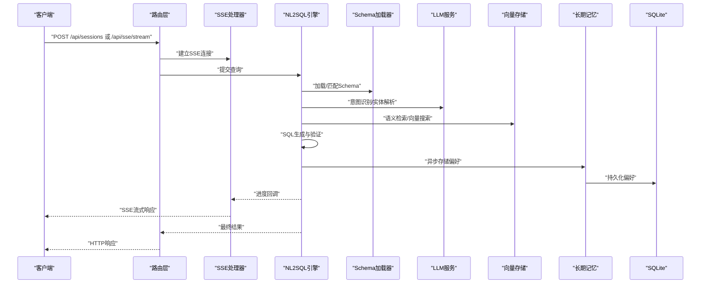
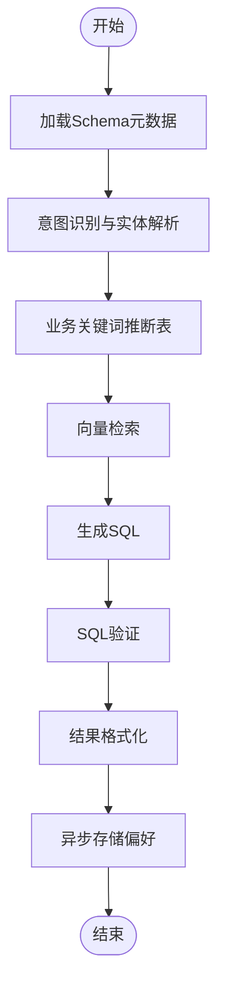
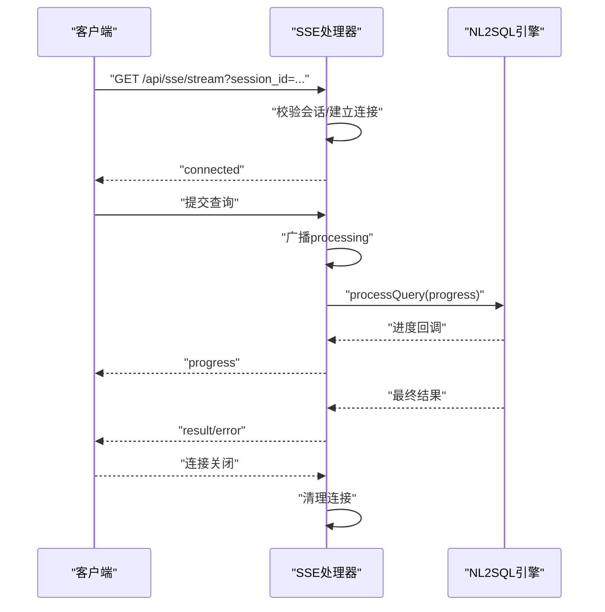
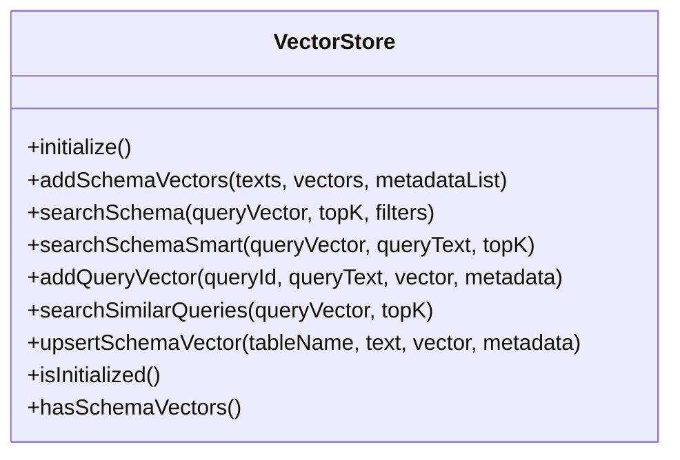
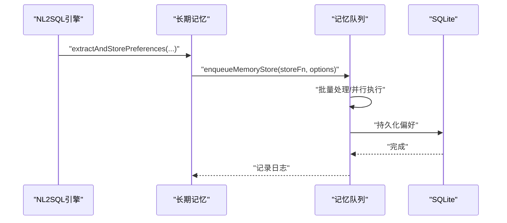
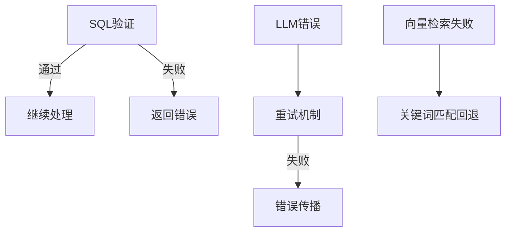
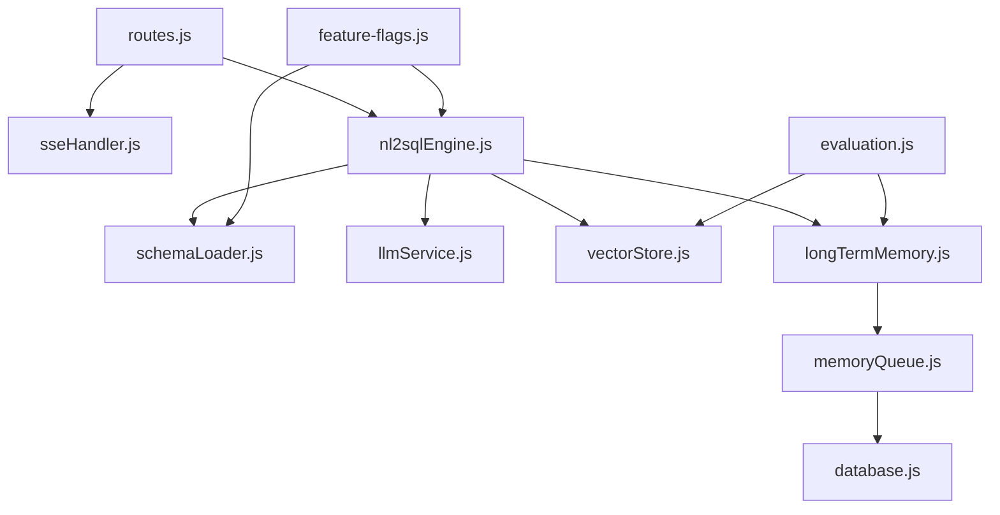

# 数据流设计

<cite>
**本文档引用的文件**
- [app.js](file://backend/src/app.js)
- [routes.js](file://backend/src/core/routes.js)
- [nl2sqlEngine.js](file://backend/src/core/nl2sqlEngine.js)
- [llmService.js](file://backend/src/core/llmService.js)
- [vectorStore.js](file://backend/src/memory/vectorStore.js)
- [sseHandler.js](file://backend/src/core/sseHandler.js)
- [longTermMemory.js](file://backend/src/memory/longTermMemory.js)
- [evaluation.js](file://backend/src/utils/evaluation.js)
- [schemaLoader.js](file://backend/src/core/schemaLoader.js)
- [database.js](file://backend/src/core/database.js)
- [memoryQueue.js](file://backend/src/memory/memoryQueue.js)
- [feature-flags.js](file://backend/config/feature-flags.js)
- [schema-metadata.json](file://backend/config/schema-metadata.json)
- [package.json](file://backend/package.json)
</cite>

## 目录
1. [简介](#简介)
2. [项目结构](#项目结构)
3. [核心组件](#核心组件)
4. [架构总览](#架构总览)
5. [详细组件分析](#详细组件分析)
6. [依赖关系分析](#依赖关系分析)
7. [性能考虑](#性能考虑)
8. [故障排查指南](#故障排查指南)
9. [结论](#结论)

## 简介
本文件为NL2SQL系统的数据流设计文档，围绕“从用户输入到最终响应”的完整数据流转过程，系统阐述自然语言解析、SQL生成、向量检索与结果返回的各个环节。文档重点说明：
- 数据在不同组件间的传递方式：同步调用、异步处理与流式传输
- 数据格式转换与缓存策略
- 实时数据流处理（SSE流式响应）
- 数据验证、错误传播与回滚机制
- 数据持久化策略、备份恢复与一致性保障
- 面向开发者的调试指导

## 项目结构
后端采用模块化分层设计，核心模块包括：
- 应用入口与服务初始化：app.js
- REST API路由：routes.js
- NL2SQL核心引擎：nl2sqlEngine.js
- LLM服务封装：llmService.js
- 向量存储与语义检索：vectorStore.js
- SSE流式响应：sseHandler.js
- 长期记忆与偏好管理：longTermMemory.js
- 评估与统计：evaluation.js
- Schema元数据加载与校验：schemaLoader.js
- SQLite持久化：database.js
- 异步记忆队列：memoryQueue.js
- 功能开关：feature-flags.js
- Schema元数据配置：schema-metadata.json

**图表来源**
- [app.js:1-260](file://backend/src/app.js#L1-L260)
- [routes.js:1-800](file://backend/src/core/routes.js#L1-L800)
- [nl2sqlEngine.js:1-800](file://backend/src/core/nl2sqlEngine.js#L1-L800)
- [llmService.js:1-477](file://backend/src/core/llmService.js#L1-L477)
- [vectorStore.js:1-881](file://backend/src/memory/vectorStore.js#L1-L881)
- [sseHandler.js:1-349](file://backend/src/core/sseHandler.js#L1-L349)
- [longTermMemory.js:1-1127](file://backend/src/memory/longTermMemory.js#L1-L1127)
- [evaluation.js:1-488](file://backend/src/utils/evaluation.js#L1-L488)
- [schemaLoader.js:1-1172](file://backend/src/core/schemaLoader.js#L1-L1172)
- [database.js:1-859](file://backend/src/core/database.js#L1-L859)
- [memoryQueue.js:1-217](file://backend/src/memory/memoryQueue.js#L1-L217)

**章节来源**
- [app.js:1-260](file://backend/src/app.js#L1-L260)
- [package.json:1-28](file://backend/package.json#L1-L28)

## 核心组件
- 应用入口与初始化：负责加载环境变量、初始化数据库与向量库、挂载路由、启动HTTP与SSE服务、优雅关闭。
- 路由层：提供健康检查、Schema查询、会话管理、查询历史、用户偏好、评估接口等REST API。
- NL2SQL引擎：实现意图识别、实体解析、SQL生成、验证与结果格式化，支持澄清机制与错误恢复。
- LLM服务：封装HTTP请求、重试机制、流式响应与Embedding向量获取。
- 向量存储：基于LanceDB的Schema与查询历史向量存储，支持智能搜索与元数据增强。
- SSE处理器：管理SSE连接、进度回调与流式消息广播。
- 长期记忆：异步提取与存储用户偏好，支持字段别名、查询模式、指标/维度偏好。
- 评估统计：记录向量检索命中率与长期记忆命中率，支持手动质量评估。
- Schema加载器：加载JSON配置、构建映射、向量化表级表征、SQL验证。
- SQLite持久化：会话、消息、查询历史、用户偏好等数据的持久化。
- 功能开关：按Phase控制新功能启用，支持快速回滚。

**章节来源**
- [routes.js:1-800](file://backend/src/core/routes.js#L1-L800)
- [nl2sqlEngine.js:1-800](file://backend/src/core/nl2sqlEngine.js#L1-L800)
- [llmService.js:1-477](file://backend/src/core/llmService.js#L1-L477)
- [vectorStore.js:1-881](file://backend/src/memory/vectorStore.js#L1-L881)
- [sseHandler.js:1-349](file://backend/src/core/sseHandler.js#L1-L349)
- [longTermMemory.js:1-1127](file://backend/src/memory/longTermMemory.js#L1-L1127)
- [evaluation.js:1-488](file://backend/src/utils/evaluation.js#L1-L488)
- [schemaLoader.js:1-1172](file://backend/src/core/schemaLoader.js#L1-L1172)
- [database.js:1-859](file://backend/src/core/database.js#L1-L859)
- [memoryQueue.js:1-217](file://backend/src/memory/memoryQueue.js#L1-L217)
- [feature-flags.js:1-249](file://backend/config/feature-flags.js#L1-L249)

## 架构总览
NL2SQL系统采用“请求驱动 + 异步处理 + 流式响应”的混合架构：
- 请求入口：HTTP REST API（/api/*）与SSE流式接口（/api/sse/stream）
- 数据处理：NL2SQL引擎串联Schema加载、LLM解析、向量检索、SQL生成与验证
- 数据持久化：SQLite存储会话与历史，JSON配置驱动Schema元数据
- 实时反馈：SSE广播进度与结果，支持多标签页连接
- 可观测性：评估模块记录命中率与统计，便于性能优化

**图表来源**
- [routes.js:1-800](file://backend/src/core/routes.js#L1-L800)
- [sseHandler.js:1-349](file://backend/src/core/sseHandler.js#L1-L349)
- [nl2sqlEngine.js:1-800](file://backend/src/core/nl2sqlEngine.js#L1-L800)
- [schemaLoader.js:1-1172](file://backend/src/core/schemaLoader.js#L1-L1172)
- [llmService.js:1-477](file://backend/src/core/llmService.js#L1-L477)
- [vectorStore.js:1-881](file://backend/src/memory/vectorStore.js#L1-L881)
- [longTermMemory.js:1-1127](file://backend/src/memory/longTermMemory.js#L1-L1127)
- [database.js:1-859](file://backend/src/core/database.js#L1-L859)

## 详细组件分析

### NL2SQL引擎数据流
NL2SQL引擎负责将自然语言转换为SQL，核心流程如下：
- 输入：用户查询、会话ID、进度回调
- 处理：意图识别、实体解析、表推断、SQL生成、验证、结果格式化
- 输出：结构化结果（含SQL、澄清需求、错误信息）

**图表来源**
- [nl2sqlEngine.js:1-800](file://backend/src/core/nl2sqlEngine.js#L1-L800)
- [schemaLoader.js:1-1172](file://backend/src/core/schemaLoader.js#L1-L1172)
- [vectorStore.js:1-881](file://backend/src/memory/vectorStore.js#L1-L881)

**章节来源**
- [nl2sqlEngine.js:1-800](file://backend/src/core/nl2sqlEngine.js#L1-L800)

### SSE流式数据流
SSE处理器负责实时推送处理进度与结果：
- 建立连接：校验会话、记录连接信息、发送连接成功消息
- 处理查询：广播“开始处理”消息，调用NL2SQL引擎，逐阶段广播进度
- 结果返回：成功时发送“结果”，失败时发送“错误”
- 连接管理：关闭与错误清理，支持多标签页

**图表来源**
- [sseHandler.js:1-349](file://backend/src/core/sseHandler.js#L1-L349)
- [nl2sqlEngine.js:1-800](file://backend/src/core/nl2sqlEngine.js#L1-L800)

**章节来源**
- [sseHandler.js:1-349](file://backend/src/core/sseHandler.js#L1-L349)

### 向量检索与Schema向量化
向量存储模块提供语义检索能力：
- 初始化：连接LanceDB，创建schema_vectors与query_vectors表
- Schema向量化：表级表征（包含域、类型、核心特征），元数据增强（scope、data_type、importanceScore等）
- 智能搜索：结合查询意图（游戏/平台）与元数据过滤，重排序返回结果
- 查询历史向量化：相似查询召回，支持评估

**图表来源**
- [vectorStore.js:1-881](file://backend/src/memory/vectorStore.js#L1-L881)

**章节来源**
- [vectorStore.js:1-881](file://backend/src/memory/vectorStore.js#L1-L881)

### 长期记忆与异步存储
长期记忆模块异步提取与存储用户偏好，避免阻塞主流程：
- 偏好提取：查询模式、字段别名、指标/维度偏好
- 异步存储：通过内存队列批量处理，支持并行与失败重试
- 数据库持久化：SQLite存储用户偏好，支持使用次数与时间排序

**图表来源**
- [longTermMemory.js:1-1127](file://backend/src/memory/longTermMemory.js#L1-L1127)
- [memoryQueue.js:1-217](file://backend/src/memory/memoryQueue.js#L1-L217)
- [database.js:1-859](file://backend/src/core/database.js#L1-L859)

**章节来源**
- [longTermMemory.js:1-1127](file://backend/src/memory/longTermMemory.js#L1-L1127)
- [memoryQueue.js:1-217](file://backend/src/memory/memoryQueue.js#L1-L217)
- [database.js:1-859](file://backend/src/core/database.js#L1-L859)

### 数据验证与错误传播
系统在多处进行数据验证与错误传播：
- SQL验证：禁止关键字检查与白名单表检查
- LLM错误：HTTP状态码、JSON解析失败、响应截断检测
- 向量检索：失败回退到关键词匹配
- 评估统计：静默失败不影响主流程

**图表来源**
- [schemaLoader.js:1-1172](file://backend/src/core/schemaLoader.js#L1-L1172)
- [llmService.js:1-477](file://backend/src/core/llmService.js#L1-L477)
- [evaluation.js:1-488](file://backend/src/utils/evaluation.js#L1-L488)

**章节来源**
- [schemaLoader.js:1-1172](file://backend/src/core/schemaLoader.js#L1-L1172)
- [llmService.js:1-477](file://backend/src/core/llmService.js#L1-L477)
- [evaluation.js:1-488](file://backend/src/utils/evaluation.js#L1-L488)

## 依赖关系分析
- 组件耦合：NL2SQL引擎依赖Schema加载器、LLM服务、向量存储与长期记忆；路由层依赖NL2SQL引擎与SSE处理器；评估模块与向量存储、长期记忆松耦合。
- 外部依赖：Express、LanceDB、SQLite3、dotenv、uuid、node-cron等。
- 功能开关：通过feature-flags.js控制Phase级功能启用，支持快速回滚。

**图表来源**
- [routes.js:1-800](file://backend/src/core/routes.js#L1-L800)
- [sseHandler.js:1-349](file://backend/src/core/sseHandler.js#L1-L349)
- [nl2sqlEngine.js:1-800](file://backend/src/core/nl2sqlEngine.js#L1-L800)
- [schemaLoader.js:1-1172](file://backend/src/core/schemaLoader.js#L1-L1172)
- [llmService.js:1-477](file://backend/src/core/llmService.js#L1-L477)
- [vectorStore.js:1-881](file://backend/src/memory/vectorStore.js#L1-L881)
- [longTermMemory.js:1-1127](file://backend/src/memory/longTermMemory.js#L1-L1127)
- [memoryQueue.js:1-217](file://backend/src/memory/memoryQueue.js#L1-L217)
- [database.js:1-859](file://backend/src/core/database.js#L1-L859)
- [evaluation.js:1-488](file://backend/src/utils/evaluation.js#L1-L488)
- [feature-flags.js:1-249](file://backend/config/feature-flags.js#L1-L249)

**章节来源**
- [feature-flags.js:1-249](file://backend/config/feature-flags.js#L1-L249)
- [package.json:1-28](file://backend/package.json#L1-L28)

## 性能考虑
- 异步与批处理：长期记忆通过内存队列批量处理，减少I/O阻塞。
- 向量检索优化：表级向量、智能搜索与元数据过滤，降低无关结果。
- 缓存策略：Schema元数据与向量数据缓存，避免重复加载与向量化。
- 评估统计：运行时统计不影响主流程，支持离线质量评估。
- LLM重试：指数退避与超时控制，提升稳定性。

[本节为通用性能建议，不直接分析具体文件]

## 故障排查指南
- 启动失败：检查环境变量与端口占用，查看应用日志。
- SSE连接失败：确认会话存在、参数正确、Nginx缓冲禁用。
- LLM调用失败：检查API密钥、超时与重试配置，关注响应截断与JSON解析错误。
- 向量检索异常：确认LanceDB初始化、表存在与维度匹配。
- SQLite错误：检查表结构迁移、外键约束与事务回滚。
- 评估统计异常：确认评估开关与运行时统计配置。

**章节来源**
- [app.js:190-260](file://backend/src/app.js#L190-L260)
- [sseHandler.js:114-154](file://backend/src/core/sseHandler.js#L114-L154)
- [llmService.js:135-152](file://backend/src/core/llmService.js#L135-L152)
- [vectorStore.js:233-263](file://backend/src/memory/vectorStore.js#L233-L263)
- [database.js:206-267](file://backend/src/core/database.js#L206-L267)
- [evaluation.js:103-122](file://backend/src/utils/evaluation.js#L103-L122)

## 结论
NL2SQL系统通过清晰的模块划分与数据流设计，实现了从自然语言到SQL的高效转换，并提供实时流式反馈与长期记忆增强。系统在性能、可观测性与可扩展性方面具备良好基础，建议持续完善评估体系与监控告警，进一步提升生产稳定性与用户体验。