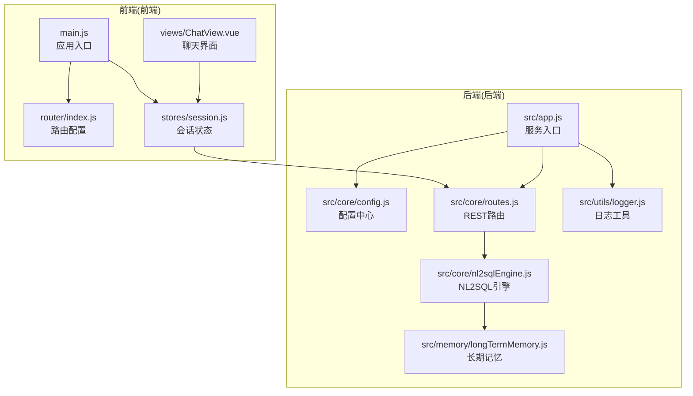
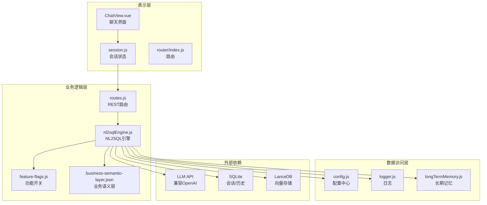
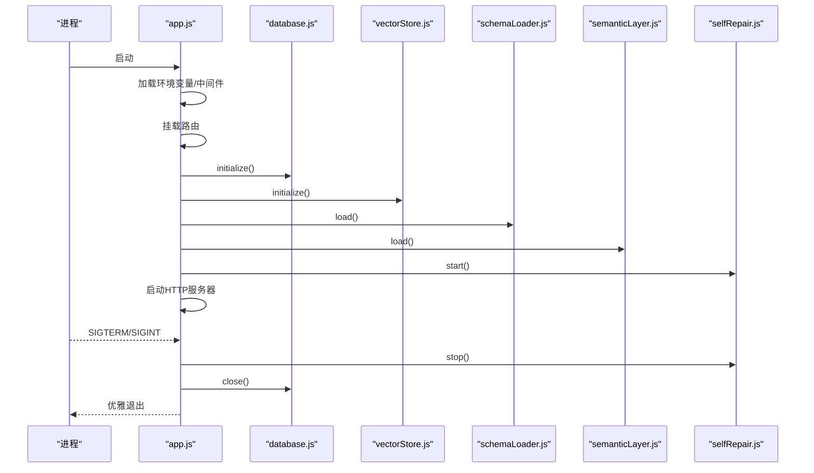
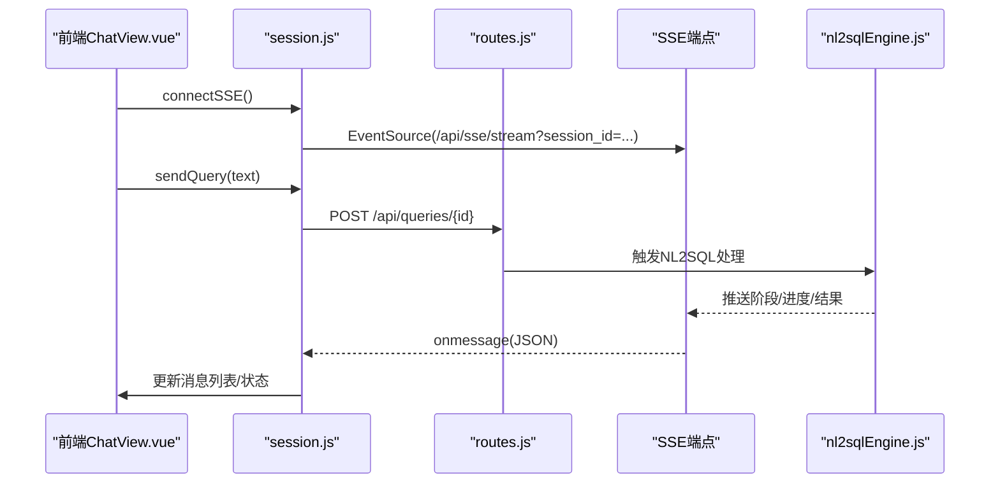
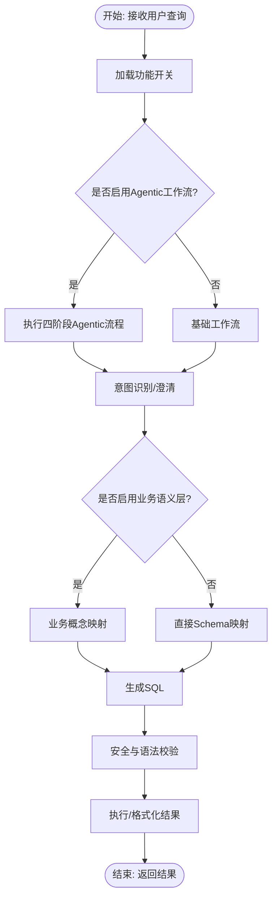
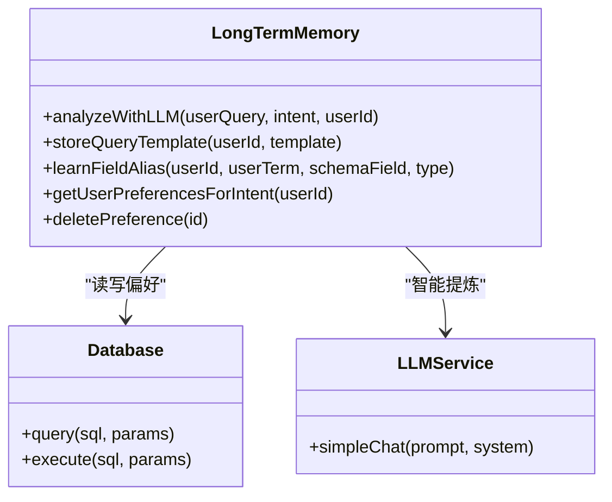
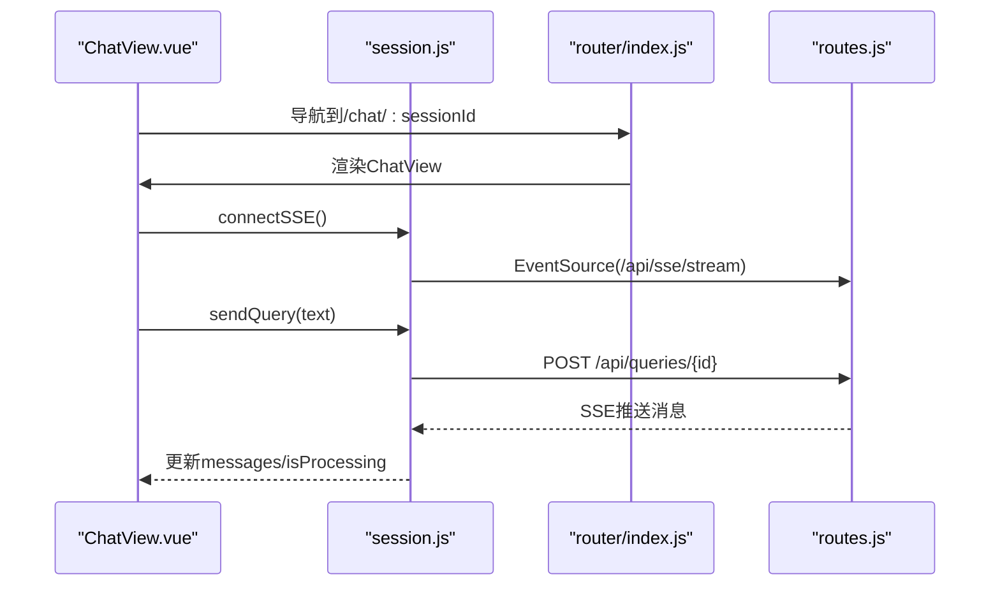
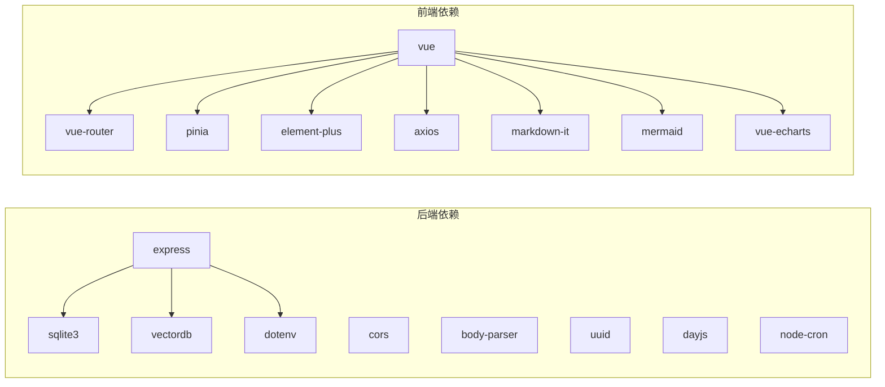

# 整体设计

<cite>
**本文档引用的文件**
- [backend/package.json](file://backend/package.json)
- [frontend/package.json](file://frontend/package.json)
- [backend/src/app.js](file://backend/src/app.js)
- [backend/src/core/config.js](file://backend/src/core/config.js)
- [backend/src/core/routes.js](file://backend/src/core/routes.js)
- [backend/src/core/nl2sqlEngine.js](file://backend/src/core/nl2sqlEngine.js)
- [backend/src/memory/longTermMemory.js](file://backend/src/memory/longTermMemory.js)
- [backend/src/utils/logger.js](file://backend/src/utils/logger.js)
- [backend/config/business-semantic-layer.json](file://backend/config/business-semantic-layer.json)
- [backend/config/feature-flags.js](file://backend/config/feature-flags.js)
- [frontend/src/main.js](file://frontend/src/main.js)
- [frontend/src/router/index.js](file://frontend/src/router/index.js)
- [frontend/src/stores/session.js](file://frontend/src/stores/session.js)
- [frontend/src/views/ChatView.vue](file://frontend/src/views/ChatView.vue)
</cite>

## 目录
1. [简介](#简介)
2. [项目结构](#项目结构)
3. [核心组件](#核心组件)
4. [架构总览](#架构总览)
5. [详细组件分析](#详细组件分析)
6. [依赖关系分析](#依赖关系分析)
7. [性能考量](#性能考量)
8. [故障排查指南](#故障排查指南)
9. [结论](#结论)

## 简介
本系统是一个“自然语言到SQL”的数据查询服务，采用前后端分离架构，后端基于Express.js提供REST API与Server-Sent Events流式输出，前端基于Vue.js提供交互式对话界面。系统通过LLM驱动的NL2SQL引擎，结合Schema探索、业务语义层、长期记忆与澄清机制，实现从自然语言到可执行SQL的自动化转换，并在生产环境中提供安全控制、评估统计与自修复能力。

技术选型理由：
- Express.js：轻量、生态成熟、易于扩展，适合构建高性能REST API与SSE服务。
- Vue.js：渐进式框架，组件化与状态管理（Pinia）完善，适合构建交互式前端应用。
- 分层架构：清晰的表示层、业务逻辑层、数据访问层职责划分，便于维护与演进。
- 微服务化思考：当前为单体服务，具备容器化与模块化拆分潜力，未来可按领域拆分为独立服务（如Schema服务、记忆服务、评估服务）。

## 项目结构
系统采用前后端分离的双仓库结构，后端提供REST API与SSE，前端提供Web界面与状态管理。

图表来源
- [frontend/src/main.js:1-89](file://frontend/src/main.js#L1-L89)
- [frontend/src/router/index.js:1-157](file://frontend/src/router/index.js#L1-L157)
- [frontend/src/stores/session.js:1-400](file://frontend/src/stores/session.js#L1-L400)
- [frontend/src/views/ChatView.vue:1-200](file://frontend/src/views/ChatView.vue#L1-L200)
- [backend/src/app.js:1-260](file://backend/src/app.js#L1-L260)
- [backend/src/core/config.js:1-398](file://backend/src/core/config.js#L1-L398)
- [backend/src/core/routes.js:1-800](file://backend/src/core/routes.js#L1-L800)
- [backend/src/core/nl2sqlEngine.js:1-200](file://backend/src/core/nl2sqlEngine.js#L1-L200)
- [backend/src/memory/longTermMemory.js:1-200](file://backend/src/memory/longTermMemory.js#L1-L200)
- [backend/src/utils/logger.js:1-442](file://backend/src/utils/logger.js#L1-L442)

章节来源
- [backend/package.json:1-28](file://backend/package.json#L1-L28)
- [frontend/package.json:1-36](file://frontend/package.json#L1-L36)
- [backend/src/app.js:1-260](file://backend/src/app.js#L1-L260)
- [frontend/src/main.js:1-89](file://frontend/src/main.js#L1-L89)

## 核心组件
- 后端服务入口：负责环境变量加载、中间件配置、模块初始化、HTTP与SSE服务启动、优雅关闭。
- 配置中心：集中管理LLM、数据库、安全、日志、自修复、Schema、长期记忆、上下文管理、评估等配置。
- REST路由：提供健康检查、Schema查询、会话管理、查询历史、用户偏好、评估统计等接口。
- NL2SQL引擎：意图识别、澄清机制、SQL生成、验证与格式化，支持业务语义层与功能开关。
- 长期记忆：用户偏好抽取、存储、检索与维护，支持LLM智能提炼与分级保留策略。
- 日志工具：统一日志输出、文件轮转、结构化日志与执行流程追踪。
- 前端入口：Vue应用初始化、路由安装、状态管理、UI组件库注册与全局样式。
- 前端路由与状态：路由守卫、会话状态管理（SSE连接、消息列表、处理状态）、API封装。

章节来源
- [backend/src/app.js:97-188](file://backend/src/app.js#L97-L188)
- [backend/src/core/config.js:16-355](file://backend/src/core/config.js#L16-L355)
- [backend/src/core/routes.js:1-800](file://backend/src/core/routes.js#L1-L800)
- [backend/src/core/nl2sqlEngine.js:1-200](file://backend/src/core/nl2sqlEngine.js#L1-L200)
- [backend/src/memory/longTermMemory.js:1-200](file://backend/src/memory/longTermMemory.js#L1-L200)
- [backend/src/utils/logger.js:54-442](file://backend/src/utils/logger.js#L54-L442)
- [frontend/src/main.js:14-89](file://frontend/src/main.js#L14-L89)
- [frontend/src/router/index.js:34-157](file://frontend/src/router/index.js#L34-L157)
- [frontend/src/stores/session.js:33-400](file://frontend/src/stores/session.js#L33-L400)

## 架构总览
系统采用分层架构与模块化组织：
- 表示层：前端Vue组件与状态管理，负责用户交互与展示。
- 业务逻辑层：后端路由与NL2SQL引擎，负责意图理解、澄清、SQL生成与结果格式化。
- 数据访问层：数据库与向量数据库，负责会话、查询历史、Schema与长期记忆的持久化。
- 外部依赖：LLM服务（兼容OpenAI API格式）、SQLite、LanceDB、第三方UI库与工具库。

图表来源
- [frontend/src/views/ChatView.vue:1-200](file://frontend/src/views/ChatView.vue#L1-L200)
- [frontend/src/stores/session.js:1-400](file://frontend/src/stores/session.js#L1-L400)
- [frontend/src/router/index.js:1-157](file://frontend/src/router/index.js#L1-L157)
- [backend/src/core/routes.js:1-800](file://backend/src/core/routes.js#L1-L800)
- [backend/src/core/nl2sqlEngine.js:1-200](file://backend/src/core/nl2sqlEngine.js#L1-L200)
- [backend/src/core/config.js:1-398](file://backend/src/core/config.js#L1-L398)
- [backend/src/utils/logger.js:1-442](file://backend/src/utils/logger.js#L1-L442)
- [backend/src/memory/longTermMemory.js:1-200](file://backend/src/memory/longTermMemory.js#L1-L200)
- [backend/config/feature-flags.js:1-249](file://backend/config/feature-flags.js#L1-L249)
- [backend/config/business-semantic-layer.json:1-189](file://backend/config/business-semantic-layer.json#L1-L189)

## 详细组件分析

### 后端服务入口与初始化流程
- 加载环境变量，配置CORS与BodyParser中间件。
- 挂载REST路由至/api前缀。
- 初始化数据目录、SQLite数据库、LanceDB向量数据库、Schema元数据与业务语义层。
- 启动自修复调度器与HTTP服务器，监听优雅关闭事件。

图表来源
- [backend/src/app.js:97-188](file://backend/src/app.js#L97-L188)
- [backend/src/core/routes.js:72-94](file://backend/src/core/routes.js#L72-L94)

章节来源
- [backend/src/app.js:97-188](file://backend/src/app.js#L97-L188)

### REST路由与SSE交互
- 健康检查与详细健康状态。
- Schema查询、搜索与表详情。
- 会话管理（创建、获取、删除、消息历史）。
- 用户偏好（长期记忆）管理与统计。
- 评估接口（统计报告与重置、Schema向量化质量评估）。
- SSE流式输出：前端通过EventSource订阅会话流，后端实时推送处理阶段、进度与结果。

图表来源
- [frontend/src/views/ChatView.vue:196-330](file://frontend/src/views/ChatView.vue#L196-L330)
- [frontend/src/stores/session.js:185-295](file://frontend/src/stores/session.js#L185-L295)
- [backend/src/core/routes.js:722-760](file://backend/src/core/routes.js#L722-L760)
- [backend/src/core/nl2sqlEngine.js:1-200](file://backend/src/core/nl2sqlEngine.js#L1-L200)

章节来源
- [backend/src/core/routes.js:60-137](file://backend/src/core/routes.js#L60-L137)
- [backend/src/core/routes.js:143-250](file://backend/src/core/routes.js#L143-L250)
- [backend/src/core/routes.js:256-398](file://backend/src/core/routes.js#L256-L398)
- [backend/src/core/routes.js:403-450](file://backend/src/core/routes.js#L403-L450)
- [backend/src/core/routes.js:456-664](file://backend/src/core/routes.js#L456-L664)
- [backend/src/core/routes.js:722-760](file://backend/src/core/routes.js#L722-L760)
- [backend/src/core/routes.js:771-800](file://backend/src/core/routes.js#L771-L800)

### NL2SQL引擎与功能开关
- 引擎模块负责意图识别、澄清、SQL生成、验证与格式化。
- 支持业务语义层（Phase 2）与功能开关（Feature Flags）控制不同阶段能力。
- 业务关键词到表的映射用于智能表检索，提升召回质量。

图表来源
- [backend/src/core/nl2sqlEngine.js:1-200](file://backend/src/core/nl2sqlEngine.js#L1-L200)
- [backend/config/feature-flags.js:108-170](file://backend/config/feature-flags.js#L108-L170)
- [backend/config/business-semantic-layer.json:1-189](file://backend/config/business-semantic-layer.json#L1-L189)

章节来源
- [backend/src/core/nl2sqlEngine.js:63-120](file://backend/src/core/nl2sqlEngine.js#L63-L120)
- [backend/config/feature-flags.js:108-170](file://backend/config/feature-flags.js#L108-L170)
- [backend/config/business-semantic-layer.json:1-189](file://backend/config/business-semantic-layer.json#L1-L189)

### 长期记忆与偏好管理
- 从查询中抽取用户偏好（查询模式、字段别名、指标/维度偏好）。
- 支持LLM智能提炼与分级保留策略（高频/中频/低频/别名）。
- 提供用户偏好列表、模板管理与统计接口。

图表来源
- [backend/src/memory/longTermMemory.js:58-190](file://backend/src/memory/longTermMemory.js#L58-L190)
- [backend/src/core/config.js:259-293](file://backend/src/core/config.js#L259-L293)

章节来源
- [backend/src/memory/longTermMemory.js:1-200](file://backend/src/memory/longTermMemory.js#L1-L200)
- [backend/src/core/config.js:259-293](file://backend/src/core/config.js#L259-L293)

### 前端交互与状态管理
- 路由守卫设置页面标题，History模式与滚动行为。
- Pinia状态管理会话列表、当前会话、消息历史、SSE连接与处理状态。
- ChatView负责渲染消息、复制SQL、展示数据表格与处理状态指示器。

图表来源
- [frontend/src/router/index.js:142-150](file://frontend/src/router/index.js#L142-L150)
- [frontend/src/stores/session.js:185-330](file://frontend/src/stores/session.js#L185-L330)
- [frontend/src/views/ChatView.vue:196-330](file://frontend/src/views/ChatView.vue#L196-L330)

章节来源
- [frontend/src/router/index.js:34-157](file://frontend/src/router/index.js#L34-L157)
- [frontend/src/stores/session.js:33-400](file://frontend/src/stores/session.js#L33-L400)
- [frontend/src/views/ChatView.vue:1-200](file://frontend/src/views/ChatView.vue#L1-L200)

## 依赖关系分析
- 后端依赖：Express、CORS、BodyParser、SQLite3、vectordb、dotenv、uuid、dayjs、node-cron。
- 前端依赖：Vue 3、Vue Router、Pinia、Element Plus、axios、markdown-it、mermaid、echarts等。
- 配置与功能开关：集中于config.js与feature-flags.js，支撑多阶段能力与灰度发布。
- 日志：统一Logger，支持文件轮转与执行流程追踪，便于定位NL2SQL处理链路。

图表来源
- [backend/package.json:10-22](file://backend/package.json#L10-L22)
- [frontend/package.json:11-34](file://frontend/package.json#L11-L34)

章节来源
- [backend/package.json:1-28](file://backend/package.json#L1-L28)
- [frontend/package.json:1-36](file://frontend/package.json#L1-L36)

## 性能考量
- 请求体大小限制与JSON解析：body-parser配置限制请求体大小，避免过大负载。
- 查询安全与性能：白名单表、最大返回行数、查询超时、禁止关键字过滤，防止慢查询与越权。
- Token预算与摘要：上下文管理配置支持Token预算检查与对话摘要，降低LLM成本与延迟。
- 评估统计：运行时统计与阈值配置，辅助评估向量化质量与记忆命中率。
- SSE流式输出：前端逐步渲染，减少一次性渲染压力。

章节来源
- [backend/src/app.js:67-72](file://backend/src/app.js#L67-L72)
- [backend/src/core/config.js:140-170](file://backend/src/core/config.js#L140-L170)
- [backend/src/core/config.js:303-333](file://backend/src/core/config.js#L303-L333)
- [backend/src/core/config.js:342-354](file://backend/src/core/config.js#L342-L354)

## 故障排查指南
- 健康检查：使用健康接口与详细健康接口定位数据库、LLM、Schema、SSE连接状态。
- 日志：统一Logger输出到控制台与文件，支持TRACE/DEBUG/INFO/WARN/ERROR级别，执行流程追踪便于定位问题。
- 配置校验：启动时验证必要配置（LLM API密钥、SR数据库URL），缺失将抛出错误。
- 功能开关：通过功能开关控制Phase能力，便于快速回滚与灰度发布。
- 优雅关闭：SIGTERM/SIGINT触发资源释放与进程退出，避免资源泄漏。

章节来源
- [backend/src/core/routes.js:60-137](file://backend/src/core/routes.js#L60-L137)
- [backend/src/utils/logger.js:263-309](file://backend/src/utils/logger.js#L263-L309)
- [backend/src/core/config.js:366-388](file://backend/src/core/config.js#L366-L388)
- [backend/config/feature-flags.js:108-121](file://backend/config/feature-flags.js#L108-L121)
- [backend/src/app.js:198-252](file://backend/src/app.js#L198-L252)

## 结论
本系统通过前后端分离与分层架构，结合LLM驱动的NL2SQL引擎、业务语义层、长期记忆与功能开关，实现了从自然语言到SQL的高效转换与可视化呈现。Express.js与Vue.js的选择兼顾了易用性与扩展性，配置中心与日志工具保障了可观测性与可维护性。未来可在保持单体优势的同时，逐步引入微服务化与容器化，按领域拆分服务，进一步提升可扩展性与运维效率。