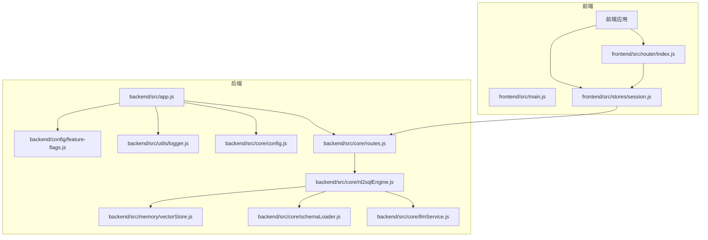
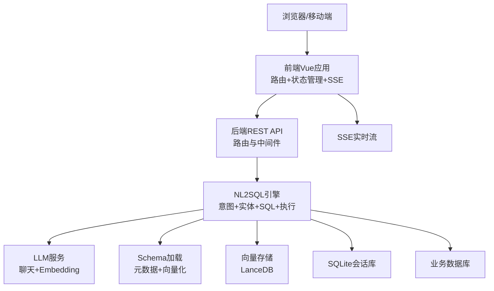
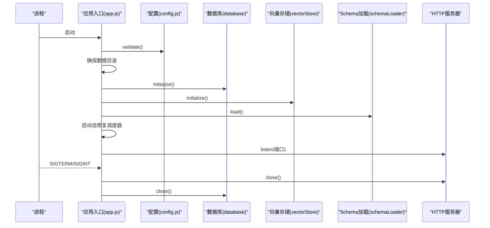
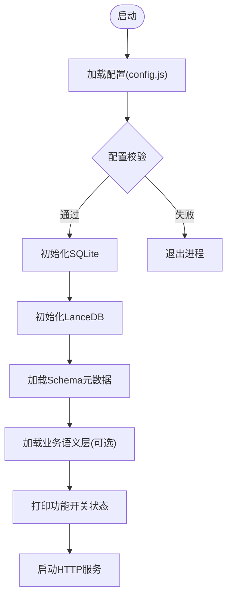
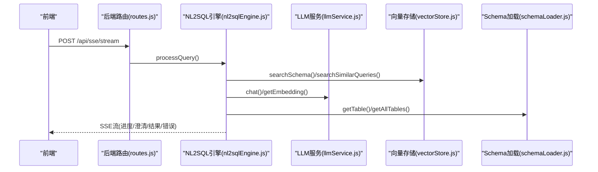
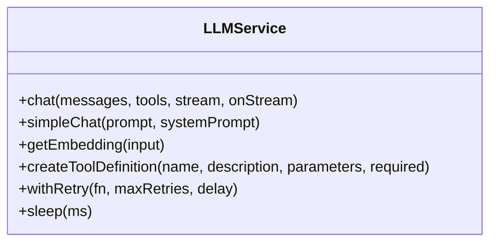
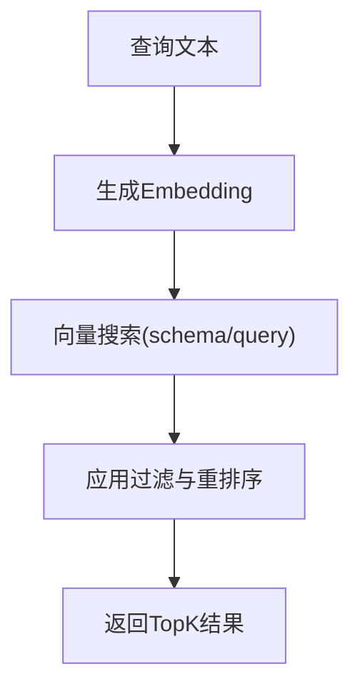
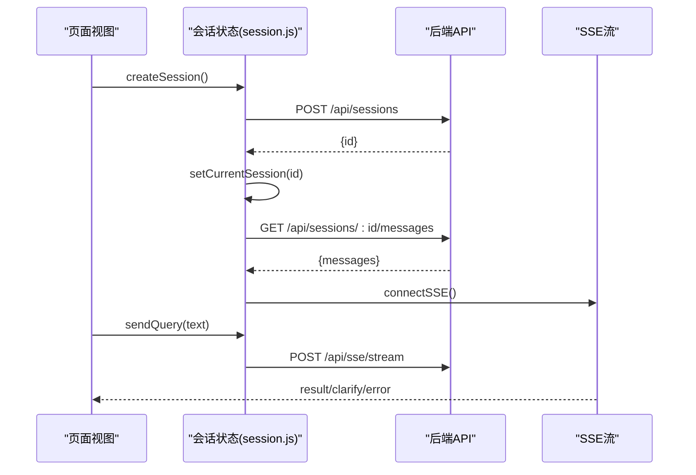
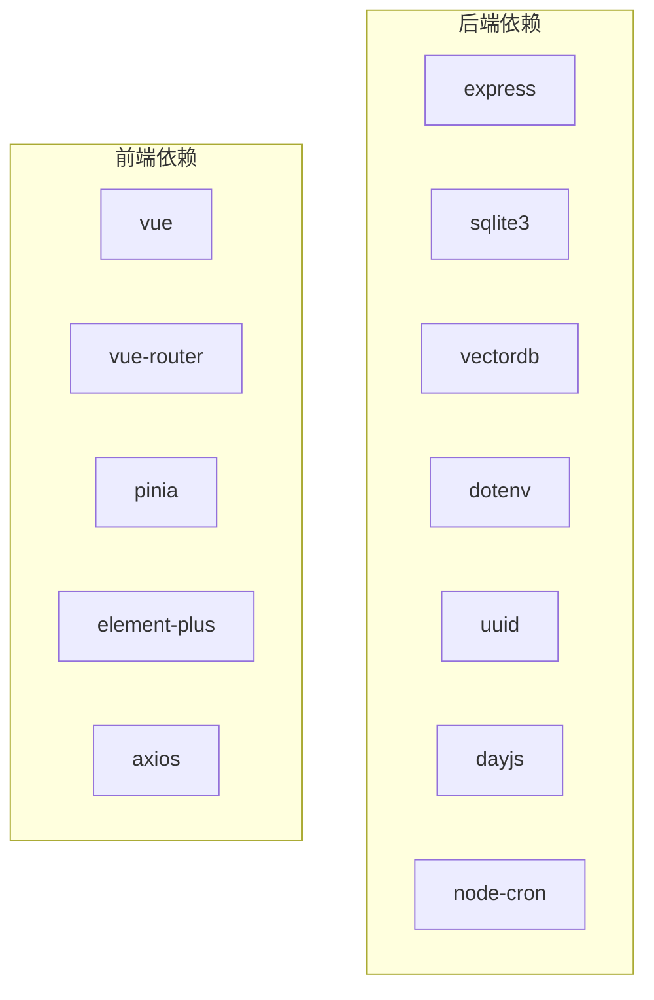

# 整体设计原则

<cite>
**本文档引用的文件**
- [backend/src/app.js](file://backend/src/app.js)
- [backend/src/core/config.js](file://backend/src/core/config.js)
- [backend/src/core/routes.js](file://backend/src/core/routes.js)
- [backend/src/core/nl2sqlEngine.js](file://backend/src/core/nl2sqlEngine.js)
- [backend/src/core/llmService.js](file://backend/src/core/llmService.js)
- [backend/src/memory/vectorStore.js](file://backend/src/memory/vectorStore.js)
- [backend/src/utils/logger.js](file://backend/src/utils/logger.js)
- [backend/src/core/schemaLoader.js](file://backend/src/core/schemaLoader.js)
- [backend/config/feature-flags.js](file://backend/config/feature-flags.js)
- [backend/package.json](file://backend/package.json)
- [frontend/src/main.js](file://frontend/src/main.js)
- [frontend/src/router/index.js](file://frontend/src/router/index.js)
- [frontend/src/stores/session.js](file://frontend/src/stores/session.js)
- [frontend/package.json](file://frontend/package.json)
- [docs/后端架构审查与优化方案.md](file://docs/后端架构审查与优化方案.md)
</cite>

## 目录
1. [简介](#简介)
2. [项目结构](#项目结构)
3. [核心组件](#核心组件)
4. [架构总览](#架构总览)
5. [详细组件分析](#详细组件分析)
6. [依赖分析](#依赖分析)
7. [性能考虑](#性能考虑)
8. [故障排查指南](#故障排查指南)
9. [结论](#结论)
10. [附录](#附录)

## 简介
本文件面向NL2SQL系统，系统采用前后端分离架构，后端以Node.js为核心，提供REST API与Server-Sent Events实时流；前端基于Vue3与Pinia，提供交互式对话界面。系统围绕“自然语言到SQL”的核心目标，结合LLM能力、Schema元数据、向量检索与长期记忆，形成可演进的四阶段Agentic工作流。设计强调模块化、可配置、可扩展与可观测性，并通过功能开关实现渐进式发布与快速回滚。

## 项目结构
项目采用清晰的前后端分离布局：
- 后端（Node.js + Express）：核心业务逻辑集中在src目录，按功能划分为core、memory、utils等子模块；配置集中于config目录；测试位于test目录。
- 前端（Vue3 + Vite）：采用模块化组件与状态管理，路由按页面功能组织，状态通过Pinia集中管理。
- 文档与配置：docs存放架构审查与优化方案，config存放运行时配置文件。

图表来源
- [backend/src/app.js:1-266](file://backend/src/app.js#L1-L266)
- [backend/src/core/routes.js:1-800](file://backend/src/core/routes.js#L1-L800)
- [backend/src/core/nl2sqlEngine.js:1-800](file://backend/src/core/nl2sqlEngine.js#L1-L800)
- [backend/src/core/llmService.js:1-477](file://backend/src/core/llmService.js#L1-L477)
- [backend/src/memory/vectorStore.js:1-800](file://backend/src/memory/vectorStore.js#L1-L800)
- [backend/src/core/schemaLoader.js:1-200](file://backend/src/core/schemaLoader.js#L1-L200)
- [backend/src/utils/logger.js:1-482](file://backend/src/utils/logger.js#L1-L482)
- [backend/src/core/config.js:1-398](file://backend/src/core/config.js#L1-L398)
- [backend/config/feature-flags.js:1-249](file://backend/config/feature-flags.js#L1-L249)
- [frontend/src/main.js:1-89](file://frontend/src/main.js#L1-L89)
- [frontend/src/router/index.js:1-157](file://frontend/src/router/index.js#L1-L157)
- [frontend/src/stores/session.js:1-400](file://frontend/src/stores/session.js#L1-L400)

章节来源
- [backend/src/app.js:1-266](file://backend/src/app.js#L1-L266)
- [frontend/src/main.js:1-89](file://frontend/src/main.js#L1-L89)

## 核心组件
- 应用入口与启动：后端入口负责环境变量加载、模块初始化、HTTP与SSE服务启动、优雅关停与错误处理。
- 配置中心：集中管理LLM、数据库、向量库、安全、会话、日志、自修复、Schema、长期记忆、上下文管理与评估等配置。
- 路由与API：提供健康检查、Schema查询、会话管理、查询历史、偏好与记忆、评估统计等REST接口。
- NL2SQL核心引擎：实现意图识别、实体解析、SQL生成、验证、执行与结果格式化，支持四阶段Agentic工作流与功能开关。
- LLM服务：封装HTTP请求、重试机制、Embedding与聊天接口，适配多种兼容OpenAI API格式的服务。
- 向量存储：基于LanceDB的Schema与查询历史向量存储，支持语义检索与智能重排序。
- 日志系统：统一日志级别、文件轮转、结构化输出与执行流程追踪。
- 前端应用：Vue3 + Pinia + Element Plus，路由驱动页面切换，状态管理会话与SSE连接。

章节来源
- [backend/src/app.js:97-194](file://backend/src/app.js#L97-L194)
- [backend/src/core/config.js:16-355](file://backend/src/core/config.js#L16-L355)
- [backend/src/core/routes.js:72-800](file://backend/src/core/routes.js#L72-L800)
- [backend/src/core/nl2sqlEngine.js:1-800](file://backend/src/core/nl2sqlEngine.js#L1-L800)
- [backend/src/core/llmService.js:1-477](file://backend/src/core/llmService.js#L1-L477)
- [backend/src/memory/vectorStore.js:1-800](file://backend/src/memory/vectorStore.js#L1-L800)
- [backend/src/utils/logger.js:1-482](file://backend/src/utils/logger.js#L1-L482)
- [frontend/src/main.js:14-89](file://frontend/src/main.js#L14-L89)

## 架构总览
系统采用前后端分离的三层架构：
- 表现层：Vue3前端，负责用户交互、路由与状态管理，通过HTTP与SSE与后端通信。
- 服务层：Node.js后端，提供REST API与SSE流，编排NL2SQL引擎、LLM服务、向量检索与数据库操作。
- 数据层：SQLite用于会话与偏好持久化，LanceDB用于Schema与查询历史向量化检索，业务数据库用于实际查询执行。

图表来源
- [backend/src/core/routes.js:72-800](file://backend/src/core/routes.js#L72-L800)
- [backend/src/core/nl2sqlEngine.js:1-800](file://backend/src/core/nl2sqlEngine.js#L1-L800)
- [backend/src/core/llmService.js:1-477](file://backend/src/core/llmService.js#L1-L477)
- [backend/src/memory/vectorStore.js:1-800](file://backend/src/memory/vectorStore.js#L1-L800)
- [backend/src/core/schemaLoader.js:1-200](file://backend/src/core/schemaLoader.js#L1-L200)

## 详细组件分析

### 应用入口与启动流程
- 环境变量加载与依赖导入：dotenv、Express、CORS、body-parser、path、fs等。
- 中间件配置：CORS与JSON解析，统一挂载到/api前缀。
- 初始化顺序：配置校验、数据目录创建、SQLite初始化、LanceDB初始化、Schema加载、业务语义层加载、功能开关打印、自修复调度器启动、HTTP服务监听。
- 优雅关停：关闭HTTP、SSE、定时任务、数据库连接，确保资源释放。

图表来源
- [backend/src/app.js:97-194](file://backend/src/app.js#L97-L194)
- [backend/src/core/config.js:366-388](file://backend/src/core/config.js#L366-L388)

章节来源
- [backend/src/app.js:97-194](file://backend/src/app.js#L97-L194)

### 配置管理与功能开关
- 配置中心：集中管理LLM、Embedding、数据库、安全、会话、日志、自修复、Schema、长期记忆、上下文管理与评估等配置，并提供validate()校验。
- 功能开关：以Phase为维度的渐进式发布，支持启用/禁用与全局开关，便于快速回滚与灰度发布。

图表来源
- [backend/src/core/config.js:16-355](file://backend/src/core/config.js#L16-L355)
- [backend/config/feature-flags.js:16-96](file://backend/config/feature-flags.js#L16-L96)
- [backend/src/app.js:103-186](file://backend/src/app.js#L103-L186)

章节来源
- [backend/src/core/config.js:366-388](file://backend/src/core/config.js#L366-L388)
- [backend/config/feature-flags.js:108-200](file://backend/config/feature-flags.js#L108-L200)

### NL2SQL核心引擎与Agentic工作流
- 模块化设计：意图识别、实体解析、SQL生成、验证、执行、结果格式化等功能逐步拆分至独立模块，降低单体复杂度。
- 四阶段Agentic工作流：Schema探索 → 动态意图拆解 → 澄清 → 生成与自我修复，支持工具循环与业务语义层。
- 业务关键词映射：基于Schema元数据动态构建关键词到表的映射，提升表检索精度。
- 智能搜索与重排序：向量检索结合查询意图与表作用域权重，进行智能重排序。

图表来源
- [backend/src/core/routes.js:72-800](file://backend/src/core/routes.js#L72-L800)
- [backend/src/core/nl2sqlEngine.js:1-800](file://backend/src/core/nl2sqlEngine.js#L1-L800)
- [backend/src/core/llmService.js:1-477](file://backend/src/core/llmService.js#L1-L477)
- [backend/src/memory/vectorStore.js:1-800](file://backend/src/memory/vectorStore.js#L1-L800)
- [backend/src/core/schemaLoader.js:1-200](file://backend/src/core/schemaLoader.js#L1-L200)

章节来源
- [backend/src/core/nl2sqlEngine.js:1-800](file://backend/src/core/nl2sqlEngine.js#L1-L800)
- [docs/后端架构审查与优化方案.md:90-114](file://docs/后端架构审查与优化方案.md#L90-L114)

### LLM服务与Embedding
- HTTP封装：统一POST请求、超时控制、错误处理与重试机制。
- Embedding：支持单/批量向量生成，适配不同模型维度。
- 工具定义：辅助构建LLM工具调用定义，支持函数式工具。

图表来源
- [backend/src/core/llmService.js:1-477](file://backend/src/core/llmService.js#L1-L477)

章节来源
- [backend/src/core/llmService.js:1-477](file://backend/src/core/llmService.js#L1-L477)

### 向量存储与语义检索
- Schema向量表与查询历史向量表：支持向量添加、相似度搜索与智能重排序。
- 元数据增强：重要性评分、查询类型分类、复杂度统计与执行信息。
- 智能搜索：结合查询意图与表作用域权重，对平台表、报表表与原始日志表进行差异化排序。

图表来源
- [backend/src/memory/vectorStore.js:1-800](file://backend/src/memory/vectorStore.js#L1-L800)

章节来源
- [backend/src/memory/vectorStore.js:1-800](file://backend/src/memory/vectorStore.js#L1-L800)

### 前端应用与状态管理
- 应用入口：创建Vue实例，安装路由、状态管理与UI组件库。
- 路由配置：Home、Chat、History、Schema、Memory、Evaluation等页面，支持滚动行为与页面标题。
- 状态管理：会话列表、当前会话、消息历史、SSE连接与处理状态，支持创建/切换/删除会话与发送查询。

图表来源
- [frontend/src/main.js:14-89](file://frontend/src/main.js#L14-L89)
- [frontend/src/router/index.js:34-132](file://frontend/src/router/index.js#L34-L132)
- [frontend/src/stores/session.js:103-330](file://frontend/src/stores/session.js#L103-L330)

章节来源
- [frontend/src/main.js:14-89](file://frontend/src/main.js#L14-L89)
- [frontend/src/router/index.js:34-132](file://frontend/src/router/index.js#L34-L132)
- [frontend/src/stores/session.js:103-330](file://frontend/src/stores/session.js#L103-L330)

## 依赖分析
- 技术栈选择：
  - 后端：Express提供Web框架，SQLite3与vectordb分别支撑会话与向量存储，dotenv管理环境变量，uuid/dayjs/node-cron提供通用能力。
  - 前端：Vue3生态，Element Plus UI库，Pinia状态管理，Vue Router路由。
- 版本与兼容性：
  - Node.js引擎要求>=18.0.0，确保ES模块与现代API可用。
  - 前端依赖以ES模块为主，Vite提供开发与构建支持。

图表来源
- [backend/package.json:10-26](file://backend/package.json#L10-L26)
- [frontend/package.json:11-29](file://frontend/package.json#L11-L29)

章节来源
- [backend/package.json:10-26](file://backend/package.json#L10-L26)
- [frontend/package.json:11-29](file://frontend/package.json#L11-L29)

## 性能考虑
- Token预算与中文估算：针对中文字符/Token比率进行更保守的估算，避免上下文溢出。
- 向量检索优化：Schema向量表建立内存索引，减少全表扫描；智能重排序降低无关表影响。
- 日志与监控：统一日志级别与文件轮转，trace级别用于深度调试；健康检查接口提供组件状态概览。
- 评估与统计：运行时统计向量检索命中率与记忆命中率，指导系统优化。

章节来源
- [docs/后端架构审查与优化方案.md:162-174](file://docs/后端架构审查与优化方案.md#L162-L174)
- [backend/src/memory/vectorStore.js:753-800](file://backend/src/memory/vectorStore.js#L753-L800)
- [backend/src/utils/logger.js:1-482](file://backend/src/utils/logger.js#L1-L482)
- [backend/src/core/routes.js:72-137](file://backend/src/core/routes.js#L72-L137)

## 故障排查指南
- 启动失败：检查LLM API密钥与SR数据库URL配置，确保validate()在初始化阶段执行。
- 向量数据库不可用：确认LanceDB初始化状态，关注未初始化时的降级提示。
- SSE连接异常：检查会话ID与SSE URL，确认后端SSE端点与连接状态。
- 日志定位：利用trace级别日志与追踪会话，定位流程节点耗时与异常。

章节来源
- [backend/src/app.js:103-186](file://backend/src/app.js#L103-L186)
- [backend/src/memory/vectorStore.js:233-263](file://backend/src/memory/vectorStore.js#L233-L263)
- [frontend/src/stores/session.js:185-221](file://frontend/src/stores/session.js#L185-L221)
- [backend/src/utils/logger.js:276-448](file://backend/src/utils/logger.js#L276-L448)

## 结论
本系统以模块化与可配置为核心设计原则，通过前后端分离与功能开关实现渐进式演进。后端以Express与Node.js为基础，结合LLM、向量检索与Schema元数据，形成稳健的NL2SQL能力；前端以Vue3生态提供良好交互体验。建议持续推进模块拆分、统一错误处理与响应解析器、路由分组与Token估算优化，以进一步提升可维护性与性能。

## 附录
- 系统边界：前端仅通过HTTP与SSE与后端交互；后端对外暴露REST API与SSE流，内部通过模块化组件协作。
- 接口设计原则：REST风格、幂等性与错误码规范、SSE事件类型标准化。
- 数据一致性：SQLite用于会话与偏好持久化，向量存储与业务数据库通过查询历史与元数据增强实现间接一致性；安全配置限制禁止关键字与行数上限，保障查询安全。