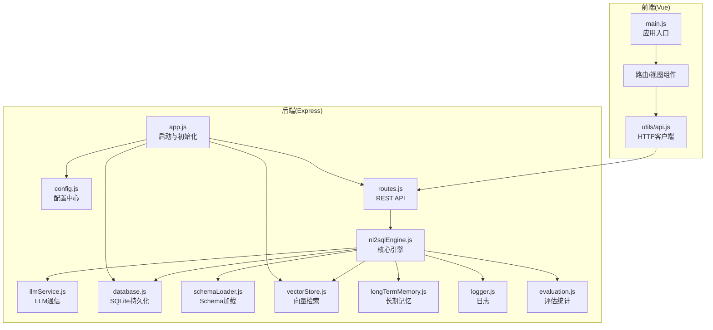
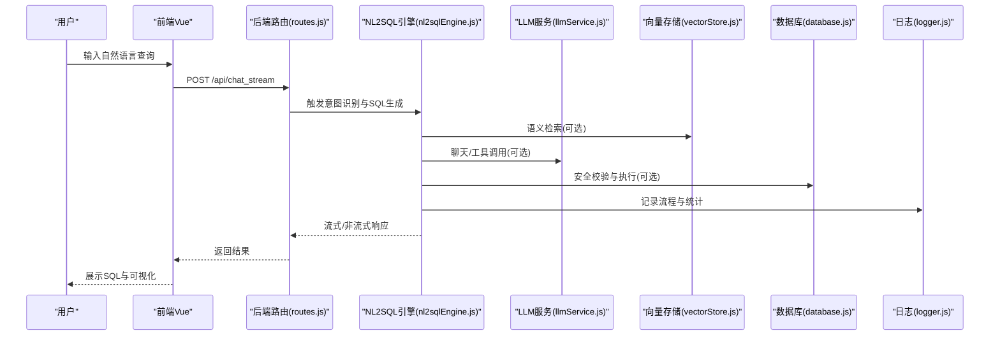
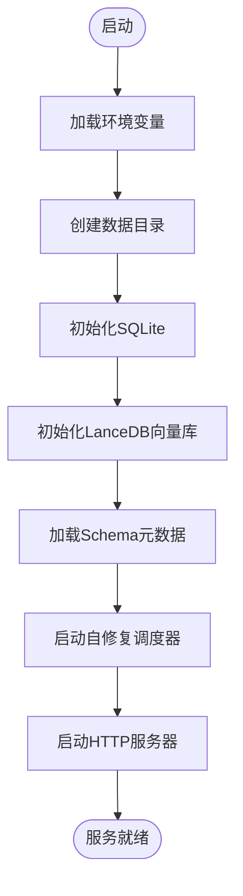
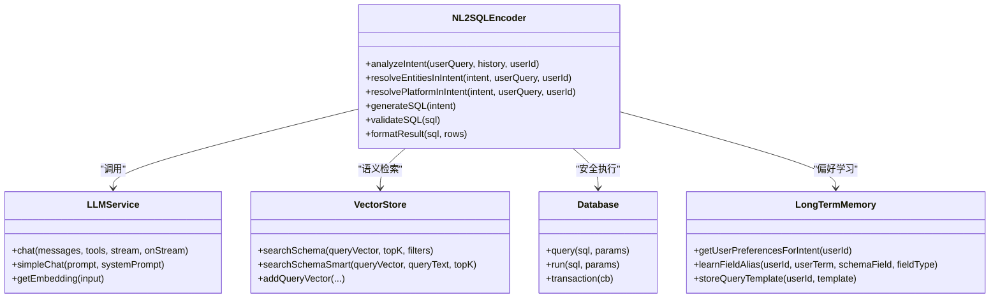
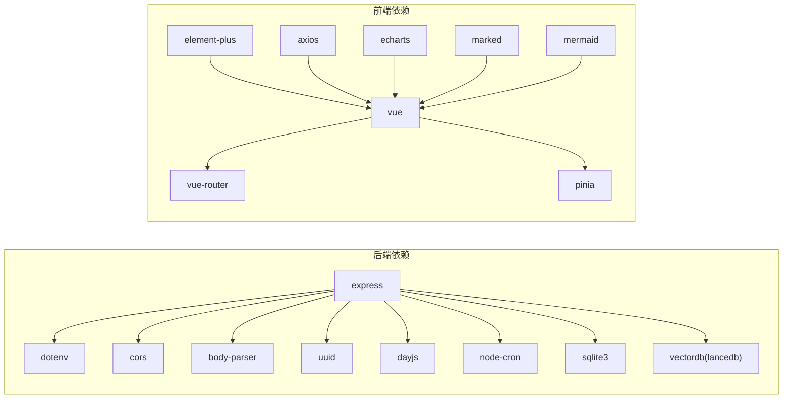

# 系统架构

<cite>
**本文引用的文件**
- [backend/src/app.js](file://backend/src/app.js)
- [backend/src/core/config.js](file://backend/src/core/config.js)
- [backend/src/core/routes.js](file://backend/src/core/routes.js)
- [backend/src/core/nl2sqlEngine.js](file://backend/src/core/nl2sqlEngine.js)
- [backend/src/core/llmService.js](file://backend/src/core/llmService.js)
- [backend/src/core/database.js](file://backend/src/core/database.js)
- [backend/src/core/schemaLoader.js](file://backend/src/core/schemaLoader.js)
- [backend/src/memory/vectorStore.js](file://backend/src/memory/vectorStore.js)
- [backend/src/memory/longTermMemory.js](file://backend/src/memory/longTermMemory.js)
- [backend/src/utils/logger.js](file://backend/src/utils/logger.js)
- [backend/src/utils/evaluation.js](file://backend/src/utils/evaluation.js)
- [backend/package.json](file://backend/package.json)
- [frontend/main.js](file://frontend/src/main.js)
- [frontend/vite.config.js](file://frontend/vite.config.js)
- [frontend/package.json](file://frontend/package.json)
</cite>

## 目录
1. [简介](#简介)
2. [项目结构](#项目结构)
3. [核心组件](#核心组件)
4. [架构总览](#架构总览)
5. [详细组件分析](#详细组件分析)
6. [依赖关系分析](#依赖关系分析)
7. [性能考量](#性能考量)
8. [故障排查指南](#故障排查指南)
9. [结论](#结论)
10. [附录](#附录)

## 简介
本架构文档面向 NL2SQL 系统，描述其前后端分离、微服务化与事件驱动的设计理念与实现方式。系统由前端 Vue 应用、后端 Express 服务、AI 引擎（LLM）、向量数据库（LanceDB）与关系型数据库（SQLite）构成，围绕“意图识别—实体解析—SQL 生成—安全校验—结果格式化”的闭环工作流展开。系统强调可扩展性、可观测性与可维护性，通过配置中心、日志体系、评估统计与自修复机制支撑生产级运行。

## 项目结构
- 后端采用 Node.js + Express，模块化组织核心能力：配置、路由、引擎、数据库、向量存储、长期记忆、日志与评估。
- 前端采用 Vue 3 + Vite，通过代理将 /api 请求转发至后端，提供聊天、历史、Schema 查看、记忆与评估等视图。
- 数据层包含本地 SQLite 会话与查询历史、LanceDB 向量数据库（Schema 与查询向量）。

**图表来源**
- [backend/src/app.js:1-238](file://backend/src/app.js#L1-L238)
- [backend/src/core/routes.js:1-1037](file://backend/src/core/routes.js#L1-L1037)
- [backend/src/core/nl2sqlEngine.js:1-2492](file://backend/src/core/nl2sqlEngine.js#L1-L2492)
- [backend/src/core/llmService.js:1-468](file://backend/src/core/llmService.js#L1-L468)
- [backend/src/core/database.js:1-850](file://backend/src/core/database.js#L1-L850)
- [backend/src/core/schemaLoader.js:1-1071](file://backend/src/core/schemaLoader.js#L1-L1071)
- [backend/src/memory/vectorStore.js:1-759](file://backend/src/memory/vectorStore.js#L1-L759)
- [backend/src/memory/longTermMemory.js:1-1141](file://backend/src/memory/longTermMemory.js#L1-L1141)
- [backend/src/utils/logger.js:1-442](file://backend/src/utils/logger.js#L1-L442)
- [backend/src/utils/evaluation.js:1-488](file://backend/src/utils/evaluation.js#L1-L488)
- [frontend/main.js:1-89](file://frontend/src/main.js#L1-L89)
- [frontend/vite.config.js:1-93](file://frontend/vite.config.js#L1-L93)

**章节来源**
- [backend/src/app.js:1-238](file://backend/src/app.js#L1-L238)
- [frontend/vite.config.js:1-93](file://frontend/vite.config.js#L1-L93)

## 核心组件
- 配置中心：集中管理 LLM、Embedding、数据库、安全、日志、自修复、Schema、长期记忆、上下文管理与评估等配置，支持环境变量覆盖与运行时校验。
- 路由与 API：提供健康检查、Schema 查询、会话与消息管理、查询历史、用户偏好、评估统计等 REST 接口。
- NL2SQL 引擎：意图识别、实体解析、SQL 生成、安全校验、结果格式化与对话上下文管理。
- LLM 服务：封装 HTTP 请求、重试与超时、流式响应、Embedding 获取与工具定义。
- 数据层：SQLite 会话与消息、查询历史、用户偏好；LanceDB 向量表（schema_vectors、query_vectors）。
- 长期记忆：基于阈值与可选 LLM 抽取的用户偏好（查询模式、字段别名、指标/维度偏好）。
- 日志与评估：统一日志格式与文件轮转；运行时统计向量检索命中与记忆命中。
- 前端入口与代理：Vue 应用入口、路由与状态管理、Element Plus UI、Vite 代理到后端 /api。

**章节来源**
- [backend/src/core/config.js:1-398](file://backend/src/core/config.js#L1-L398)
- [backend/src/core/routes.js:1-1037](file://backend/src/core/routes.js#L1-L1037)
- [backend/src/core/nl2sqlEngine.js:1-2492](file://backend/src/core/nl2sqlEngine.js#L1-L2492)
- [backend/src/core/llmService.js:1-468](file://backend/src/core/llmService.js#L1-L468)
- [backend/src/core/database.js:1-850](file://backend/src/core/database.js#L1-L850)
- [backend/src/core/schemaLoader.js:1-1071](file://backend/src/core/schemaLoader.js#L1-L1071)
- [backend/src/memory/vectorStore.js:1-759](file://backend/src/memory/vectorStore.js#L1-L759)
- [backend/src/memory/longTermMemory.js:1-1141](file://backend/src/memory/longTermMemory.js#L1-L1141)
- [backend/src/utils/logger.js:1-442](file://backend/src/utils/logger.js#L1-L442)
- [backend/src/utils/evaluation.js:1-488](file://backend/src/utils/evaluation.js#L1-L488)
- [frontend/main.js:1-89](file://frontend/src/main.js#L1-L89)
- [frontend/vite.config.js:1-93](file://frontend/vite.config.js#L1-L93)

## 架构总览
系统采用前后端分离与微服务化思想：
- 前端：Vue SPA，通过 /api 与后端交互，开发时由 Vite 代理解决跨域。
- 后端：Express 服务，模块化拆分路由、引擎、数据库、向量存储与日志，通过配置中心统一治理。
- AI 引擎：LLM 服务对接外部 API（兼容 OpenAI 格式），负责对话与向量生成；向量检索用于 Schema 与查询相似度召回。
- 数据层：SQLite 用于会话与历史持久化；LanceDB 用于语义检索与长期记忆向量化。
- 事件驱动：SSE（Server-Sent Events）用于流式响应；自修复任务通过定时器执行健康检查与维护。

**图表来源**
- [backend/src/core/routes.js:1-1037](file://backend/src/core/routes.js#L1-L1037)
- [backend/src/core/nl2sqlEngine.js:1-2492](file://backend/src/core/nl2sqlEngine.js#L1-L2492)
- [backend/src/core/llmService.js:1-468](file://backend/src/core/llmService.js#L1-L468)
- [backend/src/memory/vectorStore.js:1-759](file://backend/src/memory/vectorStore.js#L1-L759)
- [backend/src/core/database.js:1-850](file://backend/src/core/database.js#L1-L850)
- [backend/src/utils/logger.js:1-442](file://backend/src/utils/logger.js#L1-L442)

## 详细组件分析

### 后端启动与初始化（app.js）
- 加载 dotenv，初始化日志、数据库、向量数据库、Schema 元数据与自修复任务。
- 挂载 /api 路由，启动 HTTP 服务器与 SSE 端点。
- 提供优雅关闭：关闭服务器、SSE、定时任务、数据库连接。

**图表来源**
- [backend/src/app.js:1-238](file://backend/src/app.js#L1-L238)

**章节来源**
- [backend/src/app.js:1-238](file://backend/src/app.js#L1-L238)

### 配置中心（config.js）
- 集中管理 LLM API、Embedding、数据库、安全策略、日志、自修复、Schema、长期记忆、上下文管理与评估开关。
- 提供 validate 方法在启动时校验必要配置。

**章节来源**
- [backend/src/core/config.js:1-398](file://backend/src/core/config.js#L1-L398)

### 路由与 API（routes.js）
- 健康检查与详细健康状态（数据库、LLM、Schema、SSE 连接）。
- Schema 查询与搜索（按类型、关键词、表详情）。
- 会话管理（创建、查询、删除、消息历史、用户会话列表）。
- 用户偏好（查询模式、字段别名、指标/维度偏好、模板、统计与原始数据）。
- 评估接口（统计报告与重置、Schema 向量化质量评估）。

**章节来源**
- [backend/src/core/routes.js:1-1037](file://backend/src/core/routes.js#L1-L1037)

### NL2SQL 核心引擎（nl2sqlEngine.js）
- 意图识别：结合上下文与长期记忆，抽取时间范围、维度、指标、筛选条件。
- 实体解析：从用户输入与长期记忆中解析游戏、渠道等实体映射，支持模糊匹配兜底。
- SQL 生成与校验：生成标准 SQL，执行安全检查（白名单、禁止关键字、行数限制、超时）。
- 结果格式化与澄清：支持澄清对话与默认选项确认，增强用户体验。
- 错误分类与恢复：统一 NL2SQLError，区分可恢复与不可恢复错误。

**图表来源**
- [backend/src/core/nl2sqlEngine.js:1-2492](file://backend/src/core/nl2sqlEngine.js#L1-L2492)
- [backend/src/core/llmService.js:1-468](file://backend/src/core/llmService.js#L1-L468)
- [backend/src/memory/vectorStore.js:1-759](file://backend/src/memory/vectorStore.js#L1-L759)
- [backend/src/core/database.js:1-850](file://backend/src/core/database.js#L1-L850)
- [backend/src/memory/longTermMemory.js:1-1141](file://backend/src/memory/longTermMemory.js#L1-L1141)

**章节来源**
- [backend/src/core/nl2sqlEngine.js:1-2492](file://backend/src/core/nl2sqlEngine.js#L1-L2492)

### LLM 服务（llmService.js）
- 封装 HTTP(S) 请求、超时与重试、流式响应、Embedding 获取。
- 支持工具定义与简单对话，便于意图识别与结构化输出。

**章节来源**
- [backend/src/core/llmService.js:1-468](file://backend/src/core/llmService.js#L1-L468)

### 数据层（database.js）
- SQLite 会话、消息、查询历史、用户偏好表，含索引与外键约束。
- 提供连接初始化、迁移、事务与常用 CRUD 操作。

**章节来源**
- [backend/src/core/database.js:1-850](file://backend/src/core/database.js#L1-L850)

### Schema 加载（schemaLoader.js）
- 从 JSON 配置加载表结构、指标与维度，构建映射以加速查询。
- 可选向量化 Schema（表级向量），供智能搜索与过滤。

**章节来源**
- [backend/src/core/schemaLoader.js:1-1071](file://backend/src/core/schemaLoader.js#L1-L1071)

### 向量存储（vectorStore.js）
- 基于 LanceDB 的 schema_vectors 与 query_vectors 表，支持向量检索与智能重排序。
- 提供元数据增强（重要性评分、查询类型、复杂度、执行信息）。

**章节来源**
- [backend/src/memory/vectorStore.js:1-759](file://backend/src/memory/vectorStore.js#L1-L759)

### 长期记忆（longTermMemory.js）
- 基于阈值与可选 LLM 抽取用户偏好，区分个人习惯与通用知识。
- 支持查询模式、字段别名、指标/维度偏好存储与检索。

**章节来源**
- [backend/src/memory/longTermMemory.js:1-1141](file://backend/src/memory/longTermMemory.js#L1-L1141)

### 日志与评估（logger.js、evaluation.js）
- 统一日志格式、控制台与文件输出、文件轮转、执行流程追踪。
- 评估模块记录向量检索与长期记忆命中统计，支持重置与质量评估。

**章节来源**
- [backend/src/utils/logger.js:1-442](file://backend/src/utils/logger.js#L1-L442)
- [backend/src/utils/evaluation.js:1-488](file://backend/src/utils/evaluation.js#L1-L488)

### 前端入口与代理（main.js、vite.config.js）
- Vue 应用入口，安装路由、状态管理与 UI 组件库。
- Vite 代理将 /api 请求转发至后端，默认端口 3000。

**章节来源**
- [frontend/main.js:1-89](file://frontend/src/main.js#L1-L89)
- [frontend/vite.config.js:1-93](file://frontend/vite.config.js#L1-L93)

## 依赖关系分析
- 后端依赖：Express、sqlite3、vectordb、uuid、dayjs、node-cron、dotenv、cors、body-parser。
- 前端依赖：Vue 3、Vue Router、Pinia、Element Plus、axios、echarts、marked、mermaid 等。

**图表来源**
- [backend/package.json:1-28](file://backend/package.json#L1-L28)
- [frontend/package.json:1-36](file://frontend/package.json#L1-L36)

**章节来源**
- [backend/package.json:1-28](file://backend/package.json#L1-L28)
- [frontend/package.json:1-36](file://frontend/package.json#L1-L36)

## 性能考量
- 向量检索与智能重排序：通过表级向量与元数据标签（scope、data_type）提升召回质量与速度。
- SQLite 索引与外键：为会话、消息、查询历史与偏好建立索引，保障查询效率。
- LLM 超时与重试：合理设置超时与重试，避免阻塞与雪崩。
- 日志轮转与评估统计：减少磁盘 IO 与内存占用，不影响主流程。
- 前端代码分割：第三方库独立打包，优化首屏与缓存命中。

[本节为通用指导，无需具体文件引用]

## 故障排查指南
- 启动失败：检查 .env 必填项（LLM API Key、SR 数据库 URL），查看日志文件与控制台输出。
- API 500：查看路由层错误处理与日志，定位数据库、向量库或 LLM 调用异常。
- 向量检索无结果：确认 LanceDB 初始化状态、Schema 向量是否已生成、过滤条件是否正确。
- 长期记忆未生效：检查长期记忆开关、阈值配置与 LLM 抽取开关。
- 前端跨域：确认 Vite 代理配置与后端 CORS 设置。

**章节来源**
- [backend/src/core/config.js:366-398](file://backend/src/core/config.js#L366-L398)
- [backend/src/utils/logger.js:1-442](file://backend/src/utils/logger.js#L1-L442)
- [backend/src/core/routes.js:1-1037](file://backend/src/core/routes.js#L1-L1037)
- [backend/src/memory/vectorStore.js:1-759](file://backend/src/memory/vectorStore.js#L1-L759)
- [frontend/vite.config.js:1-93](file://frontend/vite.config.js#L1-L93)

## 结论
本系统以模块化与配置中心为核心，结合 LLM 与向量检索实现“意图识别—实体解析—SQL 生成—安全校验”的闭环，前端通过代理与后端解耦。通过日志、评估与自修复机制，系统具备良好的可观测性与可维护性。建议在生产环境中：
- 明确白名单与安全阈值，启用评估与统计；
- 配置合适的 LLM 超时与重试；
- 监控向量检索命中率与长期记忆命中率；
- 持续优化 Schema 向量化与智能重排序策略。

[本节为总结，无需具体文件引用]

## 附录
- 系统边界：前端仅负责 UI 与 /api 交互；后端负责业务逻辑、数据持久化与对外 API；AI 引擎与向量库为可插拔能力。
- 技术决策与权衡：
  - 采用 SQLite 降低运维复杂度，适合中小规模场景；如需高并发可引入外部数据库。
  - 向量检索采用表级向量，兼顾召回质量与性能。
  - 长期记忆支持可选 LLM 抽取，平衡准确性与成本。
  - SSE 用于流式响应，提升用户体验。

[本节为概念性内容，无需具体文件引用]