# 系统架构

<cite>
**本文引用的文件**
- [backend/package.json](file://backend/package.json)
- [frontend/package.json](file://frontend/package.json)
- [backend/src/app.js](file://backend/src/app.js)
- [backend/src/core/routes.js](file://backend/src/core/routes.js)
- [backend/src/core/nl2sqlEngine.js](file://backend/src/core/nl2sqlEngine.js)
- [backend/src/core/llmService.js](file://backend/src/core/llmService.js)
- [backend/src/core/schemaLoader.js](file://backend/src/core/schemaLoader.js)
- [backend/src/core/database.js](file://backend/src/core/database.js)
- [backend/src/core/config.js](file://backend/src/core/config.js)
- [backend/src/memory/longTermMemory.js](file://backend/src/memory/longTermMemory.js)
- [backend/src/memory/vectorStore.js](file://backend/src/memory/vectorStore.js)
- [backend/src/utils/logger.js](file://backend/src/utils/logger.js)
- [backend/config/business-semantic-layer.json](file://backend/config/business-semantic-layer.json)
- [backend/config/feature-flags.js](file://backend/config/feature-flags.js)
- [frontend/src/main.js](file://frontend/src/main.js)
- [frontend/src/router/index.js](file://frontend/src/router/index.js)
- [frontend/vite.config.js](file://frontend/vite.config.js)
</cite>

## 目录
1. [简介](#简介)
2. [项目结构](#项目结构)
3. [核心组件](#核心组件)
4. [架构总览](#架构总览)
5. [详细组件分析](#详细组件分析)
6. [依赖分析](#依赖分析)
7. [性能考量](#性能考量)
8. [故障排查指南](#故障排查指南)
9. [结论](#结论)
10. [附录](#附录)

## 简介
本系统是一个“自然语言转SQL”的数据查询服务，采用前后端分离架构，后端基于Node.js/Express提供REST API与SSE流式响应，前端基于Vue3构建交互界面。系统通过LLM驱动的意图识别、Schema语义检索、长期记忆与向量存储等能力，实现从自然语言到SQL的自动化生成与执行，并提供会话管理、查询历史、评估统计等功能。

系统采用模块化组织方式，核心模块包括：NL2SQL引擎、Schema加载与向量化、LLM服务、SQLite持久化、LanceDB向量存储、功能开关与配置管理、日志与监控等。通过功能开关实现渐进式演进，支持Phase 1~4的逐步启用。

## 项目结构
- 后端（Node.js/Express）
  - 核心模块：app入口、路由、NL2SQL引擎、LLM服务、Schema加载、数据库、向量存储、日志、配置、功能开关等
  - 数据与向量：SQLite数据库文件、LanceDB向量数据库目录
  - 配置：业务语义层配置、功能开关、Schema元数据等
- 前端（Vue3/Vite）
  - 组件：视图组件、Schema查看器等
  - 路由：首页、聊天、历史、Schema、记忆、评估等页面
  - 构建：Vite配置，开发代理至后端3000端口

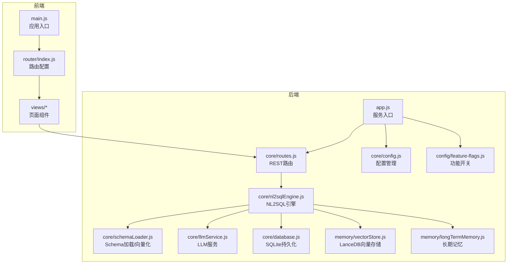

图表来源
- [backend/src/app.js:1-260](file://backend/src/app.js#L1-L260)
- [backend/src/core/routes.js:1-1037](file://backend/src/core/routes.js#L1-L1037)
- [backend/src/core/nl2sqlEngine.js:1-2652](file://backend/src/core/nl2sqlEngine.js#L1-L2652)
- [backend/src/core/schemaLoader.js:1-1172](file://backend/src/core/schemaLoader.js#L1-L1172)
- [backend/src/core/llmService.js:1-477](file://backend/src/core/llmService.js#L1-L477)
- [backend/src/core/database.js:1-859](file://backend/src/core/database.js#L1-L859)
- [backend/src/memory/vectorStore.js:1-881](file://backend/src/memory/vectorStore.js#L1-L881)
- [backend/src/memory/longTermMemory.js:1-1127](file://backend/src/memory/longTermMemory.js#L1-L1127)
- [backend/src/core/config.js:1-398](file://backend/src/core/config.js#L1-L398)
- [backend/config/feature-flags.js:1-249](file://backend/config/feature-flags.js#L1-L249)
- [frontend/src/main.js:1-89](file://frontend/src/main.js#L1-L89)
- [frontend/src/router/index.js:1-157](file://frontend/src/router/index.js#L1-L157)

章节来源
- [backend/src/app.js:1-260](file://backend/src/app.js#L1-L260)
- [frontend/src/main.js:1-89](file://frontend/src/main.js#L1-L89)
- [frontend/src/router/index.js:1-157](file://frontend/src/router/index.js#L1-L157)

## 核心组件
- 应用入口与生命周期
  - 后端入口负责加载环境变量、初始化数据库与向量存储、加载Schema与业务语义层、启动自修复调度器、监听端口并优雅关闭
  - 前端入口负责创建Vue应用、安装路由/Pinia/Element Plus、注册全局组件并挂载
- REST API与SSE
  - 路由模块提供健康检查、Schema查询、会话管理、查询历史、用户偏好、评估统计等接口
  - SSE用于流式推送查询过程与结果
- NL2SQL引擎
  - 意图识别、实体解析、表推断、SQL生成、校验与格式化、澄清机制、自我修正等
- LLM服务
  - 封装HTTP请求、重试机制、Embedding向量化、工具定义辅助
- Schema加载与向量化
  - 从JSON配置加载表结构，构建映射，向量化存储，支持语义检索与智能重排序
- 长期记忆
  - 基于用户偏好与查询模式的提取、存储与维护，支持LLM智能提炼与异步入队
- 向量存储
  - 基于LanceDB的Schema与查询历史向量表，支持智能搜索与统计记录
- 数据持久化
  - SQLite存储会话、消息、查询历史、用户偏好、系统日志等
- 配置与功能开关
  - 集中配置LLM/API、数据库、安全、日志、自修复、Schema、长期记忆、上下文管理、评估等
  - 功能开关支持渐进式启用与紧急回滚

章节来源
- [backend/src/app.js:97-188](file://backend/src/app.js#L97-L188)
- [backend/src/core/routes.js:1-1037](file://backend/src/core/routes.js#L1-L1037)
- [backend/src/core/nl2sqlEngine.js:1-2652](file://backend/src/core/nl2sqlEngine.js#L1-L2652)
- [backend/src/core/llmService.js:1-477](file://backend/src/core/llmService.js#L1-L477)
- [backend/src/core/schemaLoader.js:1-1172](file://backend/src/core/schemaLoader.js#L1-L1172)
- [backend/src/memory/longTermMemory.js:1-1127](file://backend/src/memory/longTermMemory.js#L1-L1127)
- [backend/src/memory/vectorStore.js:1-881](file://backend/src/memory/vectorStore.js#L1-L881)
- [backend/src/core/database.js:1-859](file://backend/src/core/database.js#L1-L859)
- [backend/src/core/config.js:1-398](file://backend/src/core/config.js#L1-L398)
- [backend/config/feature-flags.js:1-249](file://backend/config/feature-flags.js#L1-L249)
- [frontend/src/main.js:1-89](file://frontend/src/main.js#L1-L89)

## 架构总览
系统采用前后端分离与微服务理念的模块化组织：
- 前端：Vue3单页应用，路由驱动页面切换，通过Axios调用后端API
- 后端：Express服务，模块化核心能力，通过路由暴露REST API与SSE
- 数据层：SQLite用于会话与偏好等结构化数据，LanceDB用于Schema与查询历史的向量化检索
- 服务层：LLM服务抽象外部API调用，配置中心集中管理运行参数
- 跨领域关注点：日志、安全、监控、评估、功能开关、优雅关闭

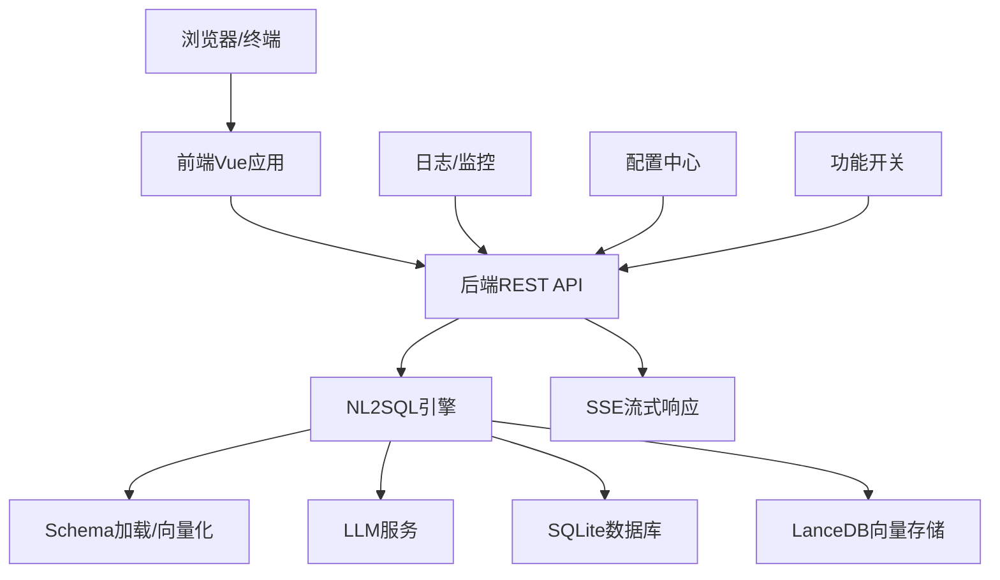

图表来源
- [backend/src/core/routes.js:1-1037](file://backend/src/core/routes.js#L1-L1037)
- [backend/src/core/nl2sqlEngine.js:1-2652](file://backend/src/core/nl2sqlEngine.js#L1-L2652)
- [backend/src/core/schemaLoader.js:1-1172](file://backend/src/core/schemaLoader.js#L1-L1172)
- [backend/src/core/llmService.js:1-477](file://backend/src/core/llmService.js#L1-L477)
- [backend/src/core/database.js:1-859](file://backend/src/core/database.js#L1-L859)
- [backend/src/memory/vectorStore.js:1-881](file://backend/src/memory/vectorStore.js#L1-L881)
- [backend/src/utils/logger.js:1-442](file://backend/src/utils/logger.js#L1-L442)
- [backend/src/core/config.js:1-398](file://backend/src/core/config.js#L1-L398)
- [backend/config/feature-flags.js:1-249](file://backend/config/feature-flags.js#L1-L249)

## 详细组件分析

### NL2SQL引擎（核心）
- 职责：意图识别、实体解析、表推断、SQL生成、验证与格式化、澄清与自我修正
- 关键流程：输入自然语言 → 意图/实体解析 → 表与字段映射 → SQL生成 → 安全校验 → 执行/流式返回
- 模块化：与Schema、LLM、数据库、向量存储、长期记忆解耦，通过接口协作
- 错误处理：统一NL2SQLError，区分可恢复与不可恢复错误，支持澄清与自我修复

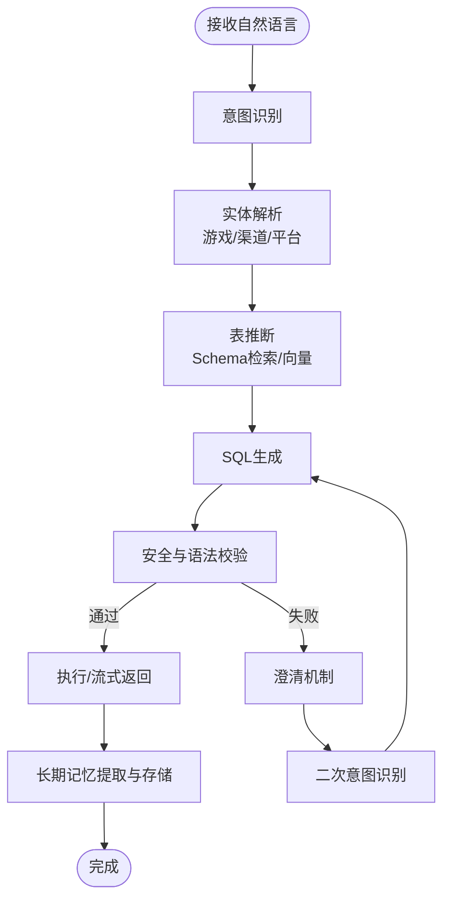

图表来源
- [backend/src/core/nl2sqlEngine.js:1-2652](file://backend/src/core/nl2sqlEngine.js#L1-L2652)
- [backend/src/core/schemaLoader.js:1-1172](file://backend/src/core/schemaLoader.js#L1-L1172)
- [backend/src/core/llmService.js:1-477](file://backend/src/core/llmService.js#L1-L477)
- [backend/src/memory/longTermMemory.js:1-1127](file://backend/src/memory/longTermMemory.js#L1-L1127)

章节来源
- [backend/src/core/nl2sqlEngine.js:1-2652](file://backend/src/core/nl2sqlEngine.js#L1-L2652)

### Schema加载与向量化
- 职责：加载JSON Schema、构建映射、向量化存储、语义检索、智能重排序
- 优化：表级向量、元数据标签（域/类型）、智能搜索（游戏/平台优先级）
- 与NL2SQL：为意图识别与表推断提供语义支撑

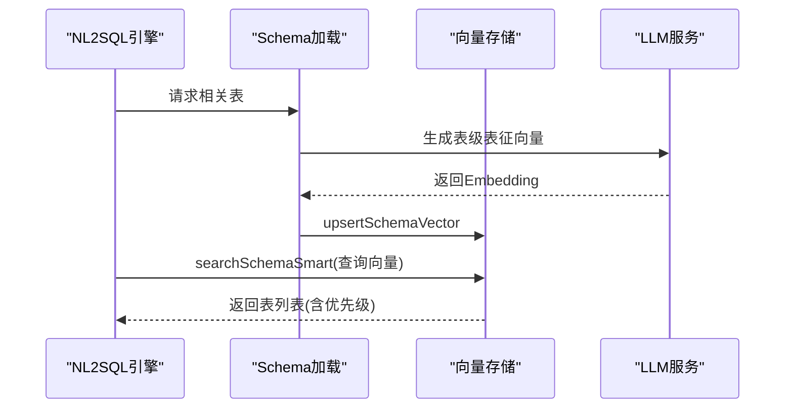

图表来源
- [backend/src/core/schemaLoader.js:1-1172](file://backend/src/core/schemaLoader.js#L1-L1172)
- [backend/src/memory/vectorStore.js:1-881](file://backend/src/memory/vectorStore.js#L1-L881)
- [backend/src/core/llmService.js:1-477](file://backend/src/core/llmService.js#L1-L477)

章节来源
- [backend/src/core/schemaLoader.js:1-1172](file://backend/src/core/schemaLoader.js#L1-L1172)
- [backend/src/memory/vectorStore.js:1-881](file://backend/src/memory/vectorStore.js#L1-L881)

### LLM服务
- 职责：封装HTTP请求、重试、超时、流式响应、Embedding向量化
- 设计：统一错误处理与日志记录，支持工具定义与函数调用

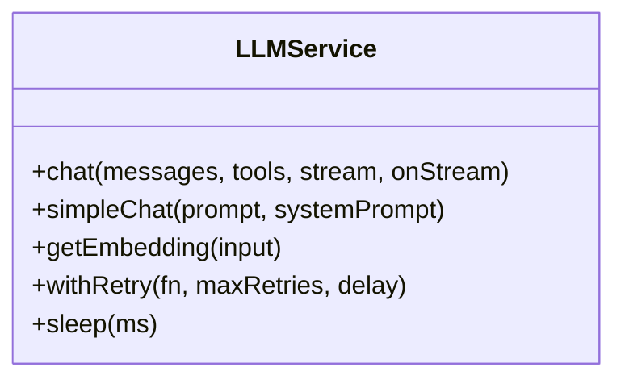

图表来源
- [backend/src/core/llmService.js:1-477](file://backend/src/core/llmService.js#L1-L477)

章节来源
- [backend/src/core/llmService.js:1-477](file://backend/src/core/llmService.js#L1-L477)

### 长期记忆（Layer 2）
- 职责：用户偏好与查询模式的提取、存储、维护与异步入队
- 策略：置信度阈值、模板价值评估、高频模式、LLM智能提炼
- 与NL2SQL：为后续查询提供上下文与个性化建议

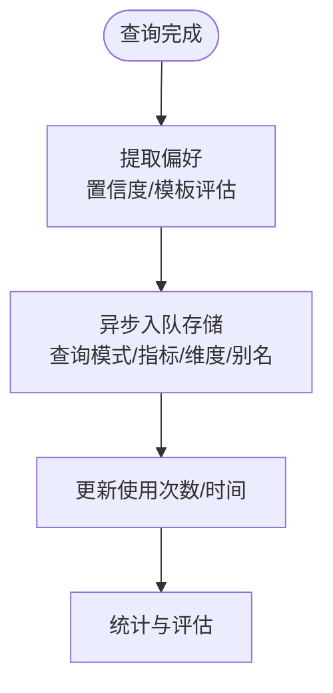

图表来源
- [backend/src/memory/longTermMemory.js:1-1127](file://backend/src/memory/longTermMemory.js#L1-L1127)

章节来源
- [backend/src/memory/longTermMemory.js:1-1127](file://backend/src/memory/longTermMemory.js#L1-L1127)

### 向量存储（LanceDB）
- 职责：Schema与查询历史的向量表、智能搜索、统计记录、增量更新
- 能力：智能重排序（游戏/平台优先级）、元数据过滤、重要性评分

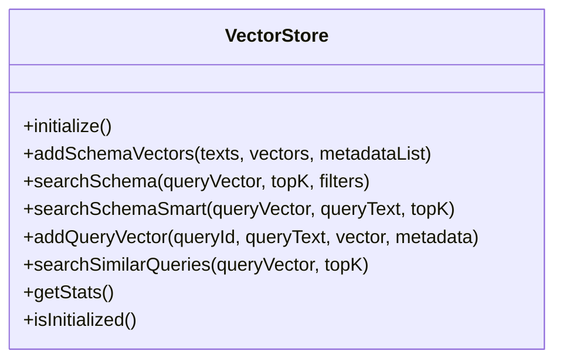

图表来源
- [backend/src/memory/vectorStore.js:1-881](file://backend/src/memory/vectorStore.js#L1-L881)

章节来源
- [backend/src/memory/vectorStore.js:1-881](file://backend/src/memory/vectorStore.js#L1-L881)

### 数据持久化（SQLite）
- 职责：会话、消息、查询历史、用户偏好、系统日志等结构化数据
- 设计：外键约束、索引优化、事务保证一致性、迁移修复

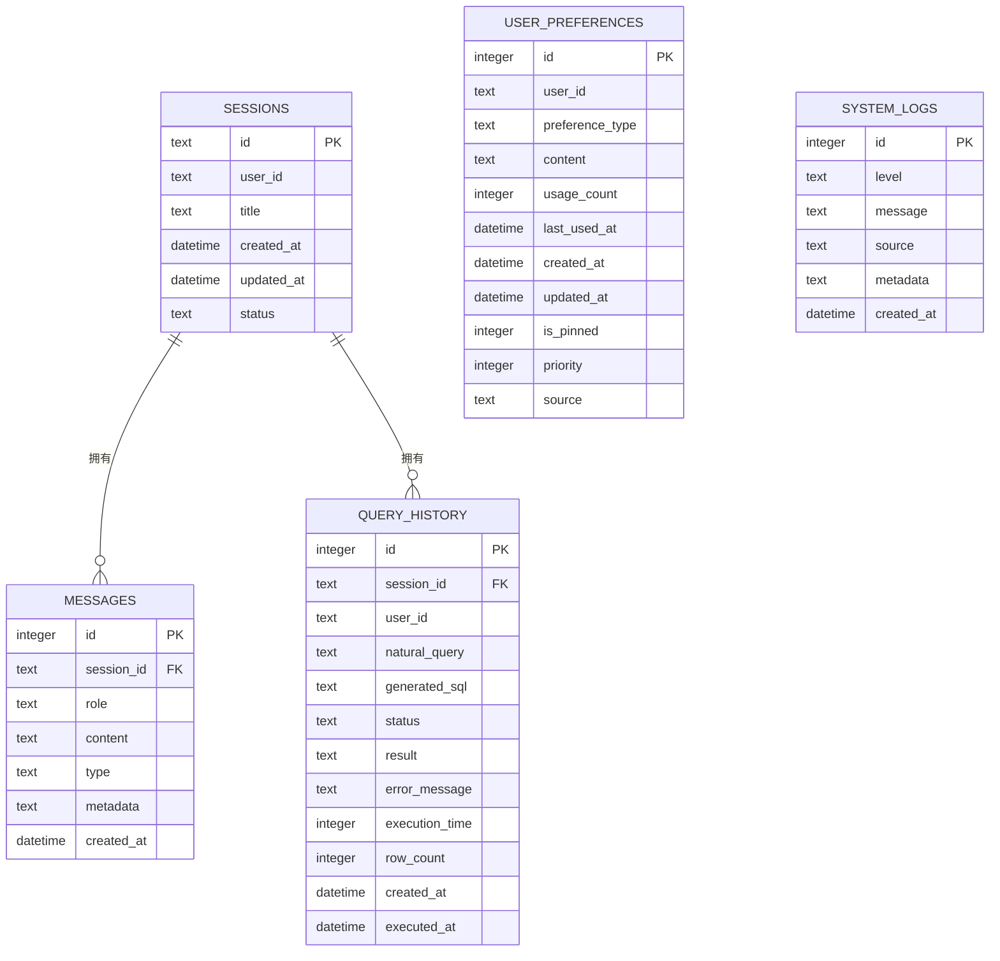

图表来源
- [backend/src/core/database.js:1-859](file://backend/src/core/database.js#L1-L859)

章节来源
- [backend/src/core/database.js:1-859](file://backend/src/core/database.js#L1-L859)

### 配置与功能开关
- 配置中心：集中管理LLM/API、数据库、安全、日志、自修复、Schema、长期记忆、上下文管理、评估等
- 功能开关：支持按Phase启用/禁用，支持全局启用/禁用，便于灰度与回滚

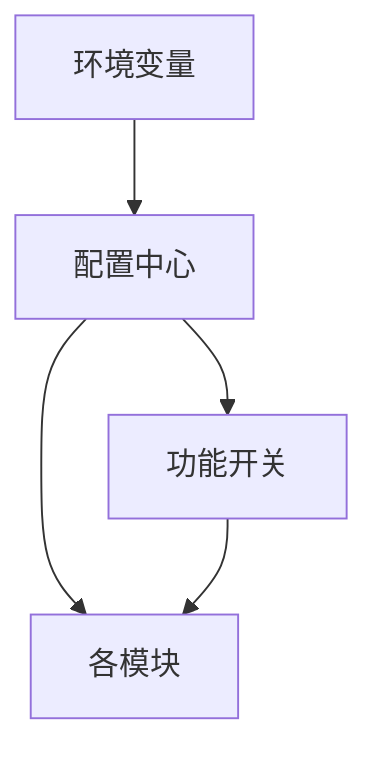

图表来源
- [backend/src/core/config.js:1-398](file://backend/src/core/config.js#L1-L398)
- [backend/config/feature-flags.js:1-249](file://backend/config/feature-flags.js#L1-L249)

章节来源
- [backend/src/core/config.js:1-398](file://backend/src/core/config.js#L1-L398)
- [backend/config/feature-flags.js:1-249](file://backend/config/feature-flags.js#L1-L249)

### 前后端交互与部署拓扑
- 前端：Vite开发服务器，代理/api至后端3000端口；生产构建产物dist
- 后端：Express监听3000端口，提供REST API与SSE；支持优雅关闭与健康检查
- 部署建议：Nginx反向代理，后端容器化（Node.js），数据卷挂载SQLite/LanceDB目录

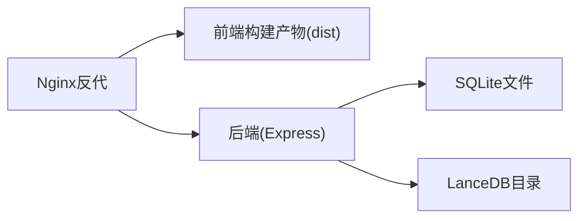

图表来源
- [frontend/vite.config.js:1-93](file://frontend/vite.config.js#L1-L93)
- [backend/src/app.js:1-260](file://backend/src/app.js#L1-L260)

章节来源
- [frontend/vite.config.js:1-93](file://frontend/vite.config.js#L1-L93)
- [backend/src/app.js:1-260](file://backend/src/app.js#L1-L260)

## 依赖分析
- 技术栈选择
  - 前端：Vue3 + Vue Router + Pinia + Element Plus，构建工具Vite
  - 后端：Express + SQLite + LanceDB + dotenv + cors + body-parser + uuid + dayjs + node-cron
  - LLM：通过HTTP API对接（OpenAI兼容），支持重试与超时
- 模块耦合
  - NL2SQL引擎与Schema/LLM/数据库/向量存储松耦合，通过接口协作
  - 路由模块仅负责HTTP协议与参数解析，业务逻辑集中在引擎
  - 配置与功能开关贯穿各模块，便于统一治理
- 外部依赖
  - LLM API（可替换为任意OpenAI兼容服务）
  - SR数据库（业务查询目标，通过URL配置）

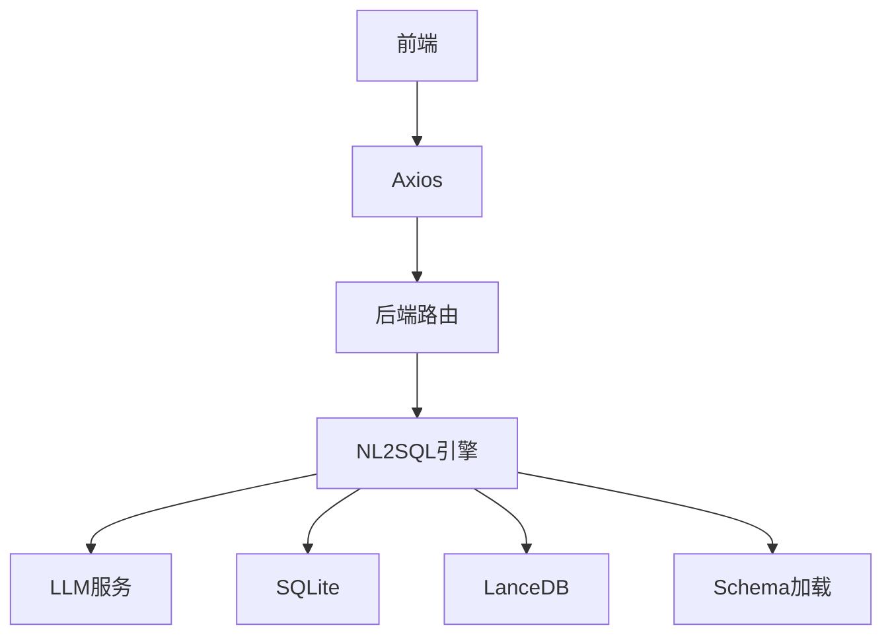

图表来源
- [frontend/package.json:1-36](file://frontend/package.json#L1-L36)
- [backend/package.json:1-28](file://backend/package.json#L1-L28)
- [backend/src/core/routes.js:1-1037](file://backend/src/core/routes.js#L1-L1037)
- [backend/src/core/nl2sqlEngine.js:1-2652](file://backend/src/core/nl2sqlEngine.js#L1-L2652)

章节来源
- [frontend/package.json:1-36](file://frontend/package.json#L1-L36)
- [backend/package.json:1-28](file://backend/package.json#L1-L28)

## 性能考量
- 向量检索优化：表级向量、元数据标签、智能重排序、增量更新
- SQL安全与性能：白名单、禁止关键字、行数限制、超时控制、Dry Run
- 上下文与Token预算：对话摘要、Token预算检查、阈值压缩
- 数据库索引：按用户/时间/状态建立索引，事务保证一致性
- 日志与监控：结构化日志、运行时统计、SSE流式响应减少等待

## 故障排查指南
- 健康检查
  - GET /api/health：基础健康状态
  - GET /api/health/detail：组件状态（数据库、LLM、Schema、SSE）
- 常见问题定位
  - LLM API失败：检查LLM_API_KEY、apiBase、超时与重试
  - 向量数据库未初始化：确认LanceDB路径与权限
  - SQLite连接失败：检查DB_PATH与文件权限
  - CORS跨域：生产环境限制origin
  - 功能开关：确认FF_*环境变量与功能开关状态
- 日志与追踪
  - 日志级别与文件轮转配置
  - Logger提供trace/traceStep/endTrace用于流程追踪

章节来源
- [backend/src/core/routes.js:60-137](file://backend/src/core/routes.js#L60-L137)
- [backend/src/utils/logger.js:1-442](file://backend/src/utils/logger.js#L1-L442)
- [backend/src/core/config.js:1-398](file://backend/src/core/config.js#L1-L398)
- [backend/config/feature-flags.js:1-249](file://backend/config/feature-flags.js#L1-L249)

## 结论
本系统通过前后端分离与模块化设计，结合LLM驱动的意图识别、Schema语义检索、长期记忆与向量存储，实现了从自然语言到SQL的自动化与智能化。功能开关与配置中心支持渐进式演进与灵活治理，日志与监控保障可观测性。在性能方面，通过向量检索优化、SQL安全与限流、Token预算与摘要等手段，兼顾准确性与效率。部署层面，建议采用Nginx反代与容器化，结合数据卷管理SQLite与LanceDB，确保可扩展与可维护性。

## 附录
- 环境变量与配置要点
  - LLM_API_BASE、LLM_API_KEY、LLM_MODEL、LLM_TIMEOUT
  - DB_PATH、VECTOR_DB_PATH、SR_DATABASE_URL
  - ALLOWED_TABLES、MAX_QUERY_ROWS、QUERY_TIMEOUT、DRY_RUN
  - LOG_LEVEL、LOG_FILE、EVALUATION_ENABLED、EVALUATION_TRACK_STATS
  - FF_* 功能开关
- 业务语义层
  - 业务概念到物理表/字段映射，支持平台类型、游戏ID、字段别名等
- 前端开发
  - Vite开发服务器端口5173，代理/api至后端3000
  - 路由守卫与页面标题管理

章节来源
- [backend/src/core/config.js:1-398](file://backend/src/core/config.js#L1-L398)
- [backend/config/business-semantic-layer.json:1-189](file://backend/config/business-semantic-layer.json#L1-L189)
- [frontend/vite.config.js:1-93](file://frontend/vite.config.js#L1-L93)
- [frontend/src/router/index.js:1-157](file://frontend/src/router/index.js#L1-L157)