# 系统架构

<cite>
**本文档引用的文件**
- [backend/src/app.js](file://backend/src/app.js)
- [backend/src/core/route.js](file://backend/src/core/routes.js)
- [backend/src/core/nl2sqlEngine.js](file://backend/src/core/nl2sqlEngine.js)
- [backend/src/core/sseHandler.js](file://backend/src/core/sseHandler.js)
- [backend/src/core/agenticEngine.js](file://backend/src/core/agenticEngine.js)
- [backend/src/core/sqlExecutor.js](file://backend/src/core/sqlExecutor.js)
- [backend/src/core/config.js](file://backend/src/core/config.js)
- [backend/src/core/schemaLoader.js](file://backend/src/core/schemaLoader.js)
- [backend/src/memory/vectorStore.js](file://backend/src/memory/vectorStore.js)
- [backend/src/utils/logger.js](file://backend/src/utils/logger.js)
- [backend/package.json](file://backend/package.json)
- [backend/config/feature-flags.js](file://backend/config/feature-flags.js)
- [frontend/src/main.js](file://frontend/src/main.js)
- [frontend/src/utils/api.js](file://frontend/src/utils/api.js)
- [frontend/src/stores/session.js](file://frontend/src/stores/session.js)
- [frontend/vite.config.js](file://frontend/vite.config.js)
- [frontend/package.json](file://frontend/package.json)
</cite>

## 目录
1. [简介](#简介)
2. [项目结构](#项目结构)
3. [核心组件](#核心组件)
4. [架构总览](#架构总览)
5. [详细组件分析](#详细组件分析)
6. [依赖分析](#依赖分析)
7. [性能考虑](#性能考虑)
8. [故障排查指南](#故障排查指南)
9. [结论](#结论)
10. [附录](#附录)

## 简介
本系统是一个基于自然语言到SQL的智能查询系统，采用前后端分离架构，后端基于Express提供REST API与Server-Sent Events流式通信，前端基于Vue3构建交互界面。系统通过模块化设计、中间件模式、事件驱动与功能开关等设计原则，实现了可扩展、可维护、可观测的NL2SQL能力，并支持多阶段推理与自我修正。

## 项目结构
系统分为三层：
- 前端层：Vue3应用，通过Axios与后端API通信，使用EventSource实现SSE实时交互。
- 后端层：Express服务，提供REST API与SSE端点，编排NL2SQL核心引擎与Agentic引擎。
- 数据与基础设施：SQLite会话存储、LanceDB向量数据库、MySQL业务库连接池。

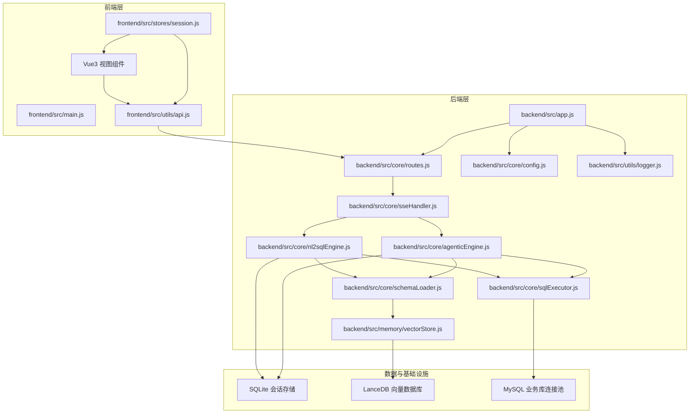

**图表来源**
- [backend/src/app.js:1-279](file://backend/src/app.js#L1-L279)
- [backend/src/core/routes.js:1-1099](file://backend/src/core/routes.js#L1-L1099)
- [backend/src/core/sseHandler.js:1-688](file://backend/src/core/sseHandler.js#L1-L688)
- [backend/src/core/nl2sqlEngine.js:1-756](file://backend/src/core/nl2sqlEngine.js#L1-L756)
- [backend/src/core/agenticEngine.js:1-994](file://backend/src/core/agenticEngine.js#L1-L994)
- [backend/src/core/sqlExecutor.js:1-175](file://backend/src/core/sqlExecutor.js#L1-L175)
- [backend/src/core/config.js:1-439](file://backend/src/core/config.js#L1-L439)
- [backend/src/core/schemaLoader.js:1-1261](file://backend/src/core/schemaLoader.js#L1-L1261)
- [backend/src/memory/vectorStore.js:1-928](file://backend/src/memory/vectorStore.js#L1-L928)
- [backend/src/utils/logger.js:1-482](file://backend/src/utils/logger.js#L1-L482)
- [frontend/src/main.js:1-89](file://frontend/src/main.js#L1-L89)
- [frontend/src/utils/api.js:1-320](file://frontend/src/utils/api.js#L1-L320)
- [frontend/src/stores/session.js:1-443](file://frontend/src/stores/session.js#L1-L443)

**章节来源**
- [backend/src/app.js:1-279](file://backend/src/app.js#L1-L279)
- [frontend/src/main.js:1-89](file://frontend/src/main.js#L1-L89)

## 核心组件
- Express应用与中间件：负责CORS、JSON解析、路由挂载与优雅关闭。
- SSE处理器：管理SSE连接、进度回调、澄清回答与错误推送。
- NL2SQL引擎：Phase 4编排入口，整合意图识别、实体解析、SQL生成、验证、执行、格式化与审计。
- Agentic引擎：四阶段工作流（规划→Schema探索→动态意图拆解→生成验证与恢复）。
- SQL执行器：安全校验、连接池执行、行级权限改写、结果脱敏与行数限制。
- Schema加载器：加载配置、缓存、向量化、语义搜索与SQL白名单校验。
- 向量存储：LanceDB封装，表级向量表示、智能搜索与统计记录。
- 配置管理：集中配置、验证与功能开关。
- 日志工具：统一日志、结构化输出与执行追踪。

**章节来源**
- [backend/src/core/nl2sqlEngine.js:1-756](file://backend/src/core/nl2sqlEngine.js#L1-L756)
- [backend/src/core/agenticEngine.js:1-994](file://backend/src/core/agenticEngine.js#L1-L994)
- [backend/src/core/sqlExecutor.js:1-175](file://backend/src/core/sqlExecutor.js#L1-L175)
- [backend/src/core/schemaLoader.js:1-1261](file://backend/src/core/schemaLoader.js#L1-L1261)
- [backend/src/memory/vectorStore.js:1-928](file://backend/src/memory/vectorStore.js#L1-L928)
- [backend/src/core/config.js:1-439](file://backend/src/core/config.js#L1-L439)
- [backend/src/utils/logger.js:1-482](file://backend/src/utils/logger.js#L1-L482)

## 架构总览
系统采用分层架构与微服务思想（后端服务内部分层），结合事件驱动模式（SSE）实现前后端实时交互。核心设计原则包括：
- 模块化设计：各子系统职责清晰，接口稳定，便于替换与扩展。
- 中间件模式：Express中间件统一处理CORS、日志与错误。
- 观察者模式：SSE事件驱动，前端订阅进度与结果。
- 功能开关：通过feature-flags实现渐进式发布与快速回滚。
- 可观测性：统一日志、追踪与健康检查端点。

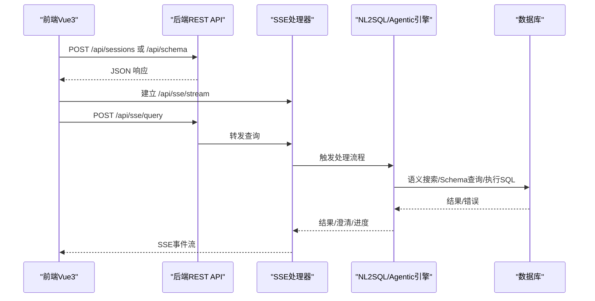

**图表来源**
- [backend/src/core/sseHandler.js:1-688](file://backend/src/core/sseHandler.js#L1-L688)
- [backend/src/core/nl2sqlEngine.js:1-756](file://backend/src/core/nl2sqlEngine.js#L1-L756)
- [backend/src/core/agenticEngine.js:1-994](file://backend/src/core/agenticEngine.js#L1-L994)
- [frontend/src/utils/api.js:1-320](file://frontend/src/utils/api.js#L1-L320)
- [frontend/src/stores/session.js:1-443](file://frontend/src/stores/session.js#L1-L443)

## 详细组件分析

### 后端应用启动与初始化
- 加载环境变量与依赖，初始化数据库、向量库、Schema元数据与业务语义层。
- 启动HTTP服务器与SSE端点，注册优雅关闭与未处理异常处理。
- 启动自修复调度器，定期健康检查与维护。

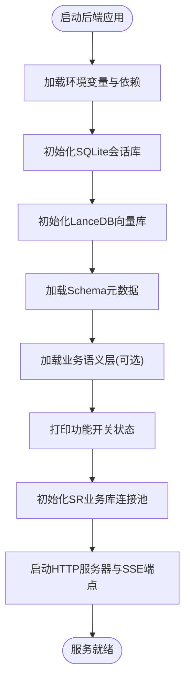

**图表来源**
- [backend/src/app.js:99-204](file://backend/src/app.js#L99-L204)

**章节来源**
- [backend/src/app.js:1-279](file://backend/src/app.js#L1-L279)

### REST API与路由
- 健康检查、Schema查询、会话管理、查询历史、用户偏好、评估接口等。
- 统一请求日志中间件，记录请求方法、路径与IP。
- SSE查询与澄清回答端点，统一由sseHandler处理。

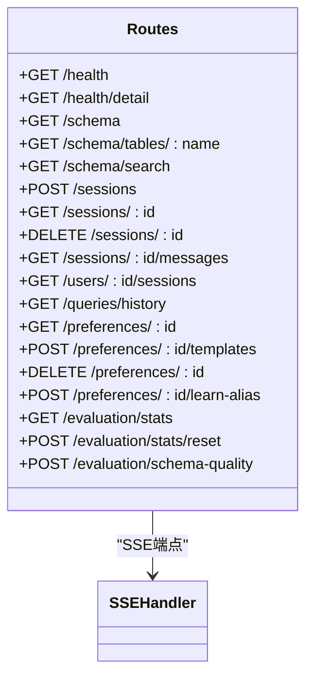

**图表来源**
- [backend/src/core/routes.js:1-1099](file://backend/src/core/routes.js#L1-L1099)

**章节来源**
- [backend/src/core/routes.js:1-1099](file://backend/src/core/routes.js#L1-L1099)

### SSE处理器与事件流
- 管理SSE连接、进度回调、澄清回答与错误推送。
- 支持引擎切换（Agentic/Legacy）与自动回退。
- 提供连接统计与活跃会话查询。

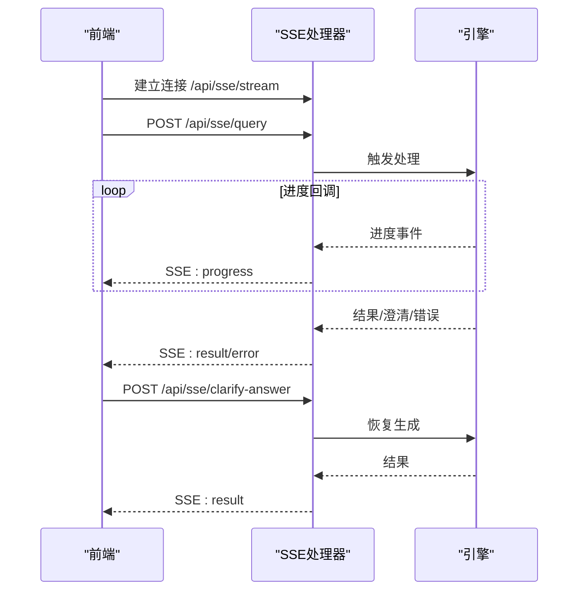

**图表来源**
- [backend/src/core/sseHandler.js:258-410](file://backend/src/core/sseHandler.js#L258-L410)
- [frontend/src/stores/session.js:227-304](file://frontend/src/stores/session.js#L227-L304)

**章节来源**
- [backend/src/core/sseHandler.js:1-688](file://backend/src/core/sseHandler.js#L1-L688)
- [frontend/src/stores/session.js:1-443](file://frontend/src/stores/session.js#L1-L443)

### NL2SQL核心引擎（Phase 4）
- 编排流程：加载历史→Token预算→意图识别→澄清→SQL生成→验证→RLS改写→执行→脱敏→格式化→审计。
- 子模块：意图分析、实体解析、SQL生成、SQL执行、结果格式化。
- 错误类型与可恢复性标注，统一错误对象。

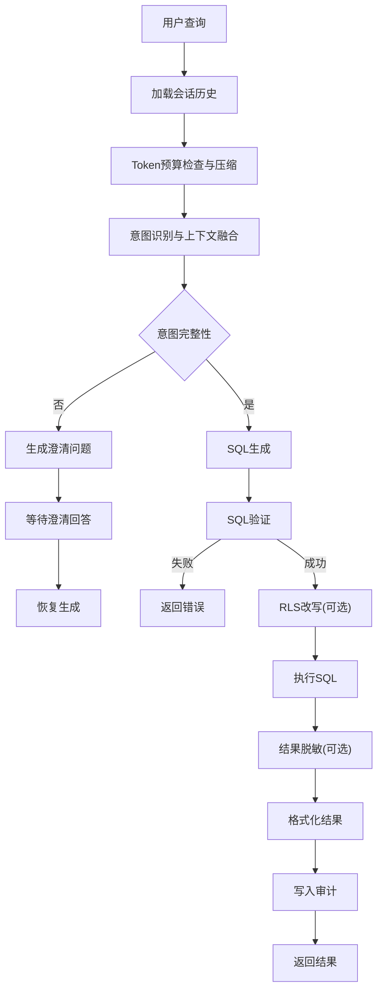

**图表来源**
- [backend/src/core/nl2sqlEngine.js:121-734](file://backend/src/core/nl2sqlEngine.js#L121-L734)

**章节来源**
- [backend/src/core/nl2sqlEngine.js:1-756](file://backend/src/core/nl2sqlEngine.js#L1-L756)

### Agentic引擎（多步推理与自我修正）
- 四阶段工作流：规划→Schema探索→动态意图拆解→生成验证与恢复。
- 支持工具循环、澄清机制与错误分类恢复。
- 与SSE集成，支持澄清回答恢复生成。

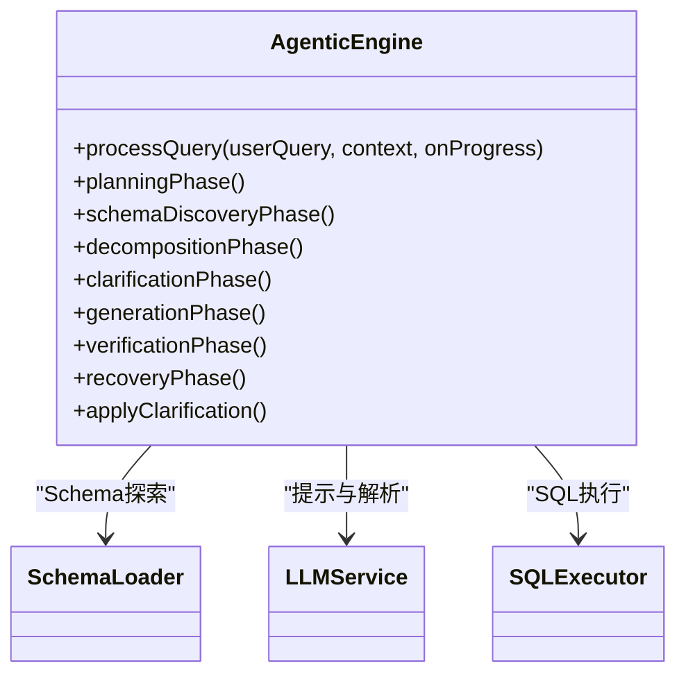

**图表来源**
- [backend/src/core/agenticEngine.js:54-215](file://backend/src/core/agenticEngine.js#L54-L215)

**章节来源**
- [backend/src/core/agenticEngine.js:1-994](file://backend/src/core/agenticEngine.js#L1-L994)

### SQL执行器与安全控制
- 安全校验：白名单、关键字过滤、前缀限制、LIMIT必现。
- 执行：连接池执行、超时控制、行数限制、脱敏规则。
- RLS改写：按租户列注入过滤条件，拒绝硬拒。

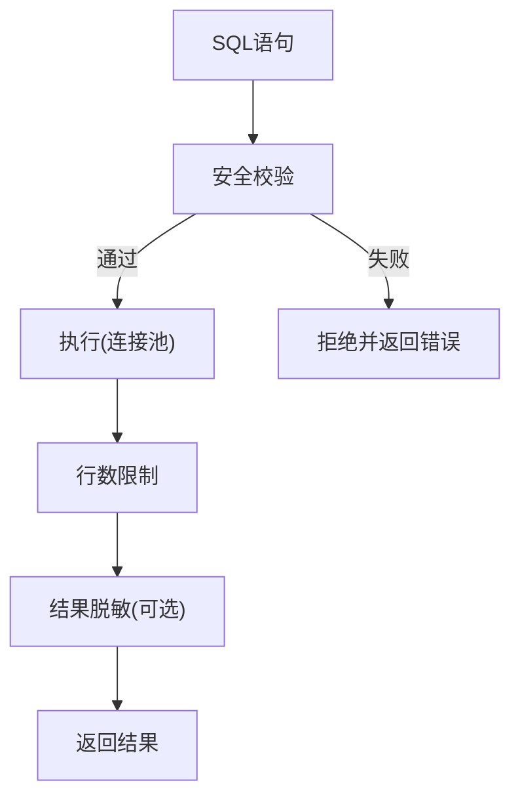

**图表来源**
- [backend/src/core/sqlExecutor.js:34-175](file://backend/src/core/sqlExecutor.js#L34-L175)

**章节来源**
- [backend/src/core/sqlExecutor.js:1-175](file://backend/src/core/sqlExecutor.js#L1-L175)

### Schema加载与向量检索
- 加载配置、构建映射、缓存与向量化。
- 智能搜索：表级向量、意图识别、平台类型与数据源过滤、重排序。
- 关键词匹配回退与统计记录。

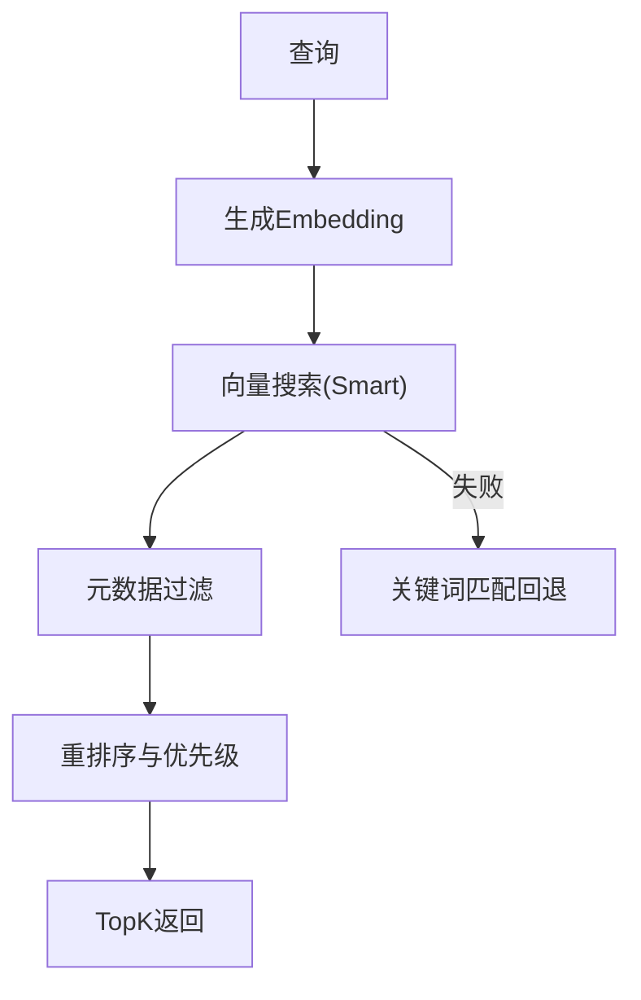

**图表来源**
- [backend/src/core/schemaLoader.js:571-736](file://backend/src/core/schemaLoader.js#L571-L736)
- [backend/src/memory/vectorStore.js:454-578](file://backend/src/memory/vectorStore.js#L454-L578)

**章节来源**
- [backend/src/core/schemaLoader.js:1-1261](file://backend/src/core/schemaLoader.js#L1-L1261)
- [backend/src/memory/vectorStore.js:1-928](file://backend/src/memory/vectorStore.js#L1-L928)

### 前端架构与交互
- Vue3应用入口，安装路由、状态管理与UI库。
- API服务封装Axios，统一拦截与错误处理。
- 会话Store管理SSE连接、消息历史与处理状态。
- Vite开发服务器配置代理，解决跨域问题。

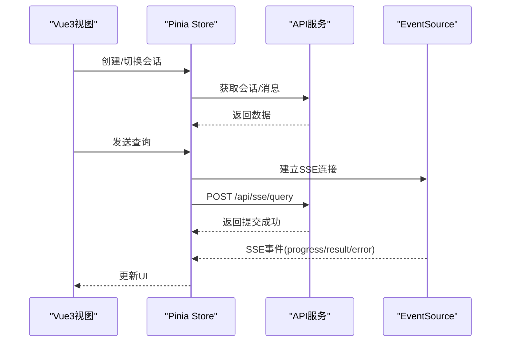

**图表来源**
- [frontend/src/main.js:1-89](file://frontend/src/main.js#L1-L89)
- [frontend/src/utils/api.js:1-320](file://frontend/src/utils/api.js#L1-L320)
- [frontend/src/stores/session.js:185-304](file://frontend/src/stores/session.js#L185-L304)
- [frontend/vite.config.js:17-51](file://frontend/vite.config.js#L17-L51)

**章节来源**
- [frontend/src/main.js:1-89](file://frontend/src/main.js#L1-L89)
- [frontend/src/utils/api.js:1-320](file://frontend/src/utils/api.js#L1-L320)
- [frontend/src/stores/session.js:1-443](file://frontend/src/stores/session.js#L1-L443)
- [frontend/vite.config.js:1-93](file://frontend/vite.config.js#L1-L93)

## 依赖分析
- 后端依赖：Express、CORS、Body-Parser、SQLite3、mysql2、vectordb、node-cron、node-sql-parser、uuid、dayjs等。
- 前端依赖：Vue3、Vue Router、Pinia、Element Plus、Axios、ECharts、Mermaid等。
- 配置与功能开关：集中配置与功能开关，支持按Phase启用/禁用特性。
- 日志与追踪：统一日志工具，支持结构化输出与执行追踪。

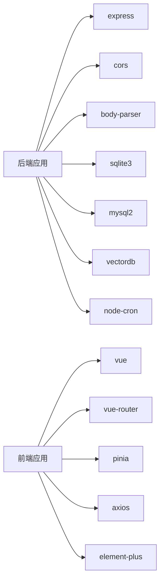

**图表来源**
- [backend/package.json:16-35](file://backend/package.json#L16-L35)
- [frontend/package.json:11-35](file://frontend/package.json#L11-L35)

**章节来源**
- [backend/package.json:1-36](file://backend/package.json#L1-L36)
- [frontend/package.json:1-36](file://frontend/package.json#L1-L36)

## 性能考虑
- 连接池与超时：MySQL连接池与查询超时控制，避免资源耗尽。
- 行数限制与脱敏：防止大结果集与敏感信息泄露。
- 向量检索与缓存：表级向量表示与智能搜索，减少LLM调用成本。
- Token预算与压缩：对话历史压缩与上下文预算，控制LLM成本。
- SSE缓冲禁用：Nginx缓冲禁用，保证实时性。
- 构建优化：前端代码分割与第三方库独立打包。

## 故障排查指南
- 健康检查：/api/health 与 /api/health/detail，检查数据库、Schema、SSE连接状态。
- 功能开关：打印当前启用的开关与Phase，确认特性是否按预期启用。
- 日志追踪：使用traceStep记录关键步骤，endTrace输出完整追踪记录。
- 异常处理：未处理Promise拒绝与未捕获异常的统一处理，优雅关闭。
- SSE连接：检查连接数与活跃会话，确认澄清回答路由与自动回退逻辑。

**章节来源**
- [backend/src/core/routes.js:74-139](file://backend/src/core/routes.js#L74-L139)
- [backend/src/core/sseHandler.js:626-664](file://backend/src/core/sseHandler.js#L626-L664)
- [backend/src/utils/logger.js:352-448](file://backend/src/utils/logger.js#L352-L448)
- [backend/src/app.js:214-271](file://backend/src/app.js#L214-L271)
- [backend/config/feature-flags.js:254-274](file://backend/config/feature-flags.js#L254-L274)

## 结论
本系统通过清晰的分层架构、模块化设计与事件驱动模式，实现了从自然语言到SQL的高效、安全与可扩展的查询能力。功能开关与统一配置使系统具备渐进式发布与快速回滚能力；SSE实现实时反馈；向量检索与Schema缓存提升了语义理解与性能。未来可在微服务拆分、缓存策略、LLM成本优化与可观测性增强方面持续演进。

## 附录
- 架构决策背景：Node.js生态成熟、Express轻量、SSE适合流式反馈、LanceDB适合嵌入式向量检索。
- 权衡考量：开发效率与生产稳定性平衡、LLM成本与准确性平衡、实时性与可靠性平衡。
- 未来演进方向：服务化拆分、引入缓存层、增强审计与合规、LLM推理优化与成本控制。