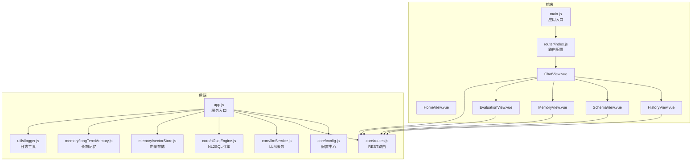
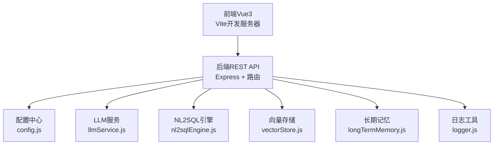
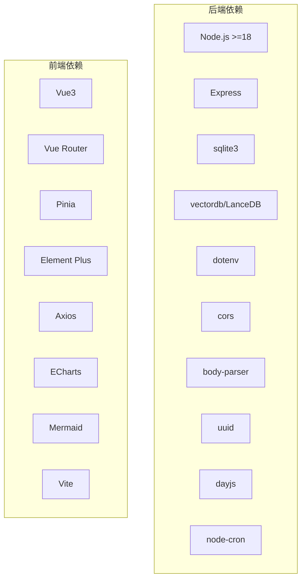
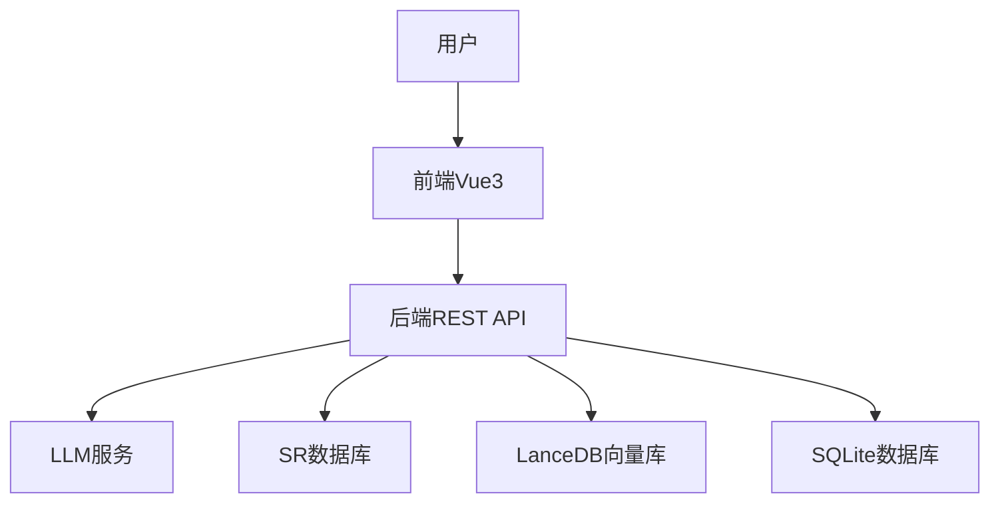
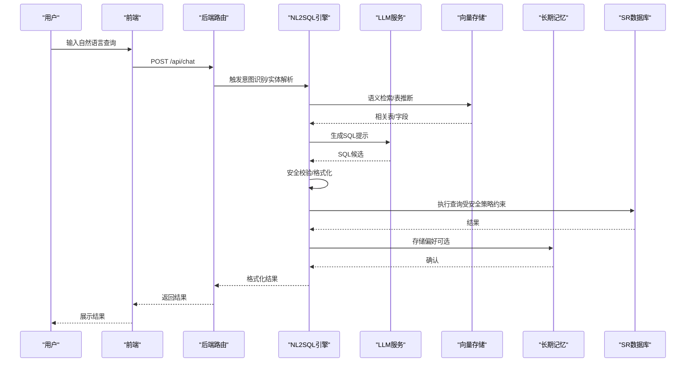

# 系统架构

<cite>
**本文引用的文件**
- [backend/package.json](file://backend/package.json)
- [frontend/package.json](file://frontend/package.json)
- [backend/src/app.js](file://backend/src/app.js)
- [backend/src/core/config.js](file://backend/src/core/config.js)
- [backend/src/core/routes.js](file://backend/src/core/routes.js)
- [backend/src/core/nl2sqlEngine.js](file://backend/src/core/nl2sqlEngine.js)
- [backend/src/core/llmService.js](file://backend/src/core/llmService.js)
- [backend/src/memory/longTermMemory.js](file://backend/src/memory/longTermMemory.js)
- [backend/src/memory/vectorStore.js](file://backend/src/memory/vectorStore.js)
- [backend/src/utils/logger.js](file://backend/src/utils/logger.js)
- [backend/config/business-semantic-layer.json](file://backend/config/business-semantic-layer.json)
- [backend/config/feature-flags.js](file://backend/config/feature-flags.js)
- [frontend/src/main.js](file://frontend/src/main.js)
- [frontend/src/router/index.js](file://frontend/src/router/index.js)
- [frontend/vite.config.js](file://frontend/vite.config.js)
</cite>

## 目录
1. [简介](#简介)
2. [项目结构](#项目结构)
3. [核心组件](#核心组件)
4. [架构总览](#架构总览)
5. [详细组件分析](#详细组件分析)
6. [依赖关系分析](#依赖关系分析)
7. [性能考量](#性能考量)
8. [故障排查指南](#故障排查指南)
9. [结论](#结论)
10. [附录](#附录)

## 简介
本架构文档面向NL2SQL系统，聚焦于前后端分离、模块化与可演进的微服务理念，结合向量检索、长期记忆与LLM能力，形成“意图识别—澄清—SQL生成—安全校验—结果格式化”的闭环。系统采用Node.js后端与Vue3前端，通过REST API与SSE进行交互，具备可观测性、可扩展性与可运维性。

## 项目结构
- 后端（Node.js + Express）
  - 核心模块：配置中心、路由、LLM服务、NL2SQL引擎、向量存储、长期记忆、日志工具
  - 数据与持久化：SQLite（会话/偏好）、LanceDB（向量）
  - 配置：环境变量、功能开关、业务语义层配置
- 前端（Vue3 + Vite）
  - 路由与视图：聊天、历史、Schema、记忆、评估等页面
  - 状态管理：Pinia
  - 构建与代理：Vite开发服务器、API代理至后端

图表来源
- [backend/src/app.js:1-266](file://backend/src/app.js#L1-L266)
- [backend/src/core/config.js:1-398](file://backend/src/core/config.js#L1-L398)
- [backend/src/core/routes.js:1-800](file://backend/src/core/routes.js#L1-L800)
- [backend/src/core/llmService.js:1-477](file://backend/src/core/llmService.js#L1-L477)
- [backend/src/core/nl2sqlEngine.js:1-800](file://backend/src/core/nl2sqlEngine.js#L1-L800)
- [backend/src/memory/vectorStore.js:1-800](file://backend/src/memory/vectorStore.js#L1-L800)
- [backend/src/memory/longTermMemory.js:1-800](file://backend/src/memory/longTermMemory.js#L1-L800)
- [backend/src/utils/logger.js:1-482](file://backend/src/utils/logger.js#L1-L482)
- [frontend/src/main.js:1-89](file://frontend/src/main.js#L1-L89)
- [frontend/src/router/index.js:1-157](file://frontend/src/router/index.js#L1-L157)

章节来源
- [backend/src/app.js:1-266](file://backend/src/app.js#L1-L266)
- [frontend/src/main.js:1-89](file://frontend/src/main.js#L1-L89)
- [frontend/src/router/index.js:1-157](file://frontend/src/router/index.js#L1-L157)

## 核心组件
- 配置中心（config.js）
  - 统一管理端口、LLM/Embedding、数据库、安全、会话、日志、自修复、Schema、长期记忆、上下文管理、评估等配置，并提供启动前校验
- 路由层（routes.js）
  - 提供健康检查、Schema查询、会话管理、查询历史、偏好管理、评估接口等REST端点
- LLM服务（llmService.js）
  - 封装HTTP调用、重试、超时、流式响应与工具定义辅助
- NL2SQL引擎（nl2sqlEngine.js）
  - 意图识别、实体解析、表推断、SQL生成、验证与格式化
- 向量存储（vectorStore.js）
  - 基于LanceDB的Schema与查询向量存储、语义检索、智能重排序
- 长期记忆（longTermMemory.js）
  - 用户偏好抽取与存储（查询模式、字段别名、指标/维度偏好），支持LLM智能提炼
- 日志工具（logger.js）
  - 控制台/文件双输出、结构化日志、追踪上下文、自动轮转

章节来源
- [backend/src/core/config.js:1-398](file://backend/src/core/config.js#L1-L398)
- [backend/src/core/routes.js:1-800](file://backend/src/core/routes.js#L1-L800)
- [backend/src/core/llmService.js:1-477](file://backend/src/core/llmService.js#L1-L477)
- [backend/src/core/nl2sqlEngine.js:1-800](file://backend/src/core/nl2sqlEngine.js#L1-L800)
- [backend/src/memory/vectorStore.js:1-800](file://backend/src/memory/vectorStore.js#L1-L800)
- [backend/src/memory/longTermMemory.js:1-800](file://backend/src/memory/longTermMemory.js#L1-L800)
- [backend/src/utils/logger.js:1-482](file://backend/src/utils/logger.js#L1-L482)

## 架构总览
系统采用前后端分离与模块化组织：
- 前端：Vue3单页应用，路由驱动页面切换，通过Axios调用后端REST接口；开发时通过Vite代理转发/api请求至后端
- 后端：Express服务，集中式配置与路由，模块化核心能力（LLM、NL2SQL、向量、记忆、日志）
- 数据：SQLite用于会话与偏好，LanceDB用于向量检索
- 安全：白名单表、禁止关键字、行数限制、超时控制、脱敏字段
- 可观测：健康检查、日志、评估统计、SSE（后端未在本仓库暴露）

图表来源
- [frontend/vite.config.js:1-93](file://frontend/vite.config.js#L1-L93)
- [backend/src/core/routes.js:1-800](file://backend/src/core/routes.js#L1-L800)
- [backend/src/core/llmService.js:1-477](file://backend/src/core/llmService.js#L1-L477)
- [backend/src/core/nl2sqlEngine.js:1-800](file://backend/src/core/nl2sqlEngine.js#L1-L800)
- [backend/src/memory/vectorStore.js:1-800](file://backend/src/memory/vectorStore.js#L1-L800)
- [backend/src/memory/longTermMemory.js:1-800](file://backend/src/memory/longTermMemory.js#L1-L800)
- [backend/src/core/config.js:1-398](file://backend/src/core/config.js#L1-L398)
- [backend/src/utils/logger.js:1-482](file://backend/src/utils/logger.js#L1-L482)

## 详细组件分析

### 配置中心（config.js）
- 设计要点
  - 集中式配置，启动前校验关键项（LLM密钥、SR数据库URL）
  - 支持开发/生产环境差异、日志级别、文件轮转
  - 安全策略：白名单表、禁止关键字、行数限制、查询超时、脱敏字段
  - 长期记忆阈值、上下文预算、评估开关
- 依赖关系
  - 被路由、LLM、NL2SQL、向量、日志等模块读取
- 风险与权衡
  - 白名单为空在生产环境风险较高，需严格配置
  - 评估功能默认关闭，避免误用

章节来源
- [backend/src/core/config.js:1-398](file://backend/src/core/config.js#L1-L398)

### 路由层（routes.js）
- 设计要点
  - 健康检查（基础/详细）、Schema查询、会话管理、查询历史、偏好管理、评估接口
  - 请求日志中间件、SSE连接统计
- 依赖关系
  - 与数据库、Schema加载器、SSE处理器、评估模块协作
- 风险与权衡
  - 会话与偏好接口需配合安全配置（白名单、行数限制）使用

章节来源
- [backend/src/core/routes.js:1-800](file://backend/src/core/routes.js#L1-L800)

### LLM服务（llmService.js）
- 设计要点
  - HTTP封装、重试机制、超时控制、流式响应、工具定义辅助
  - 支持chat/completions与embeddings端点
- 依赖关系
  - 依赖配置中心的LLM/Embedding参数
- 风险与权衡
  - 大模型请求超时需合理设置；代理截断需关注

章节来源
- [backend/src/core/llmService.js:1-477](file://backend/src/core/llmService.js#L1-L477)

### NL2SQL引擎（nl2sqlEngine.js）
- 设计要点
  - 意图识别、实体解析（游戏/渠道/平台）、表推断（向量/关键词）、SQL生成、验证与格式化
  - 支持业务语义层映射、功能开关控制工作流
- 依赖关系
  - 依赖LLM、向量存储、Schema加载器、长期记忆、上下文预算、对话摘要
- 风险与权衡
  - 实体解析歧义需引导澄清；向量检索失败回退高频表

章节来源
- [backend/src/core/nl2sqlEngine.js:1-800](file://backend/src/core/nl2sqlEngine.js#L1-L800)

### 向量存储（vectorStore.js）
- 设计要点
  - LanceDB表：schema_vectors、query_vectors
  - Schema智能搜索：基于查询意图的重排序（平台/游戏/报表优先级）
  - 元数据增强：重要性评分、查询类型、复杂度、执行信息
- 依赖关系
  - 依赖Embedding模型、配置中心、评估模块
- 风险与权衡
  - 向量表重建需谨慎；LanceDB删除需覆盖策略

章节来源
- [backend/src/memory/vectorStore.js:1-800](file://backend/src/memory/vectorStore.js#L1-L800)

### 长期记忆（longTermMemory.js）
- 设计要点
  - 偏好类型：查询模式、字段别名、指标/维度偏好
  - 存储策略：置信度阈值、高频模式、高价值模板
  - LLM智能提炼：区分个人偏好与通用知识
- 依赖关系
  - 依赖数据库、LLM、配置中心、评估模块
- 风险与权衡
  - 存储价值评估需平衡“有用性”与“存储成本”

章节来源
- [backend/src/memory/longTermMemory.js:1-800](file://backend/src/memory/longTermMemory.js#L1-L800)

### 日志工具（logger.js）
- 设计要点
  - 控制台彩色输出、文件轮转、结构化日志、追踪上下文（trace）
  - 支持TRACE/DEBUG/INFO/WARN/ERROR级别
- 依赖关系
  - 被所有模块共享
- 风险与权衡
  - 文件轮转与IO开销需监控

章节来源
- [backend/src/utils/logger.js:1-482](file://backend/src/utils/logger.js#L1-L482)

### 前端入口与路由（main.js、router/index.js、vite.config.js）
- 设计要点
  - Vue3应用入口、插件安装（路由、状态管理、UI库）、全局组件注册
  - 路由配置（首页、聊天、历史、Schema、记忆、评估、404）
  - Vite开发服务器代理/api至后端，路径别名简化导入
- 依赖关系
  - 与后端REST接口耦合（视图组件通过API调用）
- 风险与权衡
  - 开发代理需与后端端口一致；生产构建需正确配置CDN/静态资源

章节来源
- [frontend/src/main.js:1-89](file://frontend/src/main.js#L1-L89)
- [frontend/src/router/index.js:1-157](file://frontend/src/router/index.js#L1-L157)
- [frontend/vite.config.js:1-93](file://frontend/vite.config.js#L1-L93)

## 依赖关系分析
- 技术栈
  - 后端：Node.js、Express、SQLite、vectordb/LanceDB、dotenv、cors、body-parser、uuid、dayjs、node-cron
  - 前端：Vue3、Vue Router、Pinia、Element Plus、Axios、ECharts、Mermaid、Vite
- 第三方依赖与版本兼容
  - Node.js版本要求：>=18.0.0
  - 前后端均通过package.json声明依赖，建议使用yarn/pnpm锁定版本以保证一致性
- 外部集成
  - LLM API：兼容OpenAI格式（可对接多种服务）
  - SR数据库：通过URL连接（示例为MySQL风格），需配合白名单与安全策略

图表来源
- [backend/package.json:1-28](file://backend/package.json#L1-L28)
- [frontend/package.json:1-36](file://frontend/package.json#L1-L36)

章节来源
- [backend/package.json:1-28](file://backend/package.json#L1-L28)
- [frontend/package.json:1-36](file://frontend/package.json#L1-L36)

## 性能考量
- 向量检索
  - 使用Embedding模型生成向量，Schema智能搜索按平台/游戏/报表优先级重排，降低无关表召回
  - 建议：合理设置topK、过滤条件与回退策略，避免高延迟
- LLM调用
  - 超时与重试策略需结合模型规模与网络状况调整
  - 流式响应用于提升用户体验，需在前端做好缓冲与展示
- 数据库
  - SQLite用于会话/偏好，LanceDB用于向量；注意I/O与磁盘空间
  - SR数据库连接池需按QPS与查询复杂度调优
- 前端
  - 代码分割与懒加载，减少首屏体积；开发代理避免跨域问题

## 故障排查指南
- 启动失败
  - 检查配置校验（LLM密钥、SR数据库URL）与端口占用
  - 查看日志文件与控制台输出，定位初始化阶段错误
- LLM调用异常
  - 核对API Base与Key；检查超时与重试配置；关注代理截断提示
- 向量检索异常
  - 确认LanceDB初始化与表存在；检查向量维度与Embedding模型一致
- 安全策略触发
  - 白名单表未命中、禁止关键字、行数超限、超时等均会阻断查询
- 健康检查
  - 使用/health与/health/detail端点核对数据库、Schema、SSE连接状态

章节来源
- [backend/src/app.js:1-266](file://backend/src/app.js#L1-L266)
- [backend/src/core/config.js:1-398](file://backend/src/core/config.js#L1-L398)
- [backend/src/core/routes.js:1-800](file://backend/src/core/routes.js#L1-L800)
- [backend/src/utils/logger.js:1-482](file://backend/src/utils/logger.js#L1-L482)

## 结论
本系统以模块化与配置为中心，结合LLM、向量检索与长期记忆，形成可演进的NL2SQL能力。通过前后端分离与清晰的职责划分，系统具备良好的可维护性与扩展性。建议在生产环境中强化白名单与安全策略、完善监控与告警，并持续优化向量检索与LLM调用的性能与稳定性。

## 附录

### 系统上下文图（概念性）

### 组件交互时序（概念性）
