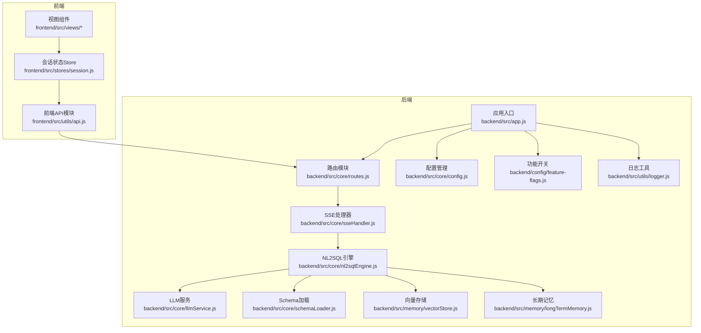
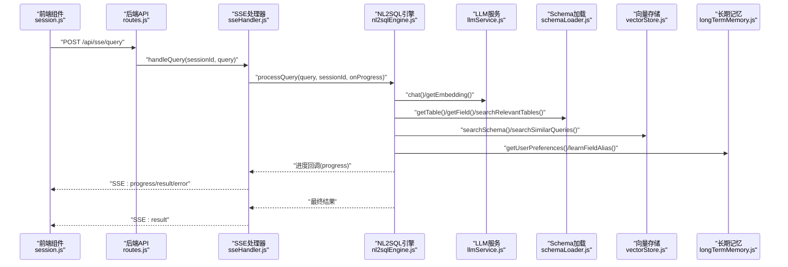
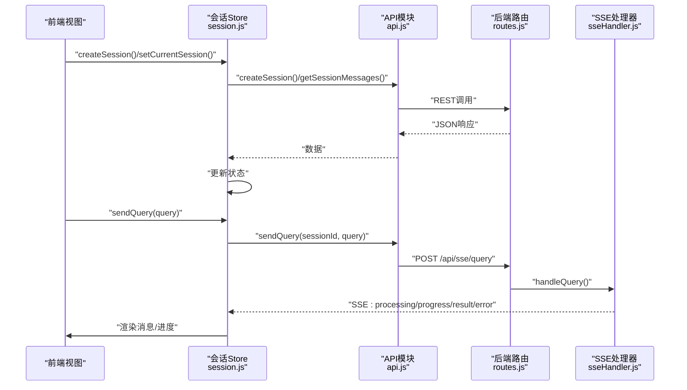
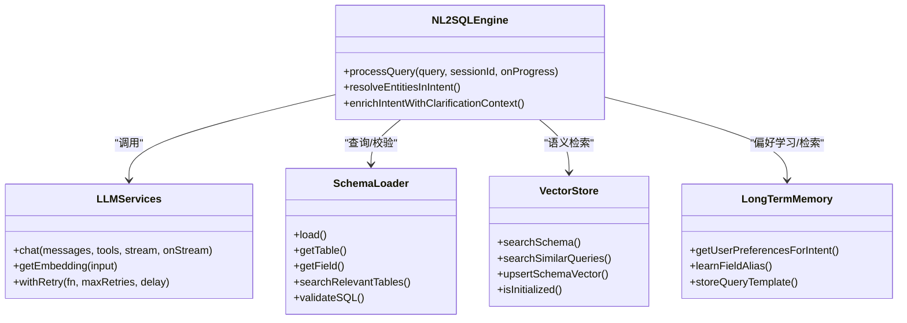
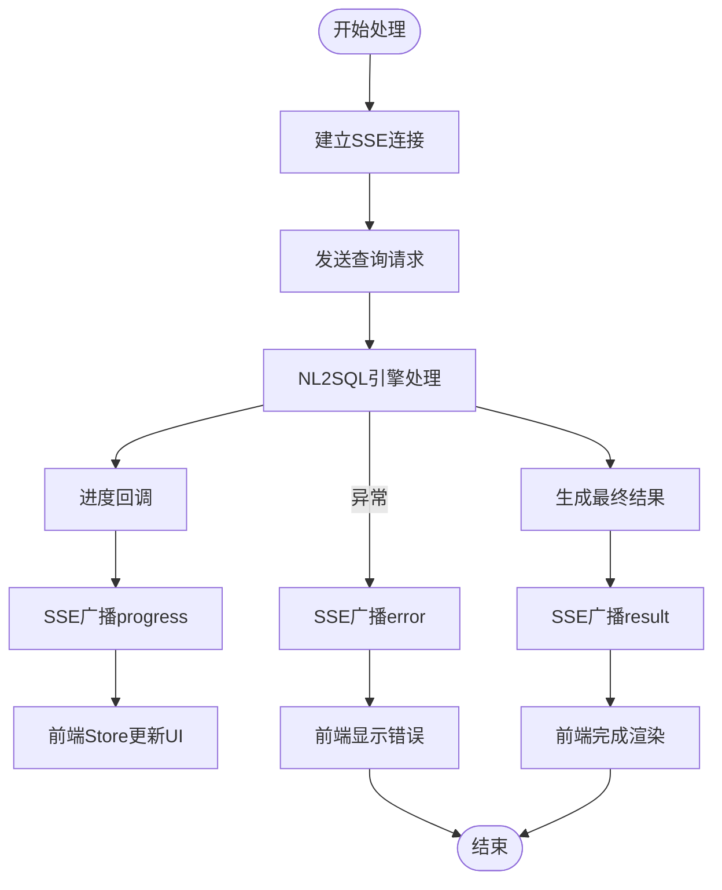
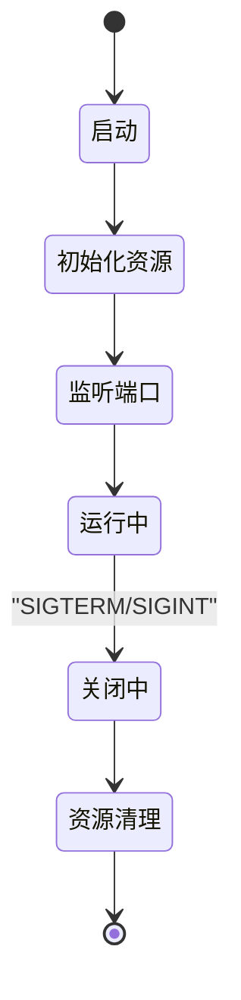
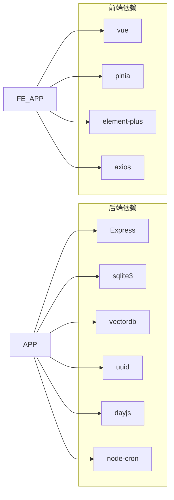

# 组件交互

<cite>
**本文引用的文件**
- [后端入口 app.js](file://backend/src/app.js)
- [路由 routes.js](file://backend/src/core/routes.js)
- [LLM服务 llmService.js](file://backend/src/core/llmService.js)
- [SSE处理器 sseHandler.js](file://backend/src/core/sseHandler.js)
- [NL2SQL引擎 nl2sqlEngine.js](file://backend/src/core/nl2sqlEngine.js)
- [Schema加载 schemaLoader.js](file://backend/src/core/schemaLoader.js)
- [配置 config.js](file://backend/src/core/config.js)
- [功能开关 feature-flags.js](file://backend/config/feature-flags.js)
- [向量存储 vectorStore.js](file://backend/src/memory/vectorStore.js)
- [长期记忆 longTermMemory.js](file://backend/src/memory/longTermMemory.js)
- [日志 logger.js](file://backend/src/utils/logger.js)
- [前端API api.js](file://frontend/src/utils/api.js)
- [前端会话Store session.js](file://frontend/src/stores/session.js)
- [后端包管理 package.json](file://backend/package.json)
- [前端包管理 package.json](file://frontend/package.json)
</cite>

## 目录
1. [简介](#简介)
2. [项目结构](#项目结构)
3. [核心组件](#核心组件)
4. [架构总览](#架构总览)
5. [详细组件分析](#详细组件分析)
6. [依赖关系分析](#依赖关系分析)
7. [性能考量](#性能考量)
8. [故障排查指南](#故障排查指南)
9. [结论](#结论)
10. [附录](#附录)

## 简介
本文件面向NL2SQL系统的组件交互，聚焦前后端协作、核心引擎模块依赖、事件驱动与异步处理、生命周期与资源管理、测试策略与扩展机制。目标是帮助开发者与集成人员快速理解系统如何协同工作，并提供可操作的扩展与集成指导。

## 项目结构
系统采用前后端分离架构：
- 前端（Vue 3 + Pinia）负责用户界面、会话状态与SSE事件订阅。
- 后端（Node.js + Express）提供REST API、SSE流式处理、核心NL2SQL引擎、向量检索与长期记忆等能力。

图表来源
- [后端入口 app.js:1-260](file://backend/src/app.js#L1-L260)
- [路由 routes.js:1-1037](file://backend/src/core/routes.js#L1-L1037)
- [SSE处理器 sseHandler.js:1-349](file://backend/src/core/sseHandler.js#L1-L349)
- [NL2SQL引擎 nl2sqlEngine.js:1-2652](file://backend/src/core/nl2sqlEngine.js#L1-L2652)
- [LLM服务 llmService.js:1-477](file://backend/src/core/llmService.js#L1-L477)
- [Schema加载 schemaLoader.js:1-1172](file://backend/src/core/schemaLoader.js#L1-L1172)
- [向量存储 vectorStore.js:1-881](file://backend/src/memory/vectorStore.js#L1-L881)
- [长期记忆 longTermMemory.js:1-1127](file://backend/src/memory/longTermMemory.js#L1-L1127)
- [配置 config.js:1-398](file://backend/src/core/config.js#L1-L398)
- [功能开关 feature-flags.js:1-249](file://backend/config/feature-flags.js#L1-L249)
- [日志 logger.js:1-442](file://backend/src/utils/logger.js#L1-L442)
- [前端API api.js:1-303](file://frontend/src/utils/api.js#L1-L303)
- [前端会话Store session.js:1-400](file://frontend/src/stores/session.js#L1-L400)

章节来源
- [后端入口 app.js:1-260](file://backend/src/app.js#L1-L260)
- [前端会话Store session.js:1-400](file://frontend/src/stores/session.js#L1-L400)

## 核心组件
- 应用入口与生命周期
  - 负责加载环境变量、初始化数据库/向量库、加载Schema与业务语义层、启动HTTP与SSE、注册优雅关闭钩子。
- 路由与API
  - 提供健康检查、Schema查询、会话管理、查询历史、偏好与评估等REST接口。
- SSE与事件流
  - 管理SSE连接、进度回调、错误广播与并发控制。
- NL2SQL引擎
  - 意图识别、澄清机制、SQL生成、验证与结果格式化；整合LLM、Schema、向量检索与长期记忆。
- LLM服务
  - 统一封装LLM与Embedding调用，含重试、超时与流式响应支持。
- Schema与向量检索
  - Schema元数据加载、校验、向量化与语义搜索；支持智能重排序与过滤。
- 长期记忆
  - 用户偏好抽取、存储与检索，支持LLM智能提炼与分级保留。
- 配置与功能开关
  - 集中配置管理与渐进式功能开关，支持Phase级演进。
- 日志与监控
  - 结构化日志、执行追踪、统计上报与运行时评估。

章节来源
- [后端入口 app.js:93-188](file://backend/src/app.js#L93-L188)
- [路由 routes.js:1-1037](file://backend/src/core/routes.js#L1-L1037)
- [SSE处理器 sseHandler.js:1-349](file://backend/src/core/sseHandler.js#L1-L349)
- [NL2SQL引擎 nl2sqlEngine.js:1-2652](file://backend/src/core/nl2sqlEngine.js#L1-L2652)
- [LLM服务 llmService.js:1-477](file://backend/src/core/llmService.js#L1-L477)
- [Schema加载 schemaLoader.js:1-1172](file://backend/src/core/schemaLoader.js#L1-L1172)
- [向量存储 vectorStore.js:1-881](file://backend/src/memory/vectorStore.js#L1-L881)
- [长期记忆 longTermMemory.js:1-1127](file://backend/src/memory/longTermMemory.js#L1-L1127)
- [配置 config.js:1-398](file://backend/src/core/config.js#L1-L398)
- [功能开关 feature-flags.js:1-249](file://backend/config/feature-flags.js#L1-L249)
- [日志 logger.js:1-442](file://backend/src/utils/logger.js#L1-L442)

## 架构总览
系统采用“前端事件驱动 + 后端工作流引擎”的交互模式：
- 前端通过HTTP API提交查询，同时建立SSE连接以接收流式结果。
- 后端路由将请求转发至SSE处理器，后者调用NL2SQL引擎，引擎按需调用LLM、Schema与向量检索、长期记忆等模块。
- 引擎通过进度回调将中间状态推送给SSE，前端Store统一消费并渲染。

图表来源
- [路由 routes.js:1-1037](file://backend/src/core/routes.js#L1-L1037)
- [SSE处理器 sseHandler.js:218-280](file://backend/src/core/sseHandler.js#L218-L280)
- [NL2SQL引擎 nl2sqlEngine.js:1-2652](file://backend/src/core/nl2sqlEngine.js#L1-L2652)
- [LLM服务 llmService.js:1-477](file://backend/src/core/llmService.js#L1-L477)
- [Schema加载 schemaLoader.js:1-1172](file://backend/src/core/schemaLoader.js#L1-L1172)
- [向量存储 vectorStore.js:1-881](file://backend/src/memory/vectorStore.js#L1-L881)
- [长期记忆 longTermMemory.js:1-1127](file://backend/src/memory/longTermMemory.js#L1-L1127)
- [前端会话Store session.js:185-330](file://frontend/src/stores/session.js#L185-L330)

## 详细组件分析

### 前端组件与后端服务交互
- 会话与消息管理
  - Store负责会话列表、当前会话、消息历史、SSE连接与处理状态。
  - 通过EventSource订阅SSE流，按消息类型更新UI状态。
- API封装
  - 统一HTTP客户端，集中请求/响应拦截与错误处理。
  - 提供Schema、会话、查询历史、评估等API方法。

图表来源
- [前端会话Store session.js:103-330](file://frontend/src/stores/session.js#L103-L330)
- [前端API api.js:1-303](file://frontend/src/utils/api.js#L1-L303)
- [路由 routes.js:1-1037](file://backend/src/core/routes.js#L1-L1037)
- [SSE处理器 sseHandler.js:218-280](file://backend/src/core/sseHandler.js#L218-L280)

章节来源
- [前端会话Store session.js:1-400](file://frontend/src/stores/session.js#L1-L400)
- [前端API api.js:1-303](file://frontend/src/utils/api.js#L1-L303)

### 核心引擎模块依赖与数据共享
- 引擎依赖链
  - 引擎依赖LLM服务进行对话与Embedding；依赖Schema加载进行表/字段解析与相关表检索；依赖向量存储进行语义搜索；依赖长期记忆进行偏好学习与检索。
- 数据共享
  - 引擎通过回调将进度推送到SSE；通过统一错误类进行结构化错误传播；通过配置模块读取运行参数。

图表来源
- [NL2SQL引擎 nl2sqlEngine.js:1-2652](file://backend/src/core/nl2sqlEngine.js#L1-L2652)
- [LLM服务 llmService.js:1-477](file://backend/src/core/llmService.js#L1-L477)
- [Schema加载 schemaLoader.js:1-1172](file://backend/src/core/schemaLoader.js#L1-L1172)
- [向量存储 vectorStore.js:1-881](file://backend/src/memory/vectorStore.js#L1-L881)
- [长期记忆 longTermMemory.js:1-1127](file://backend/src/memory/longTermMemory.js#L1-L1127)

章节来源
- [NL2SQL引擎 nl2sqlEngine.js:1-2652](file://backend/src/core/nl2sqlEngine.js#L1-L2652)
- [LLM服务 llmService.js:1-477](file://backend/src/core/llmService.js#L1-L477)
- [Schema加载 schemaLoader.js:1-1172](file://backend/src/core/schemaLoader.js#L1-L1172)
- [向量存储 vectorStore.js:1-881](file://backend/src/memory/vectorStore.js#L1-L881)
- [长期记忆 longTermMemory.js:1-1127](file://backend/src/memory/longTermMemory.js#L1-L1127)

### 事件驱动架构与异步处理
- SSE事件流
  - SSE处理器维护连接映射，广播进度与结果；支持多标签页连接与并发控制。
- 引擎回调
  - 引擎通过进度回调将中间状态推送到SSE，前端Store统一消费。
- LLM流式响应
  - LLM服务支持流式响应，便于前端实时展示生成过程。

图表来源
- [SSE处理器 sseHandler.js:218-280](file://backend/src/core/sseHandler.js#L218-L280)
- [前端会话Store session.js:227-295](file://frontend/src/stores/session.js#L227-L295)

章节来源
- [SSE处理器 sseHandler.js:1-349](file://backend/src/core/sseHandler.js#L1-L349)
- [前端会话Store session.js:1-400](file://frontend/src/stores/session.js#L1-L400)

### 组件生命周期管理与资源分配
- 启动阶段
  - 初始化数据目录、SQLite与LanceDB向量库、Schema与业务语义层、功能开关、自修复调度器、HTTP与SSE服务。
- 运行阶段
  - SSE连接管理、并发处理控制、进度与错误广播。
- 关闭阶段
  - 优雅关闭：停止接受新连接、关闭SSE、停止定时任务、关闭数据库、退出进程。

图表来源
- [后端入口 app.js:93-188](file://backend/src/app.js#L93-L188)
- [后端入口 app.js:198-234](file://backend/src/app.js#L198-L234)

章节来源
- [后端入口 app.js:1-260](file://backend/src/app.js#L1-L260)

### 组件解耦设计、接口定义与契约管理
- 模块边界
  - 路由层仅做参数校验与转发；SSE层专注连接与广播；引擎层专注业务流程；服务层专注外部调用。
- 接口契约
  - LLM服务：chat/getEmbedding返回结构化响应；withRetry统一重试策略。
  - SSE处理器：handleQuery签名明确，回调函数约定一致。
  - 引擎：processQuery回调签名统一，错误类结构化。
- 配置契约
  - 配置模块集中读取环境变量并提供默认值；功能开关模块统一启用/禁用策略。

章节来源
- [LLM服务 llmService.js:1-477](file://backend/src/core/llmService.js#L1-L477)
- [SSE处理器 sseHandler.js:218-280](file://backend/src/core/sseHandler.js#L218-L280)
- [NL2SQL引擎 nl2sqlEngine.js:1-2652](file://backend/src/core/nl2sqlEngine.js#L1-L2652)
- [配置 config.js:1-398](file://backend/src/core/config.js#L1-L398)
- [功能开关 feature-flags.js:1-249](file://backend/config/feature-flags.js#L1-L249)

### 组件测试策略、Mock机制与集成测试方法
- 单元测试
  - 对LLM服务的重试与超时、SSE处理器的连接与广播、向量存储的增删改查、Schema加载的校验与搜索进行单元测试。
- Mock机制
  - 使用环境变量切换LLM与Embedding端点；对向量存储与数据库进行内存/临时文件替换。
- 集成测试
  - 从前端Store发起完整流程：创建会话、发送查询、接收SSE事件、校验消息与进度。
- 配置驱动测试
  - 通过功能开关与评估配置，控制测试场景与覆盖率。

章节来源
- [LLM服务 llmService.js:1-477](file://backend/src/core/llmService.js#L1-L477)
- [SSE处理器 sseHandler.js:1-349](file://backend/src/core/sseHandler.js#L1-L349)
- [向量存储 vectorStore.js:1-881](file://backend/src/memory/vectorStore.js#L1-L881)
- [Schema加载 schemaLoader.js:1-1172](file://backend/src/core/schemaLoader.js#L1-L1172)
- [前端会话Store session.js:1-400](file://frontend/src/stores/session.js#L1-L400)

### 组件扩展点、插件机制与配置管理
- 插件化能力
  - LLM服务支持任意兼容OpenAI API格式的服务；向量存储可替换为其他向量库（当前为LanceDB）。
- 功能开关
  - 通过功能开关控制Phase级功能启用/禁用，支持快速回滚。
- 配置管理
  - 集中配置与验证，支持运行时日志级别调整与追踪会话管理。

章节来源
- [LLM服务 llmService.js:1-477](file://backend/src/core/llmService.js#L1-L477)
- [功能开关 feature-flags.js:1-249](file://backend/config/feature-flags.js#L1-L249)
- [配置 config.js:1-398](file://backend/src/core/config.js#L1-L398)
- [日志 logger.js:1-442](file://backend/src/utils/logger.js#L1-L442)

## 依赖关系分析
- 外部依赖
  - 后端依赖Express、SQLite、LanceDB、UUID、Day.js、node-cron等；前端依赖Vue、Pinia、Element Plus、Axios等。
- 内部依赖
  - 引擎依赖LLM、Schema、向量存储、长期记忆；路由依赖SSE与评估；入口依赖配置、日志与自修复。

图表来源
- [后端包管理 package.json:1-28](file://backend/package.json#L1-L28)
- [前端包管理 package.json:1-36](file://frontend/package.json#L1-L36)

章节来源
- [后端包管理 package.json:1-28](file://backend/package.json#L1-L28)
- [前端包管理 package.json:1-36](file://frontend/package.json#L1-L36)

## 性能考量
- LLM调用
  - 通过重试与超时控制保障稳定性；合理设置温度与最大Token以平衡质量与速度。
- 向量检索
  - 使用表级向量与智能重排序减少无关表影响；按需过滤与TopK裁剪降低延迟。
- 数据库与缓存
  - SQLite用于会话与偏好；Schema与向量缓存减少重复计算；连接池与超时配置避免阻塞。
- SSE与并发
  - 单会话并发处理控制与多连接支持，避免资源争用。

## 故障排查指南
- 健康检查
  - 通过健康接口与详细健康接口定位数据库、LLM、Schema与SSE状态。
- 日志追踪
  - 使用结构化日志与执行追踪，定位关键步骤耗时与异常。
- 常见问题
  - LLM API密钥或端点配置错误；向量数据库未初始化；Schema配置缺失或格式不正确；SSE连接未建立或被中断。

章节来源
- [路由 routes.js:72-137](file://backend/src/core/routes.js#L72-L137)
- [日志 logger.js:1-442](file://backend/src/utils/logger.js#L1-L442)
- [后端入口 app.js:1-260](file://backend/src/app.js#L1-L260)

## 结论
NL2SQL系统通过清晰的模块边界、事件驱动的SSE流与统一的配置/功能开关，实现了前后端高效协作与可扩展的引擎架构。建议在集成与扩展时遵循接口契约与配置管理规范，利用功能开关与评估体系持续优化体验。

## 附录
- 端点与职责概览
  - 健康检查：/api/health、/api/health/detail
  - Schema：/api/schema、/api/schema/tables/:tableName、/api/schema/search
  - 会话：/api/sessions、/api/sessions/:sessionId、/api/sessions/:sessionId/messages、/api/users/:userId/sessions
  - 偏好：/api/preferences/:userId、/api/preferences/:userId/raw、/api/preferences/:userId/stats、/api/preferences/:userId/templates、/api/preferences/:preferenceId、/api/preferences/:userId/learn-alias
  - 评估：/api/evaluation/stats、/api/evaluation/stats/reset、/api/evaluation/schema-quality、/api/evaluation/query-quality
  - SSE：/api/sse/stream、/api/sse/query

章节来源
- [路由 routes.js:1-1037](file://backend/src/core/routes.js#L1-L1037)