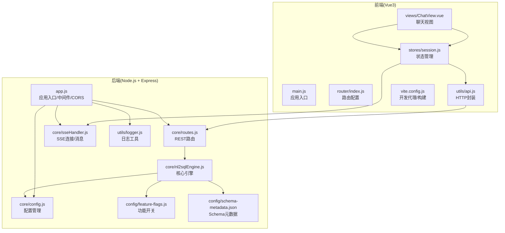
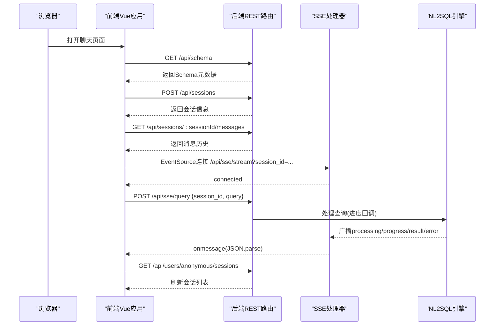
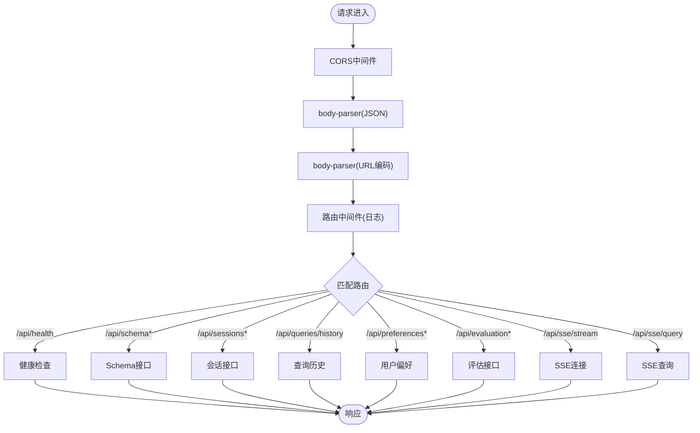
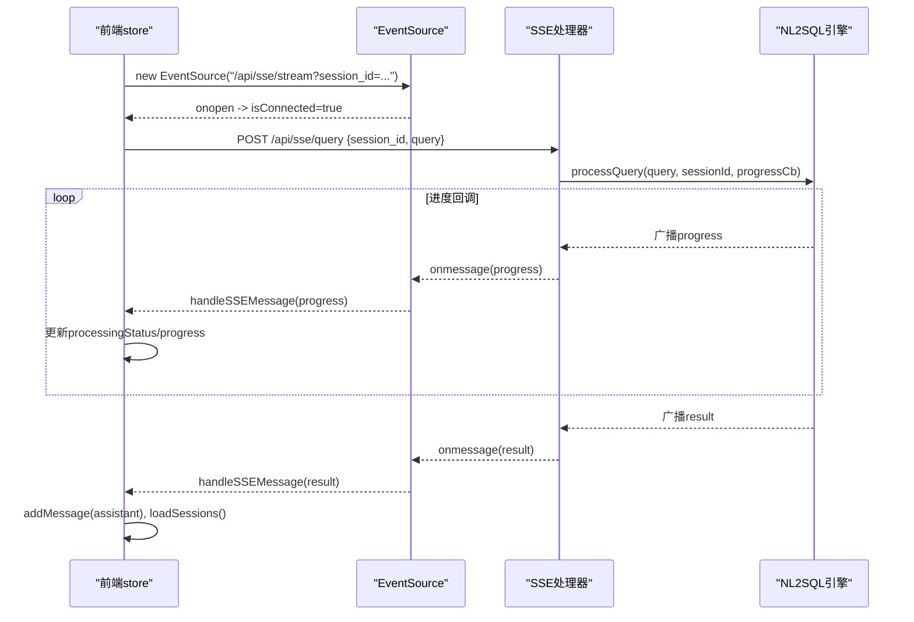
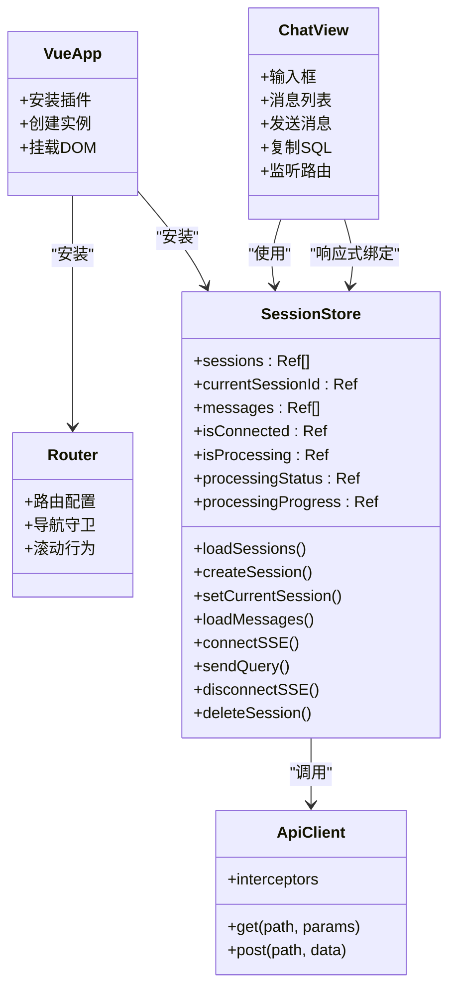
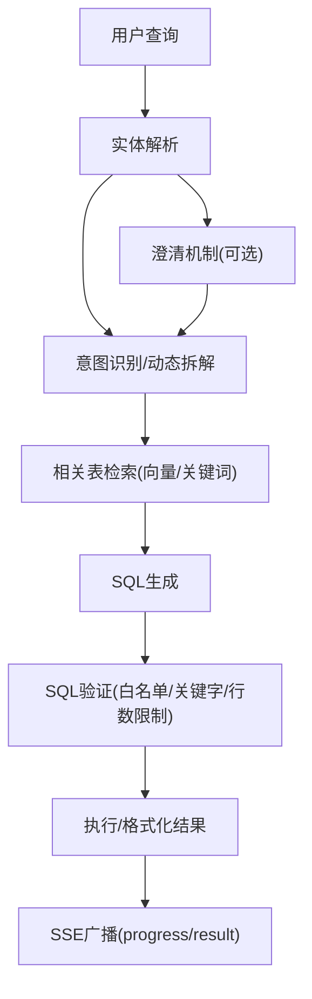
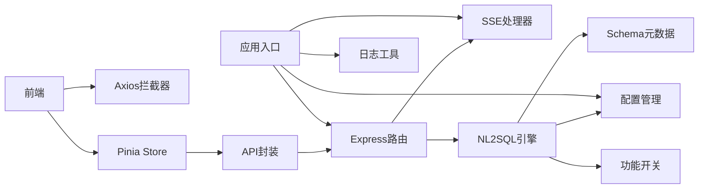

# 组件交互关系

<cite>
**本文档引用的文件**
- [backend/src/app.js](file://backend/src/app.js)
- [backend/src/core/routes.js](file://backend/src/core/routes.js)
- [backend/src/core/sseHandler.js](file://backend/src/core/sseHandler.js)
- [backend/src/core/nl2sqlEngine.js](file://backend/src/core/nl2sqlEngine.js)
- [backend/src/core/config.js](file://backend/src/core/config.js)
- [backend/src/utils/logger.js](file://backend/src/utils/logger.js)
- [backend/src/utils/evaluation.js](file://backend/src/utils/evaluation.js)
- [backend/config/feature-flags.js](file://backend/config/feature-flags.js)
- [backend/config/schema-metadata.json](file://backend/config/schema-metadata.json)
- [frontend/src/main.js](file://frontend/src/main.js)
- [frontend/src/router/index.js](file://frontend/src/router/index.js)
- [frontend/src/stores/session.js](file://frontend/src/stores/session.js)
- [frontend/src/utils/api.js](file://frontend/src/utils/api.js)
- [frontend/src/views/ChatView.vue](file://frontend/src/views/ChatView.vue)
- [frontend/vite.config.js](file://frontend/vite.config.js)
- [backend/package.json](file://backend/package.json)
- [frontend/package.json](file://frontend/package.json)
</cite>

## 目录
1. [简介](#简介)
2. [项目结构](#项目结构)
3. [核心组件](#核心组件)
4. [架构总览](#架构总览)
5. [详细组件分析](#详细组件分析)
6. [依赖关系分析](#依赖关系分析)
7. [性能考虑](#性能考虑)
8. [故障排除指南](#故障排除指南)
9. [结论](#结论)
10. [附录](#附录)

## 简介
本文件面向NL2SQL系统的前后端组件交互关系，系统采用前后端分离架构：前端基于Vue3 + Vite，后端基于Node.js + Express。核心交互模式包括：
- REST API通信：前端通过Axios调用后端REST接口，获取Schema、会话、查询历史、评估统计等。
- Server-Sent Events（SSE）：前端通过EventSource与后端建立持久连接，实时接收查询处理进度和结果。
- 中间件链路：Express中间件负责CORS、请求体解析、路由分发与请求日志。
- 状态管理：前端使用Pinia管理会话、消息、SSE连接状态与处理进度。
- 配置与日志：后端集中配置管理与结构化日志，支持功能开关与运行时统计。

## 项目结构
系统分为前后端两部分，采用独立的构建与运行方式：
- 后端（Node.js + Express）
  - 应用入口：app.js
  - 路由定义：core/routes.js
  - SSE处理：core/sseHandler.js
  - 核心引擎：core/nl2sqlEngine.js
  - 配置管理：core/config.js
  - 日志工具：utils/logger.js
  - 功能开关：config/feature-flags.js
  - Schema元数据：config/schema-metadata.json
- 前端（Vue3 + Vite）
  - 应用入口：main.js
  - 路由配置：router/index.js
  - 状态管理：stores/session.js
  - API封装：utils/api.js
  - 视图组件：views/ChatView.vue
  - 构建配置：vite.config.js

**图表来源**
- [backend/src/app.js:1-266](file://backend/src/app.js#L1-L266)
- [backend/src/core/routes.js:1-800](file://backend/src/core/routes.js#L1-L800)
- [backend/src/core/sseHandler.js:1-349](file://backend/src/core/sseHandler.js#L1-L349)
- [backend/src/core/nl2sqlEngine.js:1-800](file://backend/src/core/nl2sqlEngine.js#L1-L800)
- [backend/src/core/config.js:1-398](file://backend/src/core/config.js#L1-L398)
- [backend/src/utils/logger.js:1-482](file://backend/src/utils/logger.js#L1-L482)
- [backend/config/feature-flags.js:1-249](file://backend/config/feature-flags.js#L1-L249)
- [backend/config/schema-metadata.json:1-200](file://backend/config/schema-metadata.json#L1-L200)
- [frontend/src/main.js:1-89](file://frontend/src/main.js#L1-L89)
- [frontend/src/router/index.js:1-157](file://frontend/src/router/index.js#L1-L157)
- [frontend/src/stores/session.js:1-400](file://frontend/src/stores/session.js#L1-L400)
- [frontend/src/utils/api.js:1-303](file://frontend/src/utils/api.js#L1-L303)
- [frontend/src/views/ChatView.vue:1-778](file://frontend/src/views/ChatView.vue#L1-L778)
- [frontend/vite.config.js:1-93](file://frontend/vite.config.js#L1-L93)

**章节来源**
- [backend/src/app.js:1-266](file://backend/src/app.js#L1-L266)
- [frontend/src/main.js:1-89](file://frontend/src/main.js#L1-L89)

## 核心组件
- 后端应用入口与中间件链
  - app.js负责加载环境变量、初始化数据库与向量库、挂载路由、启动HTTP服务器，并配置CORS与body-parser中间件。
  - 中间件链：CORS -> body-parser(JSON/URL编码) -> 路由分发。
- REST路由模块
  - routes.js定义健康检查、Schema查询、会话管理、查询历史、用户偏好、评估接口等REST端点。
  - 路由中间件：统一请求日志记录。
- SSE处理器
  - sseHandler.js管理SSE连接、消息广播、进度回调与连接清理。
- NL2SQL核心引擎
  - nl2sqlEngine.js实现意图识别、实体解析、SQL生成、验证与结果格式化，并集成澄清机制与功能开关。
- 前端应用入口与路由
  - main.js安装Vue、路由、状态管理与UI库。
  - router/index.js定义页面路由与导航守卫。
- 前端状态管理与API封装
  - stores/session.js管理会话、消息、SSE连接与处理状态。
  - utils/api.js封装Axios实例、请求/响应拦截与API方法。
- 前端视图组件
  - views/ChatView.vue展示消息、渲染Markdown与SQL、处理输入与复制功能。

**章节来源**
- [backend/src/app.js:56-87](file://backend/src/app.js#L56-L87)
- [backend/src/core/routes.js:46-54](file://backend/src/core/routes.js#L46-L54)
- [backend/src/core/sseHandler.js:43-112](file://backend/src/core/sseHandler.js#L43-L112)
- [backend/src/core/nl2sqlEngine.js:1-800](file://backend/src/core/nl2sqlEngine.js#L1-L800)
- [frontend/src/main.js:55-89](file://frontend/src/main.js#L55-L89)
- [frontend/src/router/index.js:118-157](file://frontend/src/router/index.js#L118-L157)
- [frontend/src/stores/session.js:33-399](file://frontend/src/stores/session.js#L33-L399)
- [frontend/src/utils/api.js:25-88](file://frontend/src/utils/api.js#L25-L88)
- [frontend/src/views/ChatView.vue:132-383](file://frontend/src/views/ChatView.vue#L132-L383)

## 架构总览
系统采用“前端SPA + 后端REST + SSE”的交互模式：
- 前端通过Axios调用后端REST接口，获取Schema、会话、历史与评估数据。
- 用户在聊天视图中输入查询，前端通过SSE与后端建立持久连接，实时接收处理进度与最终结果。
- 后端在启动时初始化数据库、向量库与Schema元数据，运行期间通过自修复调度器维护健康状态。

**图表来源**
- [frontend/src/views/ChatView.vue:333-345](file://frontend/src/views/ChatView.vue#L333-L345)
- [frontend/src/stores/session.js:185-221](file://frontend/src/stores/session.js#L185-L221)
- [frontend/src/utils/api.js:246-251](file://frontend/src/utils/api.js#L246-L251)
- [backend/src/core/routes.js:722-800](file://backend/src/core/routes.js#L722-L800)
- [backend/src/core/sseHandler.js:218-280](file://backend/src/core/sseHandler.js#L218-L280)
- [backend/src/core/nl2sqlEngine.js:1-800](file://backend/src/core/nl2sqlEngine.js#L1-L800)

## 详细组件分析

### Express中间件链路与路由分发
- 中间件链
  - CORS：允许跨域访问（开发环境配置为通配）。
  - body-parser：解析JSON与URL编码请求体，限制10MB。
  - 路由中间件：统一记录请求方法、路径、查询参数与IP。
- 路由分发
  - 所有API挂载在 /api 前缀下，包含健康检查、Schema、会话、查询历史、用户偏好、评估等端点。
  - SSE端点：/api/sse/stream（连接）、/api/sse/query（提交查询）。

**图表来源**
- [backend/src/app.js:63-80](file://backend/src/app.js#L63-L80)
- [backend/src/core/routes.js:46-54](file://backend/src/core/routes.js#L46-L54)
- [backend/src/core/routes.js:72-137](file://backend/src/core/routes.js#L72-L137)

**章节来源**
- [backend/src/app.js:63-80](file://backend/src/app.js#L63-L80)
- [backend/src/core/routes.js:46-54](file://backend/src/core/routes.js#L46-L54)

### SSE交互流程与状态同步
- 连接建立
  - 前端通过EventSource连接 /api/sse/stream?session_id=...，后端校验会话并建立SSE连接。
- 查询处理
  - 前端POST /api/sse/query提交查询，后端通过NL2SQL引擎处理并广播进度与结果。
- 状态同步
  - 前端store根据SSE消息更新处理状态、进度与消息列表，并刷新会话列表。

**图表来源**
- [frontend/src/stores/session.js:185-295](file://frontend/src/stores/session.js#L185-L295)
- [backend/src/core/sseHandler.js:43-112](file://backend/src/core/sseHandler.js#L43-L112)
- [backend/src/core/sseHandler.js:218-280](file://backend/src/core/sseHandler.js#L218-L280)

**章节来源**
- [frontend/src/stores/session.js:185-295](file://frontend/src/stores/session.js#L185-L295)
- [backend/src/core/sseHandler.js:43-112](file://backend/src/core/sseHandler.js#L43-L112)

### Vue3前端组件与后端API交互
- 应用入口与插件安装
  - main.js创建Vue应用，安装路由、状态管理与UI库。
- 路由与导航
  - router/index.js定义页面路由与导航守卫，设置页面标题。
- 状态管理
  - stores/session.js封装会话、消息、SSE连接与处理状态，提供创建会话、加载消息、发送查询、连接SSE等动作。
- API封装
  - utils/api.js创建Axios实例，配置baseURL为 /api，设置请求/响应拦截器，导出各类API方法。
- 视图组件
  - views/ChatView.vue渲染消息、Markdown与SQL，处理输入与复制，监听路由参数变化并自动滚动。

**图表来源**
- [frontend/src/main.js:55-89](file://frontend/src/main.js#L55-L89)
- [frontend/src/router/index.js:118-157](file://frontend/src/router/index.js#L118-L157)
- [frontend/src/stores/session.js:33-399](file://frontend/src/stores/session.js#L33-L399)
- [frontend/src/utils/api.js:25-88](file://frontend/src/utils/api.js#L25-L88)
- [frontend/src/views/ChatView.vue:132-383](file://frontend/src/views/ChatView.vue#L132-L383)

**章节来源**
- [frontend/src/main.js:55-89](file://frontend/src/main.js#L55-L89)
- [frontend/src/router/index.js:118-157](file://frontend/src/router/index.js#L118-L157)
- [frontend/src/stores/session.js:33-399](file://frontend/src/stores/session.js#L33-L399)
- [frontend/src/utils/api.js:25-88](file://frontend/src/utils/api.js#L25-L88)
- [frontend/src/views/ChatView.vue:132-383](file://frontend/src/views/ChatView.vue#L132-L383)

### 后端核心引擎与数据传递机制
- 配置管理
  - config.js集中管理LLM、数据库、安全、会话、日志、评估等配置，提供validate方法。
- 日志工具
  - logger.js提供结构化日志、级别控制、文件轮转与执行流程追踪。
- 功能开关
  - feature-flags.js提供渐进式功能开关，支持快速回滚与Phase划分。
- Schema元数据
  - schema-metadata.json提供表、字段、时间粒度等Schema信息，支撑向量检索与SQL生成。
- 引擎处理流程
  - nl2sqlEngine.js实现意图识别、实体解析、SQL生成、验证与结果格式化，并通过SSE广播进度与结果。

**图表来源**
- [backend/src/core/nl2sqlEngine.js:104-151](file://backend/src/core/nl2sqlEngine.js#L104-L151)
- [backend/src/core/nl2sqlEngine.js:311-441](file://backend/src/core/nl2sqlEngine.js#L311-L441)
- [backend/src/core/sseHandler.js:248-279](file://backend/src/core/sseHandler.js#L248-L279)

**章节来源**
- [backend/src/core/config.js:1-398](file://backend/src/core/config.js#L1-L398)
- [backend/src/utils/logger.js:246-322](file://backend/src/utils/logger.js#L246-L322)
- [backend/config/feature-flags.js:108-200](file://backend/config/feature-flags.js#L108-L200)
- [backend/config/schema-metadata.json:1-200](file://backend/config/schema-metadata.json#L1-L200)
- [backend/src/core/nl2sqlEngine.js:104-151](file://backend/src/core/nl2sqlEngine.js#L104-L151)

## 依赖关系分析
- 前端依赖
  - Vue3、Vue Router、Pinia、Element Plus、Axios等，开发代理将 /api 代理至后端3000端口。
- 后端依赖
  - Express、CORS、body-parser、sqlite3、vectordb、dotenv、node-cron等。
- 组件耦合
  - 前端store与API封装松耦合，通过Axios实例与拦截器统一处理。
  - 后端路由与引擎解耦，SSE处理器独立管理连接与广播。

**图表来源**
- [frontend/src/utils/api.js:25-88](file://frontend/src/utils/api.js#L25-L88)
- [frontend/src/stores/session.js:33-399](file://frontend/src/stores/session.js#L33-L399)
- [backend/src/app.js:56-87](file://backend/src/app.js#L56-L87)
- [backend/src/core/routes.js:1-36](file://backend/src/core/routes.js#L1-L36)
- [backend/src/core/sseHandler.js:1-21](file://backend/src/core/sseHandler.js#L1-L21)
- [backend/src/core/nl2sqlEngine.js:1-34](file://backend/src/core/nl2sqlEngine.js#L1-L34)

**章节来源**
- [frontend/package.json:11-28](file://frontend/package.json#L11-L28)
- [backend/package.json:10-23](file://backend/package.json#L10-L23)

## 性能考虑
- 请求体大小限制：body-parser限制为10MB，避免过大请求导致内存压力。
- 查询安全与限制：后端配置禁止DDL/危险关键字、限制最大返回行数与查询超时，防止慢查询与资源滥用。
- SSE连接管理：连接映射与广播机制支持多标签页，连接关闭与错误处理保证稳定性。
- 日志与追踪：结构化日志与执行流程追踪，便于定位性能瓶颈与异常。
- 构建优化：前端Vite配置代码分割，将UI库与核心依赖独立打包，提升加载性能。

**章节来源**
- [backend/src/app.js:69-72](file://backend/src/app.js#L69-L72)
- [backend/src/core/config.js:140-170](file://backend/src/core/config.js#L140-L170)
- [backend/src/utils/logger.js:246-322](file://backend/src/utils/logger.js#L246-L322)
- [frontend/vite.config.js:78-91](file://frontend/vite.config.js#L78-L91)

## 故障排除指南
- CORS跨域问题
  - 开发环境通过Vite代理解决，生产环境需配置具体origin。
- SSE连接失败
  - 检查会话ID有效性、后端SSE连接状态与日志错误。
- 查询处理异常
  - 查看后端日志与SSE错误消息，确认LLM配置、数据库连接与Schema可用性。
- 健康检查
  - 使用 /api/health 与 /api/health/detail 接口检查组件状态。

**章节来源**
- [frontend/vite.config.js:24-35](file://frontend/vite.config.js#L24-L35)
- [backend/src/core/sseHandler.js:48-62](file://backend/src/core/sseHandler.js#L48-L62)
- [backend/src/core/routes.js:72-137](file://backend/src/core/routes.js#L72-L137)

## 结论
NL2SQL系统通过清晰的前后端职责划分与稳定的通信协议实现了高效的自然语言到SQL转换体验。后端以Express为核心，结合SSE实现实时反馈；前端以Vue3与Pinia为基础，提供流畅的交互与状态管理。配置与日志体系保障了系统的可观测性与可维护性，功能开关机制支持渐进式演进与快速回滚。

## 附录
- 开发与部署要点
  - 前端：Vite开发服务器端口5173，代理 /api 至后端3000端口。
  - 后端：NODE_ENV、LLM与数据库配置通过环境变量注入，启动时进行配置验证。
  - Schema元数据：首次启动时加载，支持向量检索与表/字段映射。

**章节来源**
- [frontend/vite.config.js:18-35](file://frontend/vite.config.js#L18-L35)
- [backend/src/app.js:103-108](file://backend/src/app.js#L103-L108)
- [backend/src/core/config.js:366-398](file://backend/src/core/config.js#L366-L398)
- [backend/config/schema-metadata.json:1-200](file://backend/config/schema-metadata.json#L1-L200)