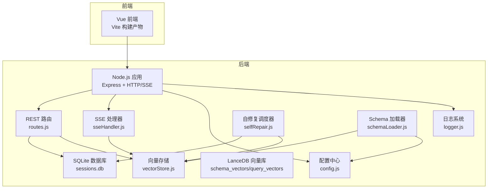
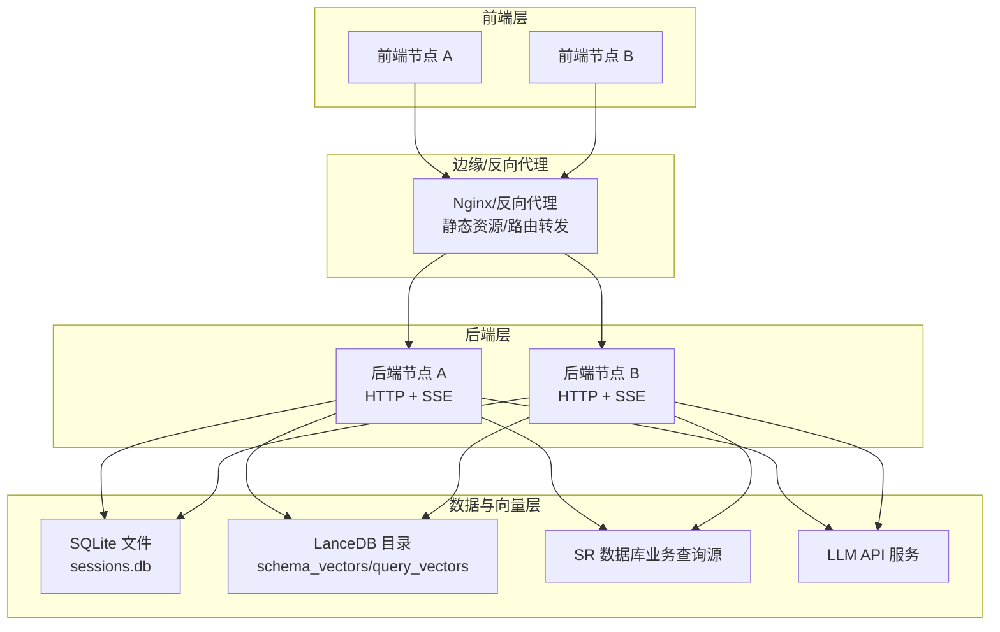
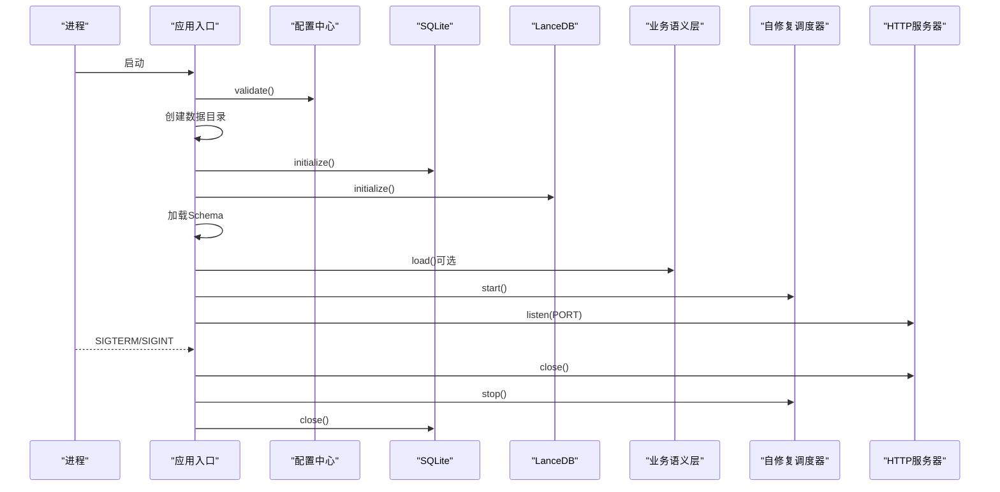
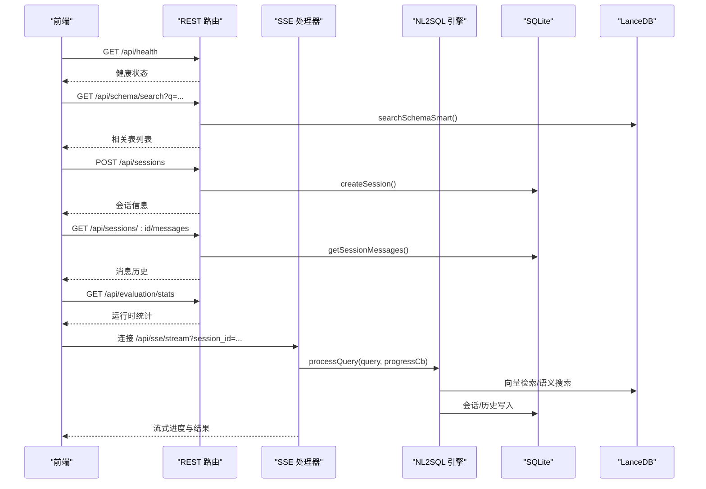
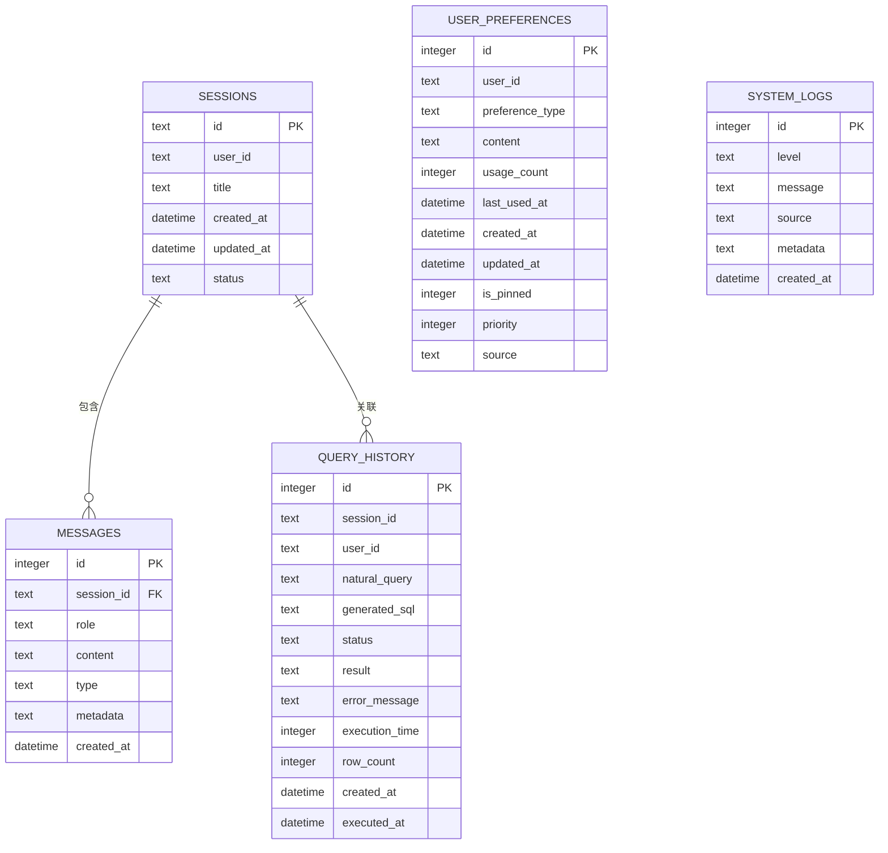
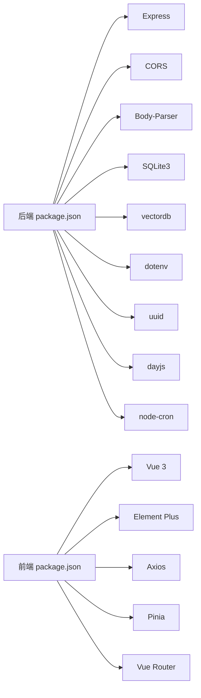

# 部署拓扑

<cite>
**本文引用的文件**
- [backend/package.json](file://backend/package.json)
- [backend/src/app.js](file://backend/src/app.js)
- [backend/src/core/config.js](file://backend/src/core/config.js)
- [backend/src/core/routes.js](file://backend/src/core/routes.js)
- [backend/src/utils/logger.js](file://backend/src/utils/logger.js)
- [backend/src/core/database.js](file://backend/src/core/database.js)
- [backend/src/memory/vectorStore.js](file://backend/src/memory/vectorStore.js)
- [backend/src/core/schemaLoader.js](file://backend/src/core/schemaLoader.js)
- [backend/src/core/selfRepair.js](file://backend/src/core/selfRepair.js)
- [backend/src/core/sseHandler.js](file://backend/src/core/sseHandler.js)
- [backend/config/business-semantic-layer.json](file://backend/config/business-semantic-layer.json)
- [backend/config/feature-flags.js](file://backend/config/feature-flags.js)
- [frontend/package.json](file://frontend/package.json)
</cite>

## 目录
1. [简介](#简介)
2. [项目结构](#项目结构)
3. [核心组件](#核心组件)
4. [架构总览](#架构总览)
5. [详细组件分析](#详细组件分析)
6. [依赖关系分析](#依赖关系分析)
7. [性能考虑](#性能考虑)
8. [故障排查指南](#故障排查指南)
9. [结论](#结论)
10. [附录](#附录)

## 简介
本文件面向NL2SQL系统的运维与平台工程团队，提供一套完整的部署拓扑文档。内容涵盖系统架构、服务器角色分配、网络拓扑、单机与分布式部署差异、负载均衡与高可用设计、容器化与服务编排、数据库与向量数据库部署、监控与日志、以及安全加固与访问控制实践。目标是在保证功能完整性的同时，给出可落地的部署与运维方案。

## 项目结构
NL2SQL采用前后端分离架构：
- 后端（Node.js + Express）：提供REST API、SSE流式处理、Schema与向量检索、会话与查询历史管理、自修复与健康检查。
- 前端（Vue 3 + Vite）：提供Web交互界面，调用后端API与SSE端点。
- 数据与向量存储：本地SQLite（会话与查询历史）、LanceDB（Schema与查询历史向量）。

图表来源
- [backend/src/app.js:1-266](file://backend/src/app.js#L1-L266)
- [backend/src/core/routes.js:1-800](file://backend/src/core/routes.js#L1-L800)
- [backend/src/core/config.js:1-398](file://backend/src/core/config.js#L1-L398)
- [backend/src/utils/logger.js:1-482](file://backend/src/utils/logger.js#L1-L482)
- [backend/src/core/database.js:1-1016](file://backend/src/core/database.js#L1-L1016)
- [backend/src/memory/vectorStore.js:1-948](file://backend/src/memory/vectorStore.js#L1-L948)
- [backend/src/core/schemaLoader.js:1-1235](file://backend/src/core/schemaLoader.js#L1-L1235)
- [backend/src/core/selfRepair.js:1-489](file://backend/src/core/selfRepair.js#L1-L489)
- [backend/src/core/sseHandler.js:1-349](file://backend/src/core/sseHandler.js#L1-L349)

章节来源
- [backend/src/app.js:1-266](file://backend/src/app.js#L1-L266)
- [backend/src/core/config.js:1-398](file://backend/src/core/config.js#L1-L398)
- [backend/src/core/routes.js:1-800](file://backend/src/core/routes.js#L1-L800)
- [backend/src/utils/logger.js:1-482](file://backend/src/utils/logger.js#L1-L482)
- [backend/src/core/database.js:1-1016](file://backend/src/core/database.js#L1-L1016)
- [backend/src/memory/vectorStore.js:1-948](file://backend/src/memory/vectorStore.js#L1-L948)
- [backend/src/core/schemaLoader.js:1-1235](file://backend/src/core/schemaLoader.js#L1-L1235)
- [backend/src/core/selfRepair.js:1-489](file://backend/src/core/selfRepair.js#L1-L489)
- [backend/src/core/sseHandler.js:1-349](file://backend/src/core/sseHandler.js#L1-L349)

## 核心组件
- 应用入口与生命周期：负责加载环境变量、初始化数据库与向量库、挂载路由、启动HTTP与SSE、优雅关闭。
- 配置中心：集中管理端口、LLM/Embedding、数据库、安全、日志、Schema、长期记忆、上下文管理、评估等配置，并提供校验。
- REST路由：提供健康检查、Schema查询、会话管理、查询历史、用户偏好、评估统计等API。
- SSE处理器：管理SSE连接、流式发送进度与结果、广播消息。
- 数据库：SQLite会话与查询历史存储，提供事务、迁移与清理。
- 向量存储：LanceDB向量表（schema_vectors、query_vectors），提供向量增删改查与智能搜索。
- Schema加载器：加载业务Schema元数据，构建映射与索引，支持向量化与语义搜索。
- 自修复调度器：定时任务（每日自检、会话清理、统计收集、记忆维护）。
- 日志系统：统一日志格式、文件轮转、结构化输出、追踪上下文。

章节来源
- [backend/src/app.js:93-194](file://backend/src/app.js#L93-L194)
- [backend/src/core/config.js:16-398](file://backend/src/core/config.js#L16-L398)
- [backend/src/core/routes.js:60-137](file://backend/src/core/routes.js#L60-L137)
- [backend/src/core/sseHandler.js:43-112](file://backend/src/core/sseHandler.js#L43-L112)
- [backend/src/core/database.js:206-267](file://backend/src/core/database.js#L206-L267)
- [backend/src/memory/vectorStore.js:233-263](file://backend/src/memory/vectorStore.js#L233-L263)
- [backend/src/core/schemaLoader.js:75-131](file://backend/src/core/schemaLoader.js#L75-L131)
- [backend/src/core/selfRepair.js:60-125](file://backend/src/core/selfRepair.js#L60-L125)
- [backend/src/utils/logger.js:54-482](file://backend/src/utils/logger.js#L54-L482)

## 架构总览
NL2SQL的部署拓扑分为单机与分布式两种形态，均以“前端-后端-数据/向量存储”三层为主，结合外部SR数据库（业务查询源）与LLM服务（可选）。

图表来源
- [backend/src/app.js:175-186](file://backend/src/app.js#L175-L186)
- [backend/src/core/config.js:97-130](file://backend/src/core/config.js#L97-L130)
- [backend/src/core/config.js:60-87](file://backend/src/core/config.js#L60-L87)
- [backend/src/core/routes.js:60-137](file://backend/src/core/routes.js#L60-L137)

## 详细组件分析

### 应用入口与生命周期
- 初始化顺序：配置校验 → 数据目录创建 → SQLite初始化 → LanceDB初始化 → Schema加载 → 业务语义层加载（可选） → 功能开关打印 → 自修复调度器启动 → HTTP服务器启动。
- 优雅关闭：关闭HTTP服务器、SSE连接、定时任务、数据库连接，确保资源回收。
- 进程信号：监听SIGTERM/SIGINT，未处理Promise拒绝与未捕获异常均有日志与优雅关闭。

图表来源
- [backend/src/app.js:97-194](file://backend/src/app.js#L97-L194)
- [backend/src/core/config.js:366-398](file://backend/src/core/config.js#L366-L398)
- [backend/src/core/database.js:206-267](file://backend/src/core/database.js#L206-L267)
- [backend/src/memory/vectorStore.js:233-263](file://backend/src/memory/vectorStore.js#L233-L263)
- [backend/src/core/selfRepair.js:60-125](file://backend/src/core/selfRepair.js#L60-L125)

章节来源
- [backend/src/app.js:93-194](file://backend/src/app.js#L93-L194)

### 配置中心与环境变量
- 服务器与运行环境：端口、NODE_ENV、开发/生产特性切换。
- LLM与Embedding：API Base、Key、Model、超时、重试。
- 数据库：SQLite路径、SR数据库URL与连接池、LanceDB路径。
- 安全：白名单表、Dry Run、最大返回行数、查询超时、禁止关键字、敏感字段脱敏。
- 日志：级别、文件路径、控制台/文件输出、轮转大小与数量。
- 自修复：启用、Cron表达式、会话检查间隔、慢查询阈值。
- Schema：配置文件路径、缓存、强制重向量化。
- 长期记忆与上下文：启用开关、阈值、保留策略、Token预算与摘要。
- 评估：启用、统计跟踪、阈值。

章节来源
- [backend/src/core/config.js:16-398](file://backend/src/core/config.js#L16-L398)

### REST路由与SSE
- 健康检查：/api/health（基础）、/api/health/detail（组件状态）。
- Schema：/api/schema、/api/schema/tables/:tableName、/api/schema/search。
- 会话与历史：/api/sessions、/api/sessions/:sessionId、/api/sessions/:sessionId/messages、/api/users/:userId/sessions。
- 用户偏好与记忆：/api/preferences/:userId/raw、/api/preferences/:userId/stats、/api/preferences/:userId、/api/preferences/:userId/templates、/api/preferences/:userId/learn-alias、/api/preferences/:preferenceId。
- 评估：/api/evaluation/stats、/api/evaluation/stats/reset、/api/evaluation/schema-quality。
- SSE：/api/sse/stream（连接管理与进度/结果广播）。

图表来源
- [backend/src/core/routes.js:60-137](file://backend/src/core/routes.js#L60-L137)
- [backend/src/core/routes.js:143-250](file://backend/src/core/routes.js#L143-L250)
- [backend/src/core/routes.js:256-398](file://backend/src/core/routes.js#L256-L398)
- [backend/src/core/routes.js:403-760](file://backend/src/core/routes.js#L403-L760)
- [backend/src/core/routes.js:762-800](file://backend/src/core/routes.js#L762-L800)
- [backend/src/core/sseHandler.js:218-280](file://backend/src/core/sseHandler.js#L218-L280)
- [backend/src/memory/vectorStore.js:452-576](file://backend/src/memory/vectorStore.js#L452-L576)
- [backend/src/core/database.js:526-608](file://backend/src/core/database.js#L526-L608)

章节来源
- [backend/src/core/routes.js:1-800](file://backend/src/core/routes.js#L1-L800)
- [backend/src/core/sseHandler.js:1-349](file://backend/src/core/sseHandler.js#L1-L349)
- [backend/src/memory/vectorStore.js:1-948](file://backend/src/memory/vectorStore.js#L1-L948)
- [backend/src/core/database.js:1-1016](file://backend/src/core/database.js#L1-L1016)

### 数据库与向量存储
- SQLite：会话、消息、查询历史、用户偏好、系统日志；外键约束、索引、迁移与事务。
- LanceDB：schema_vectors（表级向量）、query_vectors（查询历史向量）；智能搜索与重排序、统计查询。

图表来源
- [backend/src/core/database.js:39-195](file://backend/src/core/database.js#L39-L195)
- [backend/src/core/database.js:429-492](file://backend/src/core/database.js#L429-L492)

章节来源
- [backend/src/core/database.js:1-1016](file://backend/src/core/database.js#L1-L1016)
- [backend/src/memory/vectorStore.js:1-948](file://backend/src/memory/vectorStore.js#L1-L948)

### Schema加载与向量检索
- 加载：从JSON配置文件读取，构建表/字段映射、动态游戏名索引、缓存时间戳。
- 向量化：表级向量（增量更新），元数据包含域、数据类型、关键特征词。
- 智能搜索：基于查询意图识别与重排序，支持按数据源与游戏平台过滤。

章节来源
- [backend/src/core/schemaLoader.js:75-131](file://backend/src/core/schemaLoader.js#L75-L131)
- [backend/src/core/schemaLoader.js:210-285](file://backend/src/core/schemaLoader.js#L210-L285)
- [backend/src/core/schemaLoader.js:571-710](file://backend/src/core/schemaLoader.js#L571-L710)
- [backend/src/memory/vectorStore.js:452-576](file://backend/src/memory/vectorStore.js#L452-L576)

### 自修复与健康检查
- 定时任务：每日自检（数据库、向量库、查询统计、连接数、系统资源）、会话清理、统计收集、记忆维护。
- 健康报告：失败率、慢查询、内存使用率等指标汇总并落库。

章节来源
- [backend/src/core/selfRepair.js:60-125](file://backend/src/core/selfRepair.js#L60-L125)
- [backend/src/core/selfRepair.js:169-310](file://backend/src/core/selfRepair.js#L169-L310)
- [backend/src/core/selfRepair.js:341-373](file://backend/src/core/selfRepair.js#L341-L373)
- [backend/src/core/selfRepair.js:383-415](file://backend/src/core/selfRepair.js#L383-L415)

### 日志系统
- 统一日志格式、级别、控制台/文件输出、文件轮转（大小与数量）。
- 追踪上下文：trace/traceStep/endTrace，支持按traceId聚合流程日志。

章节来源
- [backend/src/utils/logger.js:54-482](file://backend/src/utils/logger.js#L54-L482)

## 依赖关系分析
- 后端依赖：Express、CORS、body-parser、sqlite3、vectordb、dotenv、uuid、dayjs、node-cron。
- 前端依赖：Vue 3、Element Plus、Axios、Pinia、Vue Router、ECharts等。
- 配置与模块耦合：config.js集中提供配置，routes.js依赖config、database、sseHandler、evaluation等；sseHandler依赖nl2sqlEngine与database；schemaLoader依赖llmService与vectorStore。

图表来源
- [backend/package.json:10-26](file://backend/package.json#L10-L26)
- [frontend/package.json:11-28](file://frontend/package.json#L11-L28)

章节来源
- [backend/package.json:1-28](file://backend/package.json#L1-L28)
- [frontend/package.json:1-36](file://frontend/package.json#L1-L36)

## 性能考虑
- 连接池与超时：SR数据库连接池（min/max/acquire/idle）与查询超时、LLM/Embedding超时配置。
- 查询限制：最大返回行数、禁止关键字、白名单表、Dry Run。
- 向量检索：topK、智能搜索与过滤、向量维度与索引。
- 日志轮转：文件大小与保留数量，避免磁盘膨胀。
- SSE：禁用Nginx缓冲，保障实时性。
- 自修复：慢查询阈值、定期清理与压缩，维持系统健康。

章节来源
- [backend/src/core/config.js:97-130](file://backend/src/core/config.js#L97-L130)
- [backend/src/core/config.js:140-170](file://backend/src/core/config.js#L140-L170)
- [backend/src/core/config.js:219-231](file://backend/src/core/config.js#L219-L231)
- [backend/src/utils/logger.js:147-179](file://backend/src/utils/logger.js#L147-L179)
- [backend/src/core/sseHandler.js:64-70](file://backend/src/core/sseHandler.js#L64-L70)
- [backend/src/memory/vectorStore.js:452-576](file://backend/src/memory/vectorStore.js#L452-L576)

## 故障排查指南
- 健康检查：优先查看/health与/health/detail，定位数据库、向量库、Schema、SSE连接状态。
- 日志定位：根据traceId串联日志，关注ERROR/WARN级别；检查日志文件轮转与权限。
- 数据库问题：确认SQLite文件路径与权限、外键约束、迁移是否成功。
- 向量库问题：确认LanceDB目录可写、表初始化、向量统计与智能搜索是否可用。
- 查询失败：检查白名单、禁止关键字、超时与行数限制；核对SR数据库URL与连接池。
- SSE异常：确认会话存在、连接参数、Nginx缓冲设置；观察连接数与活跃度。

章节来源
- [backend/src/core/routes.js:60-137](file://backend/src/core/routes.js#L60-L137)
- [backend/src/utils/logger.js:312-322](file://backend/src/utils/logger.js#L312-L322)
- [backend/src/core/database.js:206-267](file://backend/src/core/database.js#L206-L267)
- [backend/src/memory/vectorStore.js:233-263](file://backend/src/memory/vectorStore.js#L233-L263)
- [backend/src/core/sseHandler.js:43-112](file://backend/src/core/sseHandler.js#L43-L112)

## 结论
NL2SQL的部署拓扑以“前端-后端-数据/向量存储”为核心，结合外部SR数据库与LLM服务，形成可扩展的单机与分布式架构。通过严格的配置中心、健康检查、自修复与日志体系，系统具备良好的可观测性与可维护性。建议在生产环境中采用反向代理、负载均衡与容器编排，配合数据库与向量库的持久化与备份策略，确保高可用与高性能。

## 附录

### 单机部署与分布式部署差异
- 单机部署
  - 前端静态文件由Nginx提供，后端单实例监听固定端口，SQLite与LanceDB目录位于本地磁盘。
  - 适合开发、测试与小规模生产。
- 分布式部署
  - 前端多节点，后端多实例，通过Nginx或LB做请求分发；共享SR数据库；向量库可本地或共享存储（需注意并发写入）。
  - 建议启用自修复与健康检查，配置慢查询与连接池阈值，确保稳定性。

章节来源
- [backend/src/app.js:175-186](file://backend/src/app.js#L175-L186)
- [backend/src/core/config.js:97-130](file://backend/src/core/config.js#L97-L130)

### 负载均衡与高可用设计
- 前端：多实例部署，静态资源缓存与CDN。
- 后端：Nginx/HAProxy/LB，健康检查（/api/health），会话亲和或无状态设计，SSE连接需注意粘性会话或外部会话同步。
- 数据：SQLite适用于单实例；分布式场景建议替换为MySQL/PostgreSQL；LanceDB目录需共享或复制策略。
- SR数据库：高可用集群（主从/副本），连接池参数需与后端实例数匹配。

章节来源
- [backend/src/core/routes.js:60-137](file://backend/src/core/routes.js#L60-L137)
- [backend/src/core/config.js:115-130](file://backend/src/core/config.js#L115-L130)

### 容器化部署与服务编排
- 镜像构建
  - 基于Node.js官方镜像，安装依赖后构建前端（Vite）产物，后端打包发布。
  - 环境变量通过配置文件或Kubernetes ConfigMap/Secret注入。
- 服务编排
  - 前端：Deployment + Service + Ingress/Nginx。
  - 后端：Deployment + Service，暴露HTTP与SSE端点，注意Nginx缓冲禁用。
  - 数据：StatefulSet + PVC（SQLite文件或共享卷）；向量库同上。
  - SR数据库：外部托管或内置数据库服务。
- 资源限制
  - CPU/内存requests/limits，日志轮转与持久化，健康探针与优雅关闭。

章节来源
- [backend/package.json:6-8](file://backend/package.json#L6-L8)
- [frontend/package.json:6-9](file://frontend/package.json#L6-L9)
- [backend/src/app.js:242-258](file://backend/src/app.js#L242-L258)

### 数据库集群、向量数据库与缓存部署
- SQLite：单机文件，适合小规模；分布式需共享存储或迁移至MySQL/PostgreSQL。
- LanceDB：本地目录，支持共享存储；注意并发写入与一致性；可定期备份。
- 缓存：系统未内置缓存组件；如需可引入Redis/Memcached，用于会话状态或热点数据（需评估收益与复杂度）。

章节来源
- [backend/src/core/database.js:206-267](file://backend/src/core/database.js#L206-L267)
- [backend/src/memory/vectorStore.js:233-263](file://backend/src/memory/vectorStore.js#L233-L263)

### 监控告警、日志收集与性能监控
- 健康检查：/api/health与/health/detail，自修复每日自检报告。
- 日志：统一格式、文件轮转、结构化元数据；trace上下文支持端到端追踪。
- 性能：慢查询阈值、连接数统计、内存使用率、查询成功率与失败率。
- 建议：Prometheus + Grafana + Loki/ELK，结合SSE连接数与查询耗时指标。

章节来源
- [backend/src/core/routes.js:60-137](file://backend/src/core/routes.js#L60-L137)
- [backend/src/core/selfRepair.js:169-310](file://backend/src/core/selfRepair.js#L169-L310)
- [backend/src/utils/logger.js:54-482](file://backend/src/utils/logger.js#L54-L482)

### 安全加固、防火墙与访问控制
- CORS：开发环境允许*，生产需限定来源。
- 白名单表与禁止关键字：防止误用与注入风险。
- 查询超时与行数限制：防抖与资源占用。
- TLS/HTTPS：反向代理启用，证书管理。
- 防火墙：仅开放反向代理端口，后端与数据库内网访问。
- 认证与授权：前端令牌与后端API鉴权（如需），SSE连接参数校验。

章节来源
- [backend/src/app.js:63-72](file://backend/src/app.js#L63-L72)
- [backend/src/core/config.js:140-170](file://backend/src/core/config.js#L140-L170)