# 集成模式

<cite>
**本文引用的文件**
- [app.js](file://backend/src/app.js)
- [config.js](file://backend/src/core/config.js)
- [llmService.js](file://backend/src/core/llmService.js)
- [logger.js](file://backend/src/utils/logger.js)
- [routes.js](file://backend/src/core/routes.js)
- [database.js](file://backend/src/core/database.js)
- [vectorStore.js](file://backend/src/memory/vectorStore.js)
- [selfRepair.js](file://backend/src/core/selfRepair.js)
- [sseHandler.js](file://backend/src/core/sseHandler.js)
- [longTermMemory.js](file://backend/src/memory/longTermMemory.js)
- [evaluation.js](file://backend/src/utils/evaluation.js)
- [package.json](file://backend/package.json)
</cite>

## 目录
1. [简介](#简介)
2. [项目结构](#项目结构)
3. [核心组件](#核心组件)
4. [架构总览](#架构总览)
5. [详细组件分析](#详细组件分析)
6. [依赖分析](#依赖分析)
7. [性能考量](#性能考量)
8. [故障排查指南](#故障排查指南)
9. [结论](#结论)
10. [附录](#附录)

## 简介
本文件面向 NL2SQL 系统的集成模式，聚焦系统与外部服务（LLM、第三方 API、数据库、向量数据库）的对接方式，以及配置管理、日志与监控、错误处理与降级策略、服务发现与负载均衡等主题。文档采用渐进式结构，既适合初学者快速了解系统，也提供深入的技术细节与可视化图表。

## 项目结构
后端采用 Node.js + Express 架构，核心模块围绕“配置中心”“日志中心”“路由与服务编排”“数据与向量存储”展开，形成清晰的分层与职责边界：

- 启动入口：负责环境变量加载、模块初始化、HTTP 与 SSE 服务启动、优雅停机
- 配置中心：集中管理 LLM、数据库、安全、日志、Schema、长期记忆、上下文管理等配置
- 日志中心：统一日志格式、级别、输出目标与追踪能力
- 路由与服务：REST API、SSE 流式交互、健康检查、评估接口
- 数据与向量：SQLite 会话与历史、LanceDB 向量存储、Schema 与查询历史向量化
- 自修复：定时任务、会话清理、统计收集、记忆维护
- 长期记忆：用户偏好抽取与存储、字段别名学习、查询模式与指标/维度偏好
- 评估：向量化质量与记忆命中率统计

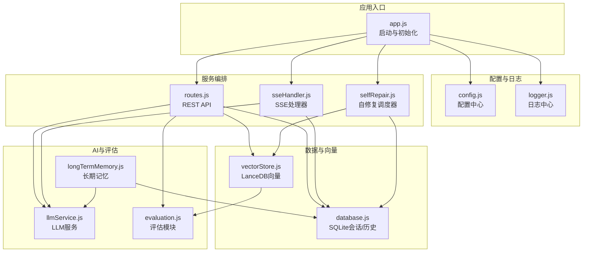

**图表来源**
- [app.js:1-238](file://backend/src/app.js#L1-L238)
- [config.js:1-398](file://backend/src/core/config.js#L1-L398)
- [logger.js:1-442](file://backend/src/utils/logger.js#L1-L442)
- [routes.js:1-800](file://backend/src/core/routes.js#L1-L800)
- [database.js:1-850](file://backend/src/core/database.js#L1-L850)
- [vectorStore.js:1-759](file://backend/src/memory/vectorStore.js#L1-L759)
- [llmService.js:1-468](file://backend/src/core/llmService.js#L1-L468)
- [evaluation.js:1-488](file://backend/src/utils/evaluation.js#L1-L488)
- [longTermMemory.js:1-1141](file://backend/src/memory/longTermMemory.js#L1-L1141)
- [selfRepair.js:1-489](file://backend/src/core/selfRepair.js#L1-L489)

**章节来源**
- [app.js:1-238](file://backend/src/app.js#L1-L238)
- [package.json:1-28](file://backend/package.json#L1-L28)

## 核心组件
- 配置中心：统一从环境变量读取并校验关键配置，提供运行时开关与阈值
- LLM 服务：封装 HTTP 请求、重试、超时、流式响应与日志
- 日志中心：结构化日志、文件轮转、级别控制、执行追踪
- 路由与 SSE：REST API、SSE 流式交互、健康检查、评估接口
- 数据与向量：SQLite 会话/历史持久化、LanceDB 向量检索与智能排序
- 自修复：定时任务、会话清理、统计收集、记忆维护
- 长期记忆：偏好抽取、字段别名学习、查询模式与指标/维度偏好
- 评估：向量化质量评估、记忆命中率统计

**章节来源**
- [config.js:1-398](file://backend/src/core/config.js#L1-L398)
- [llmService.js:1-468](file://backend/src/core/llmService.js#L1-L468)
- [logger.js:1-442](file://backend/src/utils/logger.js#L1-L442)
- [routes.js:1-800](file://backend/src/core/routes.js#L1-L800)
- [database.js:1-850](file://backend/src/core/database.js#L1-L850)
- [vectorStore.js:1-759](file://backend/src/memory/vectorStore.js#L1-L759)
- [selfRepair.js:1-489](file://backend/src/core/selfRepair.js#L1-L489)
- [longTermMemory.js:1-1141](file://backend/src/memory/longTermMemory.js#L1-L1141)
- [evaluation.js:1-488](file://backend/src/utils/evaluation.js#L1-L488)

## 架构总览
系统采用“配置驱动 + 模块化”的解耦设计，通过依赖注入与模块导出实现松耦合。外部集成点包括：
- LLM 服务：统一的 OpenAI 兼容 API 调用，支持重试与超时
- 第三方 API：通过路由暴露健康检查、Schema 查询、会话管理、评估接口
- 数据库：SQLite 用于会话与历史，LanceDB 用于向量检索
- 日志与监控：统一日志、运行时统计、评估报告

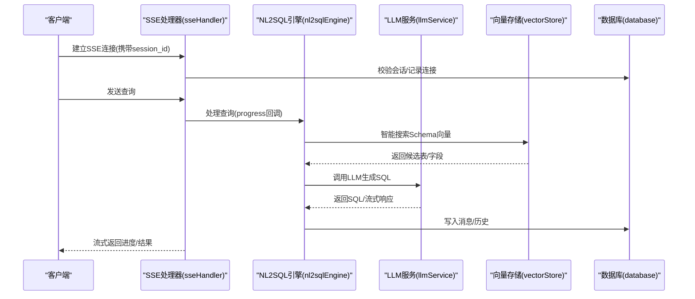

**图表来源**
- [sseHandler.js:1-349](file://backend/src/core/sseHandler.js#L1-L349)
- [longTermMemory.js:1-1141](file://backend/src/memory/longTermMemory.js#L1-L1141)
- [vectorStore.js:1-759](file://backend/src/memory/vectorStore.js#L1-L759)
- [llmService.js:1-468](file://backend/src/core/llmService.js#L1-L468)
- [database.js:1-850](file://backend/src/core/database.js#L1-L850)

## 详细组件分析

### 配置管理与环境变量处理
- 集中式配置：统一从环境变量读取，提供默认值与运行时校验
- 关键项：LLM API 基础地址、密钥、模型、超时；Embedding 维度与超时；数据库路径；安全白名单、行数限制、超时；日志级别与文件；Schema 缓存与重新向量化；长期记忆阈值与保留策略；上下文管理与评估开关
- 校验：启动时验证必要配置（如 LLM API Key、SR 数据库 URL）

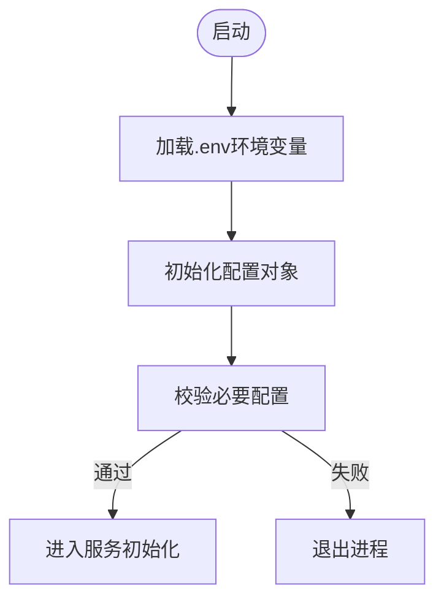

**图表来源**
- [app.js:97-166](file://backend/src/app.js#L97-L166)
- [config.js:366-397](file://backend/src/core/config.js#L366-L397)

**章节来源**
- [config.js:1-398](file://backend/src/core/config.js#L1-L398)
- [app.js:1-238](file://backend/src/app.js#L1-L238)

### LLM 服务集成与第三方 API 调用
- 统一封装：HTTP(S) 请求、JSON 解析、超时与错误处理、重试机制
- OpenAI 兼容：支持 chat/completions 与 embeddings 端点，统一鉴权头
- 流式响应：SSE 场景下的流式数据拼接与异常终止检测
- 超时与重试：可配置超时与最大重试次数，避免长尾阻塞

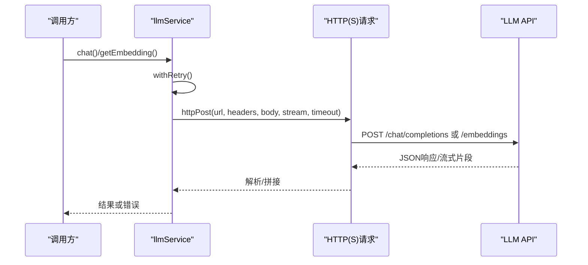

**图表来源**
- [llmService.js:1-468](file://backend/src/core/llmService.js#L1-L468)

**章节来源**
- [llmService.js:1-468](file://backend/src/core/llmService.js#L1-L468)

### 日志系统集成与追踪
- 结构化日志：统一格式、级别、元数据、时间戳
- 输出目标：控制台彩色输出与文件轮转（大小限制、历史文件数）
- 追踪能力：支持 trace 会话、步骤记录、耗时统计，便于 NL2SQL 调试
- 事件发布：日志事件可用于外部监控系统订阅

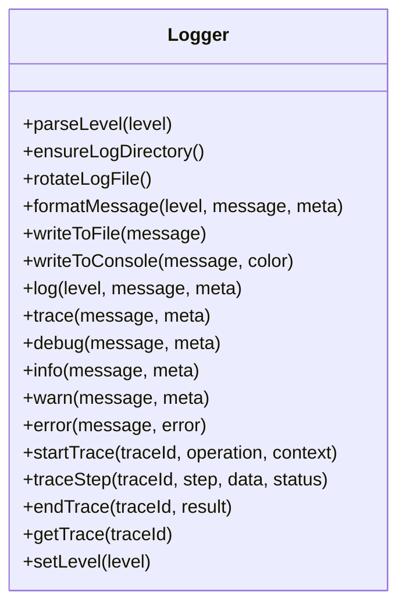

**图表来源**
- [logger.js:1-442](file://backend/src/utils/logger.js#L1-L442)

**章节来源**
- [logger.js:1-442](file://backend/src/utils/logger.js#L1-L442)

### 路由与 API 集成
- REST API：健康检查、Schema 查询、会话管理、查询历史、用户偏好、评估接口
- SSE：流式进度与结果推送，连接管理与错误处理
- 中间件：请求日志中间件，统一记录请求方法、路径、IP、查询参数

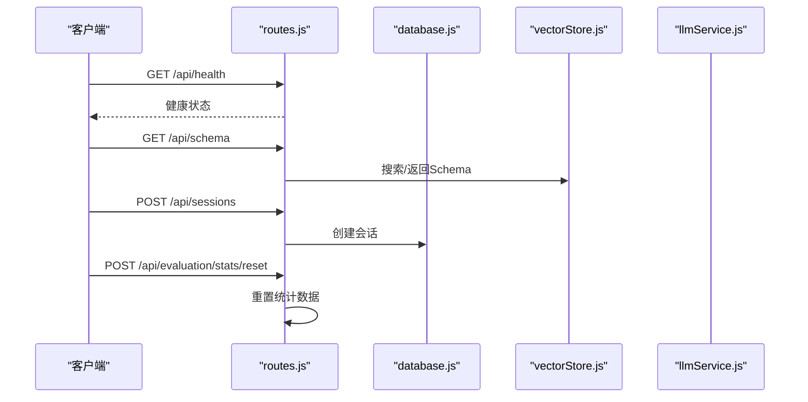

**图表来源**
- [routes.js:1-800](file://backend/src/core/routes.js#L1-L800)
- [database.js:1-850](file://backend/src/core/database.js#L1-L850)
- [vectorStore.js:1-759](file://backend/src/memory/vectorStore.js#L1-L759)
- [llmService.js:1-468](file://backend/src/core/llmService.js#L1-L468)

**章节来源**
- [routes.js:1-800](file://backend/src/core/routes.js#L1-L800)

### 数据库与向量存储集成
- SQLite：会话、消息、查询历史、用户偏好、系统日志
- LanceDB：Schema 向量、查询历史向量，支持智能搜索与重排序
- 迁移与一致性：外键约束启用、表结构迁移、索引优化

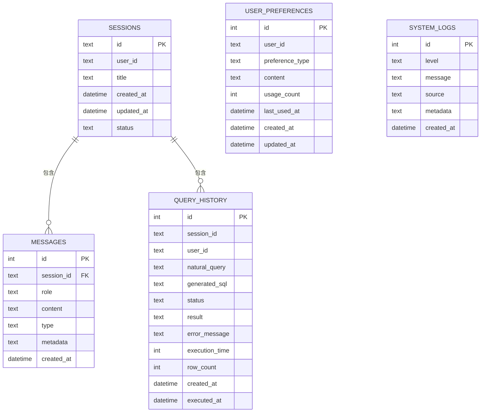

**图表来源**
- [database.js:39-189](file://backend/src/core/database.js#L39-L189)

**章节来源**
- [database.js:1-850](file://backend/src/core/database.js#L1-L850)
- [vectorStore.js:1-759](file://backend/src/memory/vectorStore.js#L1-L759)

### 自修复与定时任务
- 每日自检：数据库、向量库、查询统计、连接数、系统资源
- 会话清理：过期会话归档
- 统计收集：连接数、内存使用
- 记忆维护：压缩与健康报告

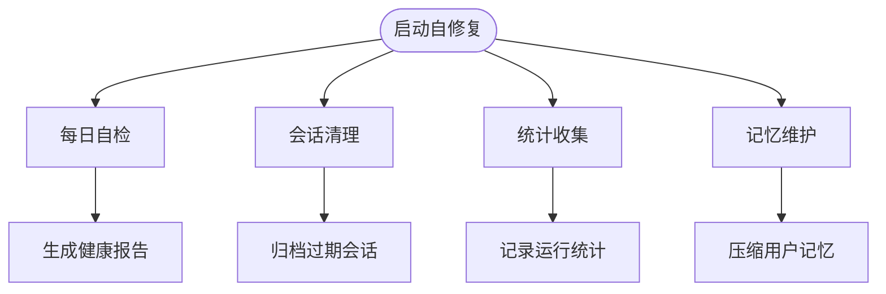

**图表来源**
- [selfRepair.js:1-489](file://backend/src/core/selfRepair.js#L1-L489)

**章节来源**
- [selfRepair.js:1-489](file://backend/src/core/selfRepair.js#L1-L489)

### 长期记忆与偏好抽取
- 偏好类型：查询模式、字段别名、指标偏好、维度偏好
- 存储策略：置信度阈值、频率阈值、模板维度/指标阈值
- LLM 智能分析：区分通用知识与个人偏好，提取映射与习惯
- 字段别名学习：支持直接映射（如“新平台”→“new_tzpingtai”）与值映射

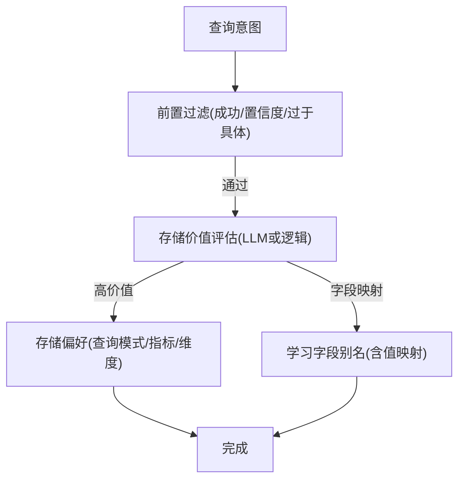

**图表来源**
- [longTermMemory.js:1-1141](file://backend/src/memory/longTermMemory.js#L1-L1141)

**章节来源**
- [longTermMemory.js:1-1141](file://backend/src/memory/longTermMemory.js#L1-L1141)

### 评估与监控指标
- 向量化质量：Schema 表级检索精度、召回、F1，查询相似度余弦相似度
- 记忆命中率：总体与按类型命中率、总查询数、命中/未命中
- 运行时统计：向量检索命中、距离分布、长期记忆命中

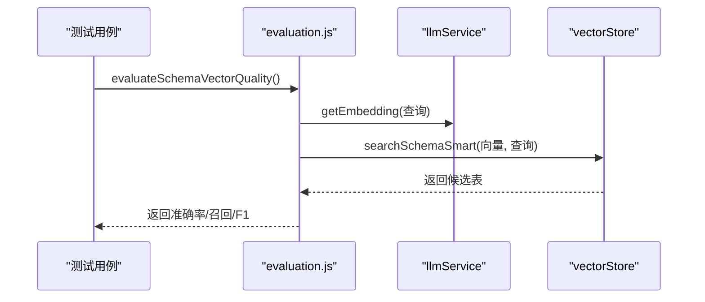

**图表来源**
- [evaluation.js:1-488](file://backend/src/utils/evaluation.js#L1-L488)
- [llmService.js:1-468](file://backend/src/core/llmService.js#L1-L468)
- [vectorStore.js:1-759](file://backend/src/memory/vectorStore.js#L1-L759)

**章节来源**
- [evaluation.js:1-488](file://backend/src/utils/evaluation.js#L1-L488)

## 依赖分析
- 模块耦合：路由依赖数据库、向量存储、LLM 服务；SSE 依赖 NL2SQL 引擎；自修复依赖数据库与向量存储；长期记忆依赖数据库与 LLM
- 外部依赖：Express、vectordb(LanceDB)、sqlite3、dotenv、node-cron、uuid、dayjs
- 依赖注入：通过模块导出与 require 实现，避免全局污染，便于测试与替换

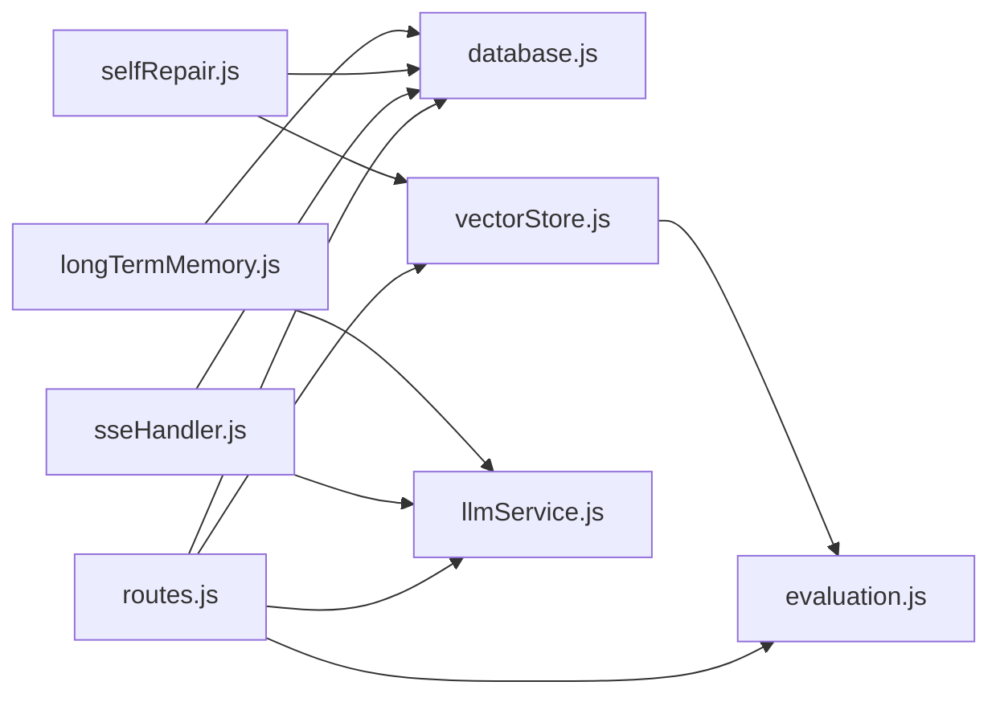

**图表来源**
- [routes.js:1-800](file://backend/src/core/routes.js#L1-L800)
- [sseHandler.js:1-349](file://backend/src/core/sseHandler.js#L1-L349)
- [selfRepair.js:1-489](file://backend/src/core/selfRepair.js#L1-L489)
- [longTermMemory.js:1-1141](file://backend/src/memory/longTermMemory.js#L1-L1141)
- [vectorStore.js:1-759](file://backend/src/memory/vectorStore.js#L1-L759)
- [llmService.js:1-468](file://backend/src/core/llmService.js#L1-L468)
- [database.js:1-850](file://backend/src/core/database.js#L1-L850)
- [evaluation.js:1-488](file://backend/src/utils/evaluation.js#L1-L488)

**章节来源**
- [package.json:1-28](file://backend/package.json#L1-L28)

## 性能考量
- LLM 调用：超时与重试配置，避免阻塞；流式响应减少等待；Embedding 超时单独配置
- 向量检索：智能搜索与距离重排序，减少无关表返回；距离分布统计指导阈值调优
- 数据库：索引优化（外键、时间、状态等），事务批量写入，迁移脚本保证结构一致性
- 日志：文件轮转与级别控制，避免 IO 抖动；追踪仅在调试场景启用
- SSE：连接数统计与清理，避免僵尸连接

## 故障排查指南
- 启动失败：检查必要配置（LLM API Key、SR 数据库 URL），查看日志错误堆栈
- LLM 调用失败：检查 API Base、Key、超时、重试；关注响应截断与流式解析异常
- 向量库不可用：确认 LanceDB 初始化状态与表存在；回退到普通搜索
- 数据库异常：检查外键约束启用、迁移是否成功、连接池配置
- SSE 连接异常：确认会话存在、连接关闭与错误事件处理
- 自修复任务：检查 Cron 表达式、任务状态与日志输出

**章节来源**
- [app.js:160-230](file://backend/src/app.js#L160-L230)
- [llmService.js:135-151](file://backend/src/core/llmService.js#L135-L151)
- [vectorStore.js:231-261](file://backend/src/memory/vectorStore.js#L231-L261)
- [database.js:200-261](file://backend/src/core/database.js#L200-L261)
- [selfRepair.js:169-310](file://backend/src/core/selfRepair.js#L169-L310)

## 结论
NL2SQL 系统通过“配置中心 + 模块化 + 统一日志 + 评估体系”的集成模式，实现了与 LLM、数据库、向量存储的稳健对接。解耦设计与插件化架构便于扩展与替换；完善的错误处理与自修复机制提升了系统可靠性；评估与监控指标为持续优化提供数据支撑。

## 附录
- 最佳实践
  - 环境变量集中管理，生产环境严格白名单与行数限制
  - LLM 调用统一走 llmService，避免分散 HTTP 调用
  - 向量检索优先使用智能搜索，结合阈值与距离分布调优
  - SSE 连接数与内存使用纳入监控，定期清理过期会话
  - 评估功能按需启用，避免影响主流程性能
- 服务发现与负载均衡
  - 建议在网关层做服务发现与健康检查
  - LLM API 可配置多个端点与权重，结合重试与熔断
  - 数据库连接池参数与超时需与 SLA 对齐