# 集成模式设计

<cite>
**本文档引用的文件**
- [app.js](file://backend/src/app.js)
- [routes.js](file://backend/src/core/routes.js)
- [llmService.js](file://backend/src/core/llmService.js)
- [database.js](file://backend/src/core/database.js)
- [srDatabase.js](file://backend/src/core/srDatabase.js)
- [vectorStore.js](file://backend/src/memory/vectorStore.js)
- [config.js](file://backend/src/core/config.js)
- [feature-flags.js](file://backend/config/feature-flags.js)
- [longTermMemory.js](file://backend/src/memory/longTermMemory.js)
- [package.json](file://backend/package.json)
- [external-deps.json](file://backend/test/external-deps.json)
- [后端架构审查与优化方案.md](file://docs/后端架构审查与优化方案.md)
</cite>

## 目录
1. [简介](#简介)
2. [项目结构](#项目结构)
3. [核心组件](#核心组件)
4. [架构概览](#架构概览)
5. [详细组件分析](#详细组件分析)
6. [依赖分析](#依赖分析)
7. [性能考虑](#性能考虑)
8. [故障排除指南](#故障排除指南)
9. [结论](#结论)
10. [附录](#附录)

## 简介

NL2SQL 系统是一个基于自然语言的数据库查询转换服务，能够将用户的自然语言查询转换为 SQL 并执行返回结果。该系统采用模块化架构设计，通过多种集成模式实现与外部服务的高效协作。

本技术文档专注于系统的集成模式设计，深入分析系统与外部服务的集成架构，包括 LLM 服务集成、数据库连接集成、向量数据库集成等。文档阐述了各种集成模式的设计原则，如适配器模式、代理模式、桥接模式等在系统中的应用，并提供了 API 服务集成的最佳实践、数据库集成的设计、向量数据库集成的技术实现、配置管理的作用和实现方式，以及集成测试策略和故障排除方法。

## 项目结构

NL2SQL 系统采用清晰的分层架构，主要包含以下核心模块：

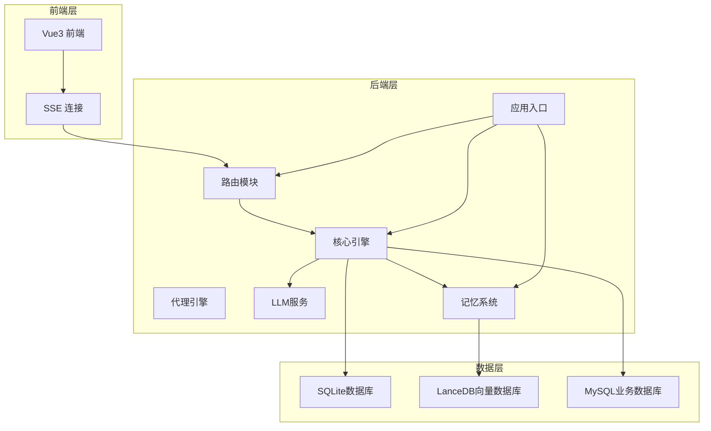

**图表来源**
- [app.js:1-279](file://backend/src/app.js#L1-L279)
- [routes.js:1-800](file://backend/src/core/routes.js#L1-L800)

**章节来源**
- [app.js:1-279](file://backend/src/app.js#L1-L279)
- [package.json:1-36](file://backend/package.json#L1-L36)

## 核心组件

### 应用入口组件

应用入口负责系统的整体初始化和生命周期管理：

- **启动流程管理**：按序初始化配置、数据库、向量数据库、Schema 元数据加载
- **优雅关闭处理**：确保资源正确释放，包括 HTTP 服务器、SSE 连接、数据库连接
- **进程信号处理**：监听 SIGTERM 和 SIGINT 信号，执行优雅关闭

### 路由组件

路由模块提供完整的 RESTful API 接口：

- **健康检查接口**：提供服务状态监控
- **Schema 查询接口**：支持表结构、指标、维度的查询
- **会话管理接口**：支持会话的创建、查询、删除
- **查询历史接口**：提供查询历史记录的查询
- **长期记忆接口**：支持用户偏好的存储和管理
- **评估接口**：提供运行时统计和质量评估

### LLM 服务组件

LLM 服务模块封装了与外部语言模型的交互：

- **HTTP 请求封装**：基于 Node.js 原生 http/https 模块实现
- **重试机制**：支持可配置的最大重试次数和延迟
- **流式响应支持**：支持聊天和嵌入向量的流式处理
- **超时控制**：为不同类型的请求设置合适的超时时间

**章节来源**
- [app.js:99-204](file://backend/src/app.js#L99-L204)
- [routes.js:1-800](file://backend/src/core/routes.js#L1-L800)
- [llmService.js:1-491](file://backend/src/core/llmService.js#L1-L491)

## 架构概览

NL2SQL 系统采用多层架构设计，通过适配器模式和代理模式实现对外部服务的集成：

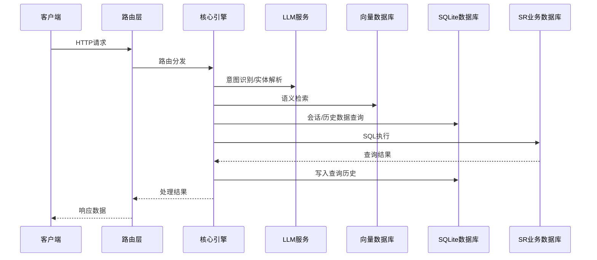

**图表来源**
- [routes.js:74-800](file://backend/src/core/routes.js#L74-L800)
- [llmService.js:224-322](file://backend/src/core/llmService.js#L224-L322)
- [vectorStore.js:382-439](file://backend/src/memory/vectorStore.js#L382-L439)
- [database.js:541-604](file://backend/src/core/database.js#L541-L604)

## 详细组件分析

### LLM 服务集成模式

#### 适配器模式应用

LLM 服务模块采用了适配器模式，将不同 LLM 提供商的 API 统一为一致的接口：

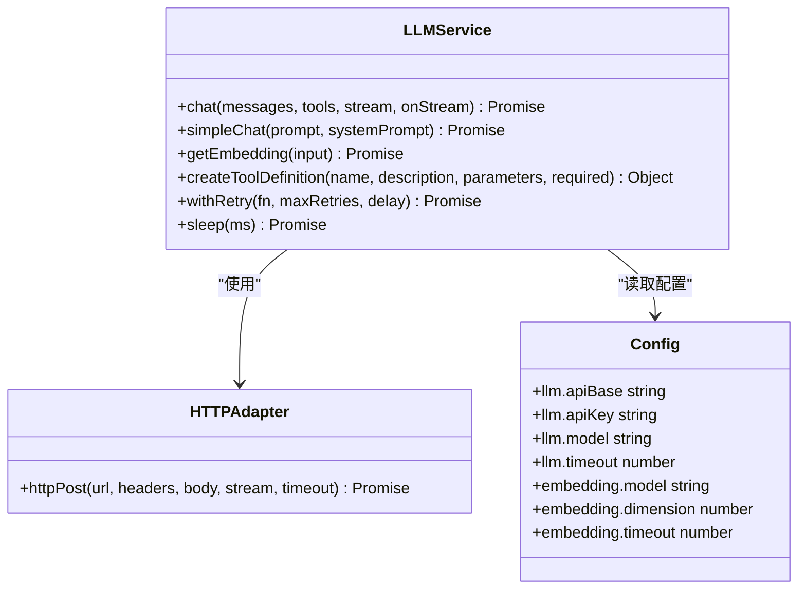

**图表来源**
- [llmService.js:43-154](file://backend/src/core/llmService.js#L43-L154)
- [config.js:64-94](file://backend/src/core/config.js#L64-L94)

#### 代理模式实现

LLM 服务通过代理模式实现了请求的统一管理和错误处理：

- **请求代理**：所有 LLM API 调用都通过 `httpPost` 函数代理
- **配置代理**：通过配置模块统一管理 API 基础地址、密钥、模型等
- **错误代理**：统一的错误处理和重试机制

#### 超时处理和重试机制

系统实现了多层次的超时处理和重试机制：

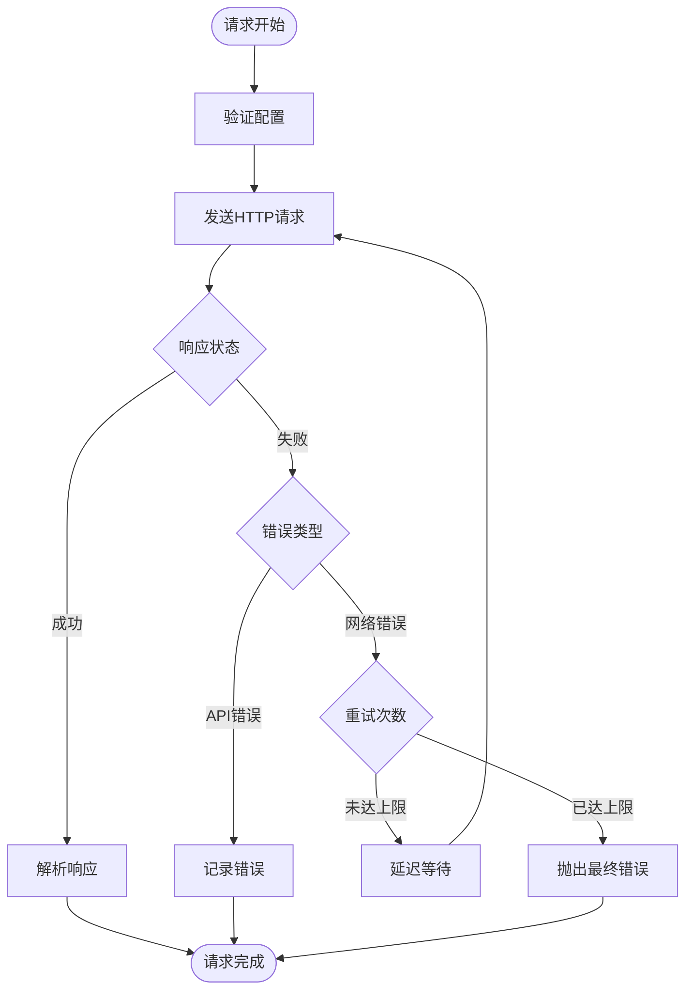

**图表来源**
- [llmService.js:169-197](file://backend/src/core/llmService.js#L169-L197)
- [llmService.js:142-153](file://backend/src/core/llmService.js#L142-L153)

**章节来源**
- [llmService.js:1-491](file://backend/src/core/llmService.js#L1-L491)
- [config.js:64-94](file://backend/src/core/config.js#L64-L94)

### 数据库集成设计

#### SQLite 数据库集成

SQLite 数据库用于存储会话历史、查询日志和长期记忆：

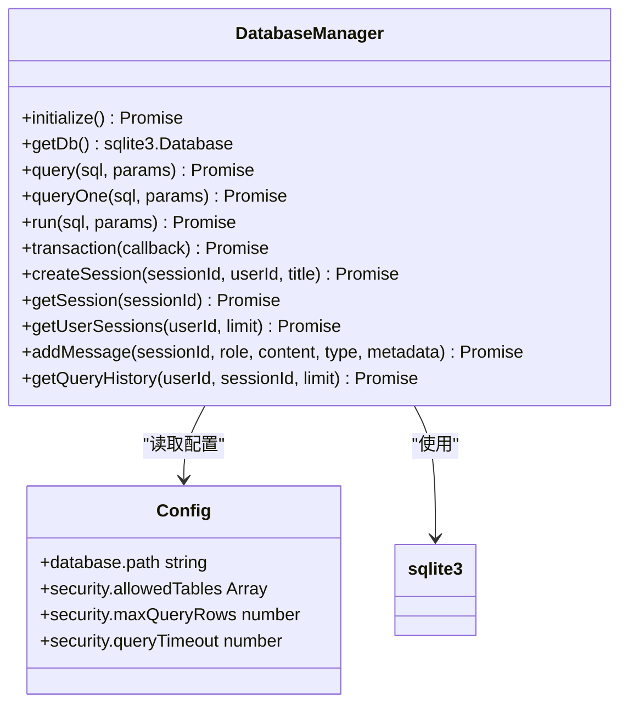

**图表来源**
- [database.js:25-308](file://backend/src/core/database.js#L25-L308)
- [config.js:104-107](file://backend/src/core/config.js#L104-L107)

#### SR 业务数据库集成

SR 数据库采用连接池模式实现高效的数据库连接管理：

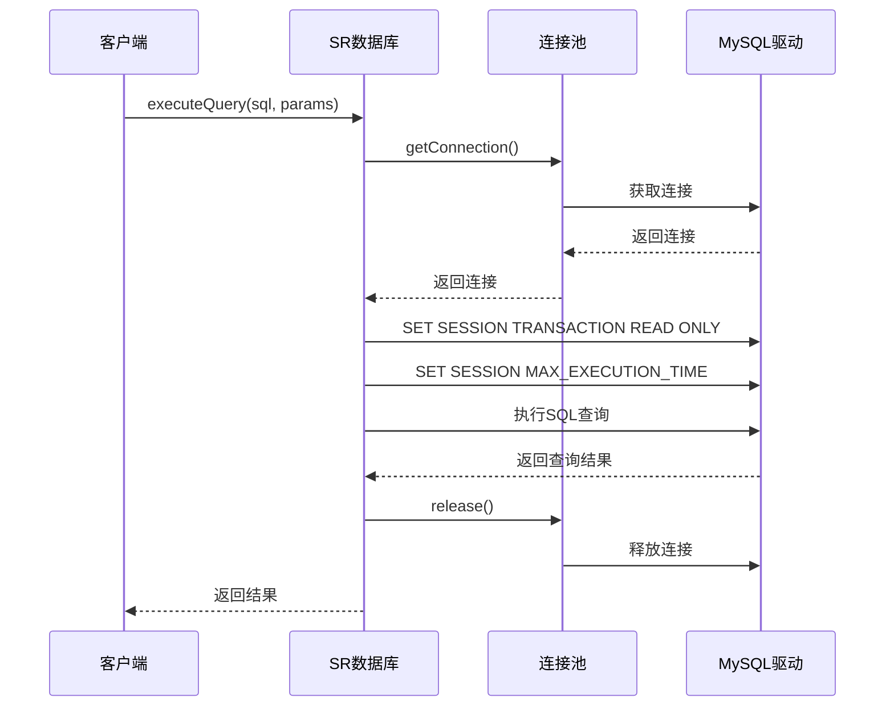

**图表来源**
- [srDatabase.js:95-127](file://backend/src/core/srDatabase.js#L95-L127)

#### 连接池管理策略

系统实现了完善的连接池管理：

- **懒加载机制**：mysql2 模块未安装或 URL 为空时不初始化连接池
- **只读保护**：每次获取连接后设置 `SET SESSION TRANSACTION READ ONLY`
- **双重超时控制**：通过 `MAX_EXECUTION_TIME` 和查询超时双重保障
- **资源清理**：连接使用完毕后自动释放，避免连接泄漏

**章节来源**
- [database.js:1-800](file://backend/src/core/database.js#L1-L800)
- [srDatabase.js:1-156](file://backend/src/core/srDatabase.js#L1-L156)

### 向量数据库集成

#### LanceDB 集成架构

向量数据库采用 LanceDB 实现语义检索功能：

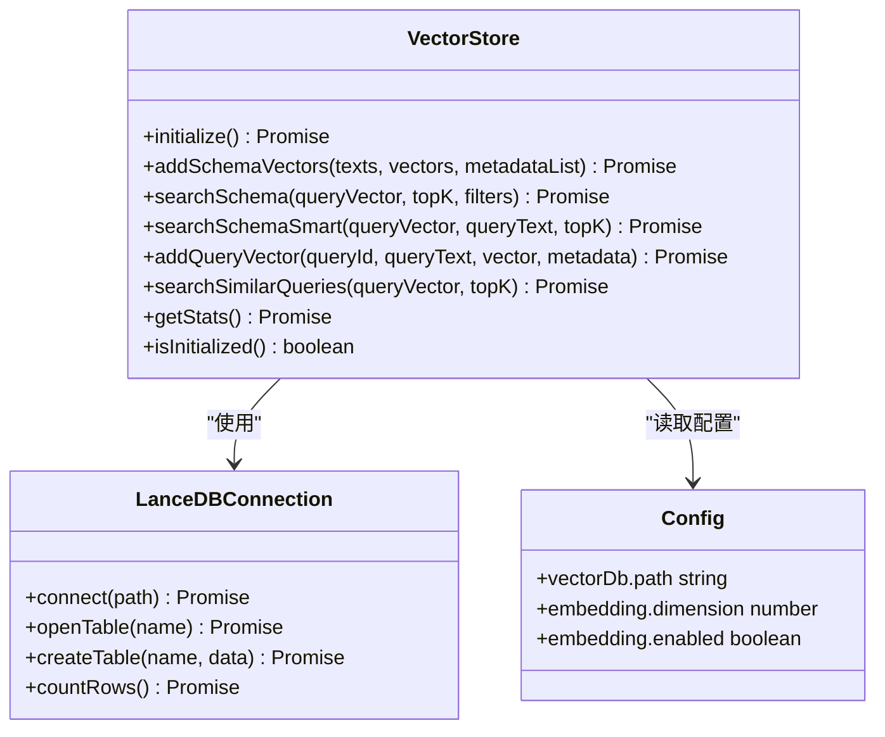

**图表来源**
- [vectorStore.js:235-265](file://backend/src/memory/vectorStore.js#L235-L265)
- [config.js:113-116](file://backend/src/core/config.js#L113-L116)

#### 智能搜索算法

系统实现了智能的向量搜索算法：

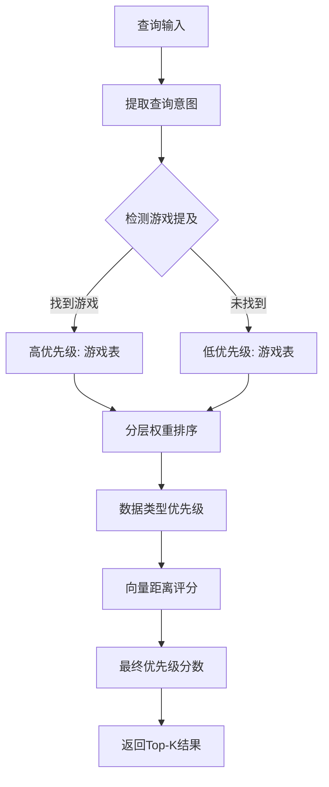

**图表来源**
- [vectorStore.js:454-578](file://backend/src/memory/vectorStore.js#L454-L578)

#### 嵌入向量管理

系统实现了完整的嵌入向量管理机制：

- **向量存储**：Schema 向量和查询历史向量分别存储在不同的表中
- **元数据增强**：为向量添加时间戳、重要性评分、查询类型等元数据
- **智能过滤**：支持基于作用域和数据类型的过滤条件
- **统计追踪**：记录向量搜索的命中率和性能指标

**章节来源**
- [vectorStore.js:1-800](file://backend/src/memory/vectorStore.js#L1-L800)
- [config.js:84-94](file://backend/src/core/config.js#L84-L94)

### 配置管理系统

#### 集中式配置管理

系统采用集中式配置管理模式：

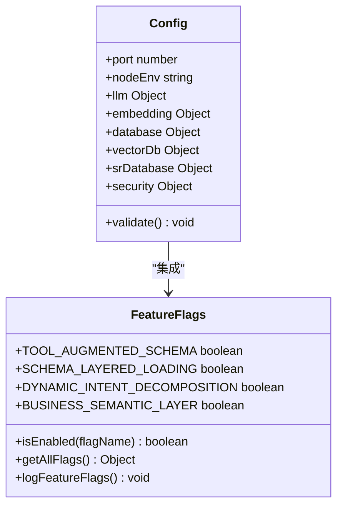

**图表来源**
- [config.js:20-396](file://backend/src/core/config.js#L20-L396)
- [feature-flags.js:16-141](file://backend/config/feature-flags.js#L16-L141)

#### 功能开关机制

系统实现了灵活的功能开关机制：

- **渐进式发布**：支持按 Phase 渐进启用新功能
- **快速回滚**：支持一键禁用所有功能
- **运行时切换**：通过环境变量动态控制功能开关
- **状态监控**：提供功能开关状态的日志输出

**章节来源**
- [config.js:1-439](file://backend/src/core/config.js#L1-L439)
- [feature-flags.js:1-294](file://backend/config/feature-flags.js#L1-L294)

## 依赖分析

### 外部依赖关系

系统的主要外部依赖包括：

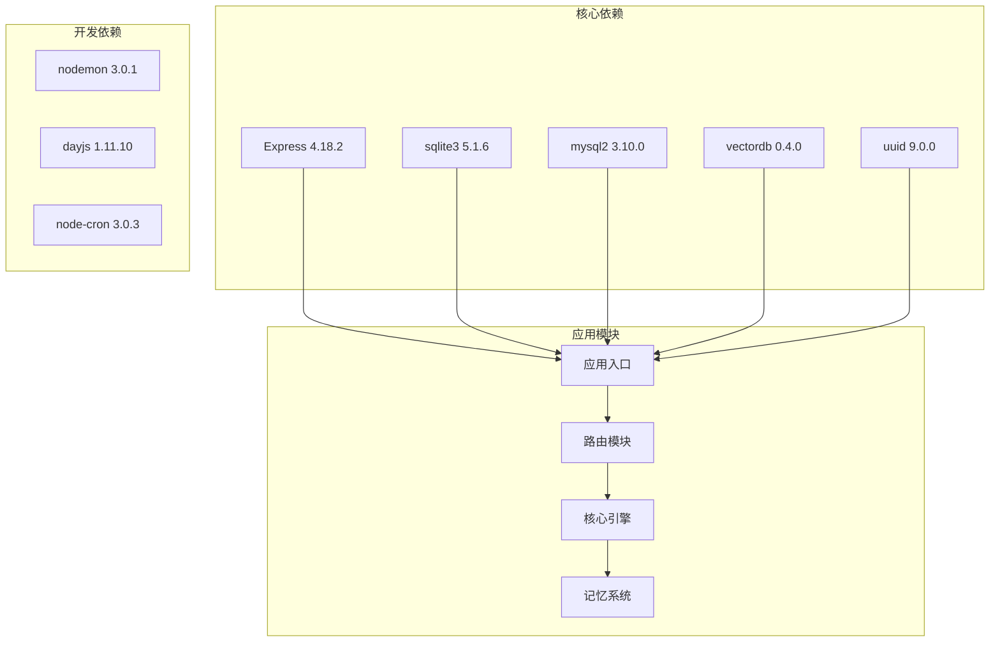

**图表来源**
- [package.json:16-31](file://backend/package.json#L16-L31)

### 内部模块依赖

系统内部模块之间的依赖关系：

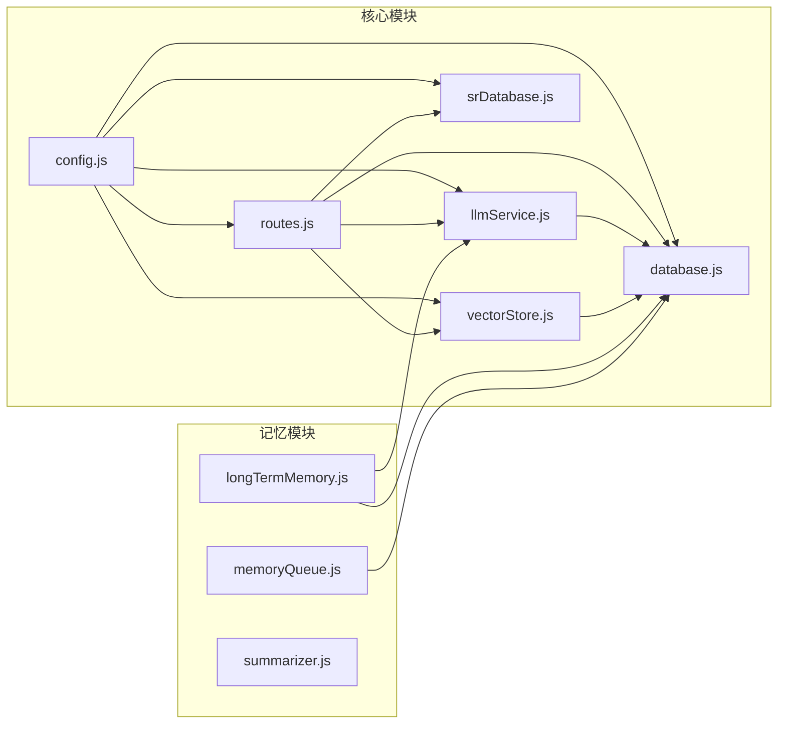

**图表来源**
- [routes.js:16-38](file://backend/src/core/routes.js#L16-L38)
- [llmService.js:15-27](file://backend/src/core/llmService.js#L15-L27)

**章节来源**
- [package.json:1-36](file://backend/package.json#L1-L36)
- [routes.js:1-800](file://backend/src/core/routes.js#L1-L800)

## 性能考虑

### 连接池优化

系统在数据库连接方面采用了多项优化措施：

- **连接池大小调优**：SR 数据库连接池默认最大 10 个连接
- **只读事务保护**：确保查询不会修改数据，提高并发安全性
- **超时控制**：双重超时机制防止长时间阻塞
- **资源回收**：自动释放连接，避免连接泄漏

### 向量检索优化

向量数据库检索性能优化：

- **智能搜索算法**：结合向量相似度和业务规则进行排序
- **分层权重**：针对不同类型的表设置不同的优先级权重
- **元数据过滤**：支持基于作用域和数据类型的过滤
- **缓存策略**：对常用查询结果进行缓存

### 内存管理

系统在内存管理方面的考虑：

- **连接池复用**：避免频繁创建销毁数据库连接
- **向量数据管理**：定期清理无效的向量数据
- **日志级别控制**：根据环境调整日志级别，减少内存占用
- **优雅关闭**：确保进程退出时正确释放所有资源

## 故障排除指南

### 常见问题诊断

#### LLM API 集成问题

**问题症状**：
- LLM API 调用超时
- 响应解析失败
- API 密钥认证失败

**诊断步骤**：
1. 检查 `LLM_API_KEY` 环境变量配置
2. 验证 API 基础地址 `LLM_API_BASE` 的可达性
3. 查看 LLM 服务的重试日志
4. 检查网络连接和防火墙设置

#### 数据库连接问题

**问题症状**：
- SQLite 数据库初始化失败
- SR 数据库连接池无法创建
- 查询超时或连接泄漏

**诊断步骤**：
1. 检查数据库文件路径配置
2. 验证 SR 数据库连接 URL 格式
3. 查看连接池状态和资源使用情况
4. 检查数据库权限和访问控制

#### 向量数据库问题

**问题症状**：
- LanceDB 初始化失败
- 向量搜索结果不准确
- 向量数据存储异常

**诊断步骤**：
1. 检查向量数据库目录权限
2. 验证嵌入向量维度配置
3. 查看向量数据的完整性
4. 检查向量索引的构建状态

### 集成测试策略

#### 测试环境配置

系统提供了完善的测试环境配置：

- **外部依赖配置**：通过 `external-deps.json` 管理测试依赖
- **功能开关测试**：支持按功能开关进行针对性测试
- **环境变量隔离**：测试环境与生产环境隔离
- **测试数据管理**：提供测试用的示例数据

#### 测试执行策略

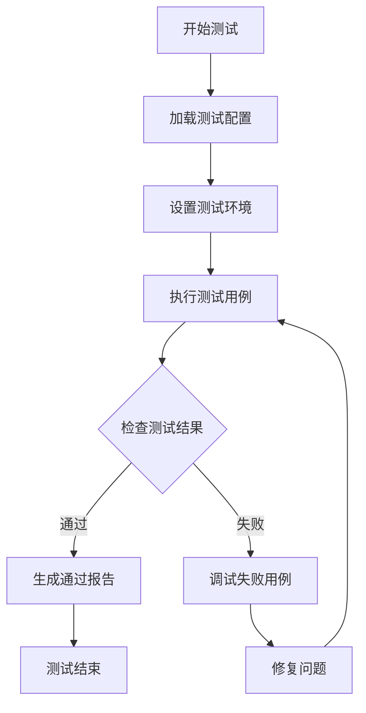

**图表来源**
- [external-deps.json:1-11](file://backend/test/external-deps.json#L1-L11)

**章节来源**
- [external-deps.json:1-11](file://backend/test/external-deps.json#L1-L11)
- [后端架构审查与优化方案.md:1-800](file://docs/后端架构审查与优化方案.md#L1-L800)

## 结论

NL2SQL 系统通过精心设计的集成模式，成功实现了与多种外部服务的高效协作。系统采用适配器模式统一 LLM API 接口，通过代理模式实现数据库连接管理，运用桥接模式连接向量数据库，形成了完整的集成架构。

系统的核心优势包括：

1. **模块化设计**：清晰的分层架构便于维护和扩展
2. **配置集中化**：统一的配置管理简化了部署和维护
3. **功能开关机制**：支持渐进式发布和快速回滚
4. **性能优化**：连接池、缓存、超时控制等多重优化
5. **故障处理**：完善的错误处理和重试机制

未来可以进一步优化的方向包括：

- 深化模块拆分，减少单文件过大问题
- 建立统一的错误处理体系
- 完善监控和日志系统
- 增强安全防护机制

## 附录

### API 服务集成最佳实践

#### 超时处理
- 为不同类型的操作设置合适的超时时间
- 实现双重超时控制机制
- 提供超时重试策略

#### 重试机制
- 实现指数退避重试
- 限制最大重试次数
- 区分可重试和不可重试错误

#### 熔断保护
- 实现熔断器模式防止级联故障
- 监控错误率和延迟指标
- 提供降级策略

### 数据库集成设计原则

#### 连接池管理
- 合理设置连接池大小
- 实现连接复用和回收
- 监控连接使用情况

#### 事务处理
- 实现事务边界管理
- 提供事务回滚机制
- 处理并发冲突

#### 读写分离
- 实现读写操作分离
- 提供数据一致性保证
- 优化查询性能

### 向量数据库集成技术

#### 嵌入向量存储
- 实现向量数据的持久化存储
- 提供向量数据的版本管理
- 支持向量数据的增量更新

#### 检索算法
- 实现高效的向量相似度计算
- 提供多维度的排序算法
- 支持实时检索和批量检索

#### 性能优化
- 实现向量索引的优化
- 提供缓存策略
- 优化内存使用