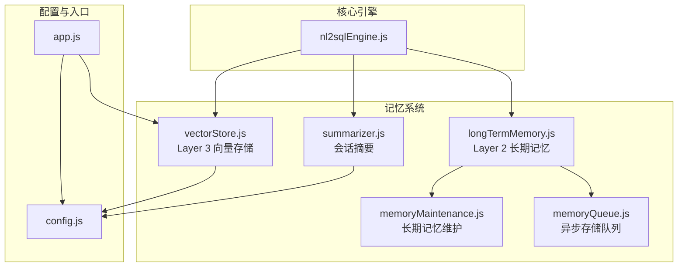
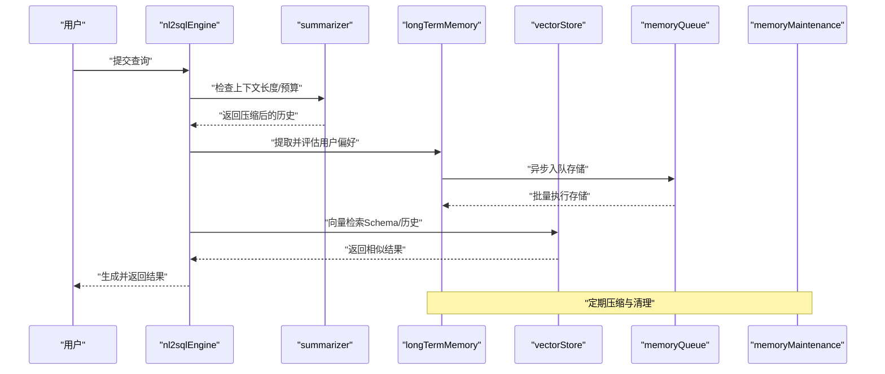
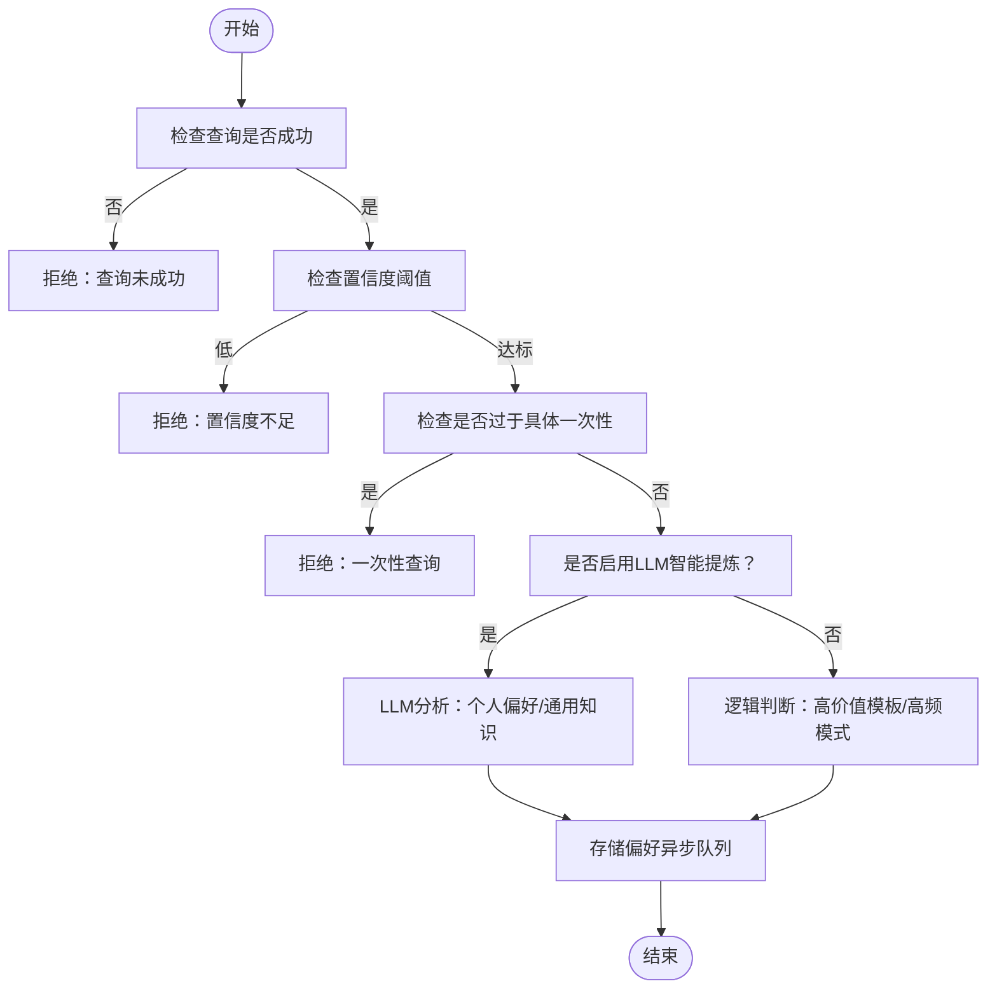
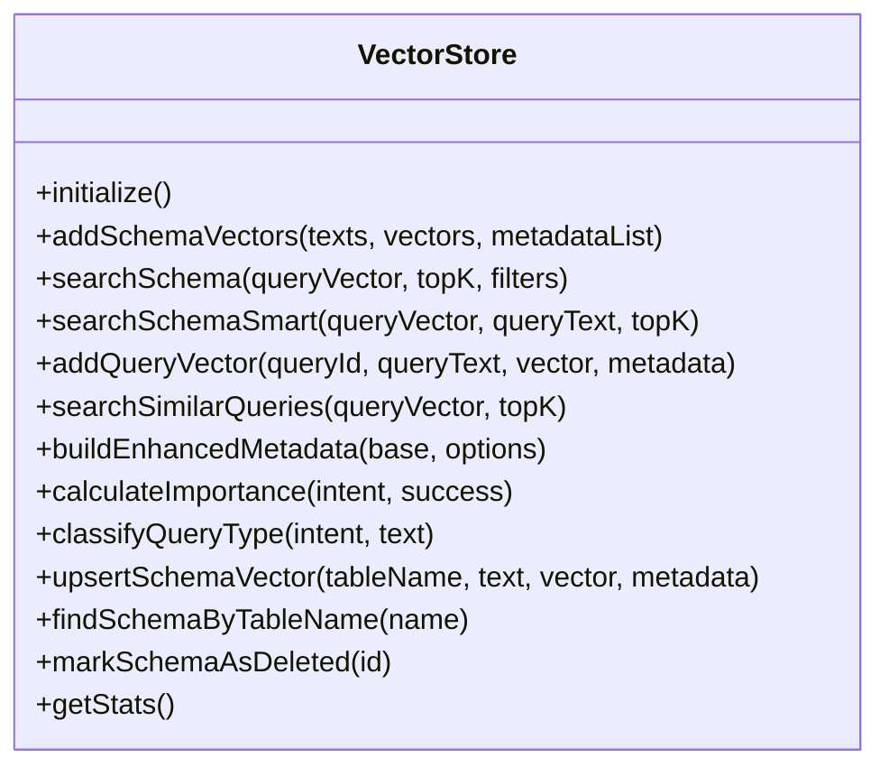
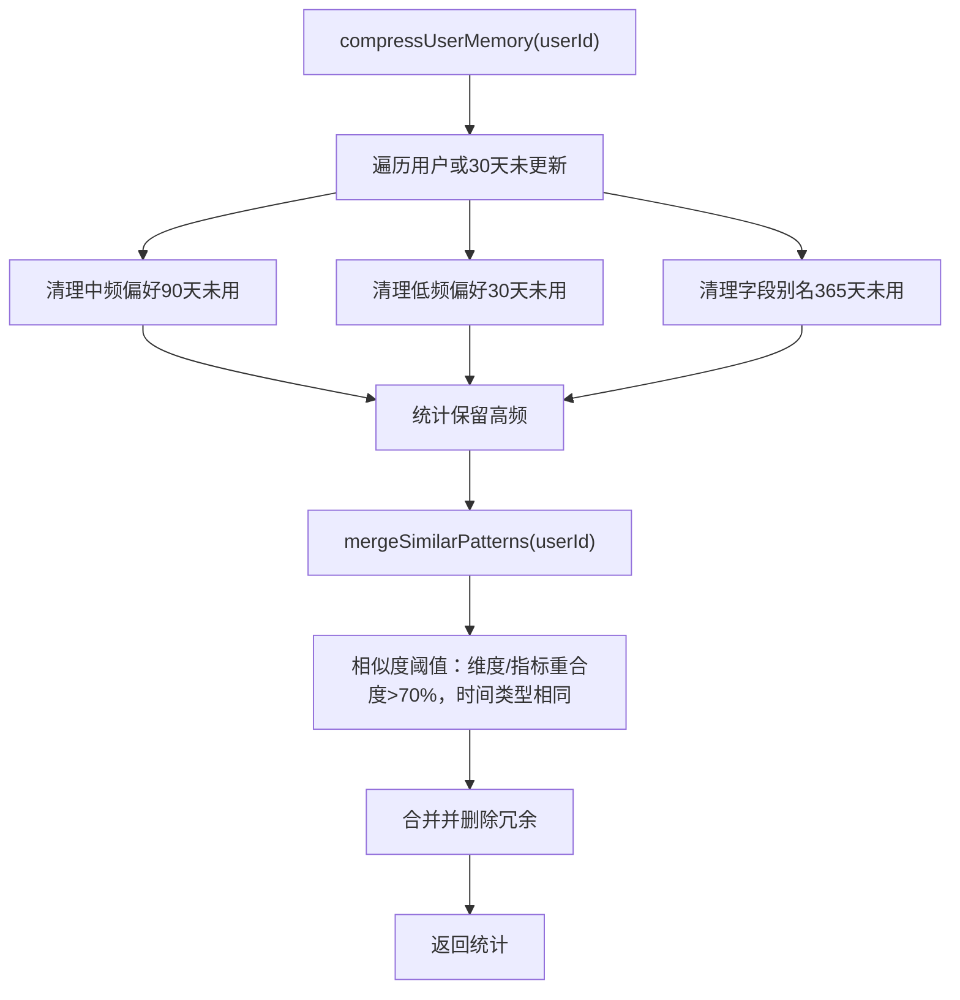
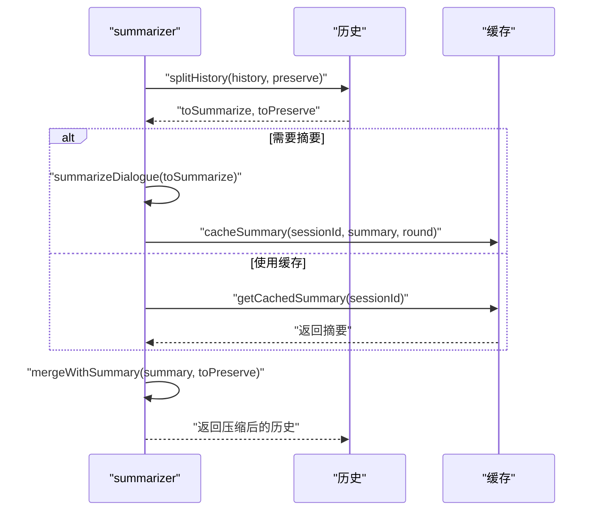
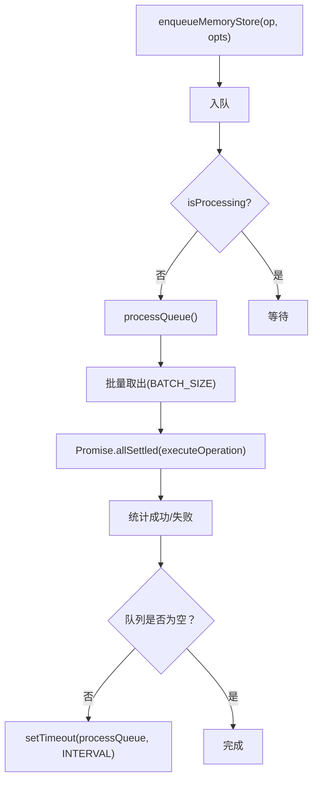
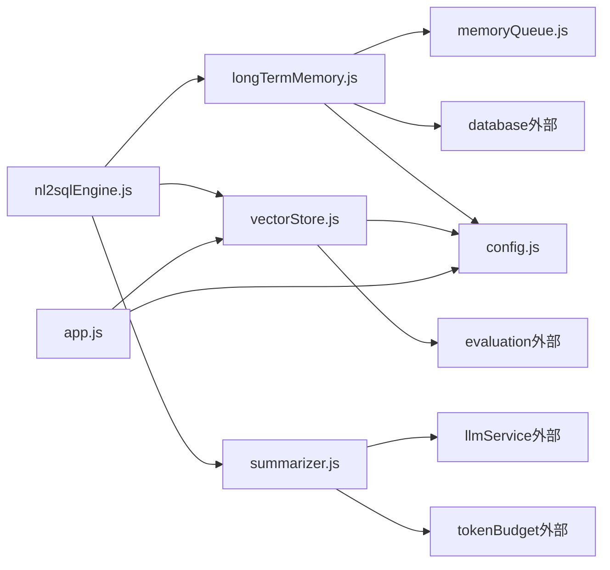

# 记忆系统

<cite>
**本文引用的文件**
- [longTermMemory.js](file://backend/src/memory/longTermMemory.js)
- [vectorStore.js](file://backend/src/memory/vectorStore.js)
- [memoryMaintenance.js](file://backend/src/memory/memoryMaintenance.js)
- [memoryQueue.js](file://backend/src/memory/memoryQueue.js)
- [summarizer.js](file://backend/src/memory/summarizer.js)
- [config.js](file://backend/src/core/config.js)
- [nl2sqlEngine.js](file://backend/src/core/nl2sqlEngine.js)
- [app.js](file://backend/src/app.js)
- [context-management.test.js](file://backend/test/context-management.test.js)
- [schema-metadata.json](file://backend/config/schema-metadata.json)
</cite>

## 目录
1. [引言](#引言)
2. [项目结构](#项目结构)
3. [核心组件](#核心组件)
4. [架构总览](#架构总览)
5. [详细组件分析](#详细组件分析)
6. [依赖分析](#依赖分析)
7. [性能考虑](#性能考虑)
8. [故障排查指南](#故障排查指南)
9. [结论](#结论)
10. [附录](#附录)

## 引言
本技术文档围绕 NL2SQL 记忆系统展开，系统采用“三层记忆架构”设计：
- Layer 1：会话历史管理（短期记忆）
- Layer 2：长期记忆系统（用户偏好与查询模式）
- Layer 3：向量存储与语义检索（Schema 与查询历史）

本文将深入解析各层职责、协同工作机制、维护策略、性能优化、语义检索与向量相似度计算方法、配置选项与扩展点，并提供使用案例与最佳实践，帮助开发者快速理解与实现。

## 项目结构
记忆系统位于 backend/src/memory 目录，配合核心引擎与配置模块协同工作：
- longTermMemory.js：Layer 2 长期记忆（用户偏好、查询模式、字段别名）
- vectorStore.js：Layer 3 向量存储（Schema/查询历史向量化、语义检索）
- memoryMaintenance.js：长期记忆压缩与清理
- memoryQueue.js：异步记忆存储队列
- summarizer.js：会话历史摘要与压缩（Layer 1）
- config.js：统一配置（含长期记忆、上下文管理、评估等）
- nl2sqlEngine.js：核心引擎，集成记忆模块
- app.js：应用入口，初始化向量数据库与Schema元数据

图表来源
- [nl2sqlEngine.js:1-120](file://backend/src/core/nl2sqlEngine.js#L1-L120)
- [longTermMemory.js:1-120](file://backend/src/memory/longTermMemory.js#L1-L120)
- [vectorStore.js:1-120](file://backend/src/memory/vectorStore.js#L1-L120)
- [memoryMaintenance.js:1-120](file://backend/src/memory/memoryMaintenance.js#L1-L120)
- [memoryQueue.js:1-120](file://backend/src/memory/memoryQueue.js#L1-L120)
- [summarizer.js:1-120](file://backend/src/memory/summarizer.js#L1-L120)
- [config.js:250-295](file://backend/src/core/config.js#L250-L295)
- [app.js:90-180](file://backend/src/app.js#L90-L180)

章节来源
- [app.js:90-180](file://backend/src/app.js#L90-L180)
- [config.js:250-295](file://backend/src/core/config.js#L250-L295)

## 核心组件
- Layer 2 长期记忆（longTermMemory.js）
  - 用户偏好提取与存储：查询模式、字段别名、指标/维度偏好
  - LLM 智能提炼：区分个人偏好与通用知识，提升存储质量
  - 前置筛选：置信度阈值、一次性查询排除、高价值模板与高频模式
  - 异步存储队列：enqueueMemoryStore 批量处理，避免阻塞
- Layer 3 向量存储（vectorStore.js）
  - LanceDB 向量数据库：Schema 向量与查询历史向量
  - 元数据增强：重要性评分、查询类型、复杂度、执行信息、意图摘要
  - 语义检索：向量相似度搜索、智能搜索（按意图重排）
  - 增量更新：基于内容哈希避免重复向量化
- 长期记忆维护（memoryMaintenance.js）
  - 分级保留策略：高频永久、中频90天、低频30天、字段别名365天
  - 相似模式合并：维度/指标重合度高的模式合并
  - 健康报告：统计与清理预估
- 会话摘要（summarizer.js）
  - 历史分割、摘要生成、增量更新、缓存管理
  - 触发条件：轮数阈值与Token阈值
- 配置（config.js）
  - 长期记忆开关、阈值、保留策略
  - 上下文管理：Token预算、摘要配置
  - 评估：相似度阈值、统计开关

章节来源
- [longTermMemory.js:1-120](file://backend/src/memory/longTermMemory.js#L1-L120)
- [vectorStore.js:1-120](file://backend/src/memory/vectorStore.js#L1-L120)
- [memoryMaintenance.js:1-120](file://backend/src/memory/memoryMaintenance.js#L1-L120)
- [summarizer.js:1-120](file://backend/src/memory/summarizer.js#L1-L120)
- [config.js:250-333](file://backend/src/core/config.js#L250-L333)

## 架构总览
三层记忆架构协同工作：
- Layer 1（会话摘要）：通过 summarizer 控制上下文长度，避免LLM上下文超限
- Layer 2（长期记忆）：通过 longTermMemory 存储用户偏好，增强意图识别与实体解析
- Layer 3（向量检索）：通过 vectorStore 提供语义检索能力，辅助Schema选择与查询理解

图表来源
- [nl2sqlEngine.js:1-120](file://backend/src/core/nl2sqlEngine.js#L1-L120)
- [summarizer.js:260-331](file://backend/src/memory/summarizer.js#L260-L331)
- [longTermMemory.js:313-471](file://backend/src/memory/longTermMemory.js#L313-L471)
- [memoryQueue.js:72-118](file://backend/src/memory/memoryQueue.js#L72-L118)
- [memoryMaintenance.js:69-120](file://backend/src/memory/memoryMaintenance.js#L69-L120)

## 详细组件分析

### Layer 2：长期记忆（longTermMemory.js）
- 功能要点
  - 前置筛选：查询成功、置信度阈值、排除一次性查询
  - LLM 智能提炼：字段别名、分析习惯、过滤逻辑、通用/单次查询
  - 存储类型：查询模式、字段别名、指标偏好、维度偏好
  - 异步存储：memoryQueue 批量处理，提升吞吐
- 关键流程（提取与存储）
  - 输入：用户ID、意图、原始查询、选项（成功/置信度）
  - 输出：是否存储、原因、存储的偏好列表
- 价值评估
  - 高价值模板：维度≥2且指标≥1
  - 高频模式：7天内≥2次
  - 简单查询需更高频率才存储
- 即时学习（澄清轮）
  - 从用户文本提取映射关系（游戏ID、平台标识、显式声明）
  - 学习字段别名，支持值映射与伪字段处理

图表来源
- [longTermMemory.js:313-471](file://backend/src/memory/longTermMemory.js#L313-L471)
- [longTermMemory.js:480-592](file://backend/src/memory/longTermMemory.js#L480-L592)
- [memoryQueue.js:46-66](file://backend/src/memory/memoryQueue.js#L46-L66)

章节来源
- [longTermMemory.js:253-297](file://backend/src/memory/longTermMemory.js#L253-L297)
- [longTermMemory.js:313-471](file://backend/src/memory/longTermMemory.js#L313-L471)
- [longTermMemory.js:817-952](file://backend/src/memory/longTermMemory.js#L817-L952)
- [memoryQueue.js:46-66](file://backend/src/memory/memoryQueue.js#L46-L66)

### Layer 3：向量存储（vectorStore.js）
- 初始化与表结构
  - LanceDB 连接、schema_vectors 与 query_vectors 表
  - 初始化失败不影响应用启动，记录警告
- 元数据增强
  - 重要性评分：基于维度/指标/筛选器数量、置信度、上下文查询
  - 查询类型分类：定义/对比/趋势/澄清/跟进/新话题
  - 复杂度与执行信息、意图摘要
- 语义检索
  - 向量搜索：返回 topK 结果
  - 智能搜索：按查询意图重排（游戏提及优先、平台表优先、原始日志优先）
- 增量更新
  - 基于内容哈希判断是否需要重新向量化
  - 标记删除（软删除）与定期维护清理

图表来源
- [vectorStore.js:233-263](file://backend/src/memory/vectorStore.js#L233-L263)
- [vectorStore.js:338-369](file://backend/src/memory/vectorStore.js#L338-L369)
- [vectorStore.js:380-437](file://backend/src/memory/vectorStore.js#L380-L437)
- [vectorStore.js:452-538](file://backend/src/memory/vectorStore.js#L452-L538)
- [vectorStore.js:553-620](file://backend/src/memory/vectorStore.js#L553-L620)
- [vectorStore.js:745-776](file://backend/src/memory/vectorStore.js#L745-L776)

章节来源
- [vectorStore.js:48-84](file://backend/src/memory/vectorStore.js#L48-L84)
- [vectorStore.js:93-132](file://backend/src/memory/vectorStore.js#L93-L132)
- [vectorStore.js:141-197](file://backend/src/memory/vectorStore.js#L141-L197)
- [vectorStore.js:338-369](file://backend/src/memory/vectorStore.js#L338-L369)
- [vectorStore.js:452-538](file://backend/src/memory/vectorStore.js#L452-L538)

### 长期记忆维护（memoryMaintenance.js）
- 分级保留策略
  - 高频（≥10次）：永久保留
  - 中频（3-9次）：90天未用清理
  - 低频（<3次）：30天未用清理
  - 字段别名：365天未用清理
- 相似模式合并
  - 维度/指标重合度>70%，时间范围类型相同
  - 合并使用次数，删除冗余
- 健康报告
  - 总体统计、按类型统计、预估清理数量

图表来源
- [memoryMaintenance.js:69-120](file://backend/src/memory/memoryMaintenance.js#L69-L120)
- [memoryMaintenance.js:204-248](file://backend/src/memory/memoryMaintenance.js#L204-L248)
- [memoryMaintenance.js:256-273](file://backend/src/memory/memoryMaintenance.js#L256-L273)
- [memoryMaintenance.js:280-312](file://backend/src/memory/memoryMaintenance.js#L280-L312)

章节来源
- [memoryMaintenance.js:24-46](file://backend/src/memory/memoryMaintenance.js#L24-L46)
- [memoryMaintenance.js:69-120](file://backend/src/memory/memoryMaintenance.js#L69-L120)
- [memoryMaintenance.js:204-248](file://backend/src/memory/memoryMaintenance.js#L204-L248)

### 会话摘要（summarizer.js）
- 历史压缩
  - 分割：保留最近若干轮，其余摘要
  - 摘要生成：LLM生成摘要，长度控制
  - 增量更新：合并新对话与现有摘要
- 缓存管理
  - 内存缓存：按会话ID缓存摘要，带过期时间
  - 触发条件：轮数阈值或Token阈值
- 融合上下文
  - 将摘要与近期历史融合，形成最终发送给LLM的上下文

图表来源
- [summarizer.js:58-95](file://backend/src/memory/summarizer.js#L58-L95)
- [summarizer.js:109-185](file://backend/src/memory/summarizer.js#L109-L185)
- [summarizer.js:264-331](file://backend/src/memory/summarizer.js#L264-L331)
- [summarizer.js:375-406](file://backend/src/memory/summarizer.js#L375-L406)
- [summarizer.js:450-504](file://backend/src/memory/summarizer.js#L450-L504)

章节来源
- [summarizer.js:23-34](file://backend/src/memory/summarizer.js#L23-L34)
- [summarizer.js:58-95](file://backend/src/memory/summarizer.js#L58-L95)
- [summarizer.js:109-185](file://backend/src/memory/summarizer.js#L109-L185)
- [summarizer.js:375-406](file://backend/src/memory/summarizer.js#L375-L406)

### 异步存储队列（memoryQueue.js）
- 设计目标：避免阻塞主流程，提升高并发性能
- 批量处理：固定批次大小，定时间隔
- 错误处理：Promise.allSettled，记录失败数量
- 状态监控：队列长度、处理状态、等待时间

图表来源
- [memoryQueue.js:46-66](file://backend/src/memory/memoryQueue.js#L46-L66)
- [memoryQueue.js:72-118](file://backend/src/memory/memoryQueue.js#L72-L118)
- [memoryQueue.js:126-150](file://backend/src/memory/memoryQueue.js#L126-L150)

章节来源
- [memoryQueue.js:14-33](file://backend/src/memory/memoryQueue.js#L14-L33)
- [memoryQueue.js:72-118](file://backend/src/memory/memoryQueue.js#L72-L118)

## 依赖分析
- 组件耦合
  - nl2sqlEngine 依赖 longTermMemory、vectorStore、summarizer
  - longTermMemory 依赖 database、llmService、config、memoryQueue
  - vectorStore 依赖 config、logger、evaluation、crypto
  - memoryMaintenance 依赖 database、config
  - summarizer 依赖 llmService、tokenBudget
- 外部依赖
  - LanceDB（vectordb）：向量数据库
  - SQLite（sqlite3）：会话与偏好存储
  - dotenv：环境变量加载

图表来源
- [nl2sqlEngine.js:16-34](file://backend/src/core/nl2sqlEngine.js#L16-L34)
- [longTermMemory.js:17-22](file://backend/src/memory/longTermMemory.js#L17-L22)
- [vectorStore.js:14-23](file://backend/src/memory/vectorStore.js#L14-L23)
- [summarizer.js:12-14](file://backend/src/memory/summarizer.js#L12-L14)
- [app.js:40-49](file://backend/src/app.js#L40-L49)

章节来源
- [nl2sqlEngine.js:16-34](file://backend/src/core/nl2sqlEngine.js#L16-L34)
- [app.js:40-49](file://backend/src/app.js#L40-L49)

## 性能考虑
- 异步存储与批处理
  - memoryQueue 批量处理，减少I/O阻塞
  - 建议：合理设置批次大小与处理间隔，平衡延迟与吞吐
- 向量检索优化
  - 智能搜索：按意图重排，减少无效匹配
  - 元数据过滤：应用层过滤（临时方案），未来可升级LanceDB过滤语法
- Token预算与摘要
  - summarizer 触发阈值与缓存，避免重复摘要
  - 建议：根据模型上下文长度调整阈值
- 数据清理与维护
  - 分级保留策略减少存储压力
  - 定期合并相似模式，降低冗余

[本节为通用性能讨论，无需特定文件引用]

## 故障排查指南
- 向量数据库未初始化
  - 现象：向量搜索返回空结果或警告
  - 排查：检查 LanceDB 路径、权限、磁盘空间
  - 参考：vectorStore.initialize() 与 app.js 初始化流程
- LLM 提炼失败回退
  - 现象：LLM 分析失败，使用逻辑判断
  - 排查：检查 LLM API 密钥、超时、模型配置
  - 参考：longTermMemory.analyzeWithLLM() 与 config.llm
- 摘要生成失败
  - 现象：历史压缩失败，返回原始历史
  - 排查：检查 LLM 可用性、Token 预算
  - 参考：summarizer.summarizeDialogue() 与 tokenBudget
- 记忆维护异常
  - 现象：清理/合并失败
  - 排查：检查数据库连接、SQL 语句、权限
  - 参考：memoryMaintenance.compressUserMemory()

章节来源
- [vectorStore.js:233-263](file://backend/src/memory/vectorStore.js#L233-L263)
- [app.js:123-127](file://backend/src/app.js#L123-L127)
- [longTermMemory.js:58-190](file://backend/src/memory/longTermMemory.js#L58-L190)
- [summarizer.js:144-185](file://backend/src/memory/summarizer.js#L144-L185)
- [memoryMaintenance.js:116-120](file://backend/src/memory/memoryMaintenance.js#L116-L120)

## 结论
NL2SQL 记忆系统通过三层架构实现了从短期会话摘要、长期用户偏好到语义检索的完整闭环。Layer 2 的智能提炼与分级保留策略提升了记忆质量与稳定性；Layer 3 的向量检索增强了语义理解与Schema选择能力；Layer 1 的摘要压缩保障了上下文长度与性能。结合异步存储与定期维护，系统在保证实时性的同时兼顾了长期可用性与可扩展性。

[本节为总结性内容，无需特定文件引用]

## 附录

### 配置选项与扩展点
- 长期记忆配置（config.js）
  - 开关：LTM_ENABLED、LTM_USE_LLM
  - 阈值：minConfidence、minDimensionsForTemplate、minMetricsForTemplate、recentDaysForFrequency、minFrequencyForSimple
  - 保留策略：highUsage、mediumUsage、lowUsage、fieldAlias
- 上下文管理配置
  - Token预算：maxContextTokens、reservedOutputTokens、warningThreshold、compressionThreshold
  - 摘要：triggerRounds、preserveRecentRounds、maxSummaryTokens、updateInterval
- 评估配置
  - 开关：EVALUATION_ENABLED、EVALUATION_TRACK_STATS
  - 阈值：highSimilarity、mediumSimilarity、highQuality、mediumQuality

章节来源
- [config.js:259-293](file://backend/src/core/config.js#L259-L293)
- [config.js:311-333](file://backend/src/core/config.js#L311-L333)
- [config.js:342-354](file://backend/src/core/config.js#L342-L354)

### 使用案例与最佳实践
- 使用案例
  - 场景1：用户多次查询同一指标，系统自动识别并存储为指标偏好，后续查询自动补全
  - 场景2：用户在澄清轮中提供游戏ID映射，系统即时学习并存储字段别名
  - 场景3：复杂查询通过向量检索辅助Schema选择，提升查询准确性
- 最佳实践
  - 启用 LLM 智能提炼以提升记忆质量
  - 合理设置阈值与保留策略，避免存储冗余
  - 定期运行 memoryMaintenance，清理低价值记忆
  - 使用 summarizer 控制上下文长度，避免Token超限
  - 在生产环境配置 ALLOWED_TABLES 白名单，确保安全

章节来源
- [longTermMemory.js:817-952](file://backend/src/memory/longTermMemory.js#L817-L952)
- [vectorStore.js:452-538](file://backend/src/memory/vectorStore.js#L452-L538)
- [memoryMaintenance.js:69-120](file://backend/src/memory/memoryMaintenance.js#L69-L120)
- [config.js:140-170](file://backend/src/core/config.js#L140-L170)

### 测试参考
- 上下文管理测试（context-management.test.js）
  - Token 估算、上下文预算、历史裁剪
  - 历史分割、摘要缓存、增强元数据
  - 重要性评分、查询类型分类

章节来源
- [context-management.test.js:43-133](file://backend/test/context-management.test.js#L43-L133)
- [context-management.test.js:139-268](file://backend/test/context-management.test.js#L139-L268)