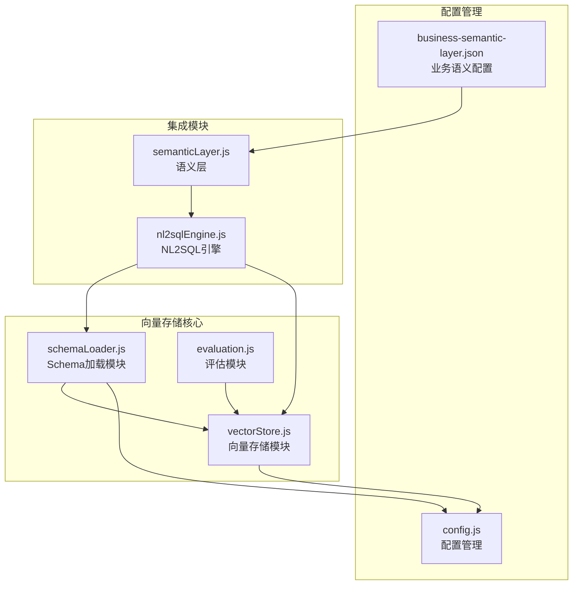
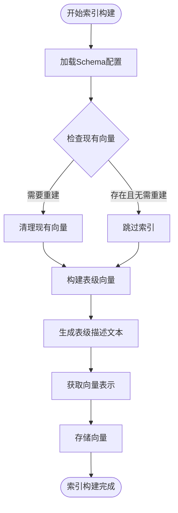
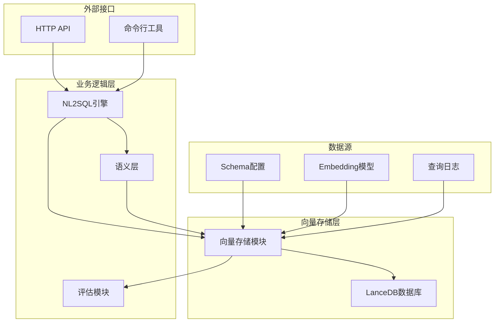
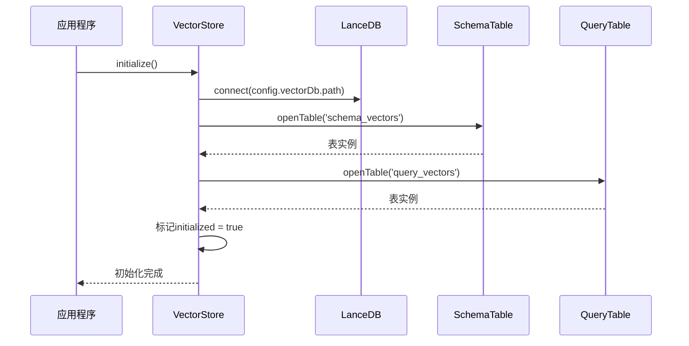
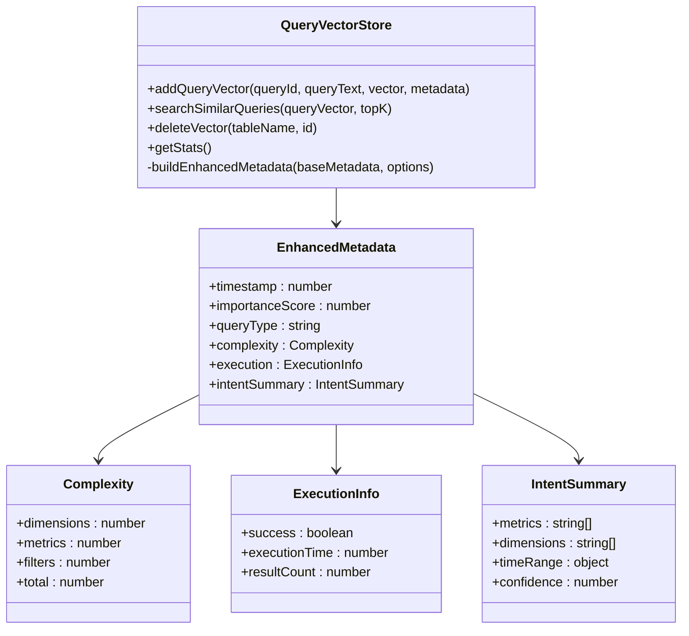
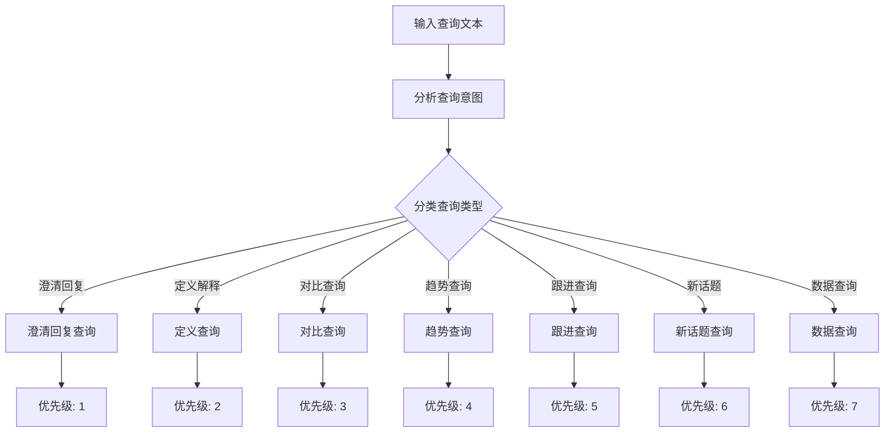
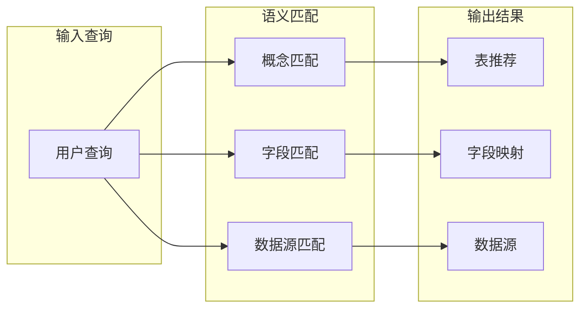
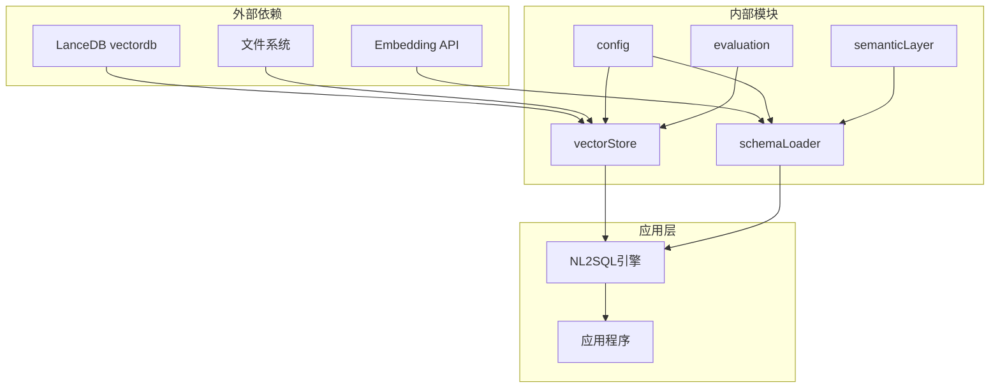

# 向量存储系统

<cite>
**本文档引用的文件**
- [vectorStore.js](file://backend/src/memory/vectorStore.js)
- [config.js](file://backend/src/core/config.js)
- [evaluation.js](file://backend/src/utils/evaluation.js)
- [schemaLoader.js](file://backend/src/core/schemaLoader.js)
- [semanticLayer.js](file://backend/src/core/semanticLayer.js)
- [business-semantic-layer.json](file://backend/config/business-semantic-layer.json)
- [package.json](file://backend/package.json)
- [nl2sqlEngine.js](file://backend/src/core/nl2sqlEngine.js)
</cite>

## 目录
1. [简介](#简介)
2. [项目结构](#项目结构)
3. [核心组件](#核心组件)
4. [架构概览](#架构概览)
5. [详细组件分析](#详细组件分析)
6. [依赖关系分析](#依赖关系分析)
7. [性能考虑](#性能考虑)
8. [故障排查指南](#故障排查指南)
9. [结论](#结论)
10. [附录](#附录)

## 简介

NL2SQL向量存储系统是一个基于LanceDB的语义检索基础设施，专为自然语言到SQL转换系统设计。该系统通过向量化技术实现了智能的Schema表推荐、查询历史相似性检索和业务语义理解功能。

系统的核心目标是：
- 提供高效的语义相似度搜索能力
- 支持多维度的查询意图识别和分类
- 实现智能的表推荐和过滤机制
- 构建可扩展的长期记忆系统

## 项目结构

向量存储系统主要分布在以下模块中：



**图表来源**
- [vectorStore.js:1-800](file://backend/src/memory/vectorStore.js#L1-L800)
- [schemaLoader.js:1-800](file://backend/src/core/schemaLoader.js#L1-L800)
- [config.js:1-398](file://backend/src/core/config.js#L1-L398)

**章节来源**
- [vectorStore.js:1-800](file://backend/src/memory/vectorStore.js#L1-L800)
- [schemaLoader.js:1-800](file://backend/src/core/schemaLoader.js#L1-L800)
- [config.js:1-398](file://backend/src/core/config.js#L1-L398)

## 核心组件

### LanceDB向量数据库集成

系统采用LanceDB作为底层向量数据库，提供了高性能的向量存储和相似度搜索能力。

**关键特性：**
- 基于文件系统的向量数据库，无需额外的数据库服务
- 支持向量索引和元数据过滤
- 内置的向量搜索API
- 跨平台兼容性

**数据存储结构：**
- `schema_vectors`: 存储Schema元数据的向量表示
- `query_vectors`: 存储查询历史的向量表示

**章节来源**
- [vectorStore.js:233-324](file://backend/src/memory/vectorStore.js#L233-L324)
- [config.js:106-109](file://backend/src/core/config.js#L106-L109)

### 向量索引构建

系统实现了两种主要的向量索引策略：

1. **表级向量索引**：每个数据库表生成单一向量表示
2. **字段级向量索引**：单个字段生成独立向量（已优化为表级）

**索引构建流程：**


**图表来源**
- [schemaLoader.js:210-285](file://backend/src/core/schemaLoader.js#L210-L285)
- [schemaLoader.js:300-340](file://backend/src/core/schemaLoader.js#L300-L340)

**章节来源**
- [schemaLoader.js:200-285](file://backend/src/core/schemaLoader.js#L200-L285)
- [schemaLoader.js:287-431](file://backend/src/core/schemaLoader.js#L287-L431)

### 相似度计算算法

系统实现了多种相似度计算方法：

**余弦相似度计算：**
- 基于向量点积和范数计算
- 输出范围[0,1]的相似度分数
- 用于查询历史相似性评估

**智能搜索重排序：**
- 结合查询意图识别
- 基于业务规则的优先级调整
- 多维度评分机制

**章节来源**
- [evaluation.js:134-147](file://backend/src/utils/evaluation.js#L134-L147)
- [vectorStore.js:452-576](file://backend/src/memory/vectorStore.js#L452-L576)

## 架构概览



**图表来源**
- [nl2sqlEngine.js:1-200](file://backend/src/core/nl2sqlEngine.js#L1-L200)
- [vectorStore.js:1-800](file://backend/src/memory/vectorStore.js#L1-L800)
- [semanticLayer.js:1-532](file://backend/src/core/semanticLayer.js#L1-L532)

## 详细组件分析

### 向量存储模块

向量存储模块是整个系统的核心，负责LanceDB数据库的连接、表管理和向量操作。

#### 初始化流程



**图表来源**
- [vectorStore.js:233-263](file://backend/src/memory/vectorStore.js#L233-L263)
- [vectorStore.js:269-324](file://backend/src/memory/vectorStore.js#L269-L324)

#### Schema向量操作

系统支持Schema向量的增删改查操作：

**添加Schema向量：**
- 批量处理多个表的向量
- 自动生成唯一ID
- 支持元数据JSON序列化

**搜索Schema向量：**
- 支持元数据过滤
- 智能搜索重排序
- 结果后过滤机制

**章节来源**
- [vectorStore.js:338-437](file://backend/src/memory/vectorStore.js#L338-L437)
- [vectorStore.js:452-576](file://backend/src/memory/vectorStore.js#L452-L576)

### 查询历史向量模块

查询历史向量模块专门用于存储和检索用户的查询历史，实现查询推荐和模式识别功能。

#### 查询向量操作



**图表来源**
- [vectorStore.js:619-687](file://backend/src/memory/vectorStore.js#L619-L687)
- [vectorStore.js:141-197](file://backend/src/memory/vectorStore.js#L141-L197)

**章节来源**
- [vectorStore.js:619-752](file://backend/src/memory/vectorStore.js#L619-L752)

### 智能搜索算法

系统实现了基于查询意图识别的智能搜索算法，能够根据查询内容自动调整搜索策略。

#### 意图分类机制



**图表来源**
- [vectorStore.js:93-132](file://backend/src/memory/vectorStore.js#L93-L132)

#### 重要性评分计算

系统实现了动态的重要性评分机制，综合考虑查询的复杂度、成功率和置信度等因素。

**评分因素：**
- 查询维度数量（最多+0.15）
- 指标数量（最多+0.15）
- 筛选条件数量（最多+0.1）
- 成功状态（+0.1）
- 高置信度（+0.1）
- 上下文查询（+0.05）

**章节来源**
- [vectorStore.js:50-84](file://backend/src/memory/vectorStore.js#L50-L84)
- [vectorStore.js:93-132](file://backend/src/memory/vectorStore.js#L93-L132)

### 业务语义层集成

系统集成了业务语义层，将业务概念映射到具体的物理表和字段。

#### 业务概念匹配



**图表来源**
- [semanticLayer.js:134-167](file://backend/src/core/semanticLayer.js#L134-L167)
- [semanticLayer.js:238-306](file://backend/src/core/semanticLayer.js#L238-L306)

**章节来源**
- [semanticLayer.js:1-532](file://backend/src/core/semanticLayer.js#L1-L532)
- [business-semantic-layer.json:1-189](file://backend/config/business-semantic-layer.json#L1-L189)

## 依赖关系分析



**图表来源**
- [package.json:10-20](file://backend/package.json#L10-L20)
- [vectorStore.js:14-23](file://backend/src/memory/vectorStore.js#L14-L23)
- [schemaLoader.js:19-26](file://backend/src/core/schemaLoader.js#L19-L26)

**章节来源**
- [package.json:1-28](file://backend/package.json#L1-L28)
- [vectorStore.js:14-23](file://backend/src/memory/vectorStore.js#L14-L23)

## 性能考虑

### ANN近似最近邻搜索

系统当前使用LanceDB的内置向量搜索功能，支持高效的近似最近邻搜索。虽然代码中展示了向量距离计算的实现，但实际的ANN搜索由LanceDB底层库处理。

### 缓存策略

系统实现了多层次的缓存机制：

1. **Schema缓存**：Schema元数据缓存，支持过期时间控制
2. **向量缓存**：向量存储的内存缓存
3. **查询结果缓存**：智能搜索的结果缓存

### 批量查询处理

系统支持批量向量操作，包括：
- 批量添加Schema向量
- 批量查询相似查询
- 批量更新向量

### 性能优化技术

**查询优化策略：**
- 搜索更多结果用于后过滤（topK*2或topK*3）
- 智能重排序算法
- 元数据过滤预处理
- 缓存命中率优化

**内存管理：**
- 动态内存分配
- 及时的垃圾回收
- 内存使用监控

## 故障排查指南

### 常见问题诊断

**向量数据库初始化失败：**
- 检查LanceDB安装状态
- 验证数据库路径权限
- 确认磁盘空间充足

**向量搜索无结果：**
- 验证向量是否正确生成
- 检查元数据过滤条件
- 确认查询向量维度匹配

**性能问题：**
- 监控向量搜索延迟
- 检查索引构建状态
- 优化查询参数

### 日志分析

系统提供了详细的日志记录机制，包括：
- 初始化过程日志
- 搜索操作日志
- 错误异常日志
- 性能统计日志

**章节来源**
- [vectorStore.js:258-262](file://backend/src/memory/vectorStore.js#L258-L262)
- [evaluation.js:71-96](file://backend/src/utils/evaluation.js#L71-L96)

## 结论

NL2SQL向量存储系统通过LanceDB实现了高效、可扩展的语义检索能力。系统的主要优势包括：

1. **架构清晰**：模块化设计，职责分离明确
2. **性能优异**：基于LanceDB的向量索引，支持大规模数据检索
3. **智能化程度高**：结合查询意图识别和业务规则的智能搜索
4. **可扩展性强**：支持增量更新和动态配置
5. **监控完善**：内置评估和统计功能

未来可以进一步优化的方向：
- 实现更精细的向量索引策略
- 增加向量压缩和存储优化
- 扩展多模态向量支持
- 增强分布式部署能力

## 附录

### 配置参数说明

| 参数名 | 默认值 | 描述 |
|--------|--------|------|
| VECTOR_DB_PATH | ./data/vectordb | 向量数据库存储路径 |
| EMBEDDING_MODEL | text-embedding-3-small | Embedding模型名称 |
| EMBEDDING_DIMENSION | 1536 | 向量维度 |
| SCHEMA_REVECTORIZE | false | 是否强制重新向量化 |

### 查询示例

**基本向量搜索：**
```javascript
// 获取查询向量
const queryVector = await llmService.getEmbedding("用户注册统计");
// 搜索相关Schema
const results = await vectorStore.searchSchema(queryVector, 5);
```

**智能搜索：**
```javascript
// 智能搜索（带意图识别）
const smartResults = await vectorStore.searchSchemaSmart(
    queryVector, 
    "青木游戏的付费用户统计", 
    5
);
```

**查询历史检索：**
```javascript
// 搜索相似查询
const similarQueries = await vectorStore.searchSimilarQueries(
    queryVector, 
    5
);
```

### 性能基准测试

系统提供了内置的评估框架，支持：
- 向量化质量评估
- 查询相似度测试
- 性能统计分析
- 命中率统计

**章节来源**
- [config.js:106-109](file://backend/src/core/config.js#L106-L109)
- [config.js:80-87](file://backend/src/core/config.js#L80-L87)
- [evaluation.js:158-266](file://backend/src/utils/evaluation.js#L158-L266)