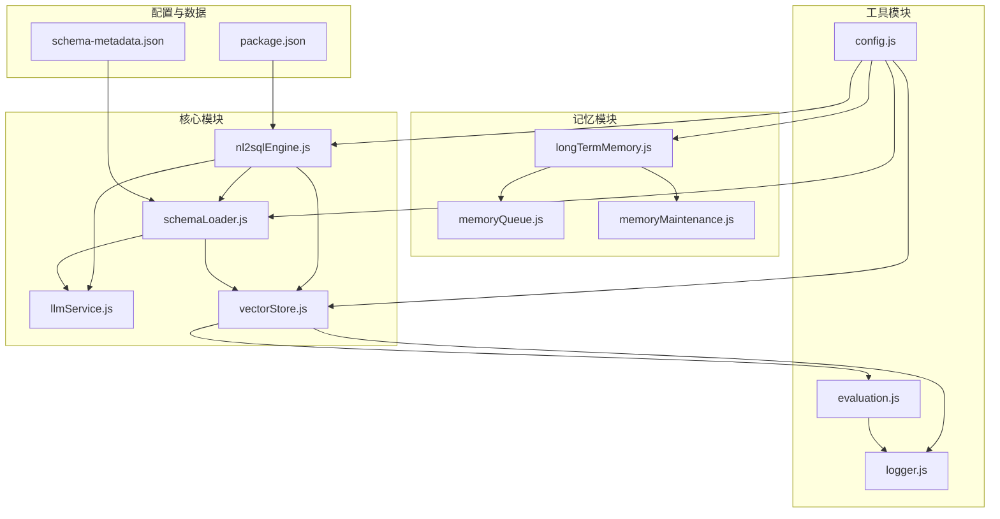
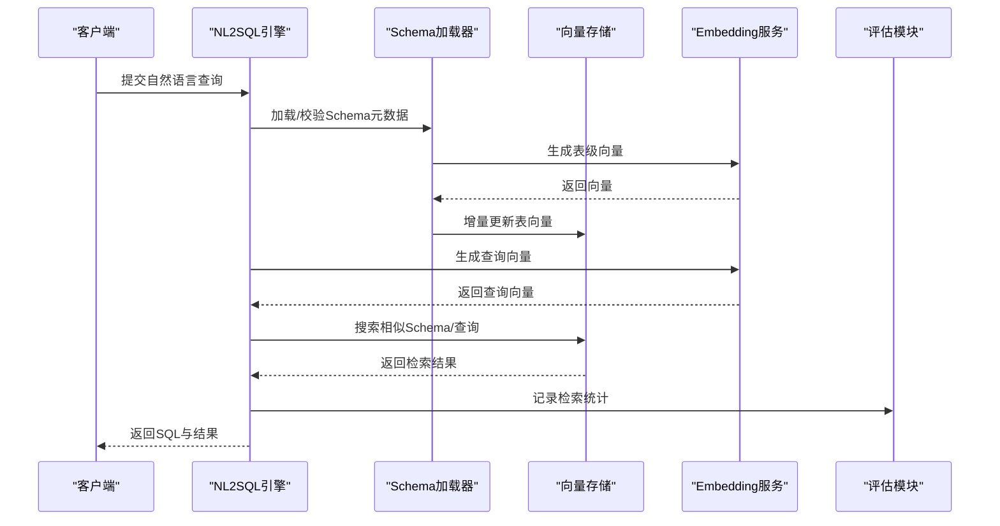
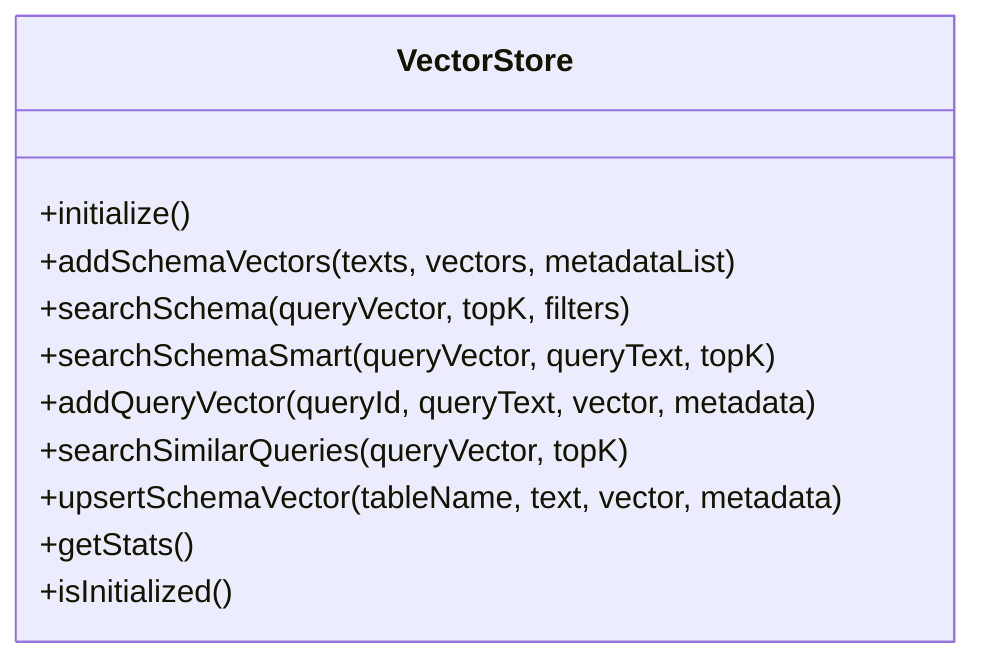
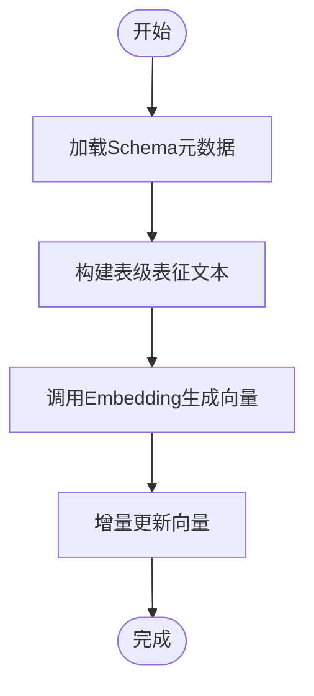
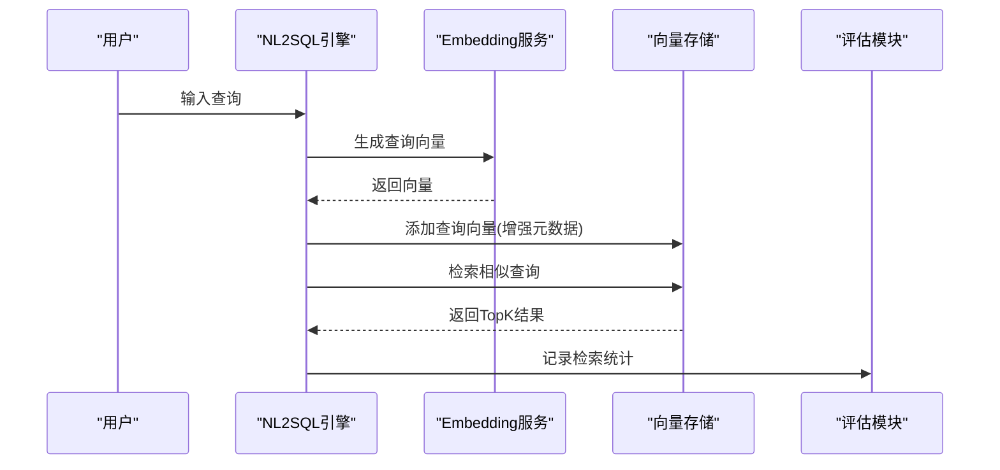
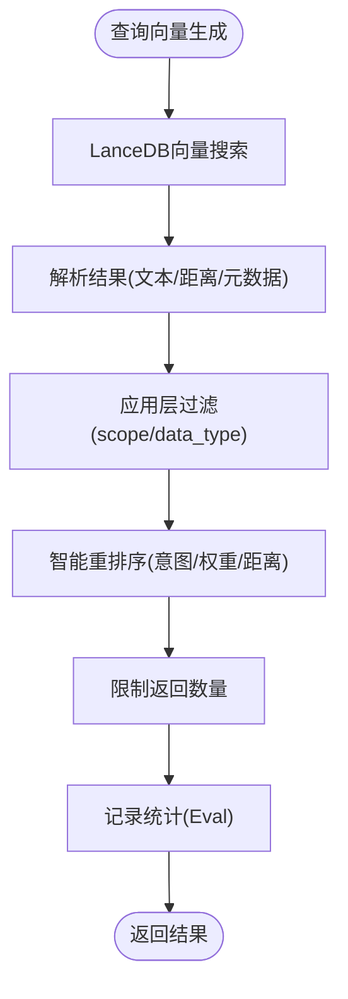
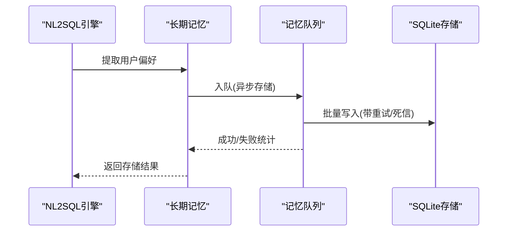
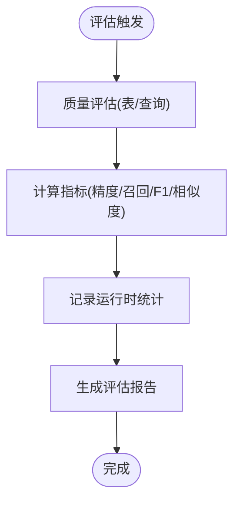
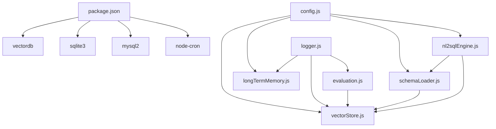

# 向量存储系统

<cite>
**本文档引用的文件**
- [vectorStore.js](file://backend/src/memory/vectorStore.js)
- [longTermMemory.js](file://backend/src/memory/longTermMemory.js)
- [memoryQueue.js](file://backend/src/memory/memoryQueue.js)
- [memoryMaintenance.js](file://backend/src/memory/memoryMaintenance.js)
- [evaluation.js](file://backend/src/utils/evaluation.js)
- [logger.js](file://backend/src/utils/logger.js)
- [config.js](file://backend/src/core/config.js)
- [schemaLoader.js](file://backend/src/core/schemaLoader.js)
- [llmService.js](file://backend/src/core/llmService.js)
- [nl2sqlEngine.js](file://backend/src/core/nl2sqlEngine.js)
- [schema-metadata.json](file://backend/config/schema-metadata.json)
- [package.json](file://backend/package.json)
</cite>

## 目录
1. [简介](#简介)
2. [项目结构](#项目结构)
3. [核心组件](#核心组件)
4. [架构概览](#架构概览)
5. [详细组件分析](#详细组件分析)
6. [依赖分析](#依赖分析)
7. [性能考虑](#性能考虑)
8. [故障排查指南](#故障排查指南)
9. [结论](#结论)
10. [附录](#附录)

## 简介
本技术文档面向 NL2SQL 向量存储系统，围绕 Schema 向量化、查询向量管理、语义检索实现、性能优化、质量评估与监控等方面进行全面阐述。系统基于 LanceDB 实现向量存储与检索，结合增量更新、智能搜索与长期记忆机制，支撑自然语言到 SQL 的高效语义检索与推荐。

## 项目结构
向量存储系统主要位于后端工程的 memory 与 core 目录中，配合 utils 提供日志、评估与配置管理，形成完整的向量化与检索闭环。

**图表来源**
- [nl2sqlEngine.js:1-200](file://backend/src/core/nl2sqlEngine.js#L1-200)
- [schemaLoader.js:1-200](file://backend/src/core/schemaLoader.js#L1-200)
- [llmService.js:1-200](file://backend/src/core/llmService.js#L1-200)
- [vectorStore.js:1-200](file://backend/src/memory/vectorStore.js#L1-200)
- [longTermMemory.js:1-200](file://backend/src/memory/longTermMemory.js#L1-200)
- [memoryQueue.js:1-200](file://backend/src/memory/memoryQueue.js#L1-200)
- [memoryMaintenance.js:1-200](file://backend/src/memory/memoryMaintenance.js#L1-200)
- [evaluation.js:1-200](file://backend/src/utils/evaluation.js#L1-200)
- [logger.js:1-200](file://backend/src/utils/logger.js#L1-200)
- [config.js:1-200](file://backend/src/core/config.js#L1-200)
- [schema-metadata.json:1-200](file://backend/config/schema-metadata.json#L1-200)
- [package.json:1-36](file://backend/package.json#L1-36)

**章节来源**
- [nl2sqlEngine.js:1-200](file://backend/src/core/nl2sqlEngine.js#L1-200)
- [schemaLoader.js:1-200](file://backend/src/core/schemaLoader.js#L1-200)
- [vectorStore.js:1-200](file://backend/src/memory/vectorStore.js#L1-200)

## 核心组件
- 向量存储模块：基于 LanceDB 的 Schema 与查询历史向量存储、检索与维护。
- Schema 向量化：从元数据构建表级表征，调用 Embedding 生成向量并增量更新。
- 查询向量管理：实时生成查询向量、元数据增强、相似度检索与缓存策略。
- 语义检索：LanceDB 集成、向量索引、智能搜索与过滤重排序。
- 长期记忆：偏好抽取、异步存储队列、分级保留与压缩。
- 评估与监控：向量化质量评估、命中率统计、运行时指标导出。

**章节来源**
- [vectorStore.js:1-200](file://backend/src/memory/vectorStore.js#L1-200)
- [schemaLoader.js:200-400](file://backend/src/core/schemaLoader.js#L200-400)
- [evaluation.js:1-200](file://backend/src/utils/evaluation.js#L1-200)
- [longTermMemory.js:1-200](file://backend/src/memory/longTermMemory.js#L1-200)
- [memoryQueue.js:1-200](file://backend/src/memory/memoryQueue.js#L1-200)
- [memoryMaintenance.js:1-200](file://backend/src/memory/memoryMaintenance.js#L1-200)

## 架构概览
系统采用“配置驱动 + 模块化”的架构，核心流程如下：

**图表来源**
- [nl2sqlEngine.js:121-200](file://backend/src/core/nl2sqlEngine.js#L121-200)
- [schemaLoader.js:210-285](file://backend/src/core/schemaLoader.js#L210-285)
- [vectorStore.js:340-439](file://backend/src/memory/vectorStore.js#L340-439)
- [evaluation.js:71-96](file://backend/src/utils/evaluation.js#L71-96)
- [llmService.js:1-200](file://backend/src/core/llmService.js#L1-200)

## 详细组件分析

### 向量存储模块（LanceDB 集成）
- 初始化与表管理：连接 LanceDB，自动创建 schema_vectors 与 query_vectors 表，支持初始化状态检查与统计。
- Schema 向量：批量添加、智能搜索（带意图识别与重排序）、过滤与应用层后过滤、统计记录。
- 查询向量：添加查询向量、相似查询检索、统计记录。
- 增量更新：基于内容哈希的 upsert，避免重复 Embedding 调用，支持软删除标记与后续清理。
- 元数据增强：重要性评分、查询类型分类、复杂度统计、执行信息汇总。

**图表来源**
- [vectorStore.js:235-927](file://backend/src/memory/vectorStore.js#L235-927)

**章节来源**
- [vectorStore.js:235-927](file://backend/src/memory/vectorStore.js#L235-927)

### Schema 向量化流程
- 元数据来源：schema-metadata.json 定义表结构、字段与描述。
- 表级表征：构建包含域标签、类型、功能与核心特征的文本，提升检索区分度。
- 向量生成：调用 Embedding 服务生成向量，使用增量更新避免重复计算。
- 元数据标签：scope（域）、data_type（数据源类型）、key_features（核心特征）等，支持检索过滤与重排序。

**图表来源**
- [schemaLoader.js:210-285](file://backend/src/core/schemaLoader.js#L210-285)
- [schemaLoader.js:300-340](file://backend/src/core/schemaLoader.js#L300-340)
- [schemaLoader.js:351-400](file://backend/src/core/schemaLoader.js#L351-400)

**章节来源**
- [schemaLoader.js:200-400](file://backend/src/core/schemaLoader.js#L200-400)
- [schema-metadata.json:1-200](file://backend/config/schema-metadata.json#L1-200)

### 查询向量管理机制
- 实时生成：根据用户查询文本生成向量，记录元数据（重要性、类型、复杂度、执行信息）。
- 缓存策略：通过 upsert 的内容哈希避免重复向量化；查询历史表支持相似查询检索。
- 相似度计算：支持余弦相似度评估与检索命中率统计，便于质量评估与监控。

**图表来源**
- [vectorStore.js:600-667](file://backend/src/memory/vectorStore.js#L600-667)
- [evaluation.js:71-96](file://backend/src/utils/evaluation.js#L71-96)

**章节来源**
- [vectorStore.js:600-667](file://backend/src/memory/vectorStore.js#L600-667)
- [evaluation.js:71-96](file://backend/src/utils/evaluation.js#L71-96)

### 语义检索实现原理
- LanceDB 集成：自动创建表、向量搜索、应用层过滤与重排序。
- 智能搜索：基于查询文本识别意图（如提及具体游戏），动态调整优先级权重（平台权重、原始日志优先、报表降权、向量距离归一化）。
- 过滤与重排序：支持 scope、data_type 等元数据过滤，结合距离与业务规则综合排序。

**图表来源**
- [vectorStore.js:454-578](file://backend/src/memory/vectorStore.js#L454-578)
- [vectorStore.js:382-439](file://backend/src/memory/vectorStore.js#L382-439)

**章节来源**
- [vectorStore.js:382-578](file://backend/src/memory/vectorStore.js#L382-578)

### 长期记忆与异步存储
- 偏好提取：基于查询意图与置信度，结合高频模式、高价值模板与 LLM 智能分析，提取字段别名、指标/维度偏好与查询模式。
- 异步队列：内存队列批处理、指数退避重试、失败持久化（死信队列）、队列长度保护与指标导出。
- 维护与压缩：分级保留策略（高频永久、中频90天、低频30天、字段别名365天）、相似模式合并、健康报告生成。

**图表来源**
- [longTermMemory.js:299-486](file://backend/src/memory/longTermMemory.js#L299-486)
- [memoryQueue.js:66-215](file://backend/src/memory/memoryQueue.js#L66-215)
- [memoryMaintenance.js:69-120](file://backend/src/memory/memoryMaintenance.js#L69-120)

**章节来源**
- [longTermMemory.js:299-486](file://backend/src/memory/longTermMemory.js#L299-486)
- [memoryQueue.js:66-215](file://backend/src/memory/memoryQueue.js#L66-215)
- [memoryMaintenance.js:69-195](file://backend/src/memory/memoryMaintenance.js#L69-195)

### 评估与监控
- 向量化质量评估：支持 Schema 表检索质量与查询相似度评估，计算精度、召回、F1、余弦相似度误差等指标。
- 运行时统计：记录向量检索命中率、距离分布、长期记忆命中率与类型分布。
- 配置开关：通过环境变量启用评估与统计跟踪，避免影响主流程。

**图表来源**
- [evaluation.js:158-266](file://backend/src/utils/evaluation.js#L158-266)
- [evaluation.js:276-334](file://backend/src/utils/evaluation.js#L276-334)
- [evaluation.js:344-407](file://backend/src/utils/evaluation.js#L344-407)

**章节来源**
- [evaluation.js:158-407](file://backend/src/utils/evaluation.js#L158-407)

## 依赖分析
- 外部依赖：vectordb（LanceDB 客户端）、sqlite3、mysql2、node-cron 等。
- 内部依赖：config 提供统一配置；logger 提供统一日志；evaluation 提供评估与统计；schemaLoader 负责向量化；vectorStore 负责存储与检索；longTermMemory/maintenance 提供记忆与维护；memoryQueue 提供异步存储保障。

**图表来源**
- [package.json:16-31](file://backend/package.json#L16-31)
- [config.js:20-396](file://backend/src/core/config.js#L20-396)
- [nl2sqlEngine.js:20-38](file://backend/src/core/nl2sqlEngine.js#L20-38)
- [schemaLoader.js:19-26](file://backend/src/core/schemaLoader.js#L19-26)
- [vectorStore.js:14-25](file://backend/src/memory/vectorStore.js#L14-25)
- [longTermMemory.js:17-22](file://backend/src/memory/longTermMemory.js#L17-22)
- [evaluation.js:12-13](file://backend/src/utils/evaluation.js#L12-13)

**章节来源**
- [package.json:16-31](file://backend/package.json#L16-31)
- [config.js:20-396](file://backend/src/core/config.js#L20-396)

## 性能考虑
- 批量操作：向量存储支持批量添加与批量写入，减少 I/O 次数。
- 增量更新：基于内容哈希的 upsert，避免重复 Embedding 调用，显著降低计算开销。
- 智能过滤与重排序：在应用层进行元数据过滤与优先级调整，减少无效检索。
- 异步存储：记忆队列批处理与指数退避，避免阻塞主流程。
- 配置优化：通过配置文件统一管理 Embedding 维度、超时、向量数据库路径等关键参数。

[本节为通用性能指导，无需特定文件引用]

## 故障排查指南
- 初始化失败：检查 LanceDB 路径与权限，确认配置项 VECTOR_DB_PATH 与 EMBEDDING_ENABLED。
- 向量检索无结果：确认 Schema 向量是否已生成，检查 hasSchemaVectors 与 getStats；验证查询向量生成与元数据增强。
- 评估未统计：确认 EVALUATION_ENABLED 与 EVALUATION_TRACK_STATS 开关；检查 recordVectorSearch 与 recordMemoryHit 调用。
- 队列积压：检查 memoryQueue 的队列长度、重试次数与死信写入；关注 MAX_RETRIES、QUEUE_MAX_SIZE 参数。
- 日志定位：使用 logger 的 trace/debug/info/warn/error 级别，结合 startTrace/endTrace 进行流程追踪。

**章节来源**
- [vectorStore.js:235-265](file://backend/src/memory/vectorStore.js#L235-265)
- [evaluation.js:71-96](file://backend/src/utils/evaluation.js#L71-96)
- [memoryQueue.js:66-215](file://backend/src/memory/memoryQueue.js#L66-215)
- [logger.js:276-448](file://backend/src/utils/logger.js#L276-448)

## 结论
NL2SQL 向量存储系统通过表级向量化、智能检索与长期记忆机制，实现了高效的语义检索与偏好学习。系统具备良好的扩展性与稳定性，支持增量更新、异步存储与评估监控，能够持续优化检索质量与用户体验。

[本节为总结性内容，无需特定文件引用]

## 附录

### 配置要点
- Embedding 配置：模型、维度、超时等，影响向量质量与性能。
- 向量数据库路径：VECTOR_DB_PATH 控制 LanceDB 数据目录。
- 评估开关：EVALUATION_ENABLED/EVALUATION_TRACK_STATS 控制评估与统计。
- Schema 重向量化：SCHEMA_REVECTORIZE 控制是否强制重新生成向量。

**章节来源**
- [config.js:84-116](file://backend/src/core/config.js#L84-116)
- [config.js:383-395](file://backend/src/core/config.js#L383-395)

### 监控指标
- 向量检索命中率：schema/query 的检索次数与命中次数。
- 距离分布：非常接近/接近/适中/较远的分布统计。
- 长期记忆命中率：总体与按类型的命中率统计。
- 记忆队列指标：入队、成功、重试、死信、队列长度等。

**章节来源**
- [evaluation.js:344-407](file://backend/src/utils/evaluation.js#L344-407)
- [memoryQueue.js:254-260](file://backend/src/memory/memoryQueue.js#L254-260)