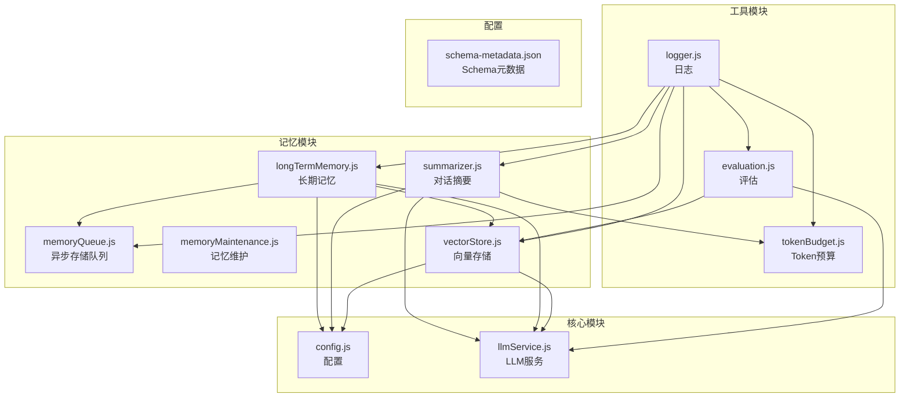
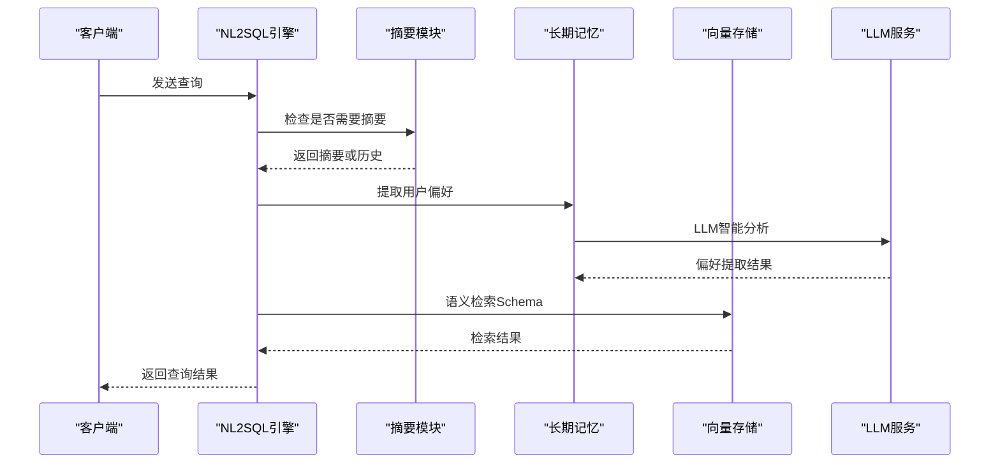
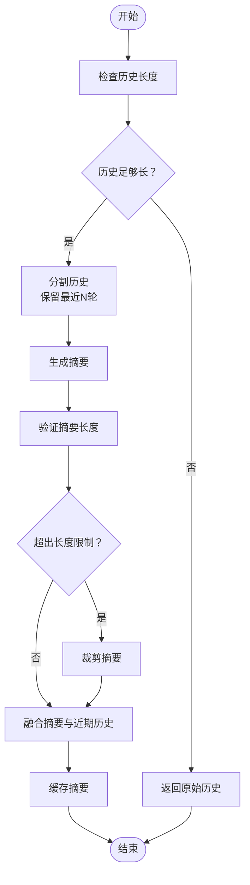
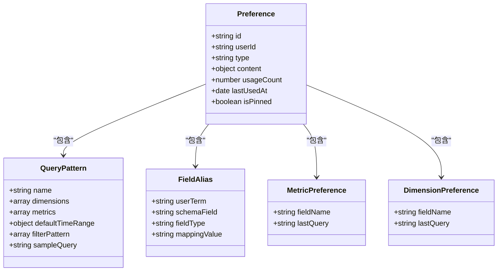
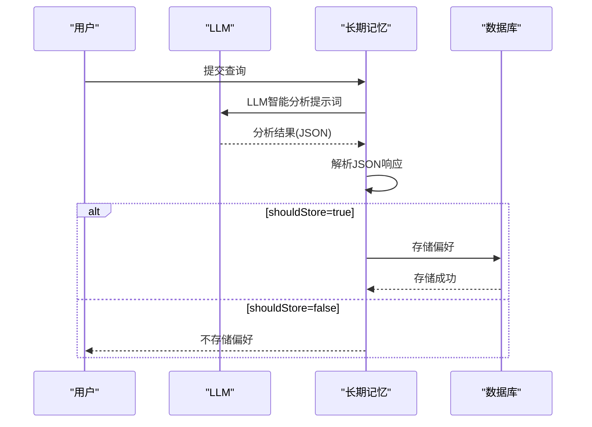
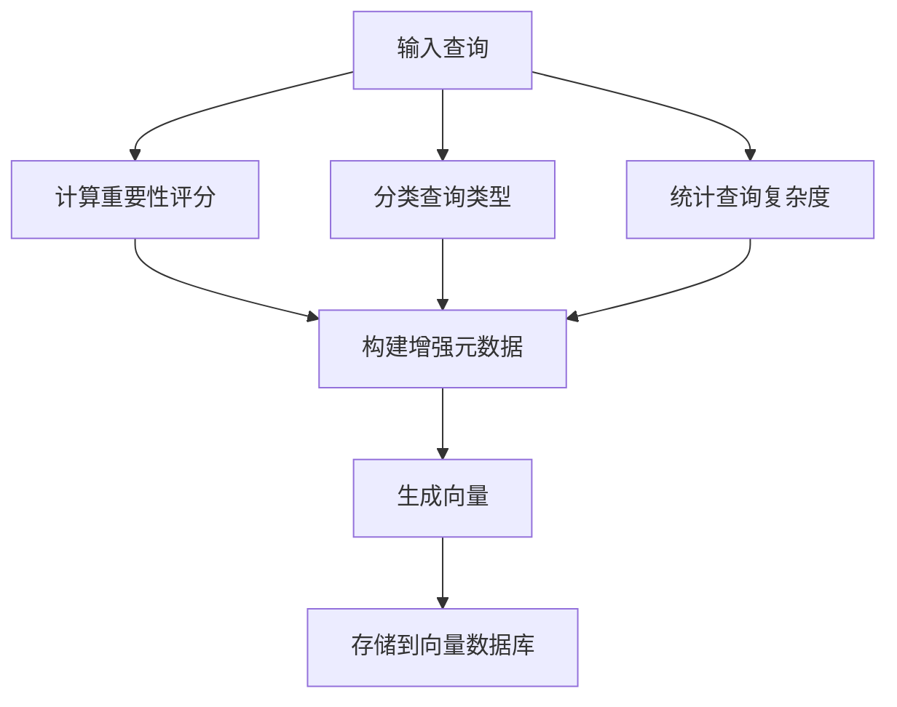
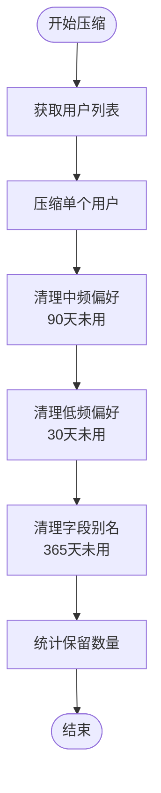
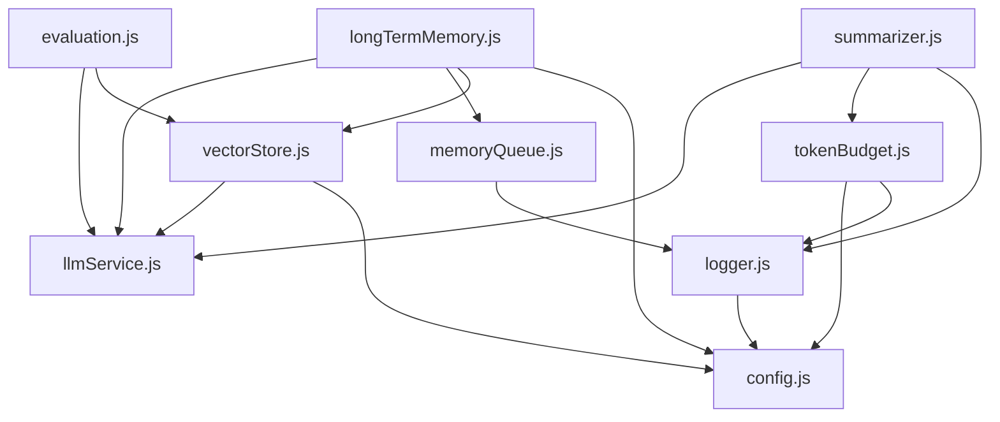

# 记忆摘要生成

<cite>
**本文档引用的文件**
- [summarizer.js](file://backend/src/memory/summarizer.js)
- [longTermMemory.js](file://backend/src/memory/longTermMemory.js)
- [memoryQueue.js](file://backend/src/memory/memoryQueue.js)
- [memoryMaintenance.js](file://backend/src/memory/memoryMaintenance.js)
- [vectorStore.js](file://backend/src/memory/vectorStore.js)
- [tokenBudget.js](file://backend/src/utils/tokenBudget.js)
- [evaluation.js](file://backend/src/utils/evaluation.js)
- [config.js](file://backend/src/core/config.js)
- [llmService.js](file://backend/src/core/llmService.js)
- [logger.js](file://backend/src/utils/logger.js)
- [schema-metadata.json](file://backend/config/schema-metadata.json)
</cite>

## 目录
1. [简介](#简介)
2. [项目结构](#项目结构)
3. [核心组件](#核心组件)
4. [架构概览](#架构概览)
5. [详细组件分析](#详细组件分析)
6. [依赖分析](#依赖分析)
7. [性能考虑](#性能考虑)
8. [故障排查指南](#故障排查指南)
9. [结论](#结论)
10. [附录](#附录)

## 简介
本文件面向NL2SQL记忆摘要生成系统，提供全面的技术文档。重点涵盖：
- 记忆内容的智能摘要算法：文本压缩技术、关键信息提取策略、语义保留机制
- 摘要生成的触发条件与时机选择：长文本处理、重复内容检测、摘要更新策略
- 摘要存储格式设计：元数据结构、版本管理、增量更新机制
- 摘要检索优化技术：快速查找算法、模糊匹配、相关性评分
- 摘要质量评估指标、性能基准测试与存储空间优化方案
- 不同场景下的摘要生成示例与最佳实践指导

## 项目结构
NL2SQL后端采用模块化设计，记忆摘要相关功能主要分布在以下模块：
- memory：记忆摘要与长期记忆管理
- utils：工具模块（Token预算、评估、日志）
- core：核心服务（LLM服务、配置）
- config：配置文件（Schema元数据）

图表来源
- [summarizer.js:1-530](file://backend/src/memory/summarizer.js#L1-L530)
- [longTermMemory.js:1-800](file://backend/src/memory/longTermMemory.js#L1-L800)
- [memoryQueue.js:1-217](file://backend/src/memory/memoryQueue.js#L1-L217)
- [memoryMaintenance.js:1-421](file://backend/src/memory/memoryMaintenance.js#L1-L421)
- [vectorStore.js:1-948](file://backend/src/memory/vectorStore.js#L1-L948)
- [tokenBudget.js:1-435](file://backend/src/utils/tokenBudget.js#L1-L435)
- [evaluation.js:1-488](file://backend/src/utils/evaluation.js#L1-L488)
- [config.js:1-398](file://backend/src/core/config.js#L1-L398)
- [llmService.js:1-477](file://backend/src/core/llmService.js#L1-L477)
- [schema-metadata.json:1-800](file://backend/config/schema-metadata.json#L1-L800)

章节来源
- [summarizer.js:1-530](file://backend/src/memory/summarizer.js#L1-L530)
- [longTermMemory.js:1-800](file://backend/src/memory/longTermMemory.js#L1-L800)
- [memoryQueue.js:1-217](file://backend/src/memory/memoryQueue.js#L1-L217)
- [memoryMaintenance.js:1-421](file://backend/src/memory/memoryMaintenance.js#L1-L421)
- [vectorStore.js:1-948](file://backend/src/memory/vectorStore.js#L1-L948)
- [tokenBudget.js:1-435](file://backend/src/utils/tokenBudget.js#L1-L435)
- [evaluation.js:1-488](file://backend/src/utils/evaluation.js#L1-L488)
- [config.js:1-398](file://backend/src/core/config.js#L1-L398)
- [llmService.js:1-477](file://backend/src/core/llmService.js#L1-L477)
- [schema-metadata.json:1-800](file://backend/config/schema-metadata.json#L1-L800)

## 核心组件
本系统围绕三大核心组件构建：
- 对话摘要模块（summarizer.js）：负责长对话历史的自动摘要与压缩，支持缓存与增量更新
- 长期记忆模块（longTermMemory.js）：负责用户偏好与查询模式的提取、存储与维护，支持LLM智能分析
- 向量存储模块（vectorStore.js）：基于LanceDB实现Schema与查询历史的向量存储与语义检索

章节来源
- [summarizer.js:1-530](file://backend/src/memory/summarizer.js#L1-L530)
- [longTermMemory.js:1-800](file://backend/src/memory/longTermMemory.js#L1-L800)
- [vectorStore.js:1-948](file://backend/src/memory/vectorStore.js#L1-L948)

## 架构概览
系统采用分层架构：
- 表层：前端交互与路由
- 业务层：NL2SQL引擎、意图识别、查询分解
- 记忆层：对话摘要、长期记忆、向量检索
- 基础设施层：LLM服务、数据库、日志、评估

图表来源
- [summarizer.js:440-504](file://backend/src/memory/summarizer.js#L440-L504)
- [longTermMemory.js:58-190](file://backend/src/memory/longTermMemory.js#L58-L190)
- [vectorStore.js:452-576](file://backend/src/memory/vectorStore.js#L452-L576)
- [llmService.js:318-356](file://backend/src/core/llmService.js#L318-L356)

## 详细组件分析

### 对话摘要模块（summarizer.js）
该模块实现了完整的对话摘要生命周期管理，包括历史分割、摘要生成、增量更新、缓存与压缩。

#### 关键算法与策略
- 历史分割策略：将对话历史分为需要摘要的部分与保留的近期部分，保留最近N轮对话以维持上下文新鲜度
- 摘要生成策略：使用LLM将历史对话压缩为结构化摘要，包含查询主题、已确认信息、用户偏好、待解决问题等关键要素
- 增量更新策略：将新对话与现有摘要合并，去除重复信息，保持关键决策不变
- 缓存策略：基于会话ID的内存缓存，支持过期清理与更新间隔控制

图表来源
- [summarizer.js:58-95](file://backend/src/memory/summarizer.js#L58-L95)
- [summarizer.js:109-185](file://backend/src/memory/summarizer.js#L109-L185)
- [summarizer.js:264-331](file://backend/src/memory/summarizer.js#L264-L331)
- [summarizer.js:450-504](file://backend/src/memory/summarizer.js#L450-L504)

#### 触发条件与时机选择
- 轮数阈值：当对话轮数达到配置阈值时触发摘要
- Token阈值：当历史Token数超过预算阈值时触发压缩
- 更新间隔：基于会话轮数差控制摘要更新频率，避免频繁生成

章节来源
- [summarizer.js:23-34](file://backend/src/memory/summarizer.js#L23-L34)
- [summarizer.js:460-469](file://backend/src/memory/summarizer.js#L460-L469)
- [summarizer.js:481-493](file://backend/src/memory/summarizer.js#L481-L493)

### 长期记忆模块（longTermMemory.js）
该模块负责用户长期记忆的提取、存储、检索与维护，支持LLM智能分析与逻辑判断双重策略。

#### 偏好类型与存储策略
- 查询模式：高价值模板与高频模式，支持维度、指标、时间范围的组合
- 字段别名：用户术语与Schema字段的映射关系
- 指标偏好：用户常用的指标集合
- 维度偏好：用户常用的维度集合

图表来源
- [longTermMemory.js:591-635](file://backend/src/memory/longTermMemory.js#L591-L635)
- [longTermMemory.js:748-792](file://backend/src/memory/longTermMemory.js#L748-L792)

#### LLM智能分析流程
- 别名映射提取：识别用户术语与字段的映射关系
- 习惯模式识别：提取用户的分析习惯与偏好组合
- 业务逻辑定义：识别通用的过滤规则与计算口径
- 置信度评估：基于用户表述明确程度给出置信度评分

图表来源
- [longTermMemory.js:58-190](file://backend/src/memory/longTermMemory.js#L58-L190)
- [longTermMemory.js:343-461](file://backend/src/memory/longTermMemory.js#L343-L461)

章节来源
- [longTermMemory.js:28-43](file://backend/src/memory/longTermMemory.js#L28-L43)
- [longTermMemory.js:58-190](file://backend/src/memory/longTermMemory.js#L58-L190)
- [longTermMemory.js:299-461](file://backend/src/memory/longTermMemory.js#L299-L461)

### 向量存储模块（vectorStore.js）
该模块基于LanceDB实现Schema与查询历史的向量存储，支持语义相似度搜索与智能重排序。

#### 元数据增强与分类
- 重要性评分：基于查询复杂度、成功状态、置信度等因素计算
- 查询类型分类：定义数据查询、定义解释、对比查询、趋势查询、澄清回复、跟进查询、新话题等类型
- 复杂度统计：统计维度、指标、筛选器数量，形成复杂度指标

图表来源
- [vectorStore.js:50-84](file://backend/src/memory/vectorStore.js#L50-L84)
- [vectorStore.js:93-132](file://backend/src/memory/vectorStore.js#L93-L132)
- [vectorStore.js:141-197](file://backend/src/memory/vectorStore.js#L141-L197)

#### 智能搜索与重排序
- 意图识别：检测查询中提到的具体游戏，优先返回相关表
- 分层权重：根据表类型（平台核心、平台其他、报表、新平台库、老平台库）分配权重
- 距离归一化：将向量距离转换为优先级分数
- 动态重排序：结合多种策略对结果进行综合排序

章节来源
- [vectorStore.js:452-576](file://backend/src/memory/vectorStore.js#L452-L576)
- [vectorStore.js:586-605](file://backend/src/memory/vectorStore.js#L586-L605)

### 异步存储队列（memoryQueue.js）
为避免阻塞主流程，长期记忆的存储操作采用异步队列机制。

#### 队列管理策略
- 批量处理：每批处理固定数量的操作，提高吞吐量
- 并行执行：使用Promise.allSettled并行执行多个存储操作
- 间隔调度：通过定时器控制队列处理频率
- 状态监控：提供队列状态查询与等待完成接口

章节来源
- [memoryQueue.js:46-118](file://backend/src/memory/memoryQueue.js#L46-L118)
- [memoryQueue.js:160-202](file://backend/src/memory/memoryQueue.js#L160-L202)

### 记忆维护（memoryMaintenance.js）
负责长期记忆的定期压缩、清理和维护，实现分级保留策略。

#### 分级保留策略
- 高频偏好（≥10次）：永久保留
- 中频偏好（3-9次）：90天未用清理
- 低频偏好（<3次）：30天未用清理
- 字段别名：365天未用清理

图表来源
- [memoryMaintenance.js:69-120](file://backend/src/memory/memoryMaintenance.js#L69-L120)
- [memoryMaintenance.js:127-195](file://backend/src/memory/memoryMaintenance.js#L127-L195)

章节来源
- [memoryMaintenance.js:24-46](file://backend/src/memory/memoryMaintenance.js#L24-L46)
- [memoryMaintenance.js:69-120](file://backend/src/memory/memoryMaintenance.js#L69-L120)

## 依赖分析
系统各模块间存在清晰的依赖关系，遵循单一职责原则与依赖倒置原则。

图表来源
- [summarizer.js:12-14](file://backend/src/memory/summarizer.js#L12-L14)
- [longTermMemory.js:17-22](file://backend/src/memory/longTermMemory.js#L17-L22)
- [vectorStore.js:14-23](file://backend/src/memory/vectorStore.js#L14-L23)
- [memoryQueue.js](file://backend/src/memory/memoryQueue.js#L8)
- [tokenBudget.js:12-13](file://backend/src/utils/tokenBudget.js#L12-L13)
- [evaluation.js:12-13](file://backend/src/utils/evaluation.js#L12-L13)
- [config.js:16-398](file://backend/src/core/config.js#L16-L398)

章节来源
- [summarizer.js:1-530](file://backend/src/memory/summarizer.js#L1-L530)
- [longTermMemory.js:1-800](file://backend/src/memory/longTermMemory.js#L1-L800)
- [vectorStore.js:1-948](file://backend/src/memory/vectorStore.js#L1-L948)
- [memoryQueue.js:1-217](file://backend/src/memory/memoryQueue.js#L1-L217)
- [tokenBudget.js:1-435](file://backend/src/utils/tokenBudget.js#L1-L435)
- [evaluation.js:1-488](file://backend/src/utils/evaluation.js#L1-L488)
- [config.js:1-398](file://backend/src/core/config.js#L1-L398)

## 性能考虑
系统在多个层面进行了性能优化：

### Token预算管理
- 保守估算：基于字符数的Token估算，避免LLM上下文溢出
- 预算阈值：设置警告与压缩阈值，及时触发上下文压缩
- 智能压缩：根据历史对话与检索片段的比例选择最优压缩策略

### 异步处理
- 存储队列：将数据库写入操作异步化，避免阻塞主流程
- 批量处理：每批处理多个操作，提高I/O效率
- 并行执行：利用Promise.allSettled并行处理多个存储操作

### 缓存策略
- 内存缓存：基于会话ID的摘要缓存，支持过期清理
- 更新间隔：控制摘要更新频率，平衡准确性与时效性
- 智能复用：在缓存有效期内复用摘要，避免重复生成

### 向量检索优化
- 智能重排序：结合查询意图与表类型权重进行综合排序
- 距离归一化：将向量距离转换为优先级分数
- 过滤策略：支持按scope和data_type过滤，减少无关结果

## 故障排查指南
针对系统可能出现的问题，提供以下排查步骤：

### 摘要生成失败
1. 检查LLM服务配置与API密钥
2. 查看Token预算是否超限
3. 验证摘要长度限制设置
4. 检查日志中的错误信息

### 长期记忆存储异常
1. 检查数据库连接配置
2. 验证用户偏好类型与内容格式
3. 查看异步队列状态与错误日志
4. 确认存储阈值配置是否合理

### 向量检索性能问题
1. 检查向量维度与模型配置
2. 验证LanceDB数据库初始化状态
3. 查看检索结果的距离分布
4. 评估智能重排序策略效果

章节来源
- [logger.js:276-322](file://backend/src/utils/logger.js#L276-L322)
- [memoryQueue.js:140-149](file://backend/src/memory/memoryQueue.js#L140-L149)
- [vectorStore.js:233-263](file://backend/src/memory/vectorStore.js#L233-L263)

## 结论
NL2SQL记忆摘要生成系统通过模块化设计实现了高效的对话摘要、长期记忆管理与语义检索。系统具备完善的触发机制、缓存策略与性能优化措施，能够适应不同规模的查询场景。建议在生产环境中：
- 合理配置摘要阈值与缓存策略
- 监控Token预算使用情况
- 定期评估长期记忆质量
- 优化向量检索策略以提升用户体验

## 附录

### 配置参数参考
- 摘要配置：触发轮数、保留轮数、最大摘要Token数、更新间隔
- 长期记忆配置：阈值、保留策略、LLM启用开关
- Token预算配置：最大上下文Token数、输出预留Token数、阈值比例
- 向量存储配置：嵌入模型、维度、向量数据库路径

章节来源
- [config.js:259-333](file://backend/src/core/config.js#L259-L333)
- [summarizer.js:23-34](file://backend/src/memory/summarizer.js#L23-L34)
- [tokenBudget.js:29-44](file://backend/src/utils/tokenBudget.js#L29-L44)
- [vectorStore.js:80-87](file://backend/src/memory/vectorStore.js#L80-L87)

### Schema元数据结构
系统使用JSON格式的Schema元数据，包含表名、中文名称、描述、字段信息等。该元数据用于向量化与检索，支持复杂的查询场景。

章节来源
- [schema-metadata.json:1-800](file://backend/config/schema-metadata.json#L1-L800)