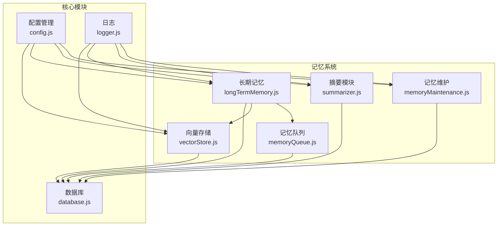
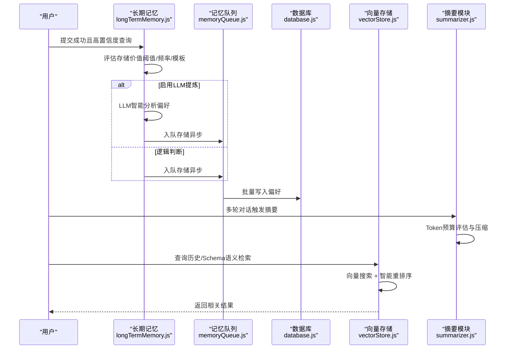
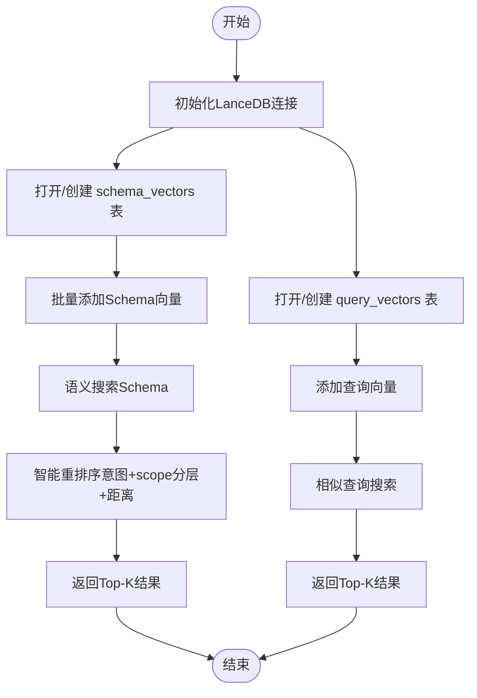
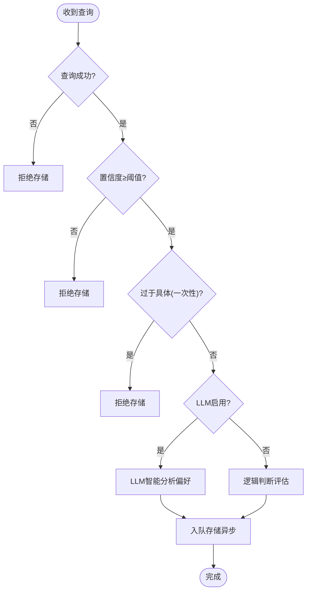
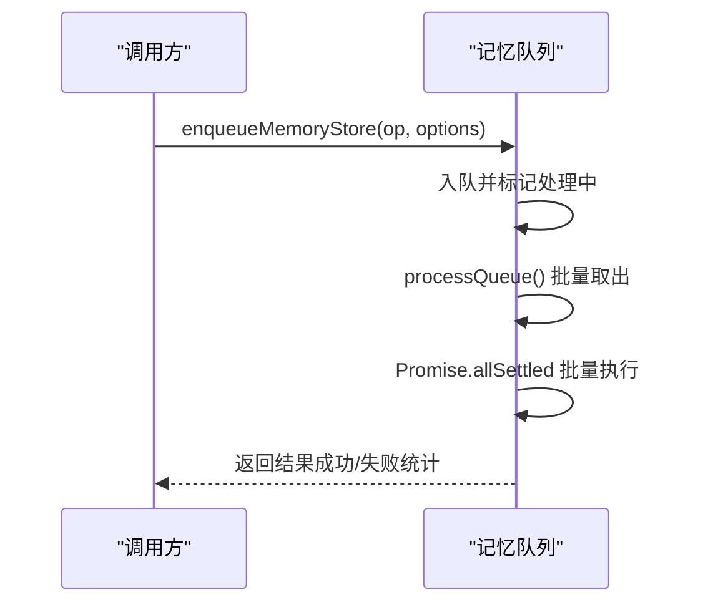
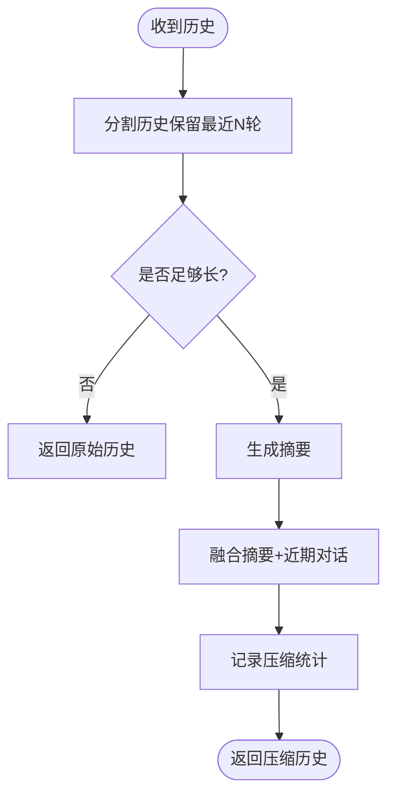
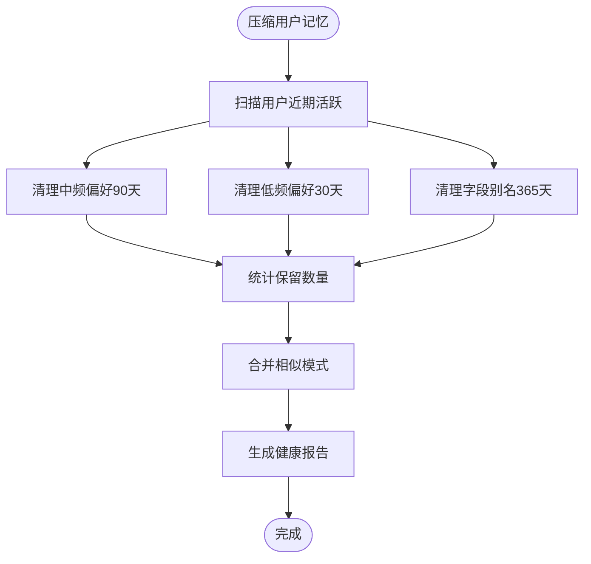
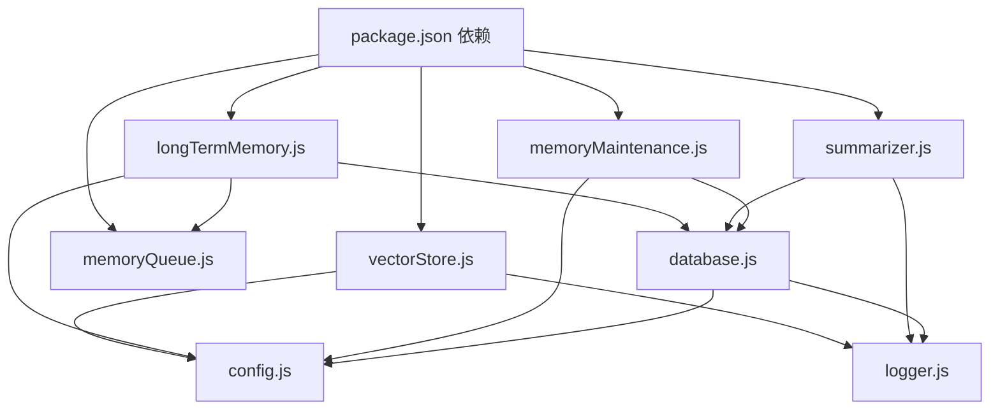

# 记忆系统

<cite>
**本文档引用的文件**
- [vectorStore.js](file://backend/src/memory/vectorStore.js)
- [longTermMemory.js](file://backend/src/memory/longTermMemory.js)
- [memoryQueue.js](file://backend/src/memory/memoryQueue.js)
- [summarizer.js](file://backend/src/memory/summarizer.js)
- [memoryMaintenance.js](file://backend/src/memory/memoryMaintenance.js)
- [config.js](file://backend/src/core/config.js)
- [database.js](file://backend/src/core/database.js)
- [logger.js](file://backend/src/utils/logger.js)
- [package.json](file://backend/package.json)
- [记忆系统优化计划.md](file://docs/记忆系统优化计划.md)
- [后端架构审查与优化方案.md](file://docs/后端架构审查与优化方案.md)
</cite>

## 目录
1. [简介](#简介)
2. [项目结构](#项目结构)
3. [核心组件](#核心组件)
4. [架构总览](#架构总览)
5. [详细组件分析](#详细组件分析)
6. [依赖关系分析](#依赖关系分析)
7. [性能考量](#性能考量)
8. [故障排查指南](#故障排查指南)
9. [结论](#结论)
10. [附录](#附录)

## 简介
本文件面向NL2SQL记忆系统，系统采用三层记忆架构：短期记忆（对话摘要与上下文压缩）、长期记忆（用户偏好与查询模式）、向量记忆（基于LanceDB的Schema与查询历史语义检索）。本文档深入解析三层架构的设计理念与实现原理，涵盖向量存储系统（LanceDB集成、语义检索算法、相似度计算）、记忆队列管理机制（异步存储、批处理、重试与清理）、记忆摘要生成算法（文本压缩、关键信息提取、存储优化），并提供配置选项、性能调优建议与扩展方法，辅以实际使用案例与最佳实践。

## 项目结构
记忆系统位于后端工程的memory目录，配合核心配置、数据库与日志模块协同工作。关键文件职责如下：
- vectorStore.js：封装LanceDB向量存储与Schema/查询历史的语义检索
- longTermMemory.js：长期记忆抽取、存储与筛选策略，支持LLM智能提炼
- memoryQueue.js：异步记忆存储队列，提升高并发性能
- summarizer.js：对话摘要与历史压缩，结合Token预算管理
- memoryMaintenance.js：长期记忆的分级清理与相似模式合并
- config.js：统一配置管理，包含记忆系统相关开关与阈值
- database.js：SQLite持久化，用户偏好与会话历史存储
- logger.js：统一日志，支持trace追踪与内存泄漏防护

图表来源
- [vectorStore.js:1-800](file://backend/src/memory/vectorStore.js#L1-L800)
- [longTermMemory.js:1-800](file://backend/src/memory/longTermMemory.js#L1-L800)
- [memoryQueue.js:1-217](file://backend/src/memory/memoryQueue.js#L1-L217)
- [summarizer.js:1-530](file://backend/src/memory/summarizer.js#L1-L530)
- [memoryMaintenance.js:1-421](file://backend/src/memory/memoryMaintenance.js#L1-L421)
- [config.js:1-398](file://backend/src/core/config.js#L1-L398)
- [database.js:1-800](file://backend/src/core/database.js#L1-L800)
- [logger.js:1-482](file://backend/src/utils/logger.js#L1-L482)

章节来源
- [vectorStore.js:1-800](file://backend/src/memory/vectorStore.js#L1-L800)
- [longTermMemory.js:1-800](file://backend/src/memory/longTermMemory.js#L1-L800)
- [memoryQueue.js:1-217](file://backend/src/memory/memoryQueue.js#L1-L217)
- [summarizer.js:1-530](file://backend/src/memory/summarizer.js#L1-L530)
- [memoryMaintenance.js:1-421](file://backend/src/memory/memoryMaintenance.js#L1-L421)
- [config.js:1-398](file://backend/src/core/config.js#L1-L398)
- [database.js:1-800](file://backend/src/core/database.js#L1-L800)
- [logger.js:1-482](file://backend/src/utils/logger.js#L1-L482)

## 核心组件
- 向量存储（Layer 3）：基于LanceDB实现Schema与查询历史的向量化存储与语义检索，支持智能搜索与过滤。
- 长期记忆（Layer 2）：从成功且高置信度的查询中抽取用户偏好（查询模式、字段别名、指标/维度偏好），支持LLM智能提炼与阈值筛选。
- 记忆队列（Layer 1）：异步化存储操作，批量处理与重试，避免阻塞主流程。
- 对话摘要（Layer 1）：基于Token预算的智能摘要与压缩，保留近期对话，减少上下文膨胀。
- 记忆维护（Layer 2）：分级保留策略（高频/中频/低频/别名）与相似模式合并，定期清理过期记忆。

章节来源
- [vectorStore.js:1-800](file://backend/src/memory/vectorStore.js#L1-L800)
- [longTermMemory.js:1-800](file://backend/src/memory/longTermMemory.js#L1-L800)
- [memoryQueue.js:1-217](file://backend/src/memory/memoryQueue.js#L1-L217)
- [summarizer.js:1-530](file://backend/src/memory/summarizer.js#L1-L530)
- [memoryMaintenance.js:1-421](file://backend/src/memory/memoryMaintenance.js#L1-L421)

## 架构总览
三层记忆架构协同工作机制：
- 短期记忆：对话摘要与上下文压缩，降低Token消耗，避免上下文断层。
- 长期记忆：偏好抽取与存储，形成可复用的查询模板与别名映射。
- 向量记忆：语义检索与智能排序，提升Schema表与查询历史的召回质量。

图表来源
- [longTermMemory.js:299-461](file://backend/src/memory/longTermMemory.js#L299-L461)
- [memoryQueue.js:46-150](file://backend/src/memory/memoryQueue.js#L46-L150)
- [database.js:677-783](file://backend/src/core/database.js#L677-L783)
- [vectorStore.js:380-576](file://backend/src/memory/vectorStore.js#L380-L576)
- [summarizer.js:264-331](file://backend/src/memory/summarizer.js#L264-L331)

## 详细组件分析

### 向量存储系统（LanceDB集成）
- 初始化与表管理：连接LanceDB，自动创建schema_vectors与query_vectors表，支持统计查询与存在性检查。
- Schema向量：支持批量添加与语义搜索，支持应用层过滤（临时方案），并提供智能搜索接口searchSchemaSmart，基于查询意图与动态游戏名索引进行分层加权排序。
- 查询历史向量：支持添加与相似查询搜索，记录运行时统计。
- 元数据增强：计算重要性评分、查询类型分类、复杂度统计、执行信息与意图摘要，便于检索与后续分析。
- 删除与清理：LanceDB暂不支持直接删除，提供占位记录与未来清理计划。

图表来源
- [vectorStore.js:233-324](file://backend/src/memory/vectorStore.js#L233-L324)
- [vectorStore.js:338-437](file://backend/src/memory/vectorStore.js#L338-L437)
- [vectorStore.js:620-687](file://backend/src/memory/vectorStore.js#L620-L687)
- [vectorStore.js:452-576](file://backend/src/memory/vectorStore.js#L452-L576)

章节来源
- [vectorStore.js:1-800](file://backend/src/memory/vectorStore.js#L1-L800)

### 长期记忆管理（偏好抽取与存储）
- 存储筛选：成功查询、高置信度、排除一次性查询；高价值模板（维度≥2且指标≥1）或高频模式（7天内≥2次）才存储。
- LLM智能提炼：可选启用，区分个人偏好与通用知识，提取字段别名、分析习惯、业务逻辑定义等。
- 异步存储：通过记忆队列批量写入数据库，避免阻塞主流程。
- 偏好类型：查询模式、字段别名、指标偏好、维度偏好；支持更新使用次数与去重。
- 字段别名学习：支持伪字段映射（如数据源标识）与值映射，冲突检测与去重。

图表来源
- [longTermMemory.js:299-461](file://backend/src/memory/longTermMemory.js#L299-L461)
- [longTermMemory.js:469-582](file://backend/src/memory/longTermMemory.js#L469-L582)
- [memoryQueue.js:46-150](file://backend/src/memory/memoryQueue.js#L46-L150)

章节来源
- [longTermMemory.js:1-800](file://backend/src/memory/longTermMemory.js#L1-L800)
- [memoryQueue.js:1-217](file://backend/src/memory/memoryQueue.js#L1-L217)

### 记忆队列管理（异步存储与批处理）
- 队列状态：内存队列、处理标志、批量大小与处理间隔。
- 入队操作：记录操作类型与用户ID，触发批量处理。
- 批量处理：固定批次大小并行执行，统计成功/失败数量，失败时记录错误并抛出。
- 状态查询与清理：提供队列状态、清空队列、等待完成等能力。

图表来源
- [memoryQueue.js:46-150](file://backend/src/memory/memoryQueue.js#L46-L150)
- [memoryQueue.js:160-202](file://backend/src/memory/memoryQueue.js#L160-L202)

章节来源
- [memoryQueue.js:1-217](file://backend/src/memory/memoryQueue.js#L1-L217)

### 对话摘要生成与压缩
- 触发条件：轮数阈值或Token阈值（约60%的10k预算），避免长对话Token爆炸。
- 历史分割：保留最近N轮对话，其余部分用于摘要。
- 摘要生成：基于LLM生成摘要，支持增量更新与缓存管理。
- 融合上下文：将摘要与近期对话融合，构建最终发送给LLM的上下文。
- 缓存策略：内存缓存+过期清理，避免重复生成。

图表来源
- [summarizer.js:264-331](file://backend/src/memory/summarizer.js#L264-L331)
- [summarizer.js:450-504](file://backend/src/memory/summarizer.js#L450-L504)

章节来源
- [summarizer.js:1-530](file://backend/src/memory/summarizer.js#L1-L530)

### 记忆维护与清理
- 分级保留策略：高频（≥10次）永久保留；中频（3-9次）90天未用清理；低频（<3次）30天未用清理；字段别名365天未用清理。
- 相似模式合并：基于维度/指标重合度与时间范围类型合并，减少冗余。
- 统计与报告：提供用户记忆统计与系统健康报告，估计待清理数量。

图表来源
- [memoryMaintenance.js:69-195](file://backend/src/memory/memoryMaintenance.js#L69-L195)
- [memoryMaintenance.js:207-315](file://backend/src/memory/memoryMaintenance.js#L207-L315)

章节来源
- [memoryMaintenance.js:1-421](file://backend/src/memory/memoryMaintenance.js#L1-L421)

## 依赖关系分析
- 外部依赖：vectordb（LanceDB）、sqlite3（SQLite）、dotenv（环境变量）、uuid/dayjs（工具）、node-cron（定时任务）。
- 内部依赖：vectorStore依赖config、logger、evaluation；longTermMemory依赖database、llmService、config、evaluation、memoryQueue；summarizer依赖llmService、logger、tokenBudget；memoryMaintenance依赖database、config；database提供SQLite连接与用户偏好CRUD；logger提供统一日志与trace追踪。

图表来源
- [package.json:10-20](file://backend/package.json#L10-L20)
- [vectorStore.js:14-23](file://backend/src/memory/vectorStore.js#L14-L23)
- [longTermMemory.js:17-22](file://backend/src/memory/longTermMemory.js#L17-L22)
- [summarizer.js:12-14](file://backend/src/memory/summarizer.js#L12-L14)
- [memoryMaintenance.js:16-18](file://backend/src/memory/memoryMaintenance.js#L16-L18)
- [config.js:16](file://backend/src/core/config.js#L16)
- [database.js:13-19](file://backend/src/core/database.js#L13-L19)
- [logger.js:16-23](file://backend/src/utils/logger.js#L16-L23)

章节来源
- [package.json:1-28](file://backend/package.json#L1-L28)
- [vectorStore.js:1-800](file://backend/src/memory/vectorStore.js#L1-L800)
- [longTermMemory.js:1-800](file://backend/src/memory/longTermMemory.js#L1-L800)
- [summarizer.js:1-530](file://backend/src/memory/summarizer.js#L1-L530)
- [memoryMaintenance.js:1-421](file://backend/src/memory/memoryMaintenance.js#L1-L421)
- [config.js:1-398](file://backend/src/core/config.js#L1-L398)
- [database.js:1-800](file://backend/src/core/database.js#L1-L800)
- [logger.js:1-482](file://backend/src/utils/logger.js#L1-L482)

## 性能考量
- 异步存储：通过memoryQueue.js的批量处理与并行执行，显著降低主流程阻塞，提升高并发场景下的吞吐。
- 向量检索：searchSchemaSmart采用智能重排序（意图识别+scope分层+距离归一化），减少无效候选，提升召回质量。
- Token预算：summarizer.js基于轮数与Token双重阈值触发摘要，避免上下文窗口溢出。
- 数据库索引：user_preferences表建立复合索引，加速按用户与类型的查询与更新。
- 日志追踪：logger.js的trace上下文容量与过期清理，防止内存泄漏。

章节来源
- [memoryQueue.js:72-118](file://backend/src/memory/memoryQueue.js#L72-L118)
- [vectorStore.js:452-576](file://backend/src/memory/vectorStore.js#L452-L576)
- [summarizer.js:450-504](file://backend/src/memory/summarizer.js#L450-L504)
- [database.js:165-170](file://backend/src/core/database.js#L165-L170)
- [logger.js:331-343](file://backend/src/utils/logger.js#L331-L343)

## 故障排查指南
- 向量数据库未初始化：检查LanceDB路径与权限，确认initialize()调用与日志输出。
- LLM调用失败：检查LLM API密钥与超时配置，关注LLM错误处理与重试策略。
- 记忆存储失败：查看memoryQueue.js的批量处理日志，定位失败操作与错误堆栈。
- Token估算偏差：中文Token估算偏低可能导致上下文溢出，参考优化方案调整估算策略。
- SQL注入风险：memoryMaintenance.js中涉及模板字符串的SQL需参数化，避免注入风险。
- 日志内存泄漏：logger.js的traceContext需定期清理，避免僵尸条目累积。

章节来源
- [vectorStore.js:233-263](file://backend/src/memory/vectorStore.js#L233-L263)
- [memoryQueue.js:108-117](file://backend/src/memory/memoryQueue.js#L108-L117)
- [memoryMaintenance.js:38-50](file://backend/src/memory/memoryMaintenance.js#L38-L50)
- [logger.js:331-343](file://backend/src/utils/logger.js#L331-L343)

## 结论
NL2SQL记忆系统通过三层架构实现了从短期上下文压缩到长期偏好学习再到语义检索增强的完整闭环。向量存储提供高质量的语义召回，长期记忆与记忆队列保障偏好学习的准确性与性能，对话摘要与维护模块确保系统长期可用性与稳定性。结合配置化与优化方案，系统可在生产环境中实现高效、可靠的记忆管理。

## 附录

### 配置选项与环境变量
- 记忆系统开关与阈值：长期记忆启用、LLM提炼开关、阈值与保留策略等。
- Token预算：最大上下文Token、输出预留Token、压缩阈值等。
- 向量数据库：路径、Embedding模型与维度、超时等。
- 日志级别与文件轮转：控制台输出、文件输出、最大文件大小与保留数量。

章节来源
- [config.js:259-293](file://backend/src/core/config.js#L259-L293)
- [config.js:310-333](file://backend/src/core/config.js#L310-L333)
- [config.js:106-109](file://backend/src/core/config.js#L106-L109)
- [config.js:195-213](file://backend/src/core/config.js#L195-L213)

### 性能调优建议
- 异步存储：增大批量大小与处理间隔，平衡延迟与吞吐。
- 向量检索：优化智能重排序权重与过滤策略，减少无效候选。
- Token预算：根据中文查询特点调整估算策略，提前触发压缩。
- 数据库：定期清理过期偏好与合并相似模式，维持查询效率。
- 日志：根据环境调整日志级别与trace容量，避免性能影响。

章节来源
- [memoryQueue.js:26-32](file://backend/src/memory/memoryQueue.js#L26-L32)
- [vectorStore.js:499-555](file://backend/src/memory/vectorStore.js#L499-L555)
- [summarizer.js:450-504](file://backend/src/memory/summarizer.js#L450-L504)
- [memoryMaintenance.js:69-195](file://backend/src/memory/memoryMaintenance.js#L69-L195)
- [logger.js:331-343](file://backend/src/utils/logger.js#L331-L343)

### 扩展方法
- 增量更新Schema向量：基于内容哈希的upsert策略，减少全量重建带来的抖动。
- 置顶记忆保护：新增is_pinned/priority/source字段，清理时跳过置顶记忆。
- 软删除清理：在selfRepair中添加每日清理任务，移除已标记记录。
- 相关性过滤：在SQL生成阶段仅注入与当前查询相关的别名，减少Token占用与噪声。

章节来源
- [记忆系统优化计划.md:133-198](file://docs/记忆系统优化计划.md#L133-L198)
- [后端架构审查与优化方案.md:206-211](file://docs/后端架构审查与优化方案.md#L206-L211)
- [后端架构审查与优化方案.md:493-512](file://docs/后端架构审查与优化方案.md#L493-L512)

### 实际使用案例与最佳实践
- 案例1：用户多次询问“按渠道拆解流水”，系统识别为高价值模板并存储为查询模式，后续自动补全维度。
- 案例2：用户将“青木”称为某游戏ID，系统学习字段别名并映射到schema字段，后续自动解析。
- 案例3：长对话触发摘要，将早期对话压缩为摘要，保留近期对话，避免上下文溢出。
- 最佳实践：启用LLM提炼以区分个人偏好与通用知识；合理设置阈值与保留策略；定期清理过期记忆；使用异步队列提升性能。

章节来源
- [longTermMemory.js:299-461](file://backend/src/memory/longTermMemory.js#L299-L461)
- [summarizer.js:264-331](file://backend/src/memory/summarizer.js#L264-L331)
- [memoryMaintenance.js:69-195](file://backend/src/memory/memoryMaintenance.js#L69-L195)