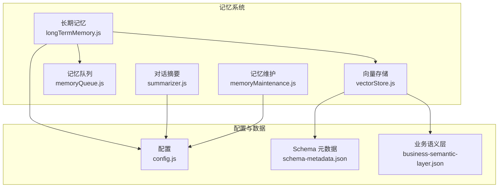
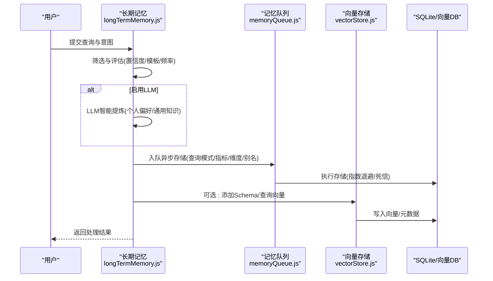
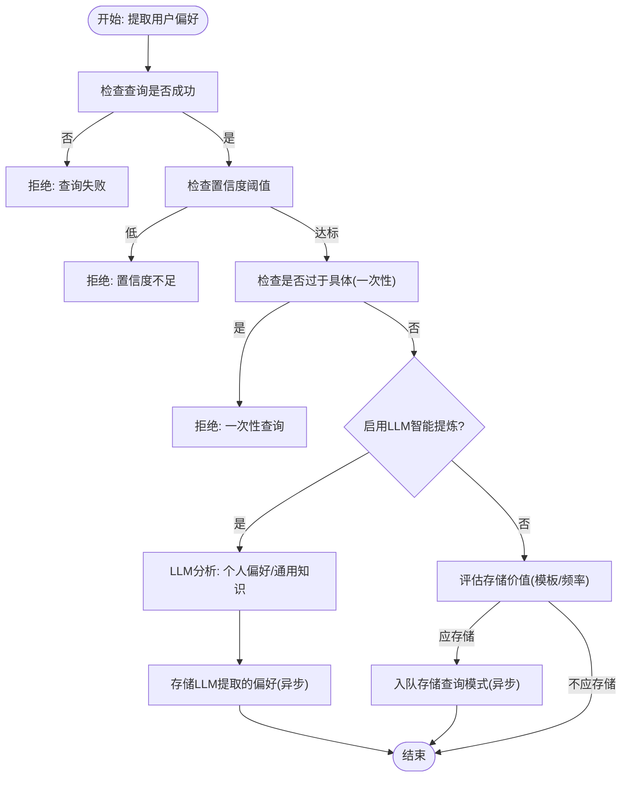
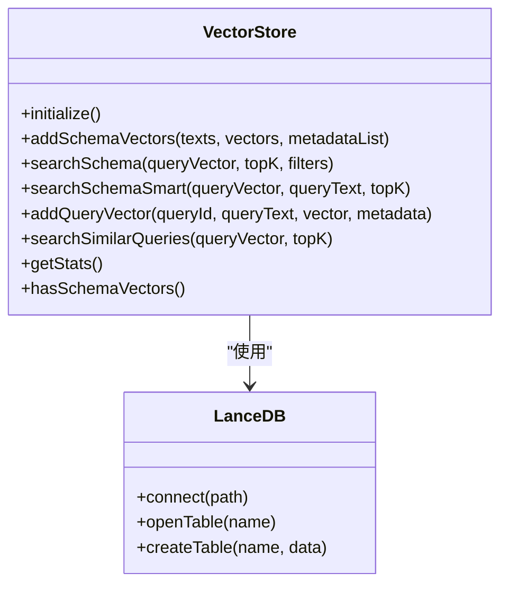
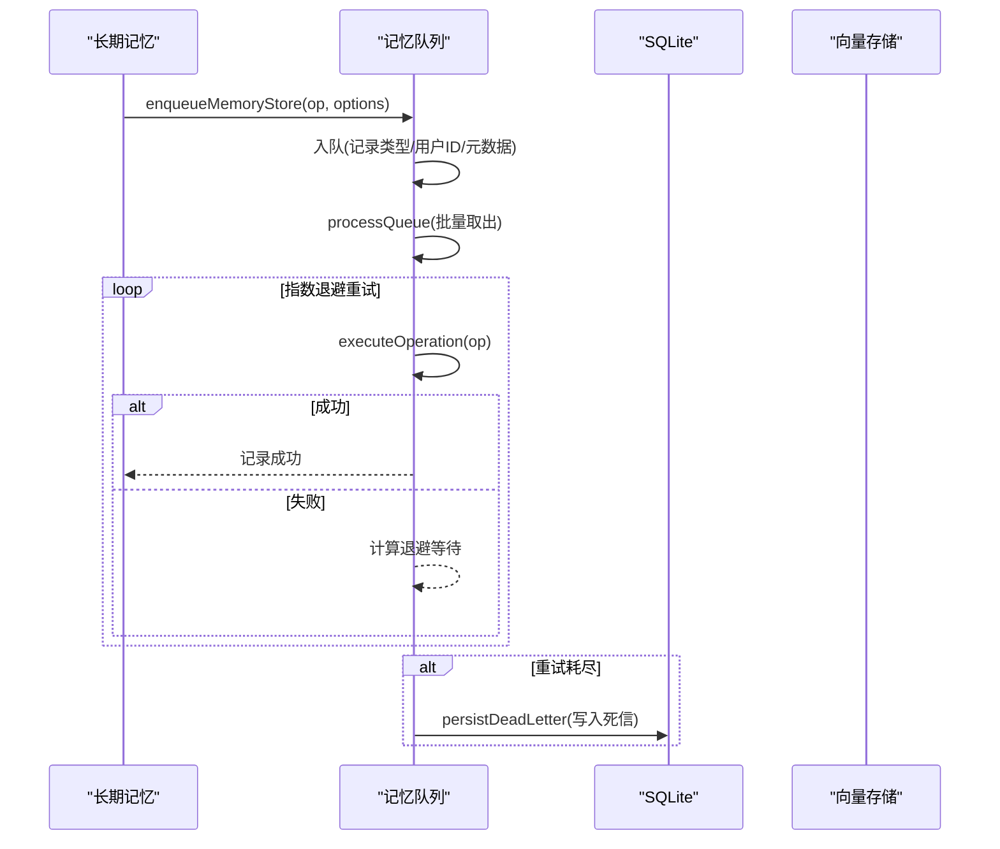
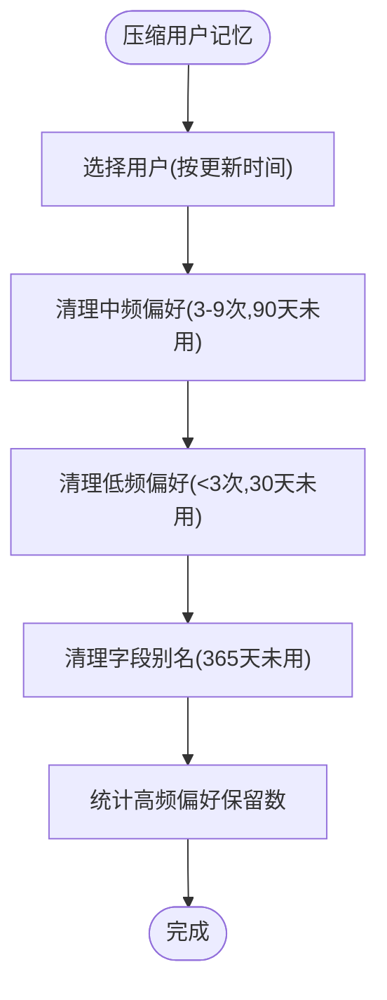
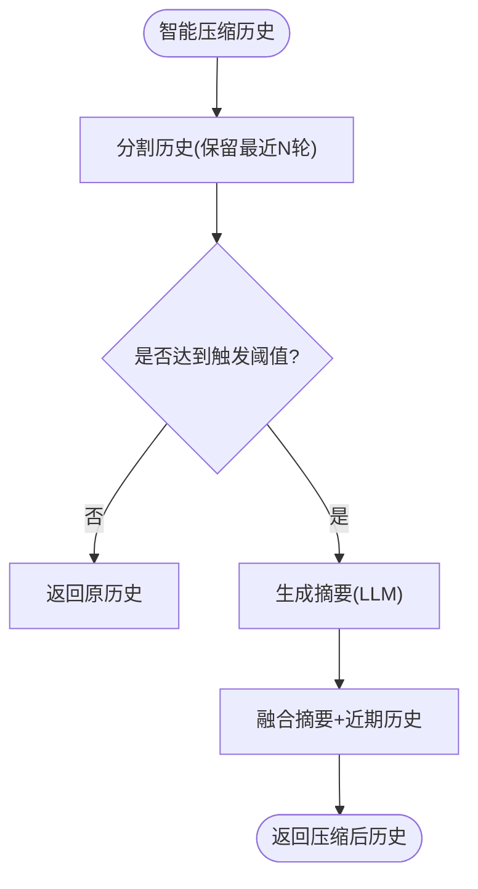
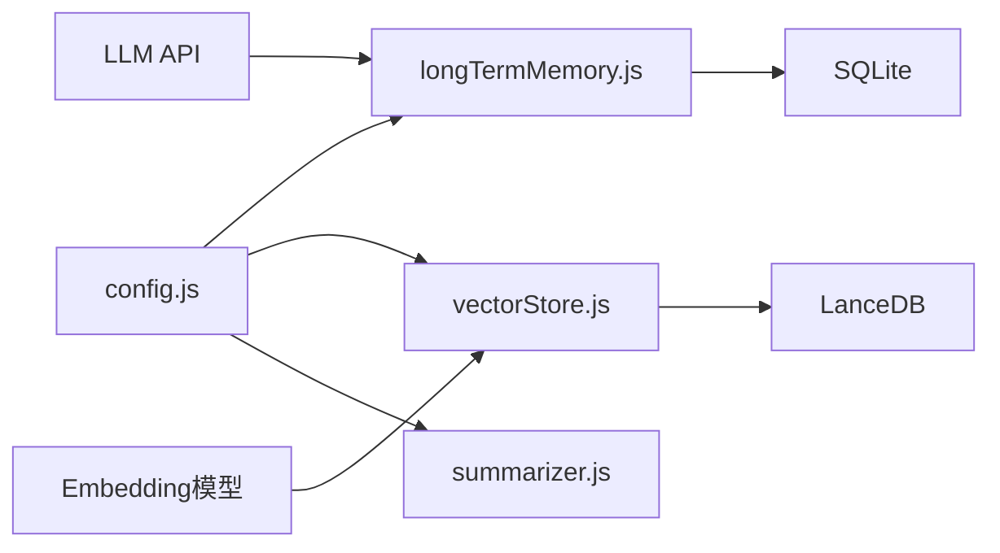

# 记忆系统

<cite>
**本文档引用的文件**
- [longTermMemory.js](file://backend/src/memory/longTermMemory.js)
- [vectorStore.js](file://backend/src/memory/vectorStore.js)
- [memoryQueue.js](file://backend/src/memory/memoryQueue.js)
- [memoryMaintenance.js](file://backend/src/memory/memoryMaintenance.js)
- [summarizer.js](file://backend/src/memory/summarizer.js)
- [config.js](file://backend/src/core/config.js)
- [schema-metadata.json](file://backend/config/schema-metadata.json)
- [business-semantic-layer.json](file://backend/config/business-semantic-layer.json)
- [test-memoryQueue-retry.js](file://backend/test/phase4/test-memoryQueue-retry.js)
- [test-memoryQueue-deadletter.js](file://backend/test/phase4/test-memoryQueue-deadletter.js)
- [test-memoryFailedQueue-migration.js](file://backend/test/phase4/test-memoryFailedQueue-migration.js)
</cite>

## 目录
1. [简介](#简介)
2. [项目结构](#项目结构)
3. [核心组件](#核心组件)
4. [架构总览](#架构总览)
5. [详细组件分析](#详细组件分析)
6. [依赖关系分析](#依赖关系分析)
7. [性能考量](#性能考量)
8. [故障排查指南](#故障排查指南)
9. [结论](#结论)
10. [附录](#附录)

## 简介
本技术文档面向 NL2SQL 记忆系统，系统分为三层：
- Layer 1：短期记忆（会话与上下文管理）
- Layer 2：长期记忆（用户偏好、查询模式、字段别名等）
- Layer 3：向量存储（Schema 向量化、查询向量、语义检索）

本文重点覆盖 Layer 2 的长期记忆管理机制、Layer 3 的向量存储系统、异步记忆队列与维护任务，并提供配置、性能调优与监控指标说明，以及扩展性与未来改进方向。

## 项目结构
记忆系统位于 backend/src/memory 下，核心模块包括：
- longTermMemory.js：长期记忆抽取、存储、检索与管理
- vectorStore.js：基于 LanceDB 的向量存储与语义检索
- memoryQueue.js：异步记忆存储队列（指数退避、死信持久化）
- memoryMaintenance.js：记忆压缩、清理与相似模式合并
- summarizer.js：对话摘要与历史压缩

图表来源
- [longTermMemory.js:1-1168](file://backend/src/memory/longTermMemory.js#L1-L1168)
- [vectorStore.js:1-928](file://backend/src/memory/vectorStore.js#L1-L928)
- [memoryQueue.js:1-293](file://backend/src/memory/memoryQueue.js#L1-L293)
- [memoryMaintenance.js:1-421](file://backend/src/memory/memoryMaintenance.js#L1-L421)
- [summarizer.js:1-530](file://backend/src/memory/summarizer.js#L1-L530)
- [config.js:294-374](file://backend/src/core/config.js#L294-L374)
- [schema-metadata.json:1-800](file://backend/config/schema-metadata.json#L1-L800)
- [business-semantic-layer.json:1-189](file://backend/config/business-semantic-layer.json#L1-L189)

章节来源
- [longTermMemory.js:1-1168](file://backend/src/memory/longTermMemory.js#L1-L1168)
- [vectorStore.js:1-928](file://backend/src/memory/vectorStore.js#L1-L928)
- [memoryQueue.js:1-293](file://backend/src/memory/memoryQueue.js#L1-L293)
- [memoryMaintenance.js:1-421](file://backend/src/memory/memoryMaintenance.js#L1-L421)
- [summarizer.js:1-530](file://backend/src/memory/summarizer.js#L1-L530)
- [config.js:294-374](file://backend/src/core/config.js#L294-L374)

## 核心组件
- 长期记忆（Layer 2）
  - 偏好类型：查询模式、字段别名、指标偏好、维度偏好
  - 存储筛选：置信度阈值、模板价值、频率阈值、排除一次性查询
  - LLM 智能提炼：区分个人偏好与通用知识，提升提取质量
  - 异步存储：通过记忆队列异步落库，避免阻塞主流程
- 向量存储（Layer 3）
  - Schema 向量：表/字段描述向量化，支持智能检索与重排序
  - 查询向量：用户历史查询向量化，支持相似查询检索
  - LanceDB：本地嵌入式向量数据库，支持表创建、添加、搜索与统计
- 记忆队列（异步处理）
  - 指数退避重试、失败持久化（死信）、队列长度保护、指标导出
- 记忆维护（自动化）
  - 分级保留策略、相似模式合并、清理统计与健康报告
- 对话摘要（上下文压缩）
  - 历史分割、摘要生成、增量更新、缓存与智能压缩

章节来源
- [longTermMemory.js:28-48](file://backend/src/memory/longTermMemory.js#L28-L48)
- [longTermMemory.js:299-486](file://backend/src/memory/longTermMemory.js#L299-L486)
- [vectorStore.js:34-42](file://backend/src/memory/vectorStore.js#L34-L42)
- [vectorStore.js:235-326](file://backend/src/memory/vectorStore.js#L235-L326)
- [memoryQueue.js:26-47](file://backend/src/memory/memoryQueue.js#L26-L47)
- [memoryMaintenance.js:24-46](file://backend/src/memory/memoryMaintenance.js#L24-L46)
- [summarizer.js:23-34](file://backend/src/memory/summarizer.js#L23-L34)

## 架构总览
长期记忆与向量存储协同工作，形成“意图识别增强 + 语义检索 + 异步存储 + 自动维护”的闭环。

图表来源
- [longTermMemory.js:299-486](file://backend/src/memory/longTermMemory.js#L299-L486)
- [memoryQueue.js:66-102](file://backend/src/memory/memoryQueue.js#L66-L102)
- [vectorStore.js:340-371](file://backend/src/memory/vectorStore.js#L340-L371)

## 详细组件分析

### 长期记忆管理（Layer 2）
- 存储筛选策略
  - 置信度阈值、高价值模板（维度≥2且指标≥1）、高频模式（7天内≥2次）、排除一次性查询
- LLM 智能提炼
  - 识别字段别名、分析习惯、业务逻辑定义、通用查询
  - 输出 shouldStore/isPersonal/confidence/reason/extractedPreferences
- 偏好类型与存储
  - 查询模式：维度、指标、时间范围、过滤器、样例查询
  - 字段别名：用户术语→Schema字段/值映射，支持伪字段与实体值映射
  - 指标/维度偏好：记录常用字段名，更新使用次数
- 异步存储
  - 通过记忆队列异步执行，避免阻塞主流程
- 即时学习（澄清轮）
  - 从用户文本提取游戏ID/平台映射，支持表格、键值对、显式声明等格式
- 偏好检索
  - 用于意图识别增强：返回常用模板、别名、指标/维度名称

图表来源
- [longTermMemory.js:299-486](file://backend/src/memory/longTermMemory.js#L299-L486)
- [longTermMemory.js:58-190](file://backend/src/memory/longTermMemory.js#L58-L190)

章节来源
- [longTermMemory.js:28-48](file://backend/src/memory/longTermMemory.js#L28-L48)
- [longTermMemory.js:58-190](file://backend/src/memory/longTermMemory.js#L58-L190)
- [longTermMemory.js:299-486](file://backend/src/memory/longTermMemory.js#L299-L486)
- [longTermMemory.js:855-993](file://backend/src/memory/longTermMemory.js#L855-L993)
- [longTermMemory.js:995-1097](file://backend/src/memory/longTermMemory.js#L995-L1097)

### 向量存储系统（Layer 3）
- 初始化与表管理
  - 连接 LanceDB，初始化 schema_vectors 与 query_vectors 表
  - 支持统计、清空、存在性检查
- Schema 向量
  - addSchemaVectors：批量添加表/字段描述向量
  - searchSchema：向量检索，支持元数据过滤
  - searchSchemaSmart：智能检索，结合游戏提及、表作用域权重、数据类型优先级
- 查询向量
  - addQueryVector：添加查询历史向量
  - searchSimilarQueries：相似查询检索
- 元数据增强
  - importanceScore、queryType、complexity、execution、intentSummary
- 配置与路径
  - 向量维度、Embedding开关、向量数据库路径

图表来源
- [vectorStore.js:235-326](file://backend/src/memory/vectorStore.js#L235-L326)
- [vectorStore.js:340-439](file://backend/src/memory/vectorStore.js#L340-L439)
- [vectorStore.js:600-667](file://backend/src/memory/vectorStore.js#L600-L667)

章节来源
- [vectorStore.js:235-326](file://backend/src/memory/vectorStore.js#L235-L326)
- [vectorStore.js:340-439](file://backend/src/memory/vectorStore.js#L340-L439)
- [vectorStore.js:442-578](file://backend/src/memory/vectorStore.js#L442-L578)
- [vectorStore.js:600-667](file://backend/src/memory/vectorStore.js#L600-L667)
- [vectorStore.js:679-780](file://backend/src/memory/vectorStore.js#L679-L780)

### 记忆队列（异步处理）
- 功能要点
  - 入队：enqueueMemoryStore，记录类型、用户ID、元数据
  - 批量处理：processQueue，批量取出并 Promise.allSettled
  - 指数退避：BASE_BACKOFF_MS × BACKOFF_FACTOR^attempt，最多 MAX_RETRIES 次
  - 死信持久化：重试耗尽后写入 memory_failed_queue 表（SQLite）
  - 队列保护：QUEUE_MAX_SIZE 超限时直接走死信
  - 指标导出：getQueueMetrics，包含累计入队/成功/重试/死信/拒绝满队列
- 测试覆盖
  - 重试行为与耗时验证
  - 死信持久化与读取
  - 迁移幂等与索引存在性

图表来源
- [memoryQueue.js:66-102](file://backend/src/memory/memoryQueue.js#L66-L102)
- [memoryQueue.js:107-149](file://backend/src/memory/memoryQueue.js#L107-L149)
- [memoryQueue.js:154-215](file://backend/src/memory/memoryQueue.js#L154-L215)
- [memoryQueue.js:220-234](file://backend/src/memory/memoryQueue.js#L220-L234)

章节来源
- [memoryQueue.js:26-47](file://backend/src/memory/memoryQueue.js#L26-L47)
- [memoryQueue.js:66-102](file://backend/src/memory/memoryQueue.js#L66-L102)
- [memoryQueue.js:107-149](file://backend/src/memory/memoryQueue.js#L107-L149)
- [memoryQueue.js:154-215](file://backend/src/memory/memoryQueue.js#L154-L215)
- [memoryQueue.js:220-234](file://backend/src/memory/memoryQueue.js#L220-L234)
- [test-memoryQueue-retry.js:1-87](file://backend/test/phase4/test-memoryQueue-retry.js#L1-L87)
- [test-memoryQueue-deadletter.js:1-89](file://backend/test/phase4/test-memoryQueue-deadletter.js#L1-L89)
- [test-memoryFailedQueue-migration.js:1-127](file://backend/test/phase4/test-memoryFailedQueue-migration.js#L1-L127)

### 记忆维护（自动化）
- 分级保留策略
  - 高频(≥10次)：永久保留
  - 中频(3-9次)：90天未用清理
  - 低频(<3次)：30天未用清理
  - 字段别名：365天未用清理
- 相似模式合并
  - 维度/指标重合度>70%且时间范围类型相同，合并为更通用模式
- 统计与报告
  - 用户记忆统计、系统健康报告（预估清理量、按类型统计）

图表来源
- [memoryMaintenance.js:69-120](file://backend/src/memory/memoryMaintenance.js#L69-L120)
- [memoryMaintenance.js:127-195](file://backend/src/memory/memoryMaintenance.js#L127-L195)
- [memoryMaintenance.js:207-251](file://backend/src/memory/memoryMaintenance.js#L207-L251)

章节来源
- [memoryMaintenance.js:24-46](file://backend/src/memory/memoryMaintenance.js#L24-L46)
- [memoryMaintenance.js:69-120](file://backend/src/memory/memoryMaintenance.js#L69-L120)
- [memoryMaintenance.js:127-195](file://backend/src/memory/memoryMaintenance.js#L127-L195)
- [memoryMaintenance.js:207-251](file://backend/src/memory/memoryMaintenance.js#L207-L251)
- [memoryMaintenance.js:326-401](file://backend/src/memory/memoryMaintenance.js#L326-L401)

### 对话摘要（上下文压缩）
- 触发条件：轮数≥阈值或Token数超过阈值
- 历史分割：保留最近若干轮，其余压缩为摘要
- 摘要生成：LLM生成摘要，控制Token上限
- 增量更新：合并新对话与现有摘要
- 缓存：内存缓存摘要，定期清理过期缓存

图表来源
- [summarizer.js:264-331](file://backend/src/memory/summarizer.js#L264-L331)
- [summarizer.js:440-504](file://backend/src/memory/summarizer.js#L440-L504)

章节来源
- [summarizer.js:23-34](file://backend/src/memory/summarizer.js#L23-L34)
- [summarizer.js:58-95](file://backend/src/memory/summarizer.js#L58-L95)
- [summarizer.js:109-185](file://backend/src/memory/summarizer.js#L109-L185)
- [summarizer.js:264-331](file://backend/src/memory/summarizer.js#L264-L331)
- [summarizer.js:440-504](file://backend/src/memory/summarizer.js#L440-L504)

## 依赖关系分析
- 配置依赖
  - longTermMemory：阈值、保留策略、LLM开关
  - vectorStore：Embedding开关、维度、向量数据库路径
  - contextManagement：摘要触发阈值、Token预算
- 数据依赖
  - SQLite：用户偏好、死信队列表、向量统计
  - LanceDB：schema_vectors、query_vectors
- 外部依赖
  - LLM API：用于智能提炼与摘要生成
  - Embedding模型：用于向量生成

图表来源
- [config.js:294-374](file://backend/src/core/config.js#L294-L374)
- [longTermMemory.js:17-22](file://backend/src/memory/longTermMemory.js#L17-L22)
- [vectorStore.js:14-25](file://backend/src/memory/vectorStore.js#L14-L25)

章节来源
- [config.js:294-374](file://backend/src/core/config.js#L294-L374)
- [longTermMemory.js:17-22](file://backend/src/memory/longTermMemory.js#L17-L22)
- [vectorStore.js:14-25](file://backend/src/memory/vectorStore.js#L14-L25)

## 性能考量
- 异步存储与批处理
  - memoryQueue 批量处理、指数退避、队列长度保护，避免阻塞与内存压力
- 向量检索优化
  - searchSchemaSmart：结合游戏提及、表作用域权重、数据类型优先级，减少无关表影响
  - 元数据增强：importantScore/queryType/complexity，辅助后续排序与过滤
- Token预算与摘要
  - summarizer 控制摘要长度与更新间隔，避免上下文膨胀
- 配置调优
  - Embedding维度、向量数据库路径、LLM超时、重试参数、队列批大小与最大长度

章节来源
- [memoryQueue.js:29-47](file://backend/src/memory/memoryQueue.js#L29-L47)
- [vectorStore.js:442-578](file://backend/src/memory/vectorStore.js#L442-L578)
- [summarizer.js:23-34](file://backend/src/memory/summarizer.js#L23-L34)
- [config.js:84-94](file://backend/src/core/config.js#L84-L94)
- [config.js:352-373](file://backend/src/core/config.js#L352-L373)

## 故障排查指南
- 记忆队列
  - 指标检查：getQueueMetrics，定位入队/成功/重试/死信/拒绝满队列
  - 死信读取：listPendingMemoryFailed，核对 operation_type/user_id/payload/last_error/retry_count
  - 重试耗时：确认指数退避是否生效（100ms→400ms→1600ms）
- 向量数据库
  - 初始化失败：检查 VECTOR_DB_PATH 与权限；确认表创建/打开是否成功
  - 搜索无结果：确认 Embedding 开关与维度配置；检查向量是否已写入
- 长期记忆
  - LLM 提炼失败：检查 LLM_API_KEY 与超时；查看日志 reason/extractedPreferences
  - 偏好未存储：核对置信度阈值、模板价值、频率阈值与一次性查询排除
- 记忆维护
  - 清理策略：核对保留策略配置；关注高频/中频/低频/字段别名的TTL
  - 相似模式合并：确认维度/指标重合度阈值与时间范围类型匹配

章节来源
- [memoryQueue.js:254-260](file://backend/src/memory/memoryQueue.js#L254-L260)
- [memoryQueue.js:220-234](file://backend/src/memory/memoryQueue.js#L220-L234)
- [vectorStore.js:235-265](file://backend/src/memory/vectorStore.js#L235-L265)
- [longTermMemory.js:58-190](file://backend/src/memory/longTermMemory.js#L58-L190)
- [memoryMaintenance.js:24-46](file://backend/src/memory/memoryMaintenance.js#L24-L46)

## 结论
NL2SQL 记忆系统通过“意图识别增强 + 语义检索 + 异步存储 + 自动维护”实现了用户偏好的长期沉淀与高效利用。长期记忆模块提供灵活的筛选与LLM智能提炼，向量存储模块提供Schema与查询的语义检索能力，记忆队列保障异步可靠性，记忆维护模块实现分级保留与相似模式合并。配合完善的配置与监控，系统具备良好的可运维性与扩展性。

## 附录

### 配置选项与默认值
- 长期记忆（longTermMemory）
  - enabled/useLLMForExtraction：开关与LLM开关
  - thresholds：minConfidence/minDimensionsForTemplate/minMetricsForTemplate/recentDaysForFrequency/minFrequencyForSimple
  - retention：highUsage/mediumUsage/lowUsage/fieldAlias（天数，高频可设为null永久保留）
- 上下文管理（contextManagement）
  - enableTokenBudget/enableSummarizer：开关
  - tokenBudget：maxContextTokens/reservedOutputTokens/warningThreshold/compressionThreshold
  - summarizer：triggerRounds/preserveRecentRounds/maxSummaryTokens/updateInterval
- 向量存储（embedding/vectorDb）
  - embedding.enabled/model/dimension/timeout
  - vectorDb.path

章节来源
- [config.js:294-374](file://backend/src/core/config.js#L294-L374)

### 监控指标与统计
- 记忆队列指标（getQueueMetrics）
  - enqueued/succeeded/retried/deadLettered/rejectedFull/lastErrorTime/lastError/queueSize/isProcessing
- 向量搜索统计
  - recordVectorSearch(schema/query)：记录检索结果与距离
- 记忆命中统计
  - recordMemoryHit(field_alias/query_pattern/metric_preference/dimension_preference)：记录偏好命中

章节来源
- [memoryQueue.js:254-260](file://backend/src/memory/memoryQueue.js#L254-L260)
- [vectorStore.js:431-438](file://backend/src/memory/vectorStore.js#L431-L438)
- [longTermMemory.js:1014-1018](file://backend/src/memory/longTermMemory.js#L1014-L1018)

### 扩展性设计与未来改进
- 扩展性
  - 模块化：各子系统职责清晰，易于独立演进
  - 配置驱动：通过 config.js 管理开关与阈值，便于灰度与A/B测试
  - 异步化：记忆队列与向量写入异步化，降低主流程耦合
- 未来改进方向
  - 向量检索：引入更丰富的元数据过滤与排序策略
  - LLM提炼：增强对业务规则与口径的识别能力
  - 维护策略：引入更细粒度的相似度阈值与合并策略
  - 可观测性：增加更多运行时统计与告警