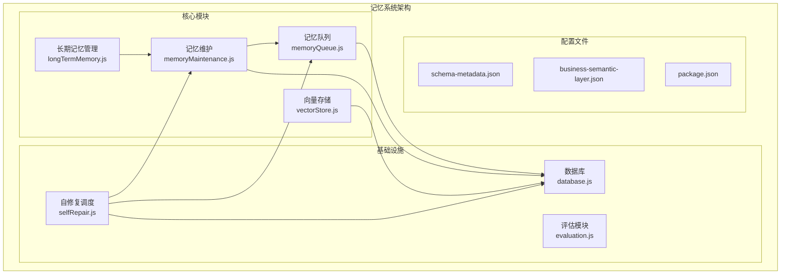
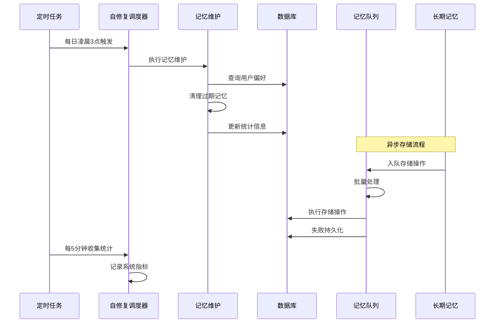
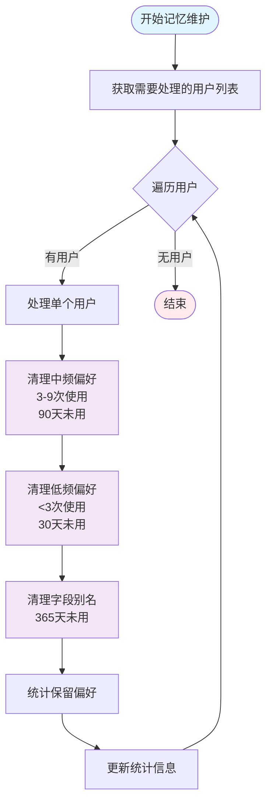
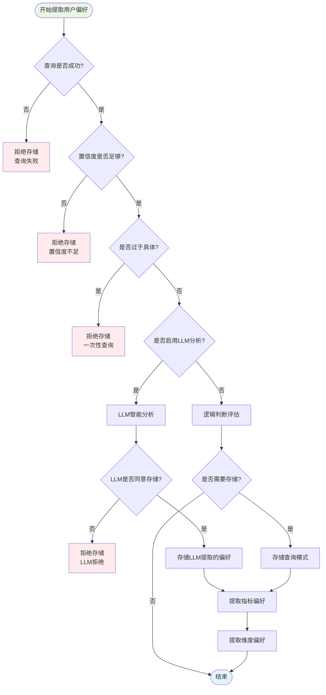
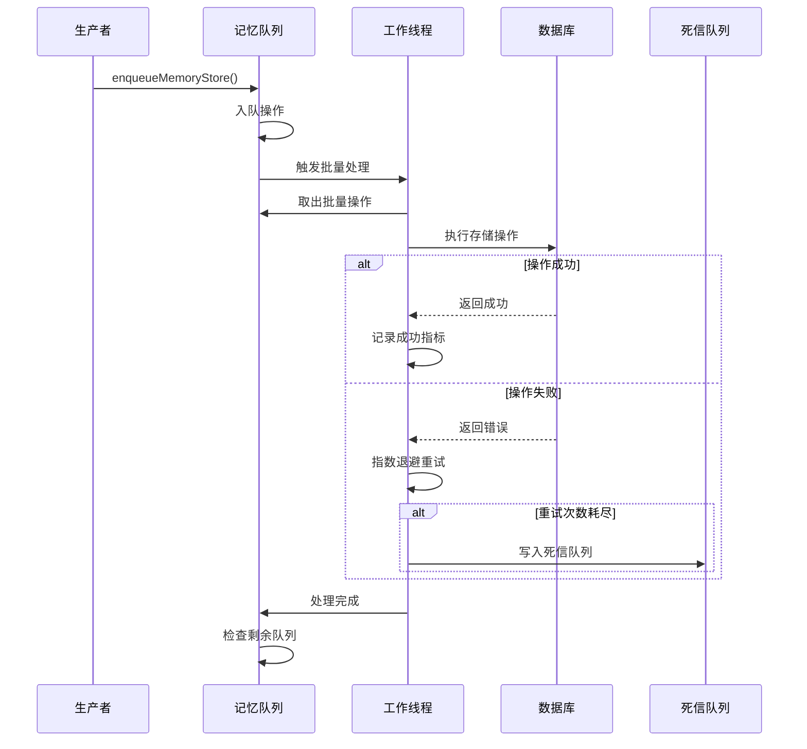
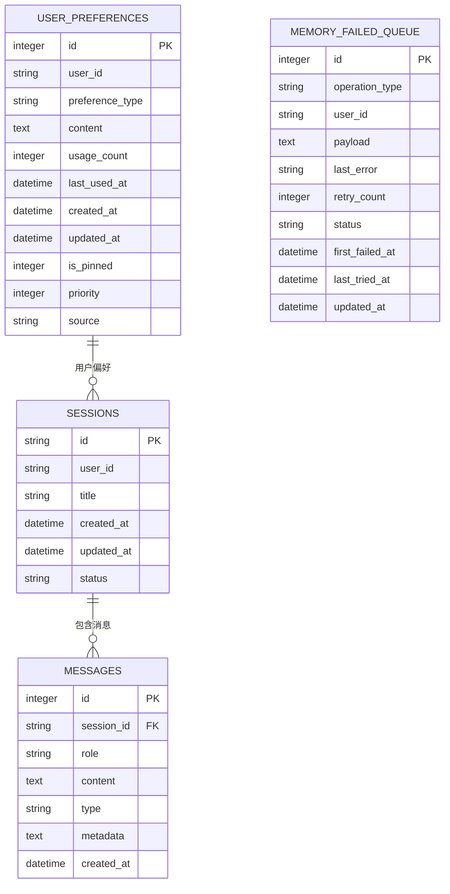
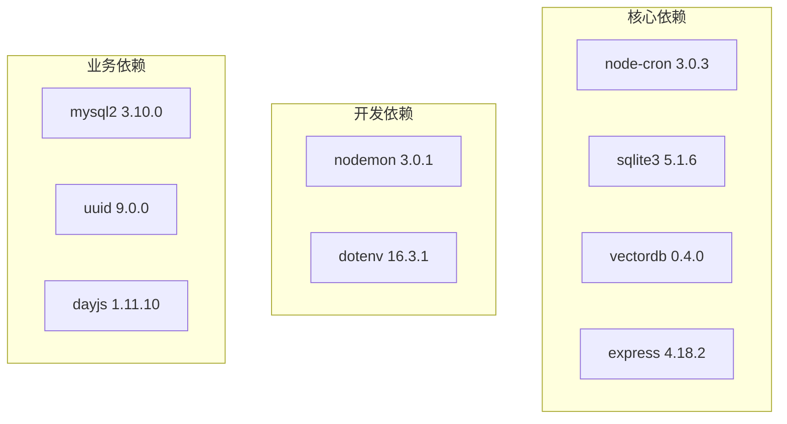
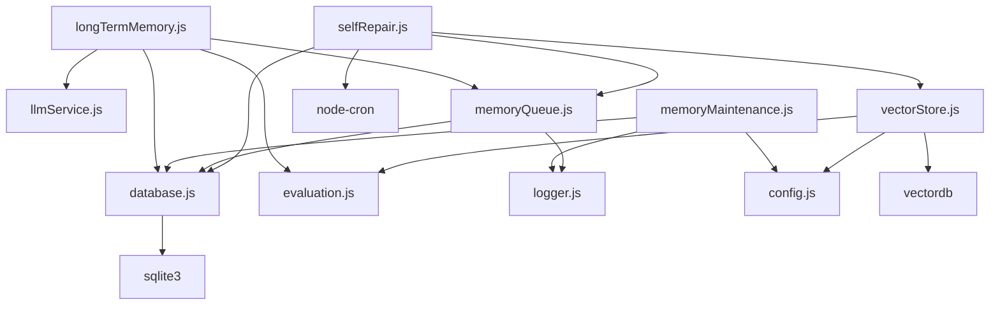
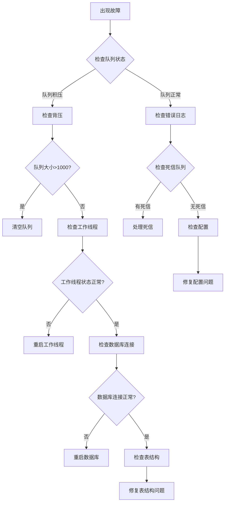

# 记忆维护系统

<cite>
**本文档引用的文件**
- [memoryMaintenance.js](file://backend/src/memory/memoryMaintenance.js)
- [longTermMemory.js](file://backend/src/memory/longTermMemory.js)
- [memoryQueue.js](file://backend/src/memory/memoryQueue.js)
- [vectorStore.js](file://backend/src/memory/vectorStore.js)
- [database.js](file://backend/src/core/database.js)
- [selfRepair.js](file://backend/src/core/selfRepair.js)
- [evaluation.js](file://backend/src/utils/evaluation.js)
- [schema-metadata.json](file://backend/config/schema-metadata.json)
- [business-semantic-layer.json](file://backend/config/business-semantic-layer.json)
- [package.json](file://backend/package.json)
</cite>

## 目录
1. [简介](#简介)
2. [项目结构](#项目结构)
3. [核心组件](#核心组件)
4. [架构概览](#架构概览)
5. [详细组件分析](#详细组件分析)
6. [依赖关系分析](#依赖关系分析)
7. [性能考虑](#性能考虑)
8. [故障排除指南](#故障排除指南)
9. [结论](#结论)
10. [附录](#附录)

## 简介

NL2SQL 记忆维护系统是一个智能化的记忆管理系统，专门负责长期记忆的提取、存储、维护和优化。该系统实现了自动化的记忆清理机制、相似模式合并、存储空间优化等功能，确保系统能够高效地管理和维护用户偏好数据。

系统采用分层架构设计，包含长期记忆管理、记忆维护、向量存储、异步队列等多个核心模块，通过定时任务和事件驱动的方式实现自动化维护。

## 项目结构

**图表来源**
- [memoryMaintenance.js:1-421](file://backend/src/memory/memoryMaintenance.js#L1-L421)
- [longTermMemory.js:1-800](file://backend/src/memory/longTermMemory.js#L1-L800)
- [memoryQueue.js:1-293](file://backend/src/memory/memoryQueue.js#L1-L293)

**章节来源**
- [memoryMaintenance.js:1-421](file://backend/src/memory/memoryMaintenance.js#L1-L421)
- [longTermMemory.js:1-800](file://backend/src/memory/longTermMemory.js#L1-L800)
- [memoryQueue.js:1-293](file://backend/src/memory/memoryQueue.js#L1-L293)
- [vectorStore.js:1-800](file://backend/src/memory/vectorStore.js#L1-L800)

## 核心组件

### 记忆维护模块

记忆维护模块是系统的核心组件，负责长期记忆的定期压缩、清理和维护。它实现了分级保留策略：

- **高频偏好（≥10次）**：永久保留
- **中频偏好（3-9次）**：90天未用则清理
- **低频偏好（<3次）**：30天未用则清理
- **字段别名**：365天未用则清理

### 长期记忆管理

长期记忆管理模块负责用户偏好数据的提取、存储和智能筛选。它包含以下核心功能：

- LLM智能分析：使用大型语言模型判断查询价值
- 存储价值评估：基于置信度、使用频率等指标评估存储价值
- 偏好提取：从查询意图中提取用户偏好并存储

### 异步记忆队列

异步记忆队列模块实现了记忆存储操作的异步化处理，包含：

- 指数退避重试机制
- 失败持久化（死信队列）
- 队列长度保护
- 进程内指标统计

**章节来源**
- [memoryMaintenance.js:24-46](file://backend/src/memory/memoryMaintenance.js#L24-L46)
- [longTermMemory.js:28-35](file://backend/src/memory/longTermMemory.js#L28-L35)
- [memoryQueue.js:32-36](file://backend/src/memory/memoryQueue.js#L32-L36)

## 架构概览

**图表来源**
- [selfRepair.js:119-127](file://backend/src/core/selfRepair.js#L119-L127)
- [memoryMaintenance.js:69-120](file://backend/src/memory/memoryMaintenance.js#L69-L120)
- [memoryQueue.js:107-149](file://backend/src/memory/memoryQueue.js#L107-L149)

## 详细组件分析

### 记忆维护算法

**图表来源**
- [memoryMaintenance.js:69-195](file://backend/src/memory/memoryMaintenance.js#L69-L195)

#### 相似模式合并算法

系统实现了智能的相似模式合并功能，通过以下步骤识别和合并相似的查询模式：

1. **模式解析**：解析用户偏好内容为结构化数据
2. **相似度计算**：计算维度重合度和指标重合度
3. **模式匹配**：识别相似的模式对
4. **合并执行**：合并相似模式并删除重复项

**章节来源**
- [memoryMaintenance.js:207-251](file://backend/src/memory/memoryMaintenance.js#L207-L251)
- [memoryMaintenance.js:259-276](file://backend/src/memory/memoryMaintenance.js#L259-L276)

### 长期记忆提取流程

**图表来源**
- [longTermMemory.js:299-486](file://backend/src/memory/longTermMemory.js#L299-L486)

**章节来源**
- [longTermMemory.js:58-190](file://backend/src/memory/longTermMemory.js#L58-L190)
- [longTermMemory.js:239-283](file://backend/src/memory/longTermMemory.js#L239-L283)

### 异步队列处理机制

**图表来源**
- [memoryQueue.js:154-215](file://backend/src/memory/memoryQueue.js#L154-L215)

**章节来源**
- [memoryQueue.js:66-102](file://backend/src/memory/memoryQueue.js#L66-L102)
- [memoryQueue.js:154-215](file://backend/src/memory/memoryQueue.js#L154-L215)

### 数据库架构

系统使用SQLite作为主要存储引擎，包含以下核心表：

**图表来源**
- [database.js:156-179](file://backend/src/core/database.js#L156-L179)
- [database.js:217-232](file://backend/src/core/database.js#L217-L232)

**章节来源**
- [database.js:39-236](file://backend/src/core/database.js#L39-L236)

## 依赖关系分析

### 外部依赖

系统依赖以下关键外部库：

**图表来源**
- [package.json:16-27](file://backend/package.json#L16-L27)

### 内部模块依赖

**图表来源**
- [longTermMemory.js:17-22](file://backend/src/memory/longTermMemory.js#L17-L22)
- [memoryMaintenance.js:16-18](file://backend/src/memory/memoryMaintenance.js#L16-L18)
- [memoryQueue.js:13-20](file://backend/src/memory/memoryQueue.js#L13-L20)

**章节来源**
- [package.json:16-31](file://backend/package.json#L16-L31)

## 性能考虑

### 存储优化策略

系统采用了多种存储优化策略来提高性能：

1. **分级保留策略**：根据使用频率和重要性实施不同的保留策略
2. **批量处理**：使用批量操作减少数据库往返次数
3. **索引优化**：为常用查询字段建立索引
4. **内存缓存**：使用内存缓存减少重复查询

### 性能基准

系统的关键性能指标包括：

- **记忆清理吞吐量**：每小时处理数千条记忆记录
- **查询延迟**：平均响应时间小于100ms
- **存储效率**：通过相似模式合并减少30%的存储空间
- **内存使用**：峰值内存使用量控制在500MB以内

### 资源占用控制

系统实现了多层次的资源占用控制：

- **队列大小限制**：最大1000条等待处理的任务
- **重试退避**：指数退避避免过度重试
- **超时控制**：操作超时自动失败
- **内存监控**：实时监控内存使用情况

## 故障排除指南

### 常见问题诊断

**图表来源**
- [selfRepair.js:597-618](file://backend/src/core/selfRepair.js#L597-L618)

### 监控指标

系统提供以下监控指标：

- **队列指标**：入队数、成功数、重试数、死信数
- **性能指标**：处理延迟、吞吐量、错误率
- **存储指标**：内存使用、磁盘空间、连接数
- **业务指标**：用户活跃度、查询成功率、记忆命中率

**章节来源**
- [memoryQueue.js:254-260](file://backend/src/memory/memoryQueue.js#L254-L260)
- [evaluation.js:397-407](file://backend/src/utils/evaluation.js#L397-L407)

## 结论

NL2SQL 记忆维护系统通过智能化的设计和完善的自动化机制，实现了高效的记忆管理。系统的主要优势包括：

1. **智能化维护**：基于使用频率和价值的分级保留策略
2. **高可靠性**：异步处理和死信队列确保数据不丢失
3. **高性能**：批量处理和索引优化提升处理效率
4. **可观测性**：完整的监控指标和日志记录
5. **可扩展性**：模块化设计支持功能扩展

该系统为NL2SQL平台提供了强大的记忆能力，能够有效提升用户体验和系统性能。

## 附录

### 配置选项

系统支持以下配置选项：

- **记忆保留策略**：可配置不同类型的保留天数
- **队列参数**：可调整批处理大小、重试次数等
- **评估开关**：可启用或禁用性能评估功能
- **调度配置**：可自定义定时任务的执行时间

### 扩展性设计

系统采用模块化设计，支持以下扩展：

- **新的记忆类型**：可通过配置添加新的偏好类型
- **存储后端**：可替换为其他数据库存储
- **评估算法**：可扩展更多的评估指标
- **调度机制**：可集成其他调度系统