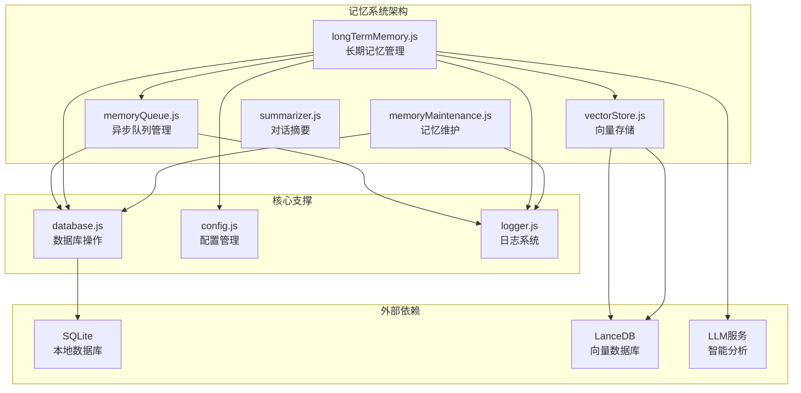
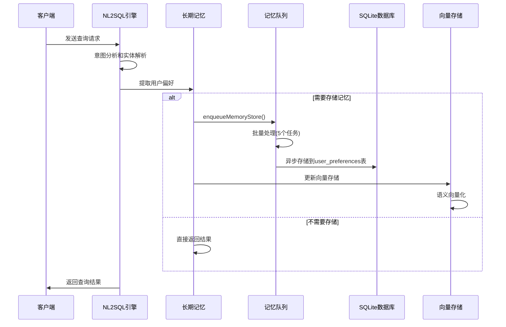
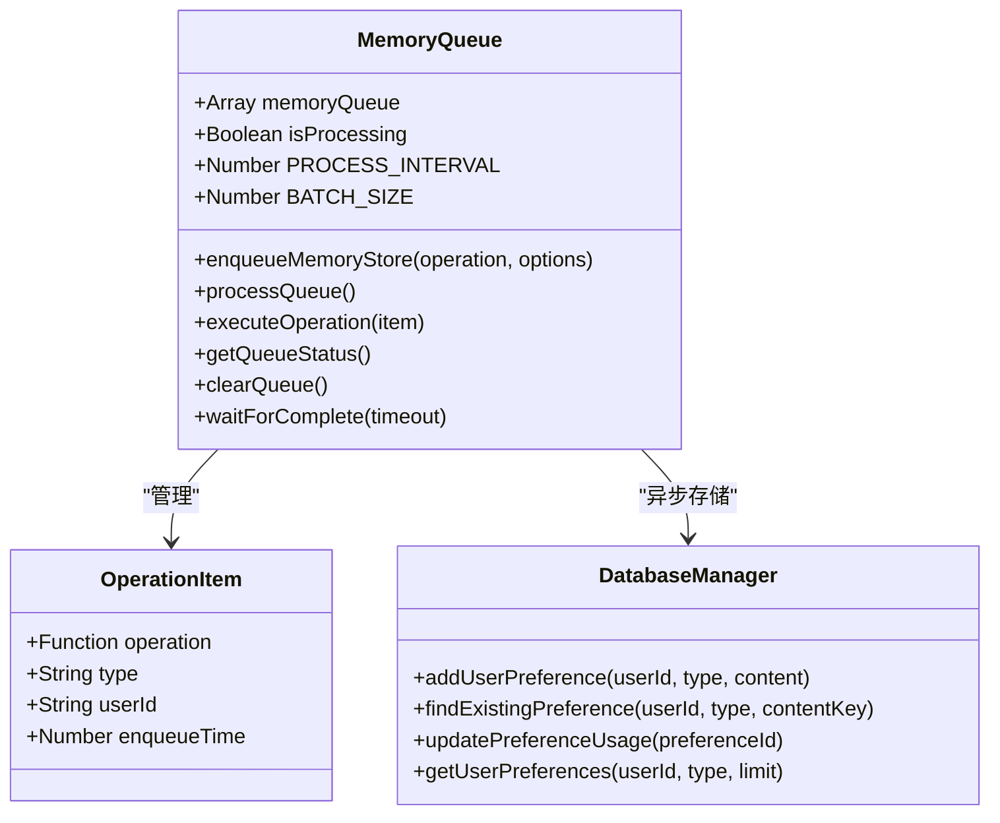
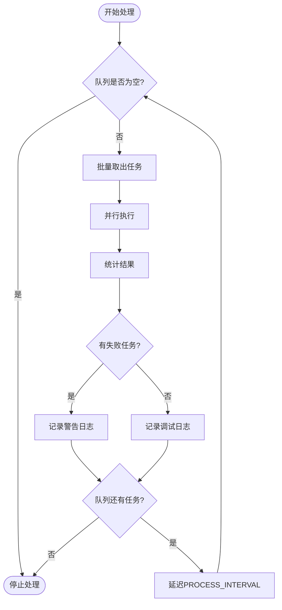
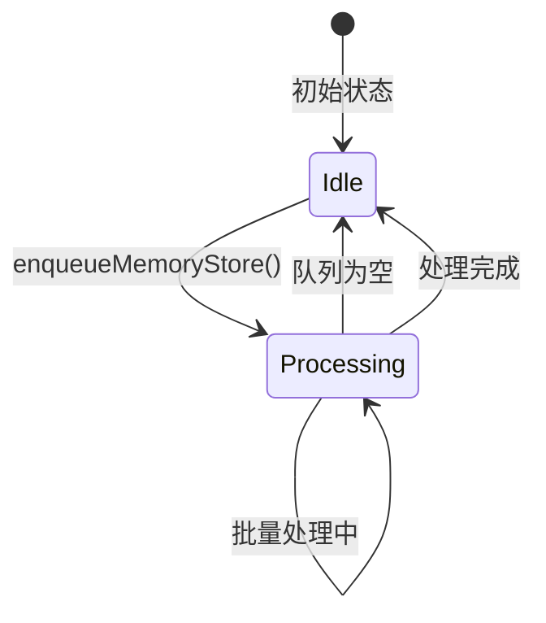
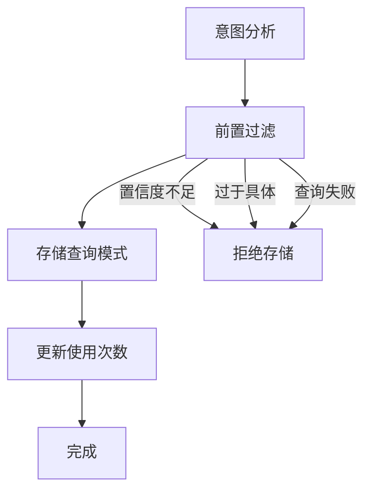
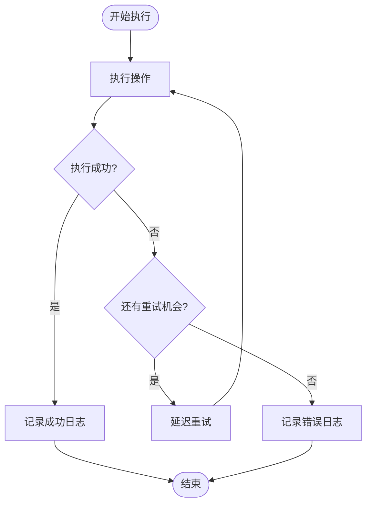
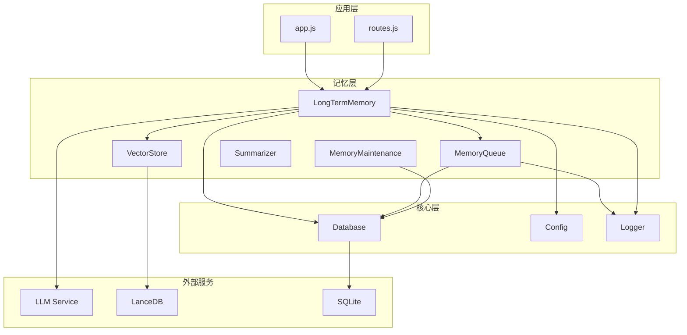

# 记忆队列管理

<cite>
**本文档引用的文件**
- [memoryQueue.js](file://backend/src/memory/memoryQueue.js)
- [longTermMemory.js](file://backend/src/memory/longTermMemory.js)
- [memoryMaintenance.js](file://backend/src/memory/memoryMaintenance.js)
- [vectorStore.js](file://backend/src/memory/vectorStore.js)
- [summarizer.js](file://backend/src/memory/summarizer.js)
- [database.js](file://backend/src/core/database.js)
- [logger.js](file://backend/src/utils/logger.js)
- [config.js](file://backend/src/core/config.js)
- [package.json](file://backend/package.json)
- [business-semantic-layer.json](file://backend/config/business-semantic-layer.json)
- [schema-metadata.json](file://backend/config/schema-metadata.json)
</cite>

## 目录
1. [简介](#简介)
2. [项目结构](#项目结构)
3. [核心组件](#核心组件)
4. [架构概览](#架构概览)
5. [详细组件分析](#详细组件分析)
6. [依赖关系分析](#依赖关系分析)
7. [性能考虑](#性能考虑)
8. [故障排查指南](#故障排查指南)
9. [结论](#结论)
10. [附录](#附录)

## 简介

NL2SQL记忆队列管理系统是一个异步记忆存储架构，专门设计用于处理自然语言转SQL系统中的各种记忆任务。该系统通过队列机制实现了高并发场景下的性能优化，支持多种记忆类型的异步存储，包括查询模式、字段别名、指标偏好等。

系统采用分层设计理念：
- **第1层（短期记忆）**：会话历史、查询日志等短期数据
- **第2层（长期记忆）**：用户偏好、查询模式、字段映射等长期记忆
- **第3层（向量记忆）**：基于LanceDB的向量存储，支持语义检索

## 项目结构

NL2SQL项目的记忆系统位于`backend/src/memory/`目录下，包含以下核心模块：



**图表来源**
- [memoryQueue.js:1-217](file://backend/src/memory/memoryQueue.js#L1-L217)
- [longTermMemory.js:1-800](file://backend/src/memory/longTermMemory.js#L1-L800)
- [database.js:1-800](file://backend/src/core/database.js#L1-L800)

**章节来源**
- [memoryQueue.js:1-217](file://backend/src/memory/memoryQueue.js#L1-L217)
- [longTermMemory.js:1-800](file://backend/src/memory/longTermMemory.js#L1-L800)
- [database.js:1-800](file://backend/src/core/database.js#L1-L800)

## 核心组件

### 异步记忆队列（MemoryQueue）

异步记忆队列是整个记忆系统的核心基础设施，采用先进先出（FIFO）队列设计，支持批量处理和并发控制。

**关键特性：**
- **批量处理**：每次处理5个任务，提高I/O效率
- **并发控制**：使用布尔标志防止重复处理
- **异步执行**：所有存储操作都是异步的
- **错误隔离**：单个任务失败不影响其他任务

**队列状态管理：**
- 队列长度监控
- 处理状态跟踪
- 批量大小配置
- 处理间隔控制

**章节来源**
- [memoryQueue.js:14-118](file://backend/src/memory/memoryQueue.js#L14-L118)
- [memoryQueue.js:160-202](file://backend/src/memory/memoryQueue.js#L160-L202)

### 长期记忆管理（LongTermMemory）

长期记忆管理模块负责用户长期记忆的提取、存储、检索和维护，是记忆系统的核心业务逻辑。

**记忆类型分类：**
1. **查询模式（query_pattern）**：用户常用的查询模板
2. **字段别名（field_alias）**：用户术语与数据库字段的映射
3. **指标偏好（metric_preference）**：用户常用的指标
4. **维度偏好（dimension_preference）**：用户常用的维度

**智能筛选机制：**
- 置信度阈值（默认0.7）
- 高频模式检测（7天内≥2次）
- 高价值模板识别（维度≥2且指标≥1）
- 一次性查询过滤

**章节来源**
- [longTermMemory.js:28-44](file://backend/src/memory/longTermMemory.js#L28-L44)
- [longTermMemory.js:239-283](file://backend/src/memory/longTermMemory.js#L239-L283)

### 记忆维护（MemoryMaintenance）

记忆维护模块负责长期记忆的定期压缩、清理和优化，确保系统性能和存储效率。

**分级保留策略：**
- **高频偏好（≥10次）**：永久保留
- **中频偏好（3-9次）**：90天未用清理
- **低频偏好（<3次）**：30天未用清理
- **字段别名**：365天未用清理

**维护功能：**
- 相似模式合并
- 重复记录清理
- 性能统计报告
- 健康状态监控

**章节来源**
- [memoryMaintenance.js:24-46](file://backend/src/memory/memoryMaintenance.js#L24-L46)
- [memoryMaintenance.js:69-120](file://backend/src/memory/memoryMaintenance.js#L69-L120)

### 向量存储（VectorStore）

向量存储模块基于LanceDB实现，支持语义相似度搜索和智能重排序。

**核心功能：**
- Schema向量存储
- 查询历史向量
- 语义相似度搜索
- 智能重排序算法

**智能搜索策略：**
- 游戏提及优先级
- 平台权重分层
- 原始日志优先
- 聚合报表降权

**章节来源**
- [vectorStore.js:29-41](file://backend/src/memory/vectorStore.js#L29-L41)
- [vectorStore.js:452-576](file://backend/src/memory/vectorStore.js#L452-L576)

### 对话摘要（Summarizer）

对话摘要模块负责长对话历史的自动摘要和压缩，优化上下文管理和Token使用。

**摘要策略：**
- 触发阈值：8轮对话或6000Token
- 保留最近4轮对话
- 摘要最大500Token
- 4轮更新一次

**章节来源**
- [summarizer.js:23-34](file://backend/src/memory/summarizer.js#L23-L34)
- [summarizer.js:450-504](file://backend/src/memory/summarizer.js#L450-L504)

## 架构概览



**图表来源**
- [longTermMemory.js:399-461](file://backend/src/memory/longTermMemory.js#L399-L461)
- [memoryQueue.js:46-118](file://backend/src/memory/memoryQueue.js#L46-L118)

## 详细组件分析

### 异步队列架构设计



**图表来源**
- [memoryQueue.js:14-217](file://backend/src/memory/memoryQueue.js#L14-L217)
- [database.js:677-783](file://backend/src/core/database.js#L677-L783)

**处理流程：**

1. **任务入队**：`enqueueMemoryStore()`将存储操作封装为队列项
2. **批量处理**：`processQueue()`每次取出最多5个任务
3. **并行执行**：使用`Promise.allSettled()`并行执行所有任务
4. **结果统计**：统计成功和失败的任务数量
5. **错误处理**：单个任务失败不影响整体流程

**章节来源**
- [memoryQueue.js:46-150](file://backend/src/memory/memoryQueue.js#L46-L150)

### 任务调度机制

系统采用基于时间片的调度机制，通过`PROCESS_INTERVAL`控制处理频率：



**图表来源**
- [memoryQueue.js:72-118](file://backend/src/memory/memoryQueue.js#L72-L118)

**调度特点：**
- **非阻塞设计**：处理过程完全异步
- **自适应延迟**：根据队列状态动态调整
- **批量优化**：减少数据库连接开销
- **错误隔离**：单个任务失败不影响其他任务

**章节来源**
- [memoryQueue.js:25-33](file://backend/src/memory/memoryQueue.js#L25-L33)
- [memoryQueue.js:113-117](file://backend/src/memory/memoryQueue.js#L113-L117)

### 优先级管理策略

系统通过多种机制实现优先级管理：

**1. 记忆类型优先级**
- 查询模式：最高优先级
- 字段别名：高优先级  
- 指标偏好：中等优先级
- 维度偏好：中等优先级

**2. 使用频率优先级**
- 高频（≥10次）：立即处理，永久保留
- 中频（3-9次）：正常处理，90天清理
- 低频（<3次）：延迟处理，30天清理

**3. 置信度优先级**
- 置信度≥0.9：立即处理
- 0.7-0.9：正常处理
- <0.7：延迟处理或拒绝

**章节来源**
- [longTermMemory.js:28-44](file://backend/src/memory/longTermMemory.js#L28-L44)
- [memoryMaintenance.js:24-46](file://backend/src/memory/memoryMaintenance.js#L24-L46)

### 并发控制策略



**并发控制机制：**

1. **互斥锁**：`isProcessing`布尔标志防止重复处理
2. **队列隔离**：每个任务独立执行，互不干扰
3. **批量限制**：单次最多处理5个任务
4. **超时保护**：处理完成后自动释放锁

**章节来源**
- [memoryQueue.js:22](file://backend/src/memory/memoryQueue.js#L22)
- [memoryQueue.js:72-77](file://backend/src/memory/memoryQueue.js#L72-L77)

### 任务类型分类与处理流程

系统支持四种主要的记忆任务类型：

**1. 查询模式存储**


**2. 字段别名学习**
- 用户术语与数据库字段映射
- 映射冲突检测和处理
- 重复记录去重

**3. 指标偏好记录**
- 用户常用指标识别
- 使用频率统计
- 偏好强度评估

**4. 维度偏好记录**
- 用户常用维度识别
- 维度组合分析
- 关联维度提取

**章节来源**
- [longTermMemory.js:591-733](file://backend/src/memory/longTermMemory.js#L591-L733)

### 容量管理机制

**1. 队列长度限制**
- 单次批量处理：最多5个任务
- 队列长度监控：实时统计队列大小
- 处理间隔：100ms固定间隔

**2. 内存使用监控**
- 队列项包含操作函数引用
- 执行时间统计：`enqueueTime`到`Date.now()`
- 内存泄漏防护：及时清理已完成任务

**3. 任务超时处理**
- 数据库操作超时：默认30秒
- LLM调用超时：可配置（默认60秒）
- 向量搜索超时：可配置（默认60秒）
- 自动重试机制：最多3次重试

**章节来源**
- [memoryQueue.js:27](file://backend/src/memory/memoryQueue.js#L27)
- [memoryQueue.js:186-202](file://backend/src/memory/memoryQueue.js#L186-L202)
- [config.js:68-87](file://backend/src/core/config.js#L68-L87)

### 错误处理与重试策略



**错误处理层次：**

1. **队列层错误**
   - 队列满载：拒绝新任务
   - 处理异常：记录错误并继续
   - 超时处理：等待队列完成

2. **存储层错误**
   - 数据库连接失败：自动重连
   - 事务冲突：回滚并重试
   - 索引冲突：去重处理

3. **外部服务错误**
   - LLM服务不可用：降级到逻辑判断
   - 向量数据库异常：跳过向量化
   - API调用超时：指数退避重试

**章节来源**
- [memoryQueue.js:108-117](file://backend/src/memory/memoryQueue.js#L108-L117)
- [longTermMemory.js:186-189](file://backend/src/memory/longTermMemory.js#L186-L189)

## 依赖关系分析



**图表来源**
- [longTermMemory.js:17-22](file://backend/src/memory/longTermMemory.js#L17-L22)
- [memoryQueue.js:8](file://backend/src/memory/memoryQueue.js#L8)

**依赖特点：**
- **松耦合设计**：各模块职责清晰，接口简单
- **向上依赖**：子模块依赖父模块，避免循环依赖
- **向下依赖**：核心模块不依赖上层模块
- **外部依赖**：通过配置管理外部服务

**章节来源**
- [package.json:10-20](file://backend/package.json#L10-L20)
- [config.js:16](file://backend/src/core/config.js#L16)

## 性能考虑

### 性能指标监控

**1. 队列性能指标**
- 队列长度：实时监控队列大小
- 处理吞吐量：每秒处理任务数
- 平均等待时间：任务排队时间
- 批量成功率：批量处理成功比例

**2. 存储性能指标**
- 数据库连接数：当前活跃连接数
- 查询延迟：数据库操作平均耗时
- 缓存命中率：内存缓存使用效率
- 磁盘I/O：文件系统读写性能

**3. 向量搜索性能**
- 搜索延迟：向量相似度计算时间
- 结果质量：相似度阈值控制
- 索引效率：向量索引查询性能
- 内存使用：向量存储内存占用

### 配置参数调优建议

**1. 队列处理参数**
- `BATCH_SIZE`：根据硬件性能调整（默认5）
- `PROCESS_INTERVAL`：根据负载调整（默认100ms）
- 队列超时：根据业务需求调整（默认5000ms）

**2. 存储性能参数**
- 数据库连接池：根据并发需求调整
- 缓存大小：根据内存容量调整
- 索引策略：根据查询模式优化

**3. 向量存储参数**
- 向量维度：根据模型选择合适的维度
- 搜索K值：根据精度需求调整
- 过滤策略：根据业务场景优化

### 扩展性设计方案

**1. 水平扩展**
- 多实例部署：支持多个队列实例
- 分布式锁：保证任务唯一性
- 负载均衡：任务分配策略

**2. 垂直扩展**
- 异步处理：支持更多任务类型
- 缓存优化：多级缓存架构
- 监控告警：完善的性能监控

**3. 架构演进**
- 微服务化：将功能模块拆分为独立服务
- 事件驱动：基于消息队列的异步处理
- 云原生：容器化部署和弹性伸缩

## 故障排查指南

### 常见问题诊断

**1. 队列积压问题**
```bash
# 检查队列状态
curl http://localhost:3000/api/memory/status

# 查看队列长度
curl http://localhost:3000/api/memory/stats
```

**2. 存储失败问题**
```bash
# 查看错误日志
tail -f ./logs/app.log | grep "MemoryQueue.*失败"

# 检查数据库连接
curl http://localhost:3000/api/database/status
```

**3. 向量搜索异常**
```bash
# 检查向量数据库状态
curl http://localhost:3000/api/vector/status

# 查看向量统计
curl http://localhost:3000/api/vector/stats
```

### 性能瓶颈定位

**1. 队列处理瓶颈**
- 检查批量处理时间
- 监控数据库连接池使用
- 分析任务执行时间分布

**2. 存储性能瓶颈**
- 监控SQLite数据库性能
- 检查索引使用情况
- 分析查询执行计划

**3. 向量搜索瓶颈**
- 检查向量维度和索引
- 监控内存使用情况
- 分析相似度计算时间

### 故障恢复策略

**1. 系统重启**
- 优雅关闭：等待队列处理完成
- 数据恢复：重启后重新加载数据
- 状态同步：确保各组件状态一致

**2. 数据修复**
- 记忆维护：定期清理无效数据
- 数据校验：检查数据完整性
- 自动修复：实现数据自愈能力

**3. 监控告警**
- 性能监控：建立完善的监控体系
- 错误告警：及时发现和处理异常
- 容量预警：提前发现资源不足

**章节来源**
- [memoryQueue.js:160-202](file://backend/src/memory/memoryQueue.js#L160-L202)
- [logger.js:276-322](file://backend/src/utils/logger.js#L276-L322)

## 结论

NL2SQL记忆队列管理系统通过精心设计的异步架构，实现了高并发场景下的高效记忆存储。系统的主要优势包括：

**技术优势：**
- **异步处理**：完全异步的设计避免了阻塞
- **批量优化**：批量处理提高I/O效率
- **错误隔离**：单个任务失败不影响整体系统
- **智能调度**：基于优先级和负载的动态调度

**业务价值：**
- **个性化体验**：通过长期记忆提供个性化服务
- **性能优化**：减少重复计算和查询
- **学习能力**：系统能够不断学习和改进
- **扩展性强**：支持多种记忆类型和业务场景

**未来发展方向：**
- **分布式架构**：支持大规模部署和水平扩展
- **智能化程度**：提升LLM集成和智能分析能力
- **监控体系**：建立更完善的性能监控和告警机制
- **自动化运维**：实现系统自愈和自动优化

该系统为NL2SQL平台提供了强大的记忆能力，是实现智能问答和数据分析服务的重要基础设施。

## 附录

### 配置参数参考

**1. 记忆系统配置**
- `LTM_ENABLED`：长期记忆开关（默认true）
- `LTM_USE_LLM`：LLM智能分析开关（默认false）
- `MAX_CONTEXT_TOKENS`：上下文最大Token数（默认102400）

**2. 队列处理配置**
- `MEMORY_BATCH_SIZE`：批量处理大小（默认5）
- `MEMORY_PROCESS_INTERVAL`：处理间隔（默认100ms）
- `MEMORY_QUEUE_TIMEOUT`：队列等待超时（默认5000ms）

**3. 数据库配置**
- `DB_PATH`：SQLite数据库路径（默认./data/sessions.db）
- `VECTOR_DB_PATH`：向量数据库路径（默认./data/vectordb）

### API接口参考

**1. 队列管理接口**
- `GET /api/memory/status`：获取队列状态
- `GET /api/memory/stats`：获取队列统计
- `POST /api/memory/clear`：清空队列

**2. 记忆查询接口**
- `GET /api/memory/preferences`：获取用户偏好
- `GET /api/memory/patterns`：获取查询模式
- `GET /api/memory/aliases`：获取字段别名

**3. 维护接口**
- `POST /api/memory/compress`：压缩记忆
- `POST /api/memory/merge`：合并相似模式
- `GET /api/memory/health`：获取健康报告