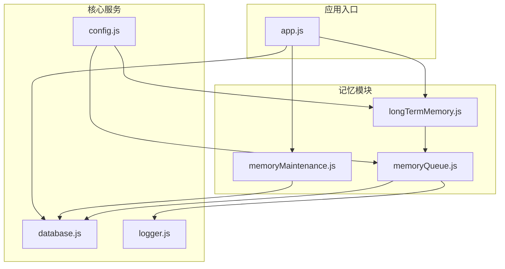
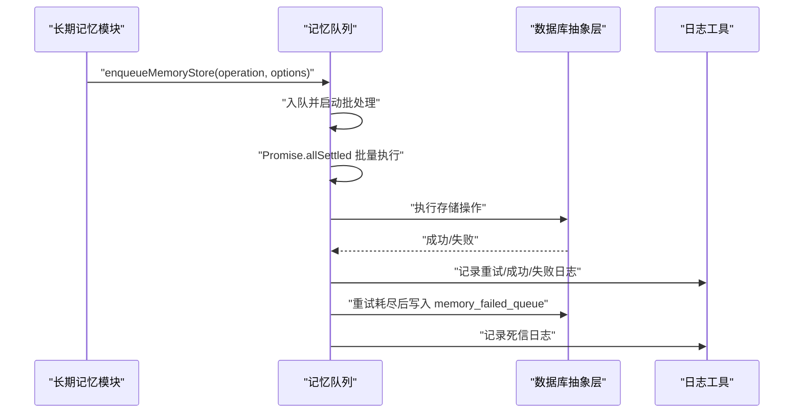
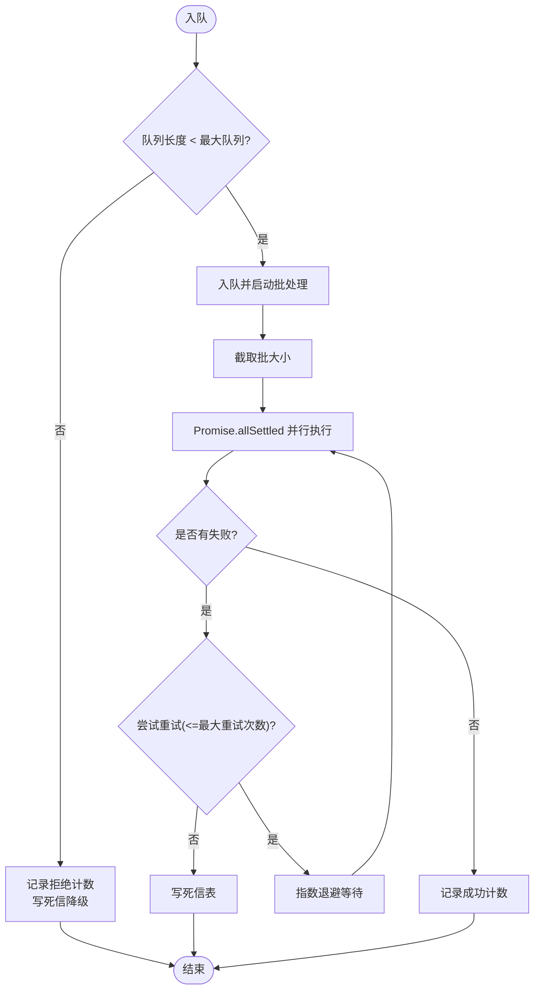
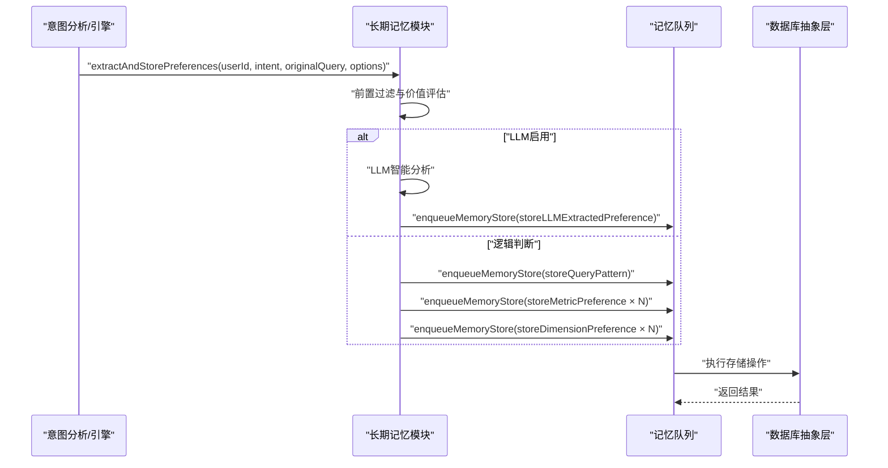
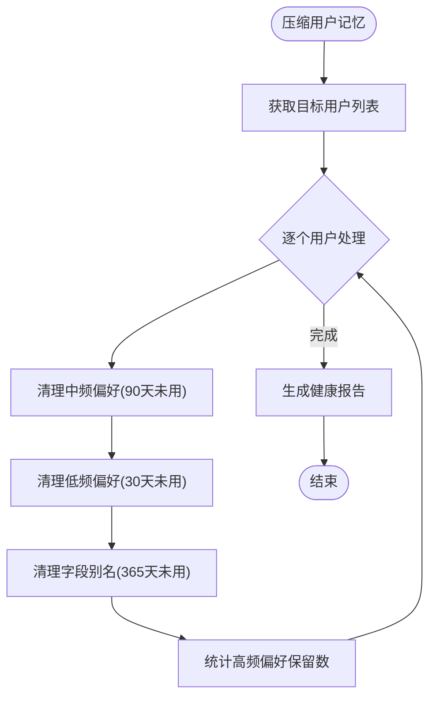
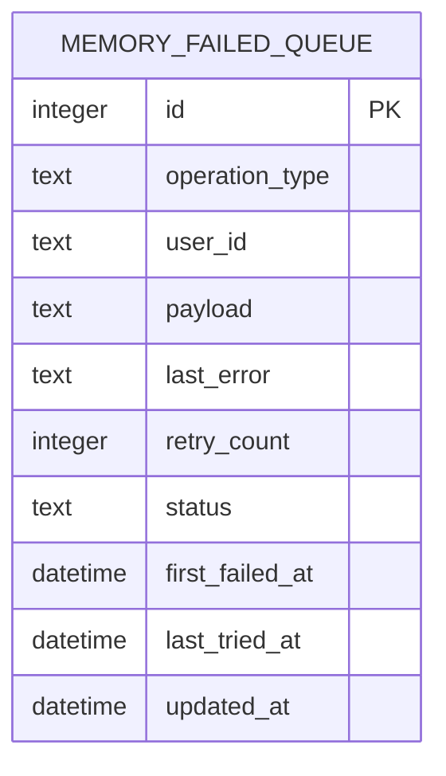
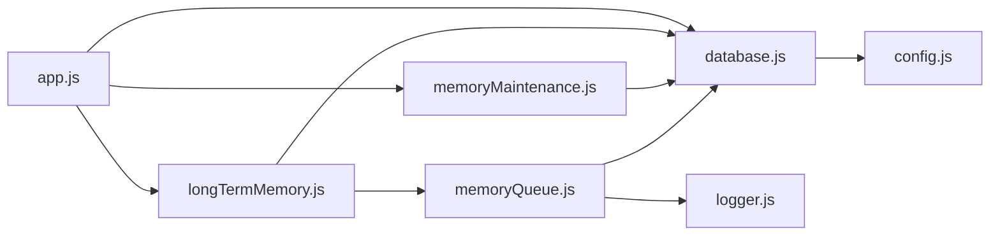

# 记忆队列系统

<cite>
**本文档引用的文件**
- [memoryQueue.js](file://backend/src/memory/memoryQueue.js)
- [longTermMemory.js](file://backend/src/memory/longTermMemory.js)
- [memoryMaintenance.js](file://backend/src/memory/memoryMaintenance.js)
- [database.js](file://backend/src/core/database.js)
- [logger.js](file://backend/src/utils/logger.js)
- [test-memoryQueue-deadletter.js](file://backend/test/phase4/test-memoryQueue-deadletter.js)
- [test-memoryQueue-retry.js](file://backend/test/phase4/test-memoryQueue-retry.js)
- [test-memoryFailedQueue-migration.js](file://backend/test/phase4/test-memoryFailedQueue-migration.js)
- [config.js](file://backend/src/core/config.js)
- [app.js](file://backend/src/app.js)
</cite>

## 目录
1. [简介](#简介)
2. [项目结构](#项目结构)
3. [核心组件](#核心组件)
4. [架构概览](#架构概览)
5. [详细组件分析](#详细组件分析)
6. [依赖分析](#依赖分析)
7. [性能考量](#性能考量)
8. [故障排查指南](#故障排查指南)
9. [结论](#结论)
10. [附录](#附录)

## 简介
本文件面向 NL2SQL 记忆队列系统，聚焦 Phase 4 增强的异步记忆存储实现，涵盖队列管理、任务调度、指数退避重试、死信队列处理、进程内指标导出、以及与长期记忆模块的集成方式。文档旨在帮助开发者与运维人员快速理解系统设计、掌握配置与调优方法，并提供可操作的监控与排障建议。

## 项目结构
记忆队列系统位于后端工程的 memory 目录，核心文件如下：
- memoryQueue.js：异步记忆存储队列实现，包含入队、批处理、重试、死信持久化与指标导出
- longTermMemory.js：长期记忆模块，负责偏好提取与存储决策，并通过队列异步落库
- memoryMaintenance.js：记忆维护模块，提供压缩、清理、相似模式合并等功能
- database.js：数据库抽象层，包含 memory_failed_queue 表的迁移与读写接口
- logger.js：统一日志工具，贯穿队列与维护模块的可观测性
- 测试用例：覆盖重试、死信持久化、死信表迁移与辅助方法

**图表来源**
- [memoryQueue.js:1-293](file://backend/src/memory/memoryQueue.js#L1-L293)
- [longTermMemory.js:1-486](file://backend/src/memory/longTermMemory.js#L1-L486)
- [memoryMaintenance.js:1-421](file://backend/src/memory/memoryMaintenance.js#L1-L421)
- [database.js:357-1227](file://backend/src/core/database.js#L357-L1227)
- [logger.js:1-482](file://backend/src/utils/logger.js#L1-L482)
- [config.js:1-200](file://backend/src/core/config.js#L1-L200)
- [app.js:1-200](file://backend/src/app.js#L1-L200)

**章节来源**
- [memoryQueue.js:1-293](file://backend/src/memory/memoryQueue.js#L1-L293)
- [longTermMemory.js:1-486](file://backend/src/memory/longTermMemory.js#L1-L486)
- [memoryMaintenance.js:1-421](file://backend/src/memory/memoryMaintenance.js#L1-L421)
- [database.js:357-1227](file://backend/src/core/database.js#L357-L1227)
- [logger.js:1-482](file://backend/src/utils/logger.js#L1-L482)
- [config.js:1-200](file://backend/src/core/config.js#L1-L200)
- [app.js:1-200](file://backend/src/app.js#L1-L200)

## 核心组件
- 异步记忆存储队列（memoryQueue.js）
  - 入队与批处理：支持批量消费、进程内队列与间隔调度
  - 指数退避重试：固定最大重试次数与退避因子，避免瞬时抖动放大
  - 死信持久化：重试耗尽后写入 memory_failed_queue 表，保障可观测性
  - 指标导出：提供入队、成功、重试、死信、队列长度等进程内指标
- 长期记忆模块（longTermMemory.js）
  - 偏好提取与存储：根据置信度、模式价值与使用频率决定是否存储
  - 异步存储：通过队列模块将存储操作异步化，避免阻塞主流程
- 记忆维护模块（memoryMaintenance.js）
  - 压缩与清理：按使用频率与时间阈值清理低价值记忆
  - 相似模式合并：合并高度相似的查询模式，减少冗余
- 数据库抽象层（database.js）
  - 死信表迁移与读写：幂等迁移、插入、扫描待处理记录、状态更新
- 日志工具（logger.js）
  - 统一日志格式与级别，支持文件轮转与追踪上下文

**章节来源**
- [memoryQueue.js:57-292](file://backend/src/memory/memoryQueue.js#L57-L292)
- [longTermMemory.js:299-486](file://backend/src/memory/longTermMemory.js#L299-L486)
- [memoryMaintenance.js:69-195](file://backend/src/memory/memoryMaintenance.js#L69-L195)
- [database.js:357-1227](file://backend/src/core/database.js#L357-L1227)
- [logger.js:270-482](file://backend/src/utils/logger.js#L270-L482)

## 架构概览
记忆队列系统围绕“异步存储 + 死信兜底”的设计展开，长期记忆模块在做出存储决策后，将具体落库操作封装为任务入队；队列以固定批大小与间隔进行批量处理，失败的任务按指数退避重试，超过最大重试次数后写入死信表；维护模块定期清理与合并记忆，保持系统健康。

**图表来源**
- [longTermMemory.js:399-411](file://backend/src/memory/longTermMemory.js#L399-L411)
- [memoryQueue.js:107-149](file://backend/src/memory/memoryQueue.js#L107-L149)
- [memoryQueue.js:154-215](file://backend/src/memory/memoryQueue.js#L154-L215)
- [database.js:1154-1175](file://backend/src/core/database.js#L1154-L1175)

## 详细组件分析

### 组件A：异步记忆存储队列（memoryQueue.js）
- 队列状态与常量
  - 内部队列、处理标志、批大小、处理间隔、最大队列长度、重试参数与指标对象
- 入队与批处理
  - 入队时检查队列长度，超限直接写死信并记录拒绝计数
  - 批量消费采用 splice 截取固定大小，Promise.allSettled 并行等待
  - 处理完成后根据剩余队列长度延时继续，避免空转
- 指数退避重试
  - 最大重试次数固定，退避公式为固定基数乘以退避因子的幂次
  - 每次重试更新最后错误时间与错误信息，便于监控与诊断
- 死信持久化
  - 重试耗尽后调用数据库接口写入死信表，包含操作类型、用户ID、负载、错误与重试次数
  - 数据库不可用时降级为日志告警，保证可观测性
- 指标与状态
  - 提供队列状态查询与进程内指标导出，包含队列长度、处理状态、批大小、间隔、最大重试次数、累计入队/成功/重试/死信/拒绝计数等

**图表来源**
- [memoryQueue.js:66-102](file://backend/src/memory/memoryQueue.js#L66-L102)
- [memoryQueue.js:107-149](file://backend/src/memory/memoryQueue.js#L107-L149)
- [memoryQueue.js:154-215](file://backend/src/memory/memoryQueue.js#L154-L215)
- [memoryQueue.js:220-234](file://backend/src/memory/memoryQueue.js#L220-L234)

**章节来源**
- [memoryQueue.js:25-47](file://backend/src/memory/memoryQueue.js#L25-L47)
- [memoryQueue.js:66-102](file://backend/src/memory/memoryQueue.js#L66-L102)
- [memoryQueue.js:107-149](file://backend/src/memory/memoryQueue.js#L107-L149)
- [memoryQueue.js:154-215](file://backend/src/memory/memoryQueue.js#L154-L215)
- [memoryQueue.js:220-234](file://backend/src/memory/memoryQueue.js#L220-L234)
- [memoryQueue.js:240-260](file://backend/src/memory/memoryQueue.js#L240-L260)
- [memoryQueue.js:268-284](file://backend/src/memory/memoryQueue.js#L268-L284)

### 组件B：长期记忆模块（longTermMemory.js）
- 存储决策
  - 前置过滤：查询成功、置信度达标、排除过于具体的一次性查询
  - 价值评估：高价值模板（维度/指标阈值）、近期高频模式、简单查询需更高频率
  - LLM 智能分析：在启用时对用户表达进行解析，提取字段别名、维度习惯、指标组合、过滤逻辑等偏好
- 异步存储
  - 通过队列模块将查询模式、指标偏好、维度偏好等异步入队，避免阻塞主流程
  - 对 LLM 提取的偏好类型进行分类处理，必要时补充存储查询模式
- 偏好存储
  - 查询模式、指标偏好、维度偏好均通过数据库接口进行去重、更新使用次数或创建新记录

**图表来源**
- [longTermMemory.js:299-486](file://backend/src/memory/longTermMemory.js#L299-L486)
- [memoryQueue.js:399-461](file://backend/src/memory/longTermMemory.js#L399-L461)

**章节来源**
- [longTermMemory.js:299-486](file://backend/src/memory/longTermMemory.js#L299-L486)
- [longTermMemory.js:495-607](file://backend/src/memory/longTermMemory.js#L495-L607)
- [longTermMemory.js:616-758](file://backend/src/memory/longTermMemory.js#L616-L758)

### 组件C：记忆维护模块（memoryMaintenance.js）
- 压缩与清理
  - 按使用频率分级：高频永久保留、中频90天未用清理、低频30天未用清理、字段别名365天未用清理
  - 跳过置顶记忆（is_pinned=1），避免误删关键规则
- 相似模式合并
  - 基于维度/指标重合度与时间范围类型判断相似性，合并为更通用模式
- 统计与报告
  - 提供用户记忆统计与系统健康报告，估算待清理数量

**图表来源**
- [memoryMaintenance.js:69-195](file://backend/src/memory/memoryMaintenance.js#L69-L195)
- [memoryMaintenance.js:207-315](file://backend/src/memory/memoryMaintenance.js#L207-L315)

**章节来源**
- [memoryMaintenance.js:69-195](file://backend/src/memory/memoryMaintenance.js#L69-L195)
- [memoryMaintenance.js:207-315](file://backend/src/memory/memoryMaintenance.js#L207-L315)
- [memoryMaintenance.js:326-401](file://backend/src/memory/memoryMaintenance.js#L326-L401)

### 组件D：数据库抽象层（database.js）
- 死信表迁移
  - 幂等迁移：CREATE TABLE IF NOT EXISTS，保证升级路径兼容
  - 索引：为 status 与 user_id 建立索引，提升扫描效率
- 死信表操作
  - 插入：addMemoryFailedOperation，写入操作类型、用户ID、负载、错误与重试次数
  - 扫描：listPendingMemoryFailed，按创建时间升序返回待处理记录
  - 更新：updateMemoryFailedStatus，支持状态、重试次数与最后错误更新

**图表来源**
- [database.js:357-370](file://backend/src/core/database.js#L357-L370)
- [database.js:1154-1175](file://backend/src/core/database.js#L1154-L1175)
- [database.js:1180-1195](file://backend/src/core/database.js#L1180-L1195)
- [database.js:1200-1227](file://backend/src/core/database.js#L1200-L1227)

**章节来源**
- [database.js:357-370](file://backend/src/core/database.js#L357-L370)
- [database.js:1154-1175](file://backend/src/core/database.js#L1154-L1175)
- [database.js:1180-1195](file://backend/src/core/database.js#L1180-L1195)
- [database.js:1200-1227](file://backend/src/core/database.js#L1200-L1227)

## 依赖分析
- 组件耦合
  - longTermMemory 依赖 memoryQueue 与 database；memoryQueue 依赖 database 与 logger
  - memoryMaintenance 依赖 database 与 config；database 依赖 config 与 logger
- 外部依赖
  - SQLite（数据库）、LanceDB（向量存储，与记忆相关）、日志轮转与追踪
- 循环依赖
  - 未发现循环依赖；模块职责清晰，接口边界明确

**图表来源**
- [longTermMemory.js:17-22](file://backend/src/memory/longTermMemory.js#L17-L22)
- [memoryQueue.js:13-20](file://backend/src/memory/memoryQueue.js#L13-L20)
- [memoryMaintenance.js:16-18](file://backend/src/memory/memoryMaintenance.js#L16-L18)
- [database.js:17-19](file://backend/src/core/database.js#L17-L19)
- [app.js:44-52](file://backend/src/app.js#L44-L52)

**章节来源**
- [longTermMemory.js:17-22](file://backend/src/memory/longTermMemory.js#L17-L22)
- [memoryQueue.js:13-20](file://backend/src/memory/memoryQueue.js#L13-L20)
- [memoryMaintenance.js:16-18](file://backend/src/memory/memoryMaintenance.js#L16-L18)
- [database.js:17-19](file://backend/src/core/database.js#L17-L19)
- [app.js:44-52](file://backend/src/app.js#L44-L52)

## 性能考量
- 并发控制
  - 批量大小固定，避免单批过大导致延迟；处理间隔固定，平衡吞吐与延迟
  - Promise.allSettled 并行执行，充分利用 CPU 与 I/O 并发
- 内存限制
  - 队列长度上限保护，超限直接写死信，避免 OOM
  - 死信表采用字符串化负载与截断，控制单条记录体积
- 重试与退避
  - 指数退避降低瞬时压力，最大重试次数限制资源占用
- I/O 优化
  - 死信表建立索引，提升扫描与更新效率
  - 日志级别可控，生产环境建议提升日志级别以减少 I/O

[本节为通用性能讨论，不直接分析具体文件]

## 故障排查指南
- 死信队列处理
  - 使用 listPendingMemoryFailed 获取待处理记录，核对操作类型、用户ID、负载与错误
  - 通过 updateMemoryFailedStatus 更新状态（如 reviewed、archived），并记录最新错误
- 指标与日志
  - 通过 getQueueMetrics 获取入队/成功/重试/死信/拒绝计数，结合日志定位异常
  - 使用 waitForComplete 等待队列清空，便于优雅停机与排障
- 单元测试参考
  - 死信持久化测试：验证重试次数、死信计数与死信表字段
  - 指数退避重试测试：验证重试次数与耗时
  - 死信表迁移测试：验证幂等迁移、索引存在与辅助方法

**章节来源**
- [memoryQueue.js:240-260](file://backend/src/memory/memoryQueue.js#L240-L260)
- [memoryQueue.js:268-284](file://backend/src/memory/memoryQueue.js#L268-L284)
- [database.js:1180-1195](file://backend/src/core/database.js#L1180-L1195)
- [database.js:1200-1227](file://backend/src/core/database.js#L1200-L1227)
- [test-memoryQueue-deadletter.js:30-89](file://backend/test/phase4/test-memoryQueue-deadletter.js#L30-L89)
- [test-memoryQueue-retry.js:24-87](file://backend/test/phase4/test-memoryQueue-retry.js#L24-L87)
- [test-memoryFailedQueue-migration.js:31-127](file://backend/test/phase4/test-memoryFailedQueue-migration.js#L31-L127)

## 结论
记忆队列系统通过异步化与死信兜底，有效提升了长期记忆模块的稳定性与性能；指数退避与队列长度保护降低了瞬时抖动风险；完善的指标与日志为运维提供了可观测性支撑。配合记忆维护模块的定期清理与合并，系统在高并发场景下仍能保持健康与高效。

[本节为总结性内容，不直接分析具体文件]

## 附录

### 配置参数与扩展性
- 队列与重试参数（可在代码中调整）
  - 批处理间隔、批大小、最大重试次数、基础退避时间、退避因子、队列最大长度
- 长期记忆阈值（可通过配置覆盖）
  - 最低置信度、模板维度/指标阈值、最近周期与频率阈值
- 数据库与日志
  - SQLite 路径、向量数据库路径、日志文件路径与轮转策略

**章节来源**
- [memoryQueue.js:29-36](file://backend/src/memory/memoryQueue.js#L29-L36)
- [longTermMemory.js:29-35](file://backend/src/memory/longTermMemory.js#L29-L35)
- [config.js:104-143](file://backend/src/core/config.js#L104-L143)
- [logger.js:116-179](file://backend/src/utils/logger.js#L116-L179)

### 与其他系统组件的集成方式
- 长期记忆模块在存储决策后，将具体落库操作封装为任务入队，避免阻塞主流程
- 应用启动时初始化数据库与向量存储，随后启动自修复调度器与 HTTP 服务
- 记忆维护模块通过数据库接口定期执行压缩与合并，保障系统健康

**章节来源**
- [longTermMemory.js:399-461](file://backend/src/memory/longTermMemory.js#L399-L461)
- [app.js:99-200](file://backend/src/app.js#L99-L200)
- [memoryMaintenance.js:69-195](file://backend/src/memory/memoryMaintenance.js#L69-L195)