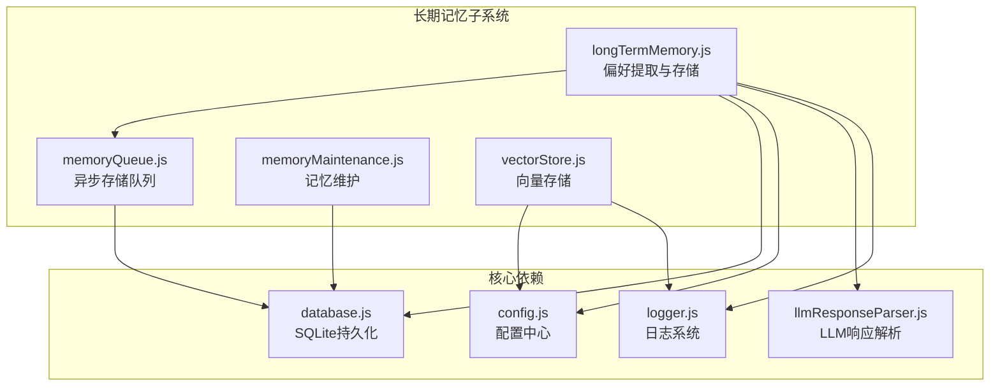
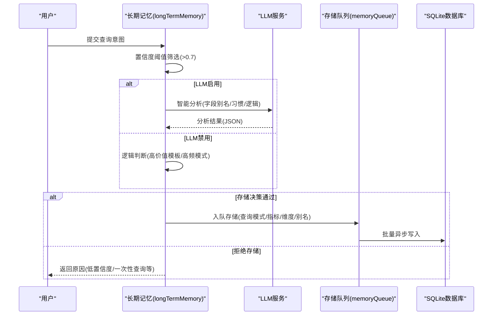
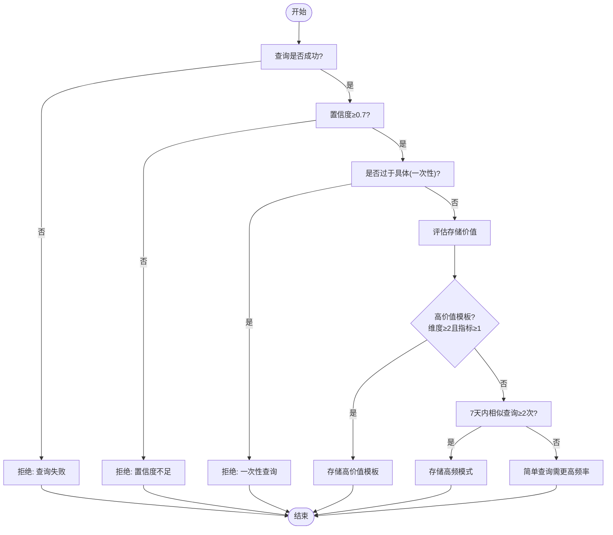
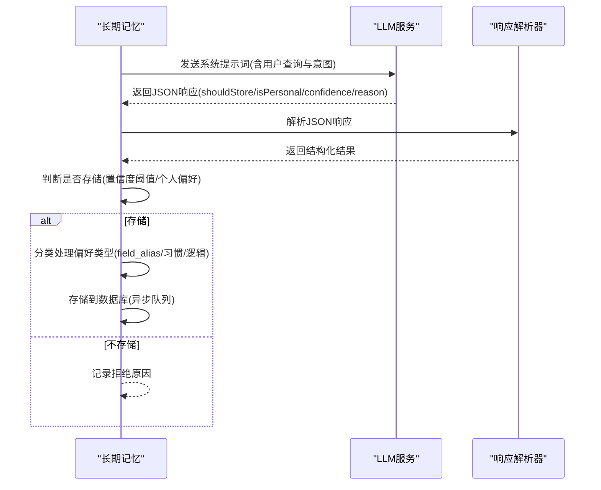
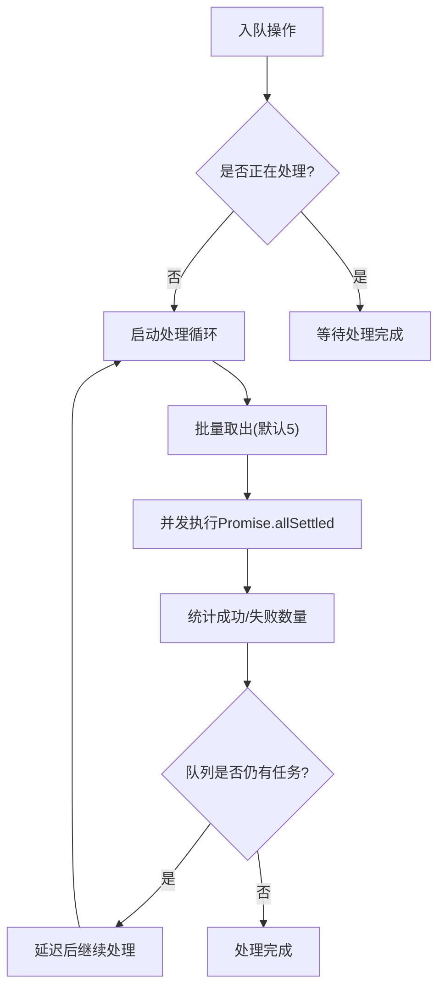
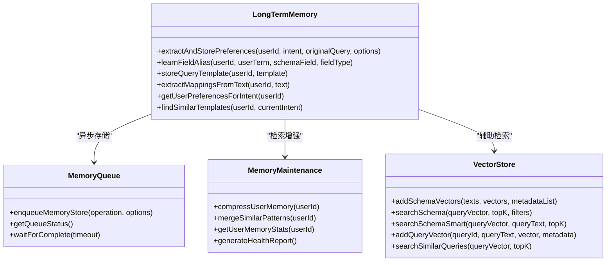
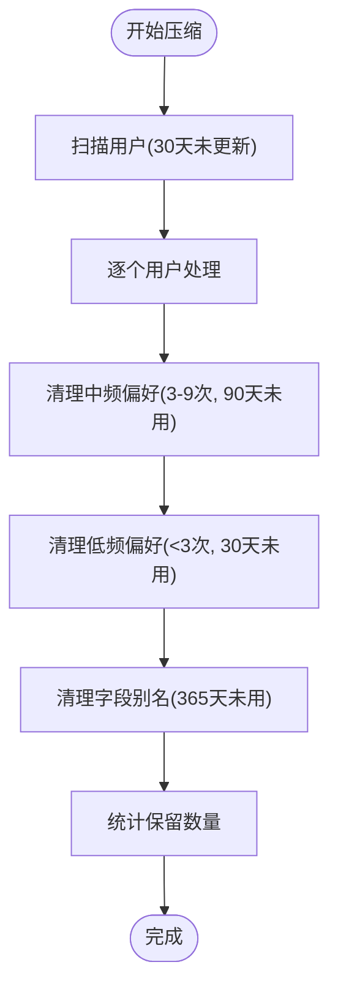
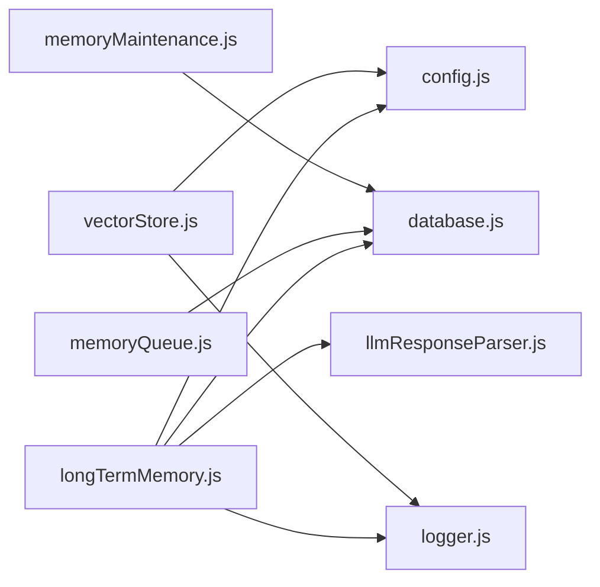

# 长期记忆管理

<cite>
**本文引用的文件**
- [longTermMemory.js](file://backend/src/memory/longTermMemory.js)
- [memoryQueue.js](file://backend/src/memory/memoryQueue.js)
- [memoryMaintenance.js](file://backend/src/memory/memoryMaintenance.js)
- [vectorStore.js](file://backend/src/memory/vectorStore.js)
- [config.js](file://backend/src/core/config.js)
- [database.js](file://backend/src/core/database.js)
- [llmResponseParser.js](file://backend/src/utils/llmResponseParser.js)
- [logger.js](file://backend/src/utils/logger.js)
- [business-semantic-layer.json](file://backend/config/business-semantic-layer.json)
</cite>

## 目录
1. [简介](#简介)
2. [项目结构](#项目结构)
3. [核心组件](#核心组件)
4. [架构概览](#架构概览)
5. [详细组件分析](#详细组件分析)
6. [依赖分析](#依赖分析)
7. [性能考虑](#性能考虑)
8. [故障排查指南](#故障排查指南)
9. [结论](#结论)
10. [附录](#附录)

## 简介
本技术文档面向NL2SQL长期记忆管理系统，系统性阐述其设计理念、三层筛选机制、LLM智能分析能力、异步存储队列机制以及配置参数与性能调优建议。长期记忆作为系统第二层能力，负责从用户查询中提取并存储偏好知识，包括查询模式、字段别名、常用指标/维度偏好等，从而提升后续意图识别与实体解析的准确性与效率。

## 项目结构
长期记忆相关模块位于后端工程的memory目录，围绕三层核心能力组织：
- 长期记忆提取与存储：负责从查询意图中提取偏好并进行存储
- 异步存储队列：将存储操作异步化，避免阻塞主流程
- 记忆维护：定期压缩、清理与相似模式合并
- 向量存储：为Schema与查询历史提供语义检索能力（辅助长期记忆）

图表来源
- [longTermMemory.js:1-1143](file://backend/src/memory/longTermMemory.js#L1-L1143)
- [memoryQueue.js:1-217](file://backend/src/memory/memoryQueue.js#L1-L217)
- [memoryMaintenance.js:1-421](file://backend/src/memory/memoryMaintenance.js#L1-L421)
- [vectorStore.js:1-948](file://backend/src/memory/vectorStore.js#L1-L948)
- [config.js:1-398](file://backend/src/core/config.js#L1-L398)
- [database.js:1-1016](file://backend/src/core/database.js#L1-L1016)
- [llmResponseParser.js:1-146](file://backend/src/utils/llmResponseParser.js#L1-L146)
- [logger.js:1-482](file://backend/src/utils/logger.js#L1-L482)

章节来源
- [longTermMemory.js:1-1143](file://backend/src/memory/longTermMemory.js#L1-L1143)
- [memoryQueue.js:1-217](file://backend/src/memory/memoryQueue.js#L1-L217)
- [memoryMaintenance.js:1-421](file://backend/src/memory/memoryMaintenance.js#L1-L421)
- [vectorStore.js:1-948](file://backend/src/memory/vectorStore.js#L1-L948)
- [config.js:1-398](file://backend/src/core/config.js#L1-L398)
- [database.js:1-1016](file://backend/src/core/database.js#L1-L1016)
- [llmResponseParser.js:1-146](file://backend/src/utils/llmResponseParser.js#L1-L146)
- [logger.js:1-482](file://backend/src/utils/logger.js#L1-L482)

## 核心组件
- 长期记忆提取与存储（Layer 2）：负责用户偏好提取、存储策略与检索增强
- 异步存储队列：内存队列管理、批量存储优化与错误处理
- 记忆维护：分级保留策略、相似模式合并与健康报告
- 向量存储：Schema与查询历史的语义检索，辅助长期记忆的智能排序与过滤

章节来源
- [longTermMemory.js:1-1143](file://backend/src/memory/longTermMemory.js#L1-L1143)
- [memoryQueue.js:1-217](file://backend/src/memory/memoryQueue.js#L1-L217)
- [memoryMaintenance.js:1-421](file://backend/src/memory/memoryMaintenance.js#L1-L421)
- [vectorStore.js:1-948](file://backend/src/memory/vectorStore.js#L1-L948)

## 架构概览
长期记忆系统采用“三层筛选 + LLM智能分析 + 异步队列”的设计，确保只存储高价值偏好，同时通过异步机制保证系统性能与稳定性。

图表来源
- [longTermMemory.js:299-461](file://backend/src/memory/longTermMemory.js#L299-L461)
- [memoryQueue.js:46-118](file://backend/src/memory/memoryQueue.js#L46-L118)
- [config.js:259-293](file://backend/src/core/config.js#L259-L293)

## 详细组件分析

### 三层筛选机制
系统通过三道筛选防线，确保只存储高价值偏好：
1) 置信度阈值（>0.7）：拒绝低质量意图
2) 查询模式价值评估（维度≥2且指标≥1）：高价值模板优先
3) 高频模式检测（7天内≥2次）：重复出现的模式优先

图表来源
- [longTermMemory.js:208-283](file://backend/src/memory/longTermMemory.js#L208-L283)
- [longTermMemory.js:239-283](file://backend/src/memory/longTermMemory.js#L239-L283)

章节来源
- [longTermMemory.js:208-283](file://backend/src/memory/longTermMemory.js#L208-L283)

### LLM智能分析功能
当启用LLM智能分析时，系统使用精心设计的提示词，从用户查询中提取四类偏好：
- 字段别名（field_alias）：最高优先级，涵盖游戏实体映射、数据源映射与字段别名
- 分析习惯（dimension_habit/metric_bundle）：用户习惯的维度组合或指标集合
- 业务逻辑定义（filter_logic）：用户定义的通用过滤规则
- 通用/单次查询（standard）：低价值，不应存储

图表来源
- [longTermMemory.js:58-190](file://backend/src/memory/longTermMemory.js#L58-L190)
- [llmResponseParser.js:24-59](file://backend/src/utils/llmResponseParser.js#L24-L59)

章节来源
- [longTermMemory.js:58-190](file://backend/src/memory/longTermMemory.js#L58-L190)
- [llmResponseParser.js:24-59](file://backend/src/utils/llmResponseParser.js#L24-L59)

### 异步队列机制
内存队列采用批量处理与并发执行策略，显著提升高并发场景下的吞吐量与稳定性：
- 内存队列：先进先出，记录操作函数与上下文
- 批量处理：每次取固定数量（默认5）并发执行
- 错误处理：Promise.allSettled收集结果，失败记录日志但不影响整体流程
- 间隔调度：处理完成后延迟一段时间继续处理剩余任务

图表来源
- [memoryQueue.js:46-118](file://backend/src/memory/memoryQueue.js#L46-L118)

章节来源
- [memoryQueue.js:46-118](file://backend/src/memory/memoryQueue.js#L46-L118)

### 记忆存储与检索增强
- 存储策略：查询模式（高价值模板/高频模式）、字段别名、常用指标/维度偏好
- 检索增强：getUserPreferencesForIntent聚合用户偏好，用于意图识别增强
- 相似模板：findSimilarTemplates基于维度/指标重叠度与使用频率打分

图表来源
- [longTermMemory.js:1123-1142](file://backend/src/memory/longTermMemory.js#L1123-L1142)
- [memoryQueue.js:208-216](file://backend/src/memory/memoryQueue.js#L208-L216)
- [memoryMaintenance.js:407-420](file://backend/src/memory/memoryMaintenance.js#L407-L420)
- [vectorStore.js:1-948](file://backend/src/memory/vectorStore.js#L1-L948)

章节来源
- [longTermMemory.js:979-1072](file://backend/src/memory/longTermMemory.js#L979-L1072)
- [memoryMaintenance.js:326-401](file://backend/src/memory/memoryMaintenance.js#L326-L401)

### 记忆维护与清理策略
系统采用分级保留策略，避免存储膨胀：
- 高频（≥10次）：永久保留
- 中频（3-9次）：90天未用清理
- 低频（<3次）：30天未用清理
- 字段别名：365天未用清理

图表来源
- [memoryMaintenance.js:69-195](file://backend/src/memory/memoryMaintenance.js#L69-L195)

章节来源
- [memoryMaintenance.js:69-195](file://backend/src/memory/memoryMaintenance.js#L69-L195)

## 依赖分析
- 配置中心：集中管理长期记忆开关、阈值与保留策略
- 数据库：SQLite持久化用户偏好，支持索引优化与批量写入
- 日志系统：统一记录长期记忆流程与异常，支持追踪上下文
- LLM响应解析器：标准化JSON/SQL提取，减少重复实现

图表来源
- [longTermMemory.js:17-22](file://backend/src/memory/longTermMemory.js#L17-L22)
- [memoryQueue.js:8](file://backend/src/memory/memoryQueue.js#L8)
- [memoryMaintenance.js:16-18](file://backend/src/memory/memoryMaintenance.js#L16-L18)
- [vectorStore.js:14-23](file://backend/src/memory/vectorStore.js#L14-L23)
- [config.js:259-293](file://backend/src/core/config.js#L259-L293)

章节来源
- [config.js:259-293](file://backend/src/core/config.js#L259-L293)
- [database.js:137-163](file://backend/src/core/database.js#L137-L163)

## 性能考虑
- 异步存储：通过内存队列与批量处理，显著降低主线程阻塞
- 索引优化：user_id、preference_type、复合索引加速查询与清理
- 阈值调优：合理设置置信度阈值与频率阈值，平衡存储价值与性能
- 向量检索：智能搜索结合表名推断与优先级重排，提升检索质量
- 日志级别：生产环境建议使用info/warn/error，避免trace/debug造成I/O开销

## 故障排查指南
- LLM分析失败：系统会回退到逻辑判断，检查LLM API配置与网络连通性
- 存储失败：队列处理使用Promise.allSettled，失败记录日志但不影响整体流程
- 队列堆积：检查队列状态与处理间隔，必要时调整批量大小
- 记忆清理异常：核对保留策略配置，确认用户偏好表索引是否生效

章节来源
- [longTermMemory.js:186-189](file://backend/src/memory/longTermMemory.js#L186-L189)
- [memoryQueue.js:108-117](file://backend/src/memory/memoryQueue.js#L108-L117)
- [memoryMaintenance.js:116-119](file://backend/src/memory/memoryMaintenance.js#L116-L119)

## 结论
NL2SQL长期记忆系统通过三层筛选与LLM智能分析，精准提取高价值偏好；借助异步队列与分级保留策略，确保系统性能与稳定性；结合向量检索与记忆维护，持续优化用户体验。合理的配置与调优策略将带来更好的长期收益。

## 附录

### 配置参数说明
- 长期记忆开关：LTM_ENABLED（默认启用）
- LLM智能分析：LTM_USE_LLM（默认关闭）
- 置信度阈值：minConfidence（默认0.7）
- 高价值模板阈值：minDimensionsForTemplate/minMetricsForTemplate（默认2/1）
- 高频模式阈值：recentDaysForFrequency/minFrequencyForSimple（默认7/2）
- 保留策略：highUsage/mediumUsage/lowUsage/fieldAlias（默认null/90/30/365）

章节来源
- [config.js:259-293](file://backend/src/core/config.js#L259-L293)

### 实际使用案例
- 字段别名学习：用户声明“青木是游戏名称，对应 game_id=30”，系统自动学习并存储映射关系
- 分析习惯：用户表达“以后看转化率时，记得带上来源渠道”，系统存储维度习惯偏好
- 业务逻辑定义：用户定义“统计流水时剔除测试账号”，系统存储过滤逻辑偏好
- 高频模式：用户在7天内多次查询“按天查流水”，系统识别为高频模式并存储

章节来源
- [longTermMemory.js:847-968](file://backend/src/memory/longTermMemory.js#L847-L968)
- [business-semantic-layer.json:150-187](file://backend/config/business-semantic-layer.json#L150-L187)