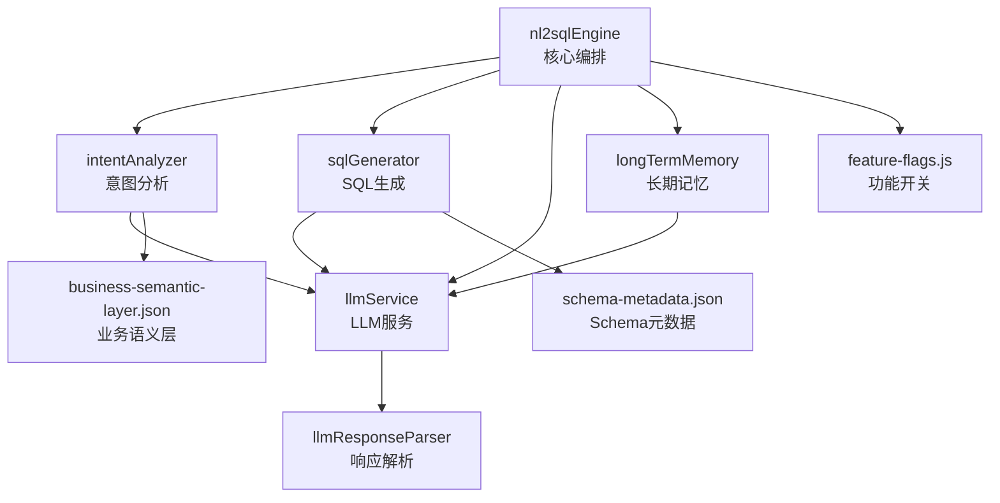
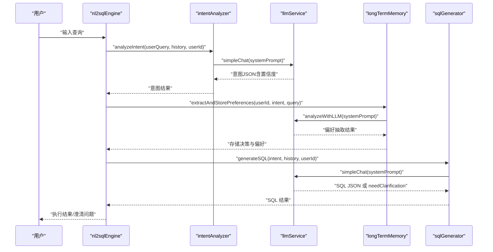
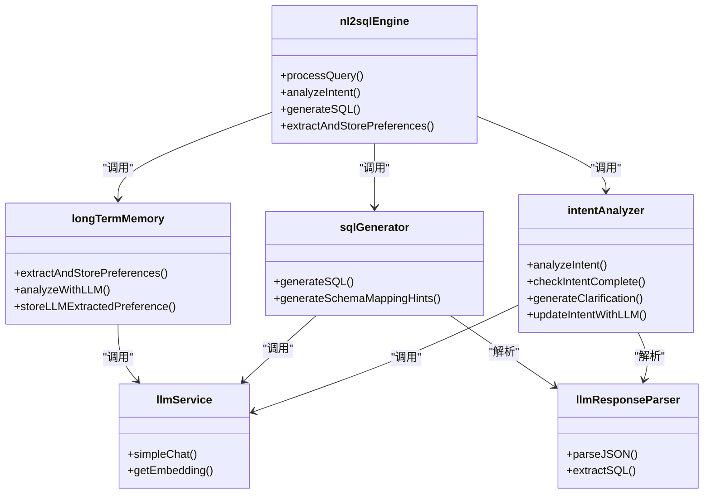

# LLM 智能分析

<cite>
**本文引用的文件**
- [nl2sqlEngine.js](file://backend/src/core/nl2sqlEngine.js)
- [intentAnalyzer.js](file://backend/src/core/intentAnalyzer.js)
- [llmService.js](file://backend/src/core/llmService.js)
- [llmResponseParser.js](file://backend/src/utils/llmResponseParser.js)
- [longTermMemory.js](file://backend/src/memory/longTermMemory.js)
- [sqlGenerator.js](file://backend/src/core/sqlGenerator.js)
- [feature-flags.js](file://backend/config/feature-flags.js)
- [business-semantic-layer.json](file://backend/config/business-semantic-layer.json)
- [schema-metadata.json](file://backend/config/schema-metadata.json)
</cite>

## 目录
1. [简介](#简介)
2. [项目结构](#项目结构)
3. [核心组件](#核心组件)
4. [架构总览](#架构总览)
5. [详细组件分析](#详细组件分析)
6. [依赖关系分析](#依赖关系分析)
7. [性能考量](#性能考量)
8. [故障排除指南](#故障排除指南)
9. [结论](#结论)
10. [附录](#附录)

## 简介
本技术文档聚焦 NL2SQL 系统中的 LLM 智能分析能力，围绕“智能偏好抽取与置信度评估”的核心目标，系统梳理以下主题：
- LLM 分析的角色设定与任务目标
- 判定维度（按优先级排序）与输出格式规范
- 四种偏好类型的提取规则：字段别名、分析习惯、业务逻辑定义、通用/单次查询
- 置信度评估机制、单次查询排除规则、个人偏好识别策略
- 配置参数说明、性能优化建议与故障排除指南

## 项目结构
本项目采用模块化分层设计，LLM 智能分析主要分布在以下模块：
- 核心编排：nl2sqlEngine.js
- 意图分析：intentAnalyzer.js
- LLM 服务：llmService.js
- 响应解析：llmResponseParser.js
- 长期记忆与偏好抽取：longTermMemory.js
- SQL 生成与提示词：sqlGenerator.js
- 配置与语义层：feature-flags.js、business-semantic-layer.json、schema-metadata.json

图表来源
- [nl2sqlEngine.js:121-734](file://backend/src/core/nl2sqlEngine.js#L121-L734)
- [intentAnalyzer.js:173-468](file://backend/src/core/intentAnalyzer.js#L173-L468)
- [sqlGenerator.js:84-479](file://backend/src/core/sqlGenerator.js#L84-L479)
- [llmService.js:332-370](file://backend/src/core/llmService.js#L332-L370)
- [llmResponseParser.js:24-59](file://backend/src/utils/llmResponseParser.js#L24-L59)
- [longTermMemory.js:58-190](file://backend/src/memory/longTermMemory.js#L58-L190)
- [feature-flags.js:16-141](file://backend/config/feature-flags.js#L16-L141)
- [business-semantic-layer.json:1-189](file://backend/config/business-semantic-layer.json#L1-L189)
- [schema-metadata.json:1-800](file://backend/config/schema-metadata.json#L1-L800)

章节来源
- [nl2sqlEngine.js:121-734](file://backend/src/core/nl2sqlEngine.js#L121-L734)
- [intentAnalyzer.js:173-468](file://backend/src/core/intentAnalyzer.js#L173-L468)
- [sqlGenerator.js:84-479](file://backend/src/core/sqlGenerator.js#L84-L479)
- [llmService.js:332-370](file://backend/src/core/llmService.js#L332-L370)
- [llmResponseParser.js:24-59](file://backend/src/utils/llmResponseParser.js#L24-L59)
- [longTermMemory.js:58-190](file://backend/src/memory/longTermMemory.js#L58-L190)
- [feature-flags.js:16-141](file://backend/config/feature-flags.js#L16-L141)
- [business-semantic-layer.json:1-189](file://backend/config/business-semantic-layer.json#L1-L189)
- [schema-metadata.json:1-800](file://backend/config/schema-metadata.json#L1-L800)

## 核心组件
- LLM 服务层：封装 LLM API 调用、重试机制、流式响应与日志脱敏。
- 意图分析模块：融合上下文、长期记忆与相似查询，输出结构化意图与置信度。
- SQL 生成模块：基于意图构建提示词，融合语义层与字段别名，生成可执行 SQL。
- 长期记忆模块：通过 LLM 智能分析判断偏好价值，提取并存储字段别名、分析习惯、业务逻辑等。
- 核心编排：串联各模块，处理澄清、验证、RLS 改写、执行与结果格式化。

章节来源
- [llmService.js:224-322](file://backend/src/core/llmService.js#L224-L322)
- [intentAnalyzer.js:173-468](file://backend/src/core/intentAnalyzer.js#L173-L468)
- [sqlGenerator.js:84-479](file://backend/src/core/sqlGenerator.js#L84-L479)
- [longTermMemory.js:299-486](file://backend/src/memory/longTermMemory.js#L299-L486)
- [nl2sqlEngine.js:121-734](file://backend/src/core/nl2sqlEngine.js#L121-L734)

## 架构总览
LLM 智能分析贯穿意图识别与 SQL 生成两大阶段，通过“角色设定 + 任务目标 + 判定维度 + 输出规范”的提示词体系，驱动 LLM 从用户查询中抽取高价值偏好，并在 SQL 生成阶段严格遵循业务语义与字段映射。

图表来源
- [nl2sqlEngine.js:262-412](file://backend/src/core/nl2sqlEngine.js#L262-L412)
- [intentAnalyzer.js:396-467](file://backend/src/core/intentAnalyzer.js#L396-L467)
- [longTermMemory.js:58-190](file://backend/src/memory/longTermMemory.js#L58-L190)
- [sqlGenerator.js:454-479](file://backend/src/core/sqlGenerator.js#L454-L479)
- [llmService.js:332-370](file://backend/src/core/llmService.js#L332-L370)

## 详细组件分析

### 角色设定与任务目标
- 角色：资深数据分析专家
- 任务：判断当前查询是否包含“知识增量”，以优化未来意图识别与实体解析
- 目标：从用户查询中提取高价值偏好，区分个人偏好与通用知识，指导长期记忆存储

章节来源
- [longTermMemory.js:65-170](file://backend/src/memory/longTermMemory.js#L65-L170)

### 判定维度（按优先级排序）
1) 字段别名/映射（field_alias）- 最高优先级
- 游戏实体映射：用户说明游戏名称与ID对应（如“青木是指 game_id=30”）
- 数据源映射：用户说明平台/数据源标识（如“新平台是 new_tzpingtai”）
- 字段别名：用户为 Schema 字段起别名（如“营收就是指收入金额”）
- 记忆价值：极高（直接影响实体解析）

2) 分析习惯（dimension_habit / metric_bundle）
- 用户习惯查看的维度组合或特定指标（如“我习惯按渠道拆解流水”、“看 DAU 时必须带上 ROI”）
- 记忆价值：高（用于补充缺省维度/指标）

3) 业务逻辑定义（filter_logic）- 谨慎使用
- 用户定义的**通用**计算口径或过滤规则（如“统计流水时剔除测试账号”、“大区只看华东和华北”）
- 重要区分：以下情况不应存为 filter_logic
  - 某次查询中使用了特定表名（如“用 new_tzpingtai.tzpingtai_tz_sdk_log_pf_order 表”）
  - 某次查询中指定了特定 game_id（如“查 game_id=88 的数据”）
- 记忆价值：仅当用户明确表达“以后都按这个规则”时才存储

4) 通用/单次查询（standard）
- 任何人都会问的通用定义或无特殊偏好的单次取数（如“什么是 ROI？”、“查一下去年的总利润”）
- 记忆价值：低（不应存储）

章节来源
- [longTermMemory.js:71-170](file://backend/src/memory/longTermMemory.js#L71-L170)

### 输出格式规范
- shouldStore: boolean，是否值得存入长期记忆
- isPersonal: boolean，是否为该用户特有的习惯/术语
- confidence: float（0.0-1.0），判断置信度
- reason: 推理路径
- extractedPreferences: 数组，每项包含
  - type: 偏好类型（field_alias / dimension_habit / metric_bundle / filter_logic）
  - content: 具体内容对象
    - user_term: 用户表达的词汇
    - schema_field: 对应的数据库字段/指标名
    - mapping_value: 具体对应的值（如ID 30），若无则不填
    - logic: 逻辑描述（用于 filter_logic）
    - associated_dimensions: 关联维度数组（用于 metric_bundle）
  - isPersonal: true

章节来源
- [longTermMemory.js:98-117](file://backend/src/memory/longTermMemory.js#L98-L117)

### 四种偏好类型的提取规则

#### 字段别名（field_alias）
- 触发条件：用户明确声明“A 对应 B”、“A 是 B”、“A 表示 B”
- 存储策略：
  - 直接映射：如“新平台 -> new_tzpingtai”，直接存用户术语->值
  - 字段映射：如“青木 -> game_id”，同时存储值映射（如“青木_value -> 30”）
- 例外：伪字段（如 database_identifier、platform_type、datasource）优先直接映射

章节来源
- [longTermMemory.js:501-544](file://backend/src/memory/longTermMemory.js#L501-L544)

#### 分析习惯（dimension_habit / metric_bundle）
- 触发信号：用户明确说“我习惯...”、“以后都...”、“每次看XX都要...”
- 存储策略：将维度习惯与触发指标关联，形成查询模式
- 示例：看“转化率”时带上“来源渠道”

章节来源
- [longTermMemory.js:550-569](file://backend/src/memory/longTermMemory.js#L550-L569)

#### 业务逻辑定义（filter_logic）
- 触发条件：用户定义“以后都按这个规则”或“通用口径”
- 排除规则：单次查询的具体信息（特定表名、特定 game_id）不应存为 filter_logic
- 存储策略：以查询模式形式存储，包含逻辑描述与触发条件

章节来源
- [longTermMemory.js:590-598](file://backend/src/memory/longTermMemory.js#L590-L598)

#### 通用/单次查询（standard）
- 排除条件：包含具体时间（如“昨天”、“2024年1月”）且无习惯表达
- 存储策略：不应存储

章节来源
- [longTermMemory.js:137-138](file://backend/src/memory/longTermMemory.js#L137-L138)

### 置信度评估机制
- 置信度区间与阈值
  - 0.9-1.0：用户明确声明习惯/映射
  - 0.7-0.8：用户暗示偏好，但不够明确
  - 0.5-0.6：可能是偏好，但不确定
  - <0.5：不应存储
- 低置信度处理：拒绝存储或回退到逻辑判断

章节来源
- [longTermMemory.js:132-137](file://backend/src/memory/longTermMemory.js#L132-L137)

### 单次查询排除规则
- isTooSpecific 判断条件（任选其二即过滤）：
  - 有具体数值型 filters（如 game_id=30）
  - 有绝对时间范围
  - 简单查询（维度+指标都≤1）
- 目的：避免将一次性查询存入长期记忆

章节来源
- [longTermMemory.js:208-231](file://backend/src/memory/longTermMemory.js#L208-L231)

### 个人偏好识别策略
- LLM 智能分析：启用配置 useLLMForExtraction 时，使用专用提示词进行偏好抽取
- 回退逻辑：LLM 分析失败或未启用时，采用逻辑判断（模板价值、频率、简单查询再观察）
- 存储决策：仅存储个人偏好，通用知识不存储

章节来源
- [longTermMemory.js:343-414](file://backend/src/memory/longTermMemory.js#L343-L414)

### SQL 生成中的提示词设计
- 角色：SQL 专家，负责将用户查询转换为标准 SQL
- 规则要点：
  - 仅使用 SELECT，禁止 DML
  - 使用标准 SQL 语法，兼容 MySQL
  - 表名和字段名必须使用实际数据库名称，禁止虚构
  - 必须带 LIMIT（≤1000），复杂查询使用 CTE
  - 日期口径标准与智能推理规则
  - 严格约束：禁止猜测 game_id、时间范围、状态值；指标冲突按预定义公式计算
  - filters 字段最高优先级
- 与长期记忆联动：加载用户字段别名，严格遵守用户定义的映射

章节来源
- [sqlGenerator.js:302-446](file://backend/src/core/sqlGenerator.js#L302-L446)
- [sqlGenerator.js:248-300](file://backend/src/core/sqlGenerator.js#L248-L300)

### 意图分析中的提示词设计
- 角色：有记忆的数据分析助手，维护持久化查询状态
- 融合信息：对话历史、用户偏好、相似查询、相关表
- 输出结构：time_range、dimensions、metrics、filters、sort、limit、confidence、isContextualQuery
- 业务规则：深度融合上下文、智能修正、字段别名参考、筛选字段映射

章节来源
- [intentAnalyzer.js:321-392](file://backend/src/core/intentAnalyzer.js#L321-L392)

## 依赖关系分析

图表来源
- [nl2sqlEngine.js:740-756](file://backend/src/core/nl2sqlEngine.js#L740-L756)
- [intentAnalyzer.js:744-756](file://backend/src/core/intentAnalyzer.js#L744-L756)
- [sqlGenerator.js:481-485](file://backend/src/core/sqlGenerator.js#L481-L485)
- [longTermMemory.js:495-607](file://backend/src/memory/longTermMemory.js#L495-L607)
- [llmService.js:480-491](file://backend/src/core/llmService.js#L480-L491)
- [llmResponseParser.js:145-146](file://backend/src/utils/llmResponseParser.js#L145-L146)

## 性能考量
- LLM 调用成本控制
  - 使用 withRetry 与合理的超时设置，避免频繁失败重试
  - 通过 Token 预算检查与上下文压缩，降低提示词长度
- 长期记忆存储异步化
  - 使用内存队列（memoryQueue）异步存储，避免阻塞主流程
- SQL 生成 LIMIT 强制注入
  - 确保查询安全与性能上限，避免超大数据集返回
- 功能开关与降级
  - 通过 feature-flags 控制新功能启用/回滚，保障稳定性

章节来源
- [llmService.js:169-197](file://backend/src/core/llmService.js#L169-L197)
- [nl2sqlEngine.js:220-252](file://backend/src/core/nl2sqlEngine.js#L220-L252)
- [longTermMemory.js:399-413](file://backend/src/memory/longTermMemory.js#L399-L413)
- [sqlGenerator.js:464-470](file://backend/src/core/sqlGenerator.js#L464-L470)
- [feature-flags.js:16-141](file://backend/config/feature-flags.js#L16-L141)

## 故障排除指南
- LLM 响应解析失败
  - 现象：parseJSON 抛错
  - 处理：检查响应是否包含 JSON 代码块或平衡花括号；必要时开启完整日志
  - 参考：llmResponseParser 的三种解析策略
- SQL 生成 needClarification
  - 现象：缺失 game_id、time_range 等关键信息
  - 处理：根据 missingSlots 生成澄清问题，引导用户提供必要信息
- 长期记忆未存储
  - 现象：shouldStore=false 或 low_confidence
  - 处理：提升置信度、明确表达习惯或规则、避免单次查询
- LLM API 调用失败
  - 现象：HTTP 错误、超时、响应解析失败
  - 处理：检查 apiKey、apiBase、超时与重试配置；查看响应截断与流式格式

章节来源
- [llmResponseParser.js:24-59](file://backend/src/utils/llmResponseParser.js#L24-L59)
- [sqlGenerator.js:459-462](file://backend/src/core/sqlGenerator.js#L459-L462)
- [longTermMemory.js:314-333](file://backend/src/memory/longTermMemory.js#L314-L333)
- [llmService.js:138-153](file://backend/src/core/llmService.js#L138-L153)

## 结论
本技术文档系统阐述了 NL2SQL 中 LLM 智能分析的设计与实现，通过明确的角色设定、严格的判定维度与输出规范，实现了对用户偏好的高价值抽取与长期记忆存储。SQL 生成阶段的提示词设计与业务语义层融合，确保了生成 SQL 的准确性与一致性。配合完善的置信度评估、单次查询排除与故障排除机制，整体方案具备良好的可维护性与可扩展性。

## 附录

### 配置参数说明
- 功能开关（feature-flags.js）
  - ENABLE_ALL_FEATURES/DISABLE_ALL_FEATURES：全局开关
  - AGENTIC_ENGINE、AUTO_RECOVERY：Phase 4 多步推理与自我修正
  - BUSINESS_SEMANTIC_LAYER：业务语义层
  - UNIFIED_RANKER：统一表候选打分
- 业务语义层（business-semantic-layer.json）
  - 概念映射：老平台/新平台、充值/注册/登录/聊天/创角等
  - 字段映射：game_id、platform_type 等常见值
- Schema 元数据（schema-metadata.json）
  - 表与字段定义、时间粒度、聚合字段等

章节来源
- [feature-flags.js:16-141](file://backend/config/feature-flags.js#L16-L141)
- [business-semantic-layer.json:1-189](file://backend/config/business-semantic-layer.json#L1-L189)
- [schema-metadata.json:1-800](file://backend/config/schema-metadata.json#L1-L800)