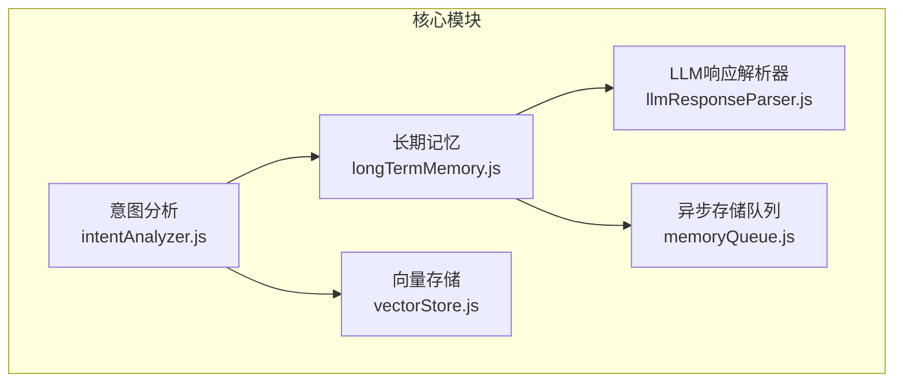
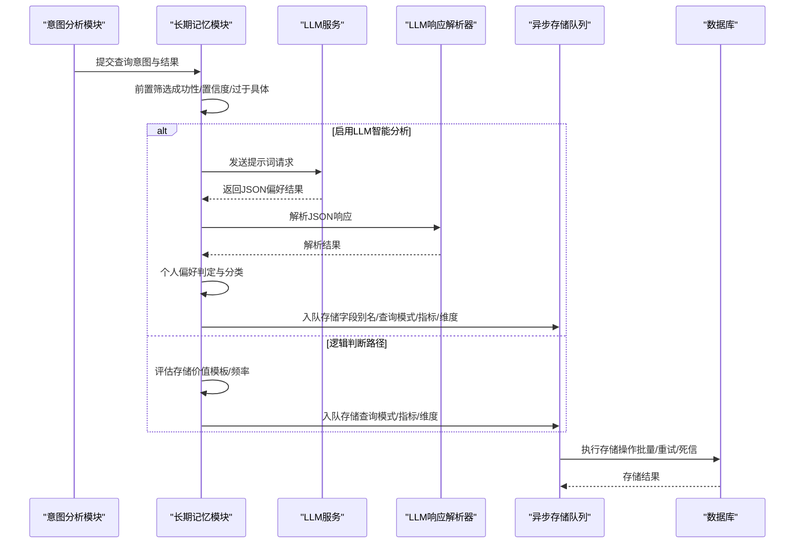
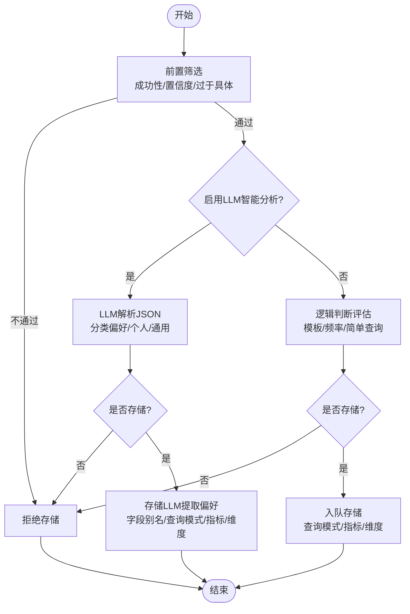
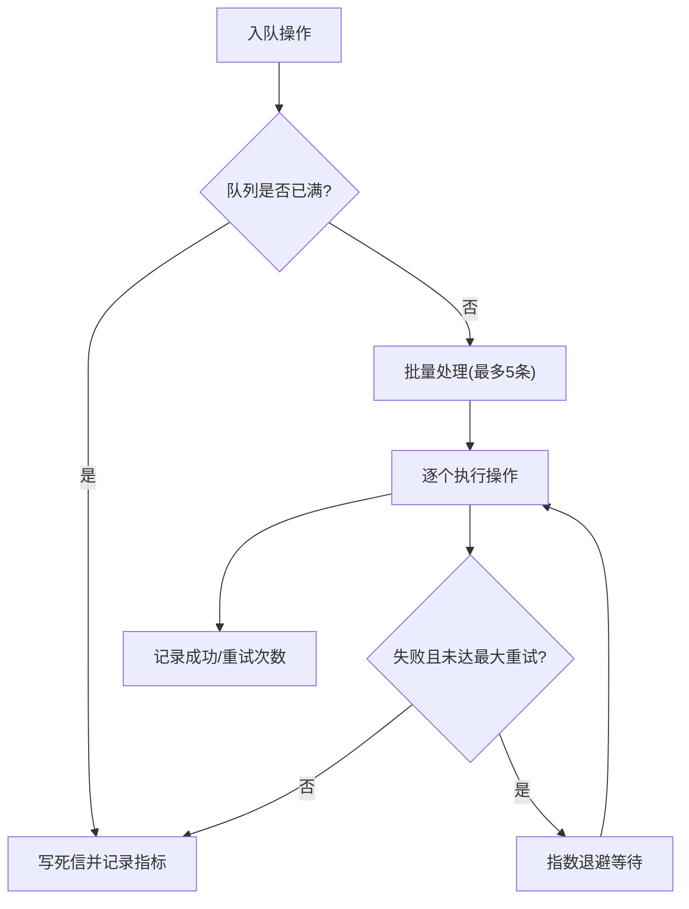
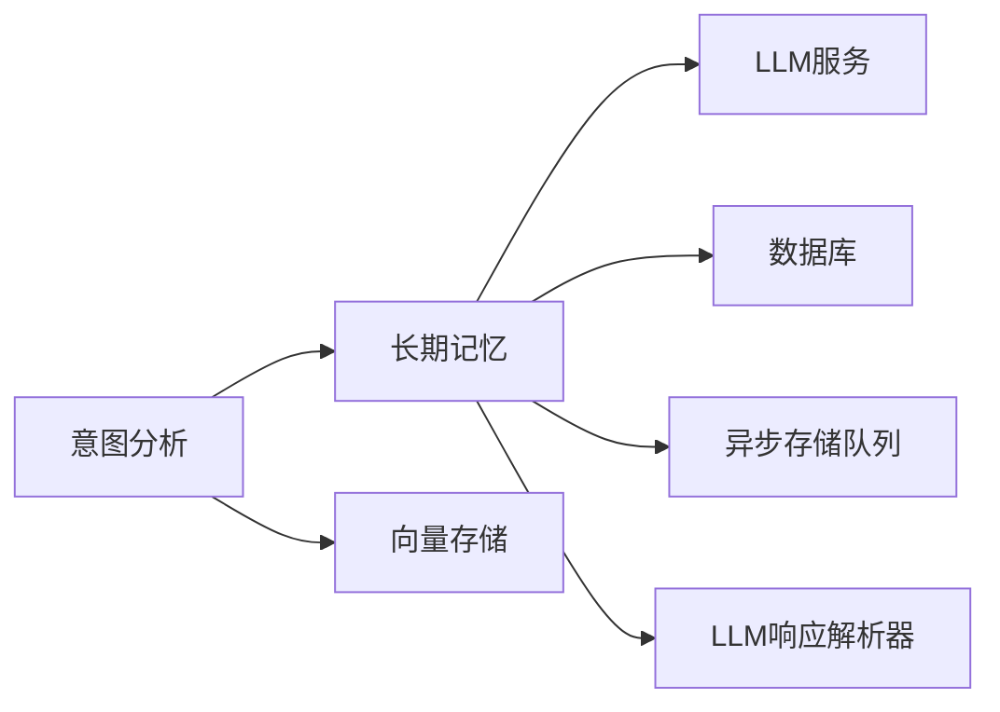

# 偏好提取算法

<cite>
**本文档引用的文件**
- [longTermMemory.js](file://backend/src/memory/longTermMemory.js)
- [memoryQueue.js](file://backend/src/memory/memoryQueue.js)
- [llmResponseParser.js](file://backend/src/utils/llmResponseParser.js)
- [intentAnalyzer.js](file://backend/src/core/intentAnalyzer.js)
- [vectorStore.js](file://backend/src/memory/vectorStore.js)
- [test-memoryQueue-retry.js](file://backend/test/phase4/test-memoryQueue-retry.js)
</cite>

## 目录
1. [简介](#简介)
2. [项目结构](#项目结构)
3. [核心组件](#核心组件)
4. [架构总览](#架构总览)
5. [详细组件分析](#详细组件分析)
6. [依赖分析](#依赖分析)
7. [性能考量](#性能考量)
8. [故障排查指南](#故障排查指南)
9. [结论](#结论)

## 简介
本技术文档围绕 NL2SQL 系统中的“偏好提取算法”展开，系统性解析用户偏好的识别与提取流程，涵盖查询模式偏好（query_pattern）、字段别名（field_alias）、指标偏好（metric_preference）与维度偏好（dimension_preference）的提取机制。文档还深入阐述 LLM 智能分析功能（JSON 响应解析、偏好类型分类、个人偏好与通用知识的区别处理），以及偏好存储决策逻辑（从查询成功性验证到异步存储队列的实现）。最后提供偏好类型定义、提取规则说明与错误处理机制，帮助读者全面掌握该模块的设计与实现。

## 项目结构
偏好提取算法位于后端模块中，主要涉及以下文件：
- 长期记忆模块：负责偏好提取、存储与检索
- 异步存储队列：负责异步化存储操作，提升系统吞吐
- LLM 响应解析器：统一解析 LLM 输出的 JSON/SQL
- 意图分析模块：为偏好提取提供上下文与触发点
- 向量存储模块：提供语义检索能力，辅助偏好增强



图表来源
- [longTermMemory.js:1-1168](file://backend/src/memory/longTermMemory.js#L1-L1168)
- [memoryQueue.js:1-293](file://backend/src/memory/memoryQueue.js#L1-L293)
- [llmResponseParser.js:1-146](file://backend/src/utils/llmResponseParser.js#L1-L146)
- [intentAnalyzer.js:1-757](file://backend/src/core/intentAnalyzer.js#L1-L757)
- [vectorStore.js:1-928](file://backend/src/memory/vectorStore.js#L1-L928)

章节来源
- [longTermMemory.js:1-1168](file://backend/src/memory/longTermMemory.js#L1-L1168)
- [memoryQueue.js:1-293](file://backend/src/memory/memoryQueue.js#L1-L293)
- [llmResponseParser.js:1-146](file://backend/src/utils/llmResponseParser.js#L1-L146)
- [intentAnalyzer.js:1-757](file://backend/src/core/intentAnalyzer.js#L1-L757)
- [vectorStore.js:1-928](file://backend/src/memory/vectorStore.js#L1-L928)

## 核心组件
- 长期记忆模块（longTermMemory.js）
  - 负责偏好提取与存储，包含 LLM 智能分析、阈值筛选、存储决策与异步队列集成
  - 支持偏好类型：查询模式、字段别名、指标偏好、维度偏好
- 异步存储队列（memoryQueue.js）
  - 将存储操作异步化，支持批量处理、指数退避重试、死信持久化与队列长度保护
- LLM 响应解析器（llmResponseParser.js）
  - 统一解析 LLM 文本响应中的 JSON/SQL，提供稳健的解析策略
- 意图分析模块（intentAnalyzer.js）
  - 为偏好提取提供上下文，包括用户历史偏好摘要、相似查询参考等
- 向量存储模块（vectorStore.js）
  - 提供查询历史的语义检索，辅助偏好增强与相似查询参考

章节来源
- [longTermMemory.js:37-43](file://backend/src/memory/longTermMemory.js#L37-L43)
- [memoryQueue.js:26-47](file://backend/src/memory/memoryQueue.js#L26-L47)
- [llmResponseParser.js:24-59](file://backend/src/utils/llmResponseParser.js#L24-L59)
- [intentAnalyzer.js:191-289](file://backend/src/core/intentAnalyzer.js#L191-L289)
- [vectorStore.js:34-42](file://backend/src/memory/vectorStore.js#L34-L42)

## 架构总览
偏好提取算法的整体流程如下：
- 查询完成后，系统进行前置筛选（成功性与置信度）
- 若启用 LLM 智能分析，则解析 LLM 输出并进行偏好分类与个人/通用区分
- 根据存储决策（阈值与频率）或 LLM 判断，将偏好异步入队存储
- 异步队列执行存储操作，支持重试与死信处理



图表来源
- [longTermMemory.js:299-486](file://backend/src/memory/longTermMemory.js#L299-L486)
- [memoryQueue.js:66-215](file://backend/src/memory/memoryQueue.js#L66-L215)
- [llmResponseParser.js:24-59](file://backend/src/utils/llmResponseParser.js#L24-L59)

## 详细组件分析

### 长期记忆模块（偏好提取与存储）
- 偏好类型定义
  - 查询模式：query_pattern
  - 字段别名：field_alias
  - 指标偏好：metric_preference
  - 维度偏好：dimension_preference
- 前置筛选
  - 查询必须成功
  - 置信度需达到阈值
  - 排除过于具体的一次性查询（含绝对时间范围、具体数值过滤器、简单组合）
- LLM 智能分析
  - 提供统一提示词，要求输出 JSON，包含是否存储、是否个人偏好、置信度与提取的偏好列表
  - 偏好类型分类：字段别名、维度习惯、指标组合、过滤逻辑
  - 个人偏好与通用知识区分：isPersonal 字段控制存储范围
- 存储决策
  - 高价值模板：维度≥2且指标≥1
  - 高频模式：7天内≥2次
  - 简单查询：需要更高频率才存储
- 异步存储
  - 字段别名：learnFieldAlias，支持游戏映射、数据源映射与值映射
  - 查询模式：storeQueryPattern，生成模式名称并去重
  - 指标/维度偏好：storeMetricPreference/storeDimensionPreference，按字段名去重
- 即时学习（澄清轮）
  - 从用户文本中提取映射关系（游戏ID表格、平台标识、显式声明等）



图表来源
- [longTermMemory.js:299-486](file://backend/src/memory/longTermMemory.js#L299-L486)
- [longTermMemory.js:495-607](file://backend/src/memory/longTermMemory.js#L495-L607)
- [longTermMemory.js:616-758](file://backend/src/memory/longTermMemory.js#L616-L758)
- [longTermMemory.js:773-853](file://backend/src/memory/longTermMemory.js#L773-L853)

章节来源
- [longTermMemory.js:37-43](file://backend/src/memory/longTermMemory.js#L37-L43)
- [longTermMemory.js:208-231](file://backend/src/memory/longTermMemory.js#L208-L231)
- [longTermMemory.js:239-283](file://backend/src/memory/longTermMemory.js#L239-L283)
- [longTermMemory.js:343-414](file://backend/src/memory/longTermMemory.js#L343-L414)
- [longTermMemory.js:495-607](file://backend/src/memory/longTermMemory.js#L495-L607)
- [longTermMemory.js:616-758](file://backend/src/memory/longTermMemory.js#L616-L758)
- [longTermMemory.js:773-853](file://backend/src/memory/longTermMemory.js#L773-L853)
- [longTermMemory.js:872-993](file://backend/src/memory/longTermMemory.js#L872-L993)

### 异步存储队列（memoryQueue.js）
- 功能特性
  - 批量处理：每批最多5条
  - 指数退避重试：100ms → 400ms → 1600ms（最多3次）
  - 死信持久化：重试耗尽后写入失败队列表
  - 队列长度保护：超过1000条直接入死信
  - 指标导出：累计入队、成功、重试、死信、拒绝满队列等
- 关键流程
  - enqueueMemoryStore：入队并触发处理
  - processQueue：批量执行
  - executeOperation：单操作执行与重试
  - persistDeadLetter：死信持久化（降级为日志）



图表来源
- [memoryQueue.js:66-215](file://backend/src/memory/memoryQueue.js#L66-L215)

章节来源
- [memoryQueue.js:26-47](file://backend/src/memory/memoryQueue.js#L26-L47)
- [memoryQueue.js:66-102](file://backend/src/memory/memoryQueue.js#L66-L102)
- [memoryQueue.js:107-149](file://backend/src/memory/memoryQueue.js#L107-L149)
- [memoryQueue.js:154-215](file://backend/src/memory/memoryQueue.js#L154-L215)
- [memoryQueue.js:220-234](file://backend/src/memory/memoryQueue.js#L220-L234)
- [test-memoryQueue-retry.js:34-62](file://backend/test/phase4/test-memoryQueue-retry.js#L34-L62)

### LLM 响应解析器（llmResponseParser.js）
- JSON 解析策略
  - 直接 JSON.parse
  - 提取 ```json ... ``` 代码块
  - 提取最外层花括号（非贪婪匹配）
- SQL 提取策略
  - 从 JSON 中提取 sql 字段
  - 提取 ```sql ... ``` 代码块
  - 正则匹配 SELECT 语句
- 错误处理
  - 三种策略均失败时抛出错误，附带上下文信息

章节来源
- [llmResponseParser.js:24-59](file://backend/src/utils/llmResponseParser.js#L24-L59)
- [llmResponseParser.js:119-143](file://backend/src/utils/llmResponseParser.js#L119-L143)

### 意图分析模块（intentAnalyzer.js）
- 用户偏好摘要
  - 常用查询模式、字段别名映射、常用指标与维度
  - 优先展示与当前查询相关的别名映射
- 相似查询参考
  - 基于向量检索的相似历史查询，辅助理解用户习惯
- 提示词增强
  - 将用户偏好与相似查询纳入系统提示词，提升意图识别质量

章节来源
- [intentAnalyzer.js:191-289](file://backend/src/core/intentAnalyzer.js#L191-L289)
- [intentAnalyzer.js:291-319](file://backend/src/core/intentAnalyzer.js#L291-L319)
- [intentAnalyzer.js:321-468](file://backend/src/core/intentAnalyzer.js#L321-L468)

### 向量存储模块（vectorStore.js）
- 查询类型分类
  - 定义/解释、对比、趋势、澄清、跟进、新话题、数据查询
- 重要性评分
  - 基于成功状态、维度/指标/筛选器数量、置信度、上下文依赖等
- 智能搜索
  - 根据查询意图智能重排序，优先返回与用户上下文相关的表

章节来源
- [vectorStore.js:34-42](file://backend/src/memory/vectorStore.js#L34-L42)
- [vectorStore.js:52-86](file://backend/src/memory/vectorStore.js#L52-L86)
- [vectorStore.js:95-134](file://backend/src/memory/vectorStore.js#L95-L134)
- [vectorStore.js:454-577](file://backend/src/memory/vectorStore.js#L454-L577)

## 依赖分析
- 模块耦合
  - 长期记忆模块依赖 LLM 服务、数据库、LLM 响应解析器与内存队列
  - 意图分析模块依赖长期记忆模块提供的偏好摘要与相似查询
  - 向量存储模块为意图分析提供相似查询参考
- 外部依赖
  - LLM 服务：用于智能分析与意图识别
  - 数据库：持久化用户偏好与失败队列
  - LanceDB：向量存储与语义检索



图表来源
- [longTermMemory.js:17-22](file://backend/src/memory/longTermMemory.js#L17-L22)
- [intentAnalyzer.js:13-20](file://backend/src/core/intentAnalyzer.js#L13-L20)
- [vectorStore.js:14-25](file://backend/src/memory/vectorStore.js#L14-L25)

章节来源
- [longTermMemory.js:17-22](file://backend/src/memory/longTermMemory.js#L17-L22)
- [intentAnalyzer.js:13-20](file://backend/src/core/intentAnalyzer.js#L13-L20)
- [vectorStore.js:14-25](file://backend/src/memory/vectorStore.js#L14-L25)

## 性能考量
- 异步化存储
  - 将存储操作异步化，避免阻塞主流程，提升吞吐
- 批量处理
  - 每批最多5条，减少锁竞争与上下文切换
- 指数退避重试
  - 逐步增加等待时间，降低系统压力峰值
- 队列长度保护
  - 防止内存溢出，超限时直接入死信并记录指标
- 存储去重与阈值
  - 通过模式名称、字段名去重，结合阈值与频率控制存储量

## 故障排查指南
- LLM 解析失败
  - 检查提示词输出格式是否符合 JSON 规范
  - 使用解析器的多策略解析，定位问题来源
- 存储失败
  - 查看队列指标（succeeded/retried/deadLettered/rejectedFull）
  - 检查数据库连接与权限
  - 关注死信持久化日志
- 偏好未生效
  - 确认前置筛选是否通过（成功性、置信度、过于具体）
  - 检查 LLM 是否启用智能分析与输出是否为个人偏好
  - 核对阈值与频率设置

章节来源
- [llmResponseParser.js:24-59](file://backend/src/utils/llmResponseParser.js#L24-L59)
- [memoryQueue.js:154-215](file://backend/src/memory/memoryQueue.js#L154-L215)
- [longTermMemory.js:308-333](file://backend/src/memory/longTermMemory.js#L308-L333)

## 结论
偏好提取算法通过“LLM 智能分析 + 逻辑判断”的双通道设计，实现了对用户偏好的精准识别与高效存储。长期记忆模块在保证质量的前提下，通过阈值与频率策略控制存储规模；异步存储队列进一步提升了系统的吞吐与稳定性。配合意图分析模块的偏好摘要与相似查询参考，系统能够持续优化用户的查询体验，形成闭环的学习与反馈机制。