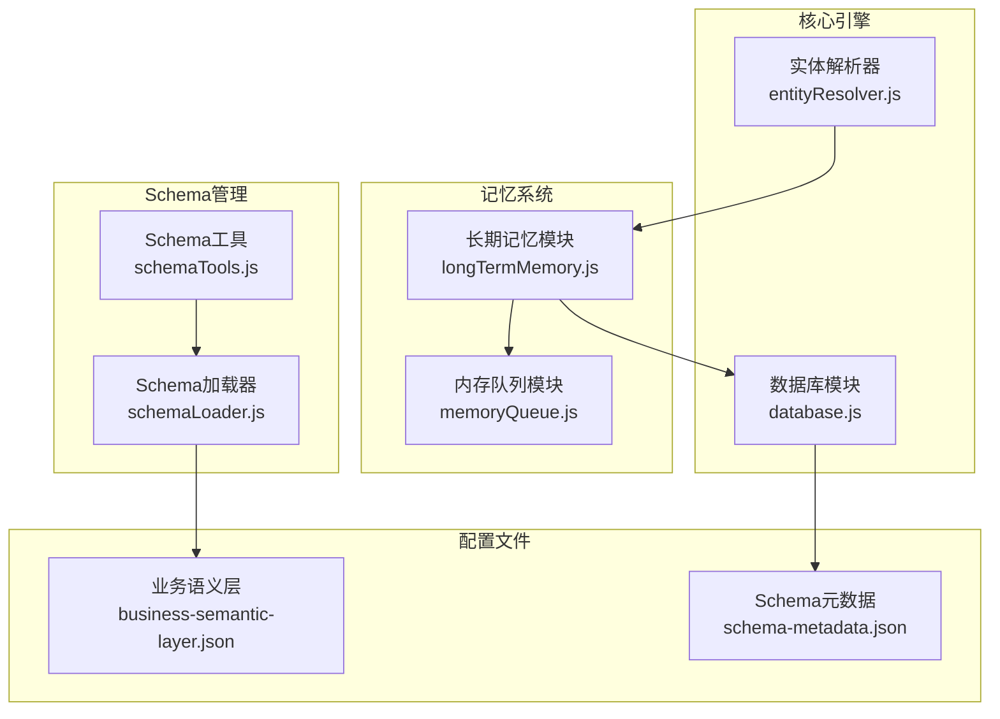
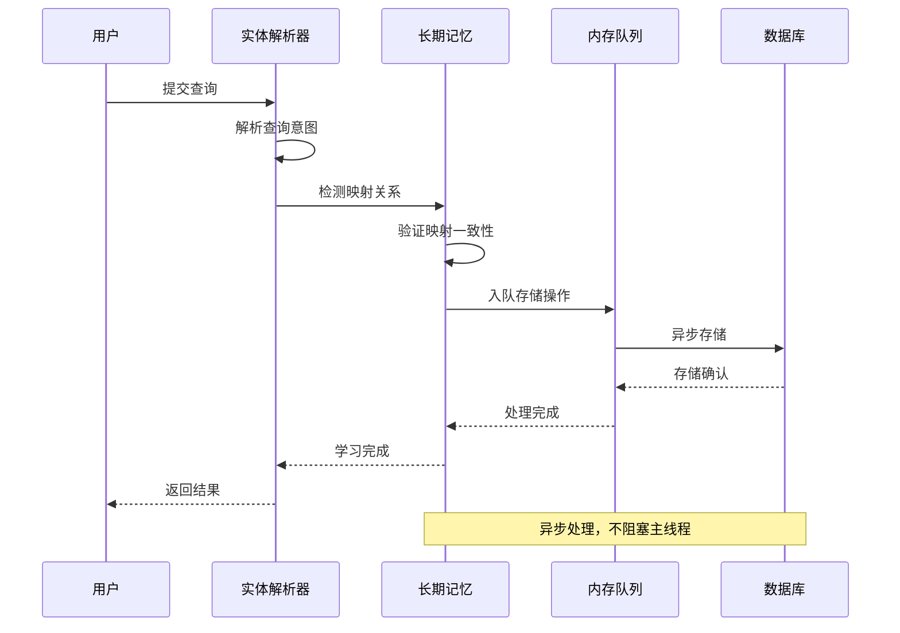
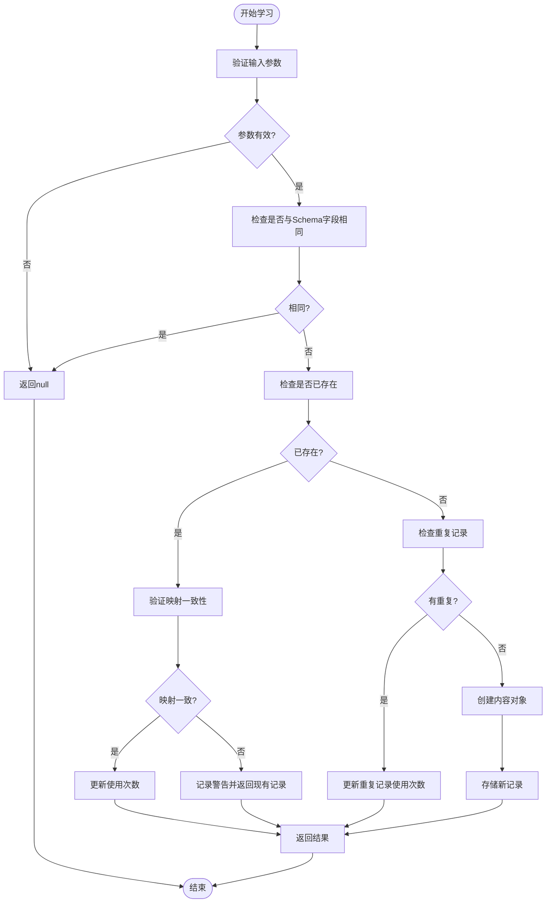
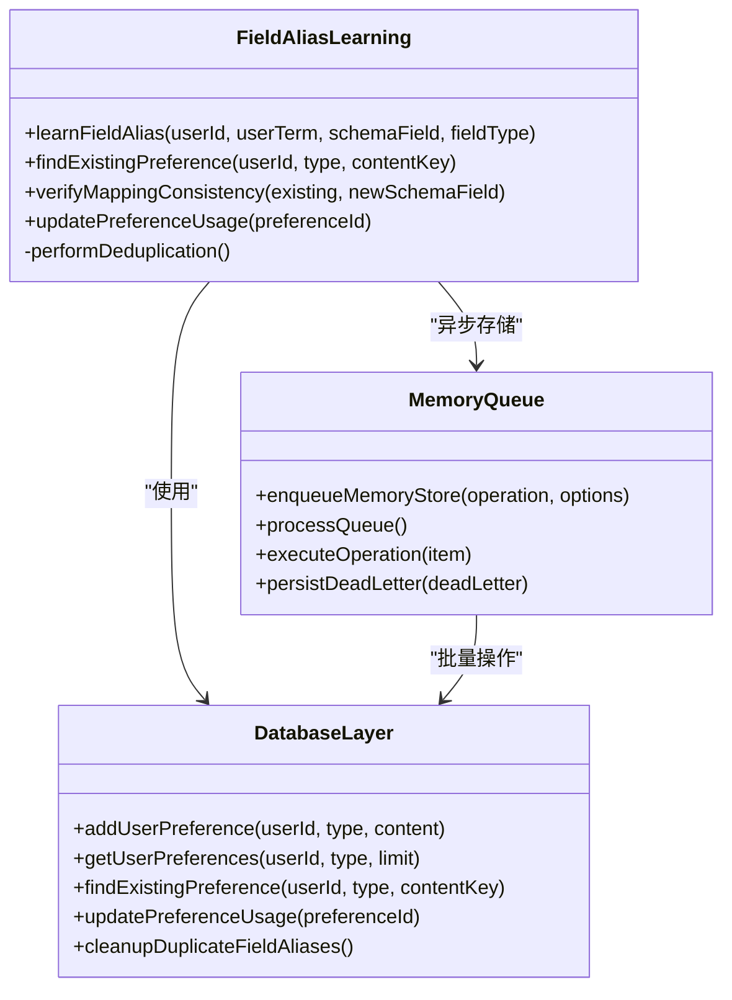
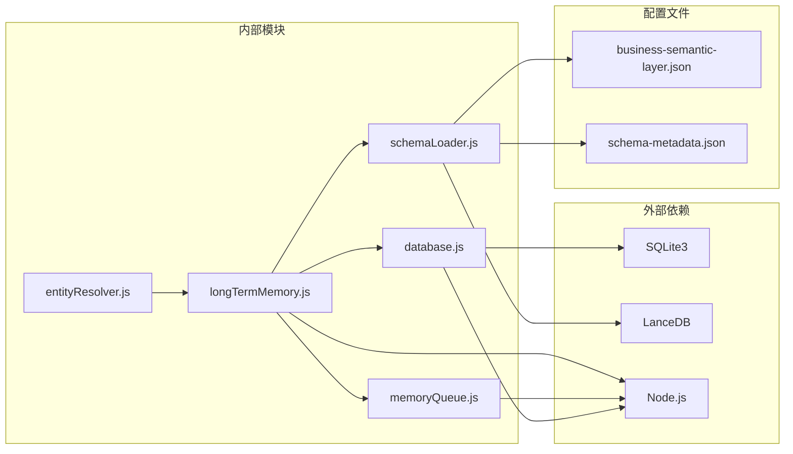

# 字段别名学习

<cite>
**本文档引用的文件**
- [longTermMemory.js](file://backend/src/memory/longTermMemory.js)
- [memoryQueue.js](file://backend/src/memory/memoryQueue.js)
- [database.js](file://backend/src/core/database.js)
- [schemaLoader.js](file://backend/src/core/schemaLoader.js)
- [schemaTools.js](file://backend/src/core/schemaTools.js)
- [business-semantic-layer.json](file://backend/config/business-semantic-layer.json)
- [schema-metadata.json](file://backend/config/schema-metadata.json)
- [entityResolver.js](file://backend/src/core/entityResolver.js)
</cite>

## 目录
1. [简介](#简介)
2. [项目结构](#项目结构)
3. [核心组件](#核心组件)
4. [架构概览](#架构概览)
5. [详细组件分析](#详细组件分析)
6. [依赖分析](#依赖分析)
7. [性能考虑](#性能考虑)
8. [故障排除指南](#故障排除指南)
9. [结论](#结论)

## 简介

字段别名学习功能是 NL2SQL 系统中的关键组件，负责从用户查询中提取和学习字段别名映射关系。该功能能够识别用户术语与 Schema 字段之间的映射，包括字段别名、实体映射和值映射等不同类型的学习内容。

该系统支持多种映射类型：
- **字段别名**：用户为 Schema 字段起的别名（如"营收"对应"收入金额"）
- **实体映射**：用户术语与实体值的映射（如"青木"对应"game_id=30"）
- **数据源映射**：用户术语与数据源标识的映射（如"新平台"对应"new_tzpingtai"）
- **值映射**：实体值与具体数值的映射（如"华夏"对应"88"）

## 项目结构

NL2SQL 项目采用模块化架构，字段别名学习功能主要分布在以下模块中：

**图表来源**
- [longTermMemory.js:1-1168](file://backend/src/memory/longTermMemory.js#L1-L1168)
- [memoryQueue.js:1-293](file://backend/src/memory/memoryQueue.js#L1-L293)
- [database.js:1-1400](file://backend/src/core/database.js#L1-L1400)

**章节来源**
- [longTermMemory.js:1-1168](file://backend/src/memory/longTermMemory.js#L1-L1168)
- [memoryQueue.js:1-293](file://backend/src/memory/memoryQueue.js#L1-L293)
- [database.js:1-1400](file://backend/src/core/database.js#L1-L1400)

## 核心组件

### 字段别名学习引擎

字段别名学习引擎是整个系统的核心，负责识别、验证和存储用户与系统之间的映射关系。其主要功能包括：

1. **映射关系识别**：从用户查询中提取字段别名、实体映射和值映射
2. **一致性验证**：确保相同的用户术语映射到相同的 Schema 字段
3. **去重处理**：避免重复存储相同的映射关系
4. **存储管理**：将学习到的映射关系持久化到数据库

### 内存队列系统

为了提高系统性能，字段别名学习采用了异步存储机制：

- **批量处理**：支持批量存储操作，减少数据库连接开销
- **指数退避重试**：最多重试3次，每次等待时间翻倍
- **死信队列**：重试耗尽后将失败操作持久化到死信队列
- **队列长度保护**：防止内存溢出，超过1000条记录时直接丢弃

### 数据库存储层

数据库层负责持久化存储所有学习到的映射关系：

- **用户偏好表**：存储用户的各种偏好和学习结果
- **索引优化**：为常用查询建立索引，提高查询性能
- **数据清理**：定期清理重复和无效的数据

**章节来源**
- [longTermMemory.js:760-853](file://backend/src/memory/longTermMemory.js#L760-L853)
- [memoryQueue.js:1-293](file://backend/src/memory/memoryQueue.js#L1-L293)
- [database.js:832-1022](file://backend/src/core/database.js#L832-L1022)

## 架构概览

字段别名学习功能的整体架构如下：

**图表来源**
- [entityResolver.js:133-177](file://backend/src/core/entityResolver.js#L133-L177)
- [longTermMemory.js:299-486](file://backend/src/memory/longTermMemory.js#L299-L486)
- [memoryQueue.js:107-149](file://backend/src/memory/memoryQueue.js#L107-L149)

## 详细组件分析

### 字段别名学习算法

字段别名学习的核心算法包含以下步骤：

**图表来源**
- [longTermMemory.js:773-853](file://backend/src/memory/longTermMemory.js#L773-L853)

### 映射类型分类

系统支持多种映射类型，每种类型都有特定的处理逻辑：

#### 字段别名映射
- **用途**：用户为 Schema 字段起的别名
- **示例**："营收" → "收入金额"
- **存储格式**：包含用户术语、Schema 字段和字段类型

#### 实体映射
- **用途**：用户术语与实体值的映射
- **示例**："青木" → "game_id=30"
- **处理逻辑**：同时存储字段别名和值映射

#### 数据源映射
- **用途**：用户术语与数据源标识的映射
- **示例**："新平台" → "new_tzpingtai"
- **特殊处理**：直接存储用户术语到实际值的映射

**章节来源**
- [longTermMemory.js:501-544](file://backend/src/memory/longTermMemory.js#L501-L544)
- [longTermMemory.js:773-853](file://backend/src/memory/longTermMemory.js#L773-L853)

### 去重和一致性验证

系统实现了多层次的去重和一致性验证机制：

**图表来源**
- [longTermMemory.js:773-853](file://backend/src/memory/longTermMemory.js#L773-L853)
- [database.js:843-992](file://backend/src/core/database.js#L843-L992)
- [memoryQueue.js:66-215](file://backend/src/memory/memoryQueue.js#L66-L215)

### 存储格式规范

字段别名学习的存储格式采用 JSON 结构，包含以下关键字段：

| 字段名 | 类型 | 描述 | 示例 |
|--------|------|------|------|
| user_term | string | 用户使用的术语 | "青木" |
| schema_field | string | 对应的 Schema 字段 | "game_id" |
| field_type | string | 字段类型 | "metric" |
| mapping_value | string | 映射的具体值（可选） | "30" |
| confidence | number | 置信度 | 0.8 |
| usage_count | number | 使用次数 | 1 |
| last_used_at | datetime | 最后使用时间 | "2024-01-01 12:00:00" |

**章节来源**
- [longTermMemory.js:833-847](file://backend/src/memory/longTermMemory.js#L833-L847)
- [database.js:843-852](file://backend/src/core/database.js#L843-L852)

### 查询检索机制

系统提供了多种查询检索机制来获取学习到的映射关系：

#### 基础查询接口
- **getFieldAliases(userId, fieldName)**：获取用户的字段别名映射
- **getUserPreferences(userId, type, limit)**：获取用户偏好列表
- **findExistingPreference(userId, type, contentKey)**：查找已存在的偏好

#### 高级检索功能
- **getUserPreferencesForIntent(userId)**：获取用于意图识别增强的用户偏好
- **findSimilarTemplates(userId, currentIntent)**：查找相似查询模板
- **getTopQueryPatterns(userId, limit)**：获取常用查询模板

**章节来源**
- [database.js:929-949](file://backend/src/core/database.js#L929-L949)
- [longTermMemory.js:1004-1097](file://backend/src/memory/longTermMemory.js#L1004-L1097)

## 依赖分析

字段别名学习功能的依赖关系如下：

**图表来源**
- [longTermMemory.js:17-22](file://backend/src/memory/longTermMemory.js#L17-L22)
- [memoryQueue.js:13-20](file://backend/src/memory/memoryQueue.js#L13-L20)
- [database.js:12-19](file://backend/src/core/database.js#L12-L19)

### 外部依赖说明

- **SQLite3**：用于本地数据持久化存储
- **LanceDB**：用于向量数据库操作（可选）
- **Node.js**：运行时环境

### 内部模块耦合

各模块之间的耦合关系相对松散，主要通过接口进行交互：

- **longTermMemory** 依赖 **database** 进行数据持久化
- **longTermMemory** 依赖 **memoryQueue** 进行异步存储
- **entityResolver** 依赖 **longTermMemory** 进行别名学习
- **schemaLoader** 依赖 **business-semantic-layer.json** 和 **schema-metadata.json** 进行配置管理

**章节来源**
- [longTermMemory.js:17-22](file://backend/src/memory/longTermMemory.js#L17-L22)
- [memoryQueue.js:13-20](file://backend/src/memory/memoryQueue.js#L13-L20)
- [database.js:12-19](file://backend/src/core/database.js#L12-L19)

## 性能考虑

### 异步存储优化

系统采用异步存储机制来提高性能：

- **批量处理**：每次处理5条记录，减少数据库连接开销
- **指数退避**：重试间隔从100ms增加到1600ms
- **队列保护**：超过1000条记录时直接丢弃，防止内存溢出

### 数据库优化

- **索引优化**：为常用查询字段建立索引
- **JSON查询**：使用SQLite的JSON1扩展进行高效查询
- **事务处理**：批量操作使用事务提高性能

### 缓存策略

- **Level 1索引**：缓存表名和业务注释用于初步筛选
- **启动时清理**：应用启动时自动清理重复和无效数据
- **迁移优化**：幂等迁移确保数据一致性

**章节来源**
- [memoryQueue.js:29-36](file://backend/src/memory/memoryQueue.js#L29-L36)
- [database.js:181-186](file://backend/src/core/database.js#L181-L186)
- [schemaTools.js:136-173](file://backend/src/core/schemaTools.js#L136-L173)

## 故障排除指南

### 常见问题及解决方案

#### 学习失败
**问题**：字段别名学习失败
**原因**：参数无效、数据库连接失败、权限不足
**解决方案**：
1. 检查输入参数的有效性
2. 验证数据库连接状态
3. 确认用户权限

#### 存储异常
**问题**：映射关系无法存储
**原因**：数据库表结构问题、索引冲突、数据格式错误
**解决方案**：
1. 运行数据库迁移脚本
2. 检查表结构完整性
3. 验证JSON格式正确性

#### 性能问题
**问题**：系统响应缓慢
**原因**：队列积压、数据库锁竞争、内存不足
**解决方案**：
1. 检查内存队列状态
2. 优化数据库查询
3. 增加系统资源

### 监控和诊断

系统提供了完善的监控和诊断功能：

- **队列状态监控**：通过 `getQueueStatus()` 获取队列状态
- **性能指标**：通过 `getQueueMetrics()` 获取处理指标
- **错误日志**：详细的错误日志记录
- **死信处理**：失败操作自动进入死信队列

**章节来源**
- [memoryQueue.js:240-293](file://backend/src/memory/memoryQueue.js#L240-L293)
- [database.js:1180-1227](file://backend/src/core/database.js#L1180-L1227)

## 结论

NL2SQL 字段别名学习功能通过精心设计的架构和算法，实现了高效、可靠的用户术语与 Schema 字段映射学习。系统的主要优势包括：

1. **多层次去重**：通过多种机制确保数据一致性
2. **异步处理**：不阻塞主线程，提高系统响应性
3. **灵活存储**：支持多种映射类型和存储格式
4. **性能优化**：批量处理、索引优化、缓存策略
5. **故障恢复**：死信队列、重试机制、监控诊断

该功能为 NL2SQL 系统提供了强大的语义理解和学习能力，能够显著提升用户体验和查询准确性。通过持续的优化和改进，该系统将继续为用户提供更好的自然语言查询体验。