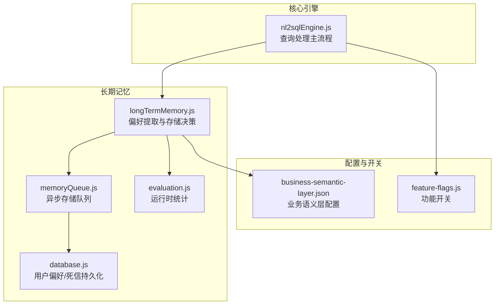
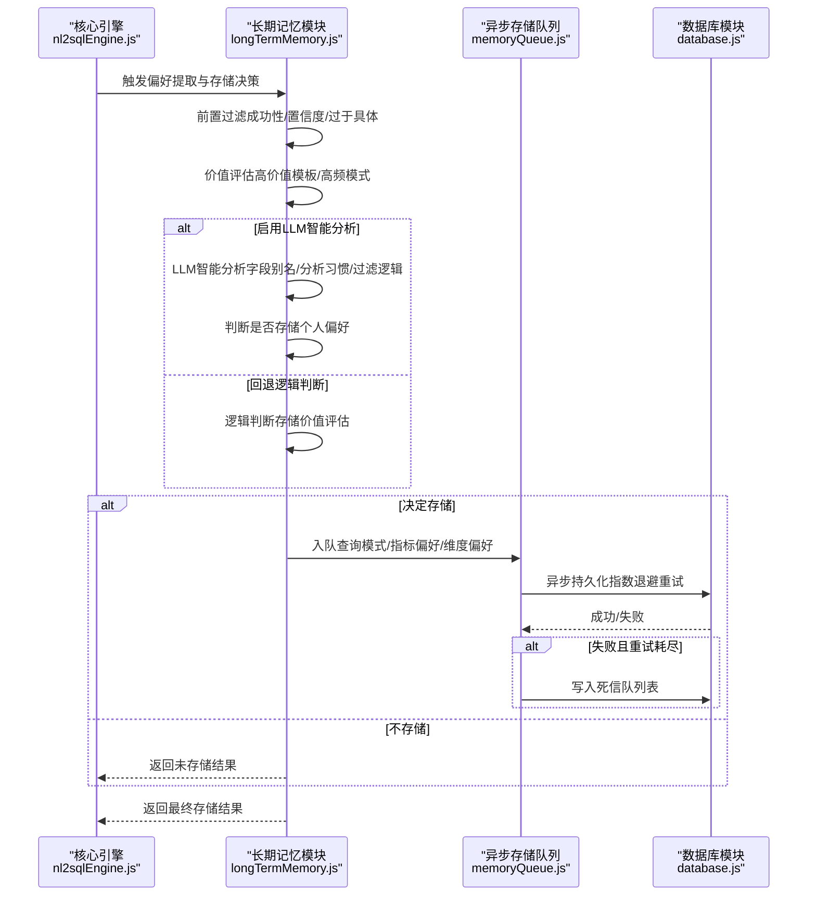
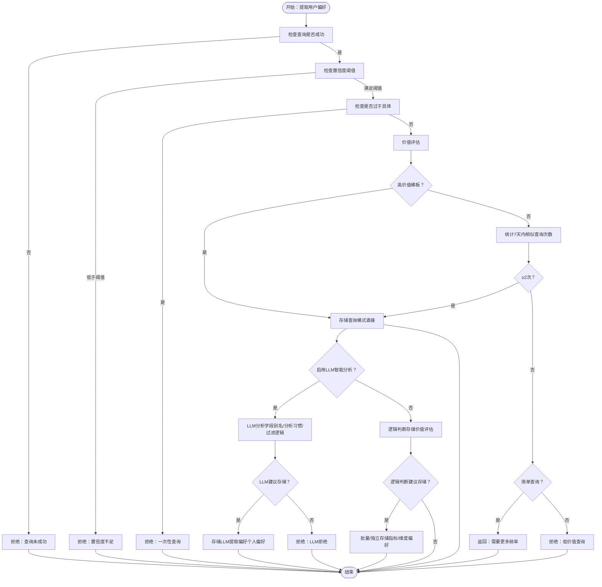
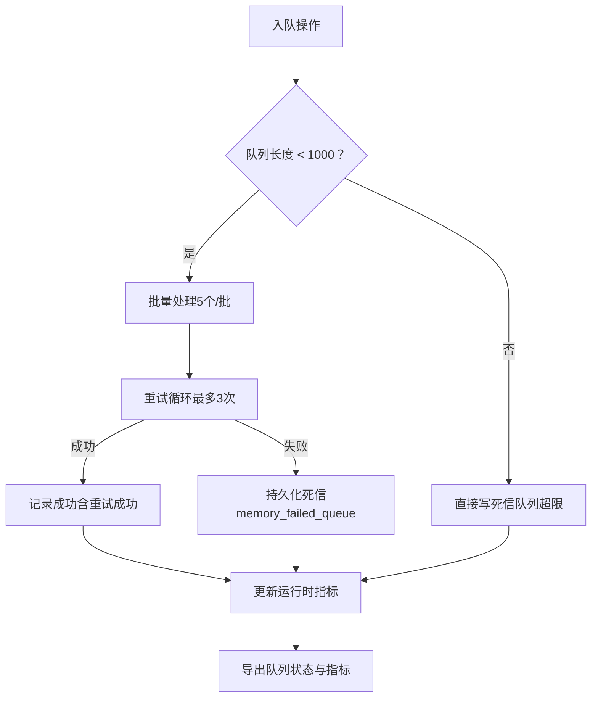
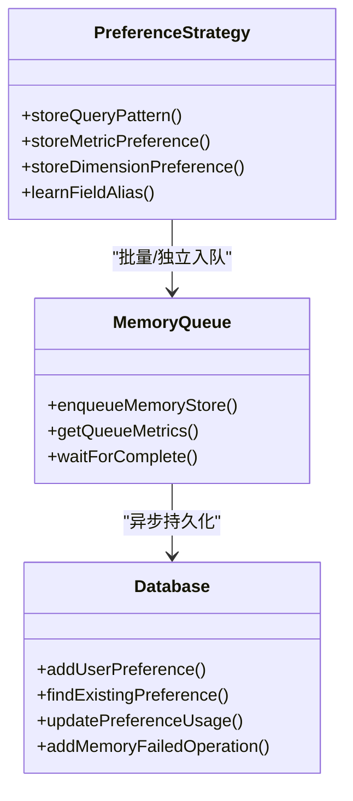
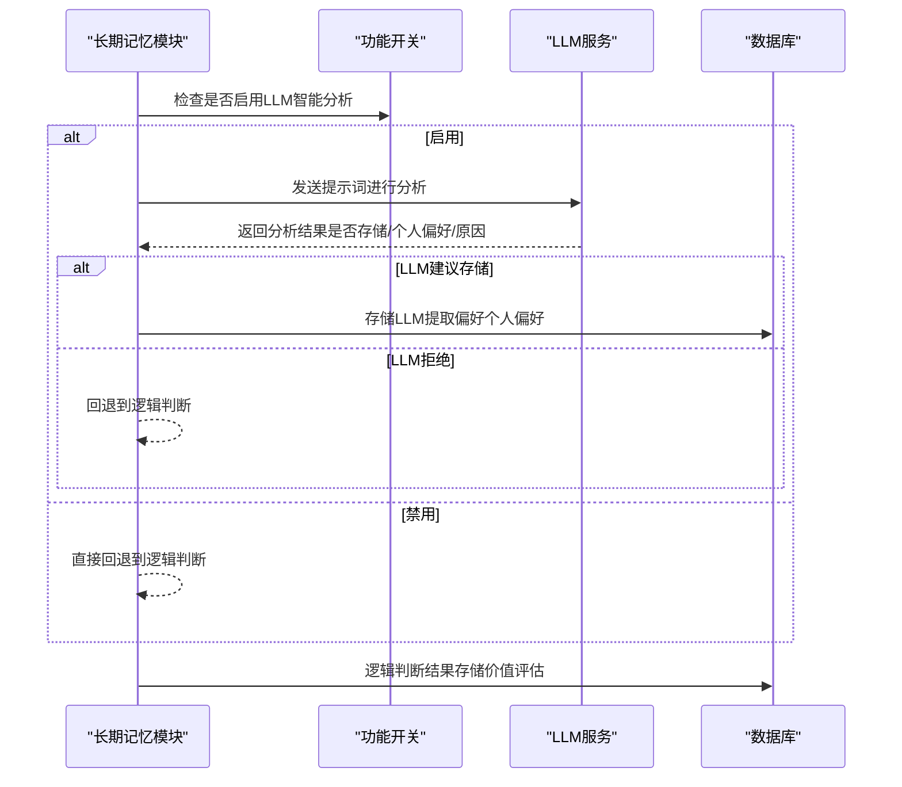
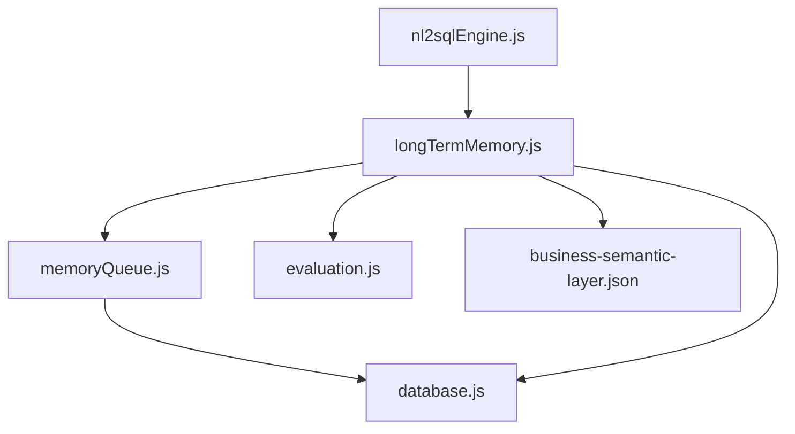

# 存储决策逻辑

<cite>
**本文档引用的文件**
- [longTermMemory.js](file://backend/src/memory/longTermMemory.js)
- [memoryQueue.js](file://backend/src/memory/memoryQueue.js)
- [nl2sqlEngine.js](file://backend/src/core/nl2sqlEngine.js)
- [database.js](file://backend/src/core/database.js)
- [evaluation.js](file://backend/src/utils/evaluation.js)
- [business-semantic-layer.json](file://backend/config/business-semantic-layer.json)
- [feature-flags.js](file://backend/config/feature-flags.js)
</cite>

## 目录
1. [简介](#简介)
2. [项目结构](#项目结构)
3. [核心组件](#核心组件)
4. [架构概览](#架构概览)
5. [详细组件分析](#详细组件分析)
6. [依赖分析](#依赖分析)
7. [性能考虑](#性能考虑)
8. [故障排查指南](#故障排查指南)
9. [结论](#结论)

## 简介
本文件聚焦 NL2SQL 系统中“长期记忆”的存储决策逻辑，系统性阐述从查询到偏好提取、价值评估、异步存储队列管理的完整流程。重点包括：
- 前置过滤条件：查询成功性、置信度阈值、过于具体查询排除
- 存储价值评估：高价值模板、高频模式检测
- 异步存储队列管理：指数退避重试、失败持久化、队列长度保护
- 不同偏好类型的存储策略：查询模式的直接存储、指标偏好的批量存储、维度偏好的独立存储
- 存储决策的回退机制：从 LLM 分析到逻辑判断的切换策略
- 存储队列配置、性能监控与异常处理方案

## 项目结构
围绕存储决策逻辑的关键模块与文件如下：
- 长期记忆模块：负责偏好提取、价值评估与存储调度
- 异步存储队列：负责异步持久化、重试与死信处理
- 核心引擎：在查询流程末尾触发长期记忆存储
- 数据库模块：提供用户偏好表、死信队列表等持久化能力
- 评估模块：提供运行时统计与质量评估接口
- 业务语义层配置：提供业务概念映射，辅助偏好提取
- 功能开关：控制是否启用 LLM 智能分析等特性

**图表来源**
- [nl2sqlEngine.js:648-687](file://backend/src/core/nl2sqlEngine.js#L648-L687)
- [longTermMemory.js:299-486](file://backend/src/memory/longTermMemory.js#L299-L486)
- [memoryQueue.js:66-102](file://backend/src/memory/memoryQueue.js#L66-L102)
- [database.js:156-179](file://backend/src/core/database.js#L156-L179)
- [evaluation.js:37-60](file://backend/src/utils/evaluation.js#L37-L60)
- [business-semantic-layer.json:1-189](file://backend/config/business-semantic-layer.json#L1-L189)
- [feature-flags.js:16-141](file://backend/config/feature-flags.js#L16-L141)

**章节来源**
- [nl2sqlEngine.js:648-687](file://backend/src/core/nl2sqlEngine.js#L648-L687)
- [longTermMemory.js:299-486](file://backend/src/memory/longTermMemory.js#L299-L486)
- [memoryQueue.js:66-102](file://backend/src/memory/memoryQueue.js#L66-L102)
- [database.js:156-179](file://backend/src/core/database.js#L156-L179)
- [evaluation.js:37-60](file://backend/src/utils/evaluation.js#L37-L60)
- [business-semantic-layer.json:1-189](file://backend/config/business-semantic-layer.json#L1-L189)
- [feature-flags.js:16-141](file://backend/config/feature-flags.js#L16-L141)

## 核心组件
- 长期记忆模块（Layer 2）：负责用户长期记忆的提取、存储、检索与维护，包含前置过滤、价值评估、LLM 智能分析与回退逻辑、不同偏好类型的存储策略。
- 异步存储队列：负责将存储操作异步化，提供指数退避重试、失败持久化（死信）、队列长度保护与运行时指标导出。
- 核心引擎：在查询流程结束后触发长期记忆存储，传递查询成功性、置信度等上下文。
- 数据库模块：提供用户偏好表与死信队列表的持久化能力，支持查询模式、字段别名、指标/维度偏好的存储。
- 评估模块：提供向量化与记忆系统的运行时统计，支持质量评估与命中率统计。
- 业务语义层配置：提供业务概念映射，辅助字段别名与查询模式的提取。
- 功能开关：控制是否启用 LLM 智能分析等特性。

**章节来源**
- [longTermMemory.js:1-11](file://backend/src/memory/longTermMemory.js#L1-L11)
- [memoryQueue.js:1-11](file://backend/src/memory/memoryQueue.js#L1-L11)
- [nl2sqlEngine.js:648-687](file://backend/src/core/nl2sqlEngine.js#L648-L687)
- [database.js:156-179](file://backend/src/core/database.js#L156-L179)
- [evaluation.js:1-6](file://backend/src/utils/evaluation.js#L1-L6)
- [business-semantic-layer.json:1-4](file://backend/config/business-semantic-layer.json#L1-L4)
- [feature-flags.js:16-141](file://backend/config/feature-flags.js#L16-L141)

## 架构概览
长期记忆的存储决策贯穿查询处理的最后阶段，核心流程如下：
- 核心引擎在查询成功后，调用长期记忆模块进行偏好提取与存储决策
- 长期记忆模块执行前置过滤（成功性、置信度、过于具体查询）
- 价值评估：高价值模板或高频模式
- LLM 智能分析：优先采用 LLM 判断，失败则回退到逻辑判断
- 不同偏好类型的存储策略：查询模式直接存储；指标偏好批量存储；维度偏好独立存储
- 异步存储：通过内存队列异步执行，支持指数退避重试与死信持久化

**图表来源**
- [nl2sqlEngine.js:648-687](file://backend/src/core/nl2sqlEngine.js#L648-L687)
- [longTermMemory.js:299-486](file://backend/src/memory/longTermMemory.js#L299-L486)
- [memoryQueue.js:107-149](file://backend/src/memory/memoryQueue.js#L107-L149)
- [database.js:1154-1175](file://backend/src/core/database.js#L1154-L1175)

**章节来源**
- [nl2sqlEngine.js:648-687](file://backend/src/core/nl2sqlEngine.js#L648-L687)
- [longTermMemory.js:299-486](file://backend/src/memory/longTermMemory.js#L299-L486)
- [memoryQueue.js:107-149](file://backend/src/memory/memoryQueue.js#L107-L149)
- [database.js:1154-1175](file://backend/src/core/database.js#L1154-L1175)

## 详细组件分析

### 长期记忆模块（前置过滤与价值评估）
- 前置过滤
  - 查询必须成功：未成功的查询直接拒绝存储
  - 置信度阈值：默认 ≥ 0.7，低于阈值拒绝存储
  - 过于具体查询排除：包含数值型过滤器、绝对时间范围、简单查询（维度/指标均 ≤ 1）满足两项及以上即判定为一次性查询，拒绝存储
- 存储价值评估
  - 高价值模板：维度数量 ≥ 2 且指标数量 ≥ 1
  - 高频模式：7 天内相似查询出现 ≥ 2 次
  - 简单查询：需要更高频率才存储，返回“需要更多频率”观察
- LLM 智能分析与回退
  - 若启用 LLM 智能分析，优先使用 LLM 判断是否存储与提取偏好类型
  - LLM 失败或禁用时，回退到逻辑判断进行存储价值评估
- 偏好类型与存储策略
  - 查询模式（query_pattern）：直接存储，用于高价值模板与高频模式
  - 指标偏好（metric_preference）：批量存储，逐个入队异步持久化
  - 维度偏好（dimension_preference）：独立存储，逐个入队异步持久化
  - 字段别名（field_alias）：特殊处理，支持伪字段与实体值映射的直接存储

**图表来源**
- [longTermMemory.js:308-333](file://backend/src/memory/longTermMemory.js#L308-L333)
- [longTermMemory.js:239-283](file://backend/src/memory/longTermMemory.js#L239-L283)
- [longTermMemory.js:344-396](file://backend/src/memory/longTermMemory.js#L344-L396)
- [longTermMemory.js:399-461](file://backend/src/memory/longTermMemory.js#L399-L461)

**章节来源**
- [longTermMemory.js:308-333](file://backend/src/memory/longTermMemory.js#L308-L333)
- [longTermMemory.js:239-283](file://backend/src/memory/longTermMemory.js#L239-L283)
- [longTermMemory.js:344-396](file://backend/src/memory/longTermMemory.js#L344-L396)
- [longTermMemory.js:399-461](file://backend/src/memory/longTermMemory.js#L399-L461)

### 异步存储队列管理
- 队列参数
  - 批处理大小：5
  - 处理间隔：100ms
  - 最大队列长度：1000，超限直接走死信
  - 最大重试次数：3，指数退避因子：4，基础退避：100ms
- 重试与死信
  - 失败时按 100ms → 400ms → 1600ms 指数退避重试
  - 重试耗尽后写入死信队列表（memory_failed_queue），保留可序列化字段
  - 死信持久化降级：数据库不可用时记录错误日志
- 指标与状态
  - 运行时指标：累计入队、成功、重试、死信、队列超限拒绝、最后错误时间与错误信息
  - 队列状态：大小、是否处理中、批大小、处理间隔、最大长度、最大重试次数
  - 提供等待队列完成与清空队列的能力

**图表来源**
- [memoryQueue.js:66-102](file://backend/src/memory/memoryQueue.js#L66-L102)
- [memoryQueue.js:107-149](file://backend/src/memory/memoryQueue.js#L107-L149)
- [memoryQueue.js:154-215](file://backend/src/memory/memoryQueue.js#L154-L215)
- [memoryQueue.js:220-234](file://backend/src/memory/memoryQueue.js#L220-L234)
- [memoryQueue.js:240-266](file://backend/src/memory/memoryQueue.js#L240-L266)

**章节来源**
- [memoryQueue.js:66-102](file://backend/src/memory/memoryQueue.js#L66-L102)
- [memoryQueue.js:107-149](file://backend/src/memory/memoryQueue.js#L107-L149)
- [memoryQueue.js:154-215](file://backend/src/memory/memoryQueue.js#L154-L215)
- [memoryQueue.js:220-234](file://backend/src/memory/memoryQueue.js#L220-L234)
- [memoryQueue.js:240-266](file://backend/src/memory/memoryQueue.js#L240-L266)

### 不同偏好类型的存储策略
- 查询模式（query_pattern）
  - 直接存储：生成模式名称（维度+指标+时间范围），去重后更新使用次数或创建新模式
  - 适用场景：高价值模板与高频模式
- 指标偏好（metric_preference）
  - 批量存储：逐个入队异步持久化，去重后更新使用次数或创建新偏好
  - 适用场景：用户常用指标
- 维度偏好（dimension_preference）
  - 独立存储：逐个入队异步持久化，去重后更新使用次数或创建新偏好
  - 适用场景：用户常用维度
- 字段别名（field_alias）
  - 特殊处理：支持伪字段（如 database_identifier、platform_type、datasource）与实体值映射的直接存储
  - 适用场景：用户术语与 Schema 字段/值的映射

**图表来源**
- [longTermMemory.js:616-758](file://backend/src/memory/longTermMemory.js#L616-L758)
- [memoryQueue.js:66-102](file://backend/src/memory/memoryQueue.js#L66-L102)
- [database.js:156-179](file://backend/src/core/database.js#L156-L179)
- [database.js:1154-1175](file://backend/src/core/database.js#L1154-L1175)

**章节来源**
- [longTermMemory.js:616-758](file://backend/src/memory/longTermMemory.js#L616-L758)
- [memoryQueue.js:66-102](file://backend/src/memory/memoryQueue.js#L66-L102)
- [database.js:156-179](file://backend/src/core/database.js#L156-L179)
- [database.js:1154-1175](file://backend/src/core/database.js#L1154-L1175)

### 存储决策的回退机制
- LLM 分析启用条件：通过功能开关控制
- LLM 分析失败或禁用：回退到逻辑判断
- 逻辑判断依据：高价值模板与高频模式检测
- 个人偏好判断：仅存储个人偏好，通用知识不存储

**图表来源**
- [longTermMemory.js:58-190](file://backend/src/memory/longTermMemory.js#L58-L190)
- [longTermMemory.js:344-396](file://backend/src/memory/longTermMemory.js#L344-L396)
- [feature-flags.js:16-141](file://backend/config/feature-flags.js#L16-L141)

**章节来源**
- [longTermMemory.js:58-190](file://backend/src/memory/longTermMemory.js#L58-L190)
- [longTermMemory.js:344-396](file://backend/src/memory/longTermMemory.js#L344-L396)
- [feature-flags.js:16-141](file://backend/config/feature-flags.js#L16-L141)

## 依赖分析
- 模块耦合
  - 核心引擎依赖长期记忆模块，长期记忆模块依赖异步存储队列与数据库模块
  - 长期记忆模块依赖评估模块与业务语义层配置
  - 异步存储队列依赖数据库模块进行死信持久化
- 外部依赖
  - LLM 服务：用于智能分析
  - SQLite：用于用户偏好与死信持久化
  - LanceDB：用于向量检索（与存储决策逻辑相关但非直接耦合）

**图表来源**
- [nl2sqlEngine.js:648-687](file://backend/src/core/nl2sqlEngine.js#L648-L687)
- [longTermMemory.js:17-22](file://backend/src/memory/longTermMemory.js#L17-L22)
- [memoryQueue.js:15-20](file://backend/src/memory/memoryQueue.js#L15-L20)
- [database.js:156-179](file://backend/src/core/database.js#L156-L179)

**章节来源**
- [nl2sqlEngine.js:648-687](file://backend/src/core/nl2sqlEngine.js#L648-L687)
- [longTermMemory.js:17-22](file://backend/src/memory/longTermMemory.js#L17-L22)
- [memoryQueue.js:15-20](file://backend/src/memory/memoryQueue.js#L15-L20)
- [database.js:156-179](file://backend/src/core/database.js#L156-L179)

## 性能考虑
- 异步化与批处理：通过内存队列与批处理减少主线程阻塞，提升吞吐
- 指数退避重试：避免瞬时故障导致的级联失败，提高稳定性
- 队列长度保护：防止内存溢出，保障系统稳定性
- 运行时指标：提供入队/成功/重试/死信等指标，便于性能监控与容量规划
- 评估模块：提供向量化与记忆系统的运行时统计，辅助性能优化

**章节来源**
- [memoryQueue.js:29-36](file://backend/src/memory/memoryQueue.js#L29-L36)
- [memoryQueue.js:39-47](file://backend/src/memory/memoryQueue.js#L39-L47)
- [evaluation.js:37-60](file://backend/src/utils/evaluation.js#L37-L60)

## 故障排查指南
- 死信队列
  - 死信持久化：重试耗尽后写入 memory_failed_queue，包含操作类型、用户ID、负载、最后错误与重试次数
  - 死信扫描与状态更新：支持扫描待处理死信、更新状态与重试次数
- 队列异常
  - 队列超限：超过最大长度直接走死信，记录 rejectedFull 指标
  - 重试失败：记录 lastErrorTime 与 lastError，便于定位问题
  - 数据库不可用：死信持久化降级为日志告警，确保可观测性
- 存储失败
  - 检查数据库连接与表结构（user_preferences、memory_failed_queue）
  - 检查功能开关是否正确启用 LLM 智能分析
  - 检查阈值配置（置信度、维度/指标阈值、频率阈值）

**章节来源**
- [database.js:1154-1175](file://backend/src/core/database.js#L1154-L1175)
- [database.js:1180-1227](file://backend/src/core/database.js#L1180-L1227)
- [memoryQueue.js:72-83](file://backend/src/memory/memoryQueue.js#L72-L83)
- [memoryQueue.js:181-192](file://backend/src/memory/memoryQueue.js#L181-L192)
- [memoryQueue.js:220-234](file://backend/src/memory/memoryQueue.js#L220-L234)

## 结论
NL2SQL 的长期记忆存储决策逻辑通过“前置过滤 + 价值评估 + LLM 智能分析 + 异步队列”的组合，实现了高价值偏好的高效提取与稳定存储。异步队列的指数退避重试与死信持久化保障了系统的可靠性，运行时指标与评估模块为性能优化与质量把控提供了支撑。通过不同偏好类型的差异化存储策略，系统能够兼顾个性化与通用性的偏好管理，持续提升用户体验与系统效率。