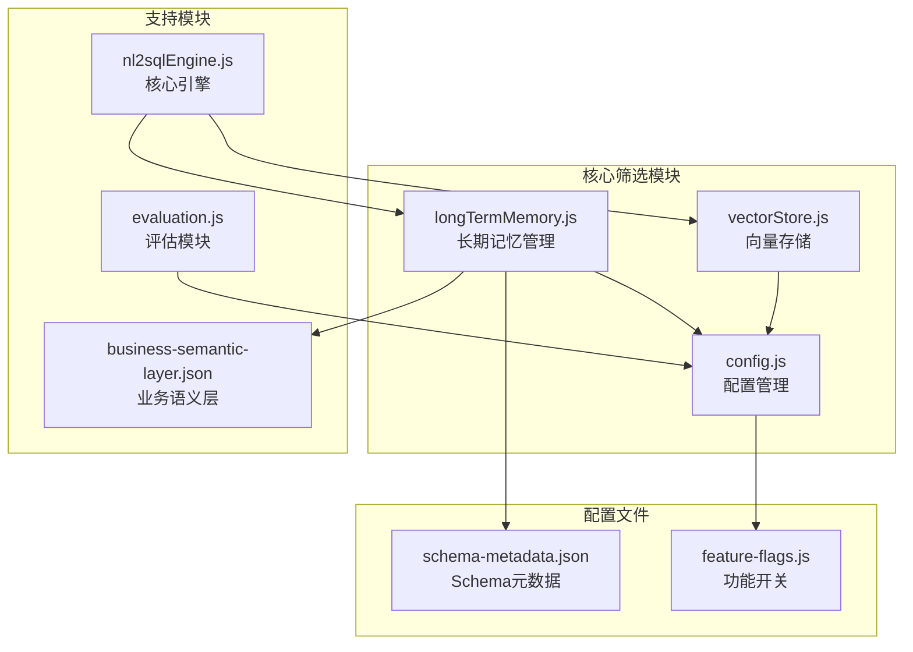
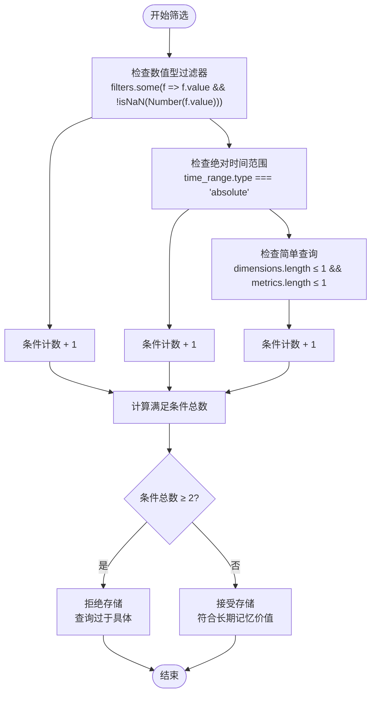
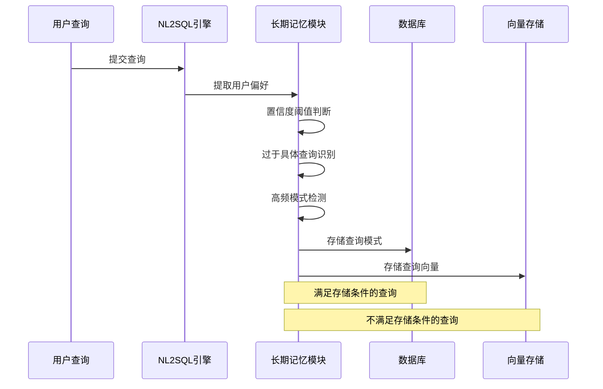
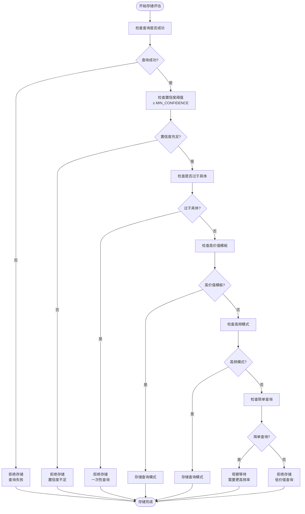
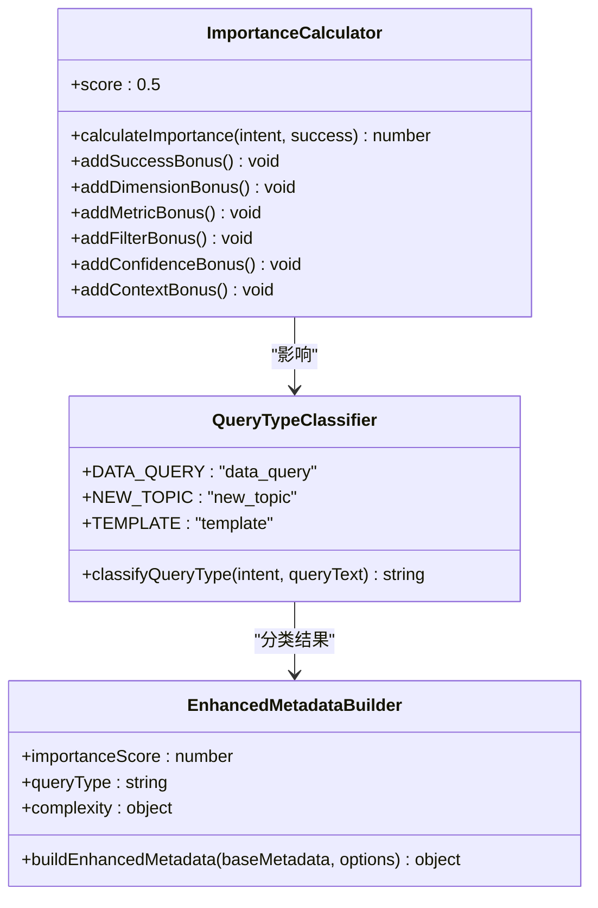
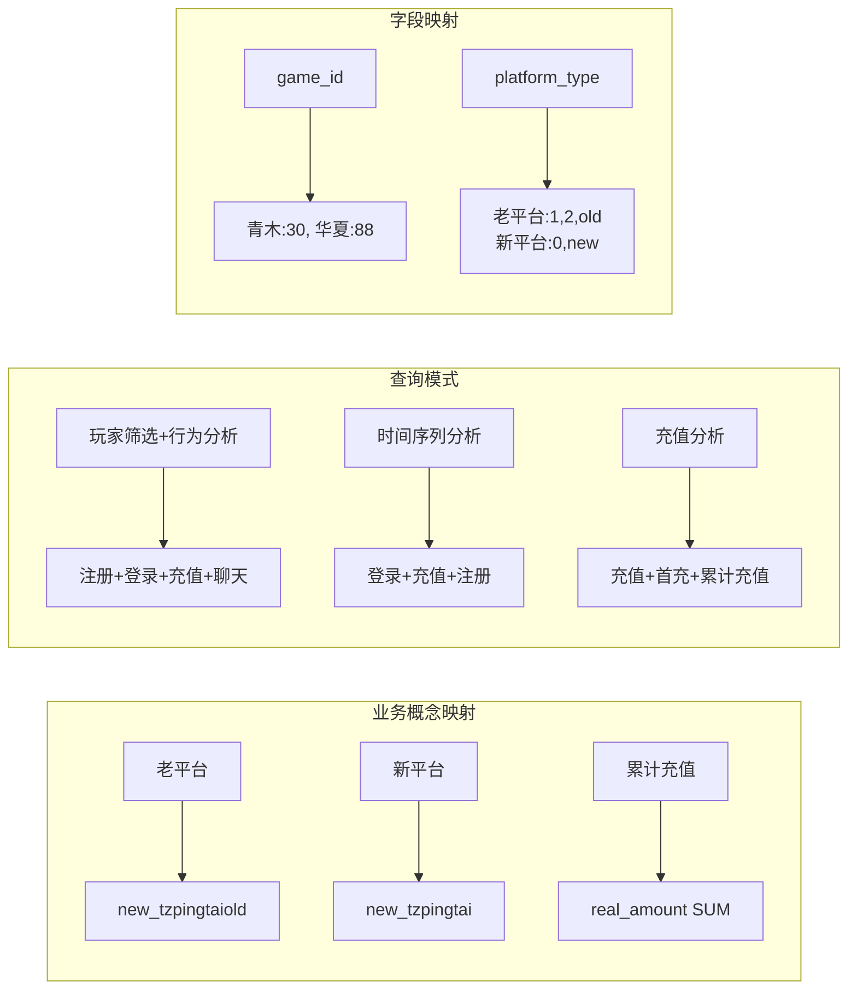
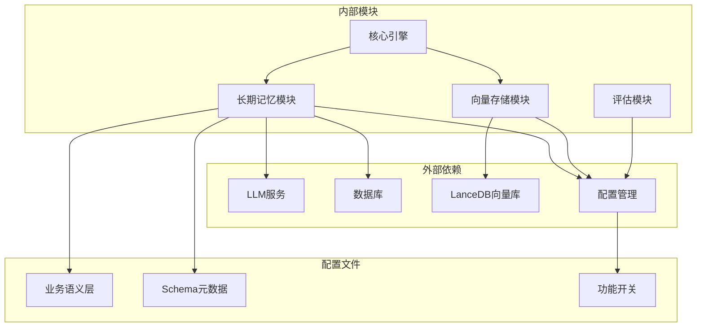

# 智能筛选机制

<cite>
**本文档引用的文件**
- [longTermMemory.js](file://backend/src/memory/longTermMemory.js)
- [config.js](file://backend/src/core/config.js)
- [vectorStore.js](file://backend/src/memory/vectorStore.js)
- [evaluation.js](file://backend/src/utils/evaluation.js)
- [nl2sqlEngine.js](file://backend/src/core/nl2sqlEngine.js)
- [business-semantic-layer.json](file://backend/config/business-semantic-layer.json)
- [schema-metadata.json](file://backend/config/schema-metadata.json)
</cite>

## 目录
1. [简介](#简介)
2. [项目结构](#项目结构)
3. [核心组件](#核心组件)
4. [架构概览](#架构概览)
5. [详细组件分析](#详细组件分析)
6. [依赖分析](#依赖分析)
7. [性能考虑](#性能考虑)
8. [故障排除指南](#故障排除指南)
9. [结论](#结论)

## 简介

NL2SQL智能筛选机制是一个多层次的查询质量评估和存储决策系统。该机制旨在从海量用户查询中识别高价值、可复用的查询模式，同时过滤掉一次性、低价值的查询，从而优化长期记忆系统的存储效率和检索质量。

系统采用"置信度阈值判断 + 多重条件过滤 + 高频模式检测"的综合策略，确保只有真正有价值和可复用的查询模式被存储到长期记忆中。

## 项目结构

智能筛选机制主要分布在以下核心模块中：



**图表来源**
- [longTermMemory.js:1-800](file://backend/src/memory/longTermMemory.js#L1-L800)
- [config.js:293-334](file://backend/src/core/config.js#L293-L334)

## 核心组件

### 置信度阈值判断系统

系统使用多层置信度评估机制：

1. **MIN_CONFIDENCE阈值**：默认0.7，要求查询必须达到一定置信度才能考虑存储
2. **动态置信度调整**：根据查询复杂度、成功状态等因素进行调整
3. **LLM置信度评估**：当启用LLM智能分析时，提供更精确的价值判断

### 过于具体查询识别规则

`isTooSpecific`函数采用"任意两个条件满足即过滤"的宽松策略：



**图表来源**
- [longTermMemory.js:208-231](file://backend/src/memory/longTermMemory.js#L208-L231)

### 高频模式检测系统

系统通过以下机制检测高频模式：

1. **时间窗口设置**：默认7天内查询频率
2. **最低频率阈值**：默认≥2次才认为是高频模式
3. **智能频率计算**：结合查询复杂度和业务语义进行加权

**章节来源**
- [longTermMemory.js:253-267](file://backend/src/memory/longTermMemory.js#L253-L267)

## 架构概览

智能筛选机制的整体架构如下：



**图表来源**
- [nl2sqlEngine.js:657-687](file://backend/src/core/nl2sqlEngine.js#L657-L687)
- [longTermMemory.js:299-486](file://backend/src/memory/longTermMemory.js#L299-L486)

## 详细组件分析

### 长期记忆管理模块

长期记忆管理模块是智能筛选机制的核心实现：

#### 存储价值评估流程



**图表来源**
- [longTermMemory.js:239-283](file://backend/src/memory/longTermMemory.js#L239-L283)

#### 关键阈值配置

| 阈值名称 | 默认值 | 配置路径 | 作用说明 |
|---------|--------|----------|----------|
| MIN_CONFIDENCE | 0.7 | `longTermMemory.thresholds.minConfidence` | 最小置信度阈值 |
| MIN_DIMENSIONS_FOR_TEMPLATE | 2 | `longTermMemory.thresholds.minDimensionsForTemplate` | 高价值模板最小维度数 |
| MIN_METRICS_FOR_TEMPLATE | 1 | `longTermMemory.thresholds.minMetricsForTemplate` | 高价值模板最小指标数 |
| RECENT_DAYS_FOR_FREQUENCY | 7 | `longTermMemory.thresholds.recentDaysForFrequency` | 频率判断时间窗口（天） |
| MIN_FREQUENCY_FOR_SIMPLE | 2 | `longTermMemory.thresholds.minFrequencyForSimple` | 简单查询最小频率 |

**章节来源**
- [config.js:300-321](file://backend/src/core/config.js#L300-L321)
- [longTermMemory.js:29-35](file://backend/src/memory/longTermMemory.js#L29-L35)

### 向量存储重要性评分

向量存储模块使用综合评分系统评估查询的重要性：



**图表来源**
- [vectorStore.js:52-86](file://backend/src/memory/vectorStore.js#L52-L86)
- [vectorStore.js:88-134](file://backend/src/memory/vectorStore.js#L88-L134)
- [vectorStore.js:143-177](file://backend/src/memory/vectorStore.js#L143-L177)

### 业务语义层集成

系统通过业务语义层配置文件实现智能筛选：



**图表来源**
- [business-semantic-layer.json:150-189](file://backend/config/business-semantic-layer.json#L150-L189)

**章节来源**
- [business-semantic-layer.json:1-189](file://backend/config/business-semantic-layer.json#L1-L189)

## 依赖分析

智能筛选机制的依赖关系如下：



**图表来源**
- [longTermMemory.js:17-22](file://backend/src/memory/longTermMemory.js#L17-L22)
- [vectorStore.js:1-22](file://backend/src/memory/vectorStore.js#L1-L22)

**章节来源**
- [longTermMemory.js:1-23](file://backend/src/memory/longTermMemory.js#L1-L23)
- [vectorStore.js:1-22](file://backend/src/memory/vectorStore.js#L1-L22)

## 性能考虑

### 存储优化策略

1. **阈值调优**
   - MIN_CONFIDENCE: 建议根据业务场景调整，高价值业务可提升至0.8
   - MIN_FREQUENCY_FOR_SIMPLE: 对于高频查询场景可降低至1

2. **内存管理**
   - 使用内存队列异步存储，避免阻塞主流程
   - 合理设置保留策略，平衡存储成本和检索效果

3. **向量存储优化**
   - 重要性评分权重可根据业务特点调整
   - 查询类型分类有助于优化存储策略

### 配置参数调优建议

| 参数类别 | 调优方向 | 建议值 | 影响说明 |
|---------|---------|--------|----------|
| 置信度阈值 | 严格化 | 0.7-0.9 | 提高存储质量，减少无效存储 |
| 频率阈值 | 放宽 | 1-3次 | 增加存储量，提高覆盖率 |
| 时间窗口 | 缩短 | 3-14天 | 提高响应速度，减少陈旧数据 |
| 复杂度阈值 | 调整 | 1-3维度 | 平衡模板价值和存储成本 |

## 故障排除指南

### 常见问题诊断

1. **查询未存储**
   - 检查置信度是否低于MIN_CONFIDENCE
   - 确认查询是否被识别为过于具体
   - 验证是否满足高频模式要求

2. **存储性能问题**
   - 监控内存队列积压情况
   - 检查数据库连接池状态
   - 评估向量存储性能

3. **配置错误**
   - 验证阈值配置是否合理
   - 检查功能开关状态
   - 确认业务语义层配置正确

### 调试方法

1. **启用详细日志**
   ```javascript
   // 在配置中设置日志级别
   log.level: 'debug'
   ```

2. **监控存储决策**
   - 关注"通过前置筛选"日志
   - 检查存储价值评估结果
   - 监控LLM分析结果

3. **性能基准测试**
   - 使用评估模块进行质量评估
   - 监控向量检索命中率
   - 统计长期记忆命中率

**章节来源**
- [evaluation.js:344-407](file://backend/src/utils/evaluation.js#L344-L407)

## 结论

NL2SQL智能筛选机制通过多层阈值判断、条件过滤和模式检测，实现了高效的查询模式识别和存储决策。该系统的关键优势包括：

1. **多层次筛选**：从置信度、具体性到频率的全方位评估
2. **智能化决策**：结合业务语义层和LLM分析提供精准判断
3. **性能优化**：异步存储和智能缓存机制确保系统稳定性
4. **可配置性**：灵活的阈值和权重设置适应不同业务场景

通过合理配置和持续优化，该机制能够有效提升长期记忆系统的价值密度和检索效率，为用户提供更好的NL2SQL体验。