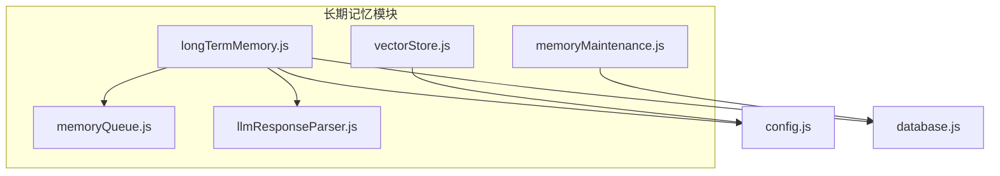
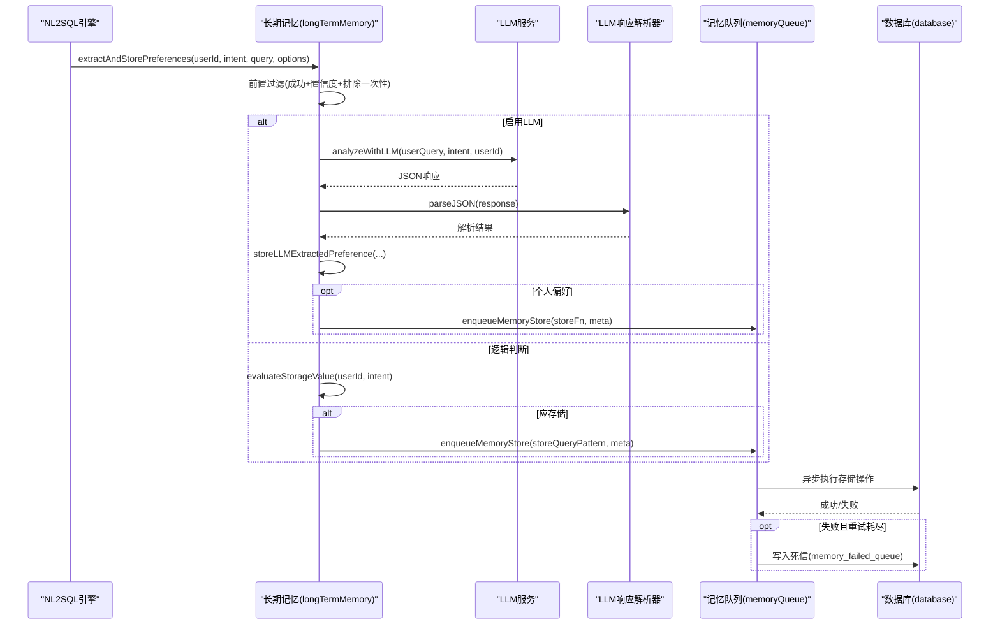
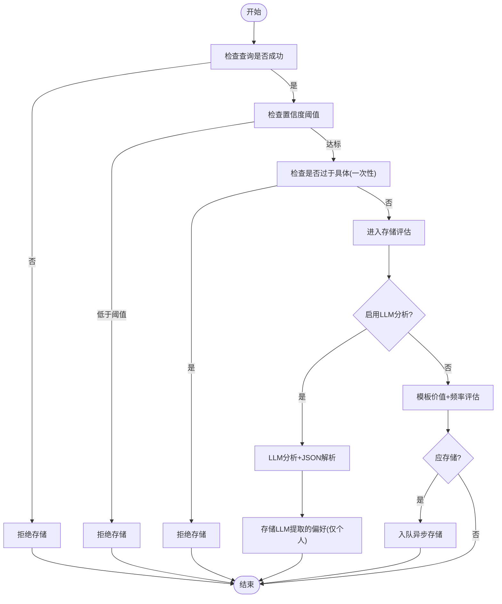
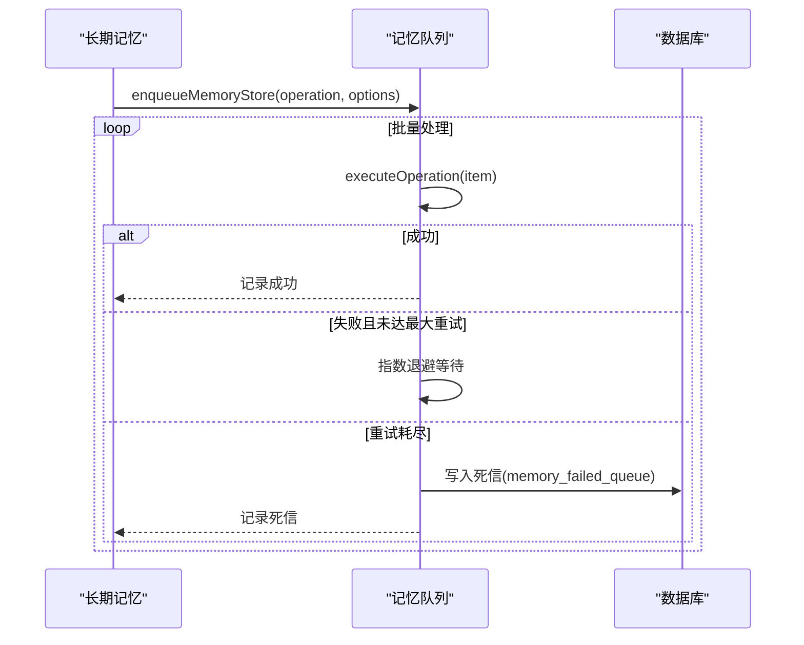
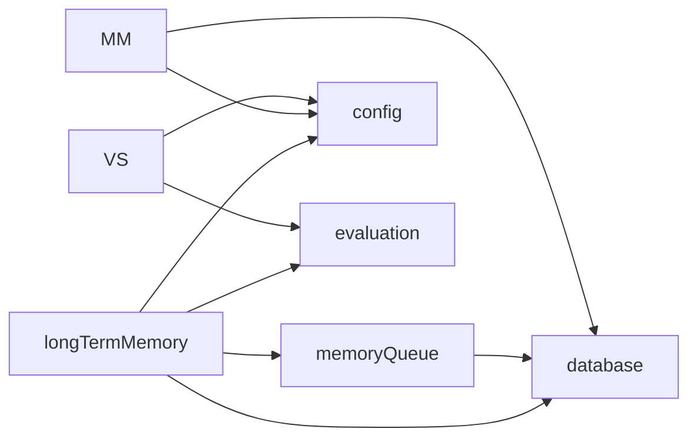

# 长期记忆管理

<cite>
**本文引用的文件**
- [longTermMemory.js](file://backend/src/memory/longTermMemory.js)
- [memoryQueue.js](file://backend/src/memory/memoryQueue.js)
- [memoryMaintenance.js](file://backend/src/memory/memoryMaintenance.js)
- [vectorStore.js](file://backend/src/memory/vectorStore.js)
- [llmResponseParser.js](file://backend/src/utils/llmResponseParser.js)
- [config.js](file://backend/src/core/config.js)
- [database.js](file://backend/src/core/database.js)
</cite>

## 目录
1. [简介](#简介)
2. [项目结构](#项目结构)
3. [核心组件](#核心组件)
4. [架构总览](#架构总览)
5. [详细组件分析](#详细组件分析)
6. [依赖分析](#依赖分析)
7. [性能考虑](#性能考虑)
8. [故障排除指南](#故障排除指南)
9. [结论](#结论)
10. [附录](#附录)

## 简介
本技术文档围绕 NL2SQL 系统的“长期记忆管理”模块展开，目标是帮助读者全面理解用户偏好学习机制、智能筛选策略、LLM 智能分析能力、存储决策流程以及异步存储队列的实现细节。文档还提供配置参数说明、性能优化建议与故障排除指南，帮助开发者在实际部署中高效、稳健地使用该模块。

## 项目结构
长期记忆管理模块位于 backend/src/memory 目录，主要文件包括：
- longTermMemory.js：核心偏好提取与存储逻辑，包含智能筛选、LLM 分析、字段别名学习、查询模式与指标/维度偏好的存储。
- memoryQueue.js：异步存储队列，实现指数退避重试、失败持久化（死信）、队列长度保护与指标导出。
- memoryMaintenance.js：记忆压缩与清理、相似模式合并、统计与健康报告。
- vectorStore.js：向量存储与检索（用于语义搜索），与长期记忆协同提升检索质量。
- llmResponseParser.js：统一的 LLM 响应解析器，保障 JSON/SQL 提取的稳定性。
- config.js：长期记忆相关配置项（阈值、保留策略、开关等）。
- database.js：SQLite 数据库抽象，提供用户偏好 CRUD、统计查询与死信队列写入。

图表来源
- [longTermMemory.js:1-1168](file://backend/src/memory/longTermMemory.js#L1-L1168)
- [memoryQueue.js:1-293](file://backend/src/memory/memoryQueue.js#L1-L293)
- [memoryMaintenance.js:1-421](file://backend/src/memory/memoryMaintenance.js#L1-L421)
- [vectorStore.js:1-928](file://backend/src/memory/vectorStore.js#L1-L928)
- [llmResponseParser.js:1-146](file://backend/src/utils/llmResponseParser.js#L1-L146)
- [config.js:290-439](file://backend/src/core/config.js#L290-L439)
- [database.js:150-349](file://backend/src/core/database.js#L150-L349)

章节来源
- [longTermMemory.js:1-1168](file://backend/src/memory/longTermMemory.js#L1-L1168)
- [memoryQueue.js:1-293](file://backend/src/memory/memoryQueue.js#L1-L293)
- [memoryMaintenance.js:1-421](file://backend/src/memory/memoryMaintenance.js#L1-L421)
- [vectorStore.js:1-928](file://backend/src/memory/vectorStore.js#L1-L928)
- [llmResponseParser.js:1-146](file://backend/src/utils/llmResponseParser.js#L1-L146)
- [config.js:290-439](file://backend/src/core/config.js#L290-L439)
- [database.js:150-349](file://backend/src/core/database.js#L150-L349)

## 核心组件
- 用户偏好学习机制
  - 查询模式识别：基于维度、指标、时间范围与过滤器生成模式名称，去重与使用次数更新。
  - 字段别名学习：从用户文本中提取映射关系，支持游戏ID、数据源标识等多场景。
  - 指标偏好与维度偏好：记录用户常用指标/维度，用于后续意图识别增强。
- 智能筛选策略
  - 置信度阈值：默认 ≥0.7 才考虑存储。
  - 频率统计：7 天内相似查询 ≥2 次判定为高频模式。
  - 模板价值评估：维度 ≥2 且指标 ≥1 的查询被视为高价值模板。
  - 一次性查询排除：包含具体数值过滤、绝对时间范围或仅简单维度/指标组合的查询通常不存储。
- LLM 智能分析
  - JSON 响应解析：统一解析策略，支持直接 JSON、代码块与花括号提取。
  - 偏好类型分类：字段别名、维度习惯、指标组合、过滤逻辑等。
  - 个人偏好与通用知识区分：仅存储“该用户特有的习惯/术语”，通用知识不入库。
- 存储决策与异步队列
  - 前置过滤：查询成功且置信度达标、不过于具体。
  - LLM 路径：优先使用 LLM 判断；若启用，直接存储 LLM 提取的偏好。
  - 逻辑路径：评估模板价值与频率，符合条件则入队异步存储。
  - 死信处理：队列重试耗尽后写入 memory_failed_queue，便于事后重放与排查。

章节来源
- [longTermMemory.js:28-486](file://backend/src/memory/longTermMemory.js#L28-L486)
- [longTermMemory.js:488-853](file://backend/src/memory/longTermMemory.js#L488-L853)
- [longTermMemory.js:855-1168](file://backend/src/memory/longTermMemory.js#L855-L1168)
- [memoryQueue.js:57-234](file://backend/src/memory/memoryQueue.js#L57-L234)
- [llmResponseParser.js:24-59](file://backend/src/utils/llmResponseParser.js#L24-L59)

## 架构总览
长期记忆模块与系统其他子模块的交互如下：

图表来源
- [longTermMemory.js:299-486](file://backend/src/memory/longTermMemory.js#L299-L486)
- [memoryQueue.js:107-215](file://backend/src/memory/memoryQueue.js#L107-L215)
- [llmResponseParser.js:24-59](file://backend/src/utils/llmResponseParser.js#L24-L59)
- [database.js:217-236](file://backend/src/core/database.js#L217-L236)

## 详细组件分析

### 用户偏好学习机制
- 查询模式识别
  - 生成模式名称：结合时间范围、维度与指标，避免冗长。
  - 去重与使用次数：若同名模式已存在，仅更新使用次数；冲突时记录警告。
- 字段别名学习
  - 支持游戏ID映射、数据源标识、实体值映射等，自动去重与冲突检测。
  - 对伪字段（如数据源标识）采用直写策略，同时可存储值映射。
- 指标偏好与维度偏好
  - 记录用户常用指标/维度，用于后续意图识别增强与检索排序。

图表来源
- [longTermMemory.js:299-486](file://backend/src/memory/longTermMemory.js#L299-L486)
- [llmResponseParser.js:24-59](file://backend/src/utils/llmResponseParser.js#L24-L59)

章节来源
- [longTermMemory.js:616-758](file://backend/src/memory/longTermMemory.js#L616-L758)
- [longTermMemory.js:773-853](file://backend/src/memory/longTermMemory.js#L773-L853)
- [longTermMemory.js:1004-1097](file://backend/src/memory/longTermMemory.js#L1004-L1097)

### 智能筛选策略
- 置信度阈值：默认 0.7，可通过配置覆盖。
- 高价值模板：维度 ≥2 且指标 ≥1。
- 频率统计：7 天内相似查询 ≥2 次。
- 一次性查询排除：包含具体数值过滤、绝对时间范围或仅简单维度/指标组合。

章节来源
- [longTermMemory.js:29-43](file://backend/src/memory/longTermMemory.js#L29-L43)
- [longTermMemory.js:208-283](file://backend/src/memory/longTermMemory.js#L208-L283)
- [config.js:310-321](file://backend/src/core/config.js#L310-L321)

### LLM 智能分析
- JSON 响应解析：支持直接 JSON、代码块与花括号提取，失败时抛出带上下文的错误。
- 偏好类型分类：字段别名、维度习惯、指标组合、过滤逻辑等。
- 个人偏好与通用知识区分：仅存储“该用户特有的习惯/术语”。

章节来源
- [longTermMemory.js:58-190](file://backend/src/memory/longTermMemory.js#L58-L190)
- [llmResponseParser.js:24-59](file://backend/src/utils/llmResponseParser.js#L24-L59)

### 存储决策与异步队列
- 前置过滤：查询成功、置信度达标、不过于具体。
- LLM 路径：优先使用 LLM 判断；若启用，直接存储 LLM 提取的偏好。
- 逻辑路径：评估模板价值与频率，符合条件则入队异步存储。
- 死信处理：队列重试耗尽后写入 memory_failed_queue，便于事后重放与排查。

图表来源
- [memoryQueue.js:107-215](file://backend/src/memory/memoryQueue.js#L107-L215)
- [database.js:217-236](file://backend/src/core/database.js#L217-L236)

章节来源
- [memoryQueue.js:57-234](file://backend/src/memory/memoryQueue.js#L57-L234)
- [longTermMemory.js:399-414](file://backend/src/memory/longTermMemory.js#L399-L414)

### 记忆维护与相似模式合并
- 分级保留策略：高频(≥10次)永久保留；中频(3-9次)90天未用清理；低频(<3次)30天未用清理；字段别名365天未用清理。
- 相似模式合并：维度与指标重合度均 >70% 且时间范围类型一致时合并，合并后使用次数累加。

章节来源
- [memoryMaintenance.js:24-46](file://backend/src/memory/memoryMaintenance.js#L24-L46)
- [memoryMaintenance.js:127-195](file://backend/src/memory/memoryMaintenance.js#L127-L195)
- [memoryMaintenance.js:207-315](file://backend/src/memory/memoryMaintenance.js#L207-L315)

### 向量存储与检索（语义增强）
- Schema 向量与查询历史向量：用于语义相似度搜索与智能排序。
- 智能搜索：根据查询意图识别游戏名、平台权重与报表类型，进行优先级重排。

章节来源
- [vectorStore.js:235-326](file://backend/src/memory/vectorStore.js#L235-L326)
- [vectorStore.js:454-578](file://backend/src/memory/vectorStore.js#L454-L578)

## 依赖分析
- 模块耦合
  - longTermMemory 依赖 database、memoryQueue、llmService、config、evaluation。
  - memoryQueue 依赖 database（写死信）与 logger。
  - memoryMaintenance 依赖 database 与 config。
  - vectorStore 依赖 config、logger、evaluation。
- 外部依赖
  - LLM API（通过 llmService）与向量数据库（LanceDB）。
- 潜在循环依赖
  - 当前模块间无明显循环依赖；各模块职责清晰，通过配置与数据库抽象解耦。

图表来源
- [longTermMemory.js:17-22](file://backend/src/memory/longTermMemory.js#L17-L22)
- [memoryQueue.js:13-20](file://backend/src/memory/memoryQueue.js#L13-L20)
- [memoryMaintenance.js:16-18](file://backend/src/memory/memoryMaintenance.js#L16-L18)
- [vectorStore.js:14-23](file://backend/src/memory/vectorStore.js#L14-L23)

章节来源
- [longTermMemory.js:17-22](file://backend/src/memory/longTermMemory.js#L17-L22)
- [memoryQueue.js:13-20](file://backend/src/memory/memoryQueue.js#L13-L20)
- [memoryMaintenance.js:16-18](file://backend/src/memory/memoryMaintenance.js#L16-L18)
- [vectorStore.js:14-23](file://backend/src/memory/vectorStore.js#L14-L23)

## 性能考虑
- 异步存储与批处理
  - memoryQueue 采用批量处理与进程内队列，减少主线程阻塞；建议合理设置批大小与处理间隔。
- 指数退避与失败持久化
  - 重试上限与退避因子可调，避免对下游造成雪崩；失败写入死信表，便于事后重放。
- 记忆压缩与清理
  - 分级保留策略减少无效记忆占用；相似模式合并降低冗余。
- 向量检索优化
  - 智能搜索根据查询意图进行优先级重排，提高检索效率与准确性。

[本节为通用指导，无需列出章节来源]

## 故障排除指南
- LLM 响应解析失败
  - 现象：JSON 解析报错。
  - 排查：确认 LLM 输出包含 JSON 结构；检查提示词格式；查看解析器日志。
  - 参考
    - [llmResponseParser.js:24-59](file://backend/src/utils/llmResponseParser.js#L24-L59)
- 存储队列持续失败
  - 现象：队列 metrics 中 retried/failed 增多。
  - 排查：检查数据库连接、权限与表结构；查看死信表 memory_failed_queue；确认重试次数与退避策略。
  - 参考
    - [memoryQueue.js:154-215](file://backend/src/memory/memoryQueue.js#L154-L215)
    - [database.js:217-236](file://backend/src/core/database.js#L217-L236)
- 记忆未生效或未清理
  - 现象：偏好未被检索或长期占用空间。
  - 排查：检查保留策略配置；执行记忆压缩与相似模式合并；核对用户偏好表结构与索引。
  - 参考
    - [memoryMaintenance.js:69-120](file://backend/src/memory/memoryMaintenance.js#L69-L120)
    - [memoryMaintenance.js:207-315](file://backend/src/memory/memoryMaintenance.js#L207-L315)
    - [database.js:156-186](file://backend/src/core/database.js#L156-L186)
- 向量数据库未初始化
  - 现象：向量搜索返回空结果或警告。
  - 排查：确认 LanceDB 路径与权限；检查初始化日志；确认 embedding.enabled 与维度配置。
  - 参考
    - [vectorStore.js:235-265](file://backend/src/memory/vectorStore.js#L235-L265)
    - [config.js:84-94](file://backend/src/core/config.js#L84-L94)

章节来源
- [llmResponseParser.js:24-59](file://backend/src/utils/llmResponseParser.js#L24-L59)
- [memoryQueue.js:154-215](file://backend/src/memory/memoryQueue.js#L154-L215)
- [database.js:217-236](file://backend/src/core/database.js#L217-L236)
- [memoryMaintenance.js:69-120](file://backend/src/memory/memoryMaintenance.js#L69-L120)
- [memoryMaintenance.js:207-315](file://backend/src/memory/memoryMaintenance.js#L207-L315)
- [database.js:156-186](file://backend/src/core/database.js#L156-L186)
- [vectorStore.js:235-265](file://backend/src/memory/vectorStore.js#L235-L265)
- [config.js:84-94](file://backend/src/core/config.js#L84-L94)

## 结论
长期记忆管理模块通过“智能筛选 + LLM 分析 + 异步队列”的组合，实现了对用户偏好的高效学习与稳定存储。模块具备完善的失败处理与维护机制，能够随着用户使用不断优化意图识别与实体解析的效果。建议在生产环境中启用 LLM 分析与记忆维护，并结合监控指标（队列状态、死信数、记忆压缩统计）进行持续优化。

[本节为总结性内容，无需列出章节来源]

## 附录

### 配置参数说明
- 长期记忆开关与阈值
  - enabled：是否启用长期记忆功能。
  - useLLMForExtraction：是否启用 LLM 智能提炼。
  - thresholds：minConfidence、minDimensionsForTemplate、minMetricsForTemplate、recentDaysForFrequency、minFrequencyForSimple。
  - retention：分级保留策略（高频、中频、低频、字段别名）。
- 示例路径
  - [config.js:299-334](file://backend/src/core/config.js#L299-L334)

章节来源
- [config.js:299-334](file://backend/src/core/config.js#L299-L334)