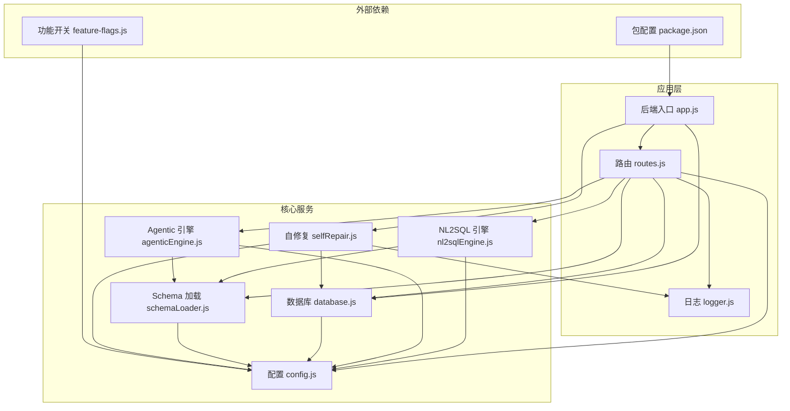
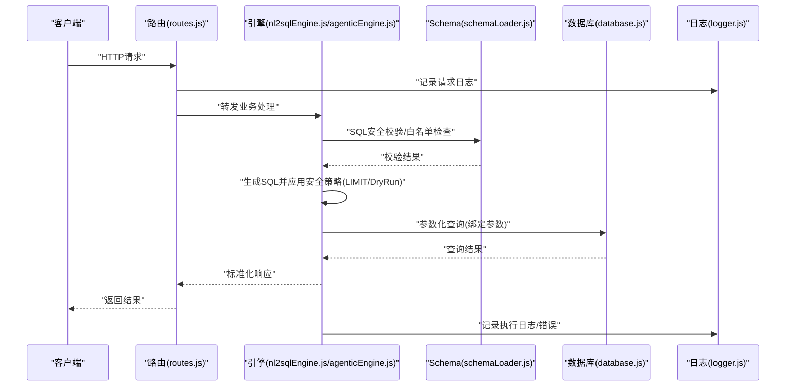
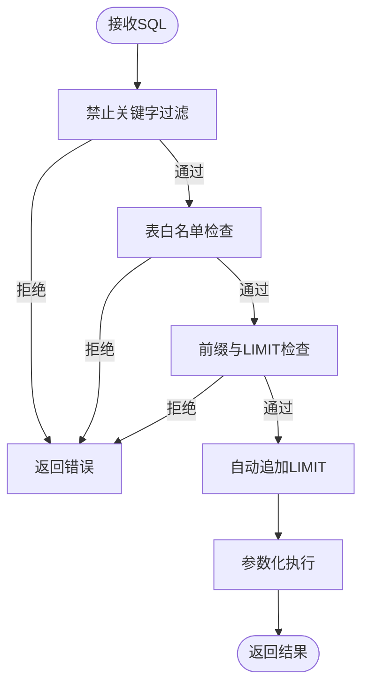
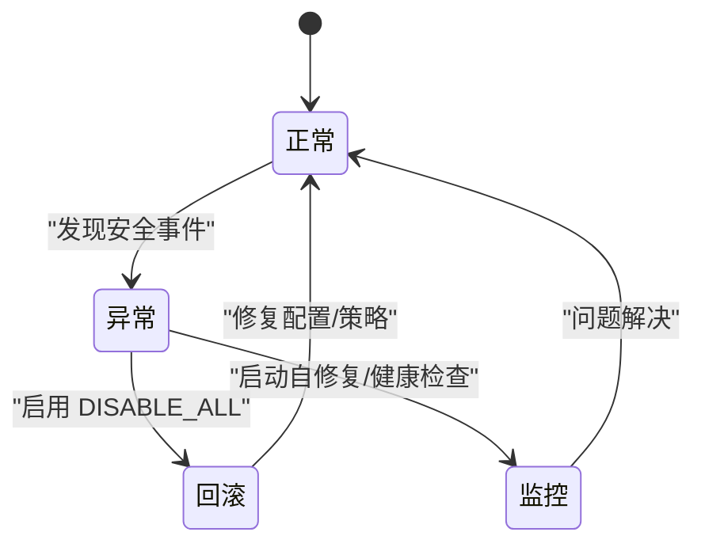
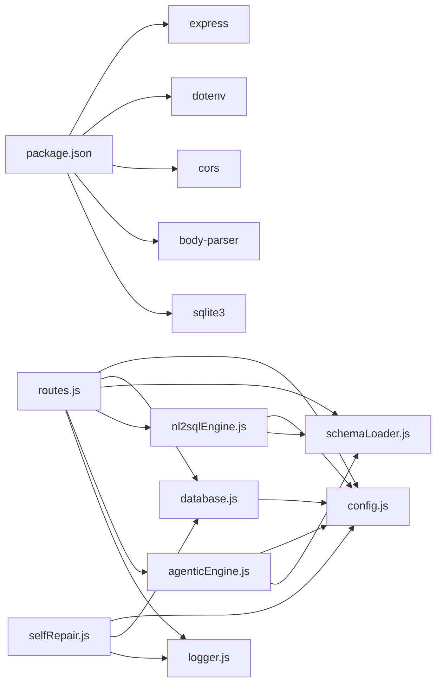

# 安全运维

<cite>
**本文引用的文件**
- [后端入口 app.js](file://backend/src/app.js)
- [路由 routes.js](file://backend/src/core/routes.js)
- [数据库 database.js](file://backend/src/core/database.js)
- [配置 config.js](file://backend/src/core/config.js)
- [功能开关 feature-flags.js](file://backend/config/feature-flags.js)
- [日志 logger.js](file://backend/src/utils/logger.js)
- [自修复 selfRepair.js](file://backend/src/core/selfRepair.js)
- [Schema 加载 schemaLoader.js](file://backend/src/core/schemaLoader.js)
- [Agentic 引擎 agenticEngine.js](file://backend/src/core/agenticEngine.js)
- [NL2SQL 引擎 nl2sqlEngine.js](file://backend/src/core/nl2sqlEngine.js)
- [包配置 package.json](file://backend/package.json)
</cite>

## 目录
1. [简介](#简介)
2. [项目结构](#项目结构)
3. [核心组件](#核心组件)
4. [架构总览](#架构总览)
5. [详细组件分析](#详细组件分析)
6. [依赖分析](#依赖分析)
7. [性能考量](#性能考量)
8. [故障排查指南](#故障排查指南)
9. [结论](#结论)
10. [附录](#附录)

## 简介
本文件面向NL2SQL项目的安全运维，围绕应用安全配置、数据安全、功能开关与回滚、安全审计与合规、以及应急响应流程展开。重点覆盖SQL注入防护、输入校验与参数绑定、敏感数据保护、传输安全与访问控制、功能开关的生产启用策略与紧急回滚、日志审计与漏洞扫描建议、以及安全事件处置预案。

## 项目结构
后端采用Express服务，核心模块包括：配置中心、路由层、数据库与向量存储、日志与自修复、Schema与NL2SQL引擎、功能开关等。整体以模块化组织，便于安全策略的集中与分发。

图表来源
- [后端入口 app.js:1-260](file://backend/src/app.js#L1-L260)
- [路由 routes.js:1-1037](file://backend/src/core/routes.js#L1-L1037)
- [数据库 database.js:1-859](file://backend/src/core/database.js#L1-L859)
- [配置 config.js:1-398](file://backend/src/core/config.js#L1-L398)
- [功能开关 feature-flags.js:1-249](file://backend/config/feature-flags.js#L1-L249)
- [日志 logger.js:1-442](file://backend/src/utils/logger.js#L1-L442)
- [自修复 selfRepair.js:1-489](file://backend/src/core/selfRepair.js#L1-L489)
- [Schema 加载 schemaLoader.js:1-1172](file://backend/src/core/schemaLoader.js#L1-L1172)
- [NL2SQL 引擎 nl2sqlEngine.js:1-2652](file://backend/src/core/nl2sqlEngine.js#L1-L2652)
- [Agentic 引擎 agenticEngine.js:1-653](file://backend/src/core/agenticEngine.js#L1-L653)
- [包配置 package.json:1-28](file://backend/package.json#L1-L28)

章节来源
- [后端入口 app.js:1-260](file://backend/src/app.js#L1-L260)
- [包配置 package.json:1-28](file://backend/package.json#L1-L28)

## 核心组件
- 配置中心：集中管理端口、LLM/API、数据库、安全策略、日志、自修复、Schema、长期记忆、上下文管理、评估等配置，并提供启动前校验。
- 路由层：统一暴露健康检查、Schema查询、会话与消息、查询历史、偏好与评估等接口，内置请求日志中间件。
- 数据库：SQLite持久化会话、消息、查询历史、用户偏好与系统日志，提供参数化查询与事务封装。
- 日志：统一结构化日志，支持文件轮转、级别控制、追踪上下文，便于审计与排障。
- 自修复：定时任务执行健康检查、会话清理、统计收集与记忆维护，保障系统稳定性。
- Schema与引擎：SQL白名单、禁止关键字、安全校验、LIMIT限制、DryRun模式等安全策略贯穿执行链路。
- 功能开关：按Phase粒度的开关，支持全局启用/禁用与紧急回滚，便于灰度发布与快速回退。

章节来源
- [配置 config.js:1-398](file://backend/src/core/config.js#L1-L398)
- [路由 routes.js:1-1037](file://backend/src/core/routes.js#L1-L1037)
- [数据库 database.js:1-859](file://backend/src/core/database.js#L1-L859)
- [日志 logger.js:1-442](file://backend/src/utils/logger.js#L1-L442)
- [自修复 selfRepair.js:1-489](file://backend/src/core/selfRepair.js#L1-L489)
- [Schema 加载 schemaLoader.js:1-1172](file://backend/src/core/schemaLoader.js#L1-L1172)
- [NL2SQL 引擎 nl2sqlEngine.js:1-2652](file://backend/src/core/nl2sqlEngine.js#L1-L2652)
- [Agentic 引擎 agenticEngine.js:1-653](file://backend/src/core/agenticEngine.js#L1-L653)
- [功能开关 feature-flags.js:1-249](file://backend/config/feature-flags.js#L1-L249)

## 架构总览
下图展示安全相关的关键交互：路由层接收请求，经配置与日志进入引擎层，引擎层结合Schema与安全策略生成SQL并执行，数据库层以参数化方式访问，日志与自修复贯穿全程。

图表来源
- [路由 routes.js:1-1037](file://backend/src/core/routes.js#L1-L1037)
- [NL2SQL 引擎 nl2sqlEngine.js:1830-2029](file://backend/src/core/nl2sqlEngine.js#L1830-L2029)
- [Agentic 引擎 agenticEngine.js:460-653](file://backend/src/core/agenticEngine.js#L460-L653)
- [Schema 加载 schemaLoader.js:720-758](file://backend/src/core/schemaLoader.js#L720-L758)
- [数据库 database.js:364-454](file://backend/src/core/database.js#L364-L454)
- [日志 logger.js:232-310](file://backend/src/utils/logger.js#L232-L310)

## 详细组件分析

### 应用安全配置与SQL注入防护
- 参数化查询与绑定
  - 数据库层提供参数化查询接口，所有外部输入均以参数形式传入，避免拼接SQL引发注入风险。
  - 示例路径：[参数化查询接口:364-454](file://backend/src/core/database.js#L364-L454)
- SQL白名单与关键字过滤
  - 配置中心定义禁止关键字集合，Schema加载器在SQL校验阶段逐项匹配并拒绝。
  - 示例路径：[禁止关键字定义:158-163](file://backend/src/core/config.js#L158-L163)、[SQL校验:720-758](file://backend/src/core/schemaLoader.js#L720-L758)
- 表白名单访问控制
  - 若配置了允许访问的表清单，则对SQL中的表名进行白名单校验，未在白名单内的表禁止访问。
  - 示例路径：[表白名单检查:738-754](file://backend/src/core/schemaLoader.js#L738-L754)
- 查询限制与DryRun
  - 引擎层在生成SQL时自动追加LIMIT，防止大结果集导致性能与资源问题；DryRun模式仅生成SQL不执行，便于审计与调试。
  - 示例路径：[自动追加LIMIT:1839-1842](file://backend/src/core/nl2sqlEngine.js#L1839-L1842)、[DryRun检查:1917-1933](file://backend/src/core/nl2sqlEngine.js#L1917-L1933)
- 安全校验与语法限制
  - 引擎层对SQL进行前缀与LIMIT检查，仅允许SELECT/CTE开头的查询，确保只执行读取类操作。
  - 示例路径：[SQL安全校验:1853-1897](file://backend/src/core/nl2sqlEngine.js#L1853-L1897)
- Agentic引擎安全检查
  - 在生成SQL后进行禁止关键字二次校验与表存在性检查，汇总错误并给出修复建议。
  - 示例路径：[Agentic安全检查:463-497](file://backend/src/core/agenticEngine.js#L463-L497)

图表来源
- [配置 config.js:158-163](file://backend/src/core/config.js#L158-L163)
- [Schema 加载 schemaLoader.js:720-758](file://backend/src/core/schemaLoader.js#L720-L758)
- [NL2SQL 引擎 nl2sqlEngine.js:1853-1897](file://backend/src/core/nl2sqlEngine.js#L1853-L1897)
- [Agentic 引擎 agenticEngine.js:463-497](file://backend/src/core/agenticEngine.js#L463-L497)
- [数据库 database.js:364-454](file://backend/src/core/database.js#L364-L454)

章节来源
- [配置 config.js:132-170](file://backend/src/core/config.js#L132-L170)
- [Schema 加载 schemaLoader.js:720-758](file://backend/src/core/schemaLoader.js#L720-L758)
- [NL2SQL 引擎 nl2sqlEngine.js:1839-1933](file://backend/src/core/nl2sqlEngine.js#L1839-L1933)
- [Agentic 引擎 agenticEngine.js:463-497](file://backend/src/core/agenticEngine.js#L463-L497)
- [数据库 database.js:364-454](file://backend/src/core/database.js#L364-L454)

### 输入验证与参数绑定
- 路由层中间件
  - 统一日志中间件记录请求方法、路径、查询参数与IP，便于审计与溯源。
  - 示例路径：[请求日志中间件:42-54](file://backend/src/core/routes.js#L42-L54)
- 数据库层参数化
  - 所有查询与写入均通过参数化接口执行，避免字符串拼接。
  - 示例路径：[参数化查询/执行:364-454](file://backend/src/core/database.js#L364-L454)
- 配置校验
  - 启动前校验关键配置（如LLM密钥、数据库URL），缺失或默认值将触发告警。
  - 示例路径：[配置校验:366-388](file://backend/src/core/config.js#L366-L388)

章节来源
- [路由 routes.js:42-54](file://backend/src/core/routes.js#L42-L54)
- [数据库 database.js:364-454](file://backend/src/core/database.js#L364-L454)
- [配置 config.js:366-388](file://backend/src/core/config.js#L366-L388)

### 数据安全措施
- 敏感字段脱敏
  - 配置中心定义敏感字段清单，查询结果中涉及敏感字段将进行脱敏处理（策略需在结果层实现，配置提供清单）。
  - 示例路径：[敏感字段清单:165-169](file://backend/src/core/config.js#L165-L169)
- 传输安全
  - 建议在生产环境启用HTTPS与TLS终止于反向代理/网关；当前路由未强制HTTPS，应在网关层统一处理。
  - 示例路径：[路由CORS与请求体解析:63-72](file://backend/src/app.js#L63-L72)
- 访问控制
  - 表白名单与禁止关键字双重控制，避免越权与危险操作；DryRun与LIMIT限制降低误操作风险。
  - 示例路径：[表白名单:738-754](file://backend/src/core/schemaLoader.js#L738-L754)、[禁止关键字:158-163](file://backend/src/core/config.js#L158-L163)

章节来源
- [配置 config.js:132-170](file://backend/src/core/config.js#L132-L170)
- [后端入口 app.js:63-72](file://backend/src/app.js#L63-L72)
- [Schema 加载 schemaLoader.js:738-754](file://backend/src/core/schemaLoader.js#L738-L754)

### 功能开关的安全考虑
- 开关粒度与优先级
  - 按Phase划分功能开关，支持全局启用/禁用；DISABLE_ALL优先于ENABLE_ALL，便于紧急回滚。
  - 示例路径：[开关优先级与检查:108-121](file://backend/config/feature-flags.js#L108-L121)
- 生产启用策略
  - 建议以Phase为单位灰度启用，先启用低风险能力（如Schema分层加载），再逐步开放高风险能力（如Agentic工作流）。
  - 示例路径：[Phase定义:16-96](file://backend/config/feature-flags.js#L16-L96)
- 紧急回滚机制
  - 通过设置DISABLE_ALL快速关闭所有新功能；同时可在启动日志中打印当前启用的Phase，便于快速确认。
  - 示例路径：[日志输出:209-229](file://backend/config/feature-flags.js#L209-L229)、[启动打印:152-157](file://backend/src/app.js#L152-L157)

章节来源
- [功能开关 feature-flags.js:108-121](file://backend/config/feature-flags.js#L108-L121)
- [功能开关 feature-flags.js:209-229](file://backend/config/feature-flags.js#L209-L229)
- [后端入口 app.js:152-157](file://backend/src/app.js#L152-L157)

### 安全审计与合规检查
- 日志审计
  - 统一日志级别、文件轮转、结构化输出与追踪上下文，支持审计与取证。
  - 示例路径：[日志类与轮转:130-210](file://backend/src/utils/logger.js#L130-L210)、[追踪接口:311-408](file://backend/src/utils/logger.js#L311-L408)
- 漏洞扫描与安全测试
  - 建议在CI/CD中集成静态扫描（依赖版本、配置文件）、动态扫描（SQL注入、XSS、CORS配置）与渗透测试（API边界、鉴权绕过）。
  - 示例路径：[依赖声明:10-20](file://backend/package.json#L10-L20)

章节来源
- [日志 logger.js:130-210](file://backend/src/utils/logger.js#L130-L210)
- [日志 logger.js:311-408](file://backend/src/utils/logger.js#L311-L408)
- [包配置 package.json:10-20](file://backend/package.json#L10-L20)

### 应急响应流程与预案
- 事件分类与处置
  - SQL注入/越权：立即启用DISABLE_ALL，检查ALLOWED_TABLES与禁止关键字配置，审查日志定位攻击面。
  - 性能异常：检查MAX_QUERY_ROWS、QUERY_TIMEOUT与慢查询阈值，启用自修复任务清理与统计收集。
  - 配置错误：通过validateConfig定位缺失项，修正后重启。
- 自修复与健康检查
  - 启动自修复任务，定期执行数据库连通性检查、会话清理、统计收集与记忆维护。
  - 示例路径：[自修复启动:60-125](file://backend/src/core/selfRepair.js#L60-L125)、[每日自检:169-200](file://backend/src/core/selfRepair.js#L169-L200)

图表来源
- [功能开关 feature-flags.js:108-121](file://backend/config/feature-flags.js#L108-L121)
- [自修复 selfRepair.js:60-125](file://backend/src/core/selfRepair.js#L60-L125)

章节来源
- [功能开关 feature-flags.js:108-121](file://backend/config/feature-flags.js#L108-L121)
- [自修复 selfRepair.js:60-125](file://backend/src/core/selfRepair.js#L60-L125)

## 依赖分析
- 外部依赖与安全影响
  - Express/CORS/body-parser：需关注CORS配置与请求体大小限制；生产建议限制origin与启用安全中间件。
  - sqlite3：本地文件存储，注意权限与备份；参数化查询降低注入风险。
  - dotenv：环境变量加载，需确保敏感信息不落盘。
- 内部模块耦合
  - 路由层依赖配置、数据库、Schema与引擎；引擎层依赖配置与Schema；数据库层依赖配置；日志与自修复贯穿各模块。

图表来源
- [包配置 package.json:10-20](file://backend/package.json#L10-L20)
- [路由 routes.js:1-1037](file://backend/src/core/routes.js#L1-L1037)
- [配置 config.js:1-398](file://backend/src/core/config.js#L1-L398)
- [数据库 database.js:1-859](file://backend/src/core/database.js#L1-L859)
- [Schema 加载 schemaLoader.js:1-1172](file://backend/src/core/schemaLoader.js#L1-L1172)
- [NL2SQL 引擎 nl2sqlEngine.js:1-2652](file://backend/src/core/nl2sqlEngine.js#L1-L2652)
- [Agentic 引擎 agenticEngine.js:1-653](file://backend/src/core/agenticEngine.js#L1-L653)
- [自修复 selfRepair.js:1-489](file://backend/src/core/selfRepair.js#L1-L489)
- [日志 logger.js:1-442](file://backend/src/utils/logger.js#L1-L442)

章节来源
- [包配置 package.json:10-20](file://backend/package.json#L10-L20)
- [路由 routes.js:1-1037](file://backend/src/core/routes.js#L1-L1037)

## 性能考量
- 查询限制与超时
  - 通过MAX_QUERY_ROWS、QUERY_TIMEOUT与LIMIT限制，避免大查询导致资源耗尽。
  - 示例路径：[查询限制配置:150-156](file://backend/src/core/config.js#L150-L156)、[自动追加LIMIT:1839-1842](file://backend/src/core/nl2sqlEngine.js#L1839-L1842)
- 自修复与资源回收
  - 定时清理过期会话、统计收集与记忆维护，降低长期运行的资源压力。
  - 示例路径：[自修复任务:60-125](file://backend/src/core/selfRepair.js#L60-L125)

章节来源
- [配置 config.js:150-156](file://backend/src/core/config.js#L150-L156)
- [NL2SQL 引擎 nl2sqlEngine.js:1839-1842](file://backend/src/core/nl2sqlEngine.js#L1839-L1842)
- [自修复 selfRepair.js:60-125](file://backend/src/core/selfRepair.js#L60-L125)

## 故障排查指南
- SQL执行失败
  - 检查禁止关键字与表白名单，确认是否启用DryRun；查看日志定位错误。
  - 示例路径：[SQL校验:720-758](file://backend/src/core/schemaLoader.js#L720-L758)、[DryRun:1917-1933](file://backend/src/core/nl2sqlEngine.js#L1917-L1933)
- 数据库连接异常
  - 自修复任务会定期检查数据库连通性，若失败需检查DB路径与权限。
  - 示例路径：[每日自检:169-200](file://backend/src/core/selfRepair.js#L169-L200)
- 日志与追踪
  - 使用日志级别与追踪接口定位问题，核对meta信息与trace上下文。
  - 示例路径：[日志级别与追踪:232-408](file://backend/src/utils/logger.js#L232-L408)

章节来源
- [Schema 加载 schemaLoader.js:720-758](file://backend/src/core/schemaLoader.js#L720-L758)
- [NL2SQL 引擎 nl2sqlEngine.js:1917-1933](file://backend/src/core/nl2sqlEngine.js#L1917-L1933)
- [自修复 selfRepair.js:169-200](file://backend/src/core/selfRepair.js#L169-L200)
- [日志 logger.js:232-408](file://backend/src/utils/logger.js#L232-L408)

## 结论
NL2SQL项目在安全方面已具备较为完善的基线：参数化查询、SQL白名单与关键字过滤、表白名单、DryRun与LIMIT限制、功能开关与紧急回滚、统一日志与自修复。建议在生产环境中强化传输安全（HTTPS/TLS）、访问控制（鉴权/授权）、持续安全测试与合规审计，并完善应急响应流程与演练，以进一步提升整体安全韧性。

## 附录
- 关键实现路径参考
  - [参数化查询接口:364-454](file://backend/src/core/database.js#L364-L454)
  - [SQL校验与白名单:720-758](file://backend/src/core/schemaLoader.js#L720-L758)
  - [自动追加LIMIT:1839-1842](file://backend/src/core/nl2sqlEngine.js#L1839-L1842)
  - [DryRun模式:1917-1933](file://backend/src/core/nl2sqlEngine.js#L1917-L1933)
  - [功能开关优先级:108-121](file://backend/config/feature-flags.js#L108-L121)
  - [日志轮转与追踪:130-210](file://backend/src/utils/logger.js#L130-L210)