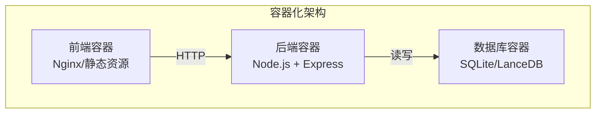
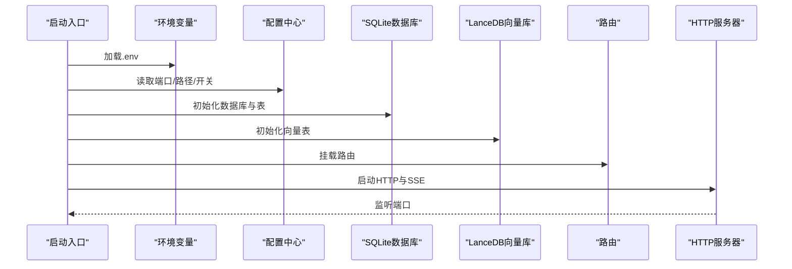
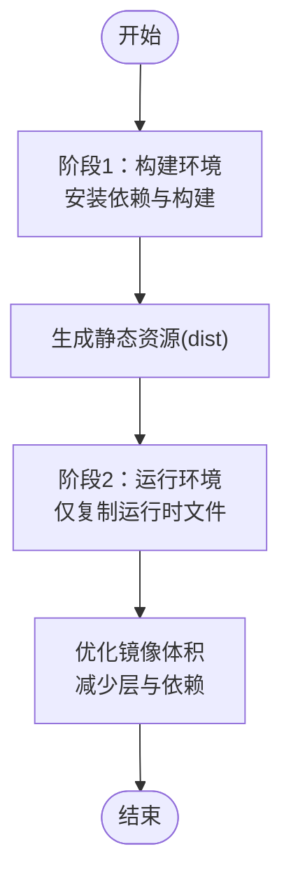
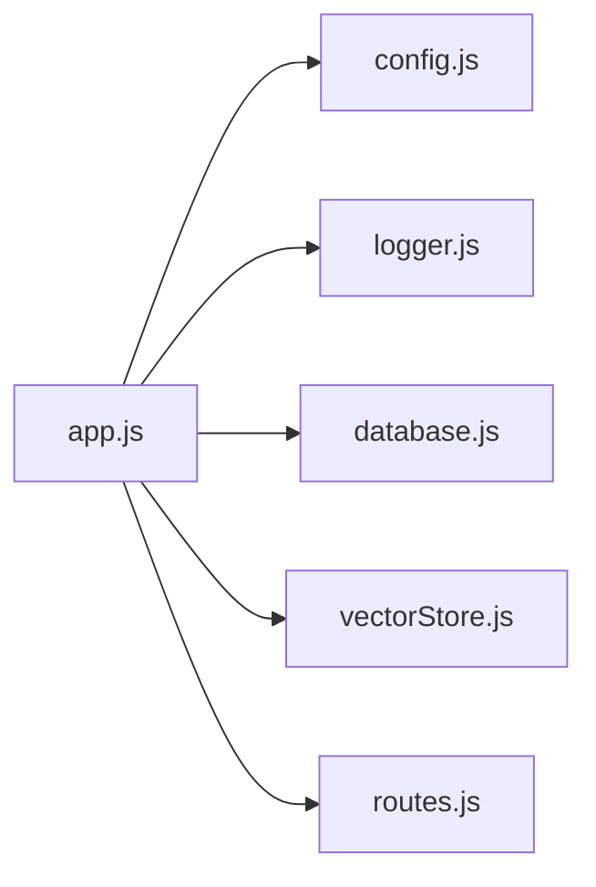

# 容器化部署

<cite>
**本文引用的文件**
- [backend/package.json](file://backend/package.json)
- [frontend/package.json](file://frontend/package.json)
- [backend/src/app.js](file://backend/src/app.js)
- [backend/src/core/config.js](file://backend/src/core/config.js)
- [backend/src/core/database.js](file://backend/src/core/database.js)
- [backend/src/memory/vectorStore.js](file://backend/src/memory/vectorStore.js)
- [backend/src/utils/logger.js](file://backend/src/utils/logger.js)
- [backend/src/core/route.js](file://backend/src/core/routes.js)
- [frontend/vite.config.js](file://frontend/vite.config.js)
</cite>

## 目录
1. [简介](#简介)
2. [项目结构](#项目结构)
3. [核心组件](#核心组件)
4. [架构概览](#架构概览)
5. [详细组件分析](#详细组件分析)
6. [依赖分析](#依赖分析)
7. [性能考虑](#性能考虑)
8. [故障排查指南](#故障排查指南)
9. [结论](#结论)
10. [附录](#附录)

## 简介
本文件面向NL2SQL项目的容器化部署，围绕后端服务、前端静态资源与数据库三部分，提供从Docker镜像构建到Docker Compose编排的完整实践指南。重点涵盖：
- 多阶段构建策略以优化镜像体积与安全基线
- Node.js运行时选择、依赖安装优化与静态资源处理
- 后端服务、前端服务与数据库容器的协调部署
- 生产环境容器配置最佳实践（资源限制、健康检查、日志）
- 容器网络、数据卷挂载与环境变量传递

## 项目结构
NL2SQL采用前后端分离架构：
- 后端：Node.js + Express，提供REST API、SSE流与内部模块（数据库、向量存储、日志、配置等）
- 前端：Vite构建的Vue应用，开发时通过代理访问后端API
- 数据：SQLite文件与LanceDB向量数据库目录，均位于后端数据目录中

**图表来源**
- [backend/src/app.js:1-260](file://backend/src/app.js#L1-L260)
- [frontend/vite.config.js:1-93](file://frontend/vite.config.js#L1-L93)

**章节来源**
- [backend/src/app.js:1-260](file://backend/src/app.js#L1-L260)
- [frontend/vite.config.js:1-93](file://frontend/vite.config.js#L1-L93)

## 核心组件
- 后端服务
  - 启动入口：加载环境变量、初始化数据库与向量存储、挂载路由、启动HTTP服务器与SSE
  - 配置中心：集中管理端口、数据库路径、向量数据库路径、LLM与评估开关等
  - 数据持久化：SQLite会话与查询历史；LanceDB向量表
  - 日志系统：统一控制台与文件输出、结构化日志与追踪能力
- 前端应用
  - Vite开发服务器与代理配置，开发时将/api转发至后端
  - 生产构建产物输出至dist目录，由静态Web服务器提供
- 数据与存储
  - SQLite数据库文件与LanceDB向量数据库目录需持久化挂载

**章节来源**
- [backend/src/app.js:1-260](file://backend/src/app.js#L1-L260)
- [backend/src/core/config.js:1-322](file://backend/src/core/config.js#L1-L322)
- [backend/src/core/database.js:1-859](file://backend/src/core/database.js#L1-L859)
- [backend/src/memory/vectorStore.js:1-881](file://backend/src/memory/vectorStore.js#L1-L881)
- [backend/src/utils/logger.js:1-442](file://backend/src/utils/logger.js#L1-L442)
- [frontend/vite.config.js:1-93](file://frontend/vite.config.js#L1-L93)

## 架构概览
后端服务启动流程与关键依赖如下：

**图表来源**
- [backend/src/app.js:1-260](file://backend/src/app.js#L1-L260)
- [backend/src/core/config.js:1-322](file://backend/src/core/config.js#L1-L322)
- [backend/src/core/database.js:1-859](file://backend/src/core/database.js#L1-L859)
- [backend/src/memory/vectorStore.js:1-881](file://backend/src/memory/vectorStore.js#L1-L881)
- [backend/src/core/routes.js:1-1037](file://backend/src/core/routes.js#L1-L1037)

## 详细组件分析

### 后端服务镜像构建策略
- 多阶段构建目标
  - 第一阶段：安装构建依赖，执行npm ci与构建（仅用于生成静态资源）
  - 第二阶段：仅复制必要运行时文件，缩小镜像体积并减少攻击面
- Node.js运行时选择
  - 基于官方Node.js镜像，遵循后端package.json中引擎要求（>=18）
- 依赖安装优化
  - 使用npm ci进行确定性安装，避免package-lock.json差异
  - 仅复制package.json与package-lock.json以利用缓存
- 静态资源处理
  - 前端构建产物输出至dist，后端通过静态中间件提供（若采用Nginx反向代理，可由Nginx直接提供）

[此图为概念性流程图，不直接映射具体源文件]

**章节来源**
- [backend/package.json:1-28](file://backend/package.json#L1-L28)
- [frontend/package.json:1-36](file://frontend/package.json#L1-L36)

### Dockerfile配置要点
- 基础镜像与Node版本
  - 选择满足后端引擎要求的Node.js版本
- 工作目录与文件复制
  - 复制package*.json后执行npm ci
  - 复制后端源码与前端源码
- 构建与产物
  - 前端执行构建脚本生成dist
  - 后端执行构建脚本（如适用）
- 运行时用户与权限
  - 使用非root用户运行，限制权限
- 健康检查与启动命令
  - 启动命令指向后端入口
  - 健康检查调用后端健康接口

[本节为通用配置说明，不直接分析具体源文件]

### Docker Compose编排
- 服务定义
  - 后端服务：暴露端口、挂载数据卷（SQLite/LanceDB）、传递环境变量
  - 前端服务：Nginx提供静态资源，配置反向代理至后端
  - 数据库容器：可选，若业务数据库为外部服务则无需
- 网络与数据卷
  - 使用自定义网络隔离服务
  - 数据卷挂载后端数据目录，确保持久化
- 环境变量
  - 通过env文件或compose变量传递端口、数据库URL、功能开关等

[本节为通用编排说明，不直接分析具体源文件]

### 生产环境容器配置最佳实践
- 资源限制
  - 限制CPU与内存，避免资源争用
- 健康检查
  - 使用HTTP健康检查探针，定期调用后端健康接口
- 日志配置
  - 启用结构化日志，输出到stdout/stderr，结合日志收集系统
- 安全加固
  - 非root用户运行、只读根文件系统、最小权限原则

**章节来源**
- [backend/src/utils/logger.js:1-442](file://backend/src/utils/logger.js#L1-L442)
- [backend/src/core/routes.js:1-1037](file://backend/src/core/routes.js#L1-L1037)

### 容器网络与数据卷
- 网络
  - 后端与前端在同一网络，前端通过服务名访问后端
- 数据卷
  - 挂载后端数据目录，包含SQLite数据库文件与LanceDB向量数据库目录
  - 建议将数据卷映射到宿主机持久化目录

**章节来源**
- [backend/src/core/config.js:1-322](file://backend/src/core/config.js#L1-L322)
- [backend/src/core/database.js:1-859](file://backend/src/core/database.js#L1-L859)
- [backend/src/memory/vectorStore.js:1-881](file://backend/src/memory/vectorStore.js#L1-L881)

### 环境变量传递
- 后端关键变量
  - 端口、运行环境、数据库路径、向量数据库路径、LLM与评估开关、日志级别与文件路径
- 前端代理
  - 开发时通过Vite代理将/api转发至后端，生产环境由Nginx或反向代理处理

**章节来源**
- [backend/src/core/config.js:1-322](file://backend/src/core/config.js#L1-L322)
- [frontend/vite.config.js:1-93](file://frontend/vite.config.js#L1-L93)

## 依赖分析
后端服务的关键依赖与启动顺序如下：

**图表来源**
- [backend/src/app.js:1-260](file://backend/src/app.js#L1-L260)
- [backend/src/core/config.js:1-322](file://backend/src/core/config.js#L1-L322)
- [backend/src/utils/logger.js:1-442](file://backend/src/utils/logger.js#L1-L442)
- [backend/src/core/database.js:1-859](file://backend/src/core/database.js#L1-L859)
- [backend/src/memory/vectorStore.js:1-881](file://backend/src/memory/vectorStore.js#L1-L881)
- [backend/src/core/routes.js:1-1037](file://backend/src/core/routes.js#L1-L1037)

**章节来源**
- [backend/src/app.js:1-260](file://backend/src/app.js#L1-L260)
- [backend/src/core/config.js:1-322](file://backend/src/core/config.js#L1-L322)
- [backend/src/utils/logger.js:1-442](file://backend/src/utils/logger.js#L1-L442)
- [backend/src/core/database.js:1-859](file://backend/src/core/database.js#L1-L859)
- [backend/src/memory/vectorStore.js:1-881](file://backend/src/memory/vectorStore.js#L1-L881)
- [backend/src/core/routes.js:1-1037](file://backend/src/core/routes.js#L1-L1037)

## 性能考虑
- 镜像体积优化
  - 多阶段构建、仅复制运行时必需文件、清理构建缓存
- 启动性能
  - 数据库与向量库初始化在启动阶段完成，建议合理设置延迟与重试
- 运行时性能
  - 合理设置Node.js堆内存上限，避免频繁GC
  - 使用连接池与合理的超时配置

[本节为通用指导，不直接分析具体源文件]

## 故障排查指南
- 健康检查失败
  - 检查后端健康接口响应，确认数据库与向量库初始化状态
- 日志定位
  - 查看结构化日志文件与控制台输出，结合追踪上下文定位问题
- 数据持久化
  - 确认数据卷挂载路径与权限，避免权限不足导致初始化失败

**章节来源**
- [backend/src/core/routes.js:1-1037](file://backend/src/core/routes.js#L1-L1037)
- [backend/src/utils/logger.js:1-442](file://backend/src/utils/logger.js#L1-L442)
- [backend/src/core/database.js:1-859](file://backend/src/core/database.js#L1-L859)
- [backend/src/memory/vectorStore.js:1-881](file://backend/src/memory/vectorStore.js#L1-L881)

## 结论
通过多阶段构建与合理的容器配置，NL2SQL可在保证功能完整性的同时显著优化镜像体积与运行效率。配合Compose编排与生产环境最佳实践，可实现稳定、可观测、易维护的容器化部署。

## 附录
- 关键配置项参考
  - 端口、运行环境、数据库路径、向量数据库路径、LLM与评估开关、日志级别与文件路径
- 前端构建与代理
  - Vite开发服务器端口与代理规则，生产构建产物输出目录

**章节来源**
- [backend/src/core/config.js:1-322](file://backend/src/core/config.js#L1-L322)
- [frontend/vite.config.js:1-93](file://frontend/vite.config.js#L1-L93)