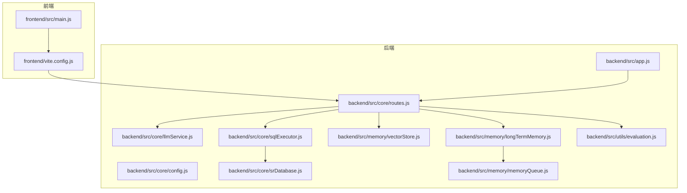
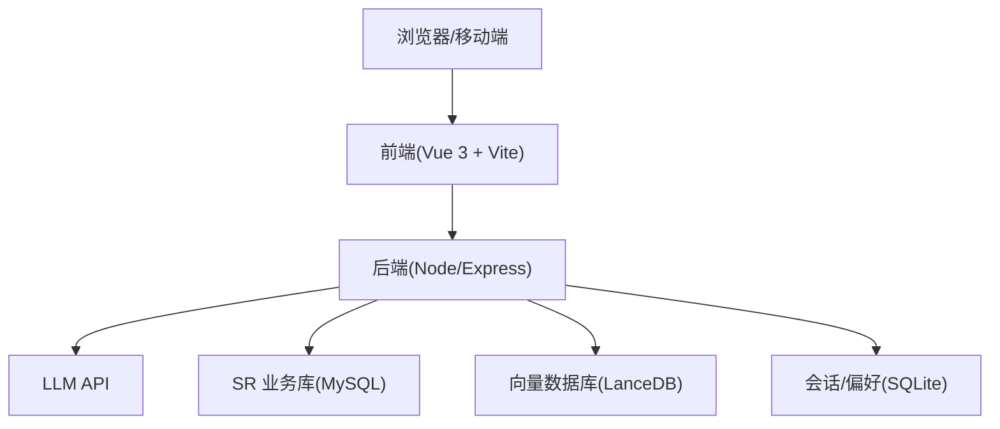
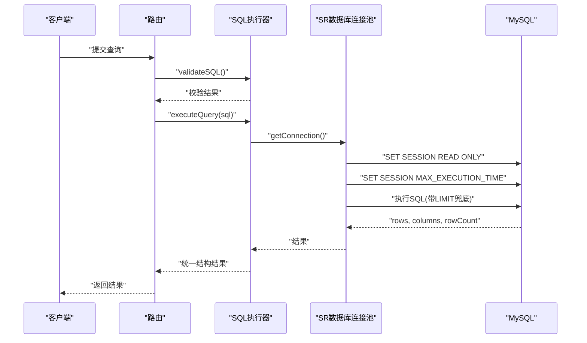
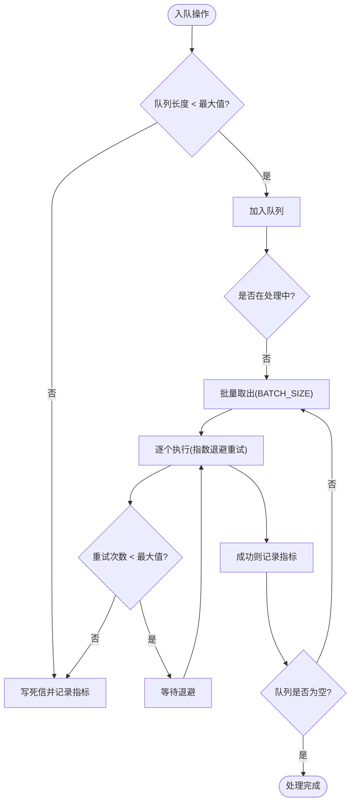
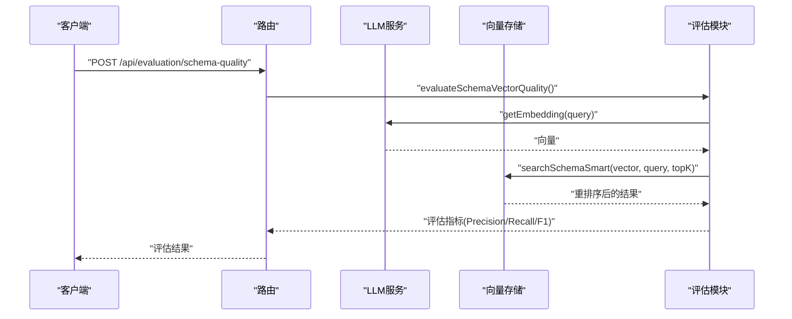
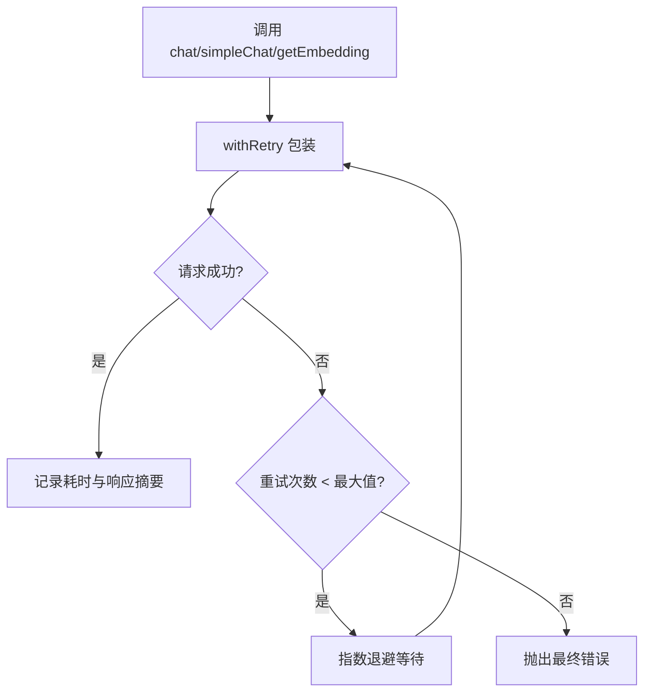
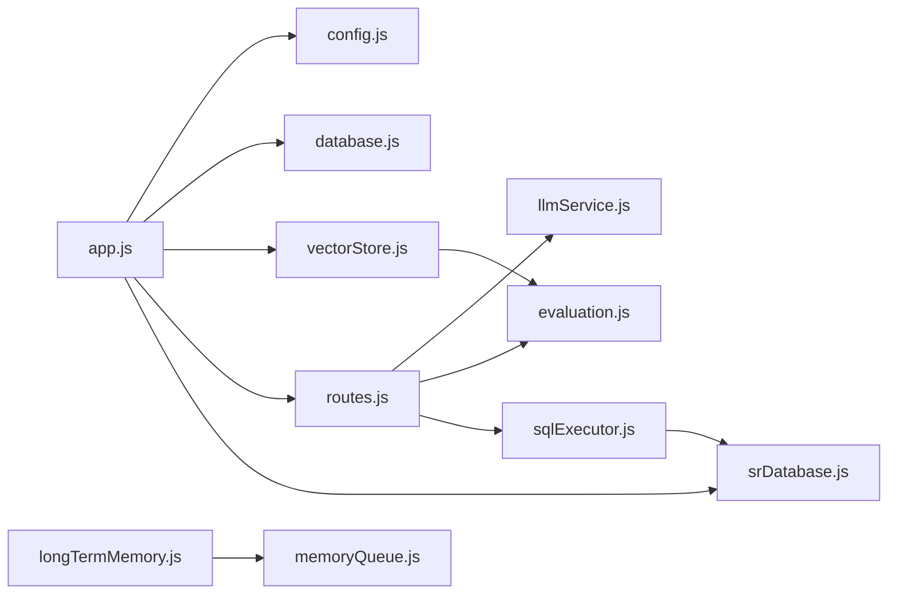

# 性能优化

<cite>
**本文档引用的文件**
- [backend/src/app.js](file://backend/src/app.js)
- [backend/package.json](file://backend/package.json)
- [backend/src/core/config.js](file://backend/src/core/config.js)
- [backend/src/core/routes.js](file://backend/src/core/routes.js)
- [backend/src/core/llmService.js](file://backend/src/core/llmService.js)
- [backend/src/core/sqlExecutor.js](file://backend/src/core/sqlExecutor.js)
- [backend/src/core/srDatabase.js](file://backend/src/core/srDatabase.js)
- [backend/src/memory/vectorStore.js](file://backend/src/memory/vectorStore.js)
- [backend/src/memory/longTermMemory.js](file://backend/src/memory/longTermMemory.js)
- [backend/src/memory/memoryQueue.js](file://backend/src/memory/memoryQueue.js)
- [backend/src/utils/evaluation.js](file://backend/src/utils/evaluation.js)
- [frontend/main.js](file://frontend/src/main.js)
- [frontend/vite.config.js](file://frontend/vite/config.js)
- [frontend/package.json](file://frontend/package.json)
</cite>

## 目录
1. [简介](#简介)
2. [项目结构](#项目结构)
3. [核心组件](#核心组件)
4. [架构总览](#架构总览)
5. [详细组件分析](#详细组件分析)
6. [依赖分析](#依赖分析)
7. [性能考虑](#性能考虑)
8. [故障排查指南](#故障排查指南)
9. [结论](#结论)
10. [附录](#附录)

## 简介
本文件面向系统架构师与高级工程师，围绕 NL2SQL 系统的性能优化展开，涵盖数据库查询优化、缓存策略、内存管理、向量数据库性能调优、LLM 服务性能优化、前端性能优化、容量规划与扩展策略，以及性能测试与基准测试方法论。目标是在保证功能正确性的前提下，最大化吞吐、降低延迟、提升稳定性与可运维性。

## 项目结构
后端采用 Express + Node.js，模块化清晰，核心职责分离：
- 启动与初始化：app.js 负责加载配置、初始化数据库与向量库、挂载路由、启动服务与优雅停机。
- 路由与接口：routes.js 提供健康检查、Schema 查询、会话与偏好管理、评估接口等。
- LLM 服务：llmService.js 封装 HTTP 请求、重试与超时、流式响应支持。
- 数据库执行：srDatabase.js/mysql2 连接池封装，只读会话与超时控制；sqlExecutor.js 安全校验与执行。
- 向量存储：vectorStore.js 基于 LanceDB 的 Schema/查询向量存储与检索。
- 长期记忆：longTermMemory.js 提取与存储用户偏好，memoryQueue.js 异步队列与重试。
- 评估：evaluation.js 提供向量化质量与命中率统计。

前端采用 Vue 3 + Vite，通过代理访问后端 API，构建时进行代码分割与第三方库拆分。

图表来源
- [backend/src/app.js:1-279](file://backend/src/app.js#L1-L279)
- [backend/src/core/routes.js:1-800](file://backend/src/core/routes.js#L1-L800)
- [backend/src/core/llmService.js:1-491](file://backend/src/core/llmService.js#L1-L491)
- [backend/src/core/srDatabase.js:1-156](file://backend/src/core/srDatabase.js#L1-L156)
- [backend/src/core/sqlExecutor.js:1-175](file://backend/src/core/sqlExecutor.js#L1-L175)
- [backend/src/memory/vectorStore.js:1-800](file://backend/src/memory/vectorStore.js#L1-L800)
- [backend/src/memory/longTermMemory.js:1-800](file://backend/src/memory/longTermMemory.js#L1-L800)
- [backend/src/memory/memoryQueue.js:1-293](file://backend/src/memory/memoryQueue.js#L1-L293)
- [backend/src/utils/evaluation.js:1-488](file://backend/src/utils/evaluation.js#L1-L488)
- [frontend/src/main.js:1-89](file://frontend/src/main.js#L1-L89)
- [frontend/vite.config.js:1-93](file://frontend/vite.config.js#L1-L93)

章节来源
- [backend/src/app.js:1-279](file://backend/src/app.js#L1-L279)
- [backend/src/core/config.js:1-439](file://backend/src/core/config.js#L1-L439)
- [backend/src/core/routes.js:1-800](file://backend/src/core/routes.js#L1-L800)
- [frontend/src/main.js:1-89](file://frontend/src/main.js#L1-L89)
- [frontend/vite.config.js:1-93](file://frontend/vite.config.js#L1-L93)

## 核心组件
- 配置中心：集中管理 LLM、Embedding、数据库、安全、日志、评估等配置，支持环境变量覆盖与校验。
- LLM 服务：封装 HTTP 请求、超时与重试、流式响应、日志脱敏与提示词摘要。
- SR 数据库连接池：只读会话、超时控制、LIMIT 补全、连接池参数。
- SQL 执行器：安全校验（白名单、前缀、LIMIT）、错误码标准化、结果脱敏与行数限制。
- 向量存储：Schema/查询向量表、智能搜索与重排序、统计记录。
- 长期记忆：偏好提取与存储、LLM 智能分析、异步队列与重试、死信处理。
- 评估模块：向量化质量评估、命中率统计、运行时统计与重置。

章节来源
- [backend/src/core/config.js:1-439](file://backend/src/core/config.js#L1-L439)
- [backend/src/core/llmService.js:1-491](file://backend/src/core/llmService.js#L1-L491)
- [backend/src/core/srDatabase.js:1-156](file://backend/src/core/srDatabase.js#L1-L156)
- [backend/src/core/sqlExecutor.js:1-175](file://backend/src/core/sqlExecutor.js#L1-L175)
- [backend/src/memory/vectorStore.js:1-800](file://backend/src/memory/vectorStore.js#L1-L800)
- [backend/src/memory/longTermMemory.js:1-800](file://backend/src/memory/longTermMemory.js#L1-L800)
- [backend/src/memory/memoryQueue.js:1-293](file://backend/src/memory/memoryQueue.js#L1-L293)
- [backend/src/utils/evaluation.js:1-488](file://backend/src/utils/evaluation.js#L1-L488)

## 架构总览
系统采用“前端 SPA + 后端 API + 数据库/向量库”的三层架构。前端通过代理访问后端，后端通过连接池访问真实业务库，向量库支撑语义检索与记忆系统。

图表来源
- [backend/src/app.js:1-279](file://backend/src/app.js#L1-L279)
- [backend/src/core/llmService.js:1-491](file://backend/src/core/llmService.js#L1-L491)
- [backend/src/core/srDatabase.js:1-156](file://backend/src/core/srDatabase.js#L1-L156)
- [backend/src/memory/vectorStore.js:1-800](file://backend/src/memory/vectorStore.js#L1-L800)
- [frontend/vite.config.js:1-93](file://frontend/vite.config.js#L1-L93)

## 详细组件分析

### 数据库查询优化（SR 数据库）
- 连接池参数：最大连接数、等待队列、空闲超时、事务只读，确保并发与稳定性。
- 超时控制：MySQL 会话级 MAX_EXECUTION_TIME 与 Node 层 query timeout 双重兜底。
- LIMIT 补全：执行前补全外层 LIMIT，避免大结果集回传与内存压力。
- 只读会话：SET SESSION TRANSACTION READ ONLY，避免误写风险。
- 错误码标准化：未配置/未就绪/执行错误等场景返回统一错误码，便于前端与监控处理。

图表来源
- [backend/src/core/sqlExecutor.js:72-169](file://backend/src/core/sqlExecutor.js#L72-L169)
- [backend/src/core/srDatabase.js:95-127](file://backend/src/core/srDatabase.js#L95-L127)

章节来源
- [backend/src/core/srDatabase.js:1-156](file://backend/src/core/srDatabase.js#L1-L156)
- [backend/src/core/sqlExecutor.js:1-175](file://backend/src/core/sqlExecutor.js#L1-L175)

### 缓存策略
- 配置缓存：Schema 元数据配置支持缓存与过期时间，减少频繁 IO。
- 会话缓存：会话历史与偏好在 SQLite 中持久化，结合内存统计与评估模块记录命中率。
- 向量检索缓存：向量搜索结果命中率统计用于指导索引与过滤策略优化。

章节来源
- [backend/src/core/config.js:281-291](file://backend/src/core/config.js#L281-L291)
- [backend/src/utils/evaluation.js:344-391](file://backend/src/utils/evaluation.js#L344-L391)

### 内存管理
- 长期记忆异步队列：memoryQueue.js 采用批量处理、指数退避重试、队列长度保护与死信持久化，避免阻塞主流程与 OOM。
- 结果脱敏与行数限制：sqlExecutor.js 控制返回行数与脱敏，降低内存占用与敏感信息泄露风险。
- 评估统计：evaluation.js 的运行时统计为非侵入式，失败不影响主流程。

图表来源
- [backend/src/memory/memoryQueue.js:66-215](file://backend/src/memory/memoryQueue.js#L66-L215)

章节来源
- [backend/src/memory/memoryQueue.js:1-293](file://backend/src/memory/memoryQueue.js#L1-L293)
- [backend/src/core/sqlExecutor.js:118-135](file://backend/src/core/sqlExecutor.js#L118-L135)
- [backend/src/utils/evaluation.js:71-122](file://backend/src/utils/evaluation.js#L71-L122)

### 向量数据库性能调优（LanceDB）
- 初始化与表结构：首次启动自动创建 schema_vectors 与 query_vectors 表，避免运行时开销。
- 智能搜索与重排序：searchSchemaSmart 基于查询意图识别与表作用域子类型进行优先级重排，降低无关表的检索成本。
- 元数据过滤：支持按 scope/data_type/exclude_data_type 过滤，减少结果集与应用层二次过滤。
- 统计记录：recordVectorSearch 记录命中率与距离分布，指导阈值与 topK 调优。
- 评估接口：evaluateSchemaVectorQuality 与 evaluateQueryVectorQuality 提供离线评估能力。

图表来源
- [backend/src/utils/evaluation.js:158-266](file://backend/src/utils/evaluation.js#L158-L266)
- [backend/src/memory/vectorStore.js:454-578](file://backend/src/memory/vectorStore.js#L454-L578)

章节来源
- [backend/src/memory/vectorStore.js:1-800](file://backend/src/memory/vectorStore.js#L1-L800)
- [backend/src/utils/evaluation.js:1-488](file://backend/src/utils/evaluation.js#L1-L488)

### LLM 服务性能优化
- 超时与重试：withRetry 提供最大重试次数与指数退避，避免瞬时故障放大。
- 流式响应：chat 支持流式响应，结合 SSE 提升交互体验。
- 超时控制：LLM/Embedding 分别配置独立超时，避免长尾请求拖累。
- 日志脱敏：safeLog 控制提示词日志输出，兼顾可观测性与安全。
- 资源限制：通过配置项限制请求体大小、消息数量等，防止资源滥用。

图表来源
- [backend/src/core/llmService.js:169-197](file://backend/src/core/llmService.js#L169-L197)
- [backend/src/core/llmService.js:224-322](file://backend/src/core/llmService.js#L224-L322)

章节来源
- [backend/src/core/llmService.js:1-491](file://backend/src/core/llmService.js#L1-L491)
- [backend/src/core/config.js:64-94](file://backend/src/core/config.js#L64-L94)

### 前端性能优化
- 代码分割：第三方库（Element Plus、ECharts、Vue 生态）独立打包，提升缓存命中与并行加载。
- 路径别名：统一 @/@components/@views 等别名，便于模块化与 Tree-shaking。
- 构建优化：关闭 source map（生产环境），减少体积与调试信息。
- 代理配置：开发环境代理后端，避免跨域与本地联调成本。
- UI 组件：Element Plus 按需引入与主题变量，减少冗余样式。

章节来源
- [frontend/vite.config.js:72-91](file://frontend/vite.config.js#L72-L91)
- [frontend/src/main.js:1-89](file://frontend/src/main.js#L1-L89)
- [frontend/package.json:1-36](file://frontend/package.json#L1-L36)

### 容量规划与扩展策略
- 水平扩展：多副本部署 + 负载均衡，后端通过连接池与队列隔离热点。
- 垂直扩展：提升 CPU/内存与磁盘 IOPS，优化向量库与数据库参数。
- 负载分担：将评估与记忆异步化，避免热路径阻塞；利用队列背压与死信保障。
- 监控与告警：健康检查接口、评估统计、慢查询阈值、连接池状态。

章节来源
- [backend/src/core/config.js:263-272](file://backend/src/core/config.js#L263-L272)
- [backend/src/core/routes.js:74-139](file://backend/src/core/routes.js#L74-L139)
- [backend/src/memory/memoryQueue.js:32-47](file://backend/src/memory/memoryQueue.js#L32-L47)

## 依赖分析
后端依赖关系清晰，核心模块职责单一：
- app.js 依赖 config、database、vectorStore、routes、selfRepair。
- routes.js 依赖 config、database、sseHandler、evaluation、requestContext、schemaLoader。
- llmService.js 依赖 config、logger、safeLog。
- srDatabase.js 依赖 config、logger、sqlLimit。
- sqlExecutor.js 依赖 config、schemaLoader、srDatabase、maskResult。
- vectorStore.js 依赖 config、logger、evaluation、crypto、tableScope。
- longTermMemory.js 依赖 database、llmService、config、evaluation、memoryQueue。
- memoryQueue.js 依赖 database、logger。
- evaluation.js 依赖 config、logger。

图表来源
- [backend/src/app.js:1-279](file://backend/src/app.js#L1-L279)
- [backend/src/core/routes.js:1-800](file://backend/src/core/routes.js#L1-L800)
- [backend/src/core/llmService.js:1-491](file://backend/src/core/llmService.js#L1-L491)
- [backend/src/core/sqlExecutor.js:1-175](file://backend/src/core/sqlExecutor.js#L1-L175)
- [backend/src/core/srDatabase.js:1-156](file://backend/src/core/srDatabase.js#L1-L156)
- [backend/src/memory/vectorStore.js:1-800](file://backend/src/memory/vectorStore.js#L1-L800)
- [backend/src/memory/longTermMemory.js:1-800](file://backend/src/memory/longTermMemory.js#L1-L800)
- [backend/src/memory/memoryQueue.js:1-293](file://backend/src/memory/memoryQueue.js#L1-L293)
- [backend/src/utils/evaluation.js:1-488](file://backend/src/utils/evaluation.js#L1-L488)

章节来源
- [backend/package.json:16-28](file://backend/package.json#L16-L28)
- [frontend/package.json:11-29](file://frontend/package.json#L11-L29)

## 性能考虑
- 吞吐与延迟
  - 后端：连接池参数、LIMIT 兜底、只读会话、超时控制、异步队列。
  - 前端：代码分割、按需加载、代理与缓存。
  - 向量库：topK、过滤条件、智能重排序、统计驱动的阈值调优。
- 资源限制
  - 配置项：最大连接数、查询超时、最大行数、请求体大小、日志级别。
  - 队列保护：最大队列长度、退避重试、死信持久化。
- 可观测性
  - 健康检查、评估统计、慢查询阈值、错误码与指标导出。

章节来源
- [backend/src/core/config.js:122-143](file://backend/src/core/config.js#L122-L143)
- [backend/src/memory/memoryQueue.js:32-47](file://backend/src/memory/memoryQueue.js#L32-L47)
- [backend/src/core/routes.js:74-139](file://backend/src/core/routes.js#L74-L139)

## 故障排查指南
- 启动失败
  - 检查配置校验：LLM API Key、SR 数据库 URL 是否有效。
  - 查看优雅停机日志：数据库关闭、连接池关闭、SSE 断开。
- LLM 调用失败
  - 检查超时与重试：withRetry 配置、网络代理、API 响应格式。
  - 查看日志脱敏：safeLog 配置影响提示词输出。
- 数据库执行失败
  - 检查连接池状态：initialize 是否成功、isReady()。
  - 校验 SQL：validateSQL 白名单、前缀、LIMIT。
  - 结果脱敏与行数限制：maskResult 与 maxRows。
- 向量检索异常
  - 检查向量库初始化：schema/query 表是否存在。
  - 评估统计：recordVectorSearch 与 getVectorSearchStats。
- 长期记忆存储失败
  - 查看队列状态与指标：enqueueMemoryStore、getQueueMetrics。
  - 死信持久化：addMemoryFailedOperation。

章节来源
- [backend/src/app.js:198-271](file://backend/src/app.js#L198-L271)
- [backend/src/core/config.js:407-429](file://backend/src/core/config.js#L407-L429)
- [backend/src/core/llmService.js:169-197](file://backend/src/core/llmService.js#L169-L197)
- [backend/src/core/srDatabase.js:42-86](file://backend/src/core/srDatabase.js#L42-L86)
- [backend/src/core/sqlExecutor.js:34-66](file://backend/src/core/sqlExecutor.js#L34-L66)
- [backend/src/memory/vectorStore.js:235-265](file://backend/src/memory/vectorStore.js#L235-L265)
- [backend/src/memory/memoryQueue.js:154-215](file://backend/src/memory/memoryQueue.js#L154-L215)

## 结论
通过连接池与只读会话、LIMIT 兜底与超时控制，系统在数据库层面实现了稳健的性能基线；通过异步队列与死信保障，长期记忆不会成为性能瓶颈；向量检索的智能重排序与统计驱动的阈值优化，显著提升了检索效率与准确性；前端的代码分割与代理配置进一步降低了冷启动与跨域成本。配合评估模块与健康检查，形成闭环的性能治理体系。

## 附录
- 性能测试与基准测试方法论
  - 基准测试：固定测试集（如 DEFAULT_SCHEMA_TEST_QUERIES）评估向量化质量，记录 Precision/Recall/F1。
  - 压力测试：逐步提升并发与数据规模，观察延迟、吞吐、错误率与资源使用。
  - A/B 实验：对比不同 topK、过滤策略、重排序权重对命中率与延迟的影响。
  - 运行时评估：定期调用 /api/evaluation/stats 获取命中率与距离分布，指导阈值调整。
  - 健康检查：定期调用 /api/health 与 /api/health/detail，监控组件状态与内存使用。

章节来源
- [backend/src/utils/evaluation.js:439-459](file://backend/src/utils/evaluation.js#L439-L459)
- [backend/src/core/routes.js:74-139](file://backend/src/core/routes.js#L74-L139)