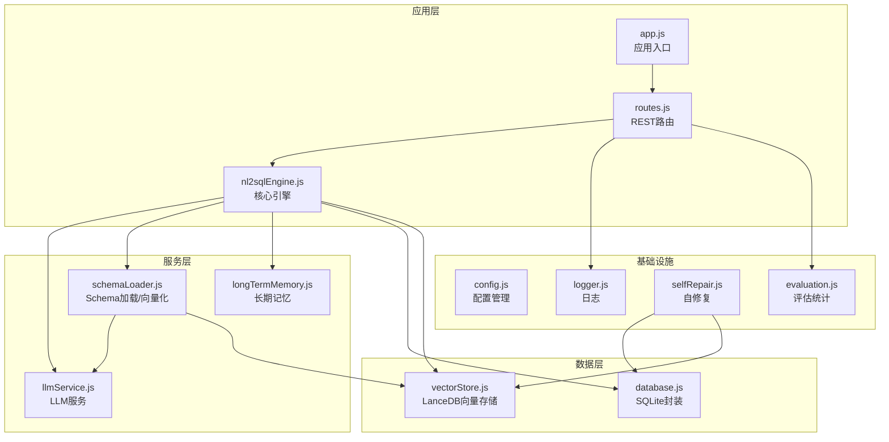
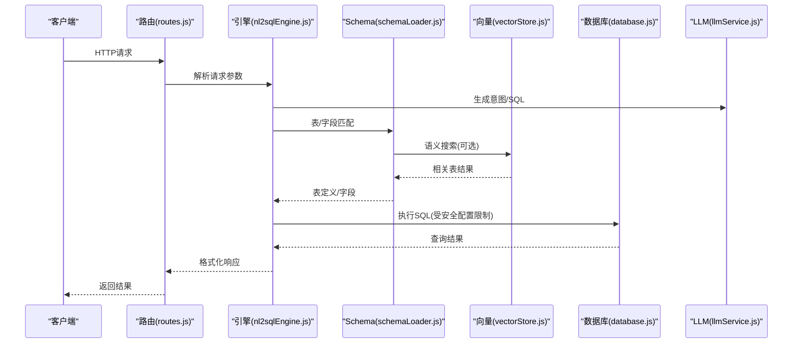
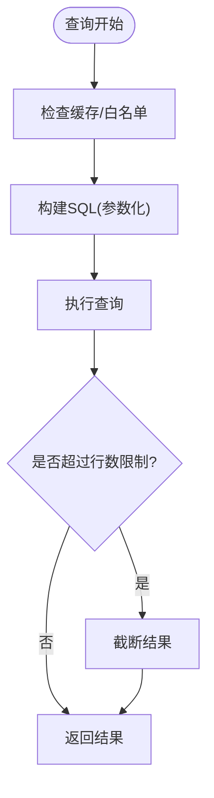
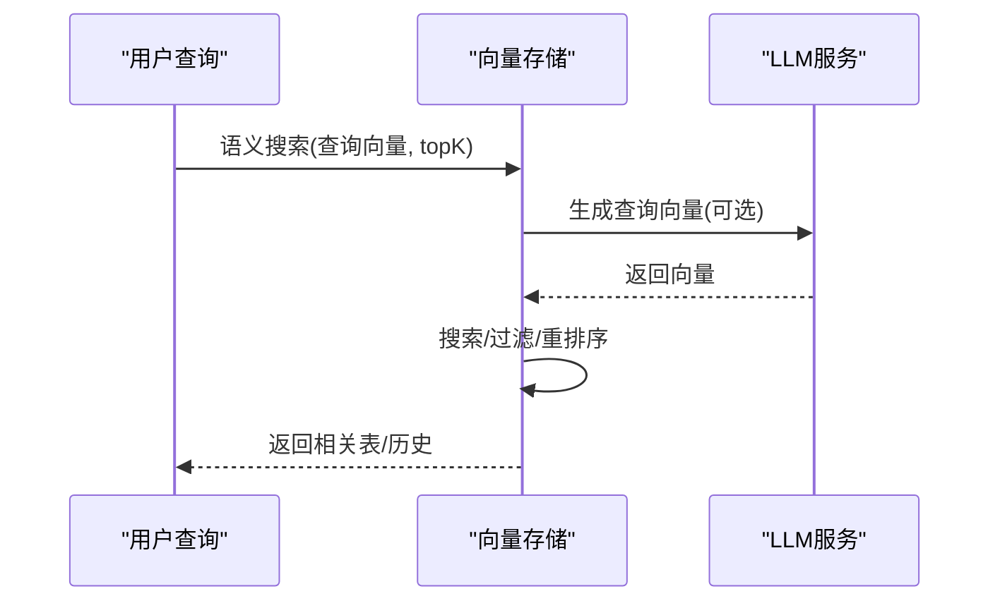
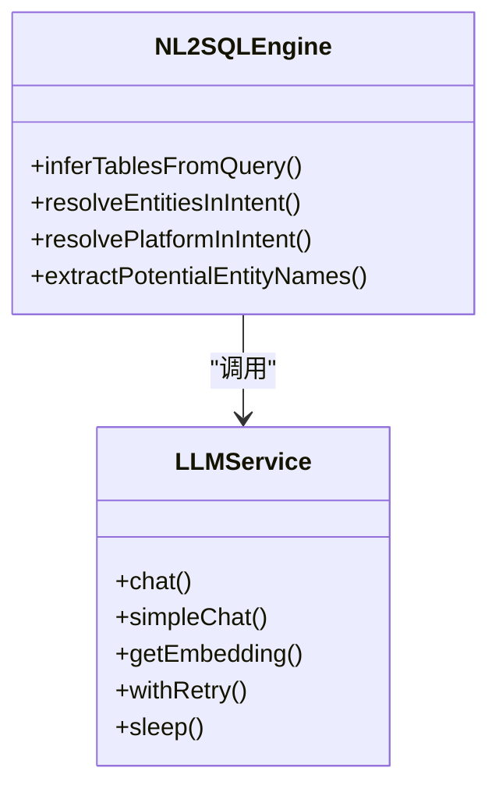
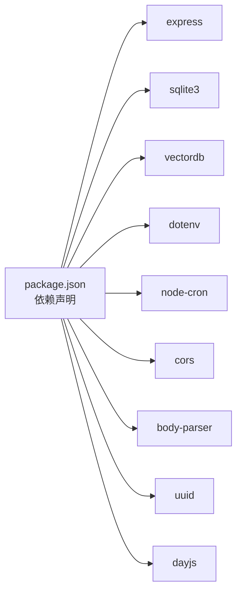

# 性能调优

<cite>
**本文档引用的文件**
- [app.js](file://backend/src/app.js)
- [config.js](file://backend/src/core/config.js)
- [database.js](file://backend/src/core/database.js)
- [vectorStore.js](file://backend/src/memory/vectorStore.js)
- [routes.js](file://backend/src/core/routes.js)
- [logger.js](file://backend/src/utils/logger.js)
- [selfRepair.js](file://backend/src/core/selfRepair.js)
- [evaluation.js](file://backend/src/utils/evaluation.js)
- [business-semantic-layer.json](file://backend/config/business-semantic-layer.json)
- [nl2sqlEngine.js](file://backend/src/core/nl2sqlEngine.js)
- [llmService.js](file://backend/src/core/llmService.js)
- [schemaLoader.js](file://backend/src/core/schemaLoader.js)
- [longTermMemory.js](file://backend/src/memory/longTermMemory.js)
- [package.json](file://backend/package.json)
</cite>

## 目录
1. [简介](#简介)
2. [项目结构](#项目结构)
3. [核心组件](#核心组件)
4. [架构概览](#架构概览)
5. [详细组件分析](#详细组件分析)
6. [依赖分析](#依赖分析)
7. [性能考虑](#性能考虑)
8. [故障排查指南](#故障排查指南)
9. [结论](#结论)
10. [附录](#附录)

## 简介
本技术指南面向NL2SQL系统的性能调优，聚焦CPU使用率、内存占用、数据库查询性能、网络延迟等关键指标。文档基于代码库的实际实现，提供从代码层面、数据库查询、缓存策略、并发处理到资源配置、监控与容量规划的系统性优化建议，并包含性能测试方法与基准分析思路。

## 项目结构
后端采用Node.js + Express架构，核心模块包括：
- 应用入口与初始化：app.js
- 配置管理：config.js
- 数据库层：SQLite + 自定义ORM封装（database.js）
- 向量数据库层：LanceDB（vectorStore.js）
- API路由：routes.js
- 日志与监控：logger.js、selfRepair.js、evaluation.js
- 核心引擎：nl2sqlEngine.js
- LLM服务：llmService.js
- Schema加载与向量化：schemaLoader.js
- 长期记忆：longTermMemory.js
- 业务语义层配置：business-semantic-layer.json

**图表来源**
- [app.js:1-266](file://backend/src/app.js#L1-L266)
- [routes.js:1-800](file://backend/src/core/routes.js#L1-L800)
- [nl2sqlEngine.js:1-800](file://backend/src/core/nl2sqlEngine.js#L1-L800)
- [llmService.js:1-477](file://backend/src/core/llmService.js#L1-L477)
- [schemaLoader.js:1-800](file://backend/src/core/schemaLoader.js#L1-L800)
- [longTermMemory.js:1-800](file://backend/src/memory/longTermMemory.js#L1-L800)
- [database.js:1-800](file://backend/src/core/database.js#L1-L800)
- [vectorStore.js:1-800](file://backend/src/memory/vectorStore.js#L1-L800)
- [config.js:1-398](file://backend/src/core/config.js#L1-L398)
- [logger.js:1-482](file://backend/src/utils/logger.js#L1-L482)
- [selfRepair.js:1-489](file://backend/src/core/selfRepair.js#L1-L489)
- [evaluation.js:1-488](file://backend/src/utils/evaluation.js#L1-L488)

**章节来源**
- [app.js:1-266](file://backend/src/app.js#L1-L266)
- [package.json:1-28](file://backend/package.json#L1-L28)

## 核心组件
- 配置中心：集中管理LLM、数据库、向量数据库、安全、会话、日志、自修复、Schema、长期记忆、上下文管理、评估等配置项，支持环境变量覆盖与默认值。
- 数据库层：SQLite封装，提供连接、事务、迁移、索引、查询等能力；支持外键约束与结构化日志。
- 向量存储：基于LanceDB，提供Schema向量与查询历史向量的增删改查、智能搜索与重排序、统计与评估。
- API路由：健康检查、Schema查询、会话管理、查询历史、偏好管理、评估接口等。
- 日志与监控：统一日志格式、文件轮转、结构化日志、trace追踪、系统统计、自修复健康检查。
- 核心引擎：意图识别、实体解析、SQL生成、验证、澄清机制、对话摘要、长期记忆提取与存储。
- LLM服务：HTTP请求封装、重试机制、超时控制、流式响应、Embedding向量生成。
- Schema加载：Schema元数据加载、缓存、关键词匹配、语义向量化、智能搜索与过滤。
- 长期记忆：偏好提取、存储、异步队列、LLM智能分析、筛选阈值与保留策略。

**章节来源**
- [config.js:1-398](file://backend/src/core/config.js#L1-L398)
- [database.js:1-800](file://backend/src/core/database.js#L1-L800)
- [vectorStore.js:1-800](file://backend/src/memory/vectorStore.js#L1-L800)
- [routes.js:1-800](file://backend/src/core/routes.js#L1-L800)
- [logger.js:1-482](file://backend/src/utils/logger.js#L1-L482)
- [selfRepair.js:1-489](file://backend/src/core/selfRepair.js#L1-L489)
- [evaluation.js:1-488](file://backend/src/utils/evaluation.js#L1-L488)
- [nl2sqlEngine.js:1-800](file://backend/src/core/nl2sqlEngine.js#L1-L800)
- [llmService.js:1-477](file://backend/src/core/llmService.js#L1-L477)
- [schemaLoader.js:1-800](file://backend/src/core/schemaLoader.js#L1-L800)
- [longTermMemory.js:1-800](file://backend/src/memory/longTermMemory.js#L1-L800)

## 架构概览
NL2SQL系统采用分层架构，核心链路如下：
- 请求进入Express路由，经过日志与评估统计，进入NL2SQL引擎。
- 引擎调用LLM服务生成意图与SQL，调用Schema加载模块进行表/字段匹配，调用向量存储进行语义检索，调用数据库层执行SQL。
- 长期记忆模块异步提取与存储用户偏好，自修复模块定期执行健康检查与维护任务。

**图表来源**
- [routes.js:1-800](file://backend/src/core/routes.js#L1-L800)
- [nl2sqlEngine.js:1-800](file://backend/src/core/nl2sqlEngine.js#L1-L800)
- [schemaLoader.js:1-800](file://backend/src/core/schemaLoader.js#L1-L800)
- [vectorStore.js:1-800](file://backend/src/memory/vectorStore.js#L1-L800)
- [database.js:1-800](file://backend/src/core/database.js#L1-L800)
- [llmService.js:1-477](file://backend/src/core/llmService.js#L1-L477)

## 详细组件分析

### 配置管理与性能参数
- LLM与Embedding超时、重试、模型选择影响网络延迟与吞吐。
- 数据库连接池参数（最小/最大连接、获取超时、空闲超时）影响并发与资源占用。
- 安全配置（白名单、行数限制、查询超时、禁止关键字）保障稳定性。
- 日志级别、文件轮转、追踪上下文容量与清理策略影响I/O与内存。
- 自修复与统计收集周期影响后台任务开销。
- Schema缓存与向量化开关、长期记忆阈值与保留策略影响内存与CPU。

**章节来源**
- [config.js:1-398](file://backend/src/core/config.js#L1-L398)

### 数据库层性能分析
- SQLite封装提供连接、事务、迁移、索引、查询与结构化日志。
- 外键约束启用与索引设计（sessions、messages、query_history、user_preferences）直接影响查询性能。
- 事务封装保证一致性，适合批量写入与维护任务。
- 建议：针对高频查询建立复合索引，合理使用LIMIT，避免全表扫描；对大结果集进行分页与行数限制。

**图表来源**
- [database.js:1-800](file://backend/src/core/database.js#L1-L800)
- [routes.js:1-800](file://backend/src/core/routes.js#L1-L800)
- [config.js:1-398](file://backend/src/core/config.js#L1-L398)

**章节来源**
- [database.js:1-800](file://backend/src/core/database.js#L1-L800)
- [routes.js:1-800](file://backend/src/core/routes.js#L1-L800)

### 向量存储与语义检索
- LanceDB提供表级向量存储与智能搜索，支持过滤与重排序。
- 智能搜索结合查询意图识别（游戏名、平台类型）与元数据标签（scope、data_type）提升召回质量。
- 增量更新策略减少重复向量化成本。
- 建议：合理设置topK、过滤条件与重排序权重；监控向量统计与命中率。

**图表来源**
- [vectorStore.js:1-800](file://backend/src/memory/vectorStore.js#L1-L800)
- [llmService.js:1-477](file://backend/src/core/llmService.js#L1-L477)

**章节来源**
- [vectorStore.js:1-800](file://backend/src/memory/vectorStore.js#L1-L800)
- [schemaLoader.js:1-800](file://backend/src/core/schemaLoader.js#L1-L800)

### 核心引擎与LLM服务
- 引擎负责意图识别、实体解析、SQL生成、验证与澄清机制。
- LLM服务封装HTTP请求、重试与超时，支持流式响应与Embedding生成。
- 性能关键点：消息长度控制、重试策略、超时设置、工具函数定义。

**图表来源**
- [nl2sqlEngine.js:1-800](file://backend/src/core/nl2sqlEngine.js#L1-L800)
- [llmService.js:1-477](file://backend/src/core/llmService.js#L1-L477)

**章节来源**
- [nl2sqlEngine.js:1-800](file://backend/src/core/nl2sqlEngine.js#L1-L800)
- [llmService.js:1-477](file://backend/src/core/llmService.js#L1-L477)

### 长期记忆与偏好提取
- 偏好类型：查询模式、字段别名、指标偏好、维度偏好。
- 存储阈值：置信度、维度/指标数量、近期频率、是否过于具体。
- 异步队列与内存压缩降低主线程压力。
- 建议：根据业务语义层配置优化别名学习与过滤逻辑。

**章节来源**
- [longTermMemory.js:1-800](file://backend/src/memory/longTermMemory.js#L1-L800)
- [business-semantic-layer.json:1-189](file://backend/config/business-semantic-layer.json#L1-L189)

### 日志、监控与自修复
- 日志模块支持结构化输出、文件轮转、trace追踪与上下文清理。
- 自修复模块执行每日健康检查、会话清理、统计收集与记忆维护。
- 评估模块记录向量检索命中率与长期记忆命中率，支持重置与报告。

**章节来源**
- [logger.js:1-482](file://backend/src/utils/logger.js#L1-L482)
- [selfRepair.js:1-489](file://backend/src/core/selfRepair.js#L1-L489)
- [evaluation.js:1-488](file://backend/src/utils/evaluation.js#L1-L488)

## 依赖分析
- Express提供HTTP服务与路由；CORS与body-parser中间件处理跨域与请求体解析。
- SQLite3用于本地数据库；vectordb用于向量存储；node-cron用于定时任务。
- dotenv加载环境变量；uuid/dayjs用于标识与时间处理。

**图表来源**
- [package.json:1-28](file://backend/package.json#L1-L28)

**章节来源**
- [package.json:1-28](file://backend/package.json#L1-L28)

## 性能考虑

### CPU使用率优化
- 控制LLM请求规模与温度参数，减少不必要的流式响应。
- 合理设置向量搜索topK与过滤条件，避免过度重排序。
- 优化Schema匹配算法，优先使用缓存与关键词匹配，语义搜索作为回退。
- 长期记忆异步存储与队列处理，避免阻塞主线程。

**章节来源**
- [llmService.js:1-477](file://backend/src/core/llmService.js#L1-L477)
- [schemaLoader.js:1-800](file://backend/src/core/schemaLoader.js#L1-L800)
- [longTermMemory.js:1-800](file://backend/src/memory/longTermMemory.js#L1-L800)

### 内存占用优化
- 日志轮转与trace上下文容量限制，避免内存泄漏。
- SQLite连接池参数与事务批量写入，减少频繁连接开销。
- 向量存储增量更新与统计上报，避免重复向量化。
- 评估统计内存中缓存，支持重置与低频记录。

**章节来源**
- [logger.js:1-482](file://backend/src/utils/logger.js#L1-L482)
- [database.js:1-800](file://backend/src/core/database.js#L1-L800)
- [vectorStore.js:1-800](file://backend/src/memory/vectorStore.js#L1-L800)
- [evaluation.js:1-488](file://backend/src/utils/evaluation.js#L1-L488)

### 数据库查询性能
- 建立必要索引（sessions.user_id、messages.session_id、query_history.user_id等）。
- 使用参数化查询与LIMIT限制，避免全表扫描与大结果集。
- 事务批量写入，减少锁竞争。
- 白名单与禁止关键字过滤，减少无效查询。

**章节来源**
- [database.js:1-800](file://backend/src/core/database.js#L1-L800)
- [routes.js:1-800](file://backend/src/core/routes.js#L1-L800)
- [config.js:1-398](file://backend/src/core/config.js#L1-L398)

### 网络延迟优化
- LLM与Embedding超时与重试策略，避免请求挂起。
- 代理/网关层的连接复用与超时设置。
- 语义搜索与向量生成的批处理与缓存。

**章节来源**
- [llmService.js:1-477](file://backend/src/core/llmService.js#L1-L477)
- [config.js:1-398](file://backend/src/core/config.js#L1-L398)

### 缓存策略优化
- Schema元数据缓存与向量化缓存，支持强制重新向量化。
- 长期记忆阈值与保留策略，平衡内存与命中率。
- 评估统计的运行时缓存与重置接口。

**章节来源**
- [schemaLoader.js:1-800](file://backend/src/core/schemaLoader.js#L1-L800)
- [longTermMemory.js:1-800](file://backend/src/memory/longTermMemory.js#L1-L800)
- [evaluation.js:1-488](file://backend/src/utils/evaluation.js#L1-L488)

### 并发处理优化
- Express中间件顺序与错误处理，避免未捕获异常导致进程退出。
- 自修复模块定时任务与资源清理，防止后台任务堆积。
- SSE连接统计与优雅关闭，确保平滑停机。

**章节来源**
- [app.js:1-266](file://backend/src/app.js#L1-L266)
- [selfRepair.js:1-489](file://backend/src/core/selfRepair.js#L1-L489)
- [routes.js:1-800](file://backend/src/core/routes.js#L1-L800)

### 资源配置调整
- JVM参数：Node.js使用V8引擎，可通过NODE_OPTIONS设置内存上限与GC参数（如--max_old_space_size）。
- 数据库连接池：根据并发与查询复杂度调整min/max、acquireTimeout、idleTimeout。
- 向量数据库参数：LanceDB路径、表结构与增量更新策略。
- LLM与Embedding：模型选择、维度、超时与重试次数。

**章节来源**
- [config.js:1-398](file://backend/src/core/config.js#L1-L398)
- [package.json:1-28](file://backend/package.json#L1-L28)

### 性能监控与工具
- 健康检查接口：/api/health与/api/health/detail，包含内存、数据库、LLM、Schema、SSE连接状态。
- 评估接口：/api/evaluation/stats与重置接口，监控向量检索命中率与长期记忆命中率。
- 日志与trace：结构化日志、文件轮转、trace上下文清理。
- 自修复：每日检查、会话清理、统计收集、记忆维护。

**章节来源**
- [routes.js:1-800](file://backend/src/core/routes.js#L1-L800)
- [evaluation.js:1-488](file://backend/src/utils/evaluation.js#L1-L488)
- [logger.js:1-482](file://backend/src/utils/logger.js#L1-L482)
- [selfRepair.js:1-489](file://backend/src/core/selfRepair.js#L1-L489)

### 容量规划与扩展
- 基于查询量与并发峰值估算CPU、内存、磁盘与网络带宽需求。
- 水平扩展：多实例部署，结合负载均衡与会话粘性策略。
- 垂直扩展：提升硬件规格，优化数据库与向量存储配置。
- 异步处理：长期记忆与评估统计异步化，减少请求延迟。

**章节来源**
- [selfRepair.js:1-489](file://backend/src/core/selfRepair.js#L1-L489)
- [longTermMemory.js:1-800](file://backend/src/memory/longTermMemory.js#L1-L800)

### 负载均衡配置
- 建议：基于IP或会话ID的粘性会话，确保SSE连接与会话状态一致性。
- 健康检查：使用/health接口，定期探测实例状态。
- 熔断与限流：在网关层配置超时与重试策略，避免雪崩效应。

**章节来源**
- [routes.js:1-800](file://backend/src/core/routes.js#L1-L800)

### 性能测试与基准分析
- 基准测试：构造典型查询（注册、登录、付费、活跃、留存、聊天、创角、等级、任务、商店等），测量响应时间、吞吐量与错误率。
- 压力测试：逐步提升并发与数据量，观察CPU、内存、数据库连接与网络延迟的变化。
- 回归测试：在每次变更后运行基准测试，确保性能不退化。
- 指标采集：结合健康检查与评估接口，持续监控命中率与系统状态。

**章节来源**
- [evaluation.js:1-488](file://backend/src/utils/evaluation.js#L1-L488)
- [routes.js:1-800](file://backend/src/core/routes.js#L1-L800)

## 故障排查指南
- 未捕获异常与Promise拒绝：检查日志与优雅关闭流程，定位异常源头。
- 数据库连接失败：检查路径、权限与外键约束启用状态。
- 向量数据库未初始化：确认LanceDB路径与表结构，检查初始化日志。
- LLM API超时/重试：调整超时与重试参数，检查API密钥与基础URL。
- 查询失败率过高：检查白名单、禁止关键字与查询超时配置。
- 内存使用率过高：检查日志轮转与trace上下文清理，优化批量写入与缓存策略。

**章节来源**
- [app.js:1-266](file://backend/src/app.js#L1-L266)
- [database.js:1-800](file://backend/src/core/database.js#L1-L800)
- [vectorStore.js:1-800](file://backend/src/memory/vectorStore.js#L1-L800)
- [llmService.js:1-477](file://backend/src/core/llmService.js#L1-L477)
- [selfRepair.js:1-489](file://backend/src/core/selfRepair.js#L1-L489)

## 结论
NL2SQL系统的性能优化需要从配置、数据库、向量检索、LLM服务、日志监控与自修复等多个维度协同推进。通过合理的资源配置、缓存策略、并发处理与容量规划，结合持续的性能测试与监控，可显著提升系统稳定性与用户体验。

## 附录
- 关键配置项参考：LLM与Embedding超时/重试、数据库连接池、安全白名单与行数限制、日志级别与轮转、自修复周期、Schema缓存与向量化开关、长期记忆阈值与保留策略。
- 建议的性能基线：在典型硬件环境下，单实例可支撑中等并发查询，结合缓存与异步处理可进一步提升吞吐。