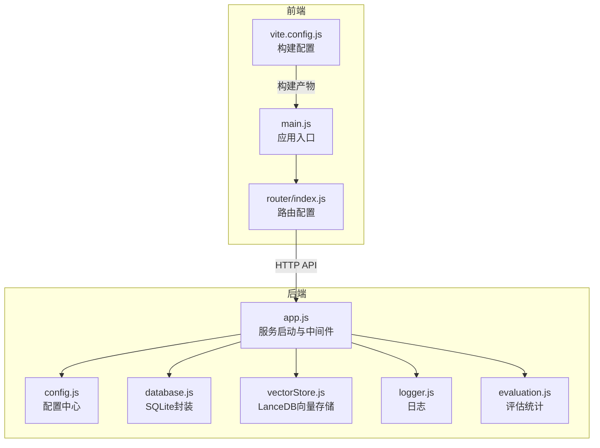
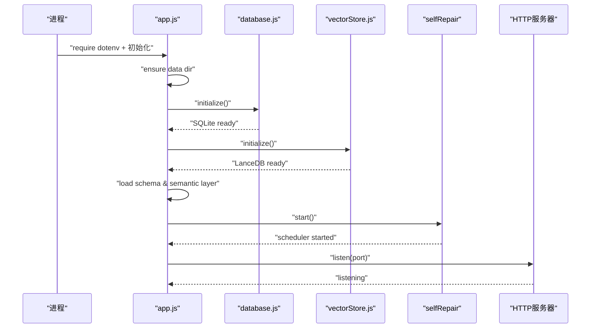
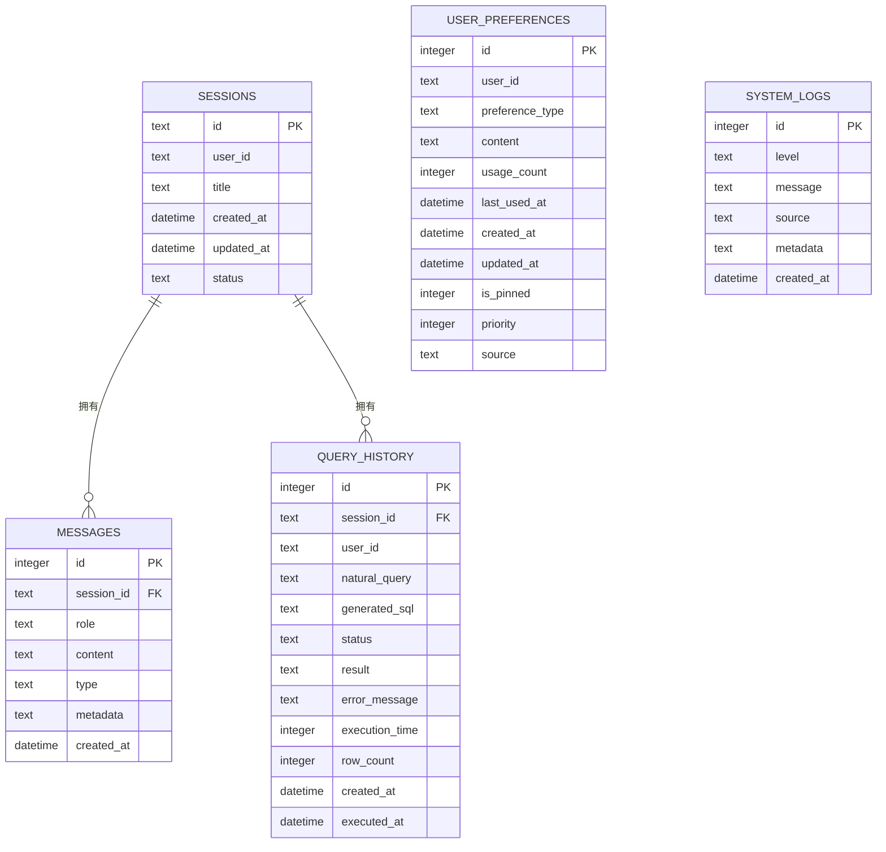
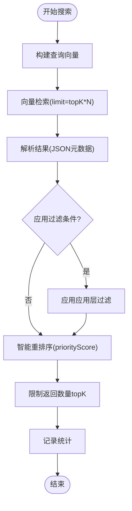
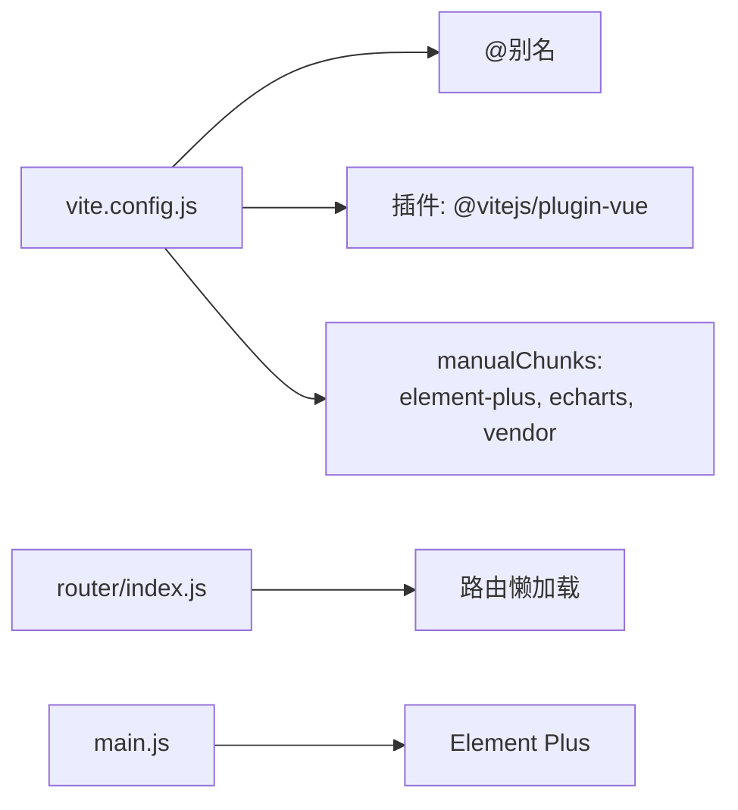
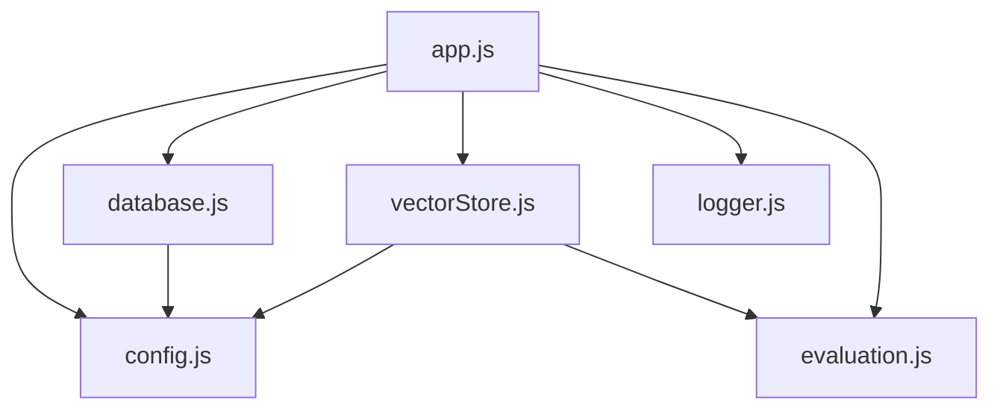

# 性能调优

<cite>
**本文引用的文件**
- [backend/package.json](file://backend/package.json)
- [frontend/package.json](file://frontend/package.json)
- [backend/src/app.js](file://backend/src/app.js)
- [backend/src/core/config.js](file://backend/src/core/config.js)
- [backend/src/core/database.js](file://backend/src/core/database.js)
- [backend/src/memory/vectorStore.js](file://backend/src/memory/vectorStore.js)
- [backend/src/utils/logger.js](file://backend/src/utils/logger.js)
- [backend/src/utils/evaluation.js](file://backend/src/utils/evaluation.js)
- [frontend/vite.config.js](file://frontend/vite.config.js)
- [frontend/src/router/index.js](file://frontend/src/router/index.js)
- [frontend/src/main.js](file://frontend/src/main.js)
- [backend/test/context-management.test.js](file://backend/test/context-management.test.js)
- [backend/config/feature-flags.js](file://backend/config/feature-flags.js)
</cite>

## 目录
1. [简介](#简介)
2. [项目结构](#项目结构)
3. [核心组件](#核心组件)
4. [架构总览](#架构总览)
5. [详细组件分析](#详细组件分析)
6. [依赖分析](#依赖分析)
7. [性能考虑](#性能考虑)
8. [故障排查指南](#故障排查指南)
9. [结论](#结论)
10. [附录](#附录)

## 简介
本文件面向NL2SQL项目的性能调优，围绕后端数据库查询优化、索引设计与连接池配置、向量存储性能调优（LanceDB）、内存与垃圾回收优化（Node.js进程参数）、前端性能优化（Vue组件懒加载、静态资源压缩与CDN）以及性能测试与基准测试方法，提供系统化策略与实操建议。

## 项目结构
NL2SQL采用前后端分离架构：
- 后端：基于Node.js + Express，使用SQLite存储会话与日志，LanceDB存储向量数据，提供REST API与SSE流。
- 前端：基于Vue 3 + Vite，采用路由懒加载与代码分割，构建产物部署至CDN或静态服务器。

图表来源
- [frontend/src/main.js:1-89](file://frontend/src/main.js#L1-L89)
- [frontend/src/router/index.js:1-157](file://frontend/src/router/index.js#L1-L157)
- [frontend/vite.config.js:1-93](file://frontend/vite.config.js#L1-L93)
- [backend/src/app.js:1-260](file://backend/src/app.js#L1-L260)
- [backend/src/core/config.js:1-398](file://backend/src/core/config.js#L1-L398)
- [backend/src/core/database.js:1-859](file://backend/src/core/database.js#L1-L859)
- [backend/src/memory/vectorStore.js:1-881](file://backend/src/memory/vectorStore.js#L1-L881)
- [backend/src/utils/logger.js:1-442](file://backend/src/utils/logger.js#L1-L442)
- [backend/src/utils/evaluation.js:1-488](file://backend/src/utils/evaluation.js#L1-L488)

章节来源
- [backend/src/app.js:97-188](file://backend/src/app.js#L97-L188)
- [backend/src/core/config.js:16-398](file://backend/src/core/config.js#L16-L398)
- [frontend/vite.config.js:72-91](file://frontend/vite.config.js#L72-L91)

## 核心组件
- 配置中心：集中管理LLM、Embedding、数据库、向量库、安全、日志、Schema缓存、长期记忆、上下文管理等配置项，并提供校验。
- 数据库层：SQLite封装，提供事务、迁移、索引、查询与运行时统计。
- 向量存储：基于LanceDB，提供Schema与查询历史向量的增删改查、智能搜索与统计。
- 日志与评估：统一日志输出与轮转，运行时统计向量检索命中率与长期记忆命中率。
- 前端构建：Vite配置，路径别名、代理、代码分割与第三方库拆分。

章节来源
- [backend/src/core/config.js:16-398](file://backend/src/core/config.js#L16-L398)
- [backend/src/core/database.js:39-195](file://backend/src/core/database.js#L39-L195)
- [backend/src/memory/vectorStore.js:233-324](file://backend/src/memory/vectorStore.js#L233-L324)
- [backend/src/utils/logger.js:54-442](file://backend/src/utils/logger.js#L54-L442)
- [backend/src/utils/evaluation.js:37-122](file://backend/src/utils/evaluation.js#L37-L122)
- [frontend/vite.config.js:17-92](file://frontend/vite.config.js#L17-L92)

## 架构总览
后端启动流程：加载.env → 初始化数据目录 → 初始化SQLite → 初始化LanceDB → 加载Schema与业务语义层 → 启动自修复调度器 → 启动HTTP服务器。路由挂载在/api前缀下，SSE端点位于/api/sse/stream。

图表来源
- [backend/src/app.js:97-180](file://backend/src/app.js#L97-L180)
- [backend/src/core/database.js:206-267](file://backend/src/core/database.js#L206-L267)
- [backend/src/memory/vectorStore.js:233-263](file://backend/src/memory/vectorStore.js#L233-L263)

章节来源
- [backend/src/app.js:97-180](file://backend/src/app.js#L97-L180)

## 详细组件分析

### 数据库查询优化与索引设计
- 表与索引
  - sessions：按user_id、status、updated_at建立索引，加速按用户筛选、状态筛选与时间排序。
  - messages：按session_id、created_at建立索引，加速按会话查询与时间排序。
  - query_history：按user_id、session_id、created_at、status建立索引，加速用户查询历史、状态筛选与时间排序。
  - user_preferences：按user_id、preference_type与复合索引(user_id, preference_type)，加速偏好查询与排序。
  - system_logs：按level、created_at建立索引，加速日志级别筛选与时间查询。
- 查询模式
  - 使用参数化查询（?占位符）防止SQL注入，避免全表扫描。
  - 限定返回行数（如会话消息、用户偏好、查询模板）减少IO与内存占用。
  - 事务封装（BEGIN/COMMIT/ROLLBACK）保证一致性与原子性。
- 迁移与兼容
  - 自动迁移修复旧表结构（如移除UNIQUE约束），保证表结构演进的平滑过渡。

图表来源
- [backend/src/core/database.js:39-195](file://backend/src/core/database.js#L39-L195)

章节来源
- [backend/src/core/database.js:39-195](file://backend/src/core/database.js#L39-L195)
- [backend/src/core/database.js:277-345](file://backend/src/core/database.js#L277-L345)

### 连接池配置与SR数据库访问
- SR数据库连接池
  - min=2、max=10、acquireTimeout=30000、idleTimeout=600000，适合中等并发场景。
  - 建议结合业务峰值QPS与查询复杂度调优：高并发时适当提高max；长事务场景缩短idleTimeout。
- 安全与限流
  - allowedTables白名单、maxQueryRows限制、queryTimeout超时、禁止DDL/危险关键字、敏感字段脱敏。
- 评估与监控
  - selfRepair配置慢查询阈值（默认5000ms），结合日志与评估统计定位慢查询。

章节来源
- [backend/src/core/config.js:115-170](file://backend/src/core/config.js#L115-L170)
- [backend/src/core/config.js:222-231](file://backend/src/core/config.js#L222-L231)

### 向量存储性能调优（LanceDB）
- 初始化与表结构
  - schema_vectors与query_vectors两张表，初始使用占位向量与元数据，后续增量更新。
- 搜索策略
  - 普通搜索：topK扩大采样，应用层过滤与重排序。
  - 智能搜索：基于查询意图识别（关键词、上下文），对目标表与通用表赋予优先级，降低聚合报表表权重，提升召回质量。
- 元数据增强
  - importanceScore、queryType、complexity、execution信息，便于后续重排序与统计。
- 统计与评估
  - 运行时统计向量检索命中率与距离分布，评估向量化质量与召回效果。

图表来源
- [backend/src/memory/vectorStore.js:380-437](file://backend/src/memory/vectorStore.js#L380-L437)
- [backend/src/memory/vectorStore.js:452-538](file://backend/src/memory/vectorStore.js#L452-L538)
- [backend/src/utils/evaluation.js:71-96](file://backend/src/utils/evaluation.js#L71-L96)

章节来源
- [backend/src/memory/vectorStore.js:233-324](file://backend/src/memory/vectorStore.js#L233-L324)
- [backend/src/memory/vectorStore.js:380-538](file://backend/src/memory/vectorStore.js#L380-L538)
- [backend/src/utils/evaluation.js:37-122](file://backend/src/utils/evaluation.js#L37-L122)

### 内存管理与垃圾回收优化（Node.js）
- 进程参数
  - 建议在生产环境设置合理的Node.js启动参数（如堆大小、GC策略），结合容器资源限制与监控指标调优。
- 日志与异常处理
  - 统一日志输出与轮转，捕获未处理Promise拒绝与未捕获异常，执行优雅关闭，避免资源泄漏。
- 评估统计
  - 评估模块记录运行时统计，辅助定位内存与性能瓶颈。

章节来源
- [backend/src/app.js:198-252](file://backend/src/app.js#L198-L252)
- [backend/src/utils/logger.js:233-310](file://backend/src/utils/logger.js#L233-L310)
- [backend/src/utils/evaluation.js:37-61](file://backend/src/utils/evaluation.js#L37-L61)

### 前端性能优化（Vue 3 + Vite）
- 路由懒加载
  - 历史、Schema、记忆、评估等页面采用动态导入，减少首屏包体积。
- 代码分割与第三方库拆分
  - Element Plus、ECharts、Vue生态库分别打包，提升缓存命中率。
- 构建与代理
  - outDir=dist，sourcemap按需开启；开发代理/api转发至后端3000端口。
- 全局样式与UI库
  - 引入Element Plus样式与图标，统一UI风格。

图表来源
- [frontend/vite.config.js:17-92](file://frontend/vite.config.js#L17-L92)
- [frontend/src/router/index.js:63-108](file://frontend/src/router/index.js#L63-L108)
- [frontend/src/main.js:37-80](file://frontend/src/main.js#L37-L80)

章节来源
- [frontend/vite.config.js:72-91](file://frontend/vite.config.js#L72-L91)
- [frontend/src/router/index.js:63-108](file://frontend/src/router/index.js#L63-L108)
- [frontend/src/main.js:37-80](file://frontend/src/main.js#L37-L80)

## 依赖分析
- 后端依赖
  - express、cors、body-parser、sqlite3、vectordb、dotenv、uuid、dayjs、node-cron。
- 前端依赖
  - vue、vue-router、pinia、element-plus、axios、echarts、marked、mermaid、katex等。
- 关键耦合点
  - app.js依赖config、database、vectorStore、routes、selfRepair；vectorStore依赖config与evaluation；logger贯穿各模块。

图表来源
- [backend/src/app.js:40-50](file://backend/src/app.js#L40-L50)
- [backend/src/memory/vectorStore.js:14-23](file://backend/src/memory/vectorStore.js#L14-L23)
- [backend/src/core/database.js:12-20](file://backend/src/core/database.js#L12-L20)

章节来源
- [backend/package.json:10-26](file://backend/package.json#L10-L26)
- [frontend/package.json:11-34](file://frontend/package.json#L11-L34)

## 性能考虑
- 数据库层
  - 使用索引覆盖常见查询路径；对高选择性列（如user_id、status）建立索引；避免SELECT *，仅取必要字段。
  - 事务批处理写入，减少锁竞争；合理设置SQLite PRAGMA参数（如journal_mode、synchronous）。
- 向量检索
  - topK扩大采样，应用层过滤与智能重排序；对高价值表与通用表赋予不同优先级；定期清理无效向量。
  - Embedding维度固定为1536，避免频繁维度变更带来的缓存失效。
- 前端
  - 保持路由懒加载与第三方库拆分；开启Gzip/Brotli压缩；CDN缓存静态资源；按需加载图表与渲染库。
- 运维
  - 生产环境启用严格白名单与行数限制；设置查询超时；记录慢查询与错误日志；定期评估向量质量与记忆命中率。

## 故障排查指南
- 启动失败
  - 检查LLM API密钥与SR数据库URL是否配置；确认数据目录可写；查看日志文件轮转与权限。
- 查询缓慢
  - 使用selfRepair慢查询阈值定位；检查索引是否生效；确认allowedTables与maxQueryRows限制。
- 向量检索命中率低
  - 检查Embedding维度与模型一致性；评估智能搜索过滤策略；查看距离分布统计。
- 前端白屏或路由异常
  - 检查Vite代理配置与CORS；确认路由懒加载组件可访问；查看浏览器网络面板与控制台错误。

章节来源
- [backend/src/core/config.js:366-398](file://backend/src/core/config.js#L366-L398)
- [backend/src/utils/logger.js:134-166](file://backend/src/utils/logger.js#L134-L166)
- [backend/src/utils/evaluation.js:344-391](file://backend/src/utils/evaluation.js#L344-L391)
- [frontend/vite.config.js:24-35](file://frontend/vite.config.js#L24-L35)

## 结论
通过数据库索引与事务优化、向量检索的智能过滤与重排序、连接池与安全限制、前端懒加载与代码分割、以及完善的日志与评估体系，NL2SQL可在保证功能完整性的同时显著提升性能与稳定性。建议在生产环境中持续监控慢查询、向量质量与前端加载体验，并结合评估统计迭代优化。

## 附录

### 性能测试与基准测试方法
- 向量检索质量评估
  - 使用评估模块的测试用例集（Schema与查询相似度），对比召回精度、F1分数与平均误差，记录距离分布。
- 上下文管理与摘要
  - 基于测试用例验证Token估算、预算计算、历史裁剪与摘要缓存，确保在高轮次对话下的稳定性。
- 基准测试建议
  - 数据库：使用SQLite Benchmarks或自定义脚本，对比不同索引组合与查询模式的延迟与吞吐。
  - 向量检索：构造多样化查询样本，测量topK=5/10/20的P@1、Recall与平均延迟。
  - 前端：使用Lighthouse或WebPageTest，评估首屏时间、交互延迟与资源体积。

章节来源
- [backend/src/utils/evaluation.js:158-266](file://backend/src/utils/evaluation.js#L158-L266)
- [backend/test/context-management.test.js:274-321](file://backend/test/context-management.test.js#L274-L321)