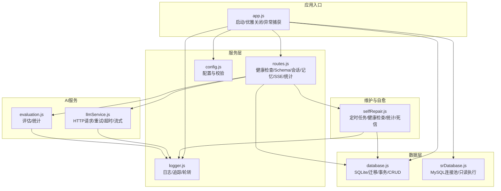
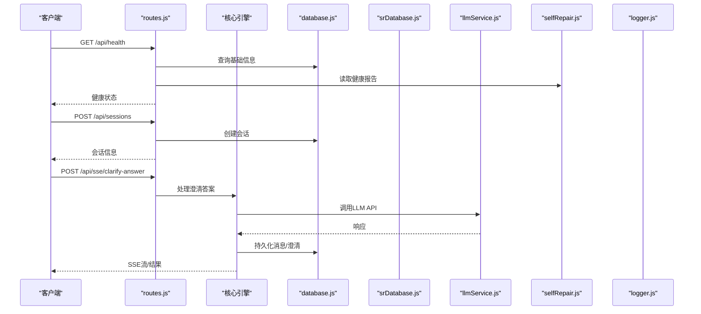
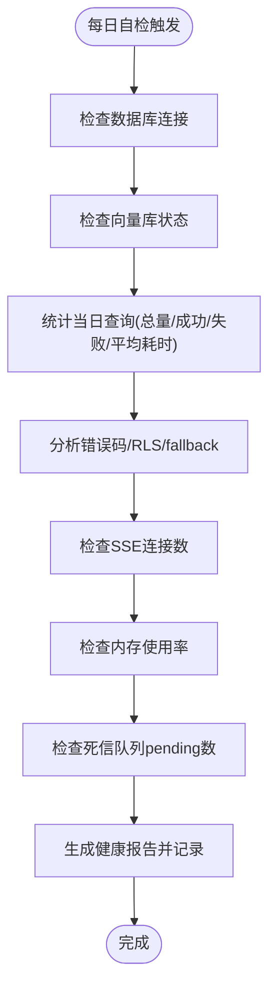
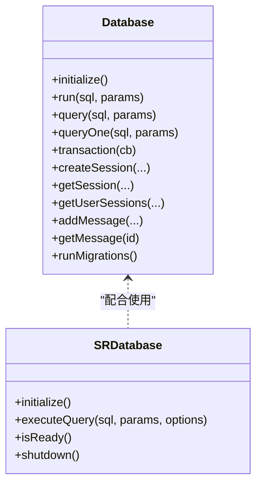
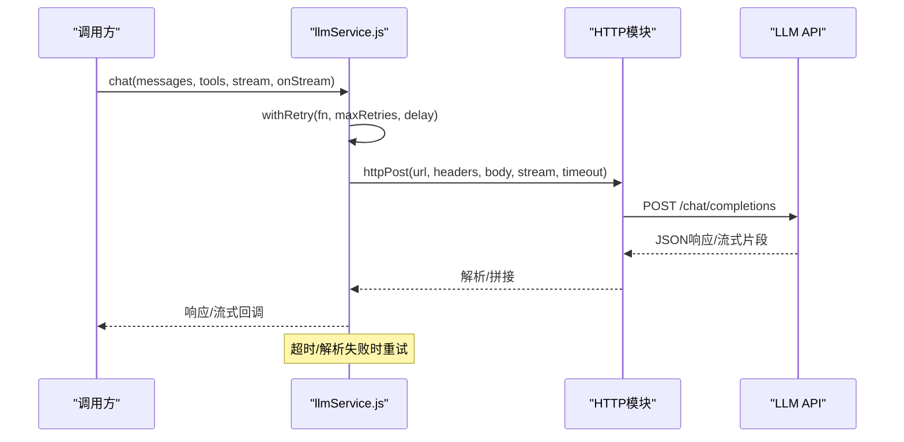
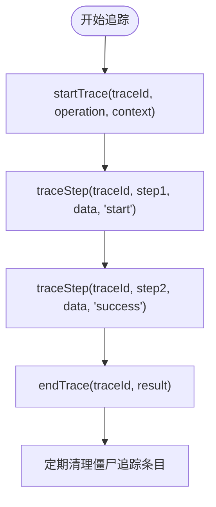
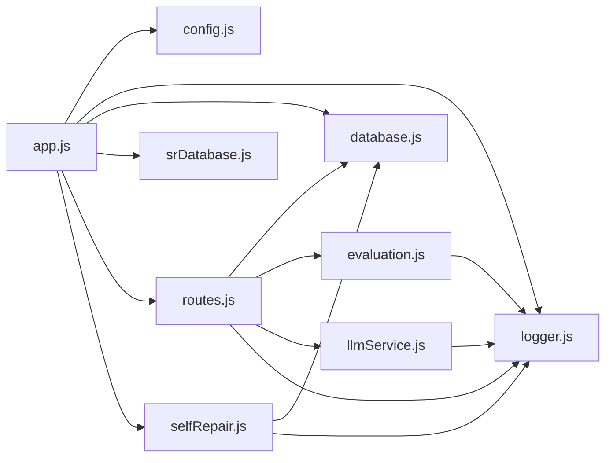

# 故障排除与应急响应

<cite>
**本文引用的文件**
- [backend/src/app.js](file://backend/src/app.js)
- [backend/src/core/routes.js](file://backend/src/core/routes.js)
- [backend/src/utils/logger.js](file://backend/src/utils/logger.js)
- [backend/src/core/database.js](file://backend/src/core/database.js)
- [backend/src/core/llmService.js](file://backend/src/core/llmService.js)
- [backend/src/core/selfRepair.js](file://backend/src/core/selfRepair.js)
- [backend/src/core/srDatabase.js](file://backend/src/core/srDatabase.js)
- [backend/src/utils/evaluation.js](file://backend/src/utils/evaluation.js)
- [backend/src/core/config.js](file://backend/src/core/config.js)
- [backend/package.json](file://backend/package.json)
- [docs/NL2SQL-澄清断链修复计划.md](file://docs/NL2SQL-澄清断链修复计划.md)
- [docs/后端架构审查与优化方案.md](file://docs/后端架构审查与优化方案.md)
</cite>

## 目录
1. [简介](#简介)
2. [项目结构](#项目结构)
3. [核心组件](#核心组件)
4. [架构总览](#架构总览)
5. [详细组件分析](#详细组件分析)
6. [依赖分析](#依赖分析)
7. [性能考量](#性能考量)
8. [故障排除指南](#故障排除指南)
9. [结论](#结论)
10. [附录](#附录)

## 简介
本文件为 NL2SQL 系统的“故障排除与应急响应”手册，面向运维团队，提供标准化的故障诊断流程、问题分类、影响评估、根因分析、快速处置与恢复策略，并结合系统现有健康检查、自修复机制、日志与评估能力，形成可执行的应急响应闭环。文档同时涵盖自动化检测与自愈建议、故障后数据分析与改进措施，以及案例库与经验总结，帮助团队在生产环境中高效应对各类故障。

## 项目结构
NL2SQL 后端采用模块化分层设计，核心模块包括：
- 应用入口与生命周期管理（启动、优雅关闭、异常捕获）
- REST API 路由与健康检查
- 日志系统与追踪上下文
- 数据库（SQLite 会话/历史、SR 业务数据库连接池）
- LLM 服务封装（HTTP 请求、重试、超时、流式响应）
- 自修复调度器（定时任务、健康检查、统计收集、死信队列）
- 评估模块（向量化质量、记忆命中率统计）
- 配置中心（集中配置、校验）

图表来源
- [backend/src/app.js:1-279](file://backend/src/app.js#L1-L279)
- [backend/src/core/routes.js:1-800](file://backend/src/core/routes.js#L1-L800)
- [backend/src/utils/logger.js:1-482](file://backend/src/utils/logger.js#L1-L482)
- [backend/src/core/database.js:1-800](file://backend/src/core/database.js#L1-L800)
- [backend/src/core/srDatabase.js:1-156](file://backend/src/core/srDatabase.js#L1-L156)
- [backend/src/core/llmService.js:1-491](file://backend/src/core/llmService.js#L1-L491)
- [backend/src/utils/evaluation.js:1-488](file://backend/src/utils/evaluation.js#L1-L488)
- [backend/src/core/selfRepair.js:1-641](file://backend/src/core/selfRepair.js#L1-L641)

章节来源
- [backend/src/app.js:1-279](file://backend/src/app.js#L1-L279)
- [backend/src/core/routes.js:1-800](file://backend/src/core/routes.js#L1-L800)
- [backend/src/utils/logger.js:1-482](file://backend/src/utils/logger.js#L1-L482)
- [backend/src/core/database.js:1-800](file://backend/src/core/database.js#L1-L800)
- [backend/src/core/srDatabase.js:1-156](file://backend/src/core/srDatabase.js#L1-L156)
- [backend/src/core/llmService.js:1-491](file://backend/src/core/llmService.js#L1-L491)
- [backend/src/utils/evaluation.js:1-488](file://backend/src/utils/evaluation.js#L1-L488)
- [backend/src/core/selfRepair.js:1-641](file://backend/src/core/selfRepair.js#L1-L641)

## 核心组件
- 应用入口与生命周期
  - 启动顺序：配置校验 → 数据目录准备 → SQLite 初始化 → LanceDB 初始化 → Schema 加载 → 业务语义层加载 → SR 数据库连接池初始化 → 自修复调度器启动 → HTTP 服务启动
  - 优雅关闭：停止接受新连接 → 关闭 SSE → 停止定时任务 → 关闭数据库 → 退出进程
  - 全局异常捕获：未处理 Promise 拒绝与未捕获异常，触发优雅关闭
- 健康检查与监控
  - 健康接口：基础状态、内存使用、版本、运行时长
  - 详细健康接口：数据库、LLM API、Schema、SSE 连接数
- 日志系统
  - 控制台彩色输出 + 文件轮转 + 多级别日志 + 结构化元数据
  - 追踪上下文：traceId、步骤、耗时、状态，支持僵尸条目清理
- 数据层
  - SQLite：会话、消息、查询历史、用户偏好、系统日志、死信队列
  - SR 数据库：连接池封装、只读会话、超时控制、LIMIT 兜底
- AI 服务
  - LLM API：HTTP POST、JSON 解析、超时、重试、流式响应
  - Embedding：向量维度、超时、重试
- 自修复机制
  - 定时任务：每日自检、会话清理、统计收集、记忆维护、死信重放
  - 健康报告：数据库、向量库、查询统计、慢查询、错误码分组、fallback 比例、内存使用、死信队列
- 评估模块
  - 向量化质量评估（Schema/查询相似度）
  - 长期记忆命中率统计
  - 运行时统计与重置

章节来源
- [backend/src/app.js:99-204](file://backend/src/app.js#L99-L204)
- [backend/src/app.js:214-271](file://backend/src/app.js#L214-L271)
- [backend/src/core/routes.js:74-139](file://backend/src/core/routes.js#L74-L139)
- [backend/src/utils/logger.js:54-482](file://backend/src/utils/logger.js#L54-L482)
- [backend/src/core/database.js:247-308](file://backend/src/core/database.js#L247-L308)
- [backend/src/core/srDatabase.js:42-86](file://backend/src/core/srDatabase.js#L42-L86)
- [backend/src/core/llmService.js:43-154](file://backend/src/core/llmService.js#L43-L154)
- [backend/src/core/selfRepair.js:65-143](file://backend/src/core/selfRepair.js#L65-L143)
- [backend/src/utils/evaluation.js:158-266](file://backend/src/utils/evaluation.js#L158-L266)

## 架构总览
系统采用“入口 → 路由 → 服务 → 数据/AI”的分层架构，配合自修复与评估模块形成闭环。健康检查与日志贯穿始终，支撑故障定位与恢复。

图表来源
- [backend/src/core/routes.js:74-139](file://backend/src/core/routes.js#L74-L139)
- [backend/src/core/routes.js:608-718](file://backend/src/core/routes.js#L608-L718)
- [backend/src/core/database.js:638-720](file://backend/src/core/database.js#L638-L720)
- [backend/src/core/llmService.js:224-322](file://backend/src/core/llmService.js#L224-L322)
- [backend/src/core/selfRepair.js:215-427](file://backend/src/core/selfRepair.js#L215-L427)
- [backend/src/utils/logger.js:246-322](file://backend/src/utils/logger.js#L246-L322)

## 详细组件分析

### 健康检查与自修复
- 健康检查接口
  - 基础健康：状态、时间戳、版本、运行时长、内存使用
  - 详细健康：数据库、LLM、Schema、SSE 连接数
- 自修复机制
  - 每日自检：数据库连接、向量库状态、当日查询统计、慢查询阈值、错误码分组、fallback 比例、内存使用、死信队列
  - 会话清理：过期会话归档
  - 统计收集：连接数、内存使用
  - 记忆维护：压缩与清理过期记忆
  - 死信重放：周期性扫描 pending 记录并告警

图表来源
- [backend/src/core/selfRepair.js:215-427](file://backend/src/core/selfRepair.js#L215-L427)
- [backend/src/core/routes.js:102-139](file://backend/src/core/routes.js#L102-L139)

章节来源
- [backend/src/core/routes.js:74-139](file://backend/src/core/routes.js#L74-L139)
- [backend/src/core/selfRepair.js:65-143](file://backend/src/core/selfRepair.js#L65-L143)
- [backend/src/core/selfRepair.js:215-427](file://backend/src/core/selfRepair.js#L215-L427)

### 数据库与 SR 数据库
- SQLite
  - 初始化：建表、索引、迁移、幂等审计字段补齐、死信队列表补齐
  - 事务：BEGIN/COMMIT/ROLLBACK
  - 会话/消息/查询历史/用户偏好/系统日志/死信队列
- SR 数据库（MySQL）
  - 连接池：最大连接数、等待队列、超时、只读会话
  - 执行：MAX_EXECUTION_TIME + query timeout 双重兜底，LIMIT 兜底
  - 关闭：优雅关闭连接池

图表来源
- [backend/src/core/database.js:247-308](file://backend/src/core/database.js#L247-L308)
- [backend/src/core/database.js:541-625](file://backend/src/core/database.js#L541-L625)
- [backend/src/core/srDatabase.js:42-86](file://backend/src/core/srDatabase.js#L42-L86)
- [backend/src/core/srDatabase.js:95-127](file://backend/src/core/srDatabase.js#L95-L127)

章节来源
- [backend/src/core/database.js:247-308](file://backend/src/core/database.js#L247-L308)
- [backend/src/core/database.js:383-516](file://backend/src/core/database.js#L383-L516)
- [backend/src/core/srDatabase.js:42-86](file://backend/src/core/srDatabase.js#L42-L86)
- [backend/src/core/srDatabase.js:95-127](file://backend/src/core/srDatabase.js#L95-L127)

### LLM 服务与错误处理
- HTTP 请求封装：URL 解析、请求头、超时、流式响应
- JSON 解析与错误处理：状态码、响应截断、多 JSON 对象、超长响应
- 重试机制：最大重试次数、延迟
- 超时与流式：可配置超时、流式回调

图表来源
- [backend/src/core/llmService.js:43-154](file://backend/src/core/llmService.js#L43-L154)
- [backend/src/core/llmService.js:169-197](file://backend/src/core/llmService.js#L169-L197)
- [backend/src/core/llmService.js:224-322](file://backend/src/core/llmService.js#L224-L322)

章节来源
- [backend/src/core/llmService.js:43-154](file://backend/src/core/llmService.js#L43-L154)
- [backend/src/core/llmService.js:169-197](file://backend/src/core/llmService.js#L169-L197)
- [backend/src/core/llmService.js:224-322](file://backend/src/core/llmService.js#L224-L322)

### 日志与追踪
- 日志级别：TRACE/DEBUG/INFO/WARN/ERROR
- 文件轮转：大小阈值、保留数量
- 结构化元数据：请求、错误堆栈、性能指标
- 追踪上下文：traceId、步骤、耗时、状态，僵尸条目清理

图表来源
- [backend/src/utils/logger.js:352-448](file://backend/src/utils/logger.js#L352-L448)

章节来源
- [backend/src/utils/logger.js:54-482](file://backend/src/utils/logger.js#L54-L482)

### 评估与统计
- 向量化质量评估：Schema 表检索精度、召回、F1 分数
- 查询相似度评估：余弦相似度、误差
- 长期记忆命中率：总体与按类型统计
- 运行时统计：向量检索命中、距离分布、记忆命中

章节来源
- [backend/src/utils/evaluation.js:158-266](file://backend/src/utils/evaluation.js#L158-L266)
- [backend/src/utils/evaluation.js:276-334](file://backend/src/utils/evaluation.js#L276-L334)
- [backend/src/utils/evaluation.js:344-429](file://backend/src/utils/evaluation.js#L344-L429)

## 依赖分析
- 外部依赖
  - Express、CORS、Body-parser、sqlite3、mysql2、node-cron、vectordb、uuid、dayjs、node-sql-parser
- 内部模块耦合
  - app.js 依赖 config、logger、database、srDatabase、vectorStore、routes、selfRepair
  - routes.js 依赖 config、logger、database、sseHandler、evaluation、requestContext
  - database.js 依赖 config、logger
  - srDatabase.js 依赖 config、logger、sqlLimit
  - llmService.js 依赖 config、logger、safeLog
  - selfRepair.js 依赖 config、logger、database、vectorStore、sseHandler
  - evaluation.js 依赖 config、logger

图表来源
- [backend/src/app.js:39-52](file://backend/src/app.js#L39-L52)
- [backend/src/core/routes.js:16-31](file://backend/src/core/routes.js#L16-L31)
- [backend/src/core/selfRepair.js:15-26](file://backend/src/core/selfRepair.js#L15-L26)
- [backend/src/core/llmService.js:21-26](file://backend/src/core/llmService.js#L21-L26)
- [backend/src/utils/evaluation.js:12-13](file://backend/src/utils/evaluation.js#L12-L13)

章节来源
- [backend/src/app.js:39-52](file://backend/src/app.js#L39-L52)
- [backend/src/core/routes.js:16-31](file://backend/src/core/routes.js#L16-L31)
- [backend/src/core/selfRepair.js:15-26](file://backend/src/core/selfRepair.js#L15-L26)
- [backend/src/core/llmService.js:21-26](file://backend/src/core/llmService.js#L21-L26)
- [backend/src/utils/evaluation.js:12-13](file://backend/src/utils/evaluation.js#L12-L13)

## 性能考量
- 内存使用：自修复检查记录 heapUsed/heapTotal/rss，超过阈值建议重启或优化
- 查询性能：慢查询阈值、SR 执行超时、LIMIT 兜底
- Token 预算：上下文管理配置，避免上下文窗口溢出
- 向量检索：分层加权、动态游戏名索引、datasource 硬过滤，减少重复检索
- 日志轮转：避免日志文件过大影响 IO

章节来源
- [backend/src/core/selfRepair.js:362-379](file://backend/src/core/selfRepair.js#L362-L379)
- [backend/src/core/srDatabase.js:99-110](file://backend/src/core/srDatabase.js#L99-L110)
- [backend/src/core/config.js:352-373](file://backend/src/core/config.js#L352-L373)
- [docs/后端架构审查与优化方案.md:250-641](file://docs/后端架构审查与优化方案.md#L250-L641)

## 故障排除指南

### 一、故障分类与影响评估
- 配置类
  - 缺少必要配置（LLM API Key、SR 数据库 URL）→ 启动失败或运行时异常
  - 白名单为空 → 安全风险
- 数据库类
  - SQLite 初始化失败 → 会话/历史/偏好/系统日志不可用
  - SR 数据库连接池不可用 → 真实执行不可用，返回 SR_DB_NOT_READY
- LLM 服务类
  - API 不可达/超时/解析失败 → SQL 生成/澄清/记忆提炼失败
- 性能类
  - 内存使用率过高 → 建议重启或优化
  - 慢查询/超时 → 检查 LIMIT、SQL 重写、数据源状态
- 自修复类
  - 定时任务未执行 → 健康报告缺失，建议检查配置与进程状态
  - 死信队列堆积 → 建议人工审阅并处理

章节来源
- [backend/src/core/config.js:407-429](file://backend/src/core/config.js#L407-L429)
- [backend/src/core/database.js:247-308](file://backend/src/core/database.js#L247-L308)
- [backend/src/core/srDatabase.js:42-86](file://backend/src/core/srDatabase.js#L42-L86)
- [backend/src/core/llmService.js:137-154](file://backend/src/core/llmService.js#L137-L154)
- [backend/src/core/selfRepair.js:65-143](file://backend/src/core/selfRepair.js#L65-L143)

### 二、标准化诊断流程
- 步骤1：健康检查
  - 访问 /api/health 与 /api/health/detail，确认数据库、LLM、Schema、SSE、内存状态
- 步骤2：日志定位
  - 检查日志文件与控制台输出，关注 ERROR/WARN 级别
  - 使用追踪上下文（traceId）关联多条日志
- 步骤3：自修复报告
  - 查看系统日志中的每日自检报告，关注错误码分组、fallback 比例、慢查询、死信队列
- 步骤4：数据库与 SR 数据库
  - SQLite：执行简单查询验证连接；检查迁移是否成功
  - SR：检查连接池初始化、只读会话、超时设置
- 步骤5：LLM 服务
  - 检查 API 基础地址、密钥、超时、重试；观察响应解析与流式处理
- 步骤6：评估与统计
  - 使用评估接口查看向量化质量与记忆命中率，辅助定位检索/记忆问题

章节来源
- [backend/src/core/routes.js:74-139](file://backend/src/core/routes.js#L74-L139)
- [backend/src/utils/logger.js:352-448](file://backend/src/utils/logger.js#L352-L448)
- [backend/src/core/selfRepair.js:434-448](file://backend/src/core/selfRepair.js#L434-L448)
- [backend/src/core/database.js:247-308](file://backend/src/core/database.js#L247-L308)
- [backend/src/core/srDatabase.js:42-86](file://backend/src/core/srDatabase.js#L42-L86)
- [backend/src/core/llmService.js:224-322](file://backend/src/core/llmService.js#L224-L322)
- [backend/src/utils/evaluation.js:397-407](file://backend/src/utils/evaluation.js#L397-L407)

### 三、常见故障与处置

#### 1) 数据库连接异常
- 现象
  - /api/health.detail 中 database 状态 error
  - 启动时报数据库连接失败
- 诊断
  - 检查 SQLite 路径与权限
  - 执行简单查询验证连接
  - 查看迁移日志，确认迁移是否成功
- 处置
  - 修复路径/权限后重启
  - 如迁移失败，修复迁移脚本并重试
- 预防
  - 启动时执行配置校验与数据库初始化
  - 定期检查磁盘空间与文件权限

章节来源
- [backend/src/core/database.js:247-308](file://backend/src/core/database.js#L247-L308)
- [backend/src/core/database.js:383-516](file://backend/src/core/database.js#L383-L516)
- [backend/src/core/routes.js:102-139](file://backend/src/core/routes.js#L102-L139)

#### 2) LLM 服务不可用
- 现象
  - /api/health.detail 中 llm 状态 error
  - SQL 生成/澄清/记忆提炼失败
- 诊断
  - 检查 LLM_API_BASE、LLM_API_KEY、LLM_MODEL、LLM_TIMEOUT
  - 观察响应解析与超时日志
  - 使用 withRetry 验证重试机制
- 处置
  - 修正配置后重启
  - 临时降级为 dryRun 或禁用 Embedding
- 预防
  - 健康检查中包含 LLM 状态
  - 增加重试与超时配置弹性

章节来源
- [backend/src/core/llmService.js:43-154](file://backend/src/core/llmService.js#L43-L154)
- [backend/src/core/llmService.js:169-197](file://backend/src/core/llmService.js#L169-L197)
- [backend/src/core/routes.js:102-139](file://backend/src/core/routes.js#L102-L139)

#### 3) 内存泄漏（追踪上下文）
- 现象
  - 进程内存持续增长
  - traceContext 中僵尸条目未清理
- 诊断
  - 检查 startTrace/endTrace 是否配对
  - 查看僵尸条目清理定时任务
- 处置
  - 修复未清理的调用方
  - 调整最大容量与清理周期
- 预防
  - 统一追踪上下文管理
  - 增加告警阈值

章节来源
- [backend/src/utils/logger.js:331-343](file://backend/src/utils/logger.js#L331-L343)
- [backend/src/utils/logger.js:352-448](file://backend/src/utils/logger.js#L352-L448)

#### 4) 性能下降（慢查询/内存高）
- 现象
  - 自修复报告提示慢查询/内存使用率过高
- 诊断
  - 检查慢查询阈值、SR 执行超时、LIMIT 兜底
  - 观察内存使用趋势
- 处置
  - 优化 SQL、启用 RL 重写、限制返回行数
  - 重启服务释放内存
- 预防
  - 调整阈值与超时配置
  - 定期执行记忆维护

章节来源
- [backend/src/core/selfRepair.js:289-292](file://backend/src/core/selfRepair.js#L289-L292)
- [backend/src/core/selfRepair.js:375-378](file://backend/src/core/selfRepair.js#L375-L378)
- [backend/src/core/srDatabase.js:99-110](file://backend/src/core/srDatabase.js#L99-L110)

#### 5) 澄清断链/SQL 跑偏（案例）
- 背景
  - 澄清流程无断点续跑、SQL Prompt 未注入当前日期/历史、Schema 发现入参过窄、applyClarificationResult 分支贫弱
- 处置
  - 按批次修复：A（Prompt 注入）→ B（澄清断链修复）→ C（兜底与健壮性）
  - 新增 /api/sse/clarify-answer 路由与回退逻辑
- 预防
  - 健壮性测试覆盖澄清链路
  - 前后端解耦升级，后端可独立发布

章节来源
- [docs/NL2SQL-澄清断链修复计划.md:1-140](file://docs/NL2SQL-澄清断链修复计划.md#L1-L140)
- [backend/src/core/routes.js:608-718](file://backend/src/core/routes.js#L608-L718)

### 四、应急响应预案
- 故障升级流程
  - 一线：健康检查 + 日志定位 + 自修复报告
  - 二线：数据库/LLM 专项排查 + 评估统计
  - 三线：架构与配置审查 + 重大变更回滚
- 沟通机制
  - 健康检查接口对外暴露，便于监控系统集成
  - 日志统一格式，便于告警与检索
- 恢复策略
  - 优雅关闭：停止新连接 → 关闭 SSE → 停止定时任务 → 关闭数据库 → 退出进程
  - 重试与降级：LLM 重试、Embedding 降级、SR 执行降级
  - 死信队列：周期性告警，人工审阅与重放

章节来源
- [backend/src/app.js:214-271](file://backend/src/app.js#L214-L271)
- [backend/src/core/selfRepair.js:133-140](file://backend/src/core/selfRepair.js#L133-L140)
- [backend/src/core/selfRepair.js:602-618](file://backend/src/core/selfRepair.js#L602-L618)

### 五、自动化检测与自愈
- 健康检查：/api/health 与 /api/health/detail
- 自修复：每日自检、会话清理、统计收集、记忆维护、死信重放
- 评估：向量化质量与记忆命中率统计，支持重置与导出

章节来源
- [backend/src/core/routes.js:74-139](file://backend/src/core/routes.js#L74-L139)
- [backend/src/core/selfRepair.js:65-143](file://backend/src/core/selfRepair.js#L65-L143)
- [backend/src/utils/evaluation.js:397-407](file://backend/src/utils/evaluation.js#L397-L407)

### 六、故障后数据分析与改进
- 日志分析：ERROR/WARN 级别、traceId 关联、僵尸条目清理
- 性能回归测试：评估接口、慢查询阈值、内存使用趋势
- 系统加固：配置校验、迁移幂等、连接池超时、LIMIT 兜底、RLS 改写

章节来源
- [backend/src/utils/logger.js:331-343](file://backend/src/utils/logger.js#L331-L343)
- [backend/src/utils/evaluation.js:158-266](file://backend/src/utils/evaluation.js#L158-L266)
- [docs/后端架构审查与优化方案.md:242-248](file://docs/后端架构审查与优化方案.md#L242-L248)

### 七、故障案例库与经验总结
- 案例：澄清断链导致 SQL 跑偏
  - 根因：澄清流程无断点续跑、Prompt 未注入日期/历史、Schema 入参过窄、applyClarificationResult 分支贫弱
  - 处置：批次 A/B/C 修复，新增 /api/sse/clarify-answer，老前端回退兜底
- 经验：追踪上下文需配对清理，避免内存泄漏；健康检查与自修复报告是快速定位关键

章节来源
- [docs/NL2SQL-澄清断链修复计划.md:1-140](file://docs/NL2SQL-澄清断链修复计划.md#L1-L140)

## 结论
本手册基于 NL2SQL 系统现有能力，建立了标准化的故障诊断与应急响应流程，覆盖配置、数据库、LLM、性能、自修复与评估等关键领域。通过健康检查、日志追踪、自修复与评估，能够快速定位问题并制定恢复策略。建议在生产环境中持续完善配置校验、日志轮转、追踪上下文清理与评估统计，以提升系统的可观测性与自愈能力。

## 附录
- 常用命令
  - 启动：npm run start
  - 开发：npm run dev
  - 测试：npm run test
- 健康检查端点
  - GET /api/health
  - GET /api/health/detail
- 评估端点
  - GET /api/evaluation/stats
  - POST /api/evaluation/stats/reset
  - POST /api/evaluation/schema-quality

章节来源
- [backend/package.json:6-14](file://backend/package.json#L6-L14)
- [backend/src/core/routes.js:74-139](file://backend/src/core/routes.js#L74-L139)
- [backend/src/utils/evaluation.js:728-762](file://backend/src/utils/evaluation.js#L728-L762)