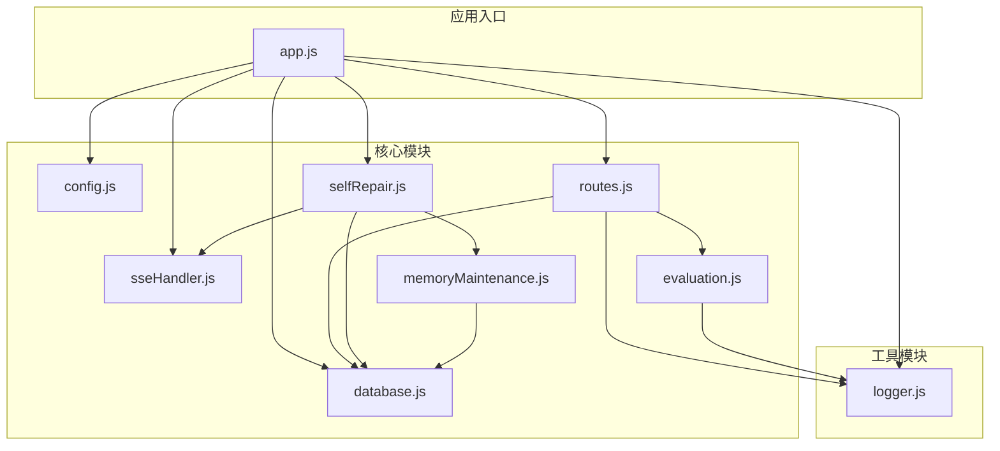
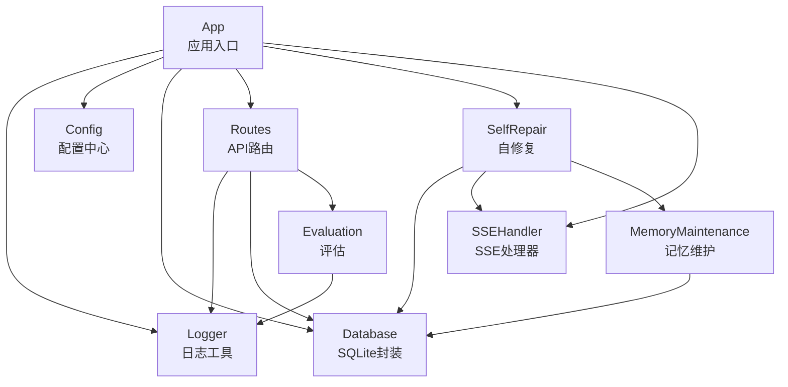
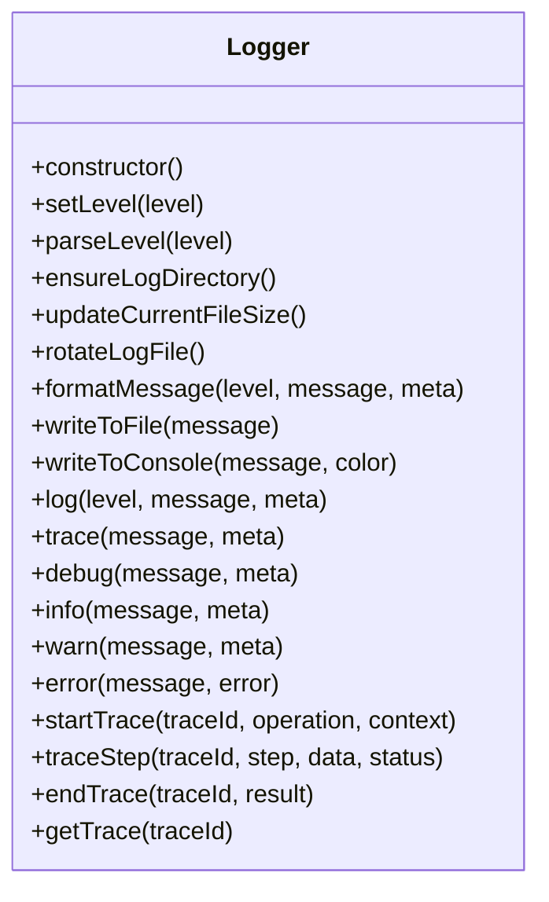
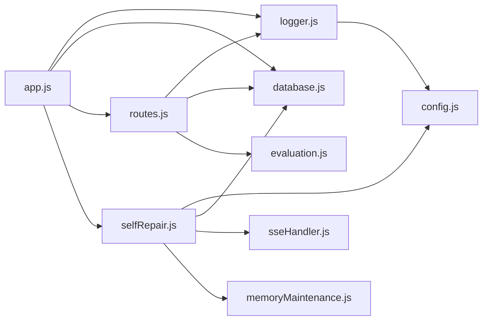

# 监控与日志

<cite>
**本文引用的文件**
- [logger.js](file://backend/src/utils/logger.js)
- [config.js](file://backend/src/core/config.js)
- [app.js](file://backend/src/app.js)
- [routes.js](file://backend/src/core/routes.js)
- [database.js](file://backend/src/core/database.js)
- [selfRepair.js](file://backend/src/core/selfRepair.js)
- [sseHandler.js](file://backend/src/core/sseHandler.js)
- [evaluation.js](file://backend/src/utils/evaluation.js)
- [memoryMaintenance.js](file://backend/src/memory/memoryMaintenance.js)
- [package.json](file://backend/package.json)
</cite>

## 目录
1. [简介](#简介)
2. [项目结构](#项目结构)
3. [核心组件](#核心组件)
4. [架构总览](#架构总览)
5. [详细组件分析](#详细组件分析)
6. [依赖分析](#依赖分析)
7. [性能考虑](#性能考虑)
8. [故障排查指南](#故障排查指南)
9. [结论](#结论)
10. [附录](#附录)

## 简介
本文件面向NL2SQL项目的监控与日志管理，覆盖以下主题：
- 应用日志配置：日志级别、格式化输出、文件轮转策略
- 性能监控指标：查询响应时间、内存使用率、CPU负载、数据库连接池状态
- 错误监控与告警：异常捕获、错误报告、自动告警
- 日志分析与调试：常见问题排查、性能瓶颈定位
- 第三方监控工具集成：Prometheus、Grafana、ELK Stack的配置思路与实践要点

## 项目结构
NL2SQL后端采用模块化组织，日志与监控相关的关键模块集中在以下位置：
- 日志工具：backend/src/utils/logger.js
- 配置中心：backend/src/core/config.js
- 应用入口与全局异常处理：backend/src/app.js
- API路由与请求日志：backend/src/core/routes.js
- 数据库与查询统计：backend/src/core/database.js
- 自修复与健康检查：backend/src/core/selfRepair.js
- SSE连接与实时统计：backend/src/core/sseHandler.js
- 评估与统计：backend/src/utils/evaluation.js
- 记忆维护与健康报告：backend/src/memory/memoryMaintenance.js
- 依赖与脚本：backend/package.json

图表来源
- [app.js:1-260](file://backend/src/app.js#L1-L260)
- [config.js:1-398](file://backend/src/core/config.js#L1-L398)
- [routes.js:1-800](file://backend/src/core/routes.js#L1-L800)
- [database.js:1-859](file://backend/src/core/database.js#L1-L859)
- [selfRepair.js:1-489](file://backend/src/core/selfRepair.js#L1-L489)
- [sseHandler.js:1-349](file://backend/src/core/sseHandler.js#L1-L349)
- [evaluation.js:1-488](file://backend/src/utils/evaluation.js#L1-L488)
- [memoryMaintenance.js:1-418](file://backend/src/memory/memoryMaintenance.js#L1-L418)
- [logger.js:1-442](file://backend/src/utils/logger.js#L1-L442)

章节来源
- [app.js:1-260](file://backend/src/app.js#L1-L260)
- [config.js:1-398](file://backend/src/core/config.js#L1-L398)

## 核心组件
- 日志工具（Logger）
  - 支持多级别日志（trace/debug/info/warn/error）、结构化输出、控制台与文件双通道、文件轮转
  - 提供执行流程追踪（trace/traceStep/endTrace），便于NL2SQL流程调试
- 配置中心（Config）
  - 集中管理日志、数据库、LLM、安全、会话、自修复、Schema、长期记忆、上下文管理、评估等配置
  - 提供配置校验与环境变量读取
- 应用入口（App）
  - 初始化数据库、向量库、Schema、业务语义层、自修复调度器
  - 注册未捕获异常与Promise拒绝的全局处理，优雅关闭
- API路由（Routes）
  - 请求日志中间件（记录method/path/ip/query）
  - 健康检查接口（基础/详细），包含数据库、LLM、Schema、SSE连接、内存使用
- 数据库（Database）
  - SQLite封装，提供查询、事务、迁移、连接管理
  - 查询历史表记录执行耗时、行数、错误信息，便于性能与错误统计
- 自修复（SelfRepair）
  - 定时任务：每日自检、会话清理、统计收集、记忆维护
  - 自检报告写入system_logs表，包含数据库、向量库、查询统计、连接数、系统资源
- SSE处理器（SSEHandler）
  - 管理SSE连接、消息广播、进度回调、连接统计
- 评估（Evaluation）
  - 向量化质量评估、长期记忆命中率统计、运行时统计与报告
- 记忆维护（MemoryMaintenance）
  - 长期记忆分级保留策略、相似模式合并、健康报告

章节来源
- [logger.js:1-442](file://backend/src/utils/logger.js#L1-L442)
- [config.js:1-398](file://backend/src/core/config.js#L1-L398)
- [app.js:1-260](file://backend/src/app.js#L1-L260)
- [routes.js:1-800](file://backend/src/core/routes.js#L1-L800)
- [database.js:1-859](file://backend/src/core/database.js#L1-L859)
- [selfRepair.js:1-489](file://backend/src/core/selfRepair.js#L1-L489)
- [sseHandler.js:1-349](file://backend/src/core/sseHandler.js#L1-L349)
- [evaluation.js:1-488](file://backend/src/utils/evaluation.js#L1-L488)
- [memoryMaintenance.js:1-418](file://backend/src/memory/memoryMaintenance.js#L1-L418)

## 架构总览
下图展示了监控与日志在系统中的交互关系：日志工具贯穿各模块；配置中心统一提供日志级别、文件路径、轮转参数；路由层与数据库层记录关键指标；自修复模块定期收集系统状态并写入数据库；评估模块提供运行时统计；SSE处理器提供连接数与活动状态。

图表来源
- [logger.js:1-442](file://backend/src/utils/logger.js#L1-L442)
- [config.js:1-398](file://backend/src/core/config.js#L1-L398)
- [app.js:1-260](file://backend/src/app.js#L1-L260)
- [routes.js:1-800](file://backend/src/core/routes.js#L1-L800)
- [database.js:1-859](file://backend/src/core/database.js#L1-L859)
- [selfRepair.js:1-489](file://backend/src/core/selfRepair.js#L1-L489)
- [sseHandler.js:1-349](file://backend/src/core/sseHandler.js#L1-L349)
- [evaluation.js:1-488](file://backend/src/utils/evaluation.js#L1-L488)
- [memoryMaintenance.js:1-418](file://backend/src/memory/memoryMaintenance.js#L1-L418)

## 详细组件分析

### 日志工具（Logger）
- 日志级别：trace/debug/info/warn/error，支持通过配置设置级别
- 输出目标：控制台（带颜色）与文件（结构化JSON）
- 文件轮转：基于最大文件大小与最大文件数，超过阈值自动重命名与清理
- 结构化元数据：支持附加对象（如错误堆栈、请求IP、查询参数）
- 事件通知：发出“log”事件，便于外部监听
- 执行流程追踪：startTrace/traceStep/endTrace，记录步骤耗时与状态

图表来源
- [logger.js:54-427](file://backend/src/utils/logger.js#L54-L427)

章节来源
- [logger.js:1-442](file://backend/src/utils/logger.js#L1-L442)
- [config.js:195-213](file://backend/src/core/config.js#L195-L213)

### 配置中心（Config）
- 日志配置：日志级别、文件路径、控制台/文件输出开关、最大文件大小、最大文件数
- 数据库配置：SQLite路径、向量库路径、SR数据库URL与连接池参数
- 安全配置：白名单、Dry Run、最大查询行数、查询超时、禁止关键字、敏感字段
- 自修复配置：启用开关、Cron表达式、会话检查间隔、慢查询阈值
- 评估配置：是否启用评估、是否记录运行时统计、阈值
- 其他：LLM API、Embedding模型、Schema缓存、长期记忆、上下文管理等

章节来源
- [config.js:16-398](file://backend/src/core/config.js#L16-L398)

### 应用入口（App）
- 初始化流程：数据目录、SQLite、LanceDB、Schema、业务语义层、功能开关、自修复、HTTP服务器
- 全局异常处理：未捕获异常与未处理Promise拒绝，记录错误并优雅关闭
- 进程信号：SIGTERM/SIGINT触发优雅关闭

章节来源
- [app.js:1-260](file://backend/src/app.js#L1-L260)

### API路由（Routes）
- 请求日志中间件：记录method、path、query、ip
- 健康检查接口：
  - GET /api/health：返回状态、时间戳、版本、运行时长、内存使用
  - GET /api/health/detail：返回数据库、LLM、Schema、SSE连接等组件状态
- 查询历史接口：支持按用户/会话筛选与限制返回数量
- 评估接口：运行时统计报告、重置统计、Schema向量化质量评估

章节来源
- [routes.js:1-800](file://backend/src/core/routes.js#L1-L800)
- [evaluation.js:1-488](file://backend/src/utils/evaluation.js#L1-L488)

### 数据库（Database）
- 表结构：sessions、messages、query_history、user_preferences、system_logs
- 查询历史记录：execution_time、row_count、error_message，便于性能与错误统计
- 迁移：修复旧表结构（如UNIQUE约束）
- 事务：BEGIN/COMMIT/ROLLBACK封装

章节来源
- [database.js:1-859](file://backend/src/core/database.js#L1-L859)

### 自修复（SelfRepair）
- 定时任务：
  - 每日自检：检查数据库、向量库、查询统计、连接数、系统资源
  - 会话清理：归档过期会话
  - 统计收集：每5分钟记录连接数与内存使用
  - 记忆维护：压缩与清理长期记忆
- 报告落库：将每日自检报告写入system_logs表

章节来源
- [selfRepair.js:1-489](file://backend/src/core/selfRepair.js#L1-L489)
- [database.js:172-195](file://backend/src/core/database.js#L172-L195)

### SSE处理器（SSEHandler）
- 连接管理：按会话ID维护连接列表，支持多标签页
- 消息广播：处理查询时向会话内所有连接发送进度与结果
- 统计接口：getConnectionCount/getConnectionList/getSessionConnectionCount

章节来源
- [sseHandler.js:1-349](file://backend/src/core/sseHandler.js#L1-L349)

### 评估（Evaluation）
- 运行时统计：向量检索命中率、距离分布、长期记忆命中率、按类型统计
- 质量评估：Schema向量化质量评估、查询历史相似度评估
- 报告导出：完整统计报告、重置统计

章节来源
- [evaluation.js:1-488](file://backend/src/utils/evaluation.js#L1-L488)

### 记忆维护（MemoryMaintenance）
- 分级保留策略：高频（永久）、中频（90天）、低频（30天）、字段别名（365天）
- 相似模式合并：维度/指标重合度与时间范围一致性判断
- 健康报告：总体统计、按类型统计、预估清理量

章节来源
- [memoryMaintenance.js:1-418](file://backend/src/memory/memoryMaintenance.js#L1-L418)

## 依赖分析
- Logger依赖Config读取日志配置，并在文件写入失败时回退到控制台输出
- Routes依赖Logger记录请求日志，依赖Database与Evaluation
- SelfRepair依赖Config、Database、SSEHandler、MemoryMaintenance
- App依赖Logger、Database、VectorStore、Routes、SelfRepair

图表来源
- [logger.js:23-85](file://backend/src/utils/logger.js#L23-L85)
- [routes.js:18-30](file://backend/src/core/routes.js#L18-L30)
- [selfRepair.js:16-26](file://backend/src/core/selfRepair.js#L16-L26)
- [app.js:40-50](file://backend/src/app.js#L40-L50)

章节来源
- [logger.js:1-442](file://backend/src/utils/logger.js#L1-L442)
- [routes.js:1-800](file://backend/src/core/routes.js#L1-L800)
- [selfRepair.js:1-489](file://backend/src/core/selfRepair.js#L1-L489)
- [app.js:1-260](file://backend/src/app.js#L1-L260)

## 性能考虑
- 查询响应时间
  - 路由层：/api/health返回进程运行时长（process.uptime），可用于粗略评估
  - 数据层：query_history记录execution_time，可统计平均耗时与慢查询
  - 自修复：慢查询阈值配置（selfRepair.slowQueryThreshold），用于识别潜在慢查询
- 内存使用率
  - 路由层：/api/health返回heapUsed/heapTotal（MB），用于监控内存占用
  - 自修复：收集内存使用（heapUsed/heapTotal），并检查内存使用率是否过高
- CPU负载
  - Node.js进程无直接暴露CPU指标，可通过系统监控工具采集
  - 建议结合第三方监控工具（见附录）进行CPU负载观测
- 数据库连接池状态
  - 配置中心提供SR数据库连接池参数（min/max/aquireTimeout/idleTimeout）
  - 建议结合数据库驱动的连接池指标进行观测（见附录）

章节来源
- [routes.js:82-89](file://backend/src/core/routes.js#L82-L89)
- [routes.js:100-137](file://backend/src/core/routes.js#L100-L137)
- [database.js:119-130](file://backend/src/core/database.js#L119-L130)
- [selfRepair.js:243-246](file://backend/src/core/selfRepair.js#L243-L246)

## 故障排查指南
- 未捕获异常与未处理Promise拒绝
  - App中注册了uncaughtException与unhandledRejection，记录错误并优雅关闭
  - 排查步骤：查看日志文件与控制台输出，定位错误堆栈
- 数据库连接失败
  - 初始化阶段记录错误日志；迁移失败也会记录错误
  - 排查步骤：确认DB_PATH与SR_DATABASE_URL配置，检查权限与网络
- SSE连接异常
  - 连接建立与关闭均有日志；错误会记录并清理连接
  - 排查步骤：检查会话ID有效性、Nginx缓冲配置、客户端网络
- 查询失败率过高
  - 自修复每日自检会统计失败率并给出建议
  - 排查步骤：检查LLM API状态、SQL生成逻辑、数据源可用性
- 内存使用过高
  - 自修复每日自检会检查内存使用率并建议重启或优化
  - 排查步骤：检查内存泄漏、缓存策略、长期记忆占用

章节来源
- [app.js:242-252](file://backend/src/app.js#L242-L252)
- [database.js:224-228](file://backend/src/core/database.js#L224-L228)
- [database.js:256-263](file://backend/src/core/database.js#L256-L263)
- [sseHandler.js:104-112](file://backend/src/core/sseHandler.js#L104-L112)
- [selfRepair.js:234-246](file://backend/src/core/selfRepair.js#L234-L246)
- [selfRepair.js:280-284](file://backend/src/core/selfRepair.js#L280-L284)

## 结论
NL2SQL项目已具备完善的日志体系与自修复机制，能够满足日常运维与问题定位需求。建议在生产环境中：
- 明确日志级别与文件轮转策略，结合第三方监控工具实现可视化与告警
- 建立查询性能基线与慢查询阈值，持续优化SQL生成与数据源
- 强化错误监控与自动告警，缩短故障定位与恢复时间

## 附录

### 应用日志配置
- 日志级别：通过LOG_LEVEL设置（trace/debug/info/warn/error）
- 输出目标：console/file，分别由LOG_CONSOLE与LOG_FILE_OUTPUT控制
- 文件路径：LOG_FILE
- 文件轮转：maxSize（字节）、maxFiles（历史文件数）
- 结构化输出：日志包含时间戳、级别、消息与JSON元数据

章节来源
- [config.js:195-213](file://backend/src/core/config.js#L195-L213)
- [logger.js:29-44](file://backend/src/utils/logger.js#L29-L44)
- [logger.js:175-187](file://backend/src/utils/logger.js#L175-L187)
- [logger.js:134-166](file://backend/src/utils/logger.js#L134-L166)

### 性能监控指标
- 查询响应时间：/api/health返回进程运行时长；query_history记录execution_time
- 内存使用率：/api/health返回heapUsed/heapTotal；自修复收集内存使用
- CPU负载：建议通过第三方监控工具采集
- 数据库连接池状态：SR数据库连接池参数（min/max/aquireTimeout/idleTimeout）

章节来源
- [routes.js:82-89](file://backend/src/core/routes.js#L82-L89)
- [routes.js:100-137](file://backend/src/core/routes.js#L100-L137)
- [database.js:119-130](file://backend/src/core/database.js#L119-L130)
- [selfRepair.js:243-246](file://backend/src/core/selfRepair.js#L243-L246)

### 错误监控与告警
- 异常捕获：全局未捕获异常与未处理Promise拒绝，记录错误并优雅关闭
- 错误报告：自修复每日自检生成报告并写入system_logs
- 建议：结合第三方监控工具实现自动告警（见下节）

章节来源
- [app.js:242-252](file://backend/src/app.js#L242-L252)
- [selfRepair.js:317-331](file://backend/src/core/selfRepair.js#L317-L331)

### 日志分析与调试
- 使用Logger的trace/traceStep/endTrace进行流程追踪
- 通过/health与/health/detail快速定位组件状态
- 结合query_history与system_logs进行历史数据分析

章节来源
- [logger.js:314-408](file://backend/src/utils/logger.js#L314-L408)
- [routes.js:72-137](file://backend/src/core/routes.js#L72-L137)
- [database.js:172-195](file://backend/src/core/database.js#L172-L195)

### 第三方监控工具集成方案
- Prometheus
  - 指标采集：通过HTTP接口暴露查询响应时间、内存使用、连接数等
  - 建议：在App中增加/metrics端点，返回Gauge/Histogram指标
- Grafana
  - 可视化：基于Prometheus数据源创建面板（响应时间、内存、连接数、慢查询率）
- ELK Stack（Elasticsearch/Filebeat/Logstash/Kibana）
  - 日志采集：Filebeat收集日志文件，Logstash解析，Elasticsearch存储，Kibana可视化
  - 建议：将日志格式标准化为JSON，便于结构化检索与分析

[本节为概念性指导，不直接对应具体源文件，故不附图表来源与章节来源]