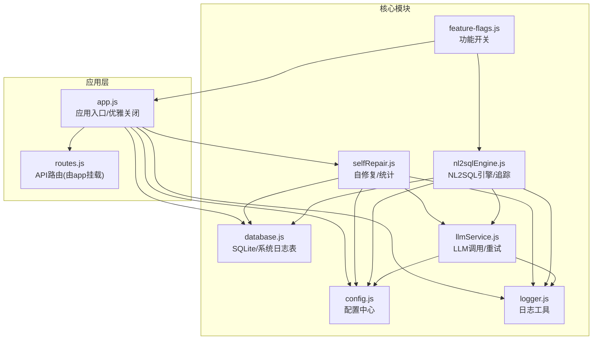
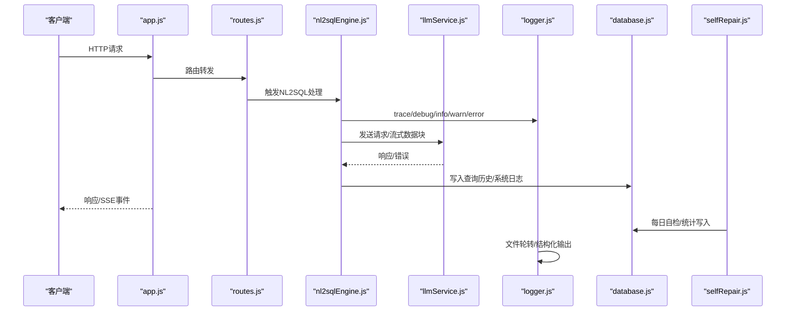
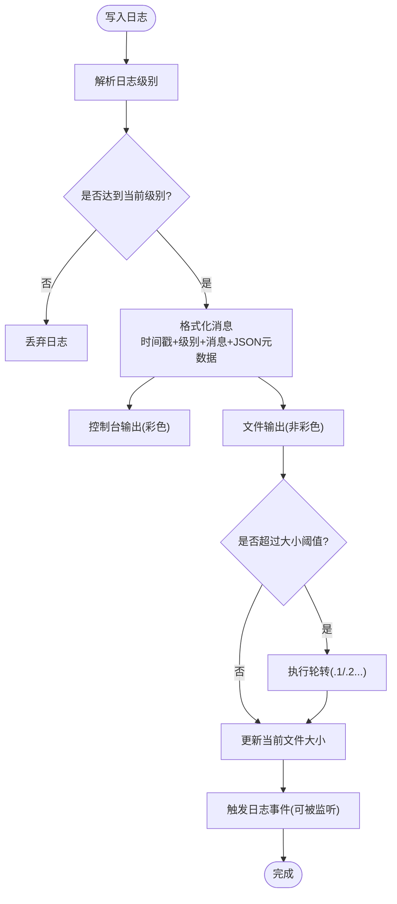
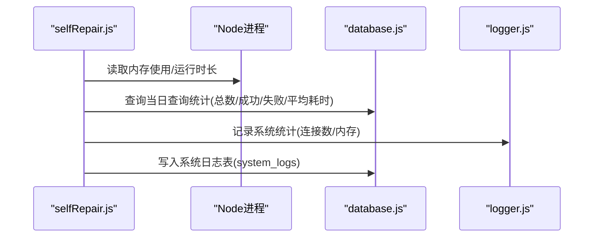
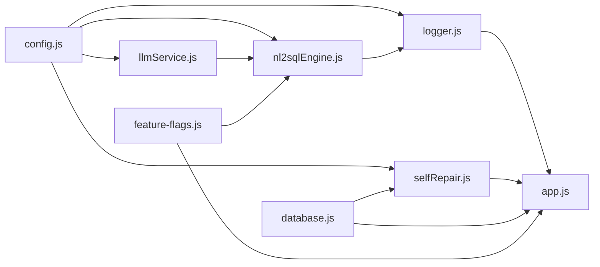

# 监控与日志

<cite>
**本文引用的文件**
- [logger.js](file://backend/src/utils/logger.js)
- [config.js](file://backend/src/core/config.js)
- [app.js](file://backend/src/app.js)
- [selfRepair.js](file://backend/src/core/selfRepair.js)
- [database.js](file://backend/src/core/database.js)
- [feature-flags.js](file://backend/config/feature-flags.js)
- [package.json](file://backend/package.json)
- [llmService.js](file://backend/src/core/llmService.js)
- [nl2sqlEngine.js](file://backend/src/core/nl2sqlEngine.js)
</cite>

## 目录
1. [简介](#简介)
2. [项目结构](#项目结构)
3. [核心组件](#核心组件)
4. [架构总览](#架构总览)
5. [详细组件分析](#详细组件分析)
6. [依赖关系分析](#依赖关系分析)
7. [性能考量](#性能考量)
8. [故障排查指南](#故障排查指南)
9. [结论](#结论)
10. [附录](#附录)

## 简介
本文件面向NL2SQL项目的监控与日志体系，围绕以下目标展开：
- 日志系统架构设计：日志级别、格式、轮转策略
- 监控指标采集：系统资源、应用性能、业务指标
- 日志分析方法：错误、性能、用户行为
- 告警配置：阈值、规则、通知
- 监控仪表板：关键指标、趋势、异常检测
- 日志存储与保留：存储策略、保留周期、备份

## 项目结构
NL2SQL后端采用模块化组织，日志与监控相关的关键位置如下：
- 日志工具：backend/src/utils/logger.js
- 配置中心：backend/src/core/config.js
- 应用入口与进程钩子：backend/src/app.js
- 自修复与统计：backend/src/core/selfRepair.js
- 数据持久化（含系统日志表）：backend/src/core/database.js
- 功能开关：backend/config/feature-flags.js
- LLM服务与重试：backend/src/core/llmService.js
- NL2SQL引擎与追踪：backend/src/core/nl2sqlEngine.js
- 依赖与脚本：backend/package.json

图表来源
- [app.js:1-266](file://backend/src/app.js#L1-L266)
- [config.js:1-398](file://backend/src/core/config.js#L1-L398)
- [logger.js:1-482](file://backend/src/utils/logger.js#L1-L482)
- [selfRepair.js:1-489](file://backend/src/core/selfRepair.js#L1-L489)
- [database.js:1-200](file://backend/src/core/database.js#L1-L200)
- [llmService.js:1-200](file://backend/src/core/llmService.js#L1-L200)
- [nl2sqlEngine.js:1-200](file://backend/src/core/nl2sqlEngine.js#L1-L200)
- [feature-flags.js:1-249](file://backend/config/feature-flags.js#L1-L249)

章节来源
- [app.js:1-266](file://backend/src/app.js#L1-L266)
- [config.js:1-398](file://backend/src/core/config.js#L1-L398)

## 核心组件
- 日志工具（Logger）
  - 多级别日志（trace/debug/info/warn/error）
  - 控制台彩色输出与文件输出
  - 结构化日志格式（时间戳+级别+消息+JSON元数据）
  - 日志轮转（按大小限制与文件数量）
  - 执行流程追踪（traceId、步骤、状态、耗时）
- 配置中心（Config）
  - 日志级别、文件路径、轮转参数
  - 自修复开关、Cron表达式、慢查询阈值
  - LLM/Embedding超时、重试、白名单、行数限制等
- 自修复与统计（SelfRepair）
  - 每日自检：数据库、向量库、查询统计、连接数、内存
  - 会话清理、记忆维护、周期性统计
- 数据持久化（Database）
  - 系统日志表system_logs（level/message/source/metadata）
  - 查询历史表query_history（执行时间、状态、错误）
- LLM服务（LLM Service）
  - HTTP请求封装、流式数据块日志、超时与重试
- NL2SQL引擎（NL2SQL Engine）
  - 关键步骤追踪、向量检索回退、业务关键词映射
- 功能开关（Feature Flags）
  - 分阶段功能开关、日志打印开关状态

章节来源
- [logger.js:1-482](file://backend/src/utils/logger.js#L1-L482)
- [config.js:1-398](file://backend/src/core/config.js#L1-L398)
- [selfRepair.js:1-489](file://backend/src/core/selfRepair.js#L1-L489)
- [database.js:1-200](file://backend/src/core/database.js#L1-L200)
- [llmService.js:1-200](file://backend/src/core/llmService.js#L1-L200)
- [nl2sqlEngine.js:1-200](file://backend/src/core/nl2sqlEngine.js#L1-L200)
- [feature-flags.js:1-249](file://backend/config/feature-flags.js#L1-L249)

## 架构总览
日志与监控在系统中的位置与交互如下：

图表来源
- [app.js:1-266](file://backend/src/app.js#L1-L266)
- [nl2sqlEngine.js:1-200](file://backend/src/core/nl2sqlEngine.js#L1-L200)
- [llmService.js:1-200](file://backend/src/core/llmService.js#L1-L200)
- [logger.js:1-482](file://backend/src/utils/logger.js#L1-L482)
- [database.js:1-200](file://backend/src/core/database.js#L1-L200)
- [selfRepair.js:1-489](file://backend/src/core/selfRepair.js#L1-L489)

## 详细组件分析

### 日志系统设计与实现
- 日志级别
  - TRACE（最详细）、DEBUG、INFO、WARN、ERROR
  - 通过配置读取当前级别，低于级别的日志被过滤
- 日志格式
  - 时间戳（YYYY-MM-DD HH:mm:ss）、级别、消息
  - 元数据以JSON字符串附加，便于结构化分析
- 输出目标
  - 控制台：彩色输出（ANSI），便于本地开发
  - 文件：统一路径，自动轮转
- 日志轮转策略
  - 基于文件大小阈值（默认10MB）
  - 保留历史文件数量（默认5个）
  - 超过阈值时，.1/.2…依次右移，当前文件重命名为.1
- 执行流程追踪（Trace）
  - 以traceId为单位，记录步骤、状态、耗时
  - 支持开始、步骤、结束三类日志，自动清理僵尸会话
  - 适合NL2SQL全流程调试与性能分析

图表来源
- [logger.js:105-264](file://backend/src/utils/logger.js#L105-L264)
- [logger.js:147-179](file://backend/src/utils/logger.js#L147-L179)
- [logger.js:188-200](file://backend/src/utils/logger.js#L188-L200)
- [logger.js:206-223](file://backend/src/utils/logger.js#L206-L223)

章节来源
- [logger.js:1-482](file://backend/src/utils/logger.js#L1-L482)
- [config.js:195-213](file://backend/src/core/config.js#L195-L213)

### 监控指标采集
- 系统资源监控
  - 内存使用：heapUsed/heapTotal/RSS（MB）
  - 进程运行时长（秒）
  - 通过自修复模块定期采集并记录
- 应用性能监控
  - 连接数：SSE连接数
  - LLM请求耗时与重试次数
  - 查询历史表中的execution_time与状态
- 业务指标监控
  - 查询成功率/失败率
  - 平均查询耗时
  - 记忆维护统计（压缩/保留/删除数量）

图表来源
- [selfRepair.js:268-284](file://backend/src/core/selfRepair.js#L268-L284)
- [selfRepair.js:216-247](file://backend/src/core/selfRepair.js#L216-L247)
- [selfRepair.js:425-444](file://backend/src/core/selfRepair.js#L425-L444)
- [database.js:176-195](file://backend/src/core/database.js#L176-L195)

章节来源
- [selfRepair.js:1-489](file://backend/src/core/selfRepair.js#L1-L489)
- [database.js:1-200](file://backend/src/core/database.js#L1-L200)

### 日志分析方法
- 错误日志分析
  - 通过ERROR级别日志定位异常
  - 元数据包含错误消息与堆栈，结合traceId定位流程节点
  - LLM服务对解析失败、截断、超时进行专门标注
- 性能日志分析
  - trace步骤耗时与总耗时
  - 查询历史表execution_time与慢查询阈值
  - 自修复统计中的平均耗时与失败率
- 用户行为日志分析
  - 查询历史表记录自然语言、生成SQL、结果与错误
  - 系统日志表记录功能开关状态、每日自检报告等

章节来源
- [logger.js:312-322](file://backend/src/utils/logger.js#L312-L322)
- [llmService.js:114-130](file://backend/src/core/llmService.js#L114-L130)
- [nl2sqlEngine.js:132-151](file://backend/src/core/nl2sqlEngine.js#L132-L151)
- [database.js:98-135](file://backend/src/core/database.js#L98-L135)
- [database.js:176-195](file://backend/src/core/database.js#L176-L195)

### 告警配置建议
- 阈值设置
  - 慢查询：自修复配置中的慢查询阈值（毫秒）
  - 失败率：当日查询失败率高于阈值（建议10%）
  - 内存：heap使用率超过阈值（建议>90%）
- 告警规则
  - 失败率持续升高
  - 平均耗时显著上升
  - 内存使用率持续偏高
- 通知方式
  - 控制台日志（INFO/WARN/ERROR）
  - 可扩展为外部告警系统（如邮件、IM、Webhook）

章节来源
- [config.js:229-230](file://backend/src/core/config.js#L229-L230)
- [selfRepair.js:234-246](file://backend/src/core/selfRepair.js#L234-L246)
- [selfRepair.js:280-284](file://backend/src/core/selfRepair.js#L280-L284)

### 监控仪表板设置建议
- 关键指标
  - 查询成功率/失败率、平均耗时、慢查询数量
  - 内存使用率、RSS、连接数
  - 记忆压缩/保留/删除数量
- 趋势分析
  - 日查询量、失败率、平均耗时趋势
  - 内存使用趋势
- 异常检测
  - 失败率突增、耗时异常、内存泄漏征兆
- 数据来源
  - 查询历史表与系统日志表（按日期聚合）

章节来源
- [database.js:98-135](file://backend/src/core/database.js#L98-L135)
- [database.js:176-195](file://backend/src/core/database.js#L176-L195)
- [selfRepair.js:216-247](file://backend/src/core/selfRepair.js#L216-L247)

### 日志存储策略、保留周期与备份
- 存储策略
  - 文件输出：统一日志文件，自动轮转
  - 数据库存储：系统日志表与查询历史表
- 保留周期
  - 文件轮转：默认保留5个历史文件（可通过配置调整）
  - 数据库：按业务需要建立归档策略（建议保留30-90天）
- 备份方案
  - 文件：定期复制日志目录至备份介质
  - 数据库：导出system_logs与query_history表，或使用SQLite WAL/备份工具

章节来源
- [config.js:209-212](file://backend/src/core/config.js#L209-L212)
- [logger.js:147-179](file://backend/src/utils/logger.js#L147-L179)
- [database.js:176-195](file://backend/src/core/database.js#L176-L195)

## 依赖关系分析
- Logger依赖配置中心（日志级别、文件路径、轮转参数）
- SelfRepair依赖配置中心（自修复开关、Cron、慢查询阈值）、数据库（写入系统日志）、LLM（连接数）
- Database提供系统日志表与查询历史表，支撑监控与审计
- LLM Service在请求失败时记录错误与重试日志
- NL2SQL Engine在关键步骤使用trace记录流程耗时
- Feature Flags在启动时打印状态，影响运行行为

图表来源
- [config.js:1-398](file://backend/src/core/config.js#L1-L398)
- [logger.js:1-482](file://backend/src/utils/logger.js#L1-L482)
- [selfRepair.js:1-489](file://backend/src/core/selfRepair.js#L1-L489)
- [database.js:1-200](file://backend/src/core/database.js#L1-L200)
- [llmService.js:1-200](file://backend/src/core/llmService.js#L1-L200)
- [nl2sqlEngine.js:1-200](file://backend/src/core/nl2sqlEngine.js#L1-L200)
- [feature-flags.js:1-249](file://backend/config/feature-flags.js#L1-L249)
- [app.js:1-266](file://backend/src/app.js#L1-L266)

章节来源
- [package.json:1-28](file://backend/package.json#L1-L28)

## 性能考量
- 日志级别与输出
  - 开发环境建议较低级别（trace/debug），生产环境建议info/warn/error
  - 控制台彩色输出在大量日志时可能影响性能，建议仅在开发启用
- 日志轮转
  - 10MB阈值与5个历史文件适配大多数场景，可根据磁盘与IO能力调整
- 自修复统计
  - 统计采集频率（每5分钟）与慢查询阈值需平衡监控精度与系统开销
- LLM请求
  - 超时与重试策略避免阻塞，但需关注失败率与重试成本

章节来源
- [config.js:195-213](file://backend/src/core/config.js#L195-L213)
- [selfRepair.js:101-108](file://backend/src/core/selfRepair.js#L101-L108)
- [llmService.js:167-195](file://backend/src/core/llmService.js#L167-L195)

## 故障排查指南
- 未捕获异常与Promise拒绝
  - 应用入口监听未处理异常与Promise拒绝，记录错误并优雅关闭
- LLM响应异常
  - 服务对JSON解析失败、响应截断、超时进行标注，便于定位上游问题
- 自修复报告
  - 每日自检生成报告，包含问题与建议，可写入系统日志表
- 功能开关
  - 启动时打印开关状态，便于确认新功能启用情况

章节来源
- [app.js:248-258](file://backend/src/app.js#L248-L258)
- [llmService.js:114-130](file://backend/src/core/llmService.js#L114-L130)
- [selfRepair.js:169-310](file://backend/src/core/selfRepair.js#L169-L310)
- [feature-flags.js:209-229](file://backend/config/feature-flags.js#L209-L229)

## 结论
NL2SQL的日志与监控体系以统一的Logger为核心，结合配置中心、自修复模块与数据库表，实现了从系统资源到业务指标的全链路可观测性。通过trace追踪、结构化日志与轮转策略，能够有效支撑错误定位、性能分析与运营监控。建议在生产环境中合理设置日志级别与轮转参数，并基于系统日志表与查询历史表构建可视化仪表板与告警规则。

## 附录
- 关键配置项参考
  - 日志：级别、文件路径、控制台输出、文件输出、大小阈值、历史文件数
  - 自修复：开关、Cron、会话清理间隔、慢查询阈值
  - LLM：API基础URL、密钥、模型、超时、重试
  - 安全：白名单、Dry Run、最大行数、查询超时、禁止关键字、敏感字段
- 建议的监控仪表板字段
  - 查询总量/成功/失败、平均耗时、慢查询数、内存使用率、连接数、记忆维护统计

章节来源
- [config.js:195-213](file://backend/src/core/config.js#L195-L213)
- [config.js:222-231](file://backend/src/core/config.js#L222-L231)
- [config.js:60-87](file://backend/src/core/config.js#L60-L87)
- [config.js:140-170](file://backend/src/core/config.js#L140-L170)