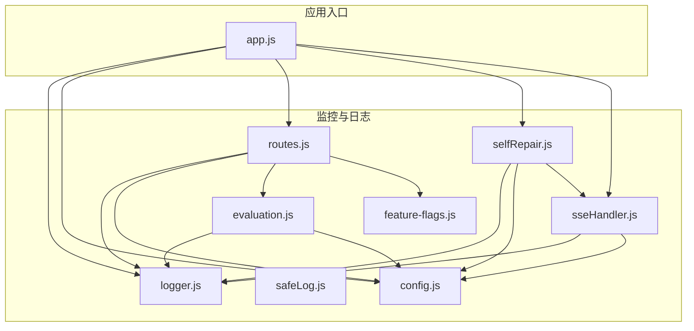
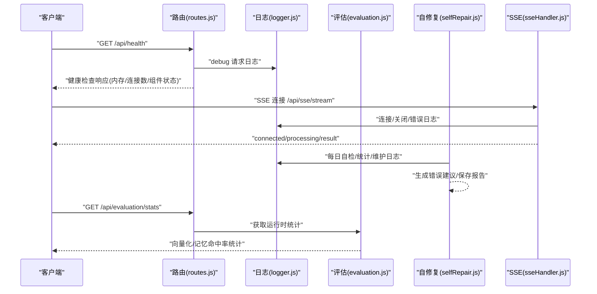
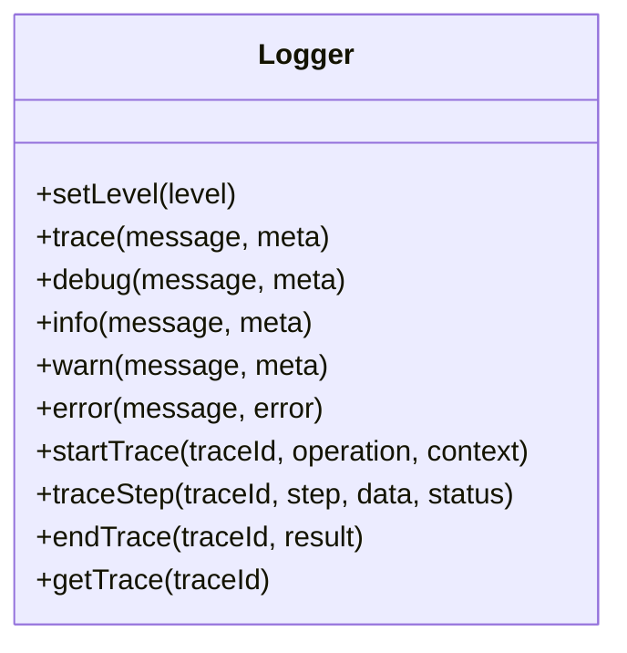
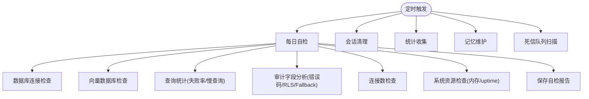
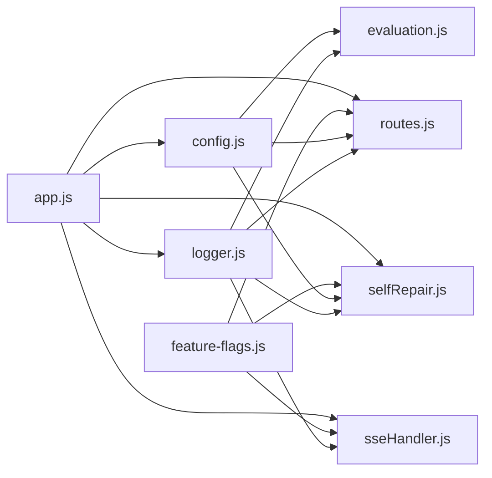

# 监控与日志

<cite>
**本文引用的文件**
- [logger.js](file://backend/src/utils/logger.js)
- [safeLog.js](file://backend/src/utils/safeLog.js)
- [config.js](file://backend/src/core/config.js)
- [routes.js](file://backend/src/core/routes.js)
- [selfRepair.js](file://backend/src/core/selfRepair.js)
- [evaluation.js](file://backend/src/utils/evaluation.js)
- [sseHandler.js](file://backend/src/core/sseHandler.js)
- [app.js](file://backend/src/app.js)
- [feature-flags.js](file://backend/config/feature-flags.js)
- [business-semantic-layer.json](file://backend/config/business-semantic-layer.json)
- [package.json](file://backend/package.json)
</cite>

## 目录
1. [简介](#简介)
2. [项目结构](#项目结构)
3. [核心组件](#核心组件)
4. [架构总览](#架构总览)
5. [详细组件分析](#详细组件分析)
6. [依赖分析](#依赖分析)
7. [性能考虑](#性能考虑)
8. [故障排查指南](#故障排查指南)
9. [结论](#结论)
10. [附录](#附录)

## 简介
本文件为 NL2SQL 系统的监控与日志管理指南，面向运维工程师，覆盖以下主题：
- 监控指标体系：性能指标、业务指标、错误率监控等的定义与计算方法
- 日志收集与分析策略：结构化日志格式、日志级别管理、日志轮转等
- 实时监控仪表板配置与使用：查询成功率、响应时间、内存使用等图表
- 告警机制配置：阈值设置、告警规则、通知渠道
- 日志分析工具使用：日志聚合、搜索、可视化
- 监控数据的存储与备份策略

## 项目结构
NL2SQL 后端采用模块化组织，监控与日志相关的关键模块如下：
- 日志工具：统一日志记录、级别控制、文件轮转、追踪上下文
- 配置中心：集中管理日志、性能、安全、评估等配置
- 健康检查与自修复：系统健康状态、慢查询、错误统计、定期维护
- SSE 处理器：连接数统计、流式进度与结果推送
- 评估模块：向量化质量与记忆命中率统计
- 路由与中间件：统一请求日志、健康检查接口

**图示来源**
- [app.js:1-279](file://backend/src/app.js#L1-L279)
- [logger.js:1-482](file://backend/src/utils/logger.js#L1-L482)
- [config.js:1-439](file://backend/src/core/config.js#L1-L439)
- [routes.js:1-1099](file://backend/src/core/routes.js#L1-L1099)
- [selfRepair.js:1-641](file://backend/src/core/selfRepair.js#L1-L641)
- [evaluation.js:1-488](file://backend/src/utils/evaluation.js#L1-L488)
- [sseHandler.js:1-688](file://backend/src/core/sseHandler.js#L1-L688)
- [feature-flags.js:1-294](file://backend/config/feature-flags.js#L1-L294)

**章节来源**
- [app.js:1-279](file://backend/src/app.js#L1-L279)
- [config.js:1-439](file://backend/src/core/config.js#L1-L439)

## 核心组件
- 日志工具（logger.js）
  - 支持控制台与文件输出、多级别日志、结构化消息格式、日志轮转、追踪上下文
  - 提供 trace/debug/info/warn/error 等便捷方法，并支持事件监听
- 安全日志（safeLog.js）
  - 提供 Prompt/Query 摘要与哈希，避免明文敏感信息写入日志
  - 支持通过环境变量临时开启完整日志（仅开发环境）
- 配置中心（config.js）
  - 集中管理日志级别、文件路径、轮转参数、慢查询阈值、评估开关等
  - 提供配置验证，确保关键参数（如 LLM API Key、SR 数据库 URL）存在
- 健康检查与自修复（selfRepair.js）
  - 定时任务：每日自检、会话清理、统计收集、记忆维护、死信队列扫描
  - 自检报告包含数据库、向量库、查询统计、连接数、系统资源等
  - 错误码分组统计与可操作建议生成
- 评估模块（evaluation.js）
  - 向量化质量评估：Schema 表检索精度、召回率、F1 分数
  - 查询相似度评估：余弦相似度计算
  - 长期记忆命中率统计：总体命中率与按类型细分
- SSE 处理器（sseHandler.js）
  - SSE 连接管理、消息广播、进度回调、连接数统计
  - 查询处理流程（Agentic/Legacy）与回退逻辑
- 路由与中间件（routes.js）
  - 统一请求日志中间件
  - 健康检查接口（基础/详细），包含内存使用、连接数等指标
  - 评估统计接口（运行时统计、重置）

**章节来源**
- [logger.js:1-482](file://backend/src/utils/logger.js#L1-L482)
- [safeLog.js:1-71](file://backend/src/utils/safeLog.js#L1-L71)
- [config.js:1-439](file://backend/src/core/config.js#L1-L439)
- [selfRepair.js:1-641](file://backend/src/core/selfRepair.js#L1-L641)
- [evaluation.js:1-488](file://backend/src/utils/evaluation.js#L1-L488)
- [sseHandler.js:1-688](file://backend/src/core/sseHandler.js#L1-L688)
- [routes.js:1-1099](file://backend/src/core/routes.js#L1-L1099)

## 架构总览
系统监控与日志架构围绕“统一日志 + 配置驱动 + 自修复 + 评估统计 + SSE 连接监控”展开。

**图示来源**
- [routes.js:74-139](file://backend/src/core/routes.js#L74-L139)
- [logger.js:246-264](file://backend/src/utils/logger.js#L246-L264)
- [selfRepair.js:215-427](file://backend/src/core/selfRepair.js#L215-L427)
- [evaluation.js:397-407](file://backend/src/utils/evaluation.js#L397-L407)
- [sseHandler.js:49-120](file://backend/src/core/sseHandler.js#L49-L120)

## 详细组件分析

### 日志系统（logger.js）
- 日志级别与输出
  - 级别：TRACE > DEBUG > INFO > WARN > ERROR
  - 控制台彩色输出与文件输出分离，支持结构化 JSON 元数据
- 日志轮转
  - 基于文件大小阈值与历史文件数量，自动轮转与清理
- 追踪上下文
  - 支持 startTrace/traceStep/endTrace，记录流程耗时与步骤状态
  - 定时清理僵尸追踪条目，防止内存泄漏
- 事件监听
  - 触发 'log' 事件，便于外部订阅与上报

**图示来源**
- [logger.js:54-467](file://backend/src/utils/logger.js#L54-L467)

**章节来源**
- [logger.js:1-482](file://backend/src/utils/logger.js#L1-L482)

### 安全日志（safeLog.js）
- Prompt/Query 摘要与哈希
  - hashPrompt：对文本计算哈希，用于日志中区分不同 Prompt
  - summarizePrompt：返回长度、哈希及首尾片段摘要
- 完整日志开关
  - 通过环境变量临时开启完整输出，仅限开发环境

**章节来源**
- [safeLog.js:1-71](file://backend/src/utils/safeLog.js#L1-L71)

### 配置中心（config.js）
- 日志配置
  - 日志级别、文件路径、控制台/文件输出开关、轮转阈值与历史文件数
- 性能与安全
  - 慢查询阈值、查询超时、最大返回行数、禁止关键字、白名单
- 评估与记忆
  - 评估开关、阈值、长期记忆阈值与保留策略
- 自修复
  - Cron 表达式、会话清理间隔、慢查询阈值

**章节来源**
- [config.js:236-272](file://backend/src/core/config.js#L236-L272)

### 健康检查与自修复（selfRepair.js）
- 定时任务
  - 每日自检：数据库、向量库、查询统计、连接数、系统资源
  - 会话清理：过期会话归档
  - 统计收集：连接数、内存使用（debug 级别）
  - 记忆维护：压缩与健康报告
  - 死信队列扫描：待处理记录告警
- 错误统计与建议
  - 按 error_code 分组统计，生成可操作建议
- 报告持久化
  - 将自检报告写入系统日志表

**图示来源**
- [selfRepair.js:65-143](file://backend/src/core/selfRepair.js#L65-L143)
- [selfRepair.js:215-427](file://backend/src/core/selfRepair.js#L215-L427)

**章节来源**
- [selfRepair.js:1-641](file://backend/src/core/selfRepair.js#L1-L641)

### 评估模块（evaluation.js）
- 向量化质量评估
  - Schema 表检索：精确率、召回率、F1 分数、Top1 正确率
  - 查询相似度：余弦相似度与平均误差
- 长期记忆命中率
  - 总体命中率与按类型（字段别名、查询模式、指标偏好、维度偏好）细分
- 运行时统计
  - 距离分布、命中/未命中计数
- 接口
  - 获取统计报告、重置统计、默认测试集

**章节来源**
- [evaluation.js:1-488](file://backend/src/utils/evaluation.js#L1-L488)

### SSE 处理器（sseHandler.js）
- 连接管理
  - 建立连接、关闭处理、错误处理、连接数统计
- 查询处理
  - Agentic/Legacy 引擎选择与回退
  - 进度回调、结果广播、错误推送
- 澄清回答处理
  - 基于父消息元数据恢复处理流程

**章节来源**
- [sseHandler.js:1-688](file://backend/src/core/sseHandler.js#L1-L688)

### 路由与中间件（routes.js）
- 请求日志中间件
  - 记录 method/path、查询参数、IP
- 健康检查
  - 基础：状态、时间戳、版本、运行时长
  - 详细：数据库、LLM、Schema、SSE 连接状态
- 评估接口
  - 获取运行时统计、重置统计

**章节来源**
- [routes.js:48-96](file://backend/src/core/routes.js#L48-L96)
- [routes.js:102-139](file://backend/src/core/routes.js#L102-L139)
- [routes.js:728-762](file://backend/src/core/routes.js#L728-L762)

## 依赖分析
- 模块耦合
  - logger 作为通用依赖被 routes、selfRepair、sseHandler、evaluation 等广泛使用
  - config 为配置中心，被 app、routes、selfRepair、evaluation 等模块读取
  - feature-flags 与 config 协同影响运行行为（如 Agentic 引擎、RLS、脱敏等）
- 外部依赖
  - Node.js 内置模块（events、fs、path、http、cron）
  - 第三方库（express、body-parser、cors、mysql2、sqlite3、vectordb 等）

**图示来源**
- [app.js:40-52](file://backend/src/app.js#L40-L52)
- [routes.js:18-31](file://backend/src/core/routes.js#L18-L31)
- [selfRepair.js:15-26](file://backend/src/core/selfRepair.js#L15-L26)
- [evaluation.js:12-13](file://backend/src/utils/evaluation.js#L12-L13)
- [feature-flags.js:1-294](file://backend/config/feature-flags.js#L1-L294)

**章节来源**
- [app.js:1-279](file://backend/src/app.js#L1-L279)
- [package.json:16-28](file://backend/package.json#L16-L28)

## 性能考虑
- 日志性能
  - 文件轮转基于阈值判断，避免过大文件；建议合理设置 maxSize 与 maxFiles
  - 追踪上下文容量与超时清理，防止内存膨胀
- 查询性能
  - 慢查询阈值（config.selfRepair.slowQueryThreshold）与查询超时（config.security.queryTimeout）共同约束
  - 白名单与禁止关键字减少潜在风险与无效查询
- 内存使用
  - 健康检查中监控 heapUsed/heapTotal，建议在高负载时降低日志级别或调整轮转策略
- SSE 连接
  - 连接数统计用于容量规划，结合 Nginx 配置禁用缓冲以提升实时性

[本节为通用指导，无需特定文件引用]

## 故障排查指南
- 健康检查失败
  - 使用 /api/health/detail 查看组件状态与连接数
  - 关注数据库、LLM、Schema、SSE 组件状态
- 错误统计与建议
  - 自修复每日自检生成错误码分组统计与建议
  - 关键错误码：SR_DB_NOT_READY、SR_DB_NOT_CONFIGURED、SR_EXEC_ERROR、VALIDATION_ERROR、RLS_REWRITE_FAILED、LLM_ERROR、PIPELINE_ERROR
- 日志定位
  - 使用日志级别过滤（info/warn/error），结合 trace 上下文定位流程
  - 安全日志工具避免敏感信息泄露
- SSE 连接问题
  - 检查连接建立/关闭日志，确认 hasActiveConnection 与 pushError 的行为
  - 关注并发处理互斥与错误推送

**章节来源**
- [routes.js:102-139](file://backend/src/core/routes.js#L102-L139)
- [selfRepair.js:193-209](file://backend/src/core/selfRepair.js#L193-L209)
- [logger.js:331-343](file://backend/src/utils/logger.js#L331-L343)
- [safeLog.js:62-64](file://backend/src/utils/safeLog.js#L62-L64)
- [sseHandler.js:127-162](file://backend/src/core/sseHandler.js#L127-L162)

## 结论
NL2SQL 系统通过统一日志、配置驱动、自修复与评估统计构建了完善的监控与日志体系。运维工程师可基于健康检查、错误统计、SSE 连接数与评估报告进行实时监控与故障排查，并通过合理的日志级别与轮转策略平衡可观测性与性能。

[本节为总结，无需特定文件引用]

## 附录

### 监控指标定义与计算方法
- 查询成功率
  - 计算周期内成功查询数 / 总查询数
  - 数据来源：自修复每日自检中的查询统计
- 响应时间
  - 平均查询时间（ms）与慢查询（> 阈值）占比
  - 数据来源：自修复每日自检与健康检查接口
- 内存使用
  - heapUsed/heapTotal（MB），RSS（MB），uptime（秒）
  - 数据来源：健康检查接口与自修复统计收集
- SSE 连接数
  - 活跃连接总数与按会话统计
  - 数据来源：SSE 处理器连接映射与统计函数
- 评估指标
  - 向量化质量：精确率、召回率、F1 分数、Top1 正确率
  - 长期记忆命中率：总体命中率与按类型细分
  - 数据来源：评估模块运行时统计与报告接口

**章节来源**
- [selfRepair.js:264-292](file://backend/src/core/selfRepair.js#L264-L292)
- [routes.js:86-91](file://backend/src/core/routes.js#L86-L91)
- [evaluation.js:344-391](file://backend/src/utils/evaluation.js#L344-L391)

### 日志收集与分析策略
- 结构化日志格式
  - 时间戳、级别、消息、JSON 元数据（含错误堆栈）
- 日志级别管理
  - 开发环境建议较低级别（debug/trace），生产环境建议 info/warn/error
- 日志轮转
  - 基于文件大小阈值与历史文件数量，自动轮转与清理
- 日志脱敏
  - 使用安全日志工具对 Prompt/Query 进行摘要与哈希
- 日志事件监听
  - 订阅 'log' 事件，接入外部日志平台或告警系统

**章节来源**
- [logger.js:188-200](file://backend/src/utils/logger.js#L188-L200)
- [logger.js:246-264](file://backend/src/utils/logger.js#L246-L264)
- [safeLog.js:20-56](file://backend/src/utils/safeLog.js#L20-L56)

### 实时监控仪表板配置与使用
- 健康检查接口
  - /api/health：基础健康状态与内存使用
  - /api/health/detail：组件状态与 SSE 连接数
- 评估统计接口
  - /api/evaluation/stats：获取运行时统计报告
  - /api/evaluation/stats/reset：重置统计数据
- SSE 连接监控
  - 通过 SSE 处理器统计函数获取连接数与会话连接数

**章节来源**
- [routes.js:74-139](file://backend/src/core/routes.js#L74-L139)
- [routes.js:728-762](file://backend/src/core/routes.js#L728-L762)
- [sseHandler.js:626-664](file://backend/src/core/sseHandler.js#L626-L664)

### 告警机制配置
- 阈值设置
  - 慢查询阈值：config.selfRepair.slowQueryThreshold
  - 查询超时：config.security.queryTimeout
  - 内存使用阈值：自修复中基于 heapUsed/heapTotal 的百分比
- 告警规则
  - 失败率过高（示例：>10%）、慢查询偏多、内存使用过高、死信队列积压
- 通知渠道
  - 通过订阅 'log' 事件或读取自检报告，接入企业告警平台

**章节来源**
- [config.js:270-271](file://backend/src/core/config.js#L270-L271)
- [selfRepair.js:288-337](file://backend/src/core/selfRepair.js#L288-L337)

### 日志分析工具使用
- 日志聚合与搜索
  - 基于结构化 JSON 元数据进行字段过滤与聚合
- 可视化
  - 将健康检查、评估统计、自检报告导入可视化平台
- 建议
  - 使用日志平台的 traceId 关联同一请求的多条日志

**章节来源**
- [logger.js:352-448](file://backend/src/utils/logger.js#L352-L448)
- [routes.js:728-762](file://backend/src/core/routes.js#L728-L762)
- [selfRepair.js:434-448](file://backend/src/core/selfRepair.js#L434-L448)

### 监控数据的存储与备份策略
- 自检报告
  - 保存至系统日志表，便于历史追溯与报表生成
- 评估统计
  - 运行时内存统计，支持重置与导出报告
- 建议
  - 定期备份系统日志表与评估统计快照，制定保留策略

**章节来源**
- [selfRepair.js:434-448](file://backend/src/core/selfRepair.js#L434-L448)
- [evaluation.js:412-429](file://backend/src/utils/evaluation.js#L412-L429)