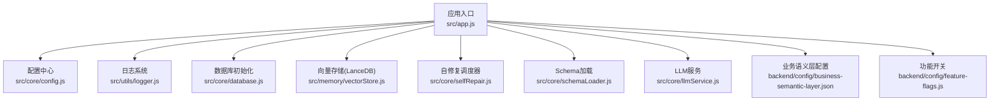
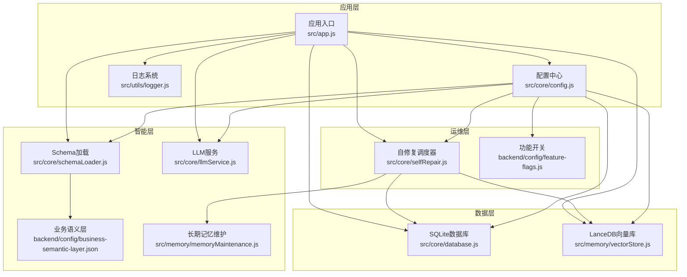
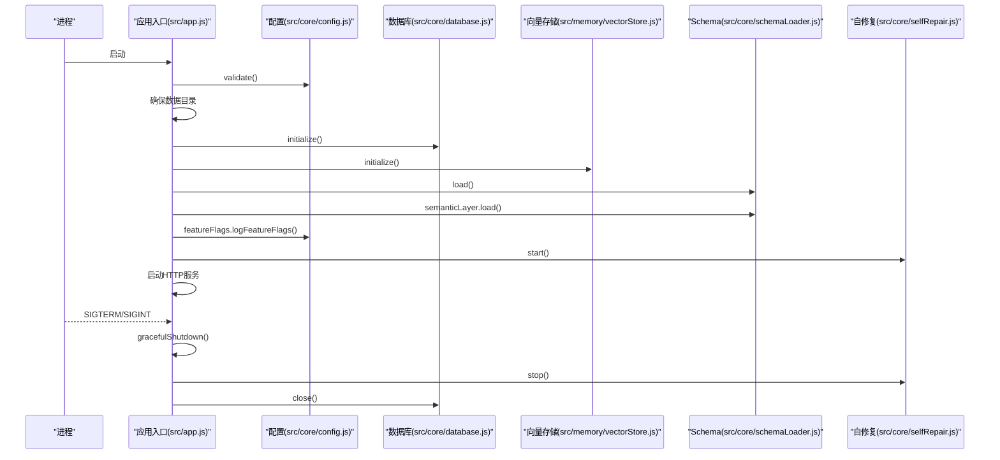
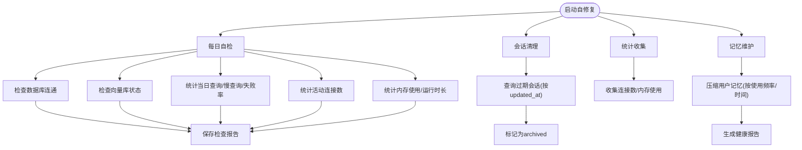
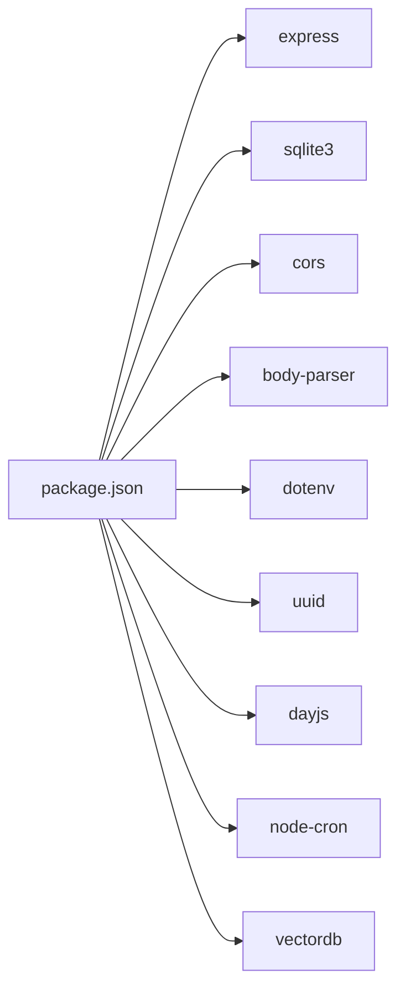

# 运维操作

<cite>
**本文引用的文件**
- [backend/package.json](file://backend/package.json)
- [backend/src/app.js](file://backend/src/app.js)
- [backend/src/core/config.js](file://backend/src/core/config.js)
- [backend/src/utils/logger.js](file://backend/src/utils/logger.js)
- [backend/src/core/database.js](file://backend/src/core/database.js)
- [backend/src/core/selfRepair.js](file://backend/src/core/selfRepair.js)
- [backend/src/memory/vectorStore.js](file://backend/src/memory/vectorStore.js)
- [backend/src/core/schemaLoader.js](file://backend/src/core/schemaLoader.js)
- [backend/src/memory/memoryMaintenance.js](file://backend/src/memory/memoryMaintenance.js)
- [backend/src/core/llmService.js](file://backend/src/core/llmService.js)
- [backend/config/business-semantic-layer.json](file://backend/config/business-semantic-layer.json)
- [backend/config/feature-flags.js](file://backend/config/feature-flags.js)
</cite>

## 目录
1. [简介](#简介)
2. [项目结构](#项目结构)
3. [核心组件](#核心组件)
4. [架构总览](#架构总览)
5. [详细组件分析](#详细组件分析)
6. [依赖分析](#依赖分析)
7. [性能考虑](#性能考虑)
8. [故障排查指南](#故障排查指南)
9. [结论](#结论)
10. [附录](#附录)

## 简介
本运维手册面向NL2SQL项目的后端服务，覆盖日常巡检、数据备份、性能优化、安全检查、定期维护、故障处理流程、升级与回滚策略、运维脚本与自动化工具使用，以及最佳实践与常见问题解答。文档基于仓库中的实际代码与配置进行梳理，确保可操作性与可追溯性。

## 项目结构
后端采用Node.js + Express，核心模块包括：
- 应用入口与生命周期管理
- 配置中心与环境变量
- 日志系统
- SQLite会话与查询历史持久化
- LanceDB向量数据库（Schema与查询历史向量化）
- 自修复与定时任务
- LLM服务与Embedding
- Schema元数据加载与业务语义层
- 长期记忆维护

图表来源
- [backend/src/app.js:1-266](file://backend/src/app.js#L1-L266)
- [backend/src/core/config.js:1-398](file://backend/src/core/config.js#L1-L398)
- [backend/src/utils/logger.js:1-482](file://backend/src/utils/logger.js#L1-L482)
- [backend/src/core/database.js:1-800](file://backend/src/core/database.js#L1-L800)
- [backend/src/memory/vectorStore.js:1-800](file://backend/src/memory/vectorStore.js#L1-L800)
- [backend/src/core/selfRepair.js:1-489](file://backend/src/core/selfRepair.js#L1-L489)
- [backend/src/core/schemaLoader.js:1-800](file://backend/src/core/schemaLoader.js#L1-L800)
- [backend/src/core/llmService.js:1-477](file://backend/src/core/llmService.js#L1-L477)
- [backend/config/business-semantic-layer.json:1-189](file://backend/config/business-semantic-layer.json#L1-L189)
- [backend/config/feature-flags.js:1-249](file://backend/config/feature-flags.js#L1-L249)

章节来源
- [backend/src/app.js:1-266](file://backend/src/app.js#L1-L266)

## 核心组件
- 应用入口与生命周期
  - 负责加载环境变量、初始化各模块、挂载路由、启动HTTP与SSE、优雅关闭。
  - 关键点：进程信号处理、未捕获异常与Promise拒绝的兜底。
- 配置中心
  - 统一读取环境变量，提供LLM、Embedding、数据库、安全、日志、自修复、Schema、长期记忆、上下文管理、评估等配置。
  - 启动时进行必要配置校验。
- 日志系统
  - 控制台彩色输出与文件轮转，支持TRACE/DEBUG/INFO/WARN/ERROR多级，具备追踪上下文能力。
- 数据库
  - SQLite会话与查询历史持久化，提供事务、迁移、清理重复偏好等能力。
- 向量存储
  - LanceDB封装，提供Schema与查询历史向量的增删改查、统计、智能搜索与重排序。
- 自修复与定时任务
  - 每日自检、会话清理、统计收集、记忆维护等定时任务。
- LLM服务
  - 统一封装HTTP请求、重试、超时、流式响应、Embedding获取。
- Schema与业务语义层
  - Schema元数据加载、向量化、语义搜索、SQL安全校验、业务概念映射。
- 长期记忆维护
  - 基于使用频率与时间的分级保留策略，定期压缩与清理。

章节来源
- [backend/src/app.js:93-194](file://backend/src/app.js#L93-L194)
- [backend/src/core/config.js:366-398](file://backend/src/core/config.js#L366-L398)
- [backend/src/utils/logger.js:54-482](file://backend/src/utils/logger.js#L54-L482)
- [backend/src/core/database.js:206-404](file://backend/src/core/database.js#L206-L404)
- [backend/src/memory/vectorStore.js:233-324](file://backend/src/memory/vectorStore.js#L233-L324)
- [backend/src/core/selfRepair.js:60-125](file://backend/src/core/selfRepair.js#L60-L125)
- [backend/src/core/llmService.js:41-152](file://backend/src/core/llmService.js#L41-L152)
- [backend/src/core/schemaLoader.js:75-131](file://backend/src/core/schemaLoader.js#L75-L131)
- [backend/src/memory/memoryMaintenance.js:69-120](file://backend/src/memory/memoryMaintenance.js#L69-L120)

## 架构总览
NL2SQL后端通过配置中心统一管理运行参数，应用入口负责模块初始化与服务启动；日志系统贯穿全链路；数据库与向量存储分别承载结构化数据与语义检索；自修复模块保障系统健康；LLM服务提供对话与Embedding能力；Schema与业务语义层支撑自然语言到SQL的生成与优化。

图表来源
- [backend/src/app.js:1-266](file://backend/src/app.js#L1-L266)
- [backend/src/core/config.js:1-398](file://backend/src/core/config.js#L1-L398)
- [backend/src/utils/logger.js:1-482](file://backend/src/utils/logger.js#L1-L482)
- [backend/src/core/database.js:1-800](file://backend/src/core/database.js#L1-L800)
- [backend/src/memory/vectorStore.js:1-800](file://backend/src/memory/vectorStore.js#L1-L800)
- [backend/src/core/selfRepair.js:1-489](file://backend/src/core/selfRepair.js#L1-L489)
- [backend/src/core/schemaLoader.js:1-800](file://backend/src/core/schemaLoader.js#L1-L800)
- [backend/src/core/llmService.js:1-477](file://backend/src/core/llmService.js#L1-L477)
- [backend/src/memory/memoryMaintenance.js:1-421](file://backend/src/memory/memoryMaintenance.js#L1-L421)
- [backend/config/business-semantic-layer.json:1-189](file://backend/config/business-semantic-layer.json#L1-L189)
- [backend/config/feature-flags.js:1-249](file://backend/config/feature-flags.js#L1-L249)

## 详细组件分析

### 应用入口与生命周期
- 初始化顺序：配置校验 → 数据目录创建 → SQLite初始化 → LanceDB初始化 → Schema加载 → 业务语义层加载 → 功能开关打印 → 自修复调度器启动 → HTTP服务启动。
- 优雅关闭：停止接受新连接、关闭SSE、停止定时任务、关闭数据库、退出进程。
- 信号处理：SIGTERM/SIGINT触发优雅关闭；未捕获异常与Promise拒绝记录并触发关闭。

图表来源
- [backend/src/app.js:97-194](file://backend/src/app.js#L97-L194)
- [backend/src/core/config.js:366-398](file://backend/src/core/config.js#L366-L398)
- [backend/src/core/database.js:206-267](file://backend/src/core/database.js#L206-L267)
- [backend/src/memory/vectorStore.js:233-263](file://backend/src/memory/vectorStore.js#L233-L263)
- [backend/src/core/schemaLoader.js:75-131](file://backend/src/core/schemaLoader.js#L75-L131)
- [backend/src/core/selfRepair.js:131-159](file://backend/src/core/selfRepair.js#L131-L159)

章节来源
- [backend/src/app.js:97-194](file://backend/src/app.js#L97-L194)

### 配置中心与环境变量
- 关键配置项：端口、运行环境、LLM API基础地址/密钥/模型/超时/重试、Embedding模型/维度/超时、SQLite/LanceDB路径、SR数据库URL与连接池、安全白名单/禁止关键字/行数限制/超时、会话过期与清理间隔、日志级别/文件/轮转、自修复开关/Cron/阈值、Schema缓存/重向量化、长期记忆保留策略、上下文管理、评估开关。
- 启动校验：LLM API密钥与SR数据库URL必填；白名单为空给出警告。

章节来源
- [backend/src/core/config.js:16-398](file://backend/src/core/config.js#L16-L398)

### 日志系统
- 多级日志：TRACE/DEBUG/INFO/WARN/ERROR，控制台彩色输出与文件轮转（大小与文件数限制）。
- 追踪上下文：支持traceId会话、步骤记录、僵尸条目清理、最终汇总。
- 统计收集：定时任务收集连接数与内存使用。

章节来源
- [backend/src/utils/logger.js:54-482](file://backend/src/utils/logger.js#L54-L482)
- [backend/src/core/selfRepair.js:425-445](file://backend/src/core/selfRepair.js#L425-L445)

### 数据库（SQLite）
- 表结构：sessions/messages/query_history/user_preferences/system_logs。
- 索引：加速用户、状态、时间、类型等查询。
- 迁移：重建user_preferences表以移除UNIQUE约束，清理重复偏好与错误映射。
- 事务：提供事务封装，保证一致性。
- 会话与偏好：创建/查询/更新/删除会话，添加/查询/更新偏好，获取常用模板与字段别名。

章节来源
- [backend/src/core/database.js:39-195](file://backend/src/core/database.js#L39-L195)
- [backend/src/core/database.js:277-404](file://backend/src/core/database.js#L277-L404)
- [backend/src/core/database.js:499-513](file://backend/src/core/database.js#L499-L513)
- [backend/src/core/database.js:526-608](file://backend/src/core/database.js#L526-L608)
- [backend/src/core/database.js:677-783](file://backend/src/core/database.js#L677-L783)

### 向量存储（LanceDB）
- 初始化：连接数据库、打开/创建schema_vectors与query_vectors表。
- Schema向量：表级表征文本构建、Embedding获取、upsert/搜索/统计。
- 查询历史向量：添加/搜索相似查询。
- 智能搜索：基于查询意图识别与元数据过滤，动态重排序，降低报表优先级，强调原始日志表。

章节来源
- [backend/src/memory/vectorStore.js:233-324](file://backend/src/memory/vectorStore.js#L233-L324)
- [backend/src/memory/vectorStore.js:338-437](file://backend/src/memory/vectorStore.js#L338-L437)
- [backend/src/memory/vectorStore.js:619-687](file://backend/src/memory/vectorStore.js#L619-L687)
- [backend/src/memory/vectorStore.js:452-576](file://backend/src/memory/vectorStore.js#L452-L576)

### 自修复与定时任务
- 任务清单：每日自检（数据库/向量库/查询统计/连接数/系统资源）、会话清理（过期归档）、统计收集（连接数/内存）、记忆维护（压缩/清理/报告）。
- 手动触发：每日自检、会话清理、记忆维护。
- 每日自检报告：保存至system_logs表。

图表来源
- [backend/src/core/selfRepair.js:60-125](file://backend/src/core/selfRepair.js#L60-L125)
- [backend/src/core/selfRepair.js:169-310](file://backend/src/core/selfRepair.js#L169-L310)
- [backend/src/core/selfRepair.js:341-373](file://backend/src/core/selfRepair.js#L341-L373)
- [backend/src/core/selfRepair.js:425-445](file://backend/src/core/selfRepair.js#L425-L445)
- [backend/src/core/selfRepair.js:383-415](file://backend/src/core/selfRepair.js#L383-L415)

章节来源
- [backend/src/core/selfRepair.js:60-125](file://backend/src/core/selfRepair.js#L60-L125)

### LLM服务与Embedding
- HTTP封装：统一POST请求、超时、错误处理、JSON解析与截断检测。
- 重试机制：指数退避或固定间隔重试，支持最大重试次数。
- 聊天与Embedding：支持流式响应与批量向量获取，记录耗时与用量。

章节来源
- [backend/src/core/llmService.js:41-152](file://backend/src/core/llmService.js#L41-L152)
- [backend/src/core/llmService.js:222-308](file://backend/src/core/llmService.js#L222-L308)
- [backend/src/core/llmService.js:369-424](file://backend/src/core/llmService.js#L369-L424)

### Schema与业务语义层
- Schema加载：校验格式、构建表/字段映射、缓存时间戳、向量化（可增量更新）。
- 语义搜索：增强查询文本（含datasource/gameId平台推断），智能重排序，过滤报表优先级。
- SQL安全校验：禁止关键字、白名单表名检查。
- 业务语义层：将“老平台/新平台”等业务概念映射到物理表/字段，支持示例与优先级。

章节来源
- [backend/src/core/schemaLoader.js:75-131](file://backend/src/core/schemaLoader.js#L75-L131)
- [backend/src/core/schemaLoader.js:210-285](file://backend/src/core/schemaLoader.js#L210-L285)
- [backend/src/core/schemaLoader.js:571-710](file://backend/src/core/schemaLoader.js#L571-L710)
- [backend/src/core/schemaLoader.js:723-759](file://backend/src/core/schemaLoader.js#L723-L759)
- [backend/config/business-semantic-layer.json:1-189](file://backend/config/business-semantic-layer.json#L1-L189)

### 长期记忆维护
- 清理规则：高频（≥10次）永久保留；中频（3-9次）90天未用清理；低频（<3次）30天未用清理；字段别名365天未用清理；置顶记忆不清理。
- 合并相似模式：维度/指标重合度阈值合并，保留使用次数。
- 健康报告：统计总数、按类型分布、预估清理量。

章节来源
- [backend/src/memory/memoryMaintenance.js:69-120](file://backend/src/memory/memoryMaintenance.js#L69-L120)
- [backend/src/memory/memoryMaintenance.js:207-315](file://backend/src/memory/memoryMaintenance.js#L207-L315)
- [backend/src/memory/memoryMaintenance.js:361-401](file://backend/src/memory/memoryMaintenance.js#L361-L401)

## 依赖分析
- 运行时依赖：Express、CORS、Body-Parser、SQLite3、dotenv、uuid、dayjs、node-cron、vectordb。
- 启动脚本：dev使用nodemon热重载，start使用node常驻。
- 关键外部集成：LLM API（兼容OpenAI格式）、LanceDB向量库。

图表来源
- [backend/package.json:1-28](file://backend/package.json#L1-L28)

章节来源
- [backend/package.json:1-28](file://backend/package.json#L1-L28)

## 性能考虑
- 查询性能
  - 索引：sessions/messages/query_history/system_logs表均建立关键列索引，加速筛选与排序。
  - 慢查询阈值：自修复配置中定义慢查询阈值，用于每日自检告警。
  - SQL安全：禁止DDL/危险关键字，限制返回行数与查询超时，避免大查询导致资源耗尽。
- 向量检索
  - 表级向量表示，减少向量规模；智能搜索结合意图识别与元数据过滤，降低无效召回。
  - 向量维度与Embedding超时可配置，避免大模型请求阻塞。
- 内存与资源
  - 定时统计连接数与内存使用，内存占用过高时建议重启或优化。
- I/O与存储
  - 日志文件轮转，避免单文件过大；SQLite WAL/外键约束开启，保证一致性与可靠性。

章节来源
- [backend/src/core/database.js:39-195](file://backend/src/core/database.js#L39-L195)
- [backend/src/core/config.js:222-231](file://backend/src/core/config.js#L222-L231)
- [backend/src/core/config.js:150-170](file://backend/src/core/config.js#L150-L170)
- [backend/src/core/selfRepair.js:268-284](file://backend/src/core/selfRepair.js#L268-L284)
- [backend/src/memory/vectorStore.js:452-576](file://backend/src/memory/vectorStore.js#L452-L576)

## 故障排查指南

### 故障分类与应急响应
- 启动失败
  - 配置缺失：LLM API密钥或SR数据库URL未设置；白名单为空发出警告。
  - 数据库/向量库初始化失败：检查路径权限与网络连通。
  - 应急：查看应用日志，确认配置项；临时关闭自修复或功能开关定位问题。
- 运行时异常
  - 未捕获异常/未处理Promise拒绝：触发优雅关闭，检查日志堆栈。
  - LLM API超时/错误：检查API密钥、网络、超时与重试配置。
  - 向量库不可用：记录警告，功能降级为关键词匹配。
- 性能问题
  - 慢查询/高内存：查看自修复报告与日志统计，优化查询或调整阈值。

章节来源
- [backend/src/core/config.js:366-398](file://backend/src/core/config.js#L366-L398)
- [backend/src/app.js:204-258](file://backend/src/app.js#L204-L258)
- [backend/src/core/llmService.js:167-195](file://backend/src/core/llmService.js#L167-L195)
- [backend/src/memory/vectorStore.js:258-262](file://backend/src/memory/vectorStore.js#L258-L262)

### 恢复步骤
- 优雅关闭：停止接受新连接、关闭SSE、停止定时任务、关闭数据库、退出进程。
- 数据库恢复：若SQLite损坏，检查备份与迁移脚本；必要时重建表结构。
- 向量库恢复：LanceDB目录损坏时，删除重建（注意数据丢失风险）。
- LLM服务：切换备用API端点或临时禁用相关功能。

章节来源
- [backend/src/app.js:204-240](file://backend/src/app.js#L204-L240)
- [backend/src/core/database.js:277-404](file://backend/src/core/database.js#L277-L404)
- [backend/src/memory/vectorStore.js:233-263](file://backend/src/memory/vectorStore.js#L233-L263)

### 事后分析
- 每日自检报告：保存至system_logs表，包含数据库、向量库、查询统计、连接数、内存使用等。
- 日志审计：利用日志级别与追踪上下文定位问题根因。

章节来源
- [backend/src/core/selfRepair.js:317-331](file://backend/src/core/selfRepair.js#L317-L331)
- [backend/src/utils/logger.js:324-448](file://backend/src/utils/logger.js#L324-L448)

## 结论
本运维手册基于NL2SQL后端的实际代码与配置，提供了从日常巡检、数据备份、性能优化、安全检查到定期维护、故障处理、升级回滚与自动化工具使用的完整操作指南。建议在生产环境中严格遵循配置校验、日志轮转、定时维护与功能开关策略，确保系统稳定性与可维护性。

## 附录

### 日常运维任务清单
- 系统巡检
  - 检查应用日志与自修复报告，关注慢查询/失败率/内存使用。
  - 验证数据库与向量库连通性。
- 数据备份
  - SQLite数据库文件与向量库目录定期备份。
- 性能优化
  - 调整慢查询阈值与查询超时；优化Schema索引与查询模式。
- 安全检查
  - 审核ALLOWED_TABLES白名单；定期清理敏感字段；限制危险关键字。

章节来源
- [backend/src/core/selfRepair.js:169-310](file://backend/src/core/selfRepair.js#L169-L310)
- [backend/src/core/database.js:39-195](file://backend/src/core/database.js#L39-L195)
- [backend/src/core/config.js:150-170](file://backend/src/core/config.js#L150-L170)

### 定期维护任务
- 数据库维护
  - 迁移与重复偏好清理；定期分析表统计与索引使用。
- 缓存清理
  - 清理过期会话（归档）；清理低频/中频偏好与字段别名。
- 日志清理
  - 按配置轮转与保留策略清理旧日志。
- 磁盘空间管理
  - 监控SQLite与LanceDB目录大小，清理无用向量与历史日志。

章节来源
- [backend/src/core/database.js:277-404](file://backend/src/core/database.js#L277-L404)
- [backend/src/core/selfRepair.js:341-373](file://backend/src/core/selfRepair.js#L341-L373)
- [backend/src/utils/logger.js:147-179](file://backend/src/utils/logger.js#L147-L179)
- [backend/src/memory/vectorStore.js:788-800](file://backend/src/memory/vectorStore.js#L788-L800)

### 故障处理流程
- 分类：启动失败、运行时异常、性能问题、外部依赖异常。
- 应急：查看日志与自修复报告；临时禁用功能开关；回滚配置。
- 恢复：执行优雅关闭；修复数据库/向量库；重启服务。
- 事后：生成健康报告，复盘并优化配置。

章节来源
- [backend/src/app.js:204-258](file://backend/src/app.js#L204-L258)
- [backend/src/core/selfRepair.js:317-331](file://backend/src/core/selfRepair.js#L317-L331)

### 升级与回滚策略
- 版本升级
  - 更新依赖与配置；逐步启用功能开关；观察自修复报告与日志。
- 配置变更
  - 通过环境变量调整LLM/Embedding/数据库/安全参数；变更后验证启动。
- 数据迁移
  - SQLite迁移脚本与向量库重建策略；SCHEMA_REVECTORIZE强制重新向量化。
- 回滚操作
  - 恢复配置与依赖版本；回滚数据库迁移；禁用相关功能开关。

章节来源
- [backend/package.json:1-28](file://backend/package.json#L1-L28)
- [backend/src/core/config.js:210-250](file://backend/src/core/config.js#L210-L250)
- [backend/src/core/database.js:277-404](file://backend/src/core/database.js#L277-L404)
- [backend/src/memory/vectorStore.js:788-800](file://backend/src/memory/vectorStore.js#L788-L800)
- [backend/config/feature-flags.js:108-121](file://backend/config/feature-flags.js#L108-L121)

### 运维脚本与自动化工具
- 启动方式
  - 开发：使用dev脚本启用nodemon热重载。
  - 生产：使用start脚本常驻运行。
- 定时任务
  - 自修复模块内置Cron任务，无需额外脚本。
- 日志与监控
  - 通过日志系统与自修复统计收集实现自动化监控。

章节来源
- [backend/package.json:6-8](file://backend/package.json#L6-L8)
- [backend/src/core/selfRepair.js:72-82](file://backend/src/core/selfRepair.js#L72-L82)
- [backend/src/utils/logger.js:147-179](file://backend/src/utils/logger.js#L147-L179)

### 运维最佳实践
- 配置管理：集中化配置，环境变量分离，启动前校验。
- 日志规范：合理设置日志级别与轮转，启用追踪上下文。
- 安全基线：启用白名单与关键字过滤，限制返回行数与查询超时。
- 性能治理：定期检查慢查询与内存使用，优化索引与查询模式。
- 备份策略：定期备份SQLite与LanceDB目录，验证恢复流程。
- 功能开关：渐进式启用新功能，紧急时快速回滚。

章节来源
- [backend/src/core/config.js:366-398](file://backend/src/core/config.js#L366-L398)
- [backend/src/utils/logger.js:54-482](file://backend/src/utils/logger.js#L54-L482)
- [backend/src/core/config.js:150-170](file://backend/src/core/config.js#L150-L170)
- [backend/src/core/selfRepair.js:169-310](file://backend/src/core/selfRepair.js#L169-L310)