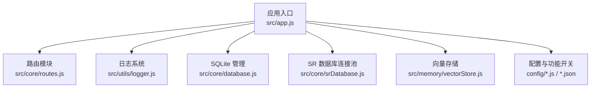
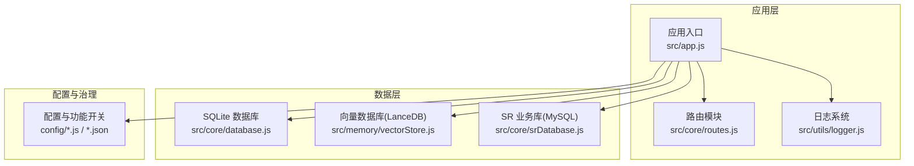
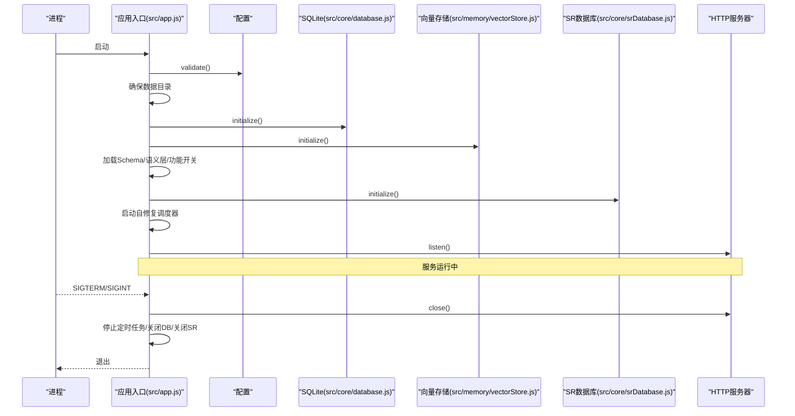
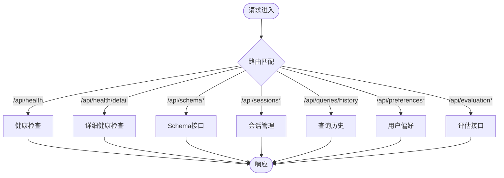
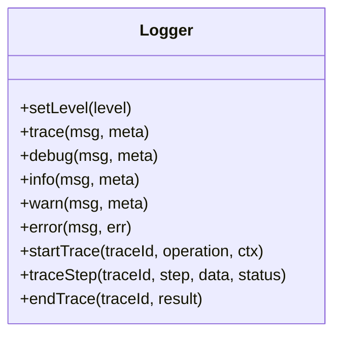
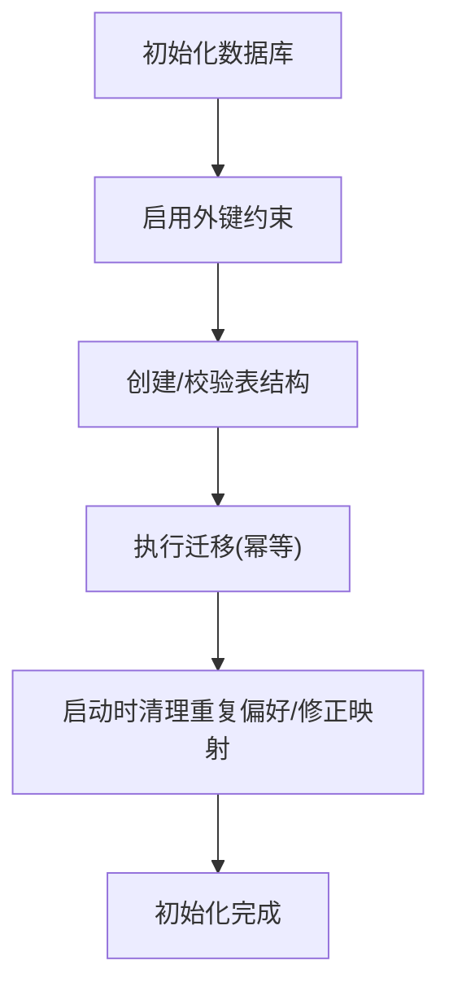
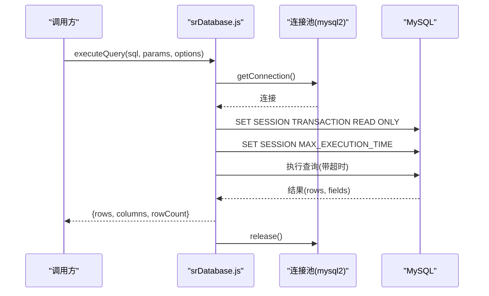
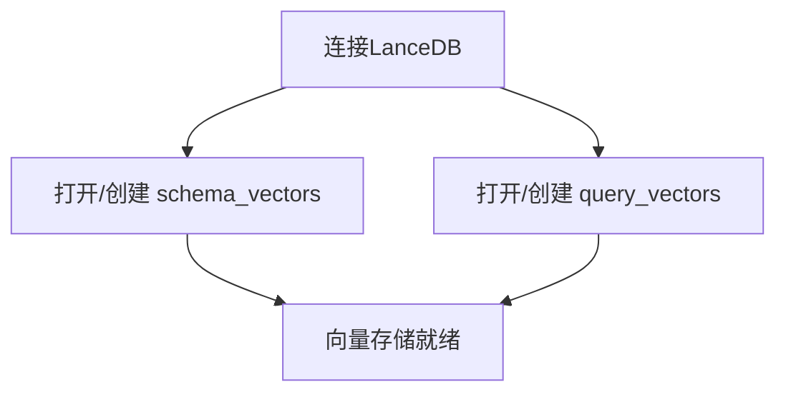
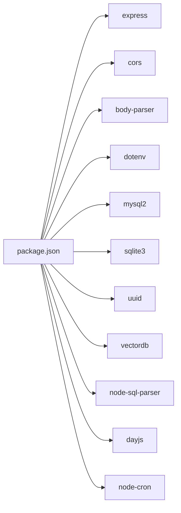

# 部署与运维

<cite>
**本文引用的文件**
- [backend/package.json](file://backend/package.json)
- [backend/src/app.js](file://backend/src/app.js)
- [backend/src/core/routes.js](file://backend/src/core/routes.js)
- [backend/src/utils/logger.js](file://backend/src/utils/logger.js)
- [backend/src/core/database.js](file://backend/src/core/database.js)
- [backend/src/core/srDatabase.js](file://backend/src/core/srDatabase.js)
- [backend/src/memory/vectorStore.js](file://backend/src/memory/vectorStore.js)
- [backend/config/business-semantic-layer.json](file://backend/config/business-semantic-layer.json)
- [backend/config/schema-metadata.json](file://backend/config/schema-metadata.json)
- [backend/config/feature-flags.js](file://backend/config/feature-flags.js)
</cite>

## 目录
1. [简介](#简介)
2. [项目结构](#项目结构)
3. [核心组件](#核心组件)
4. [架构总览](#架构总览)
5. [详细组件分析](#详细组件分析)
6. [依赖分析](#依赖分析)
7. [性能考虑](#性能考虑)
8. [故障排除指南](#故障排除指南)
9. [结论](#结论)
10. [附录](#附录)

## 简介
本文件为 NL2SQL 系统的部署与运维指南，面向运维工程师与系统管理员，覆盖生产环境部署、容器化与负载均衡、SSL 配置、监控与日志、性能优化与容量规划、故障排除与应急响应、以及运维自动化与 DevOps 最佳实践。文档基于仓库中的后端代码与配置进行分析，提供可落地的运维建议。

## 项目结构
NL2SQL 后端采用 Node.js + Express 架构，核心模块包括：
- 应用入口与生命周期管理
- REST API 路由与健康检查
- 日志系统与文件轮转
- SQLite 本地数据库与迁移
- SR 业务数据库连接池（MySQL）
- 向量数据库（LanceDB）与语义检索
- 配置与功能开关（Feature Flags）

图表来源
- [backend/src/app.js:1-279](file://backend/src/app.js#L1-L279)
- [backend/src/core/routes.js:1-1099](file://backend/src/core/routes.js#L1-L1099)
- [backend/src/utils/logger.js:1-482](file://backend/src/utils/logger.js#L1-L482)
- [backend/src/core/database.js:1-1400](file://backend/src/core/database.js#L1-L1400)
- [backend/src/core/srDatabase.js:1-156](file://backend/src/core/srDatabase.js#L1-L156)
- [backend/src/memory/vectorStore.js:1-928](file://backend/src/memory/vectorStore.js#L1-L928)

章节来源
- [backend/src/app.js:1-279](file://backend/src/app.js#L1-L279)
- [backend/src/core/routes.js:1-1099](file://backend/src/core/routes.js#L1-L1099)

## 核心组件
- 应用入口与生命周期
  - 加载环境变量、初始化各模块、启动 HTTP 服务器、SSE 流、优雅关闭与未捕获异常处理。
- 路由与健康检查
  - 提供 /api/health、/api/health/detail、/api/schema、/api/sessions、/api/queries/history、/api/preferences 等端点。
- 日志系统
  - 控制台彩色输出、文件轮转、多级别日志、结构化元数据、执行流程追踪（trace）。
- SQLite 数据库
  - 会话、消息、查询历史、用户偏好、系统日志、记忆失败队列等表；外键约束、索引、幂等迁移。
- SR 业务数据库连接池（MySQL）
  - 懒加载、只读会话、超时控制、失败不阻塞启动。
- 向量存储（LanceDB）
  - Schema 向量与查询向量表、智能搜索、统计与增量更新。
- 配置与功能开关
  - 功能开关集中管理，支持按 Phase 启用/禁用，日志输出开关状态。

章节来源
- [backend/src/app.js:95-204](file://backend/src/app.js#L95-L204)
- [backend/src/core/routes.js:74-139](file://backend/src/core/routes.js#L74-L139)
- [backend/src/utils/logger.js:54-482](file://backend/src/utils/logger.js#L54-L482)
- [backend/src/core/database.js:247-516](file://backend/src/core/database.js#L247-L516)
- [backend/src/core/srDatabase.js:42-156](file://backend/src/core/srDatabase.js#L42-L156)
- [backend/src/memory/vectorStore.js:235-326](file://backend/src/memory/vectorStore.js#L235-L326)
- [backend/config/feature-flags.js:16-294](file://backend/config/feature-flags.js#L16-L294)

## 架构总览
NL2SQL 后端以 Express 为核心，提供 REST API 与 SSE 流；数据持久化采用 SQLite，向量检索基于 LanceDB；真实执行层对接 SR 业务数据库（MySQL）。启动流程按序初始化配置、数据目录、SQLite、LanceDB、Schema 元数据、业务语义层、功能开关、SR 连接池、自修复调度器，并启动 HTTP 服务器。

图表来源
- [backend/src/app.js:99-204](file://backend/src/app.js#L99-L204)
- [backend/src/core/routes.js:1-1099](file://backend/src/core/routes.js#L1-L1099)
- [backend/src/utils/logger.js:1-482](file://backend/src/utils/logger.js#L1-L482)
- [backend/src/core/database.js:1-1400](file://backend/src/core/database.js#L1-L1400)
- [backend/src/memory/vectorStore.js:1-928](file://backend/src/memory/vectorStore.js#L1-L928)
- [backend/src/core/srDatabase.js:1-156](file://backend/src/core/srDatabase.js#L1-L156)

## 详细组件分析

### 应用入口与启动流程
- 初始化步骤
  - 验证配置、确保数据目录存在、初始化 SQLite、初始化 LanceDB、加载 Schema 元数据、加载业务语义层、打印功能开关、初始化 SR 连接池、启动自修复调度器、启动 HTTP 服务器。
- 优雅关闭
  - 关闭 HTTP 服务器、SSE 连接、停止定时任务、关闭数据库与 SR 连接池、退出进程。
- 异常处理
  - 监听未处理的 Promise 拒绝与未捕获异常，触发优雅关闭。

图表来源
- [backend/src/app.js:99-204](file://backend/src/app.js#L99-L204)
- [backend/src/core/database.js:247-308](file://backend/src/core/database.js#L247-L308)
- [backend/src/memory/vectorStore.js:235-265](file://backend/src/memory/vectorStore.js#L235-L265)
- [backend/src/core/srDatabase.js:42-86](file://backend/src/core/srDatabase.js#L42-L86)

章节来源
- [backend/src/app.js:99-204](file://backend/src/app.js#L99-L204)
- [backend/src/app.js:214-271](file://backend/src/app.js#L214-L271)

### 路由与健康检查
- 健康检查
  - /api/health：基础健康状态、版本、运行时长、内存使用。
  - /api/health/detail：组件状态（数据库、LLM、Schema、SSE 连接数）。
- Schema 接口
  - /api/schema：返回表、指标、维度或完整 Schema。
  - /api/schema/tables/:tableName：表详情与关联表。
  - /api/schema/search：关键词搜索相关表。
- 会话与查询历史
  - 会话管理：创建、获取、删除、消息历史。
  - 查询历史：按用户/会话筛选与分页。
- 用户偏好（长期记忆）
  - 获取原始数据、统计、偏好列表、模板与别名学习、删除偏好。
- 评估接口
  - 运行时统计报告、重置统计、Schema 向量化质量评估。

图表来源
- [backend/src/core/routes.js:74-139](file://backend/src/core/routes.js#L74-L139)
- [backend/src/core/routes.js:152-252](file://backend/src/core/routes.js#L152-L252)
- [backend/src/core/routes.js:268-400](file://backend/src/core/routes.js#L268-L400)
- [backend/src/core/routes.js:415-452](file://backend/src/core/routes.js#L415-L452)
- [backend/src/core/routes.js:555-718](file://backend/src/core/routes.js#L555-L718)
- [backend/src/core/routes.js:728-800](file://backend/src/core/routes.js#L728-L800)

章节来源
- [backend/src/core/routes.js:74-139](file://backend/src/core/routes.js#L74-L139)
- [backend/src/core/routes.js:152-252](file://backend/src/core/routes.js#L152-L252)
- [backend/src/core/routes.js:268-400](file://backend/src/core/routes.js#L268-L400)
- [backend/src/core/routes.js:415-452](file://backend/src/core/routes.js#L415-L452)
- [backend/src/core/routes.js:555-718](file://backend/src/core/routes.js#L555-L718)
- [backend/src/core/routes.js:728-800](file://backend/src/core/routes.js#L728-L800)

### 日志系统
- 功能特性
  - 多级别日志（TRACE/DEBUG/INFO/WARN/ERROR）、控制台彩色输出、文件轮转（按大小）、结构化元数据、事件发布。
  - 执行流程追踪（trace），支持开始、步骤、结束，带耗时与上下文。
- 配置要点
  - 日志级别、文件路径、是否输出到控制台/文件、最大文件大小、最大保留文件数。
- 使用建议
  - 生产环境建议开启文件输出与合理轮转策略，TRACE/DEBUG 仅在排障时临时提升。

图表来源
- [backend/src/utils/logger.js:54-482](file://backend/src/utils/logger.js#L54-L482)

章节来源
- [backend/src/utils/logger.js:54-482](file://backend/src/utils/logger.js#L54-L482)

### SQLite 数据库与迁移
- 表结构
  - sessions、messages、query_history、user_preferences、system_logs、memory_failed_queue。
  - 外键约束、索引优化（user_id、session_id、created_at、status、tenant_id 等）。
- 迁移与幂等
  - user_preferences 去除 UNIQUE 约束、重建表；query_history 审计字段幂等迁移；memory_failed_queue 幂等迁移。
  - 启动时清理重复偏好记录、修正映射、清理冗余记录。
- 事务与错误处理
  - 事务封装、错误日志、拒绝 Promise。

图表来源
- [backend/src/core/database.js:247-308](file://backend/src/core/database.js#L247-L308)
- [backend/src/core/database.js:383-516](file://backend/src/core/database.js#L383-L516)

章节来源
- [backend/src/core/database.js:247-516](file://backend/src/core/database.js#L247-L516)

### SR 业务数据库连接池（MySQL）
- 设计要点
  - 懒加载：未安装 mysql2 或 URL 为空时仅告警，不阻塞启动；executeQuery 抛错提示。
  - 只读保护：每次取连接后 SET SESSION TRANSACTION READ ONLY。
  - 超时控制：MAX_EXECUTION_TIME + query timeout 双重兜底。
- 连接池参数
  - 连接上限、等待队列、时区、大数处理、日期字符串格式。
- 执行策略
  - 若上游未注入外层 LIMIT，按 maxRows 补全 LIMIT，避免大结果集回传。

图表来源
- [backend/src/core/srDatabase.js:95-127](file://backend/src/core/srDatabase.js#L95-L127)
- [backend/src/core/srDatabase.js:42-86](file://backend/src/core/srDatabase.js#L42-L86)

章节来源
- [backend/src/core/srDatabase.js:42-156](file://backend/src/core/srDatabase.js#L42-L156)

### 向量存储（LanceDB）
- 初始化
  - 连接 LanceDB，打开/创建 schema_vectors 与 query_vectors 表。
- Schema 向量
  - 添加向量、搜索、智能搜索（结合查询意图与表作用域）。
- 查询历史向量
  - 添加查询向量、相似查询搜索。
- 统计与维护
  - 统计记录数量、增量更新、清空表（覆盖）。

图表来源
- [backend/src/memory/vectorStore.js:235-326](file://backend/src/memory/vectorStore.js#L235-L326)

章节来源
- [backend/src/memory/vectorStore.js:235-326](file://backend/src/memory/vectorStore.js#L235-L326)

### 配置与功能开关
- 功能开关
  - 按 Phase 管理（Schema 探索、动态意图拆解、澄清机制、多步推理与自我修正）。
  - 安全收敛开关（结果脱敏、RLS 强制、扩展审计字段、自动回退）。
  - 全局开关（启用/禁用全部功能）。
- 业务语义层
  - 将“老平台”“新平台”等业务概念映射到物理表/字段，支持优先级与示例。
- Schema 元数据
  - 表、字段、时间粒度、聚合能力、典型表与连接键等。

章节来源
- [backend/config/feature-flags.js:16-294](file://backend/config/feature-flags.js#L16-L294)
- [backend/config/business-semantic-layer.json:1-189](file://backend/config/business-semantic-layer.json#L1-L189)
- [backend/config/schema-metadata.json:1-800](file://backend/config/schema-metadata.json#L1-L800)

## 依赖分析
- 运行时依赖
  - Express、CORS、body-parser、dotenv、mysql2、sqlite3、uuid、vectordb、node-sql-parser、dayjs、node-cron。
- 开发依赖
  - nodemon。
- 进程与脚本
  - dev/start/test/smoke/phaseN 测试脚本，Node 版本要求 >= 18。

图表来源
- [backend/package.json:16-31](file://backend/package.json#L16-L31)

章节来源
- [backend/package.json:1-36](file://backend/package.json#L1-36)

## 性能考虑
- 数据库优化
  - SQLite：为高频查询字段建立索引（user_id、session_id、created_at、status、tenant_id），外键约束启用；定期清理重复偏好与冗余记录。
  - SR 数据库：只读会话、超时控制、LIMIT 兜底，避免大结果集回传。
- 缓存策略
  - 向量检索命中率与记忆命中率可通过评估接口观测；建议结合业务热点表与查询模式做缓存预热。
- 资源调度
  - 连接池参数（最大连接数、等待队列）按峰值 QPS 与平均执行时延调优；SSE 连接数纳入健康检查。
- 监控指标
  - 健康检查返回内存使用、运行时长；评估接口提供向量检索与记忆命中统计。

章节来源
- [backend/src/core/database.js:142-149](file://backend/src/core/database.js#L142-L149)
- [backend/src/core/srDatabase.js:95-127](file://backend/src/core/srDatabase.js#L95-L127)
- [backend/src/core/routes.js:74-139](file://backend/src/core/routes.js#L74-L139)
- [backend/src/core/routes.js:728-762](file://backend/src/core/routes.js#L728-L762)

## 故障排除指南
- 启动失败
  - 检查配置验证、数据目录创建、SQLite 初始化、LanceDB 初始化、Schema 加载、业务语义层加载、SR 连接池初始化。
- 数据库异常
  - 查看 SQLite 迁移日志、确认外键约束启用、检查索引是否存在；关注幂等迁移是否成功。
- SR 数据库不可用
  - 确认 SR_DATABASE_URL、mysql2 模块可用性；查看连接池初始化错误详情；执行只读会话与超时设置。
- 向量检索异常
  - 确认 LanceDB 初始化成功、表存在；检查智能搜索过滤逻辑与表作用域推断。
- 日志与追踪
  - 使用 TRACE/DEBUG 级别定位流程问题；通过 startTrace/traceStep/endTrace 记录关键步骤耗时。
- 健康检查
  - /api/health 返回 ok/error，/api/health/detail 展示组件状态与 SSE 连接数，异常时返回 503。

章节来源
- [backend/src/app.js:99-204](file://backend/src/app.js#L99-L204)
- [backend/src/core/database.js:383-516](file://backend/src/core/database.js#L383-L516)
- [backend/src/core/srDatabase.js:42-86](file://backend/src/core/srDatabase.js#L42-L86)
- [backend/src/memory/vectorStore.js:235-265](file://backend/src/memory/vectorStore.js#L235-L265)
- [backend/src/utils/logger.js:352-448](file://backend/src/utils/logger.js#L352-L448)
- [backend/src/core/routes.js:74-139](file://backend/src/core/routes.js#L74-L139)

## 结论
NL2SQL 系统具备清晰的模块边界与完善的日志、数据库与向量检索能力。生产部署建议结合健康检查、日志轮转、连接池与超时策略、以及功能开关治理，形成可观测、可回滚、可扩展的运维体系。通过评估接口与追踪能力，持续优化向量检索与记忆命中，保障查询体验与稳定性。

## 附录
- 部署与运维最佳实践
  - 容器化：基于 Node 18+ 镜像，复制依赖与构建产物，设置环境变量与数据卷。
  - 负载均衡：多副本部署，健康检查端点接入 LB；SSE 连接建议就近接入。
  - SSL：反向代理统一终止 TLS，后端保持 HTTP；严格限制 CORS 与请求体大小。
  - 监控：采集健康检查、内存、SSE 连接数、评估统计；告警阈值按 SLA 设定。
  - 备份：SQLite 数据目录与向量数据库目录定期备份；SR 数据库使用官方备份策略。
  - 回滚：功能开关可快速回滚；Docker 镜像版本化管理。