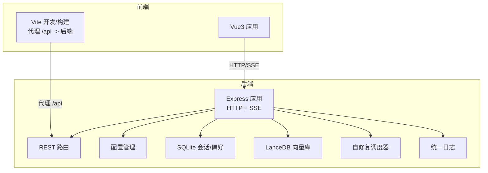
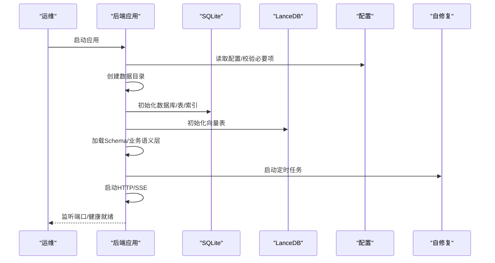
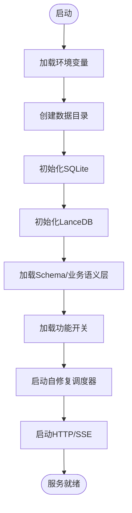
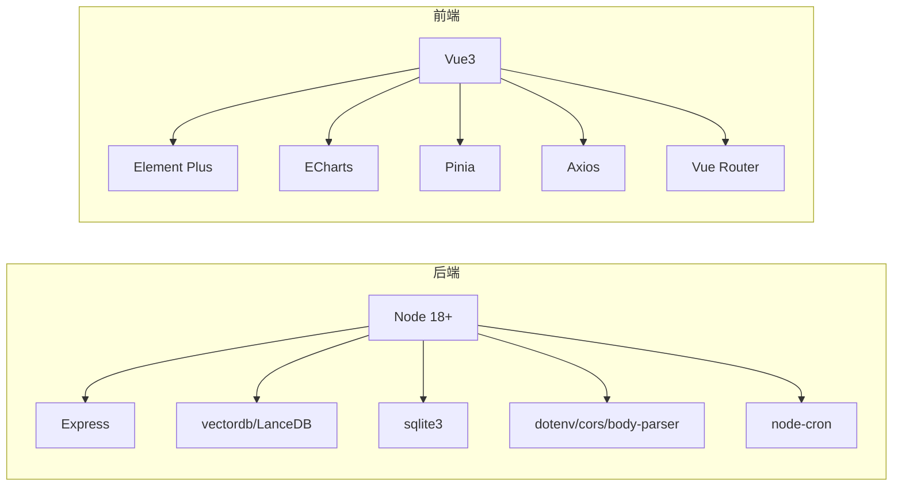

# 部署与运维

<cite>
**本文引用的文件**   
- [backend/package.json](file://backend/package.json)
- [frontend/package.json](file://frontend/package.json)
- [backend/src/app.js](file://backend/src/app.js)
- [backend/src/core/config.js](file://backend/src/core/config.js)
- [backend/src/core/database.js](file://backend/src/core/database.js)
- [backend/src/core/routes.js](file://backend/src/core/routes.js)
- [backend/src/core/selfRepair.js](file://backend/src/core/selfRepair.js)
- [backend/src/memory/vectorStore.js](file://backend/src/memory/vectorStore.js)
- [backend/src/utils/logger.js](file://backend/src/utils/logger.js)
- [backend/config/business-semantic-layer.json](file://backend/config/business-semantic-layer.json)
- [backend/config/schema-metadata.json](file://backend/config/schema-metadata.json)
- [backend/config/feature-flags.js](file://backend/config/feature-flags.js)
- [frontend/vite.config.js](file://frontend/vite.config.js)
- [docs/NL2SQL-进度追踪.md](file://docs/NL2SQL-进度追踪.md)
- [docs/记忆系统优化计划.md](file://docs/记忆系统优化计划.md)
</cite>

## 目录
1. [简介](#简介)
2. [项目结构](#项目结构)
3. [核心组件](#核心组件)
4. [架构总览](#架构总览)
5. [详细组件分析](#详细组件分析)
6. [依赖分析](#依赖分析)
7. [性能考虑](#性能考虑)
8. [故障排除指南](#故障排除指南)
9. [结论](#结论)
10. [附录](#附录)

## 简介
本文件面向运维工程师，提供NL2SQL项目的完整部署与运维指南。内容涵盖生产环境部署流程（环境配置、依赖安装、启动脚本）、容器化与编排策略（Docker与Kubernetes）、监控与日志、性能调优、安全与备份、灾难恢复、运维自动化与CI/CD建议，以及常见问题排查。

## 项目结构
NL2SQL采用前后端分离架构：
- 后端（Node.js + Express）：提供REST API、SSE流式响应、Schema与记忆系统、自修复机制、日志与配置管理。
- 前端（Vue3 + Vite）：聊天界面、Schema查看、历史记录等视图。
- 配置与数据：Schema元数据、业务语义层、功能开关、日志与向量数据库目录。

**图表来源**
- [frontend/vite.config.js:1-93](file://frontend/vite.config.js#L1-L93)
- [backend/src/app.js:1-260](file://backend/src/app.js#L1-L260)
- [backend/src/core/routes.js:1-1037](file://backend/src/core/routes.js#L1-L1037)
- [backend/src/core/config.js:1-398](file://backend/src/core/config.js#L1-L398)
- [backend/src/core/database.js:1-859](file://backend/src/core/database.js#L1-L859)
- [backend/src/memory/vectorStore.js:1-881](file://backend/src/memory/vectorStore.js#L1-L881)
- [backend/src/core/selfRepair.js:1-489](file://backend/src/core/selfRepair.js#L1-L489)
- [backend/src/utils/logger.js:1-442](file://backend/src/utils/logger.js#L1-L442)

**章节来源**
- [backend/package.json:1-28](file://backend/package.json#L1-L28)
- [frontend/package.json:1-36](file://frontend/package.json#L1-L36)
- [frontend/vite.config.js:1-93](file://frontend/vite.config.js#L1-L93)
- [backend/src/app.js:1-260](file://backend/src/app.js#L1-L260)

## 核心组件
- 配置中心：集中管理端口、LLM/Embedding、数据库、安全、日志、Schema、长期记忆、上下文管理、评估等配置，并在启动时校验必要项。
- 数据层：SQLite存储会话、消息、查询历史、用户偏好；LanceDB存储Schema与查询向量。
- API与SSE：提供健康检查、Schema查询、会话与偏好管理、查询历史、评估统计等接口。
- 自修复：基于定时任务的每日健康检查、会话清理、统计收集、记忆维护。
- 日志：统一日志模块，支持文件轮转、结构化日志、追踪上下文。
- 前端：Vite开发服务器与代理，构建产物部署至Nginx或静态托管。

**章节来源**
- [backend/src/core/config.js:1-398](file://backend/src/core/config.js#L1-L398)
- [backend/src/core/database.js:1-859](file://backend/src/core/database.js#L1-L859)
- [backend/src/memory/vectorStore.js:1-881](file://backend/src/memory/vectorStore.js#L1-L881)
- [backend/src/core/routes.js:1-1037](file://backend/src/core/routes.js#L1-L1037)
- [backend/src/core/selfRepair.js:1-489](file://backend/src/core/selfRepair.js#L1-L489)
- [backend/src/utils/logger.js:1-442](file://backend/src/utils/logger.js#L1-L442)

## 架构总览
后端服务启动时依次初始化数据目录、SQLite、LanceDB、Schema元数据与业务语义层、功能开关、自修复调度器，然后启动HTTP与SSE服务。前端通过Vite代理访问后端API。

**图表来源**
- [backend/src/app.js:97-188](file://backend/src/app.js#L97-L188)
- [backend/src/core/config.js:366-397](file://backend/src/core/config.js#L366-L397)
- [backend/src/core/database.js:206-267](file://backend/src/core/database.js#L206-L267)
- [backend/src/memory/vectorStore.js:233-263](file://backend/src/memory/vectorStore.js#L233-L263)
- [backend/src/core/selfRepair.js:60-125](file://backend/src/core/selfRepair.js#L60-L125)

## 详细组件分析

### 后端应用与启动流程
- 环境变量加载：通过dotenv加载.env文件。
- 中间件：CORS（生产建议限定origin）、JSON解析、URL编码解析。
- 路由挂载：/api前缀。
- 初始化顺序：数据目录 → SQLite → LanceDB → Schema/业务语义层 → 功能开关 → 自修复 → HTTP/SSE。
- 优雅关闭：关闭HTTP、SSE、自修复、数据库，再退出进程。

**图表来源**
- [backend/src/app.js:97-188](file://backend/src/app.js#L97-L188)

**章节来源**
- [backend/src/app.js:15-87](file://backend/src/app.js#L15-L87)
- [backend/src/app.js:97-188](file://backend/src/app.js#L97-L188)
- [backend/src/app.js:198-252](file://backend/src/app.js#L198-L252)

### 配置管理与安全
- 端口、运行环境、LLM/Embedding、数据库路径、SR数据库URL、安全白名单、DryRun、行数限制、查询超时、禁止关键字、敏感字段、会话过期、日志级别与文件、自修复计划任务、Schema缓存与重向量化、长期记忆与上下文管理、评估开关等。
- 启动校验：要求LLM API密钥与SR数据库URL有效，否则抛错。

**章节来源**
- [backend/src/core/config.js:16-397](file://backend/src/core/config.js#L16-L397)

### 数据与向量存储
- SQLite：sessions/messages/query_history/user_preferences/system_logs等表，含索引与外键。
- LanceDB：schema_vectors与query_vectors表，支持向量搜索、智能重排序、统计记录。

**章节来源**
- [backend/src/core/database.js:39-195](file://backend/src/core/database.js#L39-L195)
- [backend/src/core/database.js:206-345](file://backend/src/core/database.js#L206-L345)
- [backend/src/memory/vectorStore.js:233-324](file://backend/src/memory/vectorStore.js#L233-L324)
- [backend/src/memory/vectorStore.js:379-437](file://backend/src/memory/vectorStore.js#L379-L437)
- [backend/src/memory/vectorStore.js:452-538](file://backend/src/memory/vectorStore.js#L452-L538)

### API与SSE
- 健康检查：/api/health与/api/health/detail。
- Schema：/api/schema、/api/schema/tables/:tableName、/api/schema/search。
- 会话与偏好：/api/sessions、/api/sessions/:sessionId、/api/users/:userId/sessions、/api/sessions/:sessionId/messages、/api/preferences、/api/preferences/:userId/*。
- 查询历史：/api/queries/history。
- 评估：/api/evaluation/stats、/api/evaluation/stats/reset、/api/evaluation/schema-quality。
- SSE：/api/sse/stream（由SSE处理器提供）。

**章节来源**
- [backend/src/core/routes.js:72-137](file://backend/src/core/routes.js#L72-L137)
- [backend/src/core/routes.js:150-250](file://backend/src/core/routes.js#L150-L250)
- [backend/src/core/routes.js:266-398](file://backend/src/core/routes.js#L266-L398)
- [backend/src/core/routes.js:413-450](file://backend/src/core/routes.js#L413-L450)
- [backend/src/core/routes.js:524-664](file://backend/src/core/routes.js#L524-L664)
- [backend/src/core/routes.js:726-760](file://backend/src/core/routes.js#L726-L760)
- [backend/src/core/routes.js:771-800](file://backend/src/core/routes.js#L771-L800)

### 自修复与维护
- 定时任务：每日健康检查、会话清理（每30分钟）、统计收集（每5分钟）、记忆维护（每天凌晨3点）。
- 健康检查：数据库连通性、向量库状态、当日查询统计、活跃连接、系统内存与运行时长。
- 记忆维护：压缩与清理长期记忆。

**章节来源**
- [backend/src/core/selfRepair.js:60-125](file://backend/src/core/selfRepair.js#L60-L125)
- [backend/src/core/selfRepair.js:169-310](file://backend/src/core/selfRepair.js#L169-L310)
- [backend/src/core/selfRepair.js:341-373](file://backend/src/core/selfRepair.js#L341-L373)
- [backend/src/core/selfRepair.js:383-415](file://backend/src/core/selfRepair.js#L383-L415)
- [backend/src/core/selfRepair.js:425-445](file://backend/src/core/selfRepair.js#L425-L445)

### 日志与追踪
- 日志级别、文件轮转、控制台/文件输出、结构化元数据、追踪上下文（traceId、步骤、耗时）。
- 用于定位流程、错误与性能瓶颈。

**章节来源**
- [backend/src/utils/logger.js:54-442](file://backend/src/utils/logger.js#L54-L442)

### 前端构建与开发
- Vite开发服务器：本地端口、自动打开、/api代理至后端。
- 路径别名：@、@components、@views、@stores、@utils。
- 构建输出：dist目录，第三方库手动分包。
- 前端运行：开发时由Vite启动，生产构建后部署至Nginx或静态托管。

**章节来源**
- [frontend/vite.config.js:18-92](file://frontend/vite.config.js#L18-L92)

## 依赖分析
- 后端依赖：Express、vectordb、sqlite3、dotenv、cors、body-parser、uuid、dayjs、node-cron。
- 前端依赖：Vue3、Element Plus、ECharts、Pinia、Axios、Vue Router等。
- Node版本要求：>=18.0.0。

**图表来源**
- [backend/package.json:10-26](file://backend/package.json#L10-L26)
- [frontend/package.json:11-34](file://frontend/package.json#L11-L34)

**章节来源**
- [backend/package.json:1-28](file://backend/package.json#L1-L28)
- [frontend/package.json:1-36](file://frontend/package.json#L1-L36)

## 性能考虑
- 查询安全与限流：白名单表、最大返回行数、查询超时、禁止关键字、敏感字段脱敏。
- 日志与追踪：合理设置日志级别，避免trace/debug在生产环境造成I/O压力；利用追踪上下文定位慢查询。
- 向量检索：Schema与查询向量的topK与过滤策略；智能重排序减少无关表返回。
- 自修复：慢查询阈值、统计收集频率、会话清理周期。
- 前端：构建时第三方库分包，减少bundle体积；生产关闭source map。

**章节来源**
- [backend/src/core/config.js:140-170](file://backend/src/core/config.js#L140-L170)
- [backend/src/utils/logger.js:233-310](file://backend/src/utils/logger.js#L233-L310)
- [backend/src/memory/vectorStore.js:452-538](file://backend/src/memory/vectorStore.js#L452-L538)
- [backend/src/core/selfRepair.js:222-231](file://backend/src/core/selfRepair.js#L222-L231)
- [frontend/vite.config.js:72-92](file://frontend/vite.config.js#L72-L92)

## 故障排除指南
- 启动失败：检查必要配置（LLM API密钥、SR数据库URL），查看配置校验报错。
- 数据库异常：确认SQLite文件路径与权限、外键约束启用、迁移是否成功。
- 向量库不可用：确认LanceDB目录可写、表初始化成功；若未初始化，语义搜索功能降级。
- 健康检查失败：查看/api/health/detail组件状态，关注数据库、Schema、SSE连接数。
- 日志过多：调整日志级别，启用文件轮转，避免trace/debug在生产使用。
- CORS跨域：生产环境将origin限定为可信域名。
- 优雅关闭：容器停止时收到SIGTERM，确保资源释放与数据库关闭。

**章节来源**
- [backend/src/core/config.js:366-397](file://backend/src/core/config.js#L366-L397)
- [backend/src/core/database.js:206-267](file://backend/src/core/database.js#L206-L267)
- [backend/src/memory/vectorStore.js:233-263](file://backend/src/memory/vectorStore.js#L233-L263)
- [backend/src/core/routes.js:100-137](file://backend/src/core/routes.js#L100-L137)
- [backend/src/utils/logger.js:233-310](file://backend/src/utils/logger.js#L233-L310)
- [backend/src/app.js:63-72](file://backend/src/app.js#L63-L72)
- [backend/src/app.js:236-252](file://backend/src/app.js#L236-L252)

## 结论
NL2SQL项目具备清晰的前后端分离架构与完善的配置、日志、自修复与向量检索能力。生产部署建议严格配置安全参数、启用健康检查与日志轮转、合理设置查询安全与性能阈值，并结合容器化与编排实现弹性与可观测性。

## 附录

### A. 生产环境部署流程
- 环境准备
  - 安装Node.js（>=18）、系统包管理器安装sqlite3依赖。
  - 准备数据目录（默认./data），确保后端进程有读写权限。
- 依赖安装
  - 后端：npm ci
  - 前端：npm ci
- 环境变量
  - LLM_API_BASE、LLM_API_KEY、LLM_MODEL、EMBEDDING_MODEL、DB_PATH、VECTOR_DB_PATH、SR_DATABASE_URL、ALLOWED_TABLES、LOG_LEVEL、LOG_FILE、PORT等。
- 启动
  - 后端：npm run start
  - 前端：npm run build，部署dist至Nginx或静态托管；或使用Vite dev（开发）。
- 健康检查
  - GET /api/health 与 /api/health/detail

**章节来源**
- [backend/package.json:6-8](file://backend/package.json#L6-L8)
- [frontend/package.json:6-10](file://frontend/package.json#L6-L10)
- [backend/src/core/config.js:26](file://backend/src/core/config.js#L26)
- [backend/src/core/config.js:99](file://backend/src/core/config.js#L99)
- [backend/src/core/config.js:108](file://backend/src/core/config.js#L108)
- [backend/src/core/config.js:118](file://backend/src/core/config.js#L118)
- [backend/src/core/config.js:204](file://backend/src/core/config.js#L204)
- [backend/src/core/config.js:242](file://backend/src/core/config.js#L242)
- [backend/src/core/routes.js:72-137](file://backend/src/core/routes.js#L72-L137)

### B. Docker容器化部署
- 建议镜像
  - Node.js官方镜像（>=18）
  - 前端构建阶段使用Node，运行阶段使用Nginx或静态文件服务
- 关键点
  - 挂载数据卷：/opt/nl2sql/data（SQLite/LanceDB）
  - 环境变量：通过docker run -e或.env文件注入
  - 端口：3000（HTTP/SSE）
  - 健康探针：/api/health
- 示例（概念性）
  - 构建后端镜像，复制dist至Nginx镜像，暴露3000端口，挂载数据卷

[本节为概念性说明，不直接对应具体源码文件]

### C. Kubernetes编排策略
- Deployment
  - replicas=2+，滚动更新
  - readinessProbe/livenessProbe：/api/health
- Service
  - ClusterIP或Ingress暴露
- ConfigMap
  - 存放LLM/Embedding/数据库URL等配置
- Secret
  - 存放API密钥、数据库密码
- PersistentVolume
  - 挂载后端数据目录（SQLite/LanceDB）
- HPA
  - CPU/内存或自定义指标扩缩容

[本节为概念性说明，不直接对应具体源码文件]

### D. 监控指标与日志管理
- 指标
  - /api/health与/api/health/detail返回的内存、运行时长、SSE连接数
  - 自修复统计：慢查询、失败率、活跃会话
  - 评估接口：向量化质量与命中率统计
- 日志
  - 文件轮转、结构化元数据、追踪上下文
  - 生产环境建议：info级别，启用文件输出，控制台输出可按需关闭

**章节来源**
- [backend/src/core/routes.js:72-137](file://backend/src/core/routes.js#L72-L137)
- [backend/src/core/selfRepair.js:216-247](file://backend/src/core/selfRepair.js#L216-L247)
- [backend/src/utils/logger.js:175-251](file://backend/src/utils/logger.js#L175-L251)

### E. 安全配置
- 白名单表、最大返回行数、查询超时、禁止关键字、敏感字段脱敏
- CORS生产限定origin
- 干跑模式（DRY_RUN）仅用于开发调试

**章节来源**
- [backend/src/core/config.js:140-170](file://backend/src/core/config.js#L140-L170)
- [backend/src/app.js:63-72](file://backend/src/app.js#L63-L72)

### F. 备份策略与灾难恢复
- 备份
  - SQLite数据库文件（sessions.db）定期备份
  - 向量数据库目录（vectordb）整体备份
- 恢复
  - 停机窗口内恢复文件，重启服务
  - 若向量库损坏，可通过配置强制重向量化（revectorize）

**章节来源**
- [backend/src/core/database.js:206-267](file://backend/src/core/database.js#L206-L267)
- [backend/src/memory/vectorStore.js:233-263](file://backend/src/memory/vectorStore.js#L233-L263)
- [backend/src/core/config.js:248](file://backend/src/core/config.js#L248)

### G. 运维自动化与CI/CD
- CI
  - 代码检查、单元测试（如有）、前端构建与后端构建
- CD
  - Docker镜像构建与推送
  - K8s部署（Helm/ArgoCD/Flux）
  - 健康检查与就绪探针
- 建议
  - 金丝雀发布、蓝绿部署
  - 自动化备份与快照

[本节为通用运维建议，不直接对应具体源码文件]

### H. 业务语义层与Schema元数据
- 业务语义层：将“老平台”等业务概念映射到物理表/字段，提升检索准确性。
- Schema元数据：表、字段、指标、维度定义，支持向量化与智能搜索。

**章节来源**
- [backend/config/business-semantic-layer.json:1-189](file://backend/config/business-semantic-layer.json#L1-L189)
- [backend/config/schema-metadata.json:1-800](file://backend/config/schema-metadata.json#L1-L800)

### I. 功能开关与Phase演进
- 功能开关：工具化Schema探索、动态意图拆解、澄清机制、Agentic引擎、自我修正等。
- Phase演进：按阶段逐步启用，支持快速回滚。

**章节来源**
- [backend/config/feature-flags.js:16-96](file://backend/config/feature-flags.js#L16-L96)
- [backend/src/app.js:141-147](file://backend/src/app.js#L141-L147)

### J. 进度与优化计划参考
- 记忆系统优化：Token感知摘要触发、置顶记忆保护、异步记忆队列、Schema增量更新。
- 进度追踪：各阶段完成度与剩余任务。

**章节来源**
- [docs/记忆系统优化计划.md:1-226](file://docs/记忆系统优化计划.md#L1-L226)
- [docs/NL2SQL-进度追踪.md:1-265](file://docs/NL2SQL-进度追踪.md#L1-L265)