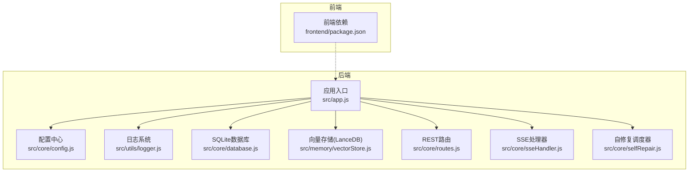
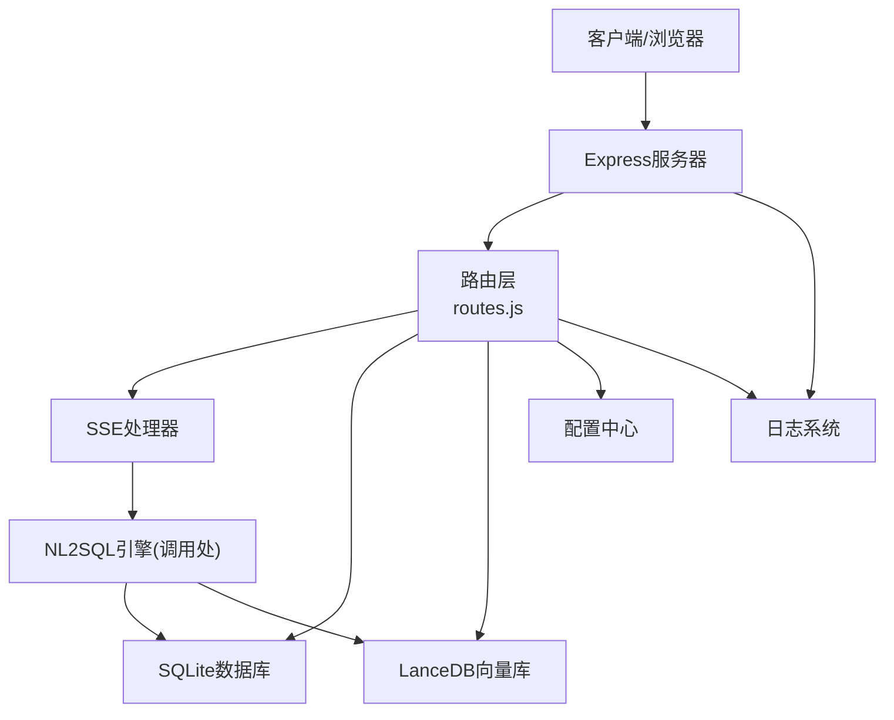
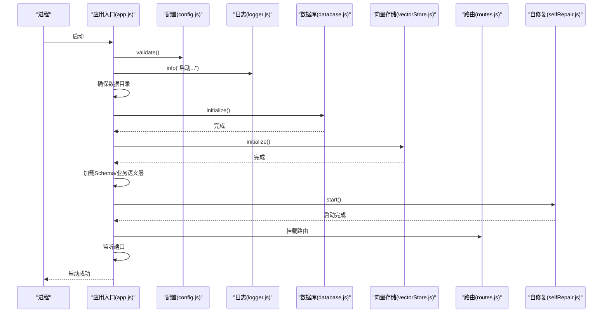

# 部署与运维

<cite>
**本文引用的文件**
- [backend/package.json](file://backend/package.json)
- [backend/src/app.js](file://backend/src/app.js)
- [backend/src/core/config.js](file://backend/src/core/config.js)
- [backend/src/utils/logger.js](file://backend/src/utils/logger.js)
- [backend/src/core/selfRepair.js](file://backend/src/core/selfRepair.js)
- [backend/src/core/routes.js](file://backend/src/core/routes.js)
- [backend/src/core/database.js](file://backend/src/core/database.js)
- [backend/src/memory/vectorStore.js](file://backend/src/memory/vectorStore.js)
- [backend/src/core/sseHandler.js](file://backend/src/core/sseHandler.js)
- [backend/config/business-semantic-layer.json](file://backend/config/business-semantic-layer.json)
- [backend/config/schema-metadata.json](file://backend/config/schema-metadata.json)
- [backend/config/feature-flags.js](file://backend/config/feature-flags.js)
- [frontend/package.json](file://frontend/package.json)
</cite>

## 目录
1. [简介](#简介)
2. [项目结构](#项目结构)
3. [核心组件](#核心组件)
4. [架构总览](#架构总览)
5. [详细组件分析](#详细组件分析)
6. [依赖分析](#依赖分析)
7. [性能考虑](#性能考虑)
8. [故障排查指南](#故障排查指南)
9. [结论](#结论)
10. [附录](#附录)

## 简介
本指南面向NL2SQL项目的部署与运维团队，提供从环境准备、依赖安装、配置设置到服务启动的完整流程；涵盖Docker容器化部署方案（镜像构建、容器编排、环境变量配置）；详述监控与日志体系（日志级别、性能指标、告警配置）；给出运维最佳实践（备份策略、升级流程、故障恢复）；说明自修复机制（健康检查、自动重启、维护任务）；并提供性能调优建议、容量规划与扩展策略。

## 项目结构
NL2SQL采用前后端分离架构：
- 后端（Node.js + Express）：提供REST API、SSE流式输出、数据库与向量存储管理、自修复调度、日志与配置管理。
- 前端（Vue 3 + Vite）：提供交互界面，调用后端API与SSE端点。
- 配置与元数据：包含Schema元数据、业务语义层配置、功能开关等。

图表来源
- [backend/src/app.js:1-266](file://backend/src/app.js#L1-L266)
- [backend/src/core/config.js:1-398](file://backend/src/core/config.js#L1-L398)
- [backend/src/utils/logger.js:1-482](file://backend/src/utils/logger.js#L1-L482)
- [backend/src/core/database.js:1-800](file://backend/src/core/database.js#L1-L800)
- [backend/src/memory/vectorStore.js:1-800](file://backend/src/memory/vectorStore.js#L1-L800)
- [backend/src/core/routes.js:1-800](file://backend/src/core/routes.js#L1-L800)
- [backend/src/core/sseHandler.js:1-349](file://backend/src/core/sseHandler.js#L1-L349)
- [backend/src/core/selfRepair.js:1-489](file://backend/src/core/selfRepair.js#L1-L489)
- [frontend/package.json:1-36](file://frontend/package.json#L1-L36)

章节来源
- [backend/src/app.js:1-266](file://backend/src/app.js#L1-L266)
- [frontend/package.json:1-36](file://frontend/package.json#L1-L36)

## 核心组件
- 应用入口与初始化：加载环境变量、导入核心模块、创建HTTP服务器、初始化数据库与向量存储、加载Schema与业务语义层、启动自修复调度器、监听端口。
- 配置中心：集中管理端口、LLM/Embedding、数据库、安全策略、日志、自修复、Schema、长期记忆、上下文管理、评估等配置，并提供配置校验。
- 日志系统：统一日志记录，支持控制台与文件输出、日志轮转、结构化元数据、追踪上下文。
- 数据库：SQLite会话与历史、偏好、系统日志等表结构，提供CRUD与事务封装。
- 向量存储：基于LanceDB的Schema与查询历史向量存储，支持语义检索与智能重排序。
- 路由与SSE：REST API与SSE流式输出，支持健康检查、Schema查询、会话与偏好管理、评估统计。
- 自修复：定时任务（每日自检、会话清理、统计收集、记忆维护）、健康报告、手动触发。

章节来源
- [backend/src/app.js:97-194](file://backend/src/app.js#L97-L194)
- [backend/src/core/config.js:16-398](file://backend/src/core/config.js#L16-L398)
- [backend/src/utils/logger.js:54-482](file://backend/src/utils/logger.js#L54-L482)
- [backend/src/core/database.js:39-195](file://backend/src/core/database.js#L39-L195)
- [backend/src/memory/vectorStore.js:233-324](file://backend/src/memory/vectorStore.js#L233-L324)
- [backend/src/core/routes.js:60-137](file://backend/src/core/routes.js#L60-L137)
- [backend/src/core/sseHandler.js:43-112](file://backend/src/core/sseHandler.js#L43-L112)
- [backend/src/core/selfRepair.js:60-125](file://backend/src/core/selfRepair.js#L60-L125)

## 架构总览
后端服务通过Express提供REST API与SSE端点，内部依赖SQLite与LanceDB两类存储；配置中心统一管理运行参数；日志系统贯穿全链路；自修复模块保障系统健康。

图表来源
- [backend/src/core/routes.js:1-800](file://backend/src/core/routes.js#L1-L800)
- [backend/src/core/sseHandler.js:1-349](file://backend/src/core/sseHandler.js#L1-L349)
- [backend/src/core/database.js:1-800](file://backend/src/core/database.js#L1-L800)
- [backend/src/memory/vectorStore.js:1-800](file://backend/src/memory/vectorStore.js#L1-L800)
- [backend/src/core/config.js:1-398](file://backend/src/core/config.js#L1-L398)
- [backend/src/utils/logger.js:1-482](file://backend/src/utils/logger.js#L1-L482)

## 详细组件分析

### 应用入口与启动流程
- 加载环境变量，导入核心模块（配置、日志、数据库、向量存储、路由、自修复）。
- 初始化：验证配置、确保数据目录、初始化SQLite与LanceDB、加载Schema与业务语义层、打印功能开关、启动自修复、监听端口。
- 优雅关闭：停止接受新连接、关闭SSE、停止定时任务、关闭数据库、退出进程。
- 异常处理：未处理Promise拒绝与未捕获异常均记录并触发优雅关闭。

图表来源
- [backend/src/app.js:97-194](file://backend/src/app.js#L97-L194)
- [backend/src/core/config.js:366-398](file://backend/src/core/config.js#L366-L398)
- [backend/src/core/database.js:206-267](file://backend/src/core/database.js#L206-L267)
- [backend/src/memory/vectorStore.js:233-263](file://backend/src/memory/vectorStore.js#L233-L263)
- [backend/src/core/selfRepair.js:60-125](file://backend/src/core/selfRepair.js#L60-L125)

章节来源
- [backend/src/app.js:97-194](file://backend/src/app.js#L97-L194)
- [backend/src/app.js:204-258](file://backend/src/app.js#L204-L258)

### 配置管理
- 环境变量驱动：端口、运行环境、LLM/Embedding、数据库路径、SR数据库URL、安全策略（白名单、DryRun、行数限制、查询超时、禁止关键字、敏感字段）、日志级别与文件、自修复策略、Schema缓存与重向量化、长期记忆与上下文管理、评估开关。
- 配置校验：要求LLM API Key与SR数据库URL有效，若ALLOWED_TABLES为空给出生产风险提示。

章节来源
- [backend/src/core/config.js:26-398](file://backend/src/core/config.js#L26-L398)

### 日志系统
- 多通道输出：控制台彩色输出与文件输出，支持日志轮转（大小阈值与文件数量）。
- 级别控制：trace/debug/info/warn/error，可通过配置调整。
- 结构化元数据：记录请求、错误堆栈、统计信息。
- 追踪上下文：支持traceId关联多条日志，定期清理僵尸追踪条目。

章节来源
- [backend/src/utils/logger.js:54-482](file://backend/src/utils/logger.js#L54-L482)

### 数据库与向量存储
- SQLite：会话、消息、查询历史、用户偏好、系统日志等表，索引优化，事务封装，迁移修复。
- LanceDB：schema_vectors与query_vectors表，支持向量搜索、智能重排序、统计记录。

章节来源
- [backend/src/core/database.js:39-195](file://backend/src/core/database.js#L39-L195)
- [backend/src/memory/vectorStore.js:233-324](file://backend/src/memory/vectorStore.js#L233-L324)

### 路由与SSE
- REST API：健康检查、Schema查询、会话管理、查询历史、用户偏好、评估统计。
- SSE：连接管理、进度回调、结果广播、连接统计。

章节来源
- [backend/src/core/routes.js:60-137](file://backend/src/core/routes.js#L60-L137)
- [backend/src/core/sseHandler.js:43-112](file://backend/src/core/sseHandler.js#L43-L112)

### 自修复机制
- 定时任务：每日自检（数据库、向量库、查询统计、连接数、系统资源）、会话清理、统计收集、记忆维护。
- 健康报告：保存到系统日志表。
- 手动触发：支持手动触发各类检查与维护。

章节来源
- [backend/src/core/selfRepair.js:60-125](file://backend/src/core/selfRepair.js#L60-L125)
- [backend/src/core/selfRepair.js:169-310](file://backend/src/core/selfRepair.js#L169-L310)
- [backend/src/core/selfRepair.js:341-415](file://backend/src/core/selfRepair.js#L341-L415)

## 依赖分析
- 后端依赖：Express、vectordb、sqlite3、dotenv、cors、body-parser、uuid、dayjs、node-cron。
- 前端依赖：Vue 3、Element Plus、Axios、Pinia、Vue Router等。
- Node版本要求：>= 18.0.0。

章节来源
- [backend/package.json:10-26](file://backend/package.json#L10-L26)
- [frontend/package.json:11-29](file://frontend/package.json#L11-L29)

## 性能考虑
- 日志级别与轮转：生产环境建议提升日志级别，合理设置轮转大小与文件数，避免I/O瓶颈。
- 查询限制：通过安全配置限制单次查询返回行数与超时，防止大查询拖垮服务。
- 向量检索：合理设置topK与过滤条件，避免过度搜索；利用智能重排序减少无关表返回。
- 连接与并发：SSE连接数与数据库连接池需匹配，避免连接耗尽；必要时启用负载均衡与水平扩展。
- 评估与监控：结合自修复统计与SSE连接数，持续观察慢查询与内存使用。

[本节为通用指导，无需特定文件引用]

## 故障排查指南
- 健康检查：使用健康端点确认数据库、LLM配置、Schema加载、SSE连接状态。
- 日志定位：查看应用日志与文件输出，关注错误堆栈与元数据；利用追踪上下文定位流程节点。
- 数据库问题：检查SQLite表结构与索引，确认迁移是否成功；核对连接池配置。
- 向量库问题：确认LanceDB目录权限与磁盘空间；检查向量表初始化与统计。
- 自修复：查看每日自检报告与系统日志，关注失败率、慢查询与内存使用率。

章节来源
- [backend/src/core/routes.js:100-137](file://backend/src/core/routes.js#L100-L137)
- [backend/src/utils/logger.js:312-322](file://backend/src/utils/logger.js#L312-L322)
- [backend/src/core/database.js:277-404](file://backend/src/core/database.js#L277-L404)
- [backend/src/memory/vectorStore.js:233-263](file://backend/src/memory/vectorStore.js#L233-L263)
- [backend/src/core/selfRepair.js:169-310](file://backend/src/core/selfRepair.js#L169-L310)

## 结论
NL2SQL提供了完善的配置中心、日志系统、数据库与向量存储、REST与SSE接口以及自修复机制。按照本指南完成环境准备、配置校验、服务启动与监控告警，即可实现稳定可靠的NL2SQL服务交付与运维。

[本节为总结，无需特定文件引用]

## 附录

### A. 部署与运维操作指南

- 环境准备
  - 安装Node.js（>= 18.0.0）与包管理器。
  - 准备数据目录（默认 ./data），确保读写权限。
  - 准备SR数据库连接URL与LLM API Key。
  - 准备业务语义层与Schema元数据文件。

- 依赖安装
  - 后端：安装依赖后端启动脚本为“start”。
  - 前端：安装依赖后可构建静态资源。

- 配置设置
  - 环境变量：参考配置中心定义，至少设置端口、NODE_ENV、LLM_API_BASE、LLM_API_KEY、SR_DATABASE_URL、DB_PATH、VECTOR_DB_PATH、LOG_LEVEL、LOG_FILE、ALLOWED_TABLES等。
  - 功能开关：通过feature-flags.js控制Phase级功能开关。
  - 业务语义层：启用业务语义层时加载business-semantic-layer.json。
  - Schema元数据：加载schema-metadata.json，支持缓存与重向量化。

- 服务启动
  - 开发模式：使用“dev”脚本（nodemon自动重启）。
  - 生产模式：使用“start”脚本启动Node进程。
  - 启动顺序：配置校验 → 数据目录 → SQLite初始化 → LanceDB初始化 → Schema/业务语义层 → 自修复 → 监听端口。
  - 优雅关闭：接收SIGTERM/SIGINT后，关闭HTTP、SSE、定时任务、数据库，再退出进程。

- Docker容器化部署
  - 镜像构建：基于Node 18镜像，复制依赖与源码，安装依赖，暴露端口，设置启动命令。
  - 容器编排：挂载数据卷至/data，挂载日志卷至/logs，映射端口，注入环境变量（LLM、数据库、日志级别等）。
  - 环境变量：建议通过环境变量文件或编排工具注入，避免硬编码。
  - 健康检查：使用/health端点进行容器健康探针。
  - 数据持久化：将./data与./logs映射为持久卷。

- 监控与日志
  - 日志级别：生产环境建议info及以上，必要时debug。
  - 日志轮转：合理设置最大文件大小与保留数量。
  - 性能指标：关注SSE连接数、内存使用、查询失败率、慢查询阈值、向量库统计。
  - 告警配置：基于自修复报告与健康端点状态设置阈值告警。

- 运维最佳实践
  - 备份策略：定期备份SQLite数据库文件与向量库目录；记录备份时间与版本。
  - 升级流程：灰度发布，先在预生产验证；升级前备份，回滚预案就绪。
  - 故障恢复：优先检查健康端点与日志；必要时手动触发自修复任务；重启容器后验证。

- 自修复机制配置与使用
  - 启用与禁用：通过配置中心与功能开关控制。
  - 定时任务：每日自检、会话清理、统计收集、记忆维护；可手动触发。
  - 健康报告：检查系统日志表中的报告内容。

- 性能调优与扩展
  - 调优：降低日志级别、限制查询行数与超时、优化向量topK与过滤、合理设置连接池。
  - 容量规划：根据SSE连接数与内存使用峰值规划CPU/内存；评估向量库磁盘占用。
  - 扩展策略：水平扩展（多副本+负载均衡）、读写分离（只读副本）、缓存（Schema缓存、日志轮转策略）。

章节来源
- [backend/src/app.js:15-194](file://backend/src/app.js#L15-L194)
- [backend/src/core/config.js:26-398](file://backend/src/core/config.js#L26-L398)
- [backend/src/core/selfRepair.js:60-125](file://backend/src/core/selfRepair.js#L60-L125)
- [backend/src/core/routes.js:60-137](file://backend/src/core/routes.js#L60-L137)
- [backend/src/utils/logger.js:54-482](file://backend/src/utils/logger.js#L54-L482)
- [backend/config/business-semantic-layer.json:1-189](file://backend/config/business-semantic-layer.json#L1-L189)
- [backend/config/schema-metadata.json:1-800](file://backend/config/schema-metadata.json#L1-L800)
- [backend/config/feature-flags.js:16-96](file://backend/config/feature-flags.js#L16-L96)