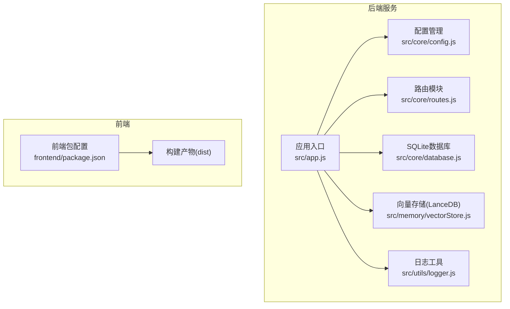
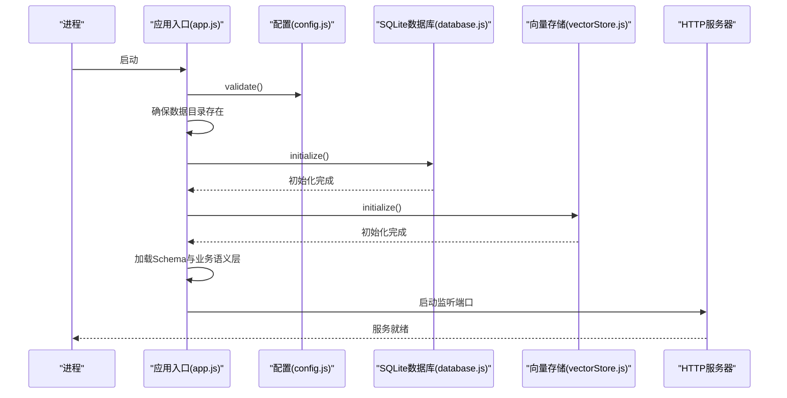
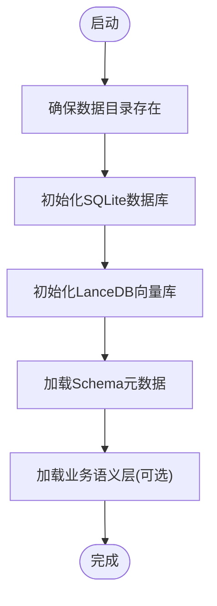
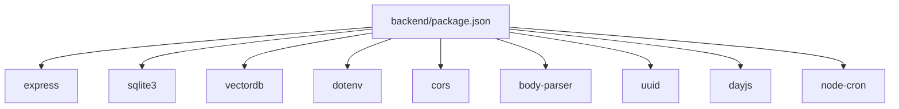

# 部署指南

<cite>
**本文引用的文件**
- [backend/package.json](file://backend/package.json)
- [frontend/package.json](file://frontend/package.json)
- [backend/src/app.js](file://backend/src/app.js)
- [backend/src/core/config.js](file://backend/src/core/config.js)
- [backend/src/core/database.js](file://backend/src/core/database.js)
- [backend/src/memory/vectorStore.js](file://backend/src/memory/vectorStore.js)
- [backend/src/utils/logger.js](file://backend/src/utils/logger.js)
- [backend/src/core/routes.js](file://backend/src/core/routes.js)
- [backend/config/schema-metadata.example.json](file://backend/config/schema-metadata.example.json)
- [backend/config/business-semantic-layer.json](file://backend/config/business-semantic-layer.json)
- [backend/config/feature-flags.js](file://backend/config/feature-flags.js)
</cite>

## 目录
1. [简介](#简介)
2. [项目结构](#项目结构)
3. [核心组件](#核心组件)
4. [架构概览](#架构概览)
5. [详细组件分析](#详细组件分析)
6. [依赖分析](#依赖分析)
7. [性能考虑](#性能考虑)
8. [故障排查指南](#故障排查指南)
9. [结论](#结论)
10. [附录](#附录)

## 简介
本指南面向运维与开发团队，提供NL2SQL项目的完整部署方案，涵盖环境准备、安装步骤、生产最佳实践、Docker部署、环境变量与SSL配置、反向代理设置以及部署验证与常见问题解决。目标是帮助您在Linux/Windows/macOS环境中快速、稳定地部署NL2SQL后端服务，并结合前端静态资源提供完整的上线能力。

## 项目结构
NL2SQL采用前后端分离架构：
- 后端：基于Node.js + Express，提供REST API、SSE流式响应、Schema与语义层管理、SQLite/LanceDB数据持久化与向量存储。
- 前端：基于Vue 3 + Vite，构建完成后输出静态资源，可由后端统一托管或由Nginx/Apache提供。

**图表来源**
- [backend/src/app.js:1-266](file://backend/src/app.js#L1-L266)
- [backend/src/core/config.js:1-398](file://backend/src/core/config.js#L1-L398)
- [backend/src/core/routes.js:1-200](file://backend/src/core/routes.js#L1-L200)
- [backend/src/core/database.js:1-800](file://backend/src/core/database.js#L1-L800)
- [backend/src/memory/vectorStore.js:1-200](file://backend/src/memory/vectorStore.js#L1-L200)
- [backend/src/utils/logger.js:1-482](file://backend/src/utils/logger.js#L1-L482)
- [frontend/package.json:1-36](file://frontend/package.json#L1-L36)

**章节来源**
- [backend/src/app.js:1-266](file://backend/src/app.js#L1-L266)
- [frontend/package.json:1-36](file://frontend/package.json#L1-L36)

## 核心组件
- 应用入口与启动流程：负责加载环境变量、初始化配置、数据库与向量库、Schema与业务语义层、启动HTTP与SSE服务、优雅关闭。
- 配置管理：集中管理端口、LLM API、数据库、安全策略、日志、自修复、Schema与长期记忆等配置，并在启动时校验必要项。
- 路由与API：提供健康检查、Schema查询、会话与历史、统计等REST接口。
- 数据持久化：SQLite用于会话、消息、查询历史、用户偏好与系统日志；LanceDB用于向量化Schema与查询历史，支持语义检索。
- 日志系统：统一控制台与文件输出、多级别日志、结构化日志与追踪上下文。

**章节来源**
- [backend/src/app.js:97-194](file://backend/src/app.js#L97-L194)
- [backend/src/core/config.js:16-398](file://backend/src/core/config.js#L16-L398)
- [backend/src/core/routes.js:56-137](file://backend/src/core/routes.js#L56-L137)
- [backend/src/core/database.js:39-195](file://backend/src/core/database.js#L39-L195)
- [backend/src/memory/vectorStore.js:141-197](file://backend/src/memory/vectorStore.js#L141-L197)
- [backend/src/utils/logger.js:54-482](file://backend/src/utils/logger.js#L54-L482)

## 架构概览
后端服务启动时序如下：

**图表来源**
- [backend/src/app.js:97-194](file://backend/src/app.js#L97-L194)
- [backend/src/core/config.js:366-398](file://backend/src/core/config.js#L366-L398)
- [backend/src/core/database.js:206-267](file://backend/src/core/database.js#L206-L267)
- [backend/src/memory/vectorStore.js:1-200](file://backend/src/memory/vectorStore.js#L1-L200)

## 详细组件分析

### 环境准备与系统要求
- Node.js版本：后端工程明确要求Node.js版本≥18.0.0。
- 操作系统：Node.js可在Linux/Windows/macOS上运行，建议生产环境使用Linux以获得更好的稳定性与性能。
- 硬件资源建议：
  - CPU：至少2核（建议4核以上）
  - 内存：至少4GB（建议8GB以上）
  - 磁盘：后端SQLite与LanceDB数据目录需充足空间；Schema向量化数据随表规模增长而增加
  - 网络：开放服务端口（默认3000），若使用反向代理需开放代理端口

**章节来源**
- [backend/package.json:24-26](file://backend/package.json#L24-L26)

### 依赖安装与配置
- 安装后端依赖
  - 进入后端目录，执行依赖安装命令（使用npm）
  - 依赖清单包含Express、SQLite3、vectordb、dotenv、cors、body-parser、uuid、dayjs、node-cron等
- 安装前端依赖
  - 进入前端目录，执行依赖安装命令（使用npm）
  - 依赖清单包含Vue 3、Element Plus、Axios、Pinia、Vue Router等
- 构建前端静态资源
  - 在前端目录执行构建命令，生成dist目录下的静态资源
- 配置文件准备
  - 环境变量：后端通过dotenv加载.env文件，需在部署环境提供相应变量
  - Schema元数据：参考示例文件，按实际数据库结构调整
  - 业务语义层：按业务术语与物理表映射关系配置
  - 功能开关：通过环境变量控制各Phase功能的启用/禁用

**章节来源**
- [backend/package.json:10-23](file://backend/package.json#L10-L23)
- [frontend/package.json:11-34](file://frontend/package.json#L11-L34)
- [backend/config/schema-metadata.example.json:1-328](file://backend/config/schema-metadata.example.json#L1-L328)
- [backend/config/business-semantic-layer.json:1-189](file://backend/config/business-semantic-layer.json#L1-L189)
- [backend/config/feature-flags.js:16-96](file://backend/config/feature-flags.js#L16-L96)

### 数据库初始化与Schema加载
- SQLite数据库初始化
  - 启动时自动创建数据目录与数据库文件
  - 初始化会话、消息、查询历史、用户偏好、系统日志等表
  - 执行迁移修复旧表结构问题
- LanceDB向量数据库初始化
  - 初始化向量存储目录
  - 可按配置决定是否强制重新向量化Schema
- Schema与业务语义层加载
  - 从配置文件加载表结构、指标、维度与关系
  - 可选加载业务语义层，将业务概念映射到物理表/字段

**图表来源**
- [backend/src/app.js:110-153](file://backend/src/app.js#L110-L153)
- [backend/src/core/database.js:206-267](file://backend/src/core/database.js#L206-L267)
- [backend/src/memory/vectorStore.js:1-200](file://backend/src/memory/vectorStore.js#L1-L200)

**章节来源**
- [backend/src/app.js:110-153](file://backend/src/app.js#L110-L153)
- [backend/src/core/database.js:206-267](file://backend/src/core/database.js#L206-L267)

### 进程管理、端口与防火墙
- 端口配置
  - 默认监听端口来自配置，可通过环境变量覆盖
- 进程管理
  - 推荐使用PM2或systemd管理进程，实现自动重启、日志切割与健康检查
- 防火墙设置
  - 开放服务端口（默认3000），如使用反向代理，仅开放代理端口至公网

**章节来源**
- [backend/src/app.js:175-186](file://backend/src/app.js#L175-L186)
- [backend/src/core/config.js:26](file://backend/src/core/config.js#L26)

### Docker部署方案
- Dockerfile编写要点
  - 基础镜像：使用官方Node.js LTS镜像
  - 工作目录：设置为后端根目录
  - 安装依赖：先复制package*.json，再执行安装
  - 构建前端：在容器内执行前端构建，产出dist
  - 复制后端与前端产物：将后端源码与前端dist复制到镜像
  - 启动命令：使用生产脚本启动后端
  - 端口暴露：暴露服务端口
- 镜像构建
  - 在仓库根目录执行镜像构建命令
- 容器运行参数
  - 映射端口与数据卷（SQLite/LanceDB数据目录）
  - 挂载.env与配置文件
  - 设置环境变量（LLM API、数据库URL、白名单等）

[本节为通用部署建议，不直接分析具体文件，故不附“章节来源”]

### 环境变量配置
- 必填项
  - LLM_API_KEY：LLM服务密钥
  - SR_DATABASE_URL：业务数据库连接URL
- 常用项
  - PORT：服务端口
  - NODE_ENV：运行环境（development/production）
  - LLM_API_BASE：LLM API基础URL
  - LLM_MODEL：默认模型名称
  - EMBEDDING_MODEL：Embedding模型名称
  - DB_PATH：SQLite数据库文件路径
  - VECTOR_DB_PATH：LanceDB向量库目录
  - ALLOWED_TABLES：允许查询的数据表白名单（逗号分隔）
  - DRY_RUN：仅生成SQL不执行
  - MAX_QUERY_ROWS：单次查询最大返回行数
  - QUERY_TIMEOUT：查询超时时间（毫秒）
  - LOG_LEVEL/LOG_FILE：日志级别与文件路径
  - SCHEMA_CONFIG_PATH：Schema配置文件路径
  - SCHEMA_REVECTORIZE：是否强制重新向量化
  - 各功能开关：FF_* 环境变量控制各Phase功能启用/禁用

**章节来源**
- [backend/src/core/config.js:60-130](file://backend/src/core/config.js#L60-L130)
- [backend/src/core/config.js:140-170](file://backend/src/core/config.js#L140-L170)
- [backend/src/core/config.js:240-250](file://backend/src/core/config.js#L240-L250)
- [backend/config/feature-flags.js:16-96](file://backend/config/feature-flags.js#L16-L96)

### SSL证书与反向代理
- SSL证书
  - 建议使用Let’s Encrypt免费证书，或企业CA签发证书
  - 将证书与私钥放置在安全目录，权限设置为仅允许运行用户读取
- 反向代理
  - Nginx/Apache转发至后端服务端口
  - 配置HTTPS监听、证书路径、上游健康检查
  - 将静态资源（前端dist）由反向代理直接提供，减少后端压力

[本节为通用部署建议，不直接分析具体文件，故不附“章节来源”]

### 部署验证方法
- 健康检查
  - 访问健康接口，确认服务状态、版本、运行时间与内存使用
  - 访问详细健康接口，确认数据库、LLM、Schema、SSE连接状态
- Schema与业务语义层
  - 获取Schema信息，确认表、指标、维度加载正常
  - 若启用业务语义层，确认概念映射与查询模式可用
- 功能开关
  - 查看启动日志中的功能开关状态，确认启用的Phase符合预期
- SSE连接
  - 建立SSE连接，观察流式响应是否正常

**章节来源**
- [backend/src/core/routes.js:72-137](file://backend/src/core/routes.js#L72-L137)
- [backend/src/app.js:158-170](file://backend/src/app.js#L158-L170)
- [backend/config/feature-flags.js:209-229](file://backend/config/feature-flags.js#L209-L229)

## 依赖分析
后端主要外部依赖与用途：
- Express：Web服务器与路由
- sqlite3：SQLite数据库驱动
- vectordb：LanceDB向量数据库客户端
- dotenv：加载.env环境变量
- cors/body-parser：跨域与请求体解析
- uuid/dayjs：通用工具
- node-cron：定时任务（自修复）

**图表来源**
- [backend/package.json:10-23](file://backend/package.json#L10-L23)

**章节来源**
- [backend/package.json:10-23](file://backend/package.json#L10-L23)

## 性能考虑
- 查询限制
  - 通过白名单、最大返回行数、查询超时与禁止关键字降低风险与资源消耗
- 日志级别
  - 生产环境建议提升日志级别，减少IO开销
- 向量化与缓存
  - 合理设置Schema缓存与重向量化策略，平衡准确性与性能
- 连接池
  - 业务数据库连接池参数需根据并发与延迟特征调优

[本节提供通用指导，不直接分析具体文件，故不附“章节来源”]

## 故障排查指南
- 启动失败
  - 检查必要配置是否齐全（LLM API密钥、SR数据库URL）
  - 查看启动日志中的错误信息
- 数据库问题
  - 确认SQLite数据库文件路径与权限
  - 检查迁移是否成功，必要时清理损坏文件
- 向量库问题
  - 确认LanceDB目录权限与磁盘空间
  - 如需重向量化，设置强制重向量化标志
- 日志定位
  - 使用日志工具的追踪功能，关联同一会话的多条日志
- 异常与优雅关闭
  - 关注未处理异常与Promise拒绝，确保服务优雅关闭

**章节来源**
- [backend/src/core/config.js:366-398](file://backend/src/core/config.js#L366-L398)
- [backend/src/utils/logger.js:276-322](file://backend/src/utils/logger.js#L276-L322)
- [backend/src/app.js:204-258](file://backend/src/app.js#L204-L258)

## 结论
通过本指南，您可以在Linux/Windows/macOS环境中完成NL2SQL的部署与运维。建议在生产环境遵循进程管理、端口与防火墙、SSL与反向代理、日志与监控等最佳实践，并结合功能开关与Schema配置实现渐进式功能上线与回滚。

## 附录

### 端口与服务
- 服务端口：默认3000（可通过环境变量覆盖）
- SSE端点：/api/sse/stream（启动日志会打印）

**章节来源**
- [backend/src/app.js:175-186](file://backend/src/app.js#L175-L186)

### 健康检查接口
- GET /api/health：基础健康状态
- GET /api/health/detail：组件级健康状态（数据库、LLM、Schema、SSE）

**章节来源**
- [backend/src/core/routes.js:72-137](file://backend/src/core/routes.js#L72-L137)

### Schema与业务语义层
- Schema配置文件：按示例文件结构配置表、字段、指标、维度与关系
- 业务语义层：将业务概念映射到物理表/字段，支持多数据源与平台类型

**章节来源**
- [backend/config/schema-metadata.example.json:1-328](file://backend/config/schema-metadata.example.json#L1-L328)
- [backend/config/business-semantic-layer.json:1-189](file://backend/config/business-semantic-layer.json#L1-L189)