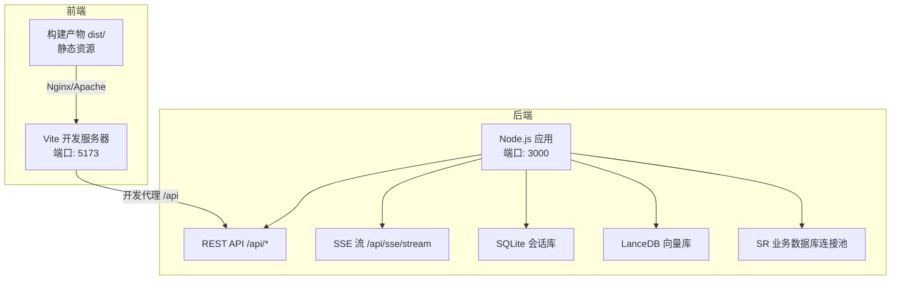
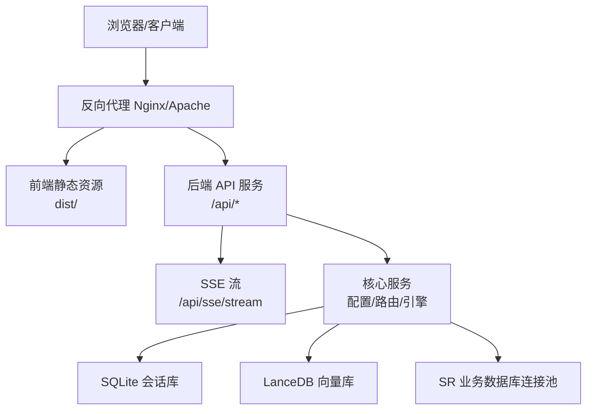
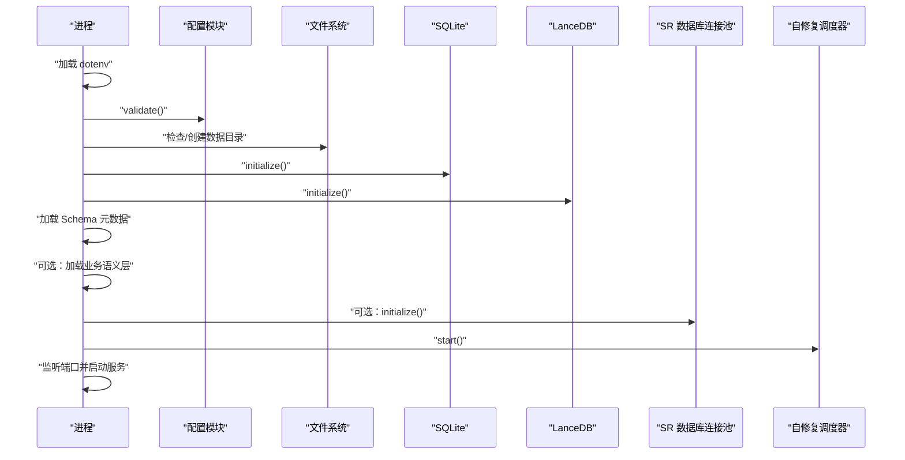
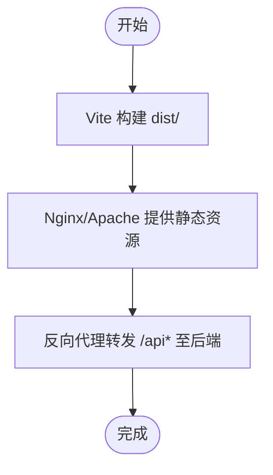
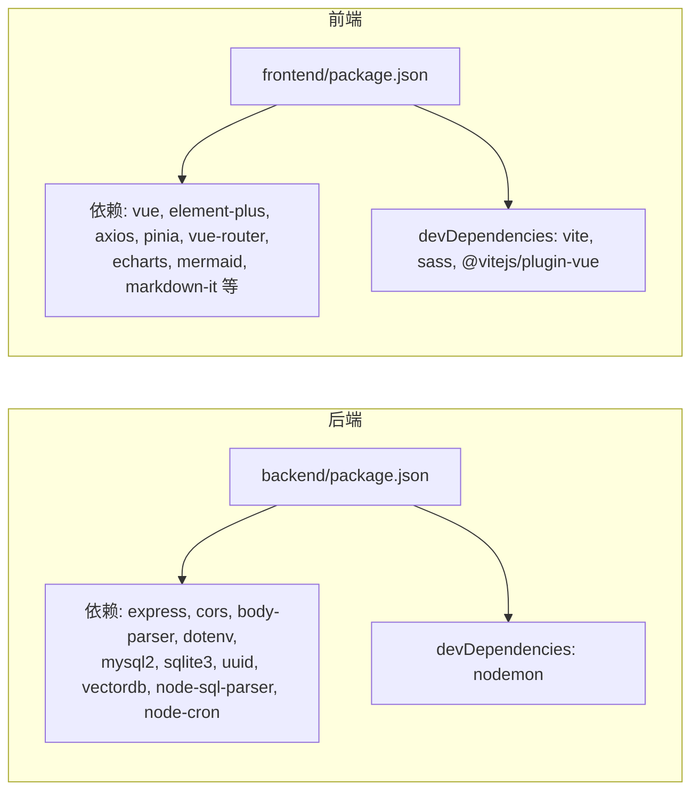

# 部署指南

<cite>
**本文引用的文件**
- [backend/package.json](file://backend/package.json)
- [frontend/package.json](file://frontend/package.json)
- [backend/src/app.js](file://backend/src/app.js)
- [backend/src/core/config.js](file://backend/src/core/config.js)
- [backend/config/feature-flags.js](file://backend/config/feature-flags.js)
- [frontend/vite.config.js](file://frontend/vite.config.js)
- [backend/config/schema-metadata.json](file://backend/config/schema-metadata.json)
</cite>

## 目录
1. [简介](#简介)
2. [项目结构](#项目结构)
3. [核心组件](#核心组件)
4. [架构总览](#架构总览)
5. [详细组件分析](#详细组件分析)
6. [依赖分析](#依赖分析)
7. [性能考虑](#性能考虑)
8. [故障排查指南](#故障排查指南)
9. [结论](#结论)
10. [附录](#附录)

## 简介
本指南面向系统管理员与 DevOps 工程师，提供 NL2SQL 系统的完整部署方案，涵盖开发与生产环境的部署流程、前后端分离部署策略、Docker 容器化方案、负载均衡与高可用架构、以及部署脚本与自动化工具的使用方法。系统采用 Node.js + Vue 3 技术栈，后端提供 REST API 与 SSE 流式接口，前端通过代理访问后端 API。

## 项目结构
NL2SQL 采用前后端分离架构：
- 后端（Node.js）：提供 REST API、SSE、数据库与向量数据库初始化、自修复调度等能力
- 前端（Vue 3 + Vite）：开发时通过代理访问后端 API，生产环境构建为静态资源
- 配置与数据：后端通过 dotenv 读取环境变量，配置集中于配置模块，Schema 元数据位于配置目录

图表来源
- [backend/src/app.js:88-196](file://backend/src/app.js#L88-L196)
- [frontend/vite.config.js:18-35](file://frontend/vite.config.js#L18-L35)

章节来源
- [backend/src/app.js:15-279](file://backend/src/app.js#L15-L279)
- [frontend/vite.config.js:17-92](file://frontend/vite.config.js#L17-L92)

## 核心组件
- 后端应用入口与生命周期
  - 应用启动时加载 dotenv、初始化配置、创建数据目录、初始化 SQLite/LanceDB、加载 Schema 元数据、启动自修复调度器，并监听端口对外提供服务
  - 支持优雅关闭，处理 SIGTERM/SIGINT，关闭 HTTP 服务器、SSE、定时任务与数据库连接
- 配置管理
  - 集中管理 LLM、Embedding、数据库、安全、日志、Schema、长期记忆、上下文管理、评估等配置，支持环境变量覆盖
  - 启动前进行必要配置校验（LLM API 密钥、SR 数据库 URL）
- 功能开关
  - 通过环境变量控制各 Phase 新功能的启用/禁用，支持全局启用/禁用与日志输出
- 前端构建与代理
  - Vite 开发服务器默认端口 5173，配置 /api 代理至后端本地 3000 端口；生产构建输出 dist 目录

章节来源
- [backend/src/app.js:99-204](file://backend/src/app.js#L99-L204)
- [backend/src/core/config.js:20-439](file://backend/src/core/config.js#L20-L439)
- [backend/config/feature-flags.js:16-294](file://backend/config/feature-flags.js#L16-L294)
- [frontend/vite.config.js:18-35](file://frontend/vite.config.js#L18-L35)

## 架构总览
NL2SQL 的部署架构分为三层：
- 前端静态资源层：由 Nginx/Apache 提供，指向 dist 目录
- API 层：后端 Node.js 应用，提供 REST API 与 SSE
- 数据层：SQLite（会话历史）、LanceDB（向量）、SR 业务数据库（连接池）

图表来源
- [backend/src/app.js:80-82](file://backend/src/app.js#L80-L82)
- [backend/src/app.js:186-196](file://backend/src/app.js#L186-L196)

## 详细组件分析

### 后端部署（Node.js）
- 环境要求
  - Node.js 版本要求：>= 18.0.0
- 依赖安装
  - 使用 npm 安装后端依赖
- 启动方式
  - 开发：使用 nodemon 监听文件变化
  - 生产：直接 node 启动
- 端口与服务
  - 默认监听端口 3000，可通过环境变量覆盖
  - 提供 /api 路由与 SSE 流端点
- 数据库初始化
  - 自动创建数据目录（若不存在）
  - 初始化 SQLite 会话库
  - 初始化 LanceDB 向量库
  - 加载 Schema 元数据
  - 可选：加载业务语义层
  - 可选：初始化 SR 业务数据库连接池
- 自修复与健康检查
  - 启动自修复调度器，定时执行健康检查与维护任务
- 优雅关闭
  - 监听 SIGTERM/SIGINT，依次关闭 HTTP 服务器、SSE、定时任务与数据库连接

图表来源
- [backend/src/app.js:99-204](file://backend/src/app.js#L99-L204)
- [backend/src/core/config.js:407-429](file://backend/src/core/config.js#L407-L429)

章节来源
- [backend/package.json:6-14](file://backend/package.json#L6-L14)
- [backend/src/app.js:186-196](file://backend/src/app.js#L186-L196)
- [backend/src/core/config.js:407-429](file://backend/src/core/config.js#L407-L429)

### 前端部署（静态资源）
- 构建
  - 使用 Vite 构建生产包，输出至 dist 目录
- 开发代理
  - 开发服务器默认端口 5173，配置 /api 代理至后端 3000 端口
- 生产部署
  - 将 dist 目录部署至 Nginx/Apache，提供静态资源服务

图表来源
- [frontend/vite.config.js:72-91](file://frontend/vite.config.js#L72-L91)
- [frontend/vite.config.js:18-35](file://frontend/vite.config.js#L18-L35)

章节来源
- [frontend/package.json:6-10](file://frontend/package.json#L6-L10)
- [frontend/vite.config.js:17-92](file://frontend/vite.config.js#L17-L92)

### 配置与环境变量
- 必要配置校验
  - LLM API 密钥与 SR 数据库 URL 必须配置，否则启动失败
- 关键配置项（示例）
  - 服务器端口、运行环境、LLM API 基础地址/密钥/模型/超时、Embedding 模型/维度/超时、数据库路径、SR 数据库 URL/超时/最大行数、安全白名单/脱敏规则/RLS、日志级别/文件、Schema 配置路径/缓存、功能开关等
- 功能开关
  - 通过环境变量控制各 Phase 新功能的启用/禁用，支持全局启用/禁用与日志输出

章节来源
- [backend/src/core/config.js:407-429](file://backend/src/core/config.js#L407-L429)
- [backend/src/core/config.js:20-439](file://backend/src/core/config.js#L20-L439)
- [backend/config/feature-flags.js:16-294](file://backend/config/feature-flags.js#L16-L294)

### Schema 元数据
- Schema 元数据文件用于描述业务表结构与字段，系统启动时加载该配置以支持语义检索与查询生成
- 建议在部署前确认该文件内容与目标数据库一致

章节来源
- [backend/config/schema-metadata.json:1-800](file://backend/config/schema-metadata.json#L1-L800)

## 依赖分析
- 后端依赖
  - Express、CORS、body-parser、dotenv、mysql2、sqlite3、uuid、vectordb、node-sql-parser、node-cron 等
- 前端依赖
  - Vue 3、Element Plus、Axios、Pinia、Vue Router、ECharts、Mermaid、Markdown-it 等
- 开发依赖
  - 后端：nodemon；前端：Vite、Sass、Vue 插件

图表来源
- [backend/package.json:16-31](file://backend/package.json#L16-L31)
- [frontend/package.json:11-34](file://frontend/package.json#L11-L34)

章节来源
- [backend/package.json:16-31](file://backend/package.json#L16-L31)
- [frontend/package.json:11-34](file://frontend/package.json#L11-L34)

## 性能考虑
- 数据库连接池
  - SR 数据库连接池默认最小 2、最大 10，可根据并发与数据库性能调整
- 查询限制
  - 可配置最大查询行数与查询超时，防止大查询导致内存与响应问题
- 日志轮转
  - 日志文件最大 10MB，最多保留 5 份，避免磁盘占用过大
- 构建优化
  - Vite 构建时对第三方库进行手动分块，减少首屏体积

章节来源
- [backend/src/core/config.js:132-142](file://backend/src/core/config.js#L132-L142)
- [backend/src/core/config.js:163-169](file://backend/src/core/config.js#L163-L169)
- [backend/src/core/config.js:250-254](file://backend/src/core/config.js#L250-L254)
- [frontend/vite.config.js:78-89](file://frontend/vite.config.js#L78-L89)

## 故障排查指南
- 启动失败（缺少必要配置）
  - 现象：启动时报错提示缺少 LLM API 密钥或 SR 数据库 URL
  - 处理：在 .env 中设置对应环境变量
- CORS 与代理问题
  - 现象：前端开发时跨域或代理失效
  - 处理：确认 Vite 代理配置 /api 指向后端 3000 端口
- 数据库初始化失败
  - 现象：SQLite 或 LanceDB 初始化报错
  - 处理：检查数据目录权限与磁盘空间
- 优雅关闭
  - 现象：容器停止或手动中断时资源未正确释放
  - 处理：确保接收 SIGTERM/SIGINT 并触发 graceful shutdown 流程

章节来源
- [backend/src/core/config.js:407-429](file://backend/src/core/config.js#L407-L429)
- [frontend/vite.config.js:24-34](file://frontend/vite.config.js#L24-L34)
- [backend/src/app.js:214-253](file://backend/src/app.js#L214-L253)

## 结论
本指南提供了 NL2SQL 系统从开发到生产的完整部署路径，包括前后端分离部署、静态资源构建、API 服务部署、环境变量配置、数据库初始化、功能开关控制与优雅关闭等关键环节。建议在生产环境中严格配置安全与性能参数，并结合反向代理与负载均衡实现高可用部署。

## 附录

### 开发环境部署步骤
- 安装 Node.js（>= 18）
- 安装后端依赖：在 backend 目录执行安装命令
- 安装前端依赖：在 frontend 目录执行安装命令
- 配置 .env（至少设置 LLM_API_KEY 与 SR_DATABASE_URL）
- 启动后端：在 backend 目录执行开发脚本
- 启动前端：在 frontend 目录执行开发脚本
- 访问前端：默认端口 5173，后端 API 代理至 3000 端口

章节来源
- [backend/package.json:6-14](file://backend/package.json#L6-L14)
- [frontend/package.json:6-10](file://frontend/package.json#L6-L10)
- [backend/src/core/config.js:407-429](file://backend/src/core/config.js#L407-L429)

### 生产环境部署步骤
- 构建前端：在 frontend 目录执行构建命令，产出 dist 目录
- 部署静态资源：将 dist 目录部署至 Nginx/Apache
- 部署后端：在 backend 目录安装依赖并启动 Node.js 应用
- 反向代理：配置 Nginx/Apache 将 /api* 转发至后端 3000 端口
- 域名与 SSL：在反向代理层配置域名与 SSL 证书
- 健康检查：暴露健康检查端点，定期探测后端存活

章节来源
- [frontend/package.json:8](file://frontend/package.json#L8)
- [frontend/vite.config.js:72-91](file://frontend/vite.config.js#L72-L91)
- [backend/src/app.js:80-82](file://backend/src/app.js#L80-L82)
- [backend/src/app.js:186-196](file://backend/src/app.js#L186-L196)

### Docker 容器化部署（建议）
- 构建镜像
  - 前端：基于 Nginx 镜像，复制 dist 目录
  - 后端：基于 Node.js 镜像，安装依赖并启动应用
- 容器编排
  - 使用 docker-compose 启动前端与后端容器，配置网络与端口映射
- 网络配置
  - 前端容器通过反向代理访问后端容器
- 健康检查
  - 在 compose 中配置健康检查探针，监控后端存活

[本节为概念性部署建议，不直接对应具体源文件，故无“章节来源”与“图表来源”标注]

### 负载均衡与高可用（建议）
- 反向代理
  - 使用 Nginx/Apache 作为入口，配置多后端实例轮询
- SSL 证书
  - 在反向代理层部署证书，启用 HTTPS
- 健康检查
  - 配置探针检测后端 /health（如存在）或端口连通性
- 自动扩缩容
  - 结合容器编排平台实现副本数动态调整

[本节为概念性部署建议，不直接对应具体源文件，故无“章节来源”与“图表来源”标注]